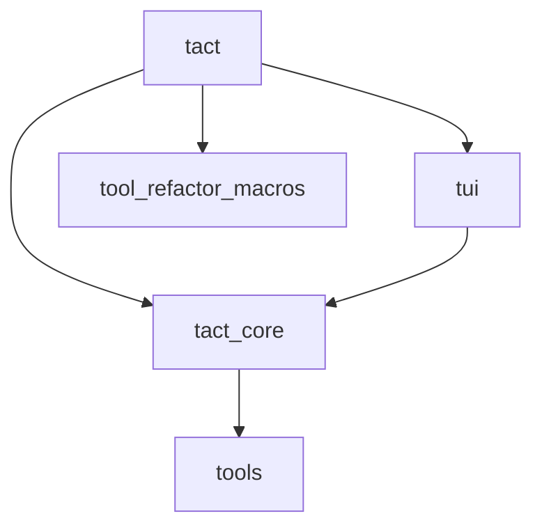
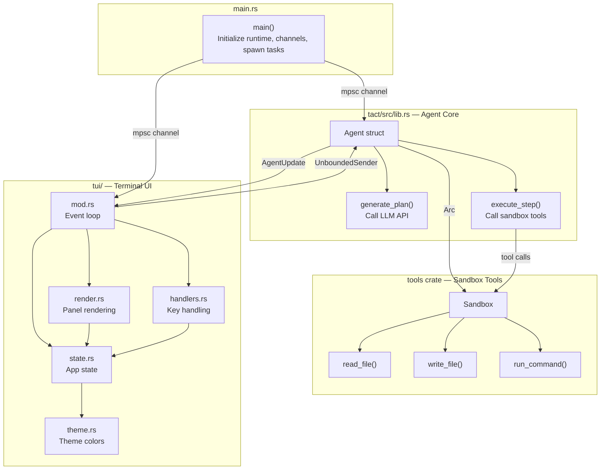
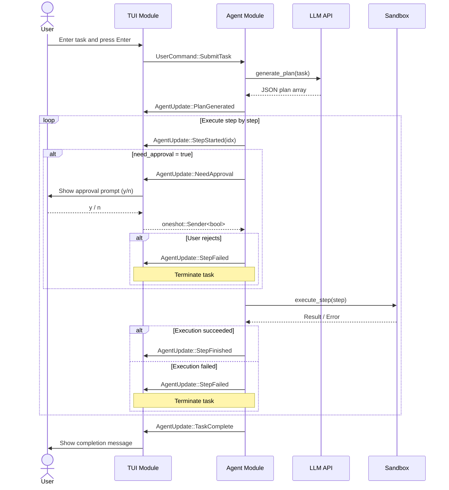
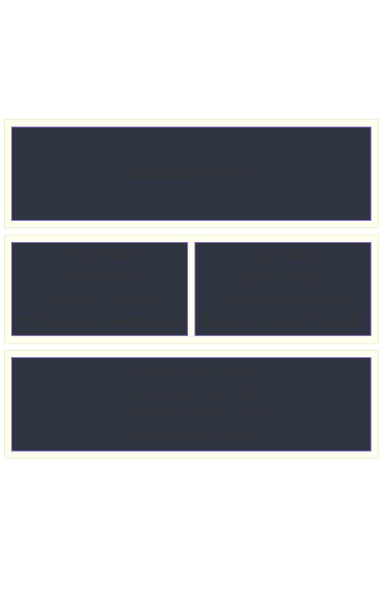
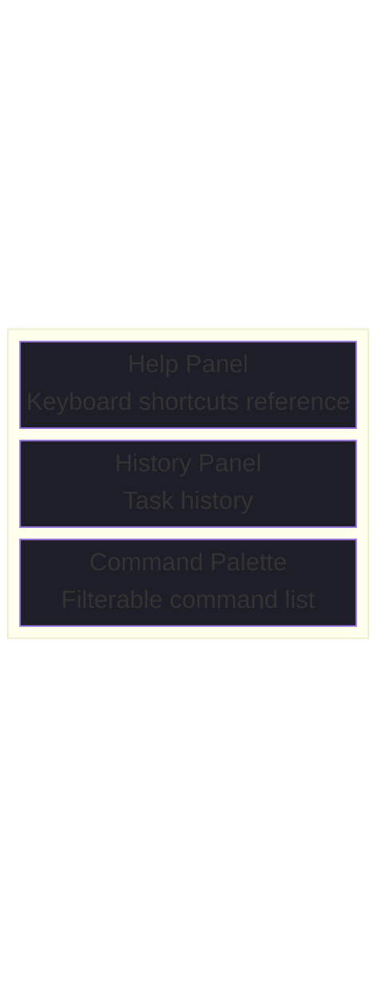
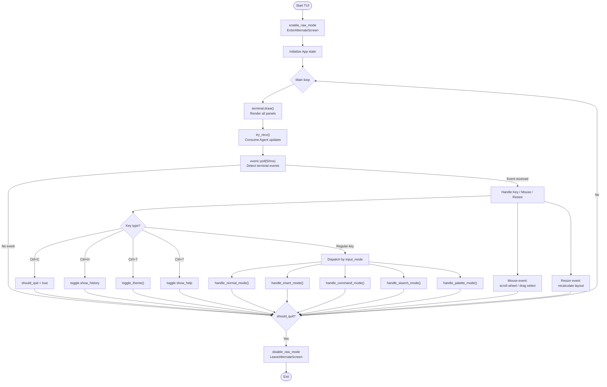
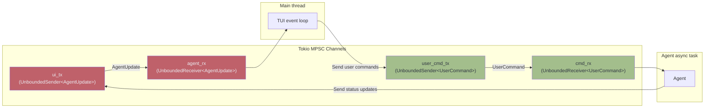
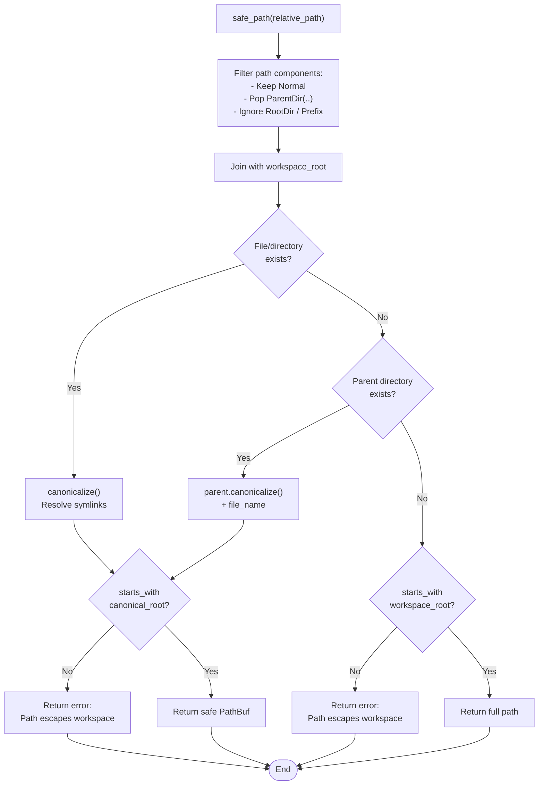

# Architecture & Flow

This document describes the overall architecture, core data flow, and terminal UI layout of `tact` using Mermaid diagrams.

---

## 0. Workspace Structure

This project is a Cargo Workspace containing the following crates:

| Directory | Package | Responsibility |
|---|---|---|
| `crates/core` | `tact_core` | Shared types: `AgentUpdate`, `UserCommand`, `PlanStep`, `StepResult`, `StepStatus` |
| `crates/tools` | `tools` | `Sandbox`: secure wrappers for file I/O and command execution |
| `crates/tui` | `tui` | Terminal UI built with `ratatui` |
| `crates/tact` | `tact` | Agent runtime, main loop, tool router, CLI entry point |
| `crates/tool_refactor_macros` | `tool_refactor_macros` | Proc macros for tool refactoring |

Dependency graph:

---

## 1. Module Architecture

---

## 2. Agent Task Execution Flow

---

## 3. TUI Render Layout

### Overlays (popup panels)

---

## 4. Event Loop Flow

---

## 5. Channel Communication Architecture

---

## 6. Sandbox Safe Path Resolution

