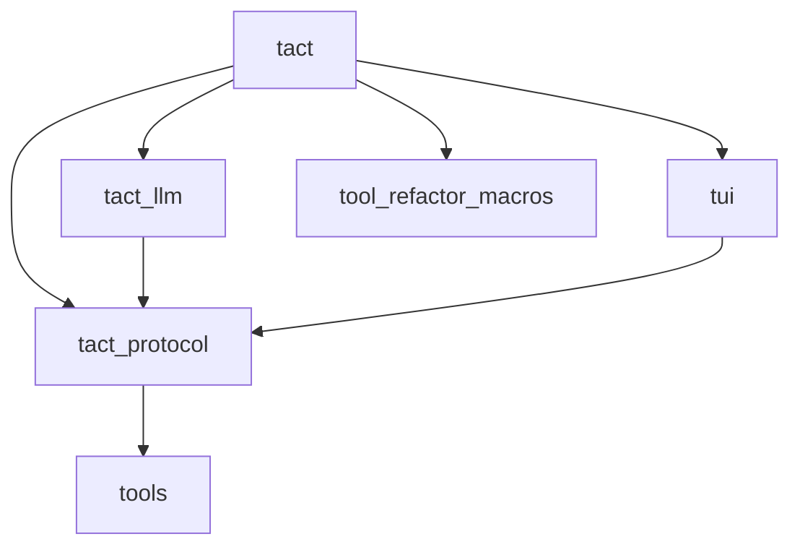
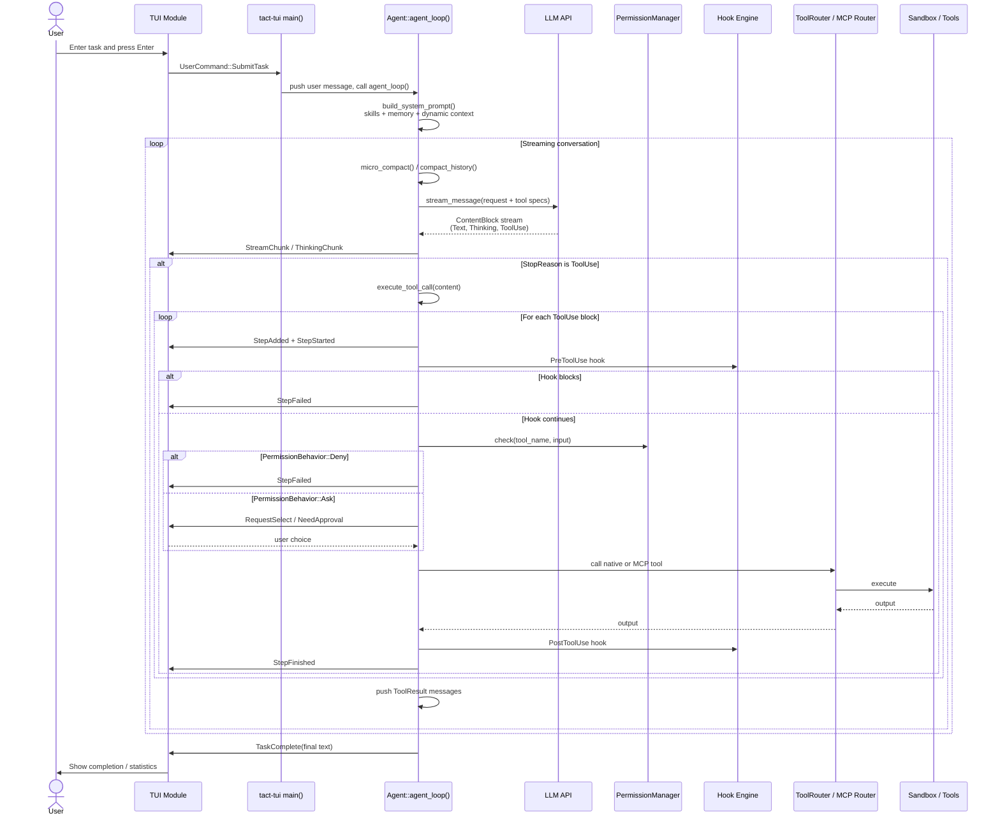
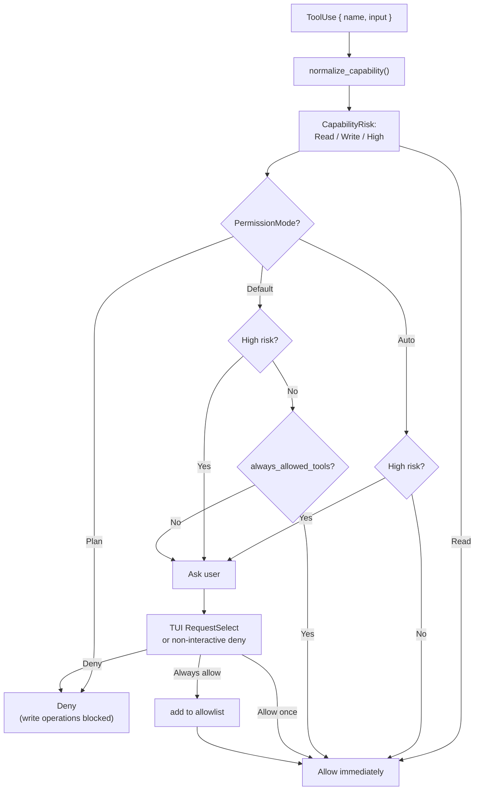
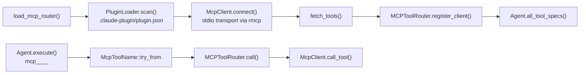
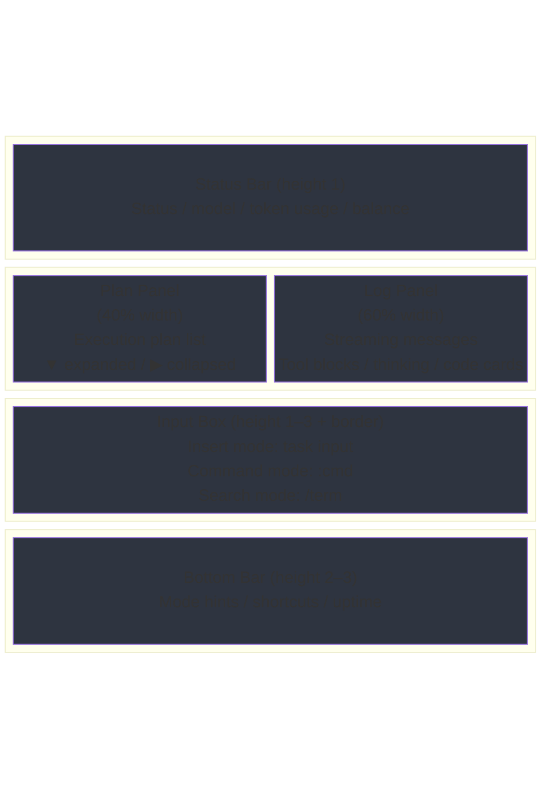
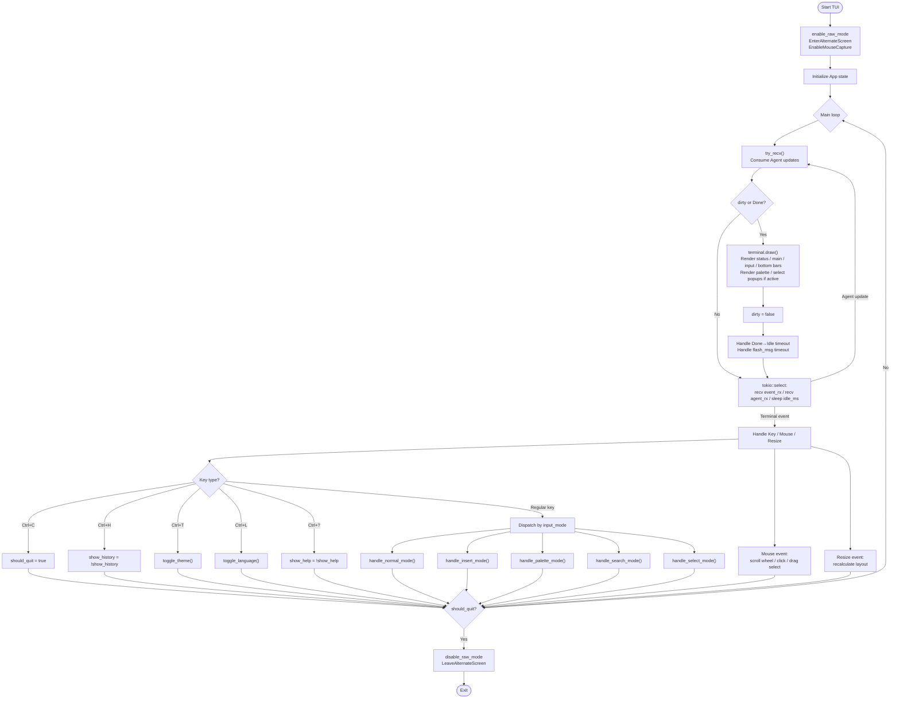
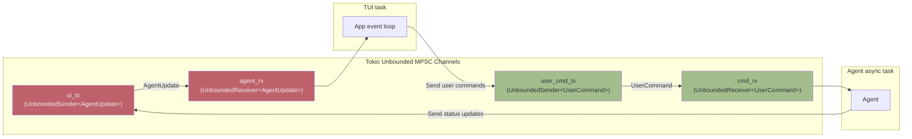
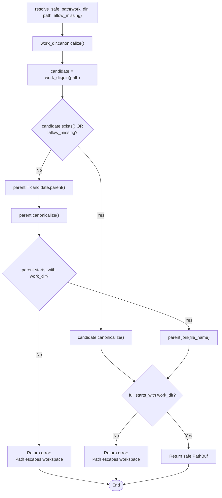

# Architecture & Flow

This document describes the overall architecture, core data flow, and terminal UI layout of `tact` using Mermaid diagrams. It reflects the current implementation rather than the original MVP design.

For detailed state-machine diagrams (TUI status, input mode, task lifecycle, permissions, hooks, etc.), see [`docs/state_machines.md`](./docs/state_machines.md). For the TUI rendering architecture (layout, log panel, popups), see [`docs/tui_rendering.md`](./docs/tui_rendering.md). For tool invocation UI (3-tier blocks, concurrent active tools, popups), see [`docs/tool_rendering.md`](./docs/tool_rendering.md). For the `batch_read`/`batch_edit` execution and TUI interaction flowcharts, see [`docs/batch_tools_flow.md`](./docs/batch_tools_flow.md).

---

## 0. Workspace Structure

This project is a Cargo Workspace containing the following crates:

| Directory | Package | Version | Responsibility |
|---|---|---|---|
| `crates/protocol` | `tact_protocol` | `0.1.0` (local) | Shared wire types: `AgentUpdate`, `UserCommand`, `PlanStep`, `StepResult`, `StepStatus`, `ModelCallParams`, `BalanceInfo`. Also contains a legacy `Agent` implementation that is no longer used by the runtime. |
| `crates/tools` | `tools` | `0.1.0` (local) | `Sandbox`: secure wrappers for file I/O and command execution. |
| `crates/tui` | `tui` | `0.1.0` (local) | Terminal UI built with `ratatui`. |
| `crates/tact` | `tact` | `0.19.0` (workspace) | Agent runtime, tool router, MCP client, hooks, permissions, context compaction, and the two CLI binaries. |
| `crates/tact_llm` | `tact_llm` | `0.19.0` (workspace) | Shared LLM provider layer (Anthropic/OpenAI adapters, request conversion, provider/env resolution). |
| `crates/tool_refactor_macros` | `tool_refactor_macros` | `0.19.0` (workspace) | Proc-macro `#[tool(name = "...", description = "...")]` that generates `Tool` trait implementations from async functions. |

Dependency graph:

Binaries produced by `crates/tact`:

| Binary | Source | Mode |
|---|---|---|
| `tact` | `crates/tact/src/main.rs` | Headless / CI / non-interactive |
| `tact-tui` | `crates/tact/src/bin/tui.rs` | Interactive terminal UI |

---

## 1. Module Architecture

```mermaid
flowchart TB
    subgraph bins["Binary entry points"]
        B1["tact src/main.rs<br/>headless CLI"]
        B2["tact-tui src/bin/tui.rs<br/>TUI entry"]
    end

    subgraph tact_lib["tact/src/lib.rs — Agent Runtime"]
        A["Agent struct"]
        AR["AgentRuntime"]
        AL["agent_loop()<br/>streaming conversation loop"]
        ETC["execute_tool_call()<br/>dispatch + permission + hooks"]
        EX["execute()<br/>native tool or MCP tool"]
        SP["build_system_prompt()<br/>Tera template + skills/memory"]
        CH["compact_history()<br/>context compaction"]

        A --> AR
        A --> AL
        AL --> ETC
        ETC --> EX
        A --> SP
        A --> CH
    end

    subgraph submods["tact/src/ — supporting modules"]
        TOOL["tool/<br/>Tool trait, ToolRouter, 40+ tools"]
        PERM["permission/<br/>CapabilityRisk, PermissionManager"]
        HOOK["hook/<br/>Pre/Post/SessionStart hooks"]
        MCP["mcp/<br/>PluginLoader, McpClient, MCPToolRouter"]
        COMP["compact.rs<br/>micro_compact, transcript persistence"]
        STORE["store/<br/>StoreRoot, Store, CollectionStore"]
        LLM["tact_llm crate<br/>Anthropic / OpenAI adapters"]
        TASK["task/<br/>persistent task manager"]
        TEAM["team.rs<br/>teammate roster + inbox"]
        BG["background.rs<br/>async shell tasks"]
        CRON["cron/<br/>scheduled prompts"]
        MEM["memory/<br/>persistent user/project memory"]
        SKILL["skill/<br/>SKILL.md registry"]
        WT["worktree/<br/>git worktree lanes"]
        REC["recovery.rs<br/>transport/prompt-too-large recovery"]
        STATS["stats.rs<br/>session statistics"]
        CFG["config.rs<br/>CLI/env/TOML config"]
        PROMPT["prompt/<br/>system prompt templates"]
    end

    subgraph core["tact_protocol — shared types"]
        UPD["AgentUpdate enum"]
        CMD["UserCommand enum"]
        STEP["PlanStep / StepResult"]
    end

    subgraph tools_crate["tools crate — Sandbox"]
        S["Sandbox"]
        SR["read_file()"]
        SW["write_file()"]
        SC["run_command()"]
        SSP["safe_path()<br/>workspace escape prevention"]
    end

    subgraph tui_crate["tui crate — Terminal UI"]
        T["lib.rs<br/>event loop"]
        TH["handlers/<br/>mode-specific key handling"]
        TR["render/<br/>panel rendering"]
        TS["state/<br/>App state"]
        TT["theme.rs<br/>9 color themes"]
        TI18N["i18n.rs<br/>EN / 中文"]
        TW["widgets/<br/>history, select popups"]
    end

    B1 --> A
    B2 --> T
    T -- UnboundedSender<UserCommand> --> A
    A -- UnboundedSender<AgentUpdate> --> T

    A --> TOOL
    A --> MCP
    A --> HOOK
    AR --> PERM
    AR --> LLM
    A --> COMP

    TOOL --> TASK
    TOOL --> TEAM
    TOOL --> BG
    TOOL --> CRON
    TOOL --> MEM
    TOOL --> SKILL
    TOOL --> WT
    TOOL --> STORE

    S --> SR
    S --> SW
    S --> SC
    S --> SSP
    TOOL -. "file I/O fallback" .-> S

    T --> TH
    T --> TR
    T --> TS
    TR --> TS
    TH --> TS
    TS --> TT
    TS --> TI18N
    TS --> TW
```

---

## 2. Agent Task Execution Flow

The runtime no longer pre-generates a fixed JSON plan. Instead it runs a streaming conversation loop that sends tool specifications to the LLM and executes `ToolUse` blocks as they arrive.

Key `AgentUpdate` variants used today:

| Variant | Meaning |
|---|---|
| `PlanGenerated(Vec<PlanStep>)` | Initial placeholder plan displayed in the TUI. |
| `StepAdded(PlanStep)` | A new tool-use step is appended to the plan panel (`description` = tool name only). |
| `StepStarted(usize, tool_id, tool_name, arg_summary)` | Step `idx` has begun; TUI renders a running tool block. |
| `StepFinished(usize, tool_id, StepResult)` | Step succeeded — summary, detail, duration, optional `permission_label`. |
| `StepFailed(usize, tool_id, String)` | Step failed with error message. |
| `RequestSelect { prompt, options, respond }` | Ask the user to pick an option. |
| `StreamChunk(String)` | Streaming assistant text fragment. |
| `ThinkingChunk(String)` | Streaming reasoning/thinking fragment. |
| `ModelInfo(ModelCallParams)` | Model name, max tokens, thinking budget. |
| `TokenUsage { ... }` | Prompt/completion/cache token counts. |
| `Balance(BalanceInfo)` | DeepSeek account balance. |
| `Info(String)` | Informational notice. |
| `TaskComplete(String)` | The entire task finished. |
| `Error(AgentErrorKind)` | Classified error. |

---

## 3. Permission System

Every tool call is classified by risk and checked against the active permission mode.

| Mode | Behavior |
|---|---|
| `default` | Read-only tools allowed; writes ask once; high-risk always asks. |
| `plan` | Read-only only; all writes denied (useful for review-first workflows). |
| `auto` | Read and non-high writes auto-approved; high-risk still asks. |

Special cases:

- `read_file` and tools whose names start with `read`, `list`, `get`, `show`, `search`, `query`, `inspect`, or `find` are classified as `Read`.
- `task` is always `High` because it spawns a sub-agent with full filesystem/shell access.
- `bash` commands containing `rm -rf`, `sudo`, `shutdown`, or `reboot` are always `High`.
- Simple read-only bash commands (`ls`, `cat`, `git status`, etc.) are classified as `Read`.

---

## 4. Hook Engine

Hooks are registered on the `Agent` and run at three points:

| Hook type | When | Can mutate | Can veto |
|---|---|---|---|
| `SessionStart` | Before the first LLM call | `LoopState` | Yes |
| `PreToolUse` | Before each tool execution | `ToolUse` input | Yes |
| `PostToolUse` | After each tool execution | `ToolResult` content | Yes |

A hook returns `HookControl::Continue` or `HookControl::Block(reason)`. The first `Block` short-circuits the chain.

---

## 5. MCP Integration

`tact` is a native MCP client. External tools are exposed as namespaced tool names.

MCP tool naming convention: `mcp__<server_name>__<tool_name>`. Example: `mcp__filesystem__read_file`.

---

## 5.5 System Prompt & Dynamic Context

The runtime builds the system prompt via `SystemPrompt` (Tera template in `crates/tact/src/prompt/`) plus injected blocks:

| Block | Source |
|---|---|
| Role / guidelines / constraints | Static template |
| Skills | `skill_registry.describe_available()` |
| Memory | `.claude/memory/*.md` via `MemoryManager` |
| CLAUDE.md | `~/.claude/CLAUDE.md`, project `CLAUDE.md`, optional subdir |
| **Dynamic context** | `load_dynamic_context()` — date, workdir, model, platform, **Project structure** |

### Project structure snapshot

`load_dynamic_context()` calls `snapshot_dir(workdir, max_items)` once per session and caches the result in `AgentRuntime.cached_dir_snapshot` for stable KV-cache prefixes.

| Setting | Default | Description |
|---|---|---|
| `TACT_SNAPSHOT_MAX_ITEMS` | `80` | Max files/dirs in the snapshot (truncated after sort) |
| Walk depth | `4` | Max directory depth from project root |

Snapshot behavior (language-agnostic, works for any repo layout):

1. **Prune ignored dirs at traversal time** via `WalkDir::filter_entry` (`target`, `node_modules`, `.git`, dot-dirs except `.gitignore` / `.env.example`, etc.)
2. **Sort** by depth (shallow first), then directories before files, then path name
3. **Truncate** to `max_items`, then group by parent directory for display

`AGENTS.md` provides a stable hand-maintained crate map; the runtime snapshot supplements it with the current working tree.

For a curated map without scanning, prefer keeping `AGENTS.md` up to date — the snapshot is a best-effort overview, not a full tree listing.

---

## 6. Context Compaction

When the conversation approaches the context limit (`TACT_CONTEXT_LIMIT_CHARS`, default 500_000 characters), the agent compacts history:

1. `micro_compact()` replaces old tool-result blocks longer than 120 chars with a stub, keeping the 12 most recent results intact.
2. If still over the limit, `compact_history()` writes the full transcript to `<workdir>/.claude/transcripts/transcript_<ts>.jsonl`, asks the LLM to summarize recent messages, and replaces the context with a single summary message.
3. Large `bash` outputs are persisted to `<workdir>/.claude/tool-results/<tool_use_id>.txt` instead of being kept verbatim in context.

Recovery mechanisms inside `agent_loop()`:

| Failure | Action |
|---|---|
| Prompt too long | Retry after `compact_history()` (up to `MAX_RECOVERY_ATTEMPTS`). |
| Transient transport error | Exponential backoff retry. |
| `max_tokens` truncation with pending tools | Execute pending tools, then continue with a continuation prompt. |

---

## 7. Sub-agents, Team, Tasks, Worktrees

| Feature | Module | Description |
|---|---|---|
| `task` tool | `tool/subagent.rs` | Spawns an isolated sub-agent with a restricted toolset (`bash`, `read_file`, `write_file`, `edit_file`, `search_code`, `sleep`). |
| Persistent tasks | `task/` | `TaskManager` stores task records with status and dependency tracking under `.claude/tasks/`. |
| Teammates | `team.rs` | Named agents with roles and an inbox supporting point-to-point messages, broadcasts, `plan_approval`, and shutdown protocols. |
| Worktrees | `worktree/` | Git worktree isolation: `create`, `list`, `status`, `run`, `events`. Metadata stored under `.claude/worktrees/`. |
| Background tasks | `background.rs` | Async shell commands with polling via `background_run` / `check_background`. |
| Cron | `cron/` | Recurring or one-shot scheduled prompts persisted under `.claude/cron/`. |
| Memory | `memory/` | Markdown files with YAML frontmatter (`user`, `feedback`, `project`, `reference`) injected into the system prompt. |
| Skills | `skill/` | `SKILL.md` files loaded into the system prompt wrapped in `<skill>` tags. |

---

## 8. TUI Render Layout

### Overlays (popup panels)

---

## 9. Event Loop Flow

### Normal-mode shortcuts

| Key | Action |
|---|---|
| `Tab` | Switch focus between Plan and Log panels. |
| `e` | Toggle plan panel visibility. |
| `j` / `k` | Scroll log or move plan selection. |
| `g` / `G` | Jump to top / bottom of log. |
| `i` / `Enter` | Enter insert mode. |
| `:` | Open command palette. |
| `/` | Enter search mode. |
| `n` / `N` | Next / previous search match. |
| `y` | Copy selection / last message / approve if waiting. |
| `Y` | Copy last code block. |
| `V` | Open closest code-block popup. |
| `t` | Open closest thinking popup. |
| `c` | Cancel current task. |
| `q` | Quit. |
| `Esc` | Reject approval / clear selection. |

### Global shortcuts (any mode)

| Key | Action |
|---|---|
| `Ctrl+C` | Quit. |
| `Ctrl+H` | Toggle history overlay. |
| `Ctrl+T` | Toggle theme. |
| `Ctrl+L` | Toggle language (EN / 中文). |
| `Ctrl+?` | Toggle help overlay. |

---

## 10. Channel Communication Architecture

`UserCommand` variants:

| Variant | Meaning |
|---|---|
| `SubmitTask(String)` | Submit a new natural-language task. |
| `Cancel` | Cancel the current task. |
| `QueryBalance` | Query DeepSeek account balance. |

---

## 11. Sandbox Safe Path Resolution

The runtime uses `resolve_safe_path(work_dir, path, allow_missing)` (`crates/tact/src/tool/mod.rs`). The legacy `tools` crate has a similar `safe_path()` implementation used by the old `tact_protocol::Agent`.

---

## 12. Configuration Loading Order

`tact::config::init()` merges configuration from (highest priority first):

1. CLI arguments (`--model`, `--permission-mode`, positional prompt, etc.).
2. Environment variables (`TACT_PROVIDER`, `ANTHROPIC_API_KEY`, `OPENAI_API_KEY`, etc.).
3. TOML config files: `<project>/.tact/config.toml`, `<project>/tact.toml`, `~/.tact/config.toml`.

LLM provider selection:

| `TACT_PROVIDER` | Required env vars |
|---|---|
| `anthropic` | `ANTHROPIC_API_KEY`, `ANTHROPIC_BASE_URL` |
| `openai` | `OPENAI_API_KEY`; optional `OPENAI_BASE_URL` |

If `TACT_PROVIDER` is unset but `ANTHROPIC_API_KEY` or `OPENAI_API_KEY` is present, the provider is inferred from the key.

---

## 13. `#[tool]` Proc Macro

The `tool_refactor_macros` crate provides the `#[tool(name = "...", description = "...")]` attribute macro. It is used by many built-in tools (e.g., `tool/bash.rs`, `tool/math.rs`) to auto-generate:

- A JSON input schema via `schemars`.
- A wrapper struct implementing the `Tool` trait.
- Deserialization of the JSON input into the function's arguments.

Handlers can be either:

- **Pure functions**: arguments are plain types, wrapped into a generated input struct.
- **Stateful handlers**: first argument is `ToolContext`, followed by a single deserializable input struct.

---

## 14. What Changed Since the Original Architecture

If you are reading older branches or notes, the following major evolutions have happened:

- The plan-then-execute model (`generate_plan()` → sequential `execute_step()`) was replaced by a streaming agent loop (`agent_loop()`).
- Business tools moved from `crates/tools` into `crates/tact/src/tool/`; `crates/tools` now only provides the `Sandbox`.
- The runtime gained native support for MCP, hooks, permissions, context compaction, recovery, sub-agents, teammates, worktrees, cron, memory, and skills.
- `tact_protocol::Agent` is legacy code and is no longer used by the main binaries.
- The TUI gained streaming output, diff/code/thinking popups, a command palette, mouse support, themes, and internationalization.
- **Tool log blocks** — 3-tier layout (title + meta + detail card), concurrent active tools, live running elapsed time, permission labels on `StepResult`.
- **Session store** — SQLite at `<workdir>/.claude/tact.db`; token usage rows optionally store serialized LLM `request_body` for debugging.
- **Dynamic context** — Project structure snapshot with pruned walk, default 80 items, session-cached for KV stability.
- **Bottom bar Cost timer** — retains last prompt duration until the next submission.

---

## 15. Related Documents

| Document | Focus |
|---|---|
| [`docs/state_machines.md`](./docs/state_machines.md) | Detailed state-machine diagrams for the TUI, tasks, background jobs, permissions, hooks, and recovery. |
| [`docs/tui_rendering.md`](./docs/tui_rendering.md) | TUI rendering architecture: layout, log panel, popups, Markdown, cells, performance optimization. |
| [`docs/tool_rendering.md`](./docs/tool_rendering.md) | Tool block design: ToolWidget → ToolCell pipeline, concurrent tools, detail cards, DiffPopup. |
| [`docs/batch_tools_flow.md`](./docs/batch_tools_flow.md) | `batch_read`/`batch_edit` tool execution flow and interaction sequence diagrams with the TUI. |
| [`docs/compaction.md`](./docs/compaction.md) | Context compaction behavior and tuning. |
| [`docs/token_usage_schema.md`](./docs/token_usage_schema.md) | SQLite `token_usages` schema, cache metrics, `request_body` debug column. |
