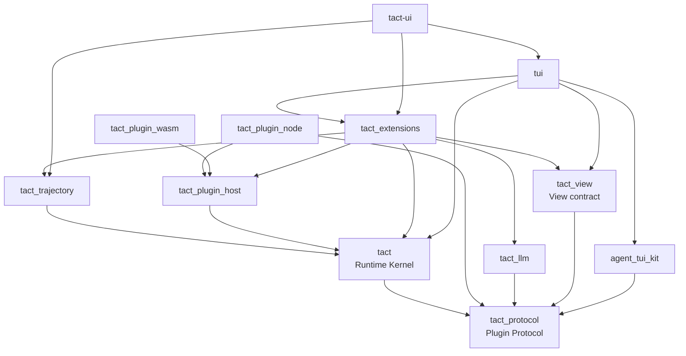
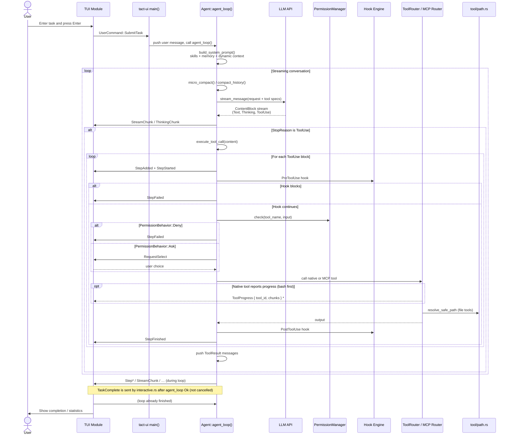
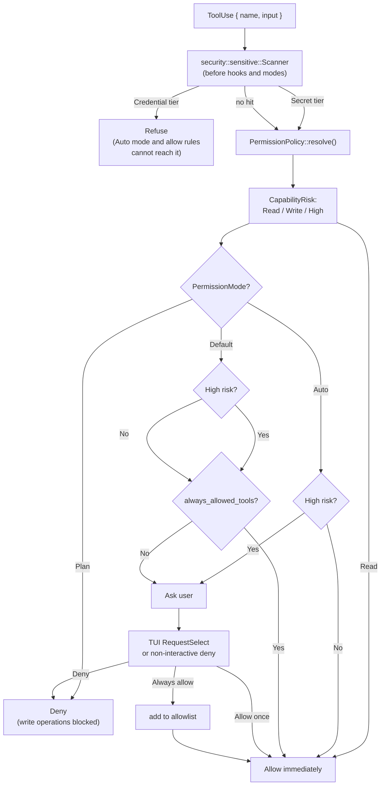
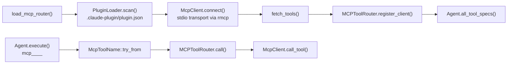
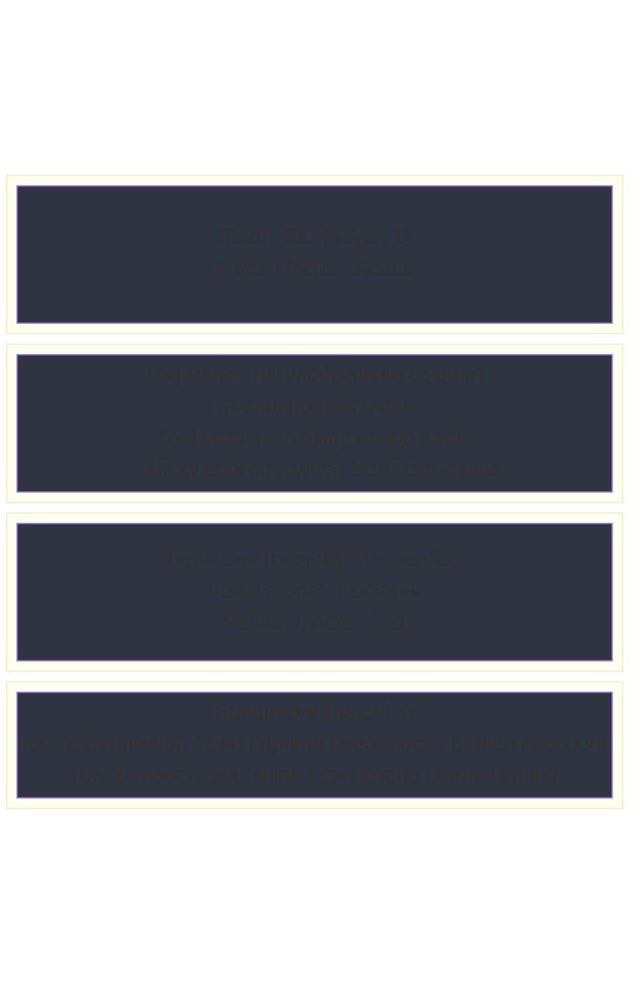
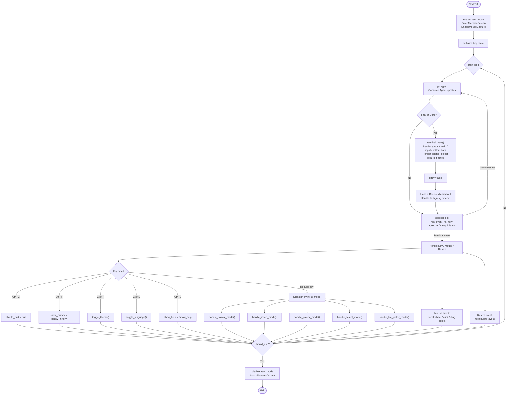
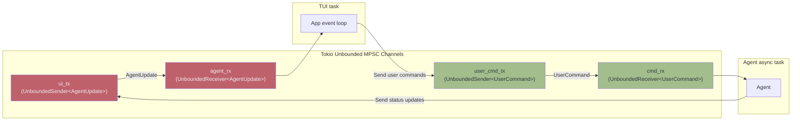
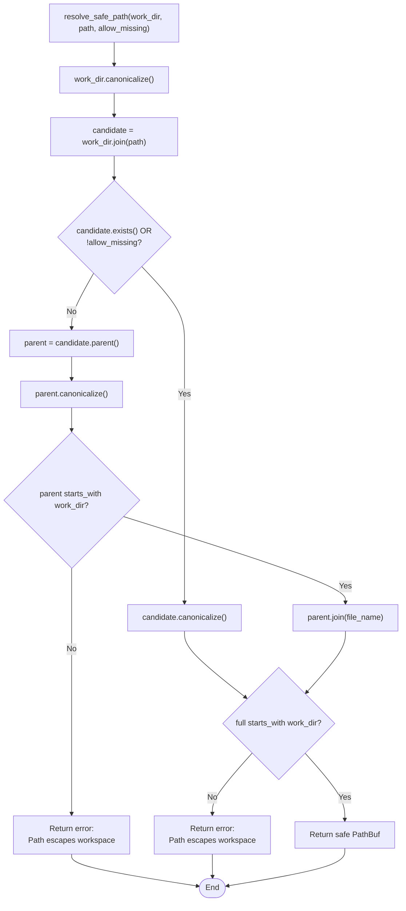
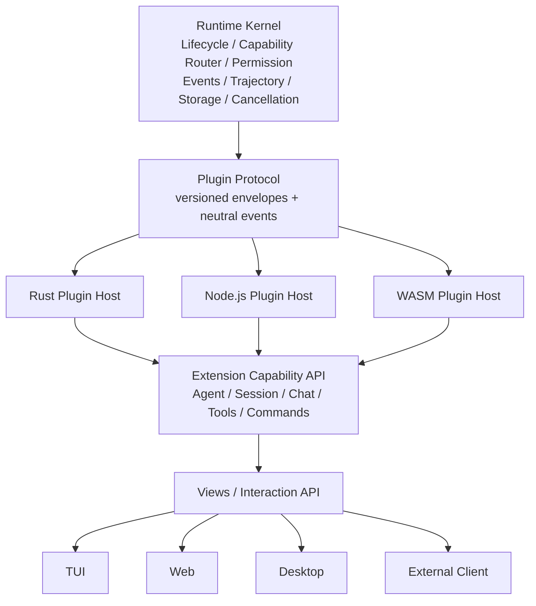

# Architecture & Flow

This document describes the overall architecture, core data flow, and terminal UI layout of `tact` using Mermaid diagrams. It reflects the current implementation rather than the original MVP design.

For detailed state-machine diagrams (TUI status, input mode, task lifecycle, permissions, hooks, etc.), see [`docs/state_machines.md`](./docs/state_machines.md). For the TUI rendering architecture (layout, log panel, popups), see [`docs/tui_rendering.md`](./docs/tui_rendering.md). For tool invocation UI (3-tier blocks, concurrent active tools, popups), see [`docs/tool_rendering.md`](./docs/tool_rendering.md).

---

## 0. Workspace Structure

The crate taxonomy mirrors the layered architecture: the Runtime Kernel is its
own crate, the cross-language wire contract is its own crate, plugin hosts
depend only on those two, and the Agent / Session / Chat / Tools extensions sit
above them.

| Directory | Package | Responsibility |
|---|---|---|
| `crates/tact` | `tact` | **Runtime Kernel** — capability router, the permission decision (`permission.rs`: mode/risk/rules/allow-list ordering) plus the sensitive-path and security policy it consults (`security/`), event transport, minimal storage, cancellation / timeout / error, plugin registry, payload redaction. Depends on `tact_protocol` only. |
| `crates/tact_protocol` | `tact_protocol` | **Plugin Protocol** — language-neutral IDs, envelopes, capability declarations, structured runtime events / commands, interactions, error categories, and the shared payload types. `serde` only. |
| `crates/tact_view` | `tact_view` | **View contract** — the Rust view-model types a View adapter renders (`AgentUpdate`, `UserCommand`, `AgentErrorKind`), the `runtime_events_for` projection onto the structured protocol events, and its inverse `runtime_event_to_agent_updates`. These are deliberately outside `tact_protocol`. |
| `crates/tact_trajectory` | `tact_trajectory` | **Trajectory** — execution-fact model, in-memory and SQLite recorders, ordered replay. Implements the Kernel's `TrajectoryService`. |
| `crates/tact_plugin_host` | `tact_plugin_host` | **Plugin host machinery** — lifecycle boundary, stdio transport, supervision (handshake, correlation, timeouts, cancellation, crash detection, shutdown drain). |
| `crates/tact_plugin_node` | `tact_plugin_node` | **Node.js Host** — the Node entry point over the shared host machinery. |
| `crates/tact_plugin_wasm` | `tact_plugin_wasm` | **WASM Host** — Wasmtime runner with constrained capabilities. |
| `crates/tact_extensions` | `tact_extensions` | **Extension Capability API** — official Agent / Session / Chat / Tools / Workflow extensions, plus the in-process Rust host: tools, MCP, hooks, permissions, memory, skills, tasks, teams, worktrees, background work, voice, config, compaction. |
| `crates/tact_llm` | `tact_llm` | LLM provider adapters (Anthropic / OpenAI / DeepSeek / Kimi), request conversion, provider and env resolution. |
| `crates/tui` | `tui` | **TUI View Adapter** — `ratatui` rendering, key/mouse handling, view state. |
| `crates/agent_tui_kit` | `agent_tui_kit` | Reusable TUI widgets and state primitives shared by the view. |
| `crates/tact_ui` | `tact-ui` | **Runtime host and external-client wiring** — the `tact-ui` binary: interactive TUI plus the `headless` external client; owns session bootstrap, locks, and CLI subcommands. |
| `crates/tool_refactor_macros` | `tool_refactor_macros` | Proc-macro `#[tool(...)]` generating `Tool` implementations. |

Dependency graph (arrows point at dependencies):


```mermaid
flowchart TB
    protocol["tact_protocol<br/>Plugin Protocol"]
    kernel["tact<br/>Runtime Kernel"]
    traj["tact_trajectory"]
    host["tact_plugin_host"]
    node["tact_plugin_node"]
    wasm["tact_plugin_wasm"]
    ext["tact_extensions"]
    llm["tact_llm"]
    kit["agent_tui_kit"]
    tui["tui"]
    ui["tact-ui"]

    kernel --> protocol
    traj --> kernel
    host --> kernel
    node --> host
    node --> protocol
    wasm --> host
    view["tact_view<br/>View contract"]
    ext --> kernel
    ext --> traj
    ext --> host
    ext --> llm
    ext --> view
    llm --> protocol
    view --> protocol
    kit --> protocol
    tui --> ext
    tui --> kernel
    tui --> kit
    tui --> view
    ui --> ext
    ui --> tui
    ui --> traj
```

No crate in the `tact_plugin_*` column depends on `tact_extensions`, and the
Kernel depends on no frontend — so a plugin host cannot reach the Agent, and a
capability cannot be invoked on a path that skips permission, events, or the
trajectory.

Binaries produced by `crates/tact_ui`:

| Binary | Source | Mode |
|---|---|---|
| `tact-ui` | `crates/tact_ui/` | Interactive TUI by default; `headless` subcommand for CI / non-interactive |

---

## 1. Module Architecture


```mermaid
flowchart TB
    subgraph bins["Binary entry points"]
        B1["tact-ui<br/>crates/tact_ui/"]
    end

    subgraph tact_agent["tact/src/agent/ — Agent Runtime"]
        A["Agent struct"]
        AR["AgentRuntime"]
        AL["agent_loop()<br/>streaming conversation loop"]
        TD["tool_dispatch.rs"]
        TS["tool_schedule.rs"]
        ETC["execute_tool_call()<br/>dispatch + permission + hooks"]
        EX["execute()<br/>native tool or MCP tool"]
        SP["build_system_prompt()<br/>Tera template + skills/memory"]
        CH["compact_history()<br/>context compaction"]

        A --> AR
        A --> AL
        A --> TD
        TD --> ETC
        AL --> ETC
        ETC --> EX
        A --> SP
        A --> CH
    end

    subgraph submods["tact/src/ — supporting modules"]
        TOOL["tool/<br/>Tool trait, ToolRouter, registry.rs, 40+ tools"]
        PERM["permission/<br/>CapabilityRisk, PermissionManager"]
        HOOK["hook/<br/>Pre/Post/SessionStart hooks"]
        MCP["mcp/<br/>PluginLoader, McpClient, MCPToolRouter"]
        LSP["lsp/<br/>LspClient, LspManager"]
        COMP["compact/mod.rs<br/>micro_compact, transcript persistence"]
        STORE["store/<br/>StoreRoot, Store, CollectionStore"]
        LLM["tact_llm crate<br/>Anthropic / OpenAI / DeepSeek / Kimi adapters"]
        TASK["task/<br/>persistent task manager"]
        TEAM["team.rs<br/>teammate roster + inbox"]
        BG["background.rs<br/>async shell tasks"]
        MEM["memory/<br/>persistent user/project memory"]
        SKILL["skill/<br/>SKILL.md registry"]
        WT["worktree/<br/>git worktree lanes"]
        REC["recovery.rs<br/>transport/prompt-too-large recovery"]
        STATS["stats.rs<br/>session statistics"]
        CFG["config.rs<br/>CLI/TOML config"]
        PROMPT["prompt/<br/>system prompt templates"]
    end

    subgraph core["tact_protocol — shared types"]
        UPD["AgentUpdate enum"]
        CMD["UserCommand enum"]
        STEP["PlanStep / StepResult"]
    end

    subgraph tui_crate["tui crate — Terminal UI"]
        T["lib.rs<br/>event loop"]
        TH["handlers/<br/>mode-specific key handling"]
        TR["render/<br/>panel rendering"]
        TS["state/<br/>App state"]
        TT["theme.rs<br/>11 color themes"]
        TI18N["i18n.rs<br/>EN / 中文"]
        TW["widgets/<br/>history, select popups"]
    end

    B1 --> A
    B1 --> T
    T -- UnboundedSender<UserCommand> --> A
    A -- UnboundedSender<AgentUpdate> --> T

    A --> TOOL
    A --> MCP
    A --> HOOK
    AR --> PERM
    AR --> LLM
    A --> COMP

    TOOL --> TASK
    TOOL --> TEAM
    TOOL --> BG
    TOOL --> CRON
    TOOL --> MEM
    TOOL --> SKILL
    TOOL --> WT
    TOOL --> STORE

    T --> TH
    T --> TR
    T --> TS
    TR --> TS
    TH --> TS
    TS --> TT
    TS --> TI18N
    TS --> TW
```

---

## 2. Agent Task Execution Flow

The runtime no longer pre-generates a fixed JSON plan. Instead it runs a streaming conversation loop that sends tool specifications to the LLM and executes `ToolUse` blocks as they arrive.


```mermaid
sequenceDiagram
    actor U as User
    participant TUI as TUI Module
    participant Main as tact-ui main()
    participant Agent as Agent::agent_loop()
    participant LLM as LLM API
    participant Perm as PermissionManager
    participant Hook as Hook Engine
    participant TR as ToolRouter / MCP Router
    participant PATH as tool/path.rs

    U ->> TUI: Enter task and press Enter
    TUI ->> Main: UserCommand::SubmitTask
    Main ->> Agent: push user message, call agent_loop()
    Agent ->> Agent: build_system_prompt()<br/>skills + memory + dynamic context

    loop Streaming conversation
        Agent ->> Agent: micro_compact() / compact_history()
        Agent ->> LLM: stream_message(request + tool specs)
        LLM -->> Agent: ContentBlock stream<br/>(Text, Thinking, ToolUse)
        Agent ->> TUI: StreamChunk / ThinkingChunk

        alt StopReason is ToolUse
            Agent ->> Agent: execute_tool_call(content)
            loop For each ToolUse block
                Agent ->> TUI: StepAdded + StepStarted
                Agent ->> Hook: PreToolUse hook
                alt Hook blocks
                    Agent ->> TUI: StepFailed
                else Hook continues
                    Agent ->> Perm: check(tool_name, input)
                    alt PermissionBehavior::Deny
                        Agent ->> TUI: StepFailed
                    else PermissionBehavior::Ask
                        Agent ->> TUI: RequestSelect
                        TUI -->> Agent: user choice
                    end
                    Agent ->> TR: call native or MCP tool
                    opt Native tool reports progress (bash first)
                        TR -->> TUI: ToolProgress { tool_id, chunks } *
                    end
                    TR ->> PATH: resolve_safe_path (file tools)
                    TR -->> Agent: output
                    Agent ->> Hook: PostToolUse hook
                    Agent ->> TUI: StepFinished
                end
            end
            Agent ->> Agent: push ToolResult messages
        end
    end

    Agent ->> TUI: Step* / StreamChunk / … (during loop)
    Note over Agent,TUI: TaskComplete is sent by interactive.rs after agent_loop Ok (not cancelled)
    TUI ->> Agent: (loop already finished)
    TUI ->> U: Show completion / statistics
```

Key `AgentUpdate` variants used today:

| Variant | Meaning |
|---|---|
| `PlanGenerated(Vec<PlanStep>)` | **Deprecated (0.19.0).** TUI handler retained; agent emits `StepAdded` / `StepStarted` instead. |
| `NeedApproval(...)` | **Deprecated (0.19.0).** TUI handler retained; agent uses `RequestSelect` instead. |
| `StepAdded(PlanStep)` | A new tool-use step is appended to the internal `app.plan.steps` store (`description` = `tool (arg_summary)`; full args in `PlanStep.args`). There is no dedicated plan panel; does not add a log line. |
| `StepStarted(usize, tool_id, tool_name, arg_summary)` | Step `idx` has begun; TUI renders a running tool block with truncated title args. |
| `ToolProgress { tool_id, chunks }` | Informational ordered stdout/stderr progress for an active tool. It does not close thinking/loading gates or finalize the step; unknown or late IDs are ignored. |
| `StepFinished(usize, tool_id, StepResult)` | Step succeeded — summary, detail, duration, optional `permission_label`, optional `arg_full` for popups. |
| `StepFailed(usize, tool_id, String)` | Step failed with error message. |
| `RequestSelect { prompt, options, respond }` | Ask the user to pick an option. |
| `StreamChunk(String)` | Streaming assistant text fragment. |
| `ThinkingChunk(Started \| Delta(String) \| Finished)` | Streaming reasoning lifecycle. |
| `ModelInfo(ModelCallParams)` | Model name, max tokens, thinking budget. |
| `TokenUsage { ... }` | Prompt/completion/cache token counts. |
| `Balance(BalanceInfo)` | DeepSeek / Kimi account balance (where available). |
| `Info(String)` | Informational notice. |
| `TaskComplete(String)` | The entire task finished. |
| `Error(AgentErrorKind)` | Classified error. |

---

## 3. Permission System

Every tool call is classified by risk and checked against the active permission mode.


```mermaid
flowchart TD
    ToolCall["ToolUse { name, input }"] --> Guard["security::sensitive::Scanner<br/>(before hooks and modes)"]
    Guard -- "Credential tier" --> Refuse["Refuse<br/>(Auto mode and allow rules<br/>cannot reach it)"]
    Guard -- "Secret tier" --> Normalize
    Guard -- "no hit" --> Normalize

    Normalize["PermissionPolicy::resolve()"] --> Risk["CapabilityRisk:<br/>Read / Write / High"]

    Risk -- Read --> Allow["Allow immediately"]
    Risk --> Mode{"PermissionMode?"}

    Mode -- Plan --> Deny["Deny<br/>(write operations blocked)"]
    Mode -- Auto --> AutoCheck{"High risk?"}
    Mode -- Default --> DefaultCheck{"High risk?"}

    AutoCheck -- Yes --> Ask["Ask user"]
    AutoCheck -- No --> Allow

    DefaultCheck -- Yes --> AlwaysAllowed{"always_allowed_tools?"}
    DefaultCheck -- No --> AlwaysAllowed

    AlwaysAllowed -- Yes --> Allow
    AlwaysAllowed -- No --> Ask

    Ask --> UserChoice["TUI RequestSelect<br/>or non-interactive deny"]
    UserChoice -- Allow once --> Allow
    UserChoice -- Always allow --> Update["add to allowlist"]
    Update --> Allow
    UserChoice -- Deny --> Deny
```

| Mode | Behavior |
|---|---|
| `default` | Read-only tools allowed; writes ask once; high-risk asks until an explicit allow covers that exact tool and input. |
| `plan` | Read-only only; all writes denied (useful for review-first workflows). |
| `auto` | Read and non-high writes auto-approved; high-risk still asks. |

Special cases:

- `read_file` and tools whose names start with `read`, `list`, `get`, `show`, `search`, `query`, `inspect`, or `find` are classified as `Read`.
- `spawn_subagent` is always `High` because it spawns a sub-agent with full filesystem/shell access.
- `bash` commands containing `rm -rf`, `sudo`, `shutdown`, or `reboot` are always `High`.
- Simple read-only bash commands (`ls`, `cat`, `git status`, etc.) are classified as `Read` — **unless** the command names a credential path, which is checked first. The safelist proves the program cannot write, not that its output is safe to publish: `cat ~/.ssh/id_ed25519` is provably read-only and reads a private key.
- Read tools whose **target** is sensitive escalate: `.env` is not `src/main.rs`. `PermissionPolicy::{ReadPath, WritePath, PatchPaths}` carry that, so the target — not just the verb — decides the risk.

Result text is redacted before anything reads it (one choke point in
`run_tool_waves`, plus a streaming pass for live command output). See
[Ch 10 §12](book/10_chapter_permission_zh.md#12-sensitive-paths-and-secret-redaction).

---

## 4. Hook Engine

Hooks are registered on the `Agent` and run from the agent loop; Tact maps fifteen lifecycle events (the full table is in [Ch 9](book/09_chapter_hook_zh.md)). The mutable ones:

| Hook type | When | Can mutate | Can veto |
|---|---|---|---|
| `SessionStart` | Once per session, on the first turn rather than at startup — after any pre-turn compaction, before that turn's user message; re-run with `source: "compact"` after a compaction | `&mut SessionStartContext` (appends injected context) | Yes — `Block` skips the turn (Codex `continue: false`) |
| `PreToolUse` | Before each tool execution | `ToolUse` input; appends injected context | Yes |
| `PostToolUse` | After each tool execution | `ToolResult` content; appends injected context | Yes |

A hook returns `HookControl::Continue` or `HookControl::Block(reason)`. The first `Block` short-circuits the chain.

---

## 5. MCP Integration

`tact` is a native MCP client. External tools are exposed as namespaced tool names.


```mermaid
flowchart LR
    Load["load_mcp_router()"] --> Scan["PluginLoader.scan()<br/>.claude-plugin/plugin.json"]
    Scan --> Connect["McpClient.connect()<br/>stdio transport via rmcp"]
    Connect --> Fetch["fetch_tools()"]
    Fetch --> Register["MCPToolRouter.register_client()"]
    Register --> Agent["Agent.all_tool_specs()"]

    Call["Agent.execute()<br/>mcp__<server>__<tool>"] --> Parse["McpToolName::try_from"]
    Parse --> Route["MCPToolRouter.call()"]
    Route --> Client["McpClient.call_tool()"]
```

MCP tool naming convention: `mcp__<server_name>__<tool_name>`. Example: `mcp__filesystem__read_file`.

---

## 5.5 System Prompt & Dynamic Context

The runtime builds the system prompt via `SystemPrompt` (Tera template in `crates/tact_extensions/src/prompt/`) plus injected blocks:

| Block | Source |
|---|---|
| Role / guidelines / constraints | Static template |
| Skills | `skill_registry.describe_available()` (name/description only; full body via `load_skill` or TUI `/skill`) |
| Memory | `~/.tact/memory/*.md` via `MemoryManager` (user-global, shared across projects) |
| CLAUDE.md | `~/.claude/CLAUDE.md`, project `CLAUDE.md`, optional subdir — **cached once per session** |
| AGENTS.md | project `AGENTS.md` (and cwd if it differs), injected via `additional` — **cached once per session** |
| **Dynamic context** | `load_dynamic_context()` — date, workdir, model, platform, **Project structure** |

### Project structure snapshot

`load_dynamic_context()` calls `snapshot_dir(workdir, max_items)` once per session and caches the result in `AgentRuntime.cached_dir_snapshot` for stable KV-cache prefixes.

| Setting | Config key / CLI | Default | Description |
|---|---|---|---|
| Snapshot size | `agent.snapshot_max_items` / `--snapshot-max-items` | `80` | Max files/dirs in the snapshot (truncated after sort) |
| Walk depth | `4` | Max directory depth from project root |

Snapshot behavior (language-agnostic, works for any repo layout):

1. **Prune ignored dirs at traversal time** via `WalkDir::filter_entry` (`target`, `node_modules`, `.git`, dot-dirs except `.gitignore` / `.env.example`, etc.)
2. **Sort** by depth (shallow first), then directories before files, then path name
3. **Truncate** to `max_items`, then group by parent directory for display

`AGENTS.md` provides a stable hand-maintained crate map; the runtime snapshot supplements it with the current working tree.

For a curated map without scanning, prefer keeping `AGENTS.md` up to date — the snapshot is a best-effort overview, not a full tree listing.

---

## 6. Context Compaction

When the conversation approaches the model context window (`agent.model_context_window`, default **200_000 tokens**), the agent compacts history:

1. `micro_compact()` replaces old tool-result blocks longer than 120 chars with a stub, keeping the 12 most recent results intact.
2. If `should_auto_compact` fires at 80% of the model window, `compact_history()` atomically writes a unique transcript, summarizes a window-aware recent slice with bounded retries and response validation, rebuilds context as retained real-user turns plus a handoff summary, validates the complete rebuilt request, and **`replace_session_messages`** syncs SQLite. ASCII is estimated at roughly four characters per token and non-ASCII at one character per token. Retained users are capped at 20k estimated tokens and reduced to reserve max output, system/tool/summary input, and 20% window headroom; oversized images become text omission markers rather than truncated base64.
3. For OpenAI `protocol = "responses"` providers this local summary path is **not** used: ordinary requests carry `context_management` with the resolved compact threshold, and `compact_history()` calls the native `POST /responses/compact` endpoint, replacing the opaque protocol baseline (never the logical context). Endpoints without native compaction are unsupported — no local-summary fallback. See [Ch 5](./book/05_chapter_compact_zh.md).
4. Large successful native and MCP outputs are persisted to `<workdir>/.tact/tool-results/<tool_use_id>.txt` instead of being kept verbatim in context. Transcript and tool-result directories each retain the 100 newest files.

The TUI bottom-bar row 2 shows the same window as a usage meter (`used / model_context_window`).

Recovery mechanisms inside `agent_loop()`:

| Failure | Action |
|---|---|
| Prompt too long | Retry after `compact_history()` (up to `MAX_RECOVERY_ATTEMPTS`). |
| Transient transport error | Exponential backoff retry. |
| `max_tokens` truncation with pending tools | Execute pending tools, then continue with a continuation prompt. |

---

## 7. Sub-agents, Team, Tasks, Worktrees

| Feature | Module | Description |
|---|---|---|
| `spawn_subagent` tool | `tool/subagent.rs` | Spawns an isolated sub-agent with a restricted toolset (`bash`, `read_file`, `write_file`, `edit_file`, `sleep`). |
| Persistent tasks | `task/` | `TaskManager` stores task records with status and dependency tracking under `.tact/tasks/`. |
| Teammates | `team.rs` | Named agents with roles and an inbox supporting point-to-point messages, broadcasts, `plan_approval`, and shutdown protocols. |
| Worktrees | `worktree/` | Git worktree isolation: `create`, `list`, `status`, `run`, `events`. Metadata stored under `.tact/worktrees/`. |
| Background tasks | `background.rs` | Async shell commands with polling via `background_run` / `check_background`. |
| Memory | `memory/` | Markdown files with YAML frontmatter (`user`, `feedback`, `project`, `reference`) injected into the system prompt. |
| Skills | `skill/` | `SKILL.md` under `<workdir>/.tact/skills/`, `~/.tact/skills/`, `~/.agents/skills/`, `.claude/skills/`, plus optional `[agent].skill_dirs`; **summaries** in the system prompt; full body via `load_skill` or TUI slash (`<skill>` wrap). |

---

## 8. TUI Render Layout


```mermaid
block-beta
    columns 1
    space
    block:status
        columns 1
        status_bar["Status Bar (height 1)<br/>Mode / focus / Status"]
    end
    block:main
        columns 1
        log["Log Panel (full width, single column)<br/>Streaming messages<br/>Tool blocks / thinking / code cards<br/>+ sticky task strip when tasks are visible"]
    end
    block:input
        columns 1
        input_box["Input Box (height 1–3 + border)<br/>Insert mode: task input<br/>Palette mode: /cmd"]
    end
    block:bottom
        columns 1
        bottom_bar["Bottom Bar (height 2)<br/>row 1: permission / cwd / uptime / task clock / branch / account<br/>row 2: model / out / think / ctx / cache / turns / timing"]
    end
    space

    style status_bar fill:#2e3440,color:#eceff4
    style log fill:#2e3440,color:#eceff4
    style input_box fill:#2e3440,color:#eceff4
    style bottom_bar fill:#2e3440,color:#eceff4
```

### Overlays (popup panels)


```mermaid
block-beta
    columns 1
    space
    block:overlay
        columns 1
        help["Help Panel<br/>Keyboard shortcuts reference"]
        history["History Panel<br/>Task history"]
        palette["Command Palette<br/>Filterable command list"]
        select["Select Popup<br/>Permission / user choice"]
        diff["Diff Popup<br/>File diff or inline command output"]
        code["Code Block Popup"]
        thinking["Thinking Popup"]
    end
    space

    style help fill:#1e1e28,color:#eceff4
    style history fill:#1e1e28,color:#eceff4
    style palette fill:#1e1e28,color:#eceff4
    style select fill:#1e1e28,color:#eceff4
    style diff fill:#1e1e28,color:#eceff4
    style code fill:#1e1e28,color:#eceff4
    style thinking fill:#1e1e28,color:#eceff4
```

---

## 9. Event Loop Flow


```mermaid
flowchart TD
    Start([Start TUI]) --> Init["enable_raw_mode<br/>EnterAlternateScreen<br/>EnableMouseCapture"]
    Init --> InitApp["Initialize App state"]
    InitApp --> LoopStart{Main loop}

    LoopStart --> DrainAgent["try_recv()<br/>Consume Agent updates"]
    DrainAgent --> DirtyCheck{dirty or Done?}
    DirtyCheck -- No --> WaitEvent
    DirtyCheck -- Yes --> Draw["terminal.draw()<br/>Render status / main / input / bottom bars<br/>Render palette / select popups if active"]
    Draw --> ResetDirty["dirty = false"]
    ResetDirty --> Timers["Handle Done→Idle timeout<br/>Handle flash_msg timeout"]

    Timers --> WaitEvent["tokio::select:<br/>recv event_rx / recv agent_rx / sleep idle_ms"]
    WaitEvent -- Agent update --> DrainAgent
    WaitEvent -- Terminal event --> HandleEvent["Handle Key / Mouse / Resize"]

    HandleEvent --> KeyCheck{Key type?}
    KeyCheck -- "Ctrl+C" --> SetQuit["should_quit = true"]
    KeyCheck -- "Ctrl+H" --> ToggleHist["show_history = !show_history"]
    KeyCheck -- "Ctrl+T" --> ToggleTheme["toggle_theme()"]
    KeyCheck -- "Ctrl+L" --> ToggleLang["toggle_language()"]
    KeyCheck -- "Ctrl+?" --> ToggleHelp["show_help = !show_help"]
    KeyCheck -- "Regular key" --> ModeDispatch["Dispatch by input_mode"]

    ModeDispatch --> Normal["handle_normal_mode()"]
    ModeDispatch --> Insert["handle_insert_mode()"]
    ModeDispatch --> Command["handle_palette_mode()"]
    ModeDispatch --> Select["handle_select_mode()"]
    ModeDispatch --> FilePicker["handle_file_picker_mode()"]

    HandleEvent --> Mouse["Mouse event:<br/>scroll wheel / click / drag select"]
    HandleEvent --> Resize["Resize event:<br/>recalculate layout"]

    SetQuit --> QuitCheck{should_quit?}
    ToggleHist --> QuitCheck
    ToggleTheme --> QuitCheck
    ToggleLang --> QuitCheck
    ToggleHelp --> QuitCheck
    Normal --> QuitCheck
    Insert --> QuitCheck
    Command --> QuitCheck
    Select --> QuitCheck
    FilePicker --> QuitCheck
    Mouse --> QuitCheck
    Resize --> QuitCheck

    QuitCheck -- "No" --> LoopStart
    QuitCheck -- "Yes" --> Cleanup["disable_raw_mode<br/>LeaveAlternateScreen"]
    Cleanup --> End([Exit])
```

### Normal-mode shortcuts

| Key | Action |
|---|---|
| `j` / `k` | Scroll log. |
| `g` / `G` | Jump to top / bottom of log. |
| `i` / `Enter` | Enter insert mode. |
| `/` | Open command palette. |
| `y` | Copy selection / last message / approve if waiting. |
| `Y` | Copy last code block. |
| `V` | Open closest code-block popup. |
| `t` | Open closest thinking popup. |
| `c` | Cancel current task. |
| `q` | Quit. |
| `Esc` | Reject approval / clear selection. |

### Global shortcuts (any mode)

| Key | Action |
|---|---|
| `Ctrl+C` | Quit. |
| `Ctrl+H` | Toggle history overlay. |
| `Ctrl+T` | Toggle theme. |
| `Ctrl+L` | Toggle language (EN / 中文). |
| `Ctrl+?` | Toggle help overlay. |

---

## 10. Channel Communication Architecture


```mermaid
flowchart LR
    subgraph Channels["Tokio Unbounded MPSC Channels"]
        direction LR
        TX1["ui_tx<br/>(UnboundedSender&lt;AgentUpdate&gt;)"]
        RX1["agent_rx<br/>(UnboundedReceiver&lt;AgentUpdate&gt;)"]
        TX2["user_cmd_tx<br/>(UnboundedSender&lt;UserCommand&gt;)"]
        RX2["cmd_rx<br/>(UnboundedReceiver&lt;UserCommand&gt;)"]
    end

    subgraph AgentTask["Agent async task"]
        A["Agent"]
    end

    subgraph MainThread["TUI task"]
        TUI["App event loop"]
    end

    A -- "Send status updates" --> TX1
    TX1 -- "AgentUpdate" --> RX1
    RX1 --> TUI

    TUI -- "Send user commands" --> TX2
    TX2 -- "UserCommand" --> RX2
    RX2 --> A

    style TX1 fill:#bf616a,color:#eceff4
    style RX1 fill:#bf616a,color:#eceff4
    style TX2 fill:#a3be8c,color:#2e3440
    style RX2 fill:#a3be8c,color:#2e3440
```

`UserCommand` variants:

| Variant | Meaning |
|---|---|
| `SubmitTask(String)` | Submit a new natural-language task. |
| `Cancel` | Cancel the current task. |
| `QueryBalance` | Query DeepSeek / Kimi account balance. |

---

## 11. Sandbox Safe Path Resolution

The runtime uses `resolve_safe_path(work_dir, path, allow_missing)` in `crates/tact_extensions/src/tool/path.rs`.


```mermaid
flowchart TD
    Input["resolve_safe_path(work_dir, path, allow_missing)"] --> CanonWork["work_dir.canonicalize()"]
    CanonWork --> Join["candidate = work_dir.join(path)"]

    Join --> Exists{"candidate.exists() OR<br/>!allow_missing?"}
    Exists -- Yes --> CanonCan["candidate.canonicalize()"]
    Exists -- No --> Parent["parent = candidate.parent()"]
    Parent --> CanonParent["parent.canonicalize()"]
    CanonParent --> PrefixParent{"parent starts_with work_dir?"}
    PrefixParent -- No --> Err1["Return error:<br/>Path escapes workspace"]
    PrefixParent -- Yes --> JoinName["parent.join(file_name)"]

    CanonCan --> PrefixFull{"full starts_with work_dir?"}
    JoinName --> PrefixFull

    PrefixFull -- No --> Err2["Return error:<br/>Path escapes workspace"]
    PrefixFull -- Yes --> Return["Return safe PathBuf"]

    Err1 --> End([End])
    Err2 --> End
    Return --> End
```

This guard is unrelated to the OS-level **execution** sandbox (bubblewrap) of
[Bash Sandbox](./book/27_chapter_sandbox_zh.md): `resolve_safe_path` bounds the
in-process file tools' *paths*, while the execution sandbox bounds what an
approved `bash` command can *reach* (`crates/tact_extensions/src/sandbox/`).

---

## 12. Configuration Loading Order

`tact::config::init()` merges configuration from (highest priority first):

1. CLI arguments (`--model`, `--permission-mode`, positional prompt, etc.).
2. TOML config files: `<project>/.tact/config.toml`, `<project>/config.toml`, `~/.tact/config.toml`, or `--config`.

Resolved settings are stored in a process-global `ResolvedConfig` (via `config::install()`) and accessed at runtime through `config::settings()`. LLM provider credentials are passed to `tact_llm::init_provider()` at startup.

LLM provider selection (set in `[llm]` or via CLI):

| `provider` | Required fields |
|---|---|
| `anthropic` | `api_key`, `base_url` |
| `openai` | `api_key`; optional `base_url` (defaults to OpenAI) |
| `kimi` | `api_key`; optional `base_url` (defaults to Kimi Code API) |

---

## 13. `#[tool]` Proc Macro & Self-Described Native Tools

The `tool_refactor_macros` crate provides the `#[tool]` attribute macro. Starting from Task 5 of the 
tool-metadata-refactor, the macro uses the bare form (no `name`/`description` arguments). 

Each native tool handler declares a sibling `UPPER_SNAKE_HANDLER_METADATA` constant of type 
`ToolMetadata`, which the proc macro references via `&#metadata_ident` in the generated `Tool` impl.

### Metadata flow

```
LLM name → ToolRouter::resolve → RegisteredTool(handler + ToolMetadata)
          → permission/resource/presentation/output policies
          → ToolCallResult(content + typed effects)
```

- **External names** remain stable strings used for LLM-facing tool specs and 
  `always_allowed_tools` entries. Rust enum variant names are never serialized.
- **Permission** is derived from `PermissionPolicy` (Read/Write/High/ShellCommand).
- **Resources** come from `ResourcePolicy` (ReadPath/WritePath/Barrier/SharedState/PatchFiles).
- **Presentation** converts to protocol `ToolPresentationInfo` via `ToolPresentation::to_protocol()`.
- **Output policy** (`PersistLargeOutput` / `KeepInline`) controls post-execution persistence.
- **Argument summaries** use `ArgumentSummaryPolicy` for tool-card formatting.
- **Tool effects** are typed (`ToolEffect::CompactHistory { focus }`) and applied only on success.
- **MCP tools** are parsed at the adapter boundary (`mcp__{server}__{tool}`) and receive 
  conservative generic defaults for presentation, resources, and permission.
- **Unknown tools** fail closed before execution — no native privileges leak through.

Handlers can be either:

- **Pure functions**: arguments are plain types, wrapped into a generated input struct.
- **Stateful handlers**: first argument is `ToolContext`, followed by a single deserializable input struct.

---

## 14. What Changed Since the Original Architecture

If you are reading older branches or notes, the following major evolutions have happened:

- The plan-then-execute model (`generate_plan()` → sequential `execute_step()`) was replaced by a streaming agent loop (`agent_loop()`).
- Business tools live in `crates/tact_extensions/src/tool/`; the legacy `crates/tools` Sandbox crate was removed.
- The runtime gained native support for MCP, hooks, permissions, context compaction, recovery, sub-agents, teammates, worktrees, memory, and skills.
- `tact_protocol::Agent` is legacy code and is no longer used by the main binaries.
- The TUI gained streaming output, diff/code/thinking popups, a command palette, mouse support, themes, and internationalization.
- **Tool log blocks** — 3-tier layout (title + meta + detail card), concurrent active tools, live running elapsed time, and a fixed five-row live tail for active `bash` calls. Progress is keyed by `tool_id`; stderr uses warning styling, active output opens in the detail popup, and updates preserve bottom pinning or an explicit visual scroll position (`log_scroll.visual_top`).
- **CLI** — `tact-ui` binary in `crates/tact_ui` (depends on `tact_extensions` + `tui` + `tact_trajectory`); default TUI, `headless` subcommand for non-interactive runs.
- **Popups / code cards** — modal popups render without drop shadow; code block titles use plain language labels (no emoji icons).
- **Session store** — SQLite at `<workdir>/.tact/tact.db`; token usage rows optionally store serialized LLM `request_body` for debugging.
- **Dynamic context** — Project structure snapshot with pruned walk, default 80 items, session-cached for KV stability.
- **Bottom bar Cost timer** — retains last prompt duration until the next submission.

## 15. Runtime Kernel and Plugin Boundary

The runtime migration introduces a protocol-neutral Kernel boundary. The Kernel owns lifecycle, capability routing, permission checks, event transport, trajectory recording, cancellation, errors, and namespaced storage. Agent, Session, Chat, Tools, and Workflow use these services as extensions; TUI and future Web/Desktop clients consume Runtime events through View and Interaction adapters.


```mermaid
flowchart TB
    K["Runtime Kernel<br/>Lifecycle / Capability Router / Permission<br/>Events / Trajectory / Storage / Cancellation"]
    P["Plugin Protocol<br/>versioned envelopes + neutral events"]
    RH["Rust Plugin Host"]
    NH["Node.js Plugin Host"]
    WH["WASM Plugin Host"]
    E["Extension Capability API<br/>Agent / Session / Chat / Tools / Commands"]
    V["Views / Interaction API"]
    TUI["TUI"]
    WEB["Web"]
    DESK["Desktop"]
    EXT["External Client"]
    K --> P
    P --> RH
    P --> NH
    P --> WH
    RH --> E
    NH --> E
    WH --> E
    E --> V
    V --> TUI
    V --> WEB
    V --> DESK
    V --> EXT
```

The Kernel is `crates/tact` itself: capability routing, permission boundary, events, minimal storage, cancellation, interactions, the plugin registry, and payload redaction, depending only on `crates/tact_protocol`. Execution facts live in `crates/tact_trajectory` (model, in-memory and SQLite recorders, ordered replay) and implement the Kernel's `TrajectoryService`. Shared host machinery — lifecycle, stdio transport, supervision — is `crates/tact_plugin_host`; `crates/tact_plugin_node` and `crates/tact_plugin_wasm` are the language-specific entry points above it, and neither depends on the extension crate. `crates/tact_protocol` holds the language-neutral IDs, envelopes, capabilities, runtime events, commands, interactions, and errors. Interactive and headless hosts attach the SQLite trajectory subscriber before the Agent starts. The TUI consumes Runtime events for run lifecycle, streaming, status, popups, and select requests; it sends Runtime start, cancel, and interaction-response commands.

Rich tool-card lifecycle details and specialized Tact slash commands still use the in-process `AgentUpdate` / `UserCommand` adapter. Official Agent, Chat, Session, Tools, and Workflow manifests register through `PluginRegistry`; Agent/Chat, Session, and Workflow capabilities register through `CapabilityRouter`, while native and MCP tool handlers are installed through the same router for each execution wave.

Native tools, namespaced MCP tools, and the MCP prompt/resource commands now register as `CapabilityRouter` handlers. Agent keeps its existing sequential hook, permission, and resource preflight during migration, then presents a one-use approval ticket to the router before execution. Typed tool effects and output metadata survive the adapter response.

When a routed tool call has a run ID, the Kernel publishes and records `ToolCallStarted` and `ToolCallFinished` around the handler. The interactive host supplies the shared EventTransport, whose SQLite Trajectory subscriber persists those facts.

The Node.js process host is exposed by `crates/tact_plugin_node/` and the WASM host by `crates/tact_plugin_wasm/`; both build on the shared `crates/tact_plugin_host/` handshake, correlation, timeout, cancellation, crash-detection, and shutdown machinery. The WASM host launches a configured Wasmtime CLI runner over the same stdio envelope protocol. When `host_calls` is negotiated, guest service requests are correlated through `HostCall` / `HostCallResult`; the host checks manifest grants and routes external capabilities through the Kernel permission boundary. The WASM runner receives explicit fuel, memory, and deadline limits, no preopened directories or inherited environment, and disabled WASI TCP/UDP.

---

## 16. Related Documents

| Document | Focus |
|---|---|
| [`docs/state_machines.md`](./docs/state_machines.md) | Detailed state-machine diagrams for the TUI, tasks, background jobs, permissions, hooks, and recovery. |
| [`docs/tui_rendering.md`](./docs/tui_rendering.md) | TUI rendering architecture: layout, log panel, popups, Markdown, cells, performance optimization. |
| [`docs/tool_rendering.md`](./docs/tool_rendering.md) | Tool block design: ToolWidget → ToolCell pipeline, concurrent tools, detail cards, DiffPopup. |
| [`docs/tool_rendering.md`](./docs/tool_rendering.md) | Tool invocation UI (3-tier blocks, concurrent active tools, popups). |
| [`docs/compaction.md`](./docs/compaction.md) | Context compaction behavior and tuning. |
| [`docs/token_usage_schema.md`](./docs/token_usage_schema.md) | SQLite `token_usages` schema, cache metrics, `request_body` debug column. |
