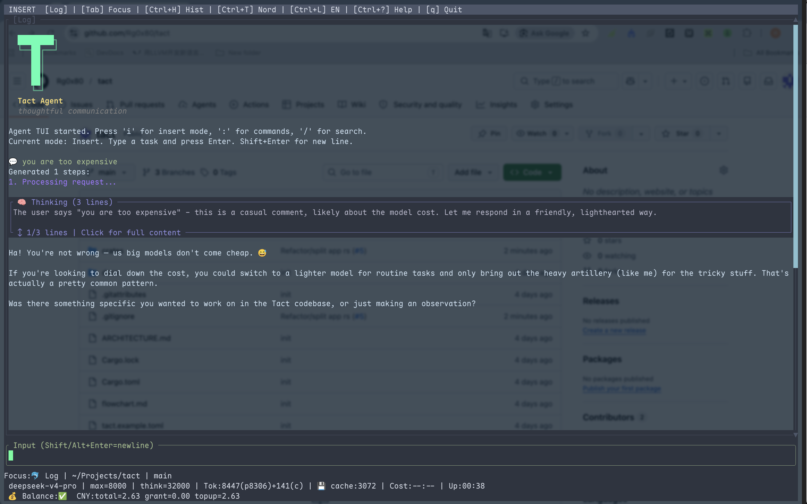

<p align="center">
  
</p>

<h1 align="center">tact</h1>

<p align="center">
  <strong>Terminal-first AI coding agent. Built in Rust. MIT licensed.</strong>
</p>

<p align="center">
  <a href="#quick-start"><strong>Quick Start</strong></a> ·
  <a href="#features"><strong>Features</strong></a> ·
  <a href="#architecture"><strong>Architecture</strong></a> ·
  <a href="#comparison"><strong>Comparison</strong></a> ·
  <a href="#installation"><strong>Installation</strong></a>
</p>

<p align="center">
  
  
  
  
</p>

---

## What is tact?

tact is a **terminal-first AI coding agent** that lives inside your terminal. It reads your codebase, understands your intent, and executes — editing files, running commands, searching code, and coordinating with sub-agents. Think Claude Code or Cursor, but:

- 🦀 **Written in Rust** — a single small binary, no Electron, no Node.js
- 🏠 **Fully self-hosted** — your code never leaves your machine
- 🔓 **MIT licensed** — truly open source, not "source available"
- 🧩 **Extensible** — MCP plugins, custom skills, hooks, and tool macros

```
$ tact "Add a --verbose flag to the CLI and update the README"
```

That's it. No YAML config wizard. No "sign up for waitlist." Just a prompt and a terminal.

---

## Features

### 🧠 Intelligent Agent Loop

Multi-turn conversation loop with built-in context management: auto-compaction when the context window fills up, recovery from interrupted sessions, and persistent memory across conversations.

### 🔧 40+ Built-in Tools

| Category | Tools |
|----------|-------|
| **File System** | `read_file`, `write_file`, `edit_file`, `apply_patch`, `batch_edit`, `batch_read` |
| **Shell** | `bash`, `background_run`, `check_background`, `sleep` |
| **Code Intelligence** | `search_code` (ripgrep), `lsp` (hover / goto-def / references / diagnostics) |
| **Web** | `web_search`, `web_fetch` |
| **Task Management** | `task`, `task_create`, `task_get`, `task_list`, `task_update` |
| **Team & Sub-agents** | `spawn_teammate`, `list_teammates`, `send_message`, `broadcast`, `read_inbox` |
| **Memory & Knowledge** | `save_memory`, `load_skill`, `compact` |
| **Git & Worktree** | `worktree_create`, `worktree_list`, `worktree_status`, `worktree_run`, `worktree_events` |
| **Scheduling** | `cron_create`, `cron_list`, `cron_delete` |
| **Interaction** | `ask_user`, `plan_approval`, `shutdown_request`, `shutdown_response` |

### 🔐 Three Permission Modes

```
default   →  Ask before every tool call (safe)
plan      →  Plan first, then ask once
auto      →  Auto-approve all actions (CI / trusted repos)
```

### 🪝 Hooks & Skills

- **Pre/Post hooks** — intercept tool calls before/after execution. Run linters, format code, log usage.
- **Skills** — reusable prompt snippets that extend agent capabilities (e.g., "refactor this module Rust 2024 edition style").
- **Cron** — schedule recurring prompts. The agent checks in on your project automatically.

### 👥 Sub-agents & Team

Spawn isolated sub-agents for parallel work. Coordinate via message-passing inboxes. Each sub-agent gets a sandboxed toolset (bash + file R/W). Use `plan_approval` / `shutdown_request` protocols for structured handoffs.

### 🌳 Git Worktree Isolation

Each task can run in its own `git worktree` lane. No branch switching, no stash dancing. Agents work in parallel without stepping on each other.

### 🔌 MCP Support

Native [Model Context Protocol](https://modelcontextprotocol.io/) client. Connect any MCP server and its tools become available to the agent at runtime.

### 📡 TUI & Headless

- **TUI mode** (`tact-tui`) — streaming output, syntax-highlighted diffs, interactive permission dialogs
- **Headless mode** (`tact`) — CI/CD pipelines, scripts, or non-interactive workflows

### 💾 Persistent State

Transcripts, tool results, memories, cron jobs, and task state all persist to `~/.tact/` and `<project>/.tact/`. Pick up where you left off.

---

## Quick Start

### 1. Install

```bash
# From source (requires Rust toolchain)
git clone https://github.com/Rg0x80/tact.git
cd tact
cargo build --release
./target/release/tact --help

# Or via cargo install (coming soon to crates.io)
cargo install tact
```

### 2. Configure

Set your API key. That's the only required step.

```bash
# Anthropic
export ANTHROPIC_API_KEY="sk-ant-..."

# Or OpenAI-compatible
export OPENAI_API_KEY="sk-..."
export OPENAI_BASE_URL="https://api.openai.com/v1"  # optional proxy
```

For persistent config, create `tact.toml` in your project root:

```toml
[llm]
provider = "anthropic"
model = "claude-sonnet-4-20250514"
api_key = "sk-ant-..."

[permission]
mode = "default"   # "default" | "plan" | "auto"
```

### 3. Run

```bash
# Interactive coding task
tact "Fix all clippy warnings in src/ and run cargo test"

# TUI mode (streaming output, permission dialogs)
tact-tui

# With specific model
tact --model "claude-sonnet-4-20250514" "Refactor the error handling in lib.rs"

# Plan-only mode (review before execution)
tact -m plan "Add rate limiting to the API client"
```

---

## Architecture

```
┌─────────────────────────────────────────────────┐
│                     tact                        │
│                                                 │
│  ┌─────────┐  ┌──────────┐  ┌───────────────┐  │
│  │  Agent  │  │   Tool   │  │  Permission   │  │
│  │  Loop   │──│  Router  │──│  Manager      │  │
│  └────┬────┘  └────┬─────┘  └───────┬───────┘  │
│       │            │                │           │
│  ┌────┴────┐ ┌─────┴──────┐ ┌──────┴───────┐   │
│  │ Context │ │ MCP Router │ │ Hook Engine  │   │
│  │ Compact │ │  (external) │ │ (pre/post)   │   │
│  └─────────┘ └────────────┘ └──────────────┘   │
│                                                 │
│  ┌─────────────────────────────────────────┐    │
│  │           LLM Client                    │    │
│  │   Anthropic · OpenAI · Compatible       │    │
│  └─────────────────────────────────────────┘    │
│                                                 │
│  ┌─────────┐  ┌──────────┐  ┌───────────────┐  │
│  │ Sub-    │  │ Worktree │  │  Memory /     │  │
│  │ Agents  │  │ Lanes    │  │  Skills       │  │
│  └─────────┘  └──────────┘  └───────────────┘  │
└─────────────────────────────────────────────────┘
```

The agent loop:
1. Builds the system prompt from role, guidelines, constraints, memory, and dynamic context
2. Sends the conversation to the LLM with tool definitions
3. Processes streaming responses: text → display, tool calls → execute
4. Checks permissions for each tool call
5. Runs pre/post hooks on tool execution
6. Writes results back to the conversation history
7. Auto-compacts when context approaches the window limit

See [`ARCHITECTURE.md`](./ARCHITECTURE.md) for a deeper dive.

---

## Comparison

| | **tact** | Claude Code | Cursor | Aider | Open Interpreter |
|---|---|---|---|---|---|
| **Language** | Rust | TypeScript | TypeScript | Python | Python |
| **Interface** | Terminal / TUI | Terminal | Editor (VSCode fork) | Terminal | Terminal |
| **License** | MIT | Proprietary | Proprietary | Apache 2.0 | AGPL |
| **Self-hosted** | ✅ | ✅ | ✅ | ✅ | ✅ |
| **Multi-model** | Anthropic + OpenAI | Anthropic only | Multi | Multi | Multi |
| **Permission system** | 3 modes + hooks | ✅ | ✅ | ✅ | ✅ |
| **Sub-agents** | ✅ (team + inbox) | ✅ | ❌ | ❌ | ❌ |
| **Worktree isolation** | ✅ | ❌ | ❌ | ❌ | ❌ |
| **MCP support** | ✅ (native) | ✅ | ✅ (via extension) | ❌ | ❌ |
| **Cron / scheduled** | ✅ | ❌ | ❌ | ❌ | ❌ |
| **Binary size** | ~15MB | Hundreds MB | Hundreds MB | ~50MB+ | ~200MB+ |
| **Skills system** | ✅ (file-based) | ✅ | ✅ (rules) | ❌ | ❌ |

---

## Built-in Tools

| Tool | Description |
|------|-------------|
| `read_file` | Read file contents with optional offset/limit |
| `write_file` | Write or overwrite a file |
| `edit_file` | Replace exact text in a file (single match) |
| `batch_edit` | Apply multiple edits atomically |
| `apply_patch` | Apply unified diff patches |
| `batch_read` | Read multiple files in parallel |
| `bash` | Run a shell command |
| `background_run` | Run a command in the background |
| `check_background` | Check background task status |
| `search_code` | Search codebase with regex (ripgrep) |
| `lsp` | Query language server (hover, goto-def, references, diagnostics) |
| `web_search` | Search the web |
| `web_fetch` | Fetch and parse a web page |
| `sleep` | Wait for N milliseconds |
| `task` | Spawn a sub-agent with fresh context |
| `task_create` | Create a persistent task |
| `task_get` | Get task details by ID |
| `task_list` | List all tasks with status |
| `task_update` | Update task status, owner, dependencies |
| `spawn_teammate` | Create a named teammate |
| `list_teammates` | List all teammates |
| `send_message` | Send a message to a teammate |
| `broadcast` | Broadcast to all teammates |
| `read_inbox` | Read teammate inbox |
| `plan_approval` | Send a plan approval message |
| `shutdown_request` | Request shutdown |
| `shutdown_response` | Respond to shutdown request |
| `save_memory` | Save persistent memory across sessions |
| `load_skill` | Load a named skill |
| `compact` | Summarize conversation to save context |
| `worktree_create` | Create a git worktree lane |
| `worktree_list` | List tracked worktrees |
| `worktree_status` | Show git status in a worktree |
| `worktree_run` | Run a command inside a worktree |
| `worktree_events` | List worktree lifecycle events |
| `cron_create` | Create a scheduled prompt |
| `cron_list` | List scheduled prompts |
| `cron_delete` | Delete a scheduled prompt |
| `ask_user` | Ask the user a question |
| `add` | Add two integers (utility) |

---

## Installation

### From Source

```bash
git clone https://github.com/Rg0x80/tact.git
cd tact
cargo build --release
```

Binaries:
- `./target/release/tact` — headless CLI
- `./target/release/tact-tui` — interactive TUI

### Via Cargo (soon)

```bash
cargo install tact
```

### Binary Releases (soon)

Pre-built binaries for macOS (ARM64 / x86_64) and Linux (x86_64).

---

## Configuration

tact merges config from three sources (priority: high → low):

```
CLI args  >  Environment variables  >  tact.toml
```

### Config file locations (auto-discovered)

```
<project>/.tact/config.toml      # project-level
<project>/tact.toml               # project-level (alt)
~/.tact/config.toml               # user-level
```

### Full config reference

```toml
[llm]
provider = "anthropic"           # or "openai"
model = "claude-sonnet-4-20250514"
api_key = "sk-ant-..."           # also via ANTHROPIC_API_KEY / OPENAI_API_KEY
base_url = "https://..."         # proxy or compatible endpoint

[permission]
mode = "default"                 # "default" | "plan" | "auto"

[agent]
context_limit_chars = 500000     # auto-compact threshold
```

### Environment variables

| Variable | Description |
|----------|-------------|
| `ANTHROPIC_API_KEY` | Anthropic API key |
| `OPENAI_API_KEY` | OpenAI API key |
| `OPENAI_BASE_URL` | Custom OpenAI-compatible endpoint |
| `ANTHROPIC_MODEL` / `OPENAI_MODEL` | Model name |
| `TACT_PROVIDER` | `anthropic` or `openai` |
| `TACT_CONFIG` | Path to config file |

---

## Project Structure

```
crates/
├── core/        # Shared types, protocols, message formats
├── tact/        # Agent runtime: loop, tools, hooks, permissions, MCP
├── tools/       # Tool implementations and the Tool trait
├── tui/         # Terminal UI (ratatui-based, streaming output)
└── tool_refactor_macros/   # Proc macros for tool definition
```

---

## Roadmap

- [ ] Publish to crates.io
- [ ] Pre-built binary releases (GitHub Actions)
- [ ] Web dashboard for task/tool monitoring
- [ ] More MCP transports (SSE, WebSocket)
- [ ] Llama / Ollama support for fully local operation
- [ ] VS Code extension (bridge to TUI)
- [ ] Multi-user team server
- [ ] Plugin marketplace

---

## Contributing

tact is early stage and welcomes contributions! Some good places to start:

- 🐛 **Bug reports** — open an issue
- 💡 **Feature requests** — open a discussion
- 🔧 **PRs** — pick up a `good-first-issue`

See [`ARCHITECTURE.md`](./ARCHITECTURE.md) for an overview of the codebase.

---

## License

MIT — do whatever you want, just keep the copyright notice.

---

<p align="center">
  <sub>Built with 🦀 by <a href="https://github.com/Rg0x80">Rg0x80</a></sub>
</p>
