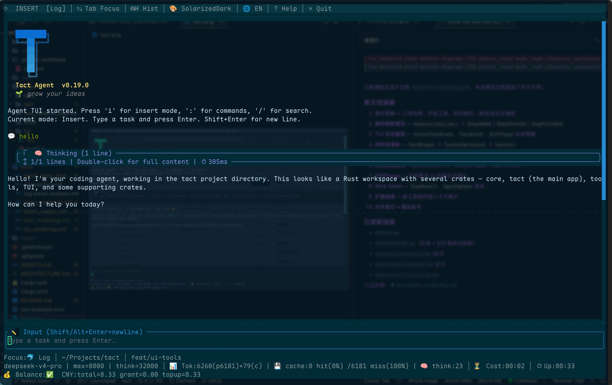

<p align="center">
  
</p>

<h1 align="center">tact</h1>

<p align="center">
  <strong>Terminal-first AI coding agent. Built in Rust. MIT licensed.</strong>
</p>

<p align="center">
  <a href="#quick-start"><strong>Quick Start</strong></a> ·
  <a href="#features"><strong>Features</strong></a> ·
  <a href="#architecture"><strong>Architecture</strong></a> ·
  <a href="#configuration"><strong>Configuration</strong></a>
</p>

<p align="center">
  
  
  
  
  <a href="https://ko-fi.com/00x80">
    
  </a>
</p>

---

## What is tact?

tact is a **terminal-first AI coding agent** that lives inside your terminal. It reads your codebase, understands your intent, and executes — editing files, running commands, searching code, and coordinating with sub-agents.

- 🦀 **Written in Rust** — a single small binary, no Electron, no Node.js runtime
- 🏠 **Fully self-hosted** — your code never leaves your machine (only LLM API traffic)
- 🔓 **MIT licensed** — open source
- 🧩 **Extensible** — MCP plugins, custom skills, hooks, and tool macros

```
$ tact-ui headless "Add a --verbose flag to the CLI and update the README"
```

That's it. Configure a provider, open a terminal, and prompt.

---

## Quick Start

### 1. Install

**Linux / macOS**

```bash
curl -fsSL https://raw.githubusercontent.com/rust-infra/tact/main/scripts/install.sh | bash
```

Or from a clone:

```bash
./scripts/install.sh --from-source
```

**Windows (PowerShell)**

```powershell
irm https://raw.githubusercontent.com/rust-infra/tact/main/scripts/install.ps1 | iex
```

Or from a clone:

```powershell
.\scripts\install.ps1 -FromSource
```

The installer prefers a matching GitHub release asset when one exists, otherwise
builds `tact-ui` from source (requires **Rust 1.85+** / edition 2024; installs
rustup if needed). Pass `--from-source` / `-FromSource` to skip the release
download, or `--release` / `-Release` to prefer a pre-built binary with source
fallback:

```bash
curl -fsSL https://raw.githubusercontent.com/rust-infra/tact/main/scripts/install.sh | bash -s -- --release
```

Install options:

| Platform | Flag | Meaning |
|----------|------|---------|
| Unix | `--install-dir DIR` | Install location (default: `~/.local/bin`) |
| Unix | `--system` | Install to `/usr/local/bin` |
| Unix | `--from-source` | Build from source only |
| Unix | `--release` | Prefer GitHub release, fall back to source |
| Unix | `--release-only` | Require a GitHub release (no source fallback) |
| Windows | `-InstallDir PATH` | Install location (default: `%USERPROFILE%\.local\bin`) |
| Windows | `-FromSource` | Build from source only |
| Windows | `-Release` | Prefer GitHub release, fall back to source |
| Windows | `-ReleaseOnly` | Require a GitHub release (no source fallback) |

**Manual build from source**

Linux: install SQLite build dependencies first (required by `sqlx` / session store).
Building from source requires **Rust 1.85+** (edition 2024):

```bash
sudo apt-get update
sudo apt-get install -y libsqlite3-dev pkg-config clang libclang-dev
```

```bash
git clone https://github.com/rust-infra/tact.git
cd tact
rustup toolchain install stable   # if needed; rustc >= 1.85
cargo build --release --locked -p tact-ui
./target/release/tact-ui --help
```

Via Cargo (coming soon to crates.io):

```bash
cargo install --path crates/tact-ui   # or: cargo install -p tact-ui from the repo root
```

**Binary releases:** push a version tag to publish pre-built binaries for Linux (x86_64 / ARM64), macOS (x86_64 / ARM64), and Windows (x86_64):

```bash
git tag v1.1.22
git push origin v1.1.22
```

GitHub Actions (`.github/workflows/release.yml`) uploads `tact-ui-v<version>-<target-triple>.tar.gz` / `.zip` plus `SHA256SUMS`.

### 2. Configure

Create `config.toml` in your project root (or `~/.tact/config.toml` for user-level defaults):

```toml
[llm]
provider = "anthropic"   # selects [llm.providers.anthropic]

[llm.providers.anthropic]
model = "claude-sonnet-4-20250514"
api_key = "sk-ant-..."
base_url = "https://api.anthropic.com"  # required for anthropic

[permission]
mode = "default"   # "default" | "plan" | "auto"

[agent]
model_context_window = 200000
snapshot_max_items = 80
micro_compact_enabled = false
notifications_enabled = true

[ui]
theme = "retro"   # ink | ink-light | retro | brutal | nord | dark | auto ...

[tools]
# Bash wall-clock timeout in seconds (default: 1800; 0 disables timeout)
bash_timeout_secs = 1800
# Bash process niceness (default: 10; 0 disables)
bash_nice = 10
```

CLI flags override the config file (e.g. `--model`, `--api-key`, `--theme`).

Optional agent settings (config file or CLI):

| Setting | CLI flag | Default | Description |
|---|---|---|---|
| `snapshot_max_items` | `--snapshot-max-items` | `80` | Max entries in the system-prompt Project structure snapshot |
| `model_context_window` | `--model-context-window` | `200000` | Model context window in tokens (80% auto-compact + TUI usage meter) |
| `micro_compact_enabled` | `--no-micro-compact` | `false` | Stub old tool results before each LLM call when enabled |

### 3. Run

```bash
# Interactive TUI (default)
tact-ui

# Headless single-shot task
tact-ui headless "Fix all clippy warnings in src/ and run cargo test"

# With specific model
tact-ui headless --model "claude-sonnet-4-20250514" "Refactor the error handling in lib.rs"

# Plan-only mode (review before execution)
tact-ui -m plan headless "Add rate limiting to the API client"
```

Persisted sessions can be resumed with `--session ID` or `--resume-last`; inspect
recent sessions with `--list-sessions`. Plugin and marketplace management is also
available without starting the TUI:

```bash
tact-ui plugin list
tact-ui plugin install superpowers@claude-plugins-official
tact-ui plugin marketplace add owner/repository
tact-ui plugin marketplace list
tact-ui plugin reload
```

Self-upgrade is built in:

```bash
tact-ui upgrade --check   # check for a newer release without installing
tact-ui upgrade           # prompt, then upgrade to the newest release binary
tact-ui upgrade --yes     # skip the confirmation prompt
```

`tact upgrade` finds the newest GitHub release that ships a binary for your
platform (asset-less tags and pre-releases are skipped), downloads it, verifies
it against the published `SHA256SUMS`, and atomically replaces the running
executable on macOS/Linux. Track a fork with `--repo owner/name` (or the
`TACT_UPGRADE_REPO` environment variable). On Windows, re-run
`scripts/install.ps1` to upgrade.

---

## Features

### 🧠 Intelligent Agent Loop

Multi-turn conversation loop with progressive context management:

1. **Large-output spill** — oversized tool results land on disk with a short preview in context
2. **Micro-compact (optional)** — when enabled, stub old tool results before each LLM call (keep the last 12 intact)
3. **Full compact** — for chat-completions providers, when reported/estimated tokens hit ~80% of `model_context_window`, on prompt-too-long recovery, or via a successful `compact` tool: write a JSONL transcript, summarize, and rebuild as **recent real user turns + handoff summary**. OpenAI Responses uses provider-native compaction; DeepSeek Responses falls back to the local summary pipeline when its explicit compact endpoint is unavailable.

The entry path reserves the incoming user turn before push, so a large prompt cannot overflow immediately after append. Failed `compact` tool calls leave history intact.

Details: [`book/05_chapter_compact.md`](./book/05_chapter_compact.md) ([中文](./book/05_chapter_compact_zh.md)), [`docs/compaction.md`](./docs/compaction.md).

### 🔧 Built-in Tools

| Category | Tools |
|----------|-------|
| **File System** | `read_file`, `write_file`, `edit_file` |
| **Shell** | `bash`, `background_run`, `check_background`, `sleep` |
| **Task Management** | `task_create`, `task_get`, `task_list`, `task_update` |
| **Team & Sub-agents** | `spawn_subagent`, `spawn_teammate`, `list_teammates`, `send_message`, `broadcast`, `read_inbox` |
| **Memory & Knowledge** | `save_memory`, `load_skill`, `compact` |
| **Git & Worktree** | `worktree_create`, `worktree_list`, `worktree_status`, `worktree_run`, `worktree_events` |
| **Scheduling** | `cron_create`, `cron_list`, `cron_delete` |
| **Interaction** | `ask_user`, `plan_approval`, `shutdown_request`, `shutdown_response` |

In the interactive TUI, a running `bash` tool shows a bounded five-line live
tail. stdout and stderr are merged in the order Tact observes their pipe reads,
with stderr styled as warning text. Tact does not add a PTY, rewrite commands,
or bypass buffering owned by the command or pipeline. Headless mode remains
final-result-only.

### 🔐 Three Permission Modes

```
default   →  Ask before every tool call (safe)
plan      →  Plan first, then ask once
auto      →  Auto-approve all actions (CI / trusted repos)
```

### 🪝 Hooks & Skills

- **Pre/Post hooks** — intercept tool calls before/after execution. Run linters, format code, log usage.
- **Skills** — `SKILL.md` playbooks under `<workdir>/.tact/skills/`, `~/.tact/skills/`, `~/.agents/skills/`, `.claude/skills/`, and optional `[agent].skill_dirs` (summaries in the system prompt; full body via `load_skill` or TUI `/skill-name`).
- **Model picker** — TUI `/model` uses configured `models = [...]` first and supplements OpenAI-compatible `openai`, `deepseek`, and `kimi` providers with a cached `GET {base_url}/models` result.
- **Voice input** — optional microphone recording and transcription via OpenAI, Google Cloud Speech-to-Text, or a local `whisper.cpp` server, configured under `[voice]` (macOS-first). Google API-key mode uses synchronous recognition for recordings up to 60 seconds.
- **Cron** — schedule recurring prompts. The agent checks in on your project automatically.

### 🧩 Plugin Marketplace

Tact installs skill-only plugins natively. The built-in `claude-plugins-official` marketplace is available in every installation:

```text
/plugin install superpowers@claude-plugins-official
/superpowers:brainstorming
```

Add another marketplace with `/plugin marketplace add <source>`. A source may be a GitHub shorthand such as `owner/repository`, a Git URL, or a remote `marketplace.json` URL. Tact derives the marketplace name from the source's final path component; use that name with `/plugin marketplace update <name>`, `/plugin marketplace remove <name>`, and `/plugin install <plugin>@<name>`.

In the TUI, `/plugin list` and `/plugin marketplace list` render as titled tables (one row per plugin or marketplace). `/plugin reload` refreshes discovered plugin skills.

Tact owns marketplace state, checkouts, and revision-locked plugin caches under `~/.tact/plugins/`. It loads only `skills/*/SKILL.md` from an installed plugin; plugin hooks, agents, MCP servers, commands, LSPs, monitors, and executables are not loaded or run. Installed skills use `/plugin:skill` (for example `/superpowers:brainstorming`); standalone skills keep the unprefixed `/skill` form.

### 👥 Sub-agents & Team

Spawn isolated sub-agents for parallel work. Coordinate via message-passing inboxes. Each sub-agent gets a sandboxed toolset (bash + file R/W). Use `plan_approval` / `shutdown_request` protocols for structured handoffs.

### 🌳 Git Worktree Isolation

Each task can run in its own `git worktree` lane. No branch switching, no stash dancing. Agents work in parallel without stepping on each other.

### 🔌 MCP Support

Native [Model Context Protocol](https://modelcontextprotocol.io/) client. Connect any MCP server and its tools become available to the agent at runtime.

### 📡 TUI & Headless

- **TUI mode** (`tact-ui`) — streaming output, syntax-highlighted diffs, interactive permission dialogs
- **Headless mode** (`tact-ui headless`) — CI/CD pipelines, scripts, or non-interactive workflows

### 🖼️ Image attachments (vision)

Attach workspace images with `@path/to.png` or ``. Raster files are optionally compressed via `[ui.vision_image]` before base64 attachment.

**Requires a vision-capable model/endpoint.** OpenAI-compatible providers send images as `image_url` content parts; text-only models or gateways that only accept `text` reject the request (HTTP 400, e.g. `unknown variant image_url, expected text`). Use a multimodal model (e.g. Claude vision, GPT-4o), or omit image attachments on text-only models.

### 💾 Persistent State

Transcripts, tool results, memories, cron jobs, and task state all persist to `~/.tact/` and `<project>/.tact/`. Pick up where you left off.

---

## Architecture

```
┌─────────────────────────────────────────────────┐
│                     tact                        │
│                                                 │
│  ┌─────────┐  ┌──────────┐  ┌───────────────┐  │
│  │  Agent  │  │   Tool   │  │  Permission   │  │
│  │  Loop   │──│  Router  │──│  Manager      │  │
│  └────┬────┘  └────┬─────┘  └───────┬───────┘  │
│       │            │                │           │
│  ┌────┴────┐ ┌─────┴──────┐ ┌──────┴───────┐   │
│  │ Context │ │ MCP Router │ │ Hook Engine  │   │
│  │ Compact │ │  (external) │ │ (pre/post)   │   │
│  └─────────┘ └────────────┘ └──────────────┘   │
│                                                 │
│  ┌─────────────────────────────────────────┐    │
│  │           LLM Client                    │    │
│  │   Anthropic · OpenAI · Compatible       │    │
│  └─────────────────────────────────────────┘    │
│                                                 │
│  ┌─────────┐  ┌──────────┐  ┌───────────────┐  │
│  │ Sub-    │  │ Worktree │  │  Memory /     │  │
│  │ Agents  │  │ Lanes    │  │  Skills       │  │
│  └─────────┘  └──────────┘  └───────────────┘  │
└─────────────────────────────────────────────────┘
```

The agent loop:
1. Optionally auto-compacts **old** history (reserving space for the incoming user turn), then appends the turn
2. Builds the system prompt from role, guidelines, constraints, memory, and dynamic context
3. Micro-compacts old tool results when enabled; auto-compacts again if the window is still over the threshold
4. Sends the conversation to the LLM with tool definitions
5. Processes streaming responses: text → display, tool calls → execute
6. Checks permissions for each tool call
7. Runs pre/post hooks on tool execution
8. Writes results back to the conversation history; a successful `compact` tool then rewrites context
9. Continues until the model stops requesting tools (or recovery exhausts)

See [`ARCHITECTURE.md`](./ARCHITECTURE.md) for a deeper dive, and the [book](./book/index.md) for chapter-length walkthroughs (compaction, recovery, tools, agent loop).

---

## Built-in Tools

| Tool | Description |
|------|-------------|
| `read_file` | Read file contents with optional offset/limit; default page is 2000 lines / ~25k approx tokens with a PARTIAL continuation marker |
| `write_file` | Write or overwrite a file |
| `edit_file` | Replace exact text in a file (first match, or all with `replace_all`) |
| `bash` | Run a shell command |
| `background_run` | Run a command in the background |
| `check_background` | Check background task status |
| `sleep` | Wait for N milliseconds |
| `spawn_subagent` | Spawn a sub-agent with fresh context |
| `task_create` | Create a persistent task |
| `task_get` | Get task details by ID |
| `task_list` | List all tasks with status |
| `task_update` | Update task status, owner, dependencies |
| `spawn_teammate` | Create a named teammate |
| `list_teammates` | List all teammates |
| `send_message` | Send a message to a teammate |
| `broadcast` | Broadcast to all teammates |
| `read_inbox` | Read teammate inbox |
| `plan_approval` | Send a plan approval message |
| `shutdown_request` | Request shutdown |
| `shutdown_response` | Respond to shutdown request |
| `save_memory` | Save persistent memory across sessions |
| `load_skill` | Load a named skill |
| `compact` | Request conversation summarization (rewrites history only on success) |
| `worktree_create` | Create a git worktree lane |
| `worktree_list` | List tracked worktrees |
| `worktree_status` | Show git status in a worktree |
| `worktree_run` | Run a command inside a worktree |
| `worktree_events` | List worktree lifecycle events |
| `cron_create` | Create a scheduled prompt |
| `cron_list` | List scheduled prompts |
| `cron_delete` | Delete a scheduled prompt |
| `ask_user` | Ask the user (TUI popup; `multi_select` for checkboxes) |

---

## Configuration

tact merges config from two sources (priority: high → low):

```
CLI args  >  config.toml
```

Use `--config /path/to/config.toml` to point at a specific file instead of auto-discovery.

### Config file locations (auto-discovered)

```
<project>/.tact/config.toml      # project-level
<project>/config.toml             # project-level (alt)
~/.tact/config.toml               # user-level
```

### Full config reference

```toml
[llm]
provider = "anthropic"           # selects [llm.providers.anthropic]
max_tokens = 8000                 # optional global default
thinking_budget = 0               # optional global default; 0 = off

[llm.providers.anthropic]
model = "claude-sonnet-4-20250514"
api_key = "sk-ant-..."
base_url = "https://api.anthropic.com"  # required for anthropic

[llm.providers.openai]
model = "gpt-4o"
api_key = "sk-..."
protocol = "responses"            # responses | chat_completions
# reasoning_effort = "high"       # none|minimal|low|medium|high|xhigh|max
# base_url = "https://api.openai.com/v1"
# responses_compact_threshold = 160000

[llm.providers.deepseek]
model = "deepseek-chat"
api_key = "sk-..."
# protocol = "responses"          # otherwise chat_completions

[llm.providers.kimi]
model = "kimi-k2.5"
api_key = "sk-..."
models = ["kimi-k2.5", "kimi-for-coding"]

[permission]
mode = "default"                 # default | plan | auto

[agent]
model_context_window = 200000     # tokens; 80% auto-compact + TUI meter
snapshot_max_items = 80
micro_compact_enabled = false     # stub old tool results before each LLM call
notifications_enabled = true
skill_body_auto_inject = false
# skill_dirs = ["~/shared-skills", "./vendor/skills"]
# instruction_sources = ["agents_md"]
# instruction_sources = ["agents_md", "claude_md"]

[agent.subagent]
# provider = "deepseek"            # key from [llm.providers.*]
# model = "deepseek-chat"
# max_tokens = 8000
# thinking_budget = 0

[ui]
theme = "retro"                  # ink | ink-light | retro | brutal | nord | dark | auto
# vision_image.* only reduces tokens for attached images; it does not enable vision
# [ui.vision_image]
# compress = true
# max_edge = 1280
# jpeg_quality = 80

[voice]
enabled = false                   # macOS-first microphone input
# provider = "openai"             # openai | google | whisper_cpp
# api_key = "..."                 # OpenAI/Google API key; separate from LLM key
# base_url = "https://api.openai.com/v1" # Google: https://speech.googleapis.com/v1
# model = "gpt-4o-mini-transcribe" # Google default: latest_short
# language = "zh"                  # Google examples: zh-CN | en-US
# max_duration_secs = 300           # Google maximum: 60; others: 600
# voice_keybind = "ctrl+g"

[tools]
bash_timeout_secs = 1800         # wall-clock seconds; 0 disables timeout
bash_nice = 10                    # process niceness, 0 disables
```

### CLI flags (override config)

| Flag | Description |
|------|-------------|
| `--config` | Path to config file |
| `--provider` | LLM provider |
| `--model` | Model name |
| `--api-key` | API key |
| `--base-url` | API base URL |
| `--max-tokens` | Max tokens per LLM call |
| `--thinking-budget` | Extended thinking budget |
| `--permission-mode` / `-m` | Permission mode |
| `--session ID` | Resume a specific persisted session |
| `--resume-last` | Resume the most recent session |
| `--list-sessions` | List recent sessions and exit |
| `--notifications BOOL` | Enable/disable desktop notifications |
| `--no-notifications` | Disable desktop notifications |
| `--model-context-window` | Model context window before auto-compaction |
| `--theme` | TUI theme |
| `--snapshot-max-items` | Project structure snapshot size |
| `--no-micro-compact` | Disable micro-compaction |
| `--skill-body-auto-inject` | Inject full skill bodies into the system prompt |
| `--tokio-console` | Enable tokio-console debugging |

---

## License

MIT — do whatever you want, just keep the copyright notice.
