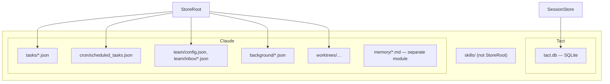
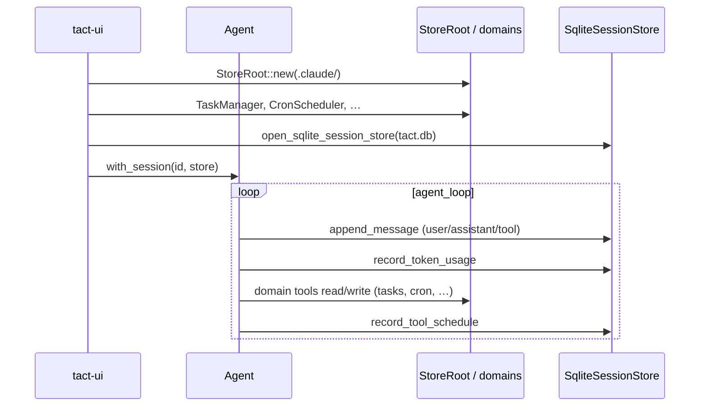

# Store and Persistence

This chapter explains Tact's **on-disk persistence layers**: the JSON file store under `.claude/` and the separate SQLite session database. Together they hold conversation history, domain state (tasks, cron, teammates, …), and observability data.

Memory ([Persistent Memory](./03_chapter_memory.md)) uses Markdown files in `.claude/memory/` and is **not** part of the JSON store API.

---

## 1. Two Persistence Layers

Tact deliberately splits concerns:

| Layer | Location | API | Primary use |
|-------|----------|-----|-------------|
| **JSON store** | `<workdir>/.claude/` | `StoreRoot`, `Store<T>`, `CollectionStore<T>` | Domain records (tasks, cron, team, …) |
| **Session store** | `<workdir>/.tact/tact.db` | `SessionStore` trait, `SqliteSessionStore` | Messages, token usage, input history |



Both are initialized at session startup in `main.rs`: `StoreRoot::new(tact_path.claude_dir())` and `open_sqlite_session_store(&tact_path.session_db_path())`.

---

## 2. StoreRoot: Safe Path Resolution

`StoreRoot` (`crates/tact/src/store/mod.rs`) is the entry point for all JSON persistence.

```rust
pub struct StoreRoot { root: PathBuf }
```

| Rule | Behavior |
|------|----------|
| Relative paths only | Absolute paths are rejected |
| Traversal blocked | Resolved path must stay under canonicalized root |
| Auto-create | Root directory created on `StoreRoot::new()` |
| Missing files | Allowed when opening new paths (`allow_missing: true`) |

Factory methods:

```rust
root.file::<T>("cron/scheduled_tasks.json")?     // Store<T>
root.collection::<T>("tasks")?                   // CollectionStore<T>
```

---

## 3. Store&lt;T&gt;: Single JSON File

Typed wrapper around one JSON document (pretty-printed with trailing newline).

| Method | Behavior |
|--------|----------|
| `read()` | Deserialize entire file; error if missing or invalid JSON |
| `write(value)` | Create parent dirs; overwrite file |
| `update(f)` | Read-modify-write |
| `append(value)` | Append one JSON line (JSONL) |
| `read_all()` | Parse all non-empty lines as `Vec<T>` |
| `delete()` | Remove file; report whether it existed |
| `exists()` | Path check |

Used for **index files** and **single-document registries** — e.g. `tasks/index.json`, `cron/scheduled_tasks.json`, `team/config.json`.

---

## 4. CollectionStore&lt;T&gt;: Keyed JSON Files

One `{key}.json` file per record inside a directory.

| Method | Behavior |
|--------|----------|
| `read(key)` / `write(key, value)` | Per-key file I/O |
| `append(key, value)` | JSONL append on that key's file |
| `read_all_from(key)` | All lines from one key's file |
| `delete(key)` | Remove `{key}.json` |
| `list()` | Read every `*.json` in the directory (except `index.json`) |
| `exists(key)` | Check `{key}.json` |

Invalid keys (`/`, `\`, `.`, `..`) are rejected.

### Example: TaskManager

```rust
tasks: root.collection("tasks")?,           // tasks/{id}.json
index: root.file("tasks/index.json")?,      // next_id counter
```

TaskManager persistence is covered here; the **`task_*` tools and dependency model** are covered in [Ch 19 Persistent Task Manager](./19_chapter_persistent_tasks.md). [Ch 11](./11_chapter_task.md) covers **tool parallel scheduling**, not TaskManager.

---

## 5. Domain Consumers

| Module | Store paths | Pattern |
|--------|-------------|---------|
| `task/` | `tasks/`, `tasks/index.json` | Collection + index |
| `cron/` | `cron/scheduled_tasks.json` | Single `Store<ScheduledTaskIndex>` |
| `background.rs` ([Background Tasks](./13_chapter_background.md)) | `background/tasks/` | Collection |
| `team.rs` ([Team Coordination](./14_chapter_team.md)) | `team/config.json`, `team/inbox/` | Store + collection |
| `worktree/` ([Worktree Lanes](./15_chapter_worktree.md)) | `worktrees/index.json` | Single `Store<WorktreeIndex>` |

Each domain module wraps the raw store in `Arc<Mutex<…>>` (e.g. `SharedTaskManager`) and exposes tool-facing APIs — callers should not manipulate `CollectionStore` directly.

---

## 6. Session Store (SQLite)

Defined in `crates/tact/src/store/session_store/`. The trait is async; the default implementation is `SqliteSessionStore`.

### Database location

```text
<workdir>/.tact/tact.db
```

Opened in `main.rs` via `open_sqlite_session_store` at `<workdir>/.tact/tact.db`. At session start, `SessionLockGuard` sets `locked_by` + `lock_epoch` (process start identity); `0`/empty means unlocked. `main` installs SIGINT/SIGTERM listeners that release the lock and exit on abnormal termination.

### Tables

| Table | Purpose |
|-------|---------|
| `sessions` | Session id, `root_dir`, `locked_by` + `lock_epoch` (process lock), timestamps |
| `messages` | Serialized `MessageContent` JSON, ordinal ordering |
| `token_usages` | Per-LLM-call token counts, optional `request_body` blob, optional `tool_schedule` JSON |
| `input_history` | User input strings for TUI recall (max 100 per session) |

### Agent integration

| Agent method | SessionStore call |
|--------------|-------------------|
| `ensure_session()` | `create_session`, `load_session` → restore `runtime.context` |
| `persist_message()` | `append_message` after each context push |
| `persist_llm_call()` | `record_token_usage` |
| `execute_tool_call` (post-schedule) | `record_tool_schedule` on latest token row |

If no session store is attached (`with_session` not called), persistence methods no-op — useful for tests.

### Input history trimming

`MAX_INPUT_HISTORY` = 100. When loading exceeds the cap, oldest rows are deleted in a trim pass.

---

## 7. Lifecycle Diagram



---

## 8. Code Map

| File | Role |
|------|------|
| `crates/tact/src/store/mod.rs` | `StoreRoot`, `Store<T>`, `CollectionStore<T>` |
| `crates/tact/src/store/session_store/mod.rs` | `SessionStore` trait, `DynSessionStore`, `open_sqlite_session_store` |
| `crates/tact/src/store/session_store/sqlite.rs` | Schema, migrations, `SqliteSessionStore` impl |
| `crates/tact/src/agent/mod.rs` | `ensure_session`, `persist_message`, `persist_llm_call` |
| `crates/tact/src/consts.rs` | `TactPath::session_db_path()` → `<workdir>/.tact/tact.db`; `TactPath::workdir()` stored as `sessions.root_dir` |
| `crates/tact-ui/src/main.rs` | Opens SQLite session store; headless/interactive attach domain managers |
| `crates/tact/src/task/mod.rs` | Example `CollectionStore` consumer |
| `crates/tact/src/cron/mod.rs` | Example single-file `Store` consumer |

---

## 9. Current Gaps

| Gap | Detail |
|-----|--------|
| No cross-process locking | JSON files use read-modify-write without file locks |
| `CollectionStore::list()` order | Unsorted directory iteration — order is filesystem-dependent |
| Schema migrations are best-effort | SQLite `ALTER TABLE` failures are ignored (`let _ = …`) |
| Session store optional | Tests and some callers may run without SQLite attached |
| Session DB per workdir | SQLite lives at `<workdir>/.tact/tact.db` today; `sessions.root_dir` records the project path for a future shared `$HOME/.tact/tact.db` |
| `index.json` special case | Skipped in `list()` — easy to forget when adding new index files |

---

## Related Docs

- [Ch 11 Tool Scheduling](./11_chapter_task.md) — wave/barrier model (includes `task` tool as barrier, not TaskManager API)
- [Cron Scheduling](./16_chapter_cron.md) — cron index file layout
- [Persistent Memory](./03_chapter_memory.md) — Markdown memories (not JSON store)
- [ARCHITECTURE.md](../ARCHITECTURE.md#12-configuration) — session store and token usage notes
- [docs/token_usage_schema.md](../docs/token_usage_schema.md) — `token_usages` column details
