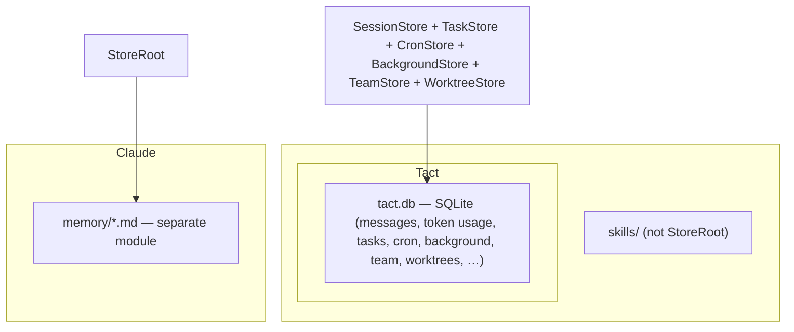
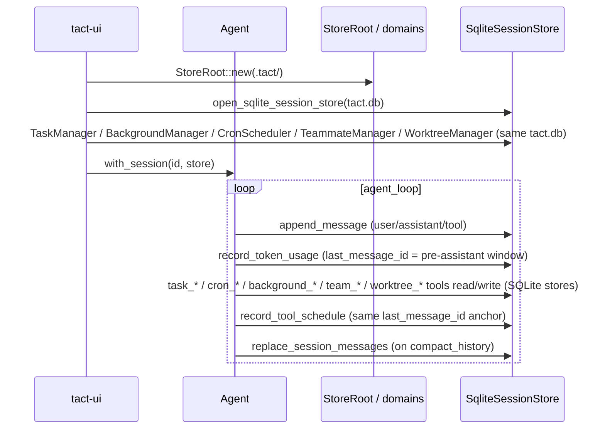

# Store and Persistence
> Language: [English](./01_chapter_store.md) · [中文](./01_chapter_store_zh.md)

This chapter explains Tact's **on-disk persistence layers**: the JSON file store under `.tact/` and the SQLite database. Together they hold conversation history, domain state (worktrees, …), and observability data.

Memory ([Persistent Memory](./03_chapter_memory.md)) uses Markdown files in `.tact/memory/` and is **not** part of the JSON store API.

---

## 1. Two Persistence Layers

Tact deliberately splits concerns:

| Layer | Location | API | Primary use |
|-------|----------|-----|-------------|
| **JSON store** | `<workdir>/.tact/` | `StoreRoot`, `Store<T>`, `CollectionStore<T>` | Generic JSON persistence (no active domain consumers) |
| **SQLite store** | `<workdir>/.tact/tact.db` | `SessionStore` + `TaskStore` + `CronStore` + `BackgroundStore` + `TeamStore` + `WorktreeStore` traits | Messages, token usage, tasks, cron, background, team, worktrees, input history |


```mermaid
graph TB
    subgraph Workdir["<workdir>"]
        Tact[".tact/"]
        Tact[".tact/"]
        Skills["skills/ (not StoreRoot)"]
    end

    subgraph Tact
        DB["tact.db — SQLite (messages, token usage, tasks, cron, background, team, worktrees, …)"]
    end

    subgraph Claude
        Mem["memory/*.md — separate module"]
    end

    SR[StoreRoot] --> Mem

    SS[SessionStore + TaskStore + CronStore + BackgroundStore + TeamStore + WorktreeStore] --> DB
```

Both are initialized at session startup in `main.rs`: `StoreRoot::new(tact_path.tact_dir())` and `open_sqlite_session_store(&tact_path.session_db_path())`.

---

## 2. StoreRoot: Safe Path Resolution

`StoreRoot` (`crates/tact/src/store/mod.rs`) is the entry point for all JSON persistence.

```rust
pub struct StoreRoot { root: PathBuf }
```

| Rule | Behavior |
|------|----------|
| Relative paths only | Absolute paths are rejected |
| Traversal blocked | Resolved path must stay under canonicalized root |
| Auto-create | Root directory created on `StoreRoot::new()` |
| Missing files | Allowed when opening new paths (`allow_missing: true`) |

Factory methods:

```rust
root.file::<T>("cron/scheduled_tasks.json")?     // Store<T>  (legacy cron — no longer read)
root.collection::<T>("tasks")?                   // CollectionStore<T>  (legacy tasks — no longer read)
```

---

## 3. Store&lt;T&gt;: Single JSON File

Typed wrapper around one JSON document (pretty-printed with trailing newline).

| Method | Behavior |
|--------|----------|
| `read()` | Deserialize entire file; error if missing or invalid JSON |
| `write(value)` | Create parent dirs; overwrite file |
| `update(f)` | Read-modify-write |
| `append(value)` | Append one JSON line (JSONL) |
| `read_all()` | Parse all non-empty lines as `Vec<T>` |
| `delete()` | Remove file; report whether it existed |
| `exists()` | Path check |

Used for **index files** and **single-document registries** — a generic persistence primitive (no domain module uses it today; all domain state lives in SQLite).

---

## 4. CollectionStore&lt;T&gt;: Keyed JSON Files

One `{key}.json` file per record inside a directory.

| Method | Behavior |
|--------|----------|
| `read(key)` / `write(key, value)` | Per-key file I/O |
| `append(key, value)` | JSONL append on that key's file |
| `read_all_from(key)` | All lines from one key's file |
| `delete(key)` | Remove `{key}.json` |
| `list()` | Read every `*.json` in the directory (except `index.json`) |
| `exists(key)` | Check `{key}.json` |

Invalid keys (`/`, `\`, `.`, `..`) are rejected.

### Example: background jobs (legacy)

```rust
root.collection::<BackgroundRecord>("background/tasks")?   // background/tasks/{id}.json (legacy)
```

Tasks, cron, background, team, and worktree state no longer use the JSON store — they live in SQLite (see §6).

---

## 5. Domain Consumers

| Module | Store paths | Pattern |
|--------|-------------|---------|
| `task/` | `tact.db` → `tasks`, `task_dependencies` tables | `TaskStore` (SQLite) |
| `cron/` | `tact.db` → `cron_tasks` table | `CronStore` (SQLite) |
| `background.rs` ([Background Tasks](./13_chapter_background.md)) | `tact.db` → `background_tasks` table | `BackgroundStore` (SQLite) |
| `team.rs` ([Team Coordination](./14_chapter_team.md)) | `tact.db` → `teammates`, `inbox_messages` tables | `TeamStore` (SQLite) |
| `worktree/` ([Worktree Lanes](./15_chapter_worktree.md)) | `tact.db` → `worktrees`, `worktree_events` tables | `WorktreeStore` (SQLite) |

Each domain module wraps the raw store (e.g. `SharedCronScheduler` over `Arc<CronScheduler>`; `SharedTaskManager` / `SharedBackgroundManager` / `SharedTeammateManager` / `SharedWorktreeManager` over `Arc<…>` — the SQLite pool already serializes writes) and exposes tool-facing APIs — callers should not manipulate `CollectionStore` directly.

All SQLite stores share a single connection pool per database file: `store::sqlite::open_pool` opens (and caches) the pool on first use and hands each store a reference-counted handle (`PoolRef`), so one process uses exactly one pool for `<workdir>/.tact/tact.db`; the pool is closed when the last store holding it is dropped.

---

## 6. Session Store (SQLite)

Defined in `crates/tact/src/store/session_store/`. The trait is async; the default implementation is `SqliteSessionStore`.

### Database location

```text
<workdir>/.tact/tact.db
```

Opened in `main.rs` via `open_sqlite_session_store` at `<workdir>/.tact/tact.db`. At session start, `SessionLockGuard` (`crates/tact-ui/src/session_lock.rs`) retries `try_lock_session` on contention, sets `locked_by` + `lock_epoch` (process start identity); `0`/empty means unlocked. `main` installs SIGINT/SIGTERM listeners that release the lock and exit the process (`130`/`143`) on abnormal termination.

### Tables

| Table | Purpose |
|-------|---------|
| `sessions` | Session id, `root_dir`, `ref_id` (parent session id; `''` = top-level), `locked_by` + `lock_epoch` (process lock), timestamps |
| `messages` | Serialized `MessageContent` JSON, ordinal ordering |
| `token_usages` | Per-LLM-call token counts, optional `request_body` blob, optional `tool_schedule` JSON |
| `input_history` | User input strings for TUI recall (max 100 per session) |
| `tasks` | Task records: `subject`, `description`, `session_id`, `status` (CHECK-constrained), `owner`, millisecond timestamps |
| `task_dependencies` | One row per edge (`blocker_id`, `blocked_id`), composite PK, no foreign keys — application-managed cleanup |
| `cron_tasks` | Scheduled prompts: `cron`, `prompt`, `recurring`/`durable` flags, `session_id`, `created_at`; public ids are 8-hex `INTEGER AUTOINCREMENT` rowids |
| `background_tasks` | Background jobs: `status` (CHECK-constrained), `command`, `session_id`, `started_at`/`finished_at`, `output` |
| `teammates` | Roster: `name` (PK), `role`, `status` |
| `inbox_messages` | Inbox entries: `owner`, `from_name`, `to_name`, `body`, `kind`, `created_at`; autoincrement `id` preserves insertion order |
| `worktrees` | Worktree lanes: `name` (UNIQUE), `path`, `branch`, `task_id`, `status`, `session_id`, `created_at` |
| `worktree_events` | Lane audit log: `event`, `created_at`; `id` is the ordering key |

### Agent integration

| Agent method | SessionStore call |
|--------------|-------------------|
| `ensure_session()` | `ensure_session_row`, `load_session` → restore `runtime.context` |
| `tact-ui` session start | `ensure_session_row` → `try_lock_session` → `touch_session` (metadata only after lock held) |
| `persist_message()` | `append_message` after each context push |
| `persist_llm_call()` | `record_token_usage` (snapshots `llm_call_last_message_id` = `last_message_db_id` **before** assistant row is written) |
| `compact_history()` | `replace_session_messages` — rewrite SQLite `messages` to match post-compaction context |
| `execute_tool_call` (post-schedule) | `record_tool_schedule` on the token row keyed by `llm_call_last_message_id` |

If no session store is attached (`with_session` not called), persistence methods no-op — useful for tests. `list_sessions` returns only top-level rows (`ref_id = ''`); `delete_session` cascades to children with `ref_id = that id` and their dependent tables.

### Input history trimming

`MAX_INPUT_HISTORY` = 100. When loading exceeds the cap, oldest rows are deleted in a trim pass.

---

## 7. Lifecycle Diagram


```mermaid
sequenceDiagram
    participant TUI as tact-ui
    participant Agent
    participant JSON as StoreRoot / domains
    participant SQL as SqliteSessionStore

    TUI->>JSON: StoreRoot::new(.tact/)
    TUI->>SQL: open_sqlite_session_store(tact.db)
    TUI->>SQL: TaskManager / BackgroundManager / CronScheduler / TeammateManager / WorktreeManager (same tact.db)
    TUI->>Agent: with_session(id, store)

    loop agent_loop
        Agent->>SQL: append_message (user/assistant/tool)
        Agent->>SQL: record_token_usage (last_message_id = pre-assistant window)
        Agent->>SQL: task_* / cron_* / background_* / team_* / worktree_* tools read/write (SQLite stores)
        Agent->>SQL: record_tool_schedule (same last_message_id anchor)
        Agent->>SQL: replace_session_messages (on compact_history)
    end
```

---

## 8. Code Map

| File | Role |
|------|------|
| `crates/tact/src/store/mod.rs` | `StoreRoot`, `Store<T>`, `CollectionStore<T>` |
| `crates/tact/src/store/session_store/mod.rs` | `SessionStore` trait, `DynSessionStore`, `open_sqlite_session_store` |
| `crates/tact/src/store/session_store/sqlite.rs` | Greenfield schema (`CREATE TABLE IF NOT EXISTS`), `SqliteSessionStore` impl |
| `crates/tact/src/store/task_store/mod.rs` | `TaskStore` trait (async: create/get/update/list/delete) |
| `crates/tact/src/store/task_store/sqlite.rs` | `SqliteTaskStore` — `tasks` + `task_dependencies` tables, `BEGIN IMMEDIATE` transactions, `busy_timeout` |
| `crates/tact/src/store/cron_store/mod.rs` | `CronStore` trait (async: create/delete/list) |
| `crates/tact/src/store/cron_store/sqlite.rs` | `SqliteCronStore` — `cron_tasks` table, 8-hex public ids |
| `crates/tact/src/store/background_store/mod.rs` | `BackgroundStore` trait (async: upsert/get/list) |
| `crates/tact/src/store/background_store/sqlite.rs` | `SqliteBackgroundStore` — `background_tasks` table, upsert + `CHECK`-constrained status |
| `crates/tact/src/store/team_store/mod.rs` | `TeamStore` trait (async: create_teammate/list_teammates/append_message/read_inbox) |
| `crates/tact/src/store/team_store/sqlite.rs` | `SqliteTeamStore` — `teammates` + `inbox_messages` tables |
| `crates/tact/src/store/worktree_store/mod.rs` | `WorktreeStore` trait (async: create_worktree/find_worktree/list_worktrees/append_event/recent_events) |
| `crates/tact/src/store/worktree_store/sqlite.rs` | `SqliteWorktreeStore` — `worktrees` + `worktree_events` tables |
| `crates/tact/src/agent/mod.rs` | `ensure_session`, `persist_message`, `persist_llm_call`, `replace_persisted_context` |
| `crates/tact-ui/src/session_lock.rs` | `SessionLockGuard`, SIGINT/SIGTERM release + process exit |
| `crates/tact/src/consts.rs` | `TactPath::session_db_path()` → `<workdir>/.tact/tact.db`; `TactPath::workdir()` stored as `sessions.root_dir` |
| `crates/tact-ui/src/main.rs` | Opens SQLite session store; headless/interactive attach domain managers |
| `crates/tact/src/task/mod.rs` | `TaskManager` facade over `Box<dyn TaskStore>` + `SharedTaskManager` |
| `crates/tact/src/cron/mod.rs` | `CronScheduler` facade over `Box<dyn CronStore>` + `SharedCronScheduler` |
| `crates/tact/src/background.rs` | `BackgroundManager` facade over `Arc<dyn BackgroundStore>` + `SharedBackgroundManager` |
| `crates/tact/src/team.rs` | `TeammateManager` facade over `Box<dyn TeamStore>` + `SharedTeammateManager` |
| `crates/tact/src/worktree/mod.rs` | `WorktreeManager` facade over `Box<dyn WorktreeStore>` + `SharedWorktreeManager` |

---

## 9. Current Gaps

| Gap | Detail |
|-----|--------|
| No cross-process locking on JSON store | JSON files use read-modify-write without file locks (SQLite sessions use process lock) |
| `CollectionStore::list()` order | Unsorted directory iteration — order is filesystem-dependent |
| Greenfield SQLite schema | Mostly `CREATE TABLE IF NOT EXISTS`; `sessions.ref_id` is added via `PRAGMA` + `ALTER TABLE` for older DBs |
| Session store optional | Tests and some callers may run without SQLite attached |
| Session DB per workdir | SQLite lives at `<workdir>/.tact/tact.db` today; `sessions.root_dir` records the project path for a future shared `$HOME/.tact/tact.db` |
| Legacy JSON files | `tasks/*.json`, `cron/scheduled_tasks.json`, `background/tasks/*.json`, `team/config.json`, `team/inbox/*.json`, `worktrees/index.json` are no longer read after the SQLite migrations; left on disk, removed manually |

---

## Related Docs

- [Ch 11 Tool Scheduling](./11_chapter_task.md) — wave/barrier model (includes `spawn_subagent` tool as barrier, not TaskManager API)
- [Cron Scheduling](./16_chapter_cron.md) — cron index file layout
- [Persistent Memory](./03_chapter_memory.md) — Markdown memories (not JSON store)
- [ARCHITECTURE.md](../ARCHITECTURE.md#12-configuration) — session store and token usage notes
- [docs/token_usage_schema.md](../docs/token_usage_schema.md) — `token_usages` column details
