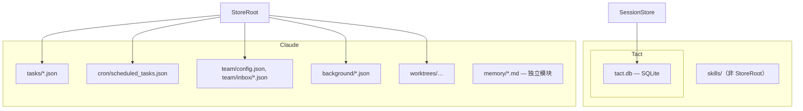
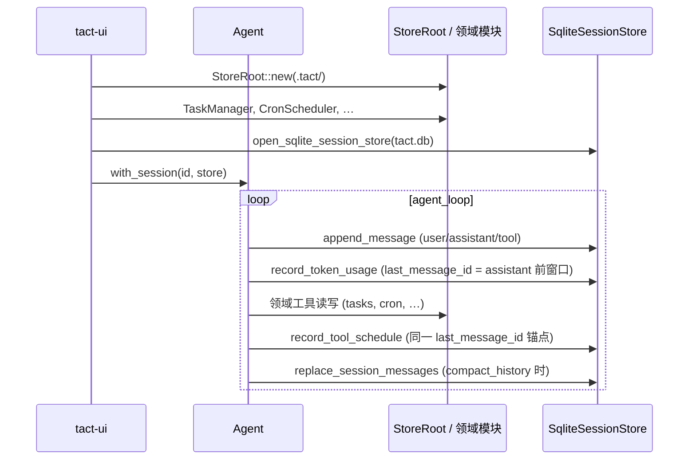

# 存储与持久化

> 语言：[中文](./01_chapter_store_zh.md) · [English](./01_chapter_store.md)

本章说明 Tact 的**磁盘持久化层**：`.tact/` 下的 JSON 文件存储，以及独立的 SQLite 会话数据库。二者共同保存对话历史、领域状态（任务、cron、队友等）与可观测性数据。

记忆（[持久化记忆](./03_chapter_memory_zh.md)）使用 `.tact/memory/` 下的 Markdown 文件，**不属于** JSON store API。

---

## 1. 两层持久化

Tact 刻意拆分职责：

| 层级 | 位置 | API | 主要用途 |
|------|------|-----|----------|
| **JSON store** | `<workdir>/.tact/` | `StoreRoot`、`Store<T>`、`CollectionStore<T>` | 领域记录（tasks、cron、team 等） |
| **Session store** | `<workdir>/.tact/tact.db` | `SessionStore` trait、`SqliteSessionStore` | 消息、token 用量、输入历史 |



二者均在会话启动时在 `main.rs` 中初始化：`StoreRoot::new(tact_path.claude_dir())` 与 `open_sqlite_session_store(&tact_path.session_db_path())`。

---

## 2. StoreRoot：安全路径解析

`StoreRoot`（`crates/tact/src/store/mod.rs`）是所有 JSON 持久化的入口。

```rust
pub struct StoreRoot { root: PathBuf }
```

| 规则 | 行为 |
|------|------|
| 仅相对路径 | 绝对路径会被拒绝 |
| 禁止穿越 | 解析后的路径必须留在规范化 root 之下 |
| 自动创建 | `StoreRoot::new()` 时创建 root 目录 |
| 缺失文件 | 打开新路径时允许缺失（`allow_missing: true`） |

工厂方法：

```rust
root.file::<T>("cron/scheduled_tasks.json")?     // Store<T>
root.collection::<T>("tasks")?                   // CollectionStore<T>
```

---

## 3. Store&lt;T&gt;：单 JSON 文件

对单个 JSON 文档的类型化封装（pretty-print，末尾带换行）。

| 方法 | 行为 |
|------|------|
| `read()` | 反序列化整个文件；缺失或 JSON 无效则报错 |
| `write(value)` | 创建父目录；覆盖文件 |
| `update(f)` | 读-改-写 |
| `append(value)` | 追加一行 JSON（JSONL） |
| `read_all()` | 将所有非空行解析为 `Vec<T>` |
| `delete()` | 删除文件；返回是否曾存在 |
| `exists()` | 路径检查 |

用于**索引文件**与**单文档注册表**——例如 `tasks/index.json`、`cron/scheduled_tasks.json`、`team/config.json`。

---

## 4. CollectionStore&lt;T&gt;：按键分文件的 JSON

目录内每个记录对应一个 `{key}.json` 文件。

| 方法 | 行为 |
|------|------|
| `read(key)` / `write(key, value)` | 按 key 读写文件 |
| `append(key, value)` | 对该 key 的文件做 JSONL 追加 |
| `read_all_from(key)` | 读取某 key 文件的全部行 |
| `delete(key)` | 删除 `{key}.json` |
| `list()` | 读取目录中所有 `*.json`（`index.json` 除外） |
| `exists(key)` | 检查 `{key}.json` |

非法 key（`/`、`\`、`.`、`..`）会被拒绝。

### 示例：TaskManager

```rust
tasks: root.collection("tasks")?,           // tasks/{id}.json
index: root.file("tasks/index.json")?,      // next_id 计数器
```

TaskManager 持久化在本章说明；**`task_*` 工具与依赖模型**见 [第 19 章 持久化 Task Manager](./19_chapter_persistent_tasks_zh.md)。[第 11 章](./11_chapter_task_zh.md) 讲的是**工具并行调度**，不是 TaskManager。

---

## 5. 领域消费者

| 模块 | Store 路径 | 模式 |
|------|------------|------|
| `task/` | `tasks/`、`tasks/index.json` | Collection + index |
| `cron/` | `cron/scheduled_tasks.json` | 单文件 `Store<ScheduledTaskIndex>` |
| `background.rs`（[后台任务](./13_chapter_background_zh.md)） | `background/tasks/` | Collection |
| `team.rs`（[团队协调](./14_chapter_team_zh.md)） | `team/config.json`、`team/inbox/` | Store + collection |
| `worktree/`（[Worktree 泳道](./15_chapter_worktree_zh.md)） | `worktrees/index.json` | 单文件 `Store<WorktreeIndex>` |

各领域模块用 `Arc<Mutex<…>>` 包装原始 store（如 `SharedTaskManager`），并暴露面向工具的 API——调用方不应直接操作 `CollectionStore`。

---

## 6. Session Store（SQLite）

定义于 `crates/tact/src/store/session_store/`。trait 为 async；默认实现为 `SqliteSessionStore`。

### 数据库位置

```text
<workdir>/.tact/tact.db
```

在 `main.rs` 中通过 `open_sqlite_session_store` 于 `<workdir>/.tact/tact.db` 打开。会话启动时，`SessionLockGuard`（`crates/tact-ui/src/session_lock.rs`）在争用时重试 `try_lock_session`，设置 `locked_by` + `lock_epoch`（进程启动标识）；`0`/空表示未锁定。`main` 安装 SIGINT/SIGTERM 监听，异常终止时释放锁并以 `130`/`143` 退出进程。

### 表

| 表 | 用途 |
|----|------|
| `sessions` | 会话 id、`root_dir`、`locked_by` + `lock_epoch`（进程锁）、时间戳 |
| `messages` | 序列化的 `MessageContent` JSON、序号排序 |
| `token_usages` | 每次 LLM 调用的 token 计数、可选 `request_body` blob、可选 `tool_schedule` JSON |
| `input_history` | TUI 召回用的用户输入字符串（每会话最多 100 条） |

### Agent 集成

| Agent 方法 | SessionStore 调用 |
|------------|-------------------|
| `ensure_session()` | `ensure_session_row`、`load_session` → 恢复 `runtime.context` |
| `tact-ui` 会话启动 | `ensure_session_row` → `try_lock_session` → `touch_session`（持锁后仅更新元数据） |
| `persist_message()` | 每次 context push 后 `append_message` |
| `persist_llm_call()` | `record_token_usage`（在写入 assistant 行**之前**快照 `llm_call_last_message_id` = `last_message_db_id`） |
| `compact_history()` | `replace_session_messages` — 重写 SQLite `messages` 以匹配压缩后的 context |
| `execute_tool_call`（调度后） | 在由 `llm_call_last_message_id` 定位的 token 行上 `record_tool_schedule` |

若未附加 session store（未调用 `with_session`），持久化方法为 no-op——便于测试。

### 输入历史裁剪

`MAX_INPUT_HISTORY` = 100。加载超过上限时，在 trim 阶段删除最旧行。

---

## 7. 生命周期图



---

## 8. 代码地图

| 文件 | 角色 |
|------|------|
| `crates/tact/src/store/mod.rs` | `StoreRoot`、`Store<T>`、`CollectionStore<T>` |
| `crates/tact/src/store/session_store/mod.rs` | `SessionStore` trait、`DynSessionStore`、`open_sqlite_session_store` |
| `crates/tact/src/store/session_store/sqlite.rs` | 全新 schema（`CREATE TABLE IF NOT EXISTS`）、`SqliteSessionStore` 实现 |
| `crates/tact/src/agent/mod.rs` | `ensure_session`、`persist_message`、`persist_llm_call`、`replace_persisted_context` |
| `crates/tact-ui/src/session_lock.rs` | `SessionLockGuard`、SIGINT/SIGTERM 释放 + 进程退出 |
| `crates/tact/src/consts.rs` | `TactPath::session_db_path()` → `<workdir>/.tact/tact.db`；`TactPath::workdir()` 存为 `sessions.root_dir` |
| `crates/tact-ui/src/main.rs` | 打开 SQLite session store；headless/交互模式附加领域 manager |
| `crates/tact/src/task/mod.rs` | `CollectionStore` 消费者示例 |
| `crates/tact/src/cron/mod.rs` | 单文件 `Store` 消费者示例 |

---

## 9. 当前缺口

| 缺口 | 说明 |
|------|------|
| JSON store 无跨进程锁 | JSON 文件读-改-写无文件锁（SQLite 会话使用进程锁） |
| `CollectionStore::list()` 顺序 | 目录迭代未排序——顺序依赖文件系统 |
| 全新 SQLite schema | 无旧 DB 路径迁移或 `ALTER TABLE` 升级——仅新安装 |
| Session store 可选 | 测试与部分调用方可不附加 SQLite |
| 每 workdir 一个 Session DB | SQLite 当前位于 `<workdir>/.tact/tact.db`；`sessions.root_dir` 记录项目路径，供未来共享 `$HOME/.tact/tact.db` |
| `index.json` 特例 | `list()` 会跳过——新增 index 文件时容易遗漏 |

---

## 相关文档

- [第 11 章 工具调度](./11_chapter_task_zh.md) — wave/barrier 模型（含 `task` 工具作为 barrier，非 TaskManager API）
- [Cron 调度](./16_chapter_cron_zh.md) — cron 索引文件布局
- [持久化记忆](./03_chapter_memory_zh.md) — Markdown 记忆（非 JSON store）
- [ARCHITECTURE.md](../ARCHITECTURE.md#12-configuration) — session store 与 token 用量说明
- [docs/token_usage_schema.md](../docs/token_usage_schema.md) — `token_usages` 列详情
