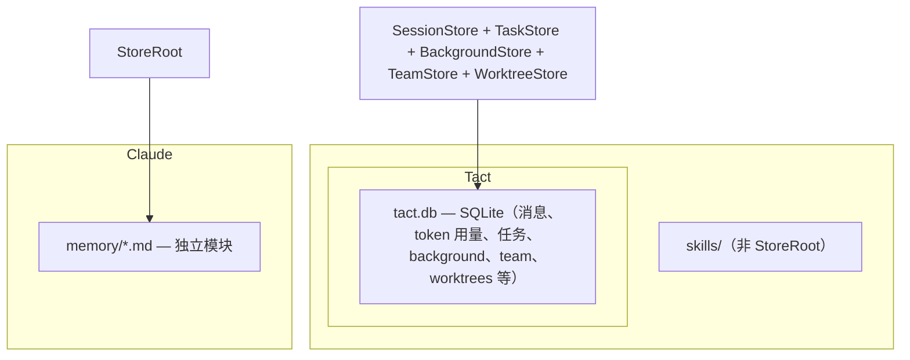
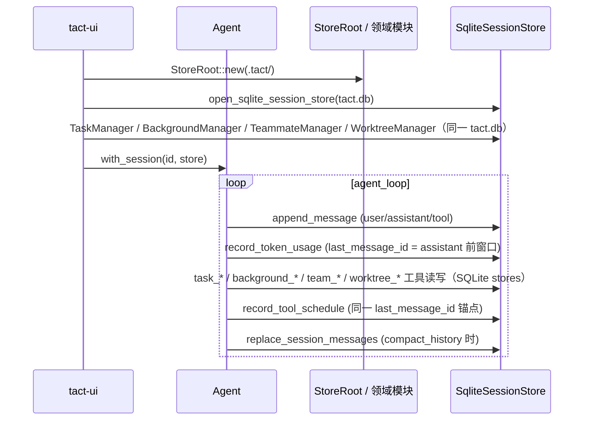

# 存储与持久化

> 语言：[中文](./01_chapter_store_zh.md) · [English](./01_chapter_store.md)

本章说明 Tact 的**磁盘持久化层**：`.tact/` 下的 JSON 文件存储，以及独立的 SQLite 会话数据库。二者共同保存对话历史、领域状态（background、队友等）与可观测性数据。

记忆（[持久化记忆](./03_chapter_memory_zh.md)）使用用户级全局目录 `~/.tact/memory/` 下的 Markdown 文件，**不属于** JSON store API。

---

## 1. 两层持久化

Tact 刻意拆分职责：

| 层级 | 位置 | API | 主要用途 |
|------|------|-----|----------|
| **JSON store** | `<workdir>/.tact/` | `StoreRoot`、`Store<T>`、`CollectionStore<T>` | 通用 JSON 持久化（当前无领域消费者） |
| **SQLite store** | `<workdir>/.tact/tact.db` | `SessionStore` + `TaskStore` + `BackgroundStore` + `TeamStore` + `WorktreeStore` trait | 消息、token 用量、任务、background、team、worktrees、输入历史 |


```mermaid
graph TB
    subgraph Workdir["<workdir>"]
        Tact[".tact/"]
        Tact[".tact/"]
        Skills["skills/（非 StoreRoot）"]
    end

    subgraph Tact
        DB["tact.db — SQLite（消息、token 用量、任务、background、team、worktrees 等）"]
    end

    subgraph Claude
        Mem["memory/*.md — 独立模块"]
    end

    SR[StoreRoot] --> Mem

    SS[SessionStore + TaskStore + BackgroundStore + TeamStore + WorktreeStore] --> DB
```

二者均在会话启动时在 `main.rs` 中初始化：`StoreRoot::new(tact_path.tact_dir())` 与 `open_sqlite_session_store(&tact_path.session_db_path())`。

---

## 2. StoreRoot：安全路径解析

`StoreRoot`（`crates/tact/src/store/mod.rs`）是所有 JSON 持久化的入口。

```rust
pub struct StoreRoot { root: PathBuf }
```

| 规则 | 行为 |
|------|------|
| 仅相对路径 | 绝对路径会被拒绝 |
| 禁止穿越 | 解析后的路径必须留在规范化 root 之下 |
| 自动创建 | `StoreRoot::new()` 时创建 root 目录 |
| 缺失文件 | 打开新路径时允许缺失（`allow_missing: true`） |

工厂方法：

```rust
root.collection::<T>("tasks")?                   // CollectionStore<T>  （遗留 tasks — 不再读取）
```

---

## 3. Store&lt;T&gt;：单 JSON 文件

对单个 JSON 文档的类型化封装（pretty-print，末尾带换行）。

| 方法 | 行为 |
|------|------|
| `read()` | 反序列化整个文件；缺失或 JSON 无效则报错 |
| `write(value)` | 创建父目录；覆盖文件 |
| `update(f)` | 读-改-写 |
| `append(value)` | 追加一行 JSON（JSONL） |
| `read_all()` | 将所有非空行解析为 `Vec<T>` |
| `delete()` | 删除文件；返回是否曾存在 |
| `exists()` | 路径检查 |

用于**索引文件**与**单文档注册表**——通用持久化原语（当前无领域模块使用；所有领域状态都在 SQLite）。

---

## 4. CollectionStore&lt;T&gt;：按键分文件的 JSON

目录内每个记录对应一个 `{key}.json` 文件。

| 方法 | 行为 |
|------|------|
| `read(key)` / `write(key, value)` | 按 key 读写文件 |
| `append(key, value)` | 对该 key 的文件做 JSONL 追加 |
| `read_all_from(key)` | 读取某 key 文件的全部行 |
| `delete(key)` | 删除 `{key}.json` |
| `list()` | 读取目录中所有 `*.json`（`index.json` 除外） |
| `exists(key)` | 检查 `{key}.json` |

非法 key（`/`、`\`、`.`、`..`）会被拒绝。

### 示例：后台任务（遗留）

```rust
root.collection::<BackgroundRecord>("background/tasks")?   // background/tasks/{id}.json（遗留）
```

任务、background、team、worktree 已不再使用 JSON store——它们存放在 SQLite 中（见 §6）。

---

## 5. 领域消费者

| 模块 | Store 路径 | 模式 |
|------|------------|------|
| `task/` | `tact.db` → `tasks`、`task_dependencies` 表 | `TaskStore`（SQLite） |
| `background.rs`（[后台任务](./13_chapter_background_zh.md)） | `tact.db` → `background_tasks` 表 | `BackgroundStore`（SQLite） |
| `team.rs`（[团队协调](./14_chapter_team_zh.md)） | `tact.db` → `teammates`、`inbox_messages` 表 | `TeamStore`（SQLite） |
| `worktree/`（[Worktree 泳道](./15_chapter_worktree_zh.md)） | `tact.db` → `worktrees`、`worktree_events` 表 | `WorktreeStore`（SQLite） |

各领域模块包装原始 store（如 `SharedTaskManager` / `SharedBackgroundManager` / `SharedTeammateManager` / `SharedWorktreeManager` 包 `Arc<…>`——SQLite 连接池已串行化写入），并暴露面向工具的 API——调用方不应直接操作 `CollectionStore`。

所有 SQLite store 按数据库文件共享同一个连接池：`store::sqlite::open_pool` 首次使用时打开并缓存连接池，向每个 store 分发一个引用计数句柄（`PoolRef`），因此单个进程对 `<workdir>/.tact/tact.db` 只使用一个连接池；最后一个持有它的 store 被释放时连接池随之关闭。

---

## 6. Session Store（SQLite）

定义于 `crates/tact/src/store/session_store/`。trait 为 async；默认实现为 `SqliteSessionStore`。

### 数据库位置

```text
<workdir>/.tact/tact.db
```

在 `main.rs` 中通过 `open_sqlite_session_store` 于 `<workdir>/.tact/tact.db` 打开。会话启动时，`SessionLockGuard`（`crates/tact-ui/src/session_lock.rs`）在争用时重试 `try_lock_session`，设置 `locked_by` + `lock_epoch`（进程启动标识）；`0`/空表示未锁定。`main` 安装 SIGINT/SIGTERM 监听，异常终止时释放锁并以 `130`/`143` 退出进程。

### 表

| 表 | 用途 |
|----|------|
| `sessions` | 会话 id、`root_dir`、`ref_id`（父会话 id；`''` = 顶层）、`locked_by` + `lock_epoch`（进程锁）、时间戳 |
| `messages` | 序列化的 `MessageContent` JSON、序号排序 |
| `token_usages` | 每次 LLM 调用的 token 计数、可选 `request_body` blob、可选 `tool_schedule` JSON |
| `input_history` | TUI 召回用的用户输入字符串（每会话最多 100 条） |
| `tasks` | 任务记录：`subject`、`description`、`session_id`、`status`（CHECK 约束）、`owner`、毫秒时间戳 |
| `task_dependencies` | 每条依赖边一行（`blocker_id`、`blocked_id`），复合主键，无外键——由应用层清理 |
| `background_tasks` | 后台任务：`status`（CHECK 约束）、`command`、`session_id`、`started_at`/`finished_at`、`output`、`output_path`（全量输出日志文件） |
| `teammates` | roster：`name`（PK）、`role`、`status` |
| `inbox_messages` | inbox 条目：`owner`、`from_name`、`to_name`、`body`、`kind`、`created_at`；自增 `id` 保持插入顺序 |
| `worktrees` | worktree 泳道：`name`（UNIQUE）、`path`、`branch`、`task_id`、`status`、`session_id`、`created_at` |
| `worktree_events` | 泳道审计日志：`event`、`created_at`；`id` 为排序键 |

### Agent 集成

| Agent 方法 | SessionStore 调用 |
|------------|-------------------|
| `ensure_session()` | `ensure_session_row`、`load_session` → 恢复 `runtime.context` |
| `tact-ui` 会话启动 | `ensure_session_row` → `try_lock_session` → `touch_session`（持锁后仅更新元数据） |
| `persist_message()` | 每次 context push 后 `append_message` |
| `persist_llm_call()` | `record_token_usage`（在写入 assistant 行**之前**快照 `llm_call_last_message_id` = `last_message_db_id`） |
| `compact_history()` | `replace_session_messages` — 重写 SQLite `messages` 以匹配压缩后的 context |
| `execute_tool_call`（调度后） | 在由 `llm_call_last_message_id` 定位的 token 行上 `record_tool_schedule` |

若未附加 session store（未调用 `with_session`），持久化方法为 no-op——便于测试。`list_sessions` 只返回 `ref_id = ''` 的顶层会话；`delete_session` 会级联删除 `ref_id = 该 id` 的子会话及其附属表。

### 输入历史裁剪

`MAX_INPUT_HISTORY` = 100。加载超过上限时，在 trim 阶段删除最旧行。

---

## 7. 生命周期图


```mermaid
sequenceDiagram
    participant TUI as tact-ui
    participant Agent
    participant JSON as StoreRoot / 领域模块
    participant SQL as SqliteSessionStore

    TUI->>JSON: StoreRoot::new(.tact/)
    TUI->>SQL: open_sqlite_session_store(tact.db)
    TUI->>SQL: TaskManager / BackgroundManager / TeammateManager / WorktreeManager（同一 tact.db）
    TUI->>Agent: with_session(id, store)

    loop agent_loop
        Agent->>SQL: append_message (user/assistant/tool)
        Agent->>SQL: record_token_usage (last_message_id = assistant 前窗口)
        Agent->>SQL: task_* / background_* / team_* / worktree_* 工具读写（SQLite stores）
        Agent->>SQL: record_tool_schedule (同一 last_message_id 锚点)
        Agent->>SQL: replace_session_messages (compact_history 时)
    end
```

---

## 8. 代码地图

| 文件 | 角色 |
|------|------|
| `crates/tact/src/store/mod.rs` | `StoreRoot`、`Store<T>`、`CollectionStore<T>` |
| `crates/tact/src/store/session_store/mod.rs` | `SessionStore` trait、`DynSessionStore`、`open_sqlite_session_store` |
| `crates/tact/src/store/session_store/sqlite.rs` | 全新 schema（`CREATE TABLE IF NOT EXISTS`）、`SqliteSessionStore` 实现 |
| `crates/tact/src/store/task_store/mod.rs` | `TaskStore` trait（async：create/get/update/list/delete） |
| `crates/tact/src/store/task_store/sqlite.rs` | `SqliteTaskStore` — `tasks` + `task_dependencies` 表、`BEGIN IMMEDIATE` 事务、`busy_timeout` |
| `crates/tact/src/store/background_store/mod.rs` | `BackgroundStore` trait（async：upsert/get/list） |
| `crates/tact/src/store/background_store/sqlite.rs` | `SqliteBackgroundStore` — `background_tasks` 表、upsert + `CHECK` 约束 status |
| `crates/tact/src/store/team_store/mod.rs` | `TeamStore` trait（async：create_teammate/list_teammates/append_message/read_inbox） |
| `crates/tact/src/store/team_store/sqlite.rs` | `SqliteTeamStore` — `teammates` + `inbox_messages` 表 |
| `crates/tact/src/store/worktree_store/mod.rs` | `WorktreeStore` trait（async：create_worktree/find_worktree/list_worktrees/append_event/recent_events） |
| `crates/tact/src/store/worktree_store/sqlite.rs` | `SqliteWorktreeStore` — `worktrees` + `worktree_events` 表 |
| `crates/tact/src/agent/mod.rs` | `ensure_session`、`persist_message`、`persist_llm_call`、`replace_persisted_context` |
| `crates/tact-ui/src/session_lock.rs` | `SessionLockGuard`、SIGINT/SIGTERM 释放 + 进程退出 |
| `crates/tact/src/consts.rs` | `TactPath::session_db_path()` → `<workdir>/.tact/tact.db`；`TactPath::workdir()` 存为 `sessions.root_dir` |
| `crates/tact-ui/src/main.rs` | 打开 SQLite session store；headless/交互模式附加领域 manager |
| `crates/tact/src/task/mod.rs` | `TaskManager` 门面（`Box<dyn TaskStore>`）+ `SharedTaskManager` |
| `crates/tact/src/background.rs` | `BackgroundManager` 门面（`Arc<dyn BackgroundStore>`）+ `SharedBackgroundManager` |
| `crates/tact/src/team.rs` | `TeammateManager` 门面（`Box<dyn TeamStore>`）+ `SharedTeammateManager` |
| `crates/tact/src/worktree/mod.rs` | `WorktreeManager` 门面（`Box<dyn WorktreeStore>`）+ `SharedWorktreeManager` |

---

## 9. 当前缺口

| 缺口 | 说明 |
|------|------|
| JSON store 无跨进程锁 | JSON 文件读-改-写无文件锁（SQLite 会话使用进程锁） |
| `CollectionStore::list()` 顺序 | 目录迭代未排序——顺序依赖文件系统 |
| 全新 SQLite schema | 主要为 `CREATE TABLE IF NOT EXISTS`；旧库通过 `PRAGMA` + `ALTER TABLE` 补上 `sessions.ref_id` |
| Session store 可选 | 测试与部分调用方可不附加 SQLite |
| 每 workdir 一个 Session DB | SQLite 当前位于 `<workdir>/.tact/tact.db`；`sessions.root_dir` 记录项目路径，供未来共享 `$HOME/.tact/tact.db` |
| 遗留 JSON 文件 | `tasks/*.json`、`background/tasks/*.json`、`team/config.json`、`team/inbox/*.json`、`worktrees/index.json` 在 SQLite 迁移后不再读取；留在磁盘上，手动清理 |

---

## 相关文档

- [第 11 章 工具调度](./11_chapter_task_zh.md) — wave/barrier 模型（含 `spawn_subagent` 工具作为 barrier，非 TaskManager API）
- [持久化记忆](./03_chapter_memory_zh.md) — Markdown 记忆（非 JSON store）
- [ARCHITECTURE.md](../ARCHITECTURE.md#12-configuration) — session store 与 token 用量说明
- [docs/token_usage_schema.md](../docs/token_usage_schema.md) — `token_usages` 列详情
