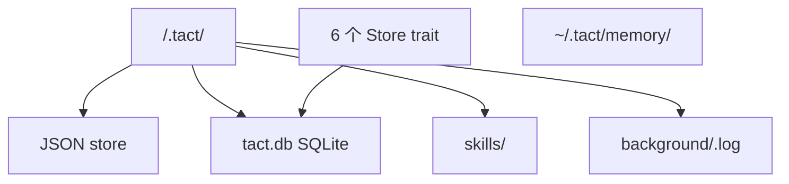
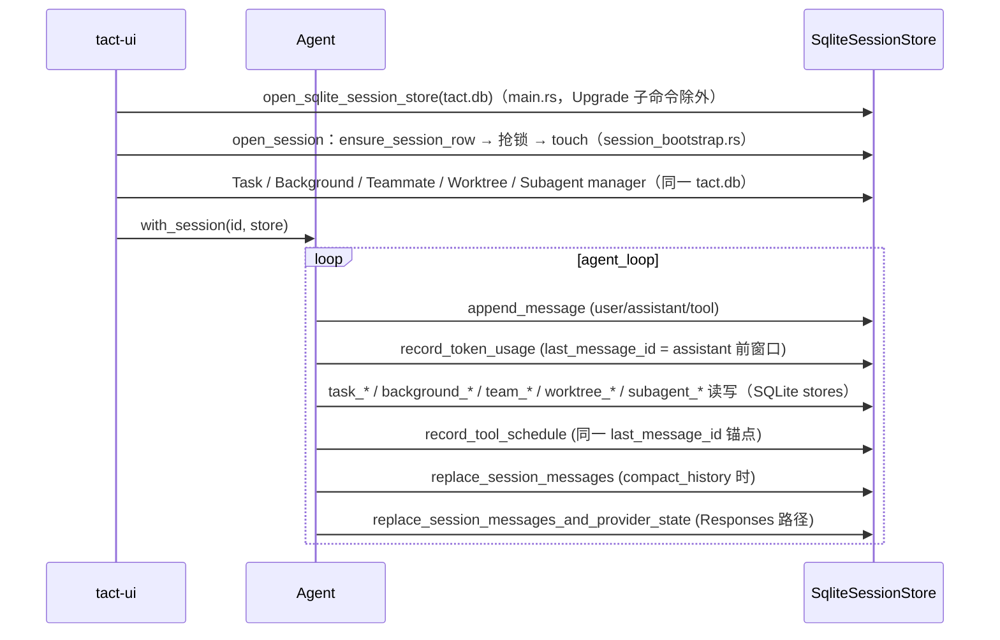

# 存储与持久化

本章说明 Tact 的**磁盘持久化层**：`.tact/` 下的 JSON 文件存储原语，以及独立的 SQLite 数据库。对话历史、领域状态（任务、background、队友、worktree、subagent）与可观测性数据**全部**存放在 SQLite 中；JSON store 目前没有领域消费者——它只剩单元测试在用。

记忆（[持久化记忆](./03_chapter_memory_zh.md)）使用用户级全局目录 `~/.tact/memory/` 下的 Markdown 文件，**不属于** JSON store API。

---

## 1. 两层持久化

Tact 刻意拆分职责：

| 层级 | 位置 | API | 主要用途 |
|------|------|-----|----------|
| **JSON store** | `<workdir>/.tact/` | `StoreRoot`、`Store<T>`、`CollectionStore<T>` | 通用 JSON 持久化（域状态迁到 SQLite 后**只剩测试在用**） |
| **SQLite store** | `<workdir>/.tact/tact.db` | `SessionStore` + `TaskStore` + `BackgroundStore` + `TeamStore` + `WorktreeStore` + `SubagentStore` trait | 消息、token 用量、provider 会话状态、任务、background、team、worktrees、subagent、输入历史 |


```mermaid
graph TD
    root[<workdir>/.tact/] --> json[JSON store]
    root --> db[tact.db SQLite]
    root --> skills[skills/]
    root --> bg[background/<id>.log]
    ss[6 个 Store trait] --> db
    mem[~/.tact/memory/]
```

图中 `.tact/` 的四个条目里，只有前两个走存储 API：`JSON store` 是 `StoreRoot` / `Store<T>` / `CollectionStore<T>`（域状态迁到 SQLite 后仅测试使用），`tact.db` 是上面那六个 Store trait 的 SQLite 落点。`skills/` 与 `background/<id>.log` 是**普通文件**，不属于 `StoreRoot`。`~/.tact/memory/` 是独立模块，不属于 JSON store API（见 [持久化记忆](./03_chapter_memory_zh.md)）。

启动时真正打开的只有 SQLite：`crates/tact-ui/src/main.rs` 在 `Upgrade` 子命令之后调用 `open_sqlite_session_store(&tact_path.session_db_path())`（自升级不需要 store），随后建行、抢锁、`touch` 由 `session_bootstrap::open_session` 完成，headless 与交互两个前端共用。`StoreRoot::new` 如今**只出现在单元测试里**——域状态迁到 SQLite 后它没有任何生产调用者。

---

## 2. StoreRoot：安全路径解析

`StoreRoot`（`crates/tact/src/store/mod.rs`）是所有 JSON 持久化的入口。

```rust
pub struct StoreRoot { root: PathBuf }
```

| 规则 | 行为 |
|------|------|
| 仅相对路径 | 绝对路径会被拒绝 |
| 禁止穿越 | 解析后的路径必须留在规范化 root 之下 |
| 自动创建 | `StoreRoot::new()` 时创建 root 目录 |
| 缺失文件 | 打开新路径时允许缺失（`allow_missing: true`） |

工厂方法：

```rust
root.file::<T>(relative)?                        // Store<T> — 单文件（仅测试调用）
root.collection::<T>(relative_dir)?              // CollectionStore<T> — 按键分文件（仅测试调用）
```

域状态迁到 SQLite 之后，这两个工厂只剩 `store/mod.rs` 的单元测试在用。保留它们是因为路径解析规则（只允许相对路径、禁止穿越）仍然是这套 store 的契约。

---

## 3. Store&lt;T&gt;：单 JSON 文件

对单个 JSON 文档的类型化封装（pretty-print，末尾带换行）。

| 方法 | 行为 |
|------|------|
| `read()` | 反序列化整个文件；缺失或 JSON 无效则报错 |
| `write(value)` | 创建父目录；覆盖文件 |
| `update(f)` | 读-改-写 |
| `append(value)` | 追加一行 JSON（JSONL） |
| `read_all()` | 将所有非空行解析为 `Vec<T>` |
| `delete()` | 删除文件；返回是否曾存在 |
| `exists()` | 路径检查 |

用于**索引文件**与**单文档注册表**——通用持久化原语（当前无领域模块使用；所有领域状态都在 SQLite）。

---

## 4. CollectionStore&lt;T&gt;：按键分文件的 JSON

目录内每个记录对应一个 `{key}.json` 文件。

| 方法 | 行为 |
|------|------|
| `read(key)` / `write(key, value)` | 按 key 读写文件 |
| `append(key, value)` | 对该 key 的文件做 JSONL 追加 |
| `read_all_from(key)` | 读取某 key 文件的全部行 |
| `delete(key)` | 删除 `{key}.json` |
| `list()` | 读取目录中所有 `*.json`（`index.json` 除外） |
| `exists(key)` | 检查 `{key}.json` |

非法 key（`/`、`\`、`.`、`..`）会被拒绝。

当前无领域模块使用：tasks、background、team、worktree 都已迁到 SQLite（见 §5、§6）。

---

## 5. 领域消费者

| 模块 | Store 路径 | 模式 |
|------|------------|------|
| `task/` | `tact.db` → `tasks`、`task_dependencies` 表 | `TaskStore`（SQLite） |
| `background.rs`（[后台任务](./13_chapter_background_zh.md)） | `tact.db` → `background_tasks` 表 | `BackgroundStore`（SQLite） |
| `team.rs`（[团队协调](./14_chapter_team_zh.md)） | `tact.db` → `teammates`、`inbox_messages` 表 | `TeamStore`（SQLite） |
| `worktree/`（[Worktree 泳道](./15_chapter_worktree_zh.md)） | `tact.db` → `worktrees`、`worktree_events` 表 | `WorktreeStore`（SQLite） |
| `subagent.rs`（[子 agent](./12_chapter_subagent_zh.md)） | `tact.db` → `subagent_runs` 表 | `SubagentStore`（SQLite） |

各领域模块包装原始 store（如 `SharedTaskManager` / `SharedBackgroundManager` / `SharedTeammateManager` / `SharedWorktreeManager` / `SharedSubagentManager` 包 `Arc<…>`——SQLite 连接池已串行化写入），并暴露面向工具的 API——调用方不应直接操作底层 store（`Store` / `CollectionStore` 当前已无任何调用者）。

五个领域 manager 在 `session_bootstrap::bootstrap_session` 里一次性构建，两个前端共用（见 §7）。

所有 SQLite store 按数据库文件共享同一个连接池：`store::sqlite::open_pool` 首次使用时打开并缓存连接池，向每个 store 分发一个引用计数句柄（`PoolRef`），因此单个进程对 `<workdir>/.tact/tact.db` 只使用一个连接池；最后一个持有它的 store 被释放时连接池随之关闭。首次打开时 `open_pool` 会创建目录与空文件，然后以 **WAL** journal 连接（TUI 读历史不必等 agent 写完）并设 5s `busy_timeout`；WAL 下 `synchronous = NORMAL`（WAL 中无损 durability），若并发打开导致 WAL 切换失败则记一条 warn 并回退到默认 delete journal，此时 `synchronous` 回到 `FULL`。

---

## 6. Session Store（SQLite）

定义于 `crates/tact/src/store/session_store/`。trait 为 async；默认实现为 `SqliteSessionStore`。

### 数据库位置

```text
<workdir>/.tact/tact.db
```

在 `main.rs` 中通过 `open_sqlite_session_store` 于 `<workdir>/.tact/tact.db` 打开。此后「这次运行属于哪个会话」由 `crates/tact-ui/src/session_bootstrap.rs` 的 `open_session` 一次做完，两个前端共用（见 §7）：

1. 解析 id —— `--session` 指定，或 `--resume-last` 取 `list_sessions(Some(root_dir))` 的第一行（`root_dir` 按当前工作目录过滤），否则新建 UUID。
2. `ensure_session_row(id, root_dir, "")` —— 行必须先存在，锁才有东西可锁。
3. `SessionLockGuard::acquire`（`crates/tact-ui/src/session_lock.rs`）—— 争用时重试 `try_lock_session`（最多 5 次，退避 `50ms × attempt`），写入 `locked_by` + `lock_epoch`；`0`/空表示未锁定。
4. `lock_registry.register(...)` 与 `touch_session(id, root_dir)` —— 注册后退出信号能释放它；touch 过的会话下次才会被 `--resume-last` 找到。

`lock_epoch` 是 `process_identity(pid)`（`store/session_store/process_identity.rs`）：Linux 读 `/proc/<pid>/stat` 的 starttime，macOS 用 `proc_pidinfo`，其他平台退回 `ps -o lstart`。它的作用是把「同一个 PID 被复用」与「同一个进程」区分开——只记 pid 会让一个新进程误判自己仍持有锁。

`main` 通过 `SessionLockRegistry::spawn_exit_listener()` 安装 SIGINT/SIGTERM 监听，异常终止时释放锁并以 `130`/`143` 退出进程。子 agent 的 `resume` 路径（`tool/subagent.rs` 复用一个已结束的子会话时）用的是 `tact::store::SessionLock`（`store/session_store/session_lock.rs`）：同样是 RAII，但**没有 `Drop` 实现**——异常退出时不假装清理，必须显式 `release()`。

### 表

| 表 | 用途 |
|----|------|
| `sessions` | 会话 id、`root_dir`、`ref_id`（父会话 id；`''` = 顶层）、`locked_by` + `lock_epoch`（进程锁）、时间戳 |
| `messages` | 序列化的 `MessageContent` JSON、序号排序 |
| `token_usages` | 每次 LLM 调用的 token 计数、可选 `request_body` blob、可选 `tool_schedule` JSON |
| `input_history` | TUI 召回用的用户输入字符串（每会话最多 100 条） |
| `responses_states` | 每会话一行的 Responses 协议基线：`schema_version`、`provider`、`base_url`、`model`、`state_json`、`compaction_id`——读回时 `provider` 与 `base_url` 必须匹配当前客户端，`model` 不同只被容忍（见 §「Agent 集成」） |
| `tasks` | 任务记录：`subject`、`description`、`session_id`、`status`（CHECK 约束）、`owner`、`created_at`/`started_at`/`completed_at`（毫秒） |
| `task_dependencies` | 每条依赖边一行（`blocker_id`、`blocked_id`），复合主键，无外键——由应用层清理 |
| `background_tasks` | 后台任务：`status`（CHECK 约束）、`command`、`session_id`、`started_at`/`finished_at`、`output`、`output_path`（全量输出日志文件） |
| `teammates` | roster：`name`（PK）、`role`、`status` |
| `inbox_messages` | inbox 条目：`owner`、`from_name`、`to_name`、`body`、`kind`、`created_at`；自增 `id` 保持插入顺序 |
| `worktrees` | worktree 泳道：`name`（UNIQUE）、`path`、`branch`、`task_id`、`status`、`session_id`、`created_at` |
| `worktree_events` | 泳道审计日志：`event`、`created_at`；`id` 为排序键 |
| `subagent_runs` | 子 agent 运行记录（`SubagentStore`，同库）：`child_id`（PK，即子会话 id）、`status`（CHECK：`running`/`completed`/`failed`/`cancelled`）、`summary`、`started_at`/`finished_at`（毫秒） |

### Agent 集成

| Agent 方法 | SessionStore 调用 |
|------------|-------------------|
| `ensure_session()` | `ensure_session_row`、`load_session` → 恢复 `runtime.context`；`load_provider_state` → 恢复 Responses 基线（`validate_provider_state_binding`：provider 与 `base_url` 必须匹配，model 允许不同，不匹配则报错而非静默使用） |
| `session_bootstrap::open_session`（两个前端共用） | `ensure_session_row` → `try_lock_session` → `touch_session`（持锁后仅更新元数据），顺序不可换：见 §6 开头 |
| `persist_message()` | 每次 context push 后 `append_message` |
| `persist_llm_call()` | `record_token_usage`（在写入 assistant 行**之前**快照 `llm_call_last_message_id` = `last_message_db_id`） |
| `compact_history()` | `replace_session_messages` — 重写 SQLite `messages` 以匹配压缩后的 context |
| `replace_persisted_context_and_state()` | `replace_session_messages_and_provider_state` — Responses 路径专用：messages 与 provider state 在**同一事务**里替换，避免逻辑上下文与协议基线在磁盘上分叉；`provider_state = None` 会删掉已存的状态 |
| `execute_tool_call`（调度后） | 在由 `llm_call_last_message_id` 定位的 token 行上 `record_tool_schedule` |

若未附加 session store（未调用 `with_session`），持久化方法为 no-op——便于测试。`list_sessions` 只返回 `ref_id = ''` 的顶层会话；`delete_session` 会级联删除 `ref_id = 该 id` 的子会话及其附属表。

### 输入历史裁剪

`MAX_INPUT_HISTORY` = 100。加载超过上限时，在 trim 阶段删除最旧行。

### 请求正文裁剪

`[agent] max_token_usage_bodies`（默认 1，兜底常量 `MAX_TOKEN_USAGE_BODIES`）。
`token_usages.request_body` 存的是每次调用的整份序列化请求
（system prompt + 全部工具 schema + 上下文），因此对每个会话中「比最新 `max_token_usage_bodies` 条更旧」的普通调用，
它会被**就地清空**——写成空 blob（`X''`），既不是删行也不是 NULL。每次插入只清一行（窗口边缘那行），
因此遵守该策略的会话每次调用只做 O(1) 工作；而策略生效时就已在窗口之外的老行不会被回访，那是一次性语句的活。压缩行（`compact`、
`responses_compact`）无论多旧都保留正文：那个 BLOB 是压缩基线及其加密内容唯一的存身处。
计数列永不改动，`load_latest_request_body` 会跳过被清空的行。文件只有在 `VACUUM` 之后才会变小；
对该策略生效之前就已经长起来的库，`docs/token_usage_schema.md` 里有一次性的回收配方。

---

## 7. 生命周期图


```mermaid
sequenceDiagram
    participant TUI as tact-ui
    participant Agent
    participant SQL as SqliteSessionStore

    TUI->>SQL: open_sqlite_session_store(tact.db)（main.rs，Upgrade 子命令除外）
    TUI->>SQL: open_session：ensure_session_row → 抢锁 → touch（session_bootstrap.rs）
    TUI->>SQL: Task / Background / Teammate / Worktree / Subagent manager（同一 tact.db）
    TUI->>Agent: with_session(id, store)

    loop agent_loop
        Agent->>SQL: append_message (user/assistant/tool)
        Agent->>SQL: record_token_usage (last_message_id = assistant 前窗口)
        Agent->>SQL: task_* / background_* / team_* / worktree_* / subagent_* 读写（SQLite stores）
        Agent->>SQL: record_tool_schedule (同一 last_message_id 锚点)
        Agent->>SQL: replace_session_messages (compact_history 时)
        Agent->>SQL: replace_session_messages_and_provider_state (Responses 路径)
    end
```

图中没有 `StoreRoot`：域状态迁到 SQLite 之后它只在单元测试里被构造。

---

## 8. 代码地图

| 文件 | 角色 |
|------|------|
| `crates/tact/src/store/mod.rs` | `StoreRoot`、`Store<T>`、`CollectionStore<T>` |
| `crates/tact/src/store/sqlite.rs` | 共享 `SqlitePool`（每个 db 一份、引用计数）、连接参数决策（WAL + `busy_timeout`，WAL 失败回退）与各域共用的毫秒时间戳转换（`now_millis` / `from_millis`——后者决定"读不出来的时间戳"回退为 `Utc::now()`，因为该列只是显示字段） |
| `crates/tact/src/store/session_store/mod.rs` | `SessionStore` trait、`DynSessionStore`、`open_sqlite_session_store`、`MAX_INPUT_HISTORY` / `MAX_TOKEN_USAGE_BODIES` |
| `crates/tact/src/store/session_store/sqlite.rs` | 全新 schema（`CREATE TABLE IF NOT EXISTS`，含 `responses_states`）、`SqliteSessionStore` 实现 |
| `crates/tact/src/store/session_store/process_identity.rs` | `process_identity(pid)` —— `lock_epoch` 的来源，用于识别 PID 复用 |
| `crates/tact/src/store/session_store/session_lock.rs` | `SessionLock` —— 子 agent 用的轻量 RAII 锁（无 `Drop`，需显式 `release`） |
| `crates/tact/src/store/test_support.rs` | 仅测试：`temp_db(prefix, name)`，各域 store 测试共用的临时库 fixture（先清空目录，避免上一轮崩溃留下的行造成偶发失败） |
| `crates/tact/src/store/subagent_store/mod.rs` | `SubagentStore` trait（async：upsert / get / list / list_running——最后一项供启动时把 orphan `running` 行改判 `failed`） |
| `crates/tact/src/store/subagent_store/sqlite.rs` | `SqliteSubagentStore` — `subagent_runs` 表 |
| `crates/tact/src/store/task_store/mod.rs` | `TaskStore` trait（async：create/get/update/list/delete） |
| `crates/tact/src/store/task_store/sqlite.rs` | `SqliteTaskStore` — `tasks` + `task_dependencies` 表、`BEGIN IMMEDIATE` 事务、`busy_timeout` |
| `crates/tact/src/store/background_store/mod.rs` | `BackgroundStore` trait（async：upsert/get/list） |
| `crates/tact/src/store/background_store/sqlite.rs` | `SqliteBackgroundStore` — `background_tasks` 表、upsert + `CHECK` 约束 status |
| `crates/tact/src/store/team_store/mod.rs` | `TeamStore` trait（async：create_teammate/list_teammates/append_message/read_inbox） |
| `crates/tact/src/store/team_store/sqlite.rs` | `SqliteTeamStore` — `teammates` + `inbox_messages` 表 |
| `crates/tact/src/store/worktree_store/mod.rs` | `WorktreeStore` trait（async：create_worktree/find_worktree/list_worktrees/append_event/recent_events） |
| `crates/tact/src/store/worktree_store/sqlite.rs` | `SqliteWorktreeStore` — `worktrees` + `worktree_events` 表 |
| `crates/tact/src/agent/mod.rs` | `ensure_session`、`persist_message`、`persist_llm_call`、`replace_persisted_context` / `replace_persisted_context_and_state`、`compact_history*` |
| `crates/tact-ui/src/session_lock.rs` | `SessionLockGuard`（5 次重试 + 退避）+ `SessionLockRegistry`（注册 / 退出信号释放 + `130`/`143` 退出） |
| `crates/tact-ui/src/session_bootstrap.rs` | `open_session`（解析 id → 建行 → 抢锁 → 注册 → touch）与 `bootstrap_session`（五个领域 manager + agent，两个前端共用） |
| `crates/tact/src/consts.rs` | `TactPath::session_db_path()` → `<workdir>/.tact/tact.db`；`TactPath::workdir()` 存为 `sessions.root_dir` |
| `crates/tact-ui/src/main.rs` | 打开 SQLite session store（`Upgrade` 子命令在此之前返回）；`--list-sessions`、`SessionLockRegistry::spawn_exit_listener()` |
| `crates/tact/src/task/mod.rs` | `TaskManager` 门面（`Box<dyn TaskStore>`）+ `SharedTaskManager` |
| `crates/tact/src/background.rs` | `BackgroundManager` 门面（`Arc<dyn BackgroundStore>`）+ `SharedBackgroundManager` |
| `crates/tact/src/team.rs` | `TeammateManager` 门面（`Box<dyn TeamStore>`）+ `SharedTeammateManager` |
| `crates/tact/src/worktree/mod.rs` | `WorktreeManager` 门面（`Box<dyn WorktreeStore>`）+ `SharedWorktreeManager` |
| `crates/tact/src/subagent.rs` | `SubagentManager` 门面（持有 `SqliteSubagentStore`，启动时做 orphan 修复）+ `SharedSubagentManager`（`Arc`，工具侧） |

---

## 9. 当前缺口

| 缺口 | 说明 |
|------|------|
| JSON store 无跨进程锁 | JSON 文件读-改-写无文件锁（SQLite 会话使用进程锁） |
| JSON store 无生产调用者 | `StoreRoot` / `Store<T>` / `CollectionStore<T>` 自域状态迁到 SQLite 后只剩单元测试，未来要么删除要么重新接入 |
| `CollectionStore::list()` 顺序 | 目录迭代未排序——顺序依赖文件系统 |
| 全新 SQLite schema | 主要为 `CREATE TABLE IF NOT EXISTS`；旧库通过 `PRAGMA` + `ALTER TABLE` 补上 `sessions.ref_id` 与 `background_tasks.output_path` |
| Session store 可选 | 测试与部分调用方可不附加 SQLite |
| 每 workdir 一个 Session DB | SQLite 当前位于 `<workdir>/.tact/tact.db`；`sessions.root_dir` 记录项目路径，供未来共享 `$HOME/.tact/tact.db` |
| 遗留 JSON 文件 | `tasks/*.json`、`background/tasks/*.json`、`team/config.json`、`team/inbox/*.json`、`worktrees/index.json`、`cron/scheduled_tasks.json` 在 SQLite 迁移（cron 子系统随后整体移除）后不再读取；留在磁盘上，手动清理。注意 `.tact/background/` 本身是**活目录**——当前 `background_run` 把全量日志写到该目录下的 `<id>.log`（见 [Ch 13](./13_chapter_background_zh.md) §2），只能删其中的 `background/tasks/` 子目录 |

---

## 相关文档

- [第 11 章 工具调度](./11_chapter_task_zh.md) — wave/barrier 模型（含 `spawn_subagent` 工具作为 barrier，非 TaskManager API）
- [第 12 章 子 agent](./12_chapter_subagent_zh.md) — `subagent_runs` 的生命周期、orphan 修复与 `resume` 校验
- [第 23 章 TUI](./23_chapter_tui_zh.md) — `open_session` / `bootstrap_session` 在启动时序里的位置
- [持久化记忆](./03_chapter_memory_zh.md) — Markdown 记忆（非 JSON store）
- [ARCHITECTURE.md](../ARCHITECTURE.md#12-configuration) — session store 与 token 用量说明
- [docs/token_usage_schema.md](../docs/token_usage_schema.md) — `token_usages` 列详情
