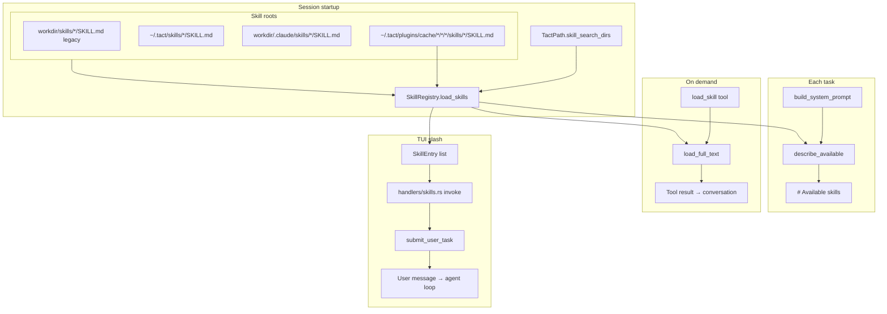

# Skill Registry
> Language: [English](./02_chapter_skill.md) · [中文](./02_chapter_skill_zh.md)

This chapter explains how Tact loads **custom instruction files** (skills) from disk: scanning `SKILL.md` files, exposing summaries in the system prompt, loading full bodies on demand through the `load_skill` tool, and invoking them from the TUI via slash commands.

Skills are related to but distinct from [Persistent Memory](./03_chapter_memory.md) — skills are author-written playbooks; memories are facts learned during conversations.

---

## 1. What Skills Are For

A skill is a Markdown document that teaches the agent how to perform a specialized task (coding standards, deployment steps, domain workflows). Tact does **not** inject full skill bodies into every prompt — that would bloat context. Instead:

| Stage | What the model sees |
|-------|---------------------|
| Every turn (system prompt) | Skill **names and descriptions** via `describe_available()` |
| On demand (`load_skill` tool) | Full body wrapped in `<skill>` XML tags (tool result) |
| TUI slash `/skill-name` | Same `<skill>` wrap injected into the **user task** on invoke (see [§7](#7-tui-slash-invocation) and [TUI](./23_chapter_tui.md)) |

Summaries at startup; full content when the model calls `load_skill` or the user invokes a skill via slash. The Responses adapter adds a more restrictive skill-loading policy; see [LLM Provider Layer](./22_chapter_llm.md#62-responses-api).

---

## 2. Architecture Overview



Discovery roots (Claude Code–compatible project path, plus tact user path and legacy):

| Root | Path | Role |
|------|------|------|
| Legacy | `<workdir>/skills/` | Backward compatible; still scanned |
| User | `~/.tact/skills/` | Personal skills across projects |
| Project | `<workdir>/.claude/skills/` | Team / repo skills (canonical) |
| Installed plugin | `~/.tact/plugins/cache/<marketplace>/<plugin>/<revision>/skills/` | Installed plugin playbooks |

Load order: legacy → user → project → installed plugins. **Same standalone name: later wins** (project overrides user/legacy). Installed plugin skills always use a `plugin:skill` name, so they cannot replace standalone skills.

---

## 3. Data Model

### SkillManifest

```rust
pub struct SkillManifest {
    pub name: String,
    pub description: String,
    pub path: PathBuf,   // path to SKILL.md on disk
}
```

### SkillDocument

```rust
pub struct SkillDocument {
    pub manifest: SkillManifest,
    pub body: String,    // markdown after frontmatter
}
```

### Display format (full load)

When rendered via `Display` or returned from `load_full_text`:

```xml
<skill name="demo">
Skill body content here.
</skill>
```

TUI slash invoke uses the same wrap around the rendered body (after `$ARGUMENTS` handling).

---

## 4. SKILL.md File Format

Optional YAML frontmatter (aligned with the [Agent Skills](https://agentskills.io/specification) open format for `name` / `description`):

```markdown
---
name: rust-skills
description: Comprehensive Rust coding guidelines
---

# Rust guidelines
…
```

| Field | Fallback |
|-------|----------|
| `name` | Parent directory name of `SKILL.md` |
| `description` | `"No description"` |

Files **without** frontmatter still load — the entire file becomes the body (after trim). CRLF line endings are normalized.

The open Agent Skills spec does **not** define argument placeholders. Tact’s TUI matches Claude Code: bare `$ARGUMENTS` substitution at invoke time; if absent, append `ARGUMENTS: …` inside the skill body (see [§7](#7-tui-slash-invocation)). Framing is client-side; the system prompt tells the model how to interpret slash-invoked `<skill>` / `ARGUMENTS:`.

### Discovery rules

`SkillRegistry::load_skills()`:

- Walks each root in `skill_search_dirs()` (`WalkDir`)
- Matches files named exactly `SKILL.md`
- Inserts into `HashMap<String, SkillDocument>` keyed by skill name

`get_skill_registry()` then loads validated installed plugin roots after the project roots, prefixing each local skill name with its plugin ID (`plugin:skill`).

Duplicate standalone names: later roots **overwrite** earlier ones — no warning. Within a single root, later walk entries also overwrite. Plugin skills occupy their own `plugin:skill` namespace.

---

## 5. SkillRegistry API

| Method | Role |
|--------|------|
| `new(skill_dirs)` | Empty registry over one or more roots |
| `load_skills()` | Scan all roots and populate map |
| `describe_available()` | Sorted `"- name: description"` list for system prompt |
| `load_full_text(name)` | Full `<skill>` block or error string listing available names |
| `skills()` | Read-only map access |

Convenience constructor:

```rust
pub fn get_skill_registry(workdir: impl AsRef<Path>) -> Result<SkillRegistry>
```

Used in `interactive.rs` / `headless.rs` at startup; result wrapped in `Arc<SkillRegistry>` on `ToolContext`. Interactive mode also maps registry entries to `SkillEntry { name, description, body }` for the TUI.

---

## 6. Integration Points

### System prompt

```rust
.skills_available(self.tool_context.skill_registry.describe_available())
```

Rendered under `# Available skills` in the template. See [System Prompt](./04_chapter_prompt.md) — this section is above the dynamic boundary (mostly stable unless skills are added on disk mid-session without reload).

### load_skill tool

`crates/tact/src/tool/load_skill.rs`:

```rust
#[tool(name = "load_skill", description = "Load the full body of a named skill…")]
pub async fn load_skill(ctx: ToolContext, input: LoadSkillInput) -> Result<String> {
    Ok(ctx.skill_registry.load_full_text(&input.name))
}
```

Unknown skills return a plain-text error (not `Err`) listing available names — the model sees this as tool output.

### ToolContext

```rust
pub skill_registry: Arc<Mutex<SkillRegistry>>, // SharedSkillRegistry
```

Shared across main agent, sub-agents, and the interactive TUI (so `/skill-reload` stays consistent). Sub-agents can call `load_skill` if their toolset included it — today `subagent_toolset()` does **not** register `load_skill`; only the main agent's `toolset()` does.

---

## 7. TUI Slash Invocation

Discovered skills appear in the Insert-mode `/` popup and Normal-mode command palette as `/{name}` with the frontmatter description. Built-in slash commands **win** over a same-named skill (colliding skills are omitted from the skill list).

| Skill kind | Registry name | Slash invocation |
|------------|---------------|------------------|
| Standalone | `skill` | `/skill` |
| Installed plugin | `plugin:skill` | `/plugin:skill` |

| Step | Behavior |
|------|----------|
| Slash popup Enter on a **skill** | Autocomplete to `/name ` only (same as Tab) |
| Second Enter (with optional args) | **Invoke** via `handlers/skills.rs` |
| Palette Enter on a skill | Switch to Insert with `/name ` prefilled (+ undo checkpoint) |
| Built-in Enter | Execute immediately (`/quit`, `/cancel`, …) |

**Invoke payload for the agent**

1. Log / history show the slash line the user typed (e.g. `/demo foo`).
2. Agent task body is `<skill name="…">…</skill>` (Claude Code–compatible):
   - If the skill body contains a bare `$ARGUMENTS` (not `$ARGUMENTS[N]`): substitute with the args string (may be empty).
   - Else if args are non-empty: append `\n\nARGUMENTS: {args}` inside the skill body.
   - Else: body as-is.
3. The system prompt `# Available skills` section explains slash-invoked `<skill>` / `ARGUMENTS:` so models do not confuse them with `load_skill` metadata.
4. Shared `submit_user_task` drives Planning / user bubble / history the same as a normal Enter submit.

`/skill-reload` rescans skill roots into the **shared** `Arc<Mutex<SkillRegistry>>` used by both the TUI and the agent `ToolContext`, refreshes the TUI `SkillEntry` list, and bumps visual cache. The next task’s system prompt skill summary (and `load_skill`) therefore see the new registry without restarting.

Successful `/plugin install <plugin>@<marketplace>` and `/plugin reload` operations perform the same shared refresh after their worker completes. Failed operations leave the registry unchanged. Plugin-provided names may contain `:` (for example `/superpowers:brainstorming`) and remain ordinary slash skills after refresh.

Highlighting: `/skill-name` uses accent+bold; trailing args use theme foreground (`render/slash_style.rs`), in both the input box and user log lines. Names that collide with built-in commands are omitted from highlighting (same as the palette).

Separate from the model calling `load_skill` mid-turn.

---

## 8. Comparison: Skills vs Memory

| Aspect | Skills | Memory |
|--------|--------|--------|
| Location | legacy `skills/` + `~/.tact/skills/` + `.claude/skills/` | `<workdir>/.claude/memory/` |
| Format | `SKILL.md` + optional frontmatter | `{name}.md` + required frontmatter |
| Prompt injection | Summaries always; body on demand / slash | Full content every turn (dynamic section) |
| Write path | Edit files on disk (no agent tool) | `save_memory` tool |
| Typical author | Developer / team | Agent during conversation |

---

## 9. Code Map

| File | Role |
|------|------|
| `crates/tact/src/skill/mod.rs` | `SkillRegistry`, parsing, `describe_available`, `load_full_text` |
| `crates/tact/src/consts.rs` | `skills_dir()`, `skill_search_dirs()` |
| `crates/tact/src/tool/load_skill.rs` | `load_skill` native tool |
| `crates/tact/src/agent/mod.rs` | `describe_available()` in `build_system_prompt` |
| `crates/tact/src/tool/mod.rs` | `ToolContext.skill_registry` |
| `crates/tact/src/tool/registry.rs` | `LoadSkillTool` in `toolset()` |
| `crates/tact-ui/src/interactive.rs` | `get_skill_registry()` → `SkillEntry` for TUI |
| `crates/tui/src/handlers/skills.rs` | Slash invoke, `$ARGUMENTS`, `submit_user_task` |
| `crates/tui/src/handlers/insert.rs` | Slash popup Enter / Tab autocomplete |
| `crates/tui/src/handlers/palette.rs` | Palette skill → Insert prefills |
| `crates/tui/src/render/slash_style.rs` | Skill vs args highlighting |
| `crates/tui/src/render/input.rs`, `log.rs` | Apply slash highlighting |

---

## 10. Current Gaps

| Gap | Detail |
|-----|--------|
| No `save_skill` tool | Skills are not writable by the agent at runtime |
| Duplicate name overwrite | Silent last-wins behavior during scan |
| Sub-agents lack `load_skill` | Restricted toolset cannot load skills in isolated workers |
| No validation of body size | Very large skills can flood context when loaded (slash invoke too) |
| No glob / enable list | All discovered skills appear in `describe_available()` and the slash palette |
| `$ARGUMENTS[N]` unused | Indexed placeholders are left literally (Claude-compatible bare `$ARGUMENTS` only) |

`/skill-reload` mutates the shared registry immediately; the next `build_system_prompt` / `load_skill` call reads the updated map.

---

## Related Docs

- [System Prompt](./04_chapter_prompt.md) — `# Available skills` section and cache boundary
- [Tool System](./07_chapter_tool.md) — `load_skill` and `ToolContext`
- [Persistent Memory](./03_chapter_memory.md) — complementary persistence model
- [TUI](./23_chapter_tui.md) — slash popup, palette, highlighting
- [ARCHITECTURE.md](../ARCHITECTURE.md) — skills in prompt assembly table
