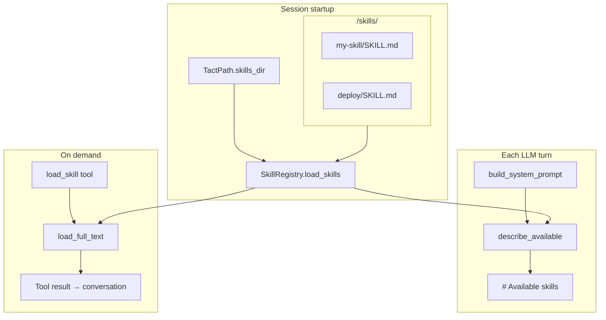

# Skill Registry

This chapter explains how Tact loads **custom instruction files** (skills) from the workspace: scanning `SKILL.md` files, exposing summaries in the system prompt, and loading full bodies on demand through the `load_skill` tool.

Skills are related to but distinct from [Persistent Memory](./03_chapter_memory.md) — skills are author-written playbooks; memories are facts learned during conversations.

---

## 1. What Skills Are For

A skill is a Markdown document that teaches the agent how to perform a specialized task (coding standards, deployment steps, domain workflows). Tact does **not** inject full skill bodies into every prompt — that would bloat context. Instead:

| Stage | What the model sees |
|-------|---------------------|
| Every turn (system prompt) | Skill **names and descriptions** via `describe_available()` |
| On demand (`load_skill` tool) | Full body wrapped in `<skill>` XML tags |

This matches the design note in `tact.md`: summaries at startup, full content when the model explicitly loads a skill.

---

## 2. Architecture Overview



Skills live under `<workdir>/skills/`, **not** under `.claude/`. Path from `TactPath::skills_dir()`.

---

## 3. Data Model

### SkillManifest

```rust
pub struct SkillManifest {
    pub name: String,
    pub description: String,
    pub path: PathBuf,   // path to SKILL.md on disk
}
```

### SkillDocument

```rust
pub struct SkillDocument {
    pub manifest: SkillManifest,
    pub body: String,    // markdown after frontmatter
}
```

### Display format (full load)

When rendered via `Display` or returned from `load_full_text`:

```xml
<skill name="demo">
Skill body content here.
</skill>
```

---

## 4. SKILL.md File Format

Optional YAML frontmatter:

```markdown
---
name: rust-skills
description: Comprehensive Rust coding guidelines
---

# Rust guidelines
…
```

| Field | Fallback |
|-------|----------|
| `name` | Parent directory name of `SKILL.md` |
| `description` | `"No description"` |

Files **without** frontmatter still load — the entire file becomes the body (after trim). CRLF line endings are normalized.

### Discovery rules

`SkillRegistry::load_skills()`:

- Recursively walks `skills_dir` (`WalkDir`)
- Matches files named exactly `SKILL.md`
- Inserts into `HashMap<String, SkillDocument>` keyed by skill name

Duplicate names: later files **overwrite** earlier ones in walk order — no warning.

---

## 5. SkillRegistry API

| Method | Role |
|--------|------|
| `new(skills_dir)` | Empty registry |
| `load_skills()` | Scan disk and populate map |
| `describe_available()` | Sorted `" - name: description"` list for system prompt |
| `load_full_text(name)` | Full `<skill>` block or error string listing available names |
| `skills()` | Read-only map access |

Convenience constructor:

```rust
pub fn get_skill_registry(skills_dir: PathBuf) -> Result<SkillRegistry>
```

Used in `tui.rs` at startup; result wrapped in `Arc<SkillRegistry>` on `ToolContext`.

---

## 6. Integration Points

### System prompt

```rust
.skills_available(self.tool_context.skill_registry.describe_available())
```

Rendered under `# Available skills` in the template. See [System Prompt](./04_chapter_prompt.md) — this section is above the dynamic boundary (mostly stable unless skills are added on disk mid-session without reload).

### load_skill tool

`crates/tact/src/tool/load_skill.rs`:

```rust
#[tool(name = "load_skill", description = "Load the full body of a named skill…")]
pub async fn load_skill(ctx: ToolContext, input: LoadSkillInput) -> Result<String> {
    Ok(ctx.skill_registry.load_full_text(&input.name))
}
```

Unknown skills return a plain-text error (not `Err`) listing available names — the model sees this as tool output.

### ToolContext

```rust
pub skill_registry: Arc<SkillRegistry>,
```

Shared across main agent and sub-agents. Sub-agents can call `load_skill` if their toolset included it — today `subagent_toolset()` does **not** register `load_skill`; only the main agent's `toolset()` does.

---

## 7. Comparison: Skills vs Memory

| Aspect | Skills | Memory |
|--------|--------|--------|
| Location | `<workdir>/skills/` | `<workdir>/.claude/memory/` |
| Format | `SKILL.md` + optional frontmatter | `{name}.md` + required frontmatter |
| Prompt injection | Summaries always; body on demand | Full content every turn (dynamic section) |
| Write path | Edit files on disk (no agent tool) | `save_memory` tool |
| Typical author | Developer / team | Agent during conversation |

---

## 8. Code Map

| File | Role |
|------|------|
| `crates/tact/src/skill/mod.rs` | `SkillRegistry`, parsing, `describe_available`, `load_full_text` |
| `crates/tact/src/tool/load_skill.rs` | `load_skill` native tool |
| `crates/tact/src/agent/mod.rs` | `describe_available()` in `build_system_prompt` |
| `crates/tact/src/tool/mod.rs` | `ToolContext.skill_registry`, `LoadSkillTool` in `toolset()` |
| `crates/tact/src/bin/tui.rs` | `get_skill_registry(tact_path.skills_dir())` |
| `crates/tact/src/consts.rs` | `TactPath::skills_dir()` → `<workdir>/skills` |

---

## 9. Current Gaps

| Gap | Detail |
|-----|--------|
| No hot reload | New or edited `SKILL.md` files require session restart |
| No `save_skill` tool | Skills are not writable by the agent at runtime |
| Duplicate name overwrite | Silent last-wins behavior during scan |
| Sub-agents lack `load_skill` | Restricted toolset cannot load skills in isolated workers |
| No validation of body size | Very large skills can flood context when loaded |
| No glob / enable list | All discovered skills appear in `describe_available()` |

---

## Related Docs

- [System Prompt](./04_chapter_prompt.md) — `# Available skills` section and cache boundary
- [Tool System](./07_chapter_tool.md) — `load_skill` and `ToolContext`
- [Persistent Memory](./03_chapter_memory.md) — complementary persistence model
- [ARCHITECTURE.md](../ARCHITECTURE.md) — skills in prompt assembly table
