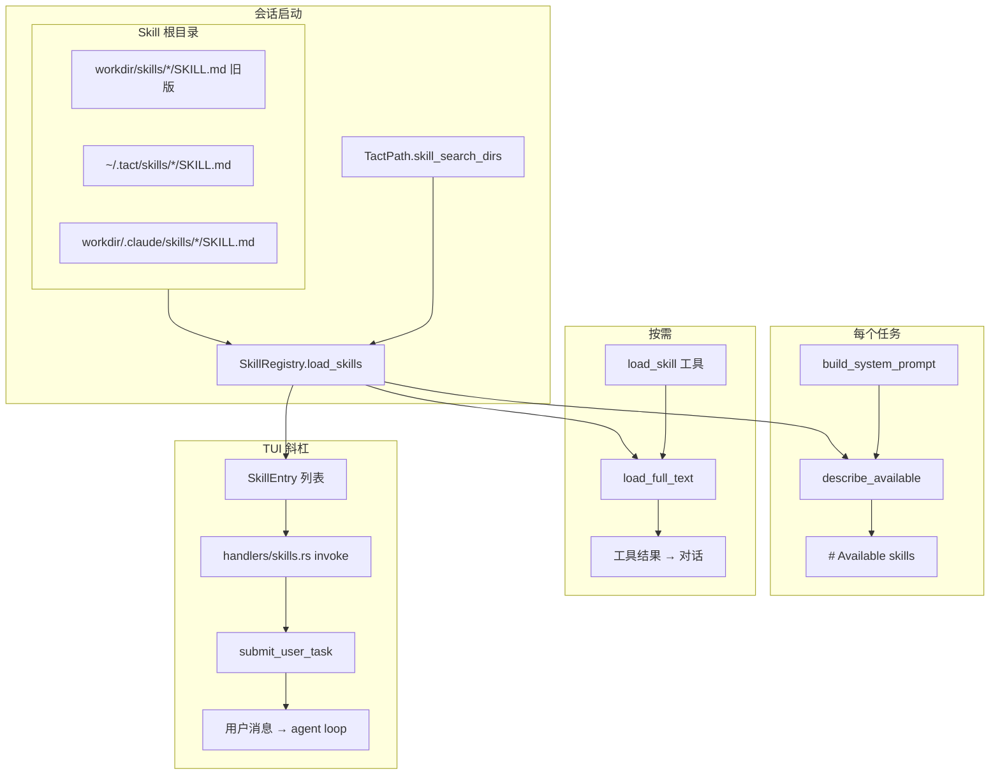

# Skill 注册表

> 语言：[中文](./02_chapter_skill_zh.md) · [English](./02_chapter_skill.md)

本章说明 Tact 如何从磁盘加载**自定义指令文件**（skills）：扫描 `SKILL.md`、在系统提示词中暴露摘要、通过 `load_skill` 工具按需加载全文，以及从 TUI 用斜杠命令调用。

Skills 与 [持久化记忆](./03_chapter_memory_zh.md) 相关但不同——skills 是作者编写的 playbook；memories 是对话中学到的事实。

---

## 1. Skills 的用途

Skill 是一份 Markdown 文档，教 agent 如何完成专项任务（编码规范、部署步骤、领域工作流）。Tact **不会**把完整 skill 正文注入每一轮提示——那会撑爆上下文。而是：

| 阶段 | 模型看到的内容 |
|------|----------------|
| 每轮（系统提示词） | 通过 `describe_available()` 得到的 skill **名称与描述** |
| 按需（`load_skill` 工具） | 包在 `<skill>` XML 标签中的全文（工具结果） |
| TUI 斜杠 `/skill-name` | 调用时在**用户任务**中注入同样的 `<skill>` 包装（见 [§7](#7-tui-斜杠调用) 与 [TUI](./23_chapter_tui_zh.md)） |

启动时只有摘要；模型调用 `load_skill` 或用户通过斜杠调用时才加载全文。

---

## 2. 架构概览



发现根目录（Claude Code 兼容的项目路径，外加 tact 用户路径与旧版路径）：

| 根 | 路径 | 角色 |
|----|------|------|
| Legacy | `<workdir>/skills/` | 向后兼容；仍会扫描 |
| User | `~/.tact/skills/` | 跨项目的个人 skills |
| Project | `<workdir>/.claude/skills/` | 团队/仓库 skills（规范路径） |

加载顺序：legacy → user → project。**同名时后者覆盖**（project 覆盖 user/legacy）。

---

## 3. 数据模型

### SkillManifest

```rust
pub struct SkillManifest {
    pub name: String,
    pub description: String,
    pub path: PathBuf,   // 磁盘上 SKILL.md 的路径
}
```

### SkillDocument

```rust
pub struct SkillDocument {
    pub manifest: SkillManifest,
    pub body: String,    // frontmatter 之后的 markdown
}
```

### 展示格式（完整加载）

通过 `Display` 或 `load_full_text` 渲染时：

```xml
<skill name="demo">
Skill body content here.
</skill>
```

TUI 斜杠调用在 `$ARGUMENTS` 处理后的渲染正文外使用相同包装。

---

## 4. SKILL.md 文件格式

可选 YAML frontmatter（与 [Agent Skills](https://agentskills.io/specification) 开放格式的 `name` / `description` 对齐）：

```markdown
---
name: rust-skills
description: Comprehensive Rust coding guidelines
---

# Rust guidelines
…
```

| 字段 | 回退 |
|------|------|
| `name` | `SKILL.md` 的父目录名 |
| `description` | `"No description"` |

**无** frontmatter 的文件仍可加载——整文件作为正文（trim 后）。CRLF 行尾会规范化。

开放 Agent Skills 规范**未**定义参数占位符。Tact 的 TUI 与 Claude Code 一致：调用时用裸 `$ARGUMENTS` 替换；若缺失则在 skill 正文内追加 `ARGUMENTS: …`（见 [§7](#7-tui-斜杠调用)）。包装在客户端侧完成；系统提示词告诉模型如何理解斜杠调用的 `<skill>` / `ARGUMENTS:`。

### 发现规则

`SkillRegistry::load_skills()`：

- 遍历 `skill_search_dirs()` 中的每个根（`WalkDir`）
- 匹配文件名恰好为 `SKILL.md` 的文件
- 插入以 skill 名称为 key 的 `HashMap<String, SkillDocument>`

重名：后扫描的根**覆盖**先前的——无警告。同一根内，后遍历到的条目也会覆盖。

---

## 5. SkillRegistry API

| 方法 | 角色 |
|------|------|
| `new(skill_dirs)` | 在一个或多个根上创建空注册表 |
| `load_skills()` | 扫描所有根并填充 map |
| `describe_available()` | 排序后的 `"- name: description"` 列表，供系统提示词使用 |
| `load_full_text(name)` | 完整 `<skill>` 块，或列出可用名称的错误字符串 |
| `skills()` | 只读 map 访问 |

便捷构造函数：

```rust
pub fn get_skill_registry(workdir: impl AsRef<Path>) -> Result<SkillRegistry>
```

在 `interactive.rs` / `headless.rs` 启动时使用；结果包装为 `ToolContext` 上的 `Arc<SkillRegistry>`。交互模式还将注册表条目映射为 TUI 的 `SkillEntry { name, description, body }`。

---

## 6. 集成点

### 系统提示词

```rust
.skills_available(self.tool_context.skill_registry.describe_available())
```

在模板中渲染为 `# Available skills`。见 [系统提示词](./04_chapter_prompt_zh.md)——该节在动态边界之上（除非会话中途在磁盘上增删 skills 且未 reload，否则基本稳定）。

### load_skill 工具

`crates/tact/src/tool/load_skill.rs`：

```rust
#[tool(name = "load_skill", description = "Load the full body of a named skill…")]
pub async fn load_skill(ctx: ToolContext, input: LoadSkillInput) -> Result<String> {
    Ok(ctx.skill_registry.load_full_text(&input.name))
}
```

未知 skill 返回纯文本错误（非 `Err`），并列出可用名称——模型将其视为工具输出。

### ToolContext

```rust
pub skill_registry: Arc<Mutex<SkillRegistry>>, // SharedSkillRegistry
```

在主 agent、子 agent 与交互 TUI 间共享（使 `/skill-reload` 保持一致）。若子 agent 工具集包含 `load_skill` 则可调用——当前 `subagent_toolset()` **未**注册 `load_skill`；仅主 agent 的 `toolset()` 有。

---

## 7. TUI 斜杠调用

已发现的 skills 出现在 Insert 模式 `/` 弹出菜单与 Normal 模式命令面板中，形式为 `/{name}`，附 frontmatter 描述。内置斜杠命令**优先于**同名 skill（冲突的 skill 不会出现在 skill 列表中）。

| 步骤 | 行为 |
|------|------|
| 斜杠弹出菜单对 **skill** 按 Enter | 仅自动补全为 `/name `（同 Tab） |
| 第二次 Enter（可带参数） | 经 `handlers/skills.rs` **调用** |
| 面板对 skill 按 Enter | 切到 Insert 并预填 `/name `（+ undo checkpoint） |
| 内置命令 Enter | 立即执行（`/quit`、`/cancel` 等） |

**发给 agent 的载荷**

1. 日志/历史显示用户输入的斜杠行（如 `/demo foo`）。
2. Agent 任务正文为 `<skill name="…">…</skill>`（与 Claude Code 兼容）：
   - 若 skill 正文含裸 `$ARGUMENTS`（非 `$ARGUMENTS[N]`）：替换为参数字符串（可为空）。
   - 否则若参数非空：在 skill 正文内追加 `\n\nARGUMENTS: {args}`。
   - 否则：正文原样。
3. 系统提示词 `# Available skills` 节说明斜杠调用的 `<skill>` / `ARGUMENTS:`，避免模型与 `load_skill` 元数据混淆。
4. 共享的 `submit_user_task` 与正常 Enter 提交一样驱动 Planning / 用户气泡 / 历史。

`/skill-reload` 将 skill 根重新扫描到 TUI 与 agent `ToolContext` **共享**的 `Arc<Mutex<SkillRegistry>>`，刷新 TUI `SkillEntry` 列表并 bump 视觉缓存。下一任务的系统提示词 skill 摘要（及 `load_skill`）因此看到新注册表，无需重启。

高亮：`/skill-name` 使用 accent+bold；尾随参数使用主题前景色（`render/slash_style.rs`），输入框与用户日志行均如此。与内置命令冲突的名称不参与高亮（与面板一致）。

与模型在回合中途调用 `load_skill` 不同。

---

## 8. 对比：Skills vs Memory

| 方面 | Skills | Memory |
|------|--------|--------|
| 位置 | legacy `skills/` + `~/.tact/skills/` + `.claude/skills/` | `<workdir>/.claude/memory/` |
| 格式 | `SKILL.md` + 可选 frontmatter | `{name}.md` + 必需 frontmatter |
| 提示词注入 | 始终摘要；正文按需 / 斜杠 | 每轮全文（动态节） |
| 写入路径 | 编辑磁盘文件（无 agent 工具） | `save_memory` 工具 |
| 典型作者 | 开发者/团队 | 对话中的 agent |

---

## 9. 代码地图

| 文件 | 角色 |
|------|------|
| `crates/tact/src/skill/mod.rs` | `SkillRegistry`、解析、`describe_available`、`load_full_text` |
| `crates/tact/src/consts.rs` | `skills_dir()`、`skill_search_dirs()` |
| `crates/tact/src/tool/load_skill.rs` | `load_skill` 原生工具 |
| `crates/tact/src/agent/mod.rs` | `build_system_prompt` 中的 `describe_available()` |
| `crates/tact/src/tool/mod.rs` | `ToolContext.skill_registry` |
| `crates/tact/src/tool/registry.rs` | `toolset()` 中的 `LoadSkillTool` |
| `crates/tact-ui/src/interactive.rs` | `get_skill_registry()` → TUI 的 `SkillEntry` |
| `crates/tui/src/handlers/skills.rs` | 斜杠调用、`$ARGUMENTS`、`submit_user_task` |
| `crates/tui/src/handlers/insert.rs` | 斜杠弹出 Enter / Tab 自动补全 |
| `crates/tui/src/handlers/palette.rs` | 面板 skill → Insert 预填 |
| `crates/tui/src/render/slash_style.rs` | skill 与参数高亮 |
| `crates/tui/src/render/input.rs`、`log.rs` | 应用斜杠高亮 |

---

## 10. 当前缺口

| 缺口 | 说明 |
|------|------|
| 无 `save_skill` 工具 | 运行时 agent 不能写 skills |
| 重名静默覆盖 | 扫描时 last-wins，无警告 |
| 子 agent 无 `load_skill` | 受限工具集无法在隔离 worker 中加载 skills |
| 无正文大小校验 | 超大 skill 加载时会淹没上下文（斜杠调用亦然） |
| 无 glob / 启用列表 | 所有发现的 skills 都出现在 `describe_available()` 与斜杠面板 |
| `$ARGUMENTS[N]` 未用 | 索引占位符原样保留（仅 Claude 兼容的裸 `$ARGUMENTS`） |

`/skill-reload` 会立即变更共享注册表；下一次 `build_system_prompt` / `load_skill` 读取更新后的 map。

---

## 相关文档

- [系统提示词](./04_chapter_prompt_zh.md) — `# Available skills` 节与缓存边界
- [工具系统](./07_chapter_tool_zh.md) — `load_skill` 与 `ToolContext`
- [持久化记忆](./03_chapter_memory_zh.md) — 互补的持久化模型
- [TUI](./23_chapter_tui_zh.md) — 斜杠弹出、面板、高亮
- [ARCHITECTURE.md](../ARCHITECTURE.md) — 提示词组装表中的 skills
