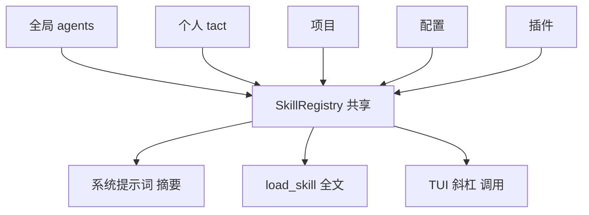

# Skill 注册表

本章说明 Tact 如何从磁盘加载**自定义指令文件**（skills）：扫描 `SKILL.md`、在系统提示词中暴露摘要、通过 `load_skill` 工具按需加载全文，以及从 TUI 用斜杠命令调用。

Skills 与 [持久化记忆](./03_chapter_memory_zh.md) 相关但不同——skills 是作者编写的 playbook；memories 是对话中学到的事实。

---

## 1. Skills 的用途

Skill 是一份 Markdown 文档，教 agent 如何完成专项任务（编码规范、部署步骤、领域工作流）。默认情况下 Tact **不会**把完整 skill 正文注入每一轮提示——那会撑爆上下文。而是：

| 阶段 | 模型看到的内容 |
|------|----------------|
| 每轮（系统提示词） | 默认是 `describe_available()` 得到的 skill **名称与描述**；开启 `[agent].skill_body_auto_inject` 后改为 `describe_available_with_body()` 的**全文** |
| 按需（`load_skill` 工具） | 包在 `<skill>` XML 标签中的全文（工具结果） |
| TUI 斜杠 `/skill-name` | 调用时在**用户任务**中注入同样的 `<skill>` 包装（见 [§7](#7-tui-斜杠调用) 与 [TUI](./23_chapter_tui_zh.md)） |

启动时只有摘要；模型调用 `load_skill` 或用户通过斜杠调用时才加载全文。`[agent].skill_body_auto_inject`（默认 `false`，CLI `--skill-body-auto-inject`）把这层摘要整体换成全文，代价是每一轮请求都携带所有 skill 正文——除非某个 skill 必须无条件留在上下文中，否则保持默认；见 [配置](./21_chapter_config_zh.md)。Responses adapter 额外施加更严格的 skill 加载策略；见 [LLM Provider Layer](./22_chapter_llm_zh.md#62-responses-api)。

---

## 2. 架构概览


```mermaid
graph TD
    s1_agents[全局 agents] --> reg
    s2_tact[个人 tact] --> reg
    s3_project[项目] --> reg
    s4_config[配置] --> reg
    s5_plugin[插件] --> reg
    reg[SkillRegistry 共享] --> c1_prompt[系统提示词 摘要]
    reg --> c2_tool[load_skill 全文]
    reg --> c3_slash[TUI 斜杠 调用]
```

> **写法说明**：Tact 自己的 mermaid 渲染器（`ratatui-markdown`）只吃扁平的 `graph TD/LR`——`[方框]` / `(圆角)` / `{菱形}` / `-->` / `---` 这一层。`subgraph` 不被识别，会被当成名为 `subgraph` / `end` 的普通节点画成一堆碎框；`-.->` 会让整张图解析失败并回退成代码块；标签里的 `&lt;` 会原样显示（直接写 `<workdir>` 即可）。所以这里不用子图：五个发现根扇入注册表，再扇出到三条消费路径；节点 id 的 `s1_` / `c1_` 前缀只是为了让渲染器按 id 排序时保持「加载顺序」与「消费顺序」。

发现根目录（最具体者在前）：

| 根 | 路径 | 角色 |
|----|------|------|
| 项目本地 | `<workdir>/.tact/skills/` | 仓库内 tact skills |
| User | `~/.tact/skills/` | 跨项目的个人 skills |
| Global agents | `~/.agents/skills/` | 共享 agents skills |
| 配置额外目录 | `[agent].skill_dirs` | TOML 额外根（相对 workdir；支持 `~`） |
| Installed plugin | `~/.tact/plugins/cache/<marketplace>/<plugin>/<revision>/skills/` | 已安装插件的 playbook |
| Installed plugin commands | `~/.tact/plugins/cache/<marketplace>/<plugin>/<revision>/commands/*.md` | 旧式 Claude 斜杠命令 |

加载顺序（升序 —— 同名冲突时靠后的根胜出）：`~/.agents/skills/` → `~/.tact/skills/` → `<workdir>/.tact/skills/` → **配置 `skill_dirs`**（按列出顺序）→ 已安装插件。Codex 兼容根被刻意排在最前，因此它会输给 Tact 自己的根和项目根；上表按「最具体者在前」列出同一批根。已安装插件的 skill 始终带 `plugin:` 前缀，因此永远不能替换独立 skill。

旧式 `commands/*.md` 在插件的 `skills/` **之后**加载进同一注册表（Claude Code 两种布局加载方式相同，只是文件布局不同），因此同名命令覆盖技能。命令名取自文件 stem：`commands/commit.md` → `/plugin:commit`。

根目录下的条目可以是**符号链接**：遍历使用 `follow_links(true)`，因此把 skill 目录链接进位的安装方式（`~/.agents/skills/omarchy -> /usr/share/omarchy/default/agents/skills/omarchy`）与复制一份完全等价。`walkdir` 默认不跟随链接，而被链接的目录既不会被下降进入、也不满足 `is_file()`，这些 skill 过去会被无提示地丢弃。插件根在它那套扁平扫描允许的范围内遵守同一条规则：判断子项用 `Path::is_dir()`（stat，跟随链接）而不是 `DirEntry::file_type()`（lstat），因此符号链接形式的插件 skill 目录同样能加载——深度仍然只有一层。

---

## 3. 数据模型

### SkillManifest

```rust
pub struct SkillManifest {
    pub name: String,
    pub description: String,
}
```

**刻意收窄**：只保留真正被读取的两个字段。`path` 与 Claude Code 的 `argument-hint` / `allowed-tools` / `model` 曾在这里，但全仓库没有任何消费者——`pub` 字段在库 crate 里不触发 `dead_code`，所以编译器不会提示。存一个永不生效的字段等于向作者承诺它生效，2026-10-04 一并删除（见 [Ch 26](./26_chapter_issue_zh.md)）。要加字段，就在同一次改动里带上读它的代码。

### SkillDocument

```rust
pub struct SkillDocument {
    pub manifest: SkillManifest,
    pub body: String,    // frontmatter 之后的 markdown
}
```

### 展示格式（完整加载）

通过 `Display` 或 `load_full_text` 渲染时：

```xml
<skill name="demo">
Skill body content here.
</skill>
```

TUI 斜杠调用在 `$ARGUMENTS` 处理后的渲染正文外使用相同包装。

---

## 4. SKILL.md 文件格式

可选 YAML frontmatter（与 [Agent Skills](https://agentskills.io/specification) 开放格式的 `name` / `description` 对齐）：

```markdown
---
name: rust-skills
description: Comprehensive Rust coding guidelines
---

# Rust guidelines
…
```

| 字段 | 回退 |
|------|------|
| `name` | `SKILL.md` 的父目录名 |
| `description` | `"No description"` |

Claude Code 的 `argument-hint` / `allowed-tools` / `model` **不解析、不存储、不生效**：`SkillFrontmatter` 只声明 `name` 与 `description`，其余键由 serde 静默忽略。它们此前也只是被存进 `SkillManifest` 而没有读取者；留下一个"看起来支持"的字段会让作者以为工具被限制了、模型被覆盖了（2026-10-04 删除，见 [Ch 26](./26_chapter_issue_zh.md)）。因此带这些键的 Claude skill 照常加载，只是这些键什么也不做。

**无** frontmatter 的文件仍可加载——整文件作为正文（trim 后）。CRLF 行尾会规范化。

开放 Agent Skills 规范**未**定义参数占位符。Tact 的 TUI 与 Claude Code 一致：调用时用裸 `$ARGUMENTS` 替换；若缺失则在 skill 正文内追加 `ARGUMENTS: …`（见 [§7](#7-tui-斜杠调用)）。包装在客户端侧完成；系统提示词告诉模型如何理解斜杠调用的 `<skill>` / `ARGUMENTS:`。

### 发现规则

`SkillRegistry::load_skills()`：

- 遍历 `skill_search_dirs()` 中的每个根（`WalkDir`，**递归**——根下任意深度的 `SKILL.md` 都会被收进来）
- 匹配文件名恰好为 `SKILL.md` 的文件
- 插入以 skill 名称为 key 的 `HashMap<String, SkillDocument>`

随后，`get_skill_registry()` 会在项目根之后加载已验证的已安装插件根，并以插件 ID 为每个本地 skill 名称添加前缀（`plugin:skill`）。**插件的扫描只有一层，不递归**：只读 `skills/<name>/SKILL.md`，更深的 `skills/group/<name>/SKILL.md` 会被忽略且没有任何提示。这与该格式来源的 Claude Code 插件布局一致——它与独立根之间的深度差异是刻意为之，由 `plugin_skills_only_load_direct_skill_children`（`skill/mod.rs`）固定住。同一插件的旧式 `commands/*.md` 斜杠命令随后加载（`load_plugin_commands`），同样是扁平的：只取 `commands/` 下的直接 `.md` 文件，绝不进子目录。命令名取文件 stem（`commands/commit.md` → `plugin:commit`），frontmatter 与独立 skill 走同一条解析（同样只认 `name` / `description`）。

重名的独立 skill：后扫描的根**覆盖**先前的——无警告。同一根内，后遍历到的条目也会覆盖。插件 skill 位于独立的 `plugin:skill` 命名空间中。

---

## 5. SkillRegistry API

| 方法 | 角色 |
|------|------|
| `new(skill_dirs)` | 在一个或多个根上创建空注册表 |
| `load_skills()` | 扫描所有根并填充 map |
| `describe_available()` | 排序后的 `"- name: description"` 列表，供系统提示词使用 |
| `describe_available_with_body()` | 同上，但每项是完整 `<skill>` 块（`skill_body_auto_inject` 开启时使用） |
| `load_full_text(name)` | 完整 `<skill>` 块，或列出可用名称的错误字符串 |
| `skills()` | 只读 map 访问 |
| `skill_dirs()` | 只读根目录访问 |

便捷构造函数与共享句柄：

```rust
pub fn get_skill_registry(workdir: impl AsRef<Path>) -> Result<SkillRegistry>
pub fn shared_skill_registry(workdir: impl AsRef<Path>) -> Result<SharedSkillRegistry>
pub fn lock_skills(reg: &SharedSkillRegistry) -> MutexGuard<'_, SkillRegistry> // 从 poison 恢复
```

`shared_skill_registry()` 在 `interactive.rs` / `headless.rs` 启动时使用；它内部调用 `get_skill_registry()`——先扫内置根，再按需追加 `[agent].skill_dirs`，最后加载已安装插件根——再把结果包进 `Arc<Mutex<_>>`。交互模式把该共享句柄放到 `ToolContext` 上——agent 工具与 TUI 共用同一把锁，`/skill reload` 因此对两边同时生效。TUI 的 `SkillEntry { name, description, body }` 是注册表条目的投影。

---

## 6. 集成点

### 系统提示词

```rust
.skills_available({
    let reg = crate::skill::lock_skills(&self.tool_context.skill_registry);
    if self.agent_settings.skill_body_auto_inject {
        reg.describe_available_with_body()
    } else {
        reg.describe_available()
    }
})
```

在模板中渲染为 `# Available skills`。模板在 `skills_available` 内容之外**固定补两段**：一段解释用户斜杠调用留下的 `<skill name="…">…</skill>` / `ARGUMENTS:` 块（避免与 `load_skill` 元数据混淆），另一段是**加载策略**——「问候、闲聊、普通问题不要调用 `load_skill`；只有用户显式斜杠调用或明确要求时才加载；skill 描述不得把自己的调用写成强制」。策略段是模型不滥用 `load_skill` 的依据；Responses 模板同样带这两段。见 [系统提示词](./04_chapter_prompt_zh.md)——该节在动态边界之上（除非会话中途在磁盘上增删 skills 且未 reload，否则基本稳定）。

`# Available skills` **只来自磁盘**：注册表里从来不会有 MCP server 提供的东西。MCP server 是在*工具描述*里宣传自己 skill 的（`skill://<server>/<skill>/SKILL.md`），Tact 原样转发，因此请求确实携带它们，而 system prompt 对此一字不提。`/view-system-prompt` 弹窗的 "Assembled current prompt" 视图会在末尾的 `## MCP skills` 段列出这些路径。

### load_skill 工具

`crates/tact/src/tool/load_skill.rs`：

```rust
#[tool(name = "load_skill", description = "Load the full body of a named skill…")]
pub async fn load_skill(ctx: ToolContext, input: LoadSkillInput) -> Result<String> {
    Ok(crate::skill::lock_skills(&ctx.skill_registry).load_full_text(&input.name))
}
```

未知 skill 返回纯文本错误（非 `Err`），并列出可用名称——模型将其视为工具输出。

### ToolContext

```rust
pub skill_registry: Arc<Mutex<SkillRegistry>>, // SharedSkillRegistry
```

在主 agent、子 agent 与交互 TUI 间共享（使 `/skill reload` 保持一致）。若子 agent 工具集包含 `load_skill` 则可调用——当前 `subagent_toolset()` **未**注册 `load_skill`；仅主 agent 的 `toolset()` 有。

---

## 7. TUI 斜杠调用

已发现的 skills **不再是一级斜杠命令**：一级列表（Insert 模式 `/` 弹出菜单、Normal 模式命令面板）只有内置命令，否则装了几十个 skill 的机器上 `/mcp`、`/compact` 会被淹没，每装一个 skill 还会挪动整个一级列表。skills 收在 `/skill` 之下——`/skill ` 弹出 `list` / `reload` 之后就是每个 skill（附 frontmatter 描述，按名字排序），`/skill demo fix auth` 运行它并把 `fix auth` 当参数。一级列表不再列 skill，因此也不会再有「一级列表里混着 skill」的排序与分组问题。

| Skill 类型 | 注册表名称 | Slash 调用 |
|------------|------------|------------|
| 独立 skill | `demo` | `/skill demo`（推荐）或 `/demo` |
| 已安装插件 | `plugin:brainstorming` | `/skill plugin:brainstorming` 或 `/plugin:brainstorming` |

| 输入 | 行为 |
|------|------|
| `/skill demo` 或 `/skill demo args…` + Enter | **Invoke**：经 `handlers/skills.rs` 的 `invoke_skill` 提交 `<skill>` 任务（与直接形式共用同一实现，只是 log 里回显 `/skill demo args…`） |
| `/skill `（或 `/skill re`）在弹出菜单中 | 列出 `list` / `reload` / 每个 skill；Tab 补全为 `/skill demo `，Enter 直接运行高亮的那个 |
| `/demo` 或 `/demo args…`（直接形式，仍支持） | **Invoke**：仅凭输入解析，不走弹出菜单——skills 不再出现在一级列表里，这个形式保留给已经形成的习惯 |
| `/skill list` | 列出已发现的 skills（分页 Markdown 表格，纯本地渲染，任务进行中也可用） |
| `/skill reload` | 重扫 skill 根到共享 registry（TUI + agent），失效 visual cache |
| 高亮 | 输入框与用户 log 行把 `/skill demo` 整体标为 accent+bold（`split_skill_slash` 同时识别 `/demo` 与 `/skill demo`） |

> 名字冲突有三条规则，都是「内置优先」：名为 `skill` 的 skill 被内置 `/skill` 顶掉（`/skill` 走 `list` / `reload`）；名为 `list` / `reload` 的 skill 在 `/skill ` 补全里被内置子命令顶掉（不出现重复行，直接形式 `/list` 仍可运行）；其余同名内置命令（`help`、`cancel`…）从来都是内置赢。

**发给 agent 的载荷**

1. 日志/历史显示用户输入的斜杠行原样（如 `/skill demo foo` 或 `/demo foo`）。
2. Agent 任务正文为 `<skill name="…">…</skill>`（与 Claude Code 兼容）：
   - 若 skill 正文含裸 `$ARGUMENTS`（非 `$ARGUMENTS[N]`）：替换为参数字符串（可为空）。
   - 否则若参数非空：在 skill 正文内追加 `\n\nARGUMENTS: {args}`。
   - 否则：正文原样。
3. 系统提示词 `# Available skills` 节说明斜杠调用的 `<skill>` / `ARGUMENTS:`，并附上加载策略（问候 / 闲聊 / 普通问题不得调用 `load_skill`；skill 描述不得把自己的调用写成强制）。
4. 共享的 `submit_user_task` 与正常 Enter 提交一样驱动 Planning / 用户气泡 / 历史。

`/skill reload` 将 skill 根重新扫描到 TUI 与 agent `ToolContext` **共享**的 `Arc<Mutex<SkillRegistry>>`，刷新 TUI `SkillEntry` 列表并 bump 视觉缓存。重扫在 `spawn_blocking` 里跑（扫描时持注册表锁，且同一时刻只允许一个在飞），结果经 oneshot 回到事件循环再落地，因此不会卡住 UI。下一任务的系统提示词 skill 摘要（及 `load_skill`）因此看到新注册表，无需重启。

成功的 `/plugin install <plugin>@<marketplace>`、`/plugin uninstall <plugin>`、`/plugin update <plugin>` 与 `/plugin reload` 会在 worker 完成后执行相同的共享刷新。失败操作保持 registry 不变。插件提供的名称可包含 `:`（例如 `/superpowers:brainstorming`），刷新后仍按普通 slash skill 调用。

高亮：`/skill-name` 使用 accent+bold；尾随参数使用主题前景色（纯函数在 `agent_tui_kit::render::slash_style`，`crates/tui/src/render/slash_style.rs` 只是注入本机内置命令表的薄封装），输入框与用户日志行均如此。与内置命令冲突的名称不参与高亮（与面板一致）。

与模型在回合中途调用 `load_skill` 不同。

---

## 8. 对比：Skills vs Memory

| 方面 | Skills | Memory |
|------|--------|--------|
| 位置 | `.tact/skills/` + `~/.tact/skills/` + `~/.agents/skills/`（+ 可选 `skill_dirs`） | `~/.tact/projects/<slug>/memory/`（按仓库） |
| 格式 | `SKILL.md` + 可选 frontmatter | `{name}.md` + 必需 frontmatter |
| 提示词注入 | 默认摘要（`skill_body_auto_inject` 可改为全文）；正文按需 / 斜杠 | 每轮全文（动态节） |
| 写入路径 | 编辑磁盘文件（无 agent 工具） | `save_memory` 工具 |
| 典型作者 | 开发者/团队 | 对话中的 agent |

---

## 9. 代码地图

| 文件 | 角色 |
|------|------|
| `crates/tact/src/skill/mod.rs` | `SkillRegistry`、frontmatter 解析、插件扫描、`describe_available` / `describe_available_with_body`、`load_full_text`、`shared_skill_registry` / `lock_skills` |
| `crates/tact/src/consts.rs` | `tact_skills_dir()`、`skill_search_dirs()` |
| `crates/tact/src/tool/load_skill.rs` | `load_skill` 原生工具 |
| `crates/tact/src/agent/mod.rs` | `build_system_prompt` 中的 `describe_available[_with_body]()`（由 `skill_body_auto_inject` 选择） |
| `crates/tact/src/tool/mod.rs` | `ToolContext.skill_registry` |
| `crates/tact/src/tool/registry.rs` | `toolset()` 中的 `LoadSkillTool` |
| `crates/tact-ui/src/interactive.rs`、`headless.rs` | `shared_skill_registry()` → TUI 的 `SkillEntry` |
| `crates/tui/src/handlers/skills.rs` | `/skill` 子命令、斜杠调用、`$ARGUMENTS`、`submit_user_task` |
| `crates/tui/src/handlers/insert.rs` | 斜杠弹出 Enter / Tab 自动补全 |
| `crates/tui/src/handlers/palette.rs` | 面板 `/skill` → Insert 预填 |
| `crates/tui/src/widgets/state/slash.rs` | `SlashCommand` 枚举与 `SKILL_SUBCOMMANDS` |
| `crates/tui/src/widgets/state/slash_command.rs` | `/skill` 子命令 + 每个 skill 的候选列表 |
| `crates/tui/src/widgets/state/app/background.rs` | off-loop `SkillsSnapshot` 重扫（`SkillsReloadSource`） |
| `crates/agent_tui_kit/src/render/slash_style.rs` | `style_user_skill_line` / `split_skill_slash` / `SKILL_COMMAND`（纯函数） |
| `crates/tui/src/render/slash_style.rs` | 注入本机内置命令表，re-export kit 函数 |
| `crates/tui/src/render/input.rs`、`log.rs` | 应用斜杠高亮 |

---

## 10. 当前缺口

| 缺口 | 说明 |
|------|------|
| 无 `save_skill` 工具 | 运行时 agent 不能写 skills |
| 重名静默覆盖 | 扫描时 last-wins，无警告 |
| 子 agent 无 `load_skill` | 受限工具集无法在隔离 worker 中加载 skills |
| `load_skill` 无正文大小校验 | 工具路径把全文直接塞进上下文，没有上限；斜杠调用已受 `MAX_INPUT_CHARS`（500k 字符）保护，工具路径没有 |
| 无 glob / 启用列表 | 所有发现的 skills 都出现在 `describe_available()` 与斜杠面板 |
| `$ARGUMENTS[N]` 未用 | 索引占位符原样保留（仅 Claude 兼容的裸 `$ARGUMENTS`） |
| Claude 专属 frontmatter 无效 | `argument-hint` / `allowed-tools` / `model` 不解析、不生效（见 [§4](#4-skillmd-文件格式)）——在 frontmatter 里声明它们既不会限制工具，也不会覆盖模型 |

`/skill reload` 会立即变更共享注册表；下一次 `build_system_prompt` / `load_skill` 读取更新后的 map。

---

## 相关文档

- [系统提示词](./04_chapter_prompt_zh.md) — `# Available skills` 节与缓存边界
- [工具系统](./07_chapter_tool_zh.md) — `load_skill` 与 `ToolContext`
- [持久化记忆](./03_chapter_memory_zh.md) — 互补的持久化模型
- [TUI](./23_chapter_tui_zh.md) — 斜杠弹出、面板、高亮
- [ARCHITECTURE.md](../ARCHITECTURE.md) — 提示词组装表中的 skills
