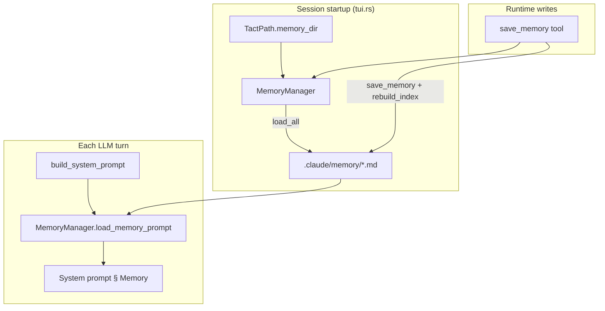

# Persistent Memory
> Language: [English](./03_chapter_memory.md) · [中文](./03_chapter_memory_zh.md)

This chapter explains how Tact stores **long-lived facts** outside the conversation context: user preferences, corrections, project constraints, and reference URLs. Memories are Markdown files with YAML frontmatter under `.claude/memory/`. They are injected into the system prompt every turn and can be written at runtime through the `save_memory` native tool.

For how memory fits into prompt assembly and the dynamic boundary, see [System Prompt](./04_chapter_prompt.md). For the tool that writes memories, see [Tool System](./07_chapter_tool.md).

---

## 1. What Memory Is For

Memory answers: *what should the agent remember across sessions that is not obvious from the current codebase?*

| Type | Example | When to save |
|------|---------|--------------|
| `user` | "I prefer tabs over spaces" | User states a preference |
| `feedback` | "Don't use unwrap in library code" | User corrects the agent |
| `project` | "Legacy billing module must not be touched" | Hard-won facts not inferable from code |
| `reference` | "Design docs live at https://…" | External resource locations |

The static string `MEMORY_GUIDANCE` (`crates/tact/src/memory/mod.rs`) is injected into the system prompt (above the dynamic boundary) to teach the model **when to save** and **when not to** — e.g. do not store secrets, temporary branch names, or anything easily derivable from the repo.

---

## 2. Architecture Overview



At startup, `get_memory_manager(tact_path.memory_dir())` constructs a `MemoryManager`, scans `.claude/memory/`, and loads all valid `.md` files into an in-memory `HashMap`. The same `Arc<Mutex<MemoryManager>>` is shared through `ToolContext` for both prompt rendering and `save_memory`.

---

## 3. Data Model

### MemoryType

```rust
pub enum MemoryType {
    User,       // YAML: user
    Feedback,   // feedback
    Project,    // project
    Reference,  // reference
}
```

Parsed from the YAML `type` field via `strum` (`snake_case`). Invalid types fail at parse time when loading or saving.

### MemoryEntry

```rust
pub struct MemoryEntry {
    pub name: String,
    pub description: String,
    pub memory_type: MemoryType,
    pub content: String,
}
```

### On-disk format

Each memory is a single file `{sanitized_name}.md`:

```markdown
---
name: Prefer Tabs
description: Indent with tabs
type: user
---
Use tabs by default.
```

| Field | Source | Notes |
|-------|--------|-------|
| `name` | frontmatter, or file stem if omitted | Display name; filename is sanitized (lowercase, `_`/`-` only) |
| `description` | frontmatter | One-line summary |
| `type` | frontmatter | Defaults to `project` when missing |
| body | after closing `---` | Full memory content |

Files **without** valid YAML frontmatter (`---` … `---`) are **skipped** on load — they are not treated as memories.

---

## 4. MemoryManager Lifecycle

| Method | Role |
|--------|------|
| `load_all()` | Scan `memory_dir` (depth 1 only); parse frontmatter; populate `HashMap` |
| `load_memory_prompt()` | Render grouped prompt block for the system template |
| `save_memory(name, description, type, content)` | Write file, update map, rebuild index |
| `describe_memories()` | Compact list for debugging (`[type] name: description`) |
| `memories()` | Read-only access to the in-memory map |

### Prompt rendering

`load_memory_prompt()` produces:

```markdown
# Memories (persistent across sessions)

## [user]
### Prefer Tabs: Indent with tabs
Use tabs by default.

## [project]
...
```

Entries are grouped by `MemoryType` (enum order), sorted by name within each group. Returns an empty string when no memories exist.

### Index file

On every `save_memory`, `rebuild_index()` writes `MEMORY.md` — a human-readable index capped at `MAX_INDEX_LINES` (200) lines with a truncation notice if exceeded.

---

## 5. Integration Points

### System prompt

`Agent::build_system_prompt` (`crates/tact/src/agent/mod.rs`):

```rust
.memory(self.load_memory_prompt()?)
.memory_guidance(MEMORY_GUIDANCE.trim())
```

Both run every turn inside the agent loop. Memory content appears **below** `=== DYNAMIC_BOUNDARY ===` (dynamic section). See [System Prompt](./04_chapter_prompt.md).

### ToolContext

```rust
pub memory_manager: Arc<std::sync::Mutex<MemoryManager>>,
```

Constructed in `tui.rs` alongside other session services. Sub-agents inherit the same manager through their `ToolContext`.

### save_memory tool

`crates/tact/src/tool/memory.rs` — `#[tool(name = "save_memory", …)]` locks the manager and calls `save_memory()`. Invalid `type` strings return an error.

---

## 6. Storage Layout

| Path | Purpose |
|------|---------|
| `<workdir>/.claude/memory/` | Memory directory (`TactPath::memory_dir()`) |
| `<workdir>/.claude/memory/{name}.md` | Individual memory files |
| `<workdir>/.claude/memory/MEMORY.md` | Auto-generated index (not loaded as a memory) |

Memory uses **Markdown files directly**, not the JSON `Store` layer described in [Store and Persistence](./01_chapter_store.md).

---

## 7. Code Map

| File | Role |
|------|------|
| `crates/tact/src/memory/mod.rs` | `MemoryType`, `MemoryEntry`, `MemoryManager`, `MEMORY_GUIDANCE`, frontmatter parsing |
| `crates/tact/src/tool/memory.rs` | `save_memory` native tool |
| `crates/tact/src/agent/mod.rs` | `load_memory_prompt()`, system prompt wiring |
| `crates/tact/src/tool/mod.rs` | `ToolContext.memory_manager` |
| `crates/tact-ui/src/headless.rs`, `interactive.rs` | `get_memory_manager()` at session startup |
| `crates/tact/src/consts.rs` | `TactPath::memory_dir()` → `.claude/memory` |

---

## 8. Current Gaps

| Gap | Detail |
|-----|--------|
| No delete or edit tool | Only `save_memory` exists; overwriting uses the same name |
| No reload from disk mid-session | External edits to `.md` files are not picked up until restart |
| Shallow scan | `load_all()` uses `max_depth(1)` — nested subdirectories are ignored |
| Frontmatter required | Files without `---` headers are silently skipped |
| No deduplication | Same display name with different sanitization could theoretically collide on filename |
| Mutex on hot path | Every turn and every save locks `memory_manager` |

---

## Related Docs

- [System Prompt](./04_chapter_prompt.md) — dynamic boundary and memory section placement
- [Tool System](./07_chapter_tool.md) — `save_memory` and `ToolContext`
- [Store and Persistence](./01_chapter_store.md) — JSON store layer (memory is separate)
- [ARCHITECTURE.md](../ARCHITECTURE.md) — high-level memory mention in prompt assembly
