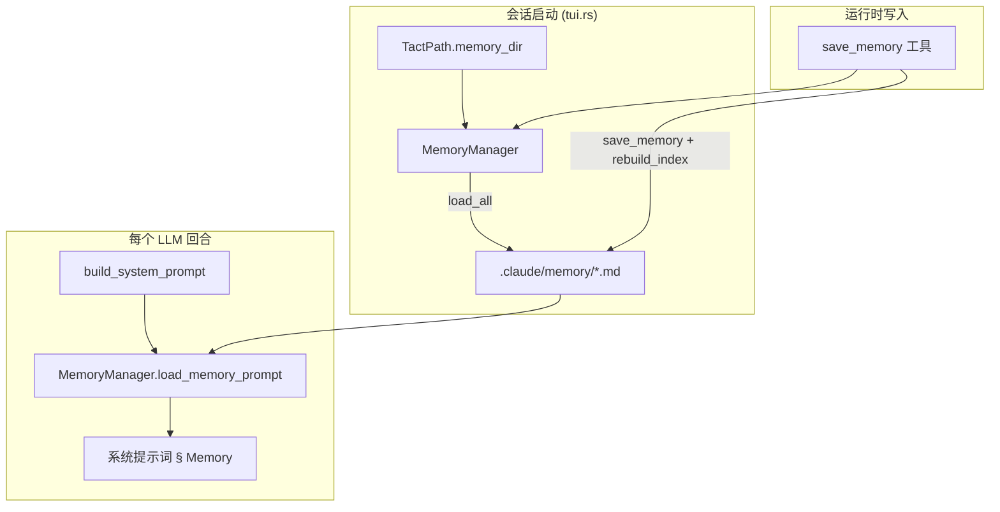

# 持久化记忆

> 语言：[中文](./03_chapter_memory_zh.md) · [English](./03_chapter_memory.md)

本章说明 Tact 如何在对话上下文之外存储**长期事实**：用户偏好、纠正、项目约束与参考 URL。记忆是 `.claude/memory/` 下带 YAML frontmatter 的 Markdown 文件。每轮注入系统提示词，并可通过 `save_memory` 原生工具在运行时写入。

记忆如何融入提示词组装与动态边界，见 [系统提示词](./04_chapter_prompt_zh.md)。写入工具见 [工具系统](./07_chapter_tool_zh.md)。

---

## 1. Memory 的用途

Memory 回答：*跨会话 agent 应记住什么，且无法从当前代码库直接看出？*

| 类型 | 示例 | 何时保存 |
|------|------|----------|
| `user` | 「我偏好 tab 而非 space」 | 用户陈述偏好 |
| `feedback` | 「库代码不要用 unwrap」 | 用户纠正 agent |
| `project` | 「遗留 billing 模块不能动」 | 难以从代码推断的硬事实 |
| `reference` | 「设计文档在 https://…」 | 外部资源位置 |

静态字符串 `MEMORY_GUIDANCE`（`crates/tact/src/memory/mod.rs`）注入系统提示词（动态边界之上），教模型**何时保存**与**何时不要**——例如不要存密钥、临时分支名，或可从仓库轻易推导的内容。

---

## 2. 架构概览



启动时，`get_memory_manager(tact_path.memory_dir())` 构造 `MemoryManager`，扫描 `.claude/memory/`，将所有合法 `.md` 载入内存 `HashMap`。同一 `Arc<Mutex<MemoryManager>>` 经 `ToolContext` 共享，供提示词渲染与 `save_memory` 使用。

---

## 3. 数据模型

### MemoryType

```rust
pub enum MemoryType {
    User,       // YAML: user
    Feedback,   // feedback
    Project,    // project
    Reference,  // reference
}
```

从 YAML `type` 字段经 `strum`（`snake_case`）解析。非法类型在加载或保存解析时失败。

### MemoryEntry

```rust
pub struct MemoryEntry {
    pub name: String,
    pub description: String,
    pub memory_type: MemoryType,
    pub content: String,
}
```

### 磁盘格式

每条记忆一个文件 `{sanitized_name}.md`：

```markdown
---
name: Prefer Tabs
description: Indent with tabs
type: user
---
Use tabs by default.
```

| 字段 | 来源 | 说明 |
|------|------|------|
| `name` | frontmatter，或省略时用文件 stem | 显示名；文件名为 sanitized（小写，仅 `_`/`-`） |
| `description` | frontmatter | 一行摘要 |
| `type` | frontmatter | 缺失时默认为 `project` |
| body | 闭合 `---` 之后 | 完整记忆内容 |

**无**合法 YAML frontmatter（`---` … `---`）的文件在加载时**跳过**——不视为记忆。

---

## 4. MemoryManager 生命周期

| 方法 | 角色 |
|------|------|
| `load_all()` | 扫描 `memory_dir`（仅 depth 1）；解析 frontmatter；填充 `HashMap` |
| `load_memory_prompt()` | 为系统模板渲染分组提示块 |
| `save_memory(name, description, type, content)` | 写文件、更新 map、重建索引 |
| `describe_memories()` | 紧凑列表供调试（`[type] name: description`） |
| `memories()` | 只读访问内存 map |

### 提示词渲染

`load_memory_prompt()` 产出：

```markdown
# Memories (persistent across sessions)

## [user]
### Prefer Tabs: Indent with tabs
Use tabs by default.

## [project]
...
```

条目按 `MemoryType`（enum 顺序）分组，组内按名称排序。无记忆时返回空字符串。

### 索引文件

每次 `save_memory` 时，`rebuild_index()` 写入 `MEMORY.md`——人类可读索引，上限 `MAX_INDEX_LINES`（200）行，超出则附截断说明。

---

## 5. 集成点

### 系统提示词

`Agent::build_system_prompt`（`crates/tact/src/agent/mod.rs`）：

```rust
.memory(self.load_memory_prompt()?)
.memory_guidance(MEMORY_GUIDANCE.trim())
```

二者在 agent loop 内每轮执行。记忆内容出现在 `=== DYNAMIC_BOUNDARY ===` **之下**（动态节）。见 [系统提示词](./04_chapter_prompt_zh.md)。

### ToolContext

```rust
pub memory_manager: Arc<std::sync::Mutex<MemoryManager>>,
```

在 `tui.rs` 中与其他会话服务一并构造。子 agent 通过其 `ToolContext` 继承同一 manager。

### save_memory 工具

`crates/tact/src/tool/memory.rs` — `#[tool(name = "save_memory", …)]` 锁定 manager 并调用 `save_memory()`。非法 `type` 字符串返回错误。

---

## 6. 存储布局

| 路径 | 用途 |
|------|------|
| `<workdir>/.claude/memory/` | 记忆目录（`TactPath::memory_dir()`） |
| `<workdir>/.claude/memory/{name}.md` | 单条记忆文件 |
| `<workdir>/.claude/memory/MEMORY.md` | 自动生成索引（不作为记忆加载） |

记忆**直接使用 Markdown 文件**，而非 [存储与持久化](./01_chapter_store_zh.md) 中的 JSON `Store` 层。

---

## 7. 代码地图

| 文件 | 角色 |
|------|------|
| `crates/tact/src/memory/mod.rs` | `MemoryType`、`MemoryEntry`、`MemoryManager`、`MEMORY_GUIDANCE`、frontmatter 解析 |
| `crates/tact/src/tool/memory.rs` | `save_memory` 原生工具 |
| `crates/tact/src/agent/mod.rs` | `load_memory_prompt()`、系统提示词接线 |
| `crates/tact/src/tool/mod.rs` | `ToolContext.memory_manager` |
| `crates/tact-ui/src/headless.rs`、`interactive.rs` | 会话启动时 `get_memory_manager()` |
| `crates/tact/src/consts.rs` | `TactPath::memory_dir()` → `.claude/memory` |

---

## 8. 当前缺口

| 缺口 | 说明 |
|------|------|
| 无删除或编辑工具 | 仅有 `save_memory`；覆盖使用同名 |
| 会话中不从磁盘 reload | 外部编辑 `.md` 需重启才生效 |
| 浅层扫描 | `load_all()` 使用 `max_depth(1)`——忽略嵌套子目录 |
| 必需 frontmatter | 无 `---` 头的文件静默跳过 |
| 无去重 | 相同显示名不同 sanitize 理论上可能文件名冲突 |
| 热路径 Mutex | 每轮与每次 save 都锁 `memory_manager` |

---

## 相关文档

- [系统提示词](./04_chapter_prompt_zh.md) — 动态边界与记忆节位置
- [工具系统](./07_chapter_tool_zh.md) — `save_memory` 与 `ToolContext`
- [存储与持久化](./01_chapter_store_zh.md) — JSON store 层（记忆独立）
- [ARCHITECTURE.md](../ARCHITECTURE.md) — 提示词组装中的记忆高层说明
