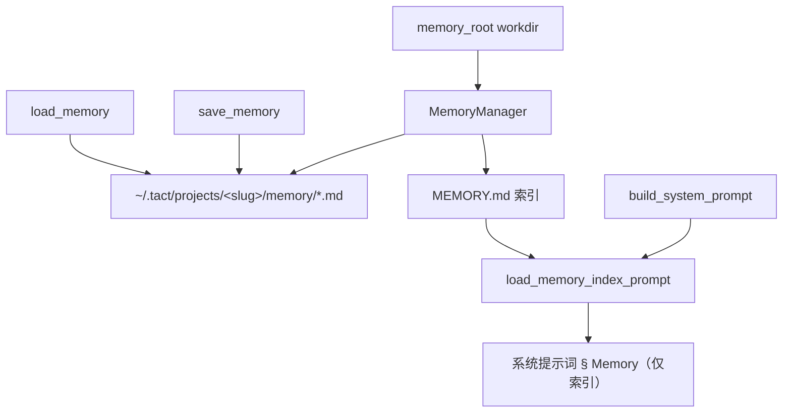

# 持久化记忆

本章说明 Tact 如何在对话上下文之外存储**长期事实**：用户偏好、纠正、项目约束与参考 URL。记忆是带 YAML frontmatter 的 Markdown 文件，存放在**按 git 仓库切分**的目录 `~/.tact/projects/<slug>/memory/` 下；同一仓库的所有 worktree 共用一个目录。系统提示词只注入 `MEMORY.md` **索引**（200 行 / 25 KB 上限），正文由 `load_memory` 工具按需读取；写入走 `save_memory`。

这套结构对齐 Claude Code 的 auto memory（`~/.claude/projects/<repo>/memory/`）：**每个仓库一份、索引进提示词、正文按需取**。

`[agent].memory_enabled`（默认 `true`）是总开关：设为 `false` 后既不注入记忆与 `MEMORY_GUIDANCE`，也不注册 `save_memory` / `load_memory`；磁盘上的文件不会被删除。具体契约见 §5。

记忆如何融入提示词组装与动态边界，见 [系统提示词](./04_chapter_prompt_zh.md)。写入工具见 [工具系统](./07_chapter_tool_zh.md)。

---

## 1. Memory 的用途

Memory 回答：*跨会话 agent 应记住什么，且无法从当前代码库直接看出？*

| 类型 | 示例 | 何时保存 |
|------|------|----------|
| `user` | 「我偏好 tab 而非 space」 | 用户陈述偏好 |
| `feedback` | 「库代码不要用 unwrap」 | 用户纠正 agent |
| `project` | 「遗留 billing 模块不能动」 | 难以从代码推断的硬事实 |
| `reference` | 「设计文档在 https://…」 | 外部资源位置 |

静态字符串 `MEMORY_GUIDANCE`（`crates/tact/src/memory/mod.rs`）注入系统提示词（动态边界之上），教模型**何时保存**与**何时不要**——例如不要存密钥、临时分支名，或可从仓库轻易推导的内容。

---

## 2. 架构概览


```mermaid
graph TD
    mr[memory_root workdir] --> mm[MemoryManager]
    mm --> files["~/.tact/projects/&lt;slug&gt;/memory/*.md"]
    mm --> idx["MEMORY.md 索引"]
    bsp[build_system_prompt] --> mm2[load_memory_index_prompt]
    idx --> mm2
    mm2 --> sp["系统提示词 § Memory（仅索引）"]
    sm[save_memory] --> files
    lm[load_memory] --> files
```

启动时，两个前端共用的 `session_bootstrap::bootstrap_session`（`crates/tact-ui/src/session_bootstrap.rs`）调用 `tact::memory::memory_root(&work_dir)` 得到本仓库的记忆目录，再把旧的全局目录迁移进来（§6），最后构造 `MemoryManager`。

**目录如何派生**（`memory_root` → `repo_slug`）：向上查找 `.git`，取其**common git dir** 的父目录（即 checkout 根）作为仓库标识，把非 `[A-Za-z0-9._-]` 字符替换为 `-`。`/Users/me/Projects/tact` → `-Users-rg-Projects-tact`（与 Claude Code 的同名约定一致）。

关键点：`.git` 在主 checkout 里是**目录**，在 linked worktree 里是内容为 `gitdir: <main>/.git` 的**文件**。取两者的共同目标（common git dir）后，worktree 与主 checkout 得到**同一个 slug**，因此共享记忆目录——项目事实不会在 worktree 之间分裂。解析是**纯函数**（只读 `$HOME` 与 `.git`，不 spawn 进程、不做 `canonicalize`），因为它在会话启动路径上。

不在 git 仓库内时退回 `<workdir>/.tact/memory`；`$HOME` 未设置时同样退回该路径（测试与无家目录容器）。

`[agent].auto_memory_directory` 可以**覆盖**上面这套派生：`~` / `~/x` 展开为 `$HOME`，相对路径按 workdir 解析，绝对路径原样使用——与 `[agent].skill_dirs` 完全同一套规则（`expand_memory_dir`）。设置后所有项目共用该目录，这正是默认布局要避免的形态，因此它面向的是"共享盘 / 网络存储"这类需求，而不是"让多个仓库共享记忆"。

`[agent].memory_enabled` 只控制后两条消费路径：关闭时系统提示不注入索引 / guidance，`toolset_with_memory(false)` 也不注册 `save_memory` / `load_memory`。`MemoryManager` 仍会构造并只读加载（不写盘），因此开关不是访问控制——模型仍可能通过 `read_file` / `bash` 读到工作区内的 `.tact/memory`（仓库外那份则被 `safe_path` 挡住，见 §5）。

---

## 3. 数据模型

### MemoryType

```rust
pub enum MemoryType {
    User,       // YAML: user
    Feedback,   // feedback
    Project,    // project
    Reference,  // reference
}
```

从 YAML `type` 字段经 `strum`（`snake_case`）解析。非法类型在加载或保存解析时失败。

### MemoryEntry

```rust
pub struct MemoryEntry {
    pub name: String,
    /// 磁盘文件名（stem）——`load_memory` 的句柄，索引里打印的就是它
    pub file_stem: String,
    pub description: String,
    pub memory_type: MemoryType,
    pub content: String,
    /// frontmatter 的 `modified` 时间戳，文件没有则 `None`
    pub modified: Option<String>,
}
```

### 磁盘格式

每条记忆一个文件 `{sanitized_name}.md`：

```markdown
---
name: Prefer Tabs
description: Indent with tabs
type: user
modified: 2026-10-09T13:21:04Z
---
Use tabs by default.
```

| 字段 | 来源 | 说明 |
|------|------|------|
| `name` | frontmatter，或省略时用文件 stem | 显示名；文件名为 sanitized（小写，仅 `_`/`-`） |
| `description` | frontmatter | 一行摘要 |
| `type` | frontmatter | 缺失时默认为 `project` |
| `modified` | 写入时自动生成 | ISO-8601 UTC；让新旧记忆可辨，加载时同样读回 |
| body | 闭合 `---` 之后 | 完整记忆内容 |

**无**合法 YAML frontmatter（`---` … `---`）的文件在加载时**跳过**——不视为记忆。

---

## 4. MemoryManager 生命周期

| 方法 | 角色 |
|------|------|
| `load_all()` | 扫描 `memory_dir`（仅 depth 1）；解析 frontmatter；填充 `HashMap`；索引缺失时补建 |
| `load_memory_index_prompt()` | 渲染注入系统提示词的**索引**块（含 `load_memory` 使用说明） |
| `load_topic(name)` | 按文件 stem（或显示名）返回一条记忆的完整原文 |
| `save_memory(name, description, type, content)` | 写文件（含 `modified`）、更新 map、重建索引 |
| `describe_memories()` | 紧凑列表供调试（`[type] name: description`） |
| `memories()` / `dir()` | 只读访问内存 map / 目录 |

### 提示词渲染

`load_memory_index_prompt()` 注入的内容是 `MEMORY.md` 本身，外加一句使用说明：

```markdown
The index below lists memories from previous sessions in this repository.
Read one in full with the `load_memory` tool (pass its file name without
the `.md` suffix) before relying on it.

# Memory Index

- Prefer Tabs (prefer_tabs.md): Indent with tabs [user]
```

**正文不进提示词**——这是与旧实现最重要的差别。旧版把每条记忆的完整内容拼进提示词，条目越多注入越大、且没有字节上限；现在无论积攒多少条，注入量都由索引的 200 行 / 25 KB 封顶（Claude Code 的同两个限制）。

### 索引文件

`rebuild_index()` 在每次 `save_memory` 时写 `MEMORY.md`；`load_all()` 发现索引缺失（例如手写目录、从没调过 `save_memory`）时也会补建——因为索引现在**就是被注入的那个产物**，不能只在保存时存在。

索引行形如 `- <name> (<stem>.md): <description> [<type>]`：**文件名写进行里**，因为它是 `load_memory` 的句柄，而索引是模型唯一能得知可读什么的入口。

行数与字节两个上限由 `truncate_index` 执行：`MAX_INDEX_LINES`（200）与 `MAX_INDEX_BYTES`（25 KB），谁先到算谁，并在截断处留一行说明。

---

## 5. 集成点

### 系统提示词

`Agent::build_system_prompt`（`crates/tact/src/agent/mod.rs`）：

```rust
let memory_enabled = self.agent_settings.memory_enabled;
let memory = if memory_enabled { self.load_memory_prompt()? } else { String::new() };
let memory_guidance = if memory_enabled { MEMORY_GUIDANCE.trim() } else { "" };
// …
.memory(memory)
.memory_guidance(memory_guidance)
```

二者在 agent loop 内每轮执行；`memory_enabled = false` 时传入空字符串，模板的 `` 会直接略去两个节。记忆内容出现在 `=== DYNAMIC_BOUNDARY ===` **之下**（动态节）。见 [系统提示词](./04_chapter_prompt_zh.md)。

### ToolContext

```rust
pub memory_manager: Arc<std::sync::Mutex<MemoryManager>>,
```

在 `session_bootstrap::bootstrap_session` 中与其他会话服务（五个领域 manager、MCP router、工具集、hooks）一并构造，headless 与交互两个前端共用。子 agent 通过其 `ToolContext` 继承同一 manager。

### save_memory 工具

`crates/tact/src/tool/memory.rs` — `#[tool(name = "save_memory", …)]` 锁定 manager 并调用 `save_memory()`。非法 `type` 字符串返回错误。

### load_memory 工具

同文件的 `load_memory` 读取一条记忆的完整原文，输入是索引里的**文件名（不含 `.md`）**；显示名也接受，以免模型照抄索引标题时被为难。未知名字返回错误并列出已知名字。

这个工具是「只注入索引」能成立的前提：`read_file` 受 `tool::safe_path` 约束、拒绝工作区之外的路径（`crates/tact/src/tool/path.rs`），而仓库记忆住在 `$HOME/.tact/projects/…`。没有它，索引会列出模型**读不到**的内容。

主 agent 的工具集在 `session_bootstrap::bootstrap_session` 里由 `crates/tact/src/tool/registry.rs` 的 `toolset_with_memory(tact::config::settings().agent.memory_enabled)` 组装；关闭时两个工具都不进入 router，因此既不出现在工具声明里，派发时也只会得到 `unknown tool`。二者同开关是刻意的：只注入索引却拿不到 `load_memory`，会让模型看见读不到的记忆。

---

## 6. 存储布局

| 路径 | 用途 |
|------|------|
| `~/.tact/projects/<slug>/memory/` | 本仓库的记忆目录（`memory_root()`）；`<slug>` 由 common git dir 的父目录派生 |
| `~/.tact/projects/<slug>/memory/{stem}.md` | 单条记忆文件（含 `modified`） |
| `~/.tact/projects/<slug>/memory/MEMORY.md` | 索引——**注入系统提示词的就是它**（200 行 / 25 KB 上限） |
| `<workdir>/.tact/memory/` | 不在 git 仓库内、或 `$HOME` 未设置时的回退目录 |
| `~/.tact/memory/` | **旧**的全局目录，已退役；仅作为迁移来源，不再读写 |
| `[agent].auto_memory_directory` | 可选覆盖，替代上面所有派生（`~`/相对路径按 `skill_dirs` 规则展开） |

### 迁移

旧布局把机器上所有项目塞进一个 `~/.tact/memory/`。切分后这些文件会失去归属，因此 `migrate_legacy_memory(legacy, dest)` 在启动时把它们**拷贝**进本仓库目录：

- 只在目标目录**尚无** `.md` 时执行一次——一旦本仓库有了自己的记忆，陈旧的全局目录不得覆盖它。
- 只拷贝，**不删除**：第二个 checkout 也能从同一来源迁移。
- 跳过 `MEMORY.md`（索引按目标目录重建）。
- 拷贝数量经启动 `Notices` 通道报告，迁移不会静默发生；迁移失败只损失导入，不影响会话。

记忆**直接使用 Markdown 文件**，而非 [存储与持久化](./01_chapter_store_zh.md) 中的 JSON `Store` 层。

---

## 7. 代码地图

| 文件 | 角色 |
|------|------|
| `crates/tact/src/memory/mod.rs` | `MemoryType`、`MemoryEntry`、`MemoryManager`、`memory_root` / `repo_slug`、`migrate_legacy_memory`、`MEMORY_GUIDANCE`、frontmatter 解析与索引截断 |
| `crates/tact/src/tool/memory.rs` | `save_memory` / `load_memory` 原生工具 |
| `crates/tact/src/tool/registry.rs` | `toolset_with_memory()` 按 `[agent].memory_enabled` 决定是否注册两个记忆工具 |
| `crates/tact/src/agent/mod.rs` | `load_memory_prompt()`（转发到索引渲染）、系统提示词接线 |
| `crates/tact/src/tool/mod.rs` | `ToolContext.memory_manager` |
| `crates/tact-ui/src/session_bootstrap.rs` | 解析 `memory_root(&work_dir)`、跑迁移、构造 manager、装配工具集；headless / 交互两个前端共用同一份 |
| `crates/tact/src/consts.rs` | `TactPath::home_projects_dir()` → `~/.tact/projects`；`home_memory_dir()` 保留为迁移来源 |

---

## 8. 当前缺口

| 缺口 | 说明 |
|------|------|
| 无删除或编辑工具 | 仅有 `save_memory`；覆盖使用同名。删除需手工删文件 |
| 会话中不从磁盘 reload | 外部编辑 `.md` 需重启才生效 |
| 无全局共享层 | 记忆严格按仓库隔离；Claude Code 同样如此，跨仓库复用的偏好只能写进 `AGENTS.md` 或 `~/.tact/` 级配置 |
| 不可改存储位置 | 目录由 `memory_root` 派生，或由 `[agent].auto_memory_directory` 整体覆盖；没有"只加一层前缀"的选项 |
| 浅层扫描 | `load_all()` 使用 `max_depth(1)`——忽略嵌套子目录 |
| 必需 frontmatter | 无 `---` 头的文件静默跳过 |
| 无去重 | 相同显示名不同 sanitize 理论上可能文件名冲突 |
| 热路径 Mutex | 每轮与每次 save 都锁 `memory_manager` |
| 目录不可读时静默 | `load_all` 的补建索引失败被忽略，提示词退回空块 |

---

## 相关文档

- [系统提示词](./04_chapter_prompt_zh.md) — 动态边界与记忆节位置
- [工具系统](./07_chapter_tool_zh.md) — `save_memory` 与 `ToolContext`
- [存储与持久化](./01_chapter_store_zh.md) — JSON store 层（记忆独立）
- [ARCHITECTURE.md](../ARCHITECTURE.md) — 提示词组装中的记忆高层说明
