# Context Compaction

> Language: [English](./05_chapter_compact.md) · [中文](./05_chapter_compact_zh.md)

This chapter explains how Tact keeps a long-running conversation **inside the model's context window**: cheap in-place truncation every turn (`micro_compact`), full LLM-generated summarization when the limit is reached (`compact_history`), and disk spill for both transcripts and oversized tool outputs. The primitives live in `crates/tact/src/compact/mod.rs`; the orchestration lives in `Agent::compact_history` in `crates/tact/src/agent/mod.rs`.

Compaction is also a **recovery strategy**: when the provider rejects a request as too long, the agent compacts and retries. See [Error Recovery](./06_chapter_recovery.md).

---

## 0. Why Compaction Exists

A coding agent accumulates messages every turn: user text, assistant reasoning, tool calls, and especially **tool results** (file contents, command logs, search hits). Context growth has three costs:

| Cost | Effect |
|------|--------|
| Hard limit | Provider returns prompt-too-long → turn fails without recovery |
| Soft cost | Longer prompts → slower TTFT, higher $ / tokens |
| Attention | Distant tool dumps dilute the signal the model needs *now* |

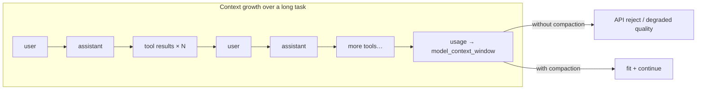

Tact’s answer is **progressive defense**: free local stubs first, then one paid summarization call only when needed, plus opportunistic spill of single huge outputs so they never enter the window at full size.

---

## 1. Three Levels of Defense

| Level | Mechanism | Cost | When | What is lost from *context* |
|-------|-----------|------|------|-----------------------------|
| 1 | `persist_large_output` | Free (disk I/O) | Every successful native or MCP result > 30,000 chars | Full output (kept on disk + preview) |
| 2 | `micro_compact` | Free | Start of every LLM turn | Old tool-result bodies (stub left behind) |
| 3 | `compact_history` | One extra LLM call | 80% threshold, prompt-too-long, or `compact` tool | Assistant/tool history (recent real users + summary remain; full JSONL on disk) |

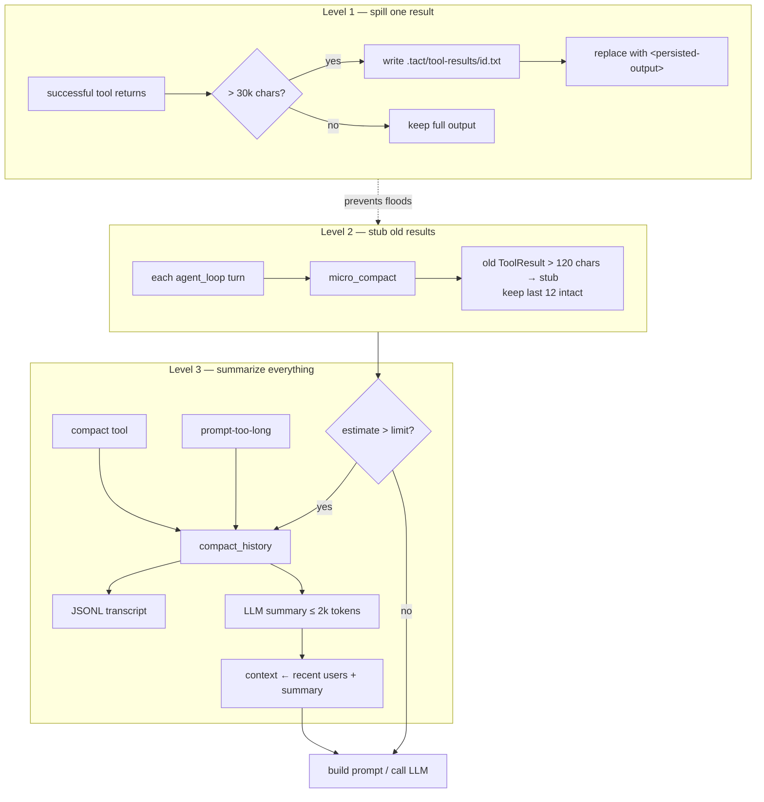

**Mental model:** Level 1 protects *this turn’s* stdout; Level 2 protects *history shape* without an LLM; Level 3 resets the conversation when even stubs are not enough.

---

## 2. Where Compaction Sits in the Agent Loop

Compaction is not a separate daemon — it is woven into `Agent::agent_loop`. Reading the loop top-to-bottom:

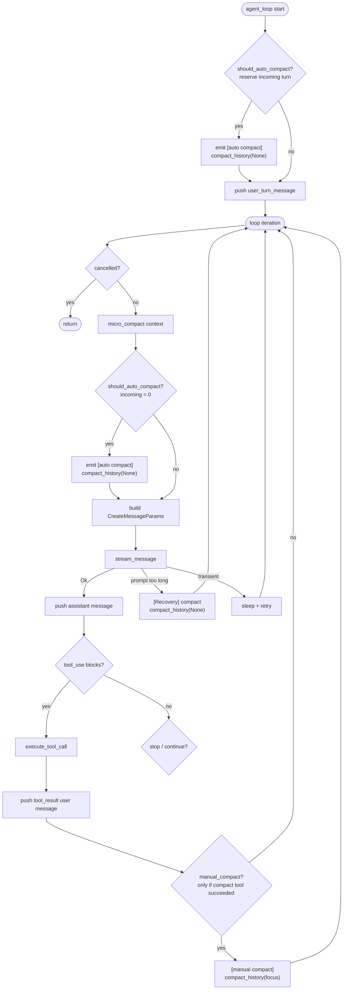

Key ordering facts:

1. **Entry path** — before the user turn is pushed, `should_auto_compact` reserves `estimate(user_turn)` so a large prompt cannot overflow immediately after append.
2. **Each loop iteration** — `micro_compact` then `should_auto_compact(incoming = 0)` run **before** the model request (including continuations after tools / recovery).
3. **After tool execution** — only a **successful** `compact` tool sets `manual_compact`; that path calls `compact_history(focus)` then returns to the loop top. Failed / rejected compact invocations leave history intact.
4. **Prompt-too-long recovery** runs `compact_history` then `continue`s the loop (same turn, new context). Cap: `MAX_RECOVERY_ATTEMPTS` (3). Details in [Error Recovery](./06_chapter_recovery.md).
5. **Manual `compact` tool** cannot rewrite context *inside* the tool handler (API validity). Dispatch records a flag only on success; `compact_history` runs **after** tool results are appended.

---

## 3. Micro-Compaction

`micro_compact(messages, enabled)` runs before each model request (disable via config, see §9). It only touches **user-role** messages that contain `ContentBlock::ToolResult`. Full auto-compact also runs at this point (`incoming = 0`); the entry path separately reserves the incoming user turn before push.

```rust
const KEEP_RECENT_TOOL_RESULTS: usize = 12;
const COMPACTED_TOOL_RESULT: &str =
    "[Earlier tool result compacted. If you need the full content to continue editing, re-read the relevant file.]";
```

### Algorithm

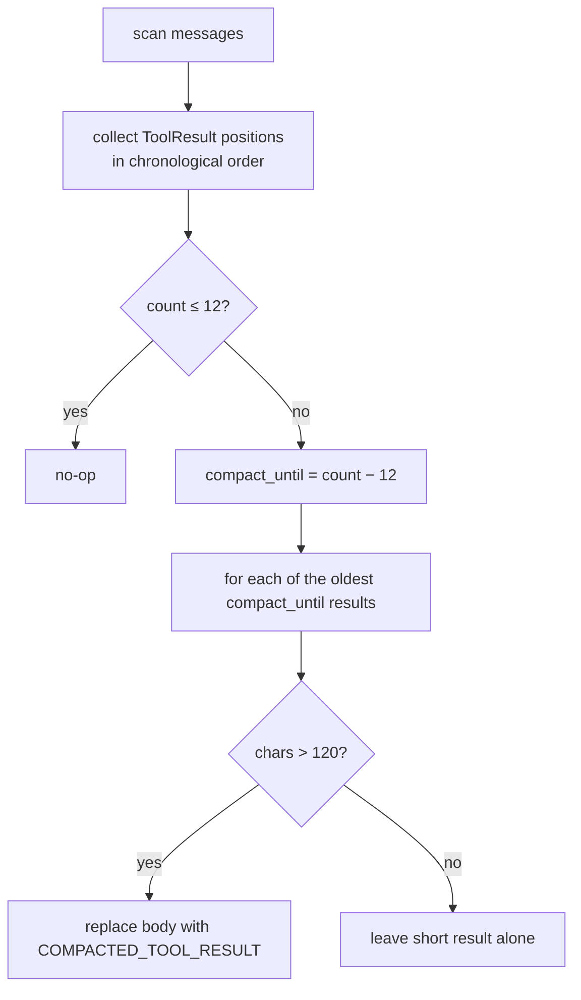

### Before / after (conceptual)

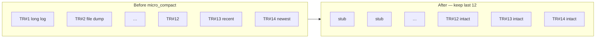

Rules of thumb encoded in the constants:

| Rule | Why |
|------|-----|
| Keep last **12** results | Current workflow usually needs recent tool I/O |
| Stub only if **> 120** chars | Short oks / errors are dense; stubbing saves nothing |
| Never touch assistant / thinking / user text | Only tool dumps are the bulk offenders |

The stub text is deliberate: it tells the model **how to recover** (`read_file` / re-run tools). The system prompt reinforces the same idea:

> If a tool result was compacted and you need the details, re-run the relevant tool (e.g., `read_file`)

---

## 4. Auto Trigger and Size Estimation

The shared threshold is **`agent.model_context_window`** — the model context window in **tokens** (default **200,000**). The same value drives auto-compaction and the TUI bottom-bar usage meter.

### Decision (OR)

`should_auto_compact` fires when **either** condition holds (optionally reserving an *incoming* user turn not yet in context and the next `max_tokens` output):

```text
last_token_total > 0
  && last_token_total + estimate_message_tokens(incoming_turn) + max_tokens >= 80% of model_context_window
  || estimate_context_tokens(context) + estimate_message_tokens(incoming_turn) + max_tokens >= 80% of model_context_window
```

Both sides of the OR compare against the same **token** window and both reserve the model's output budget (`max_tokens`) so compaction triggers early enough for the LLM to fit its response. Serialized content is estimated by counting ASCII at roughly four characters per token and non-ASCII conservatively at one character per token.

- **Entry (`agent_loop`)**: compact **old** history first with `incoming_turn_tokens = estimate(user_turn)`, then `push` the turn verbatim.
- **Loop / recovery / manual**: turn already in context → `incoming_turn_tokens = 0`.

Rebuild after summarize (Codex-style): **`[recent real User messages…] + [SUMMARY_PREFIX + handoff]`**, not a single summary-only message. The rebuild has three stages:

1. **`collect_user_messages`** — walks the entire context, extracting real user turns via `is_real_user_message` (excludes tool-result-only blocks, prior summaries, and non-User roles).
2. **`retained_user_message_token_budget`** — budget = `min(20k estimated tokens, model_context_window - max_tokens - estimate(system + tools + summary) - 20% headroom)`.
3. **`build_compacted_history`** — keeps real user messages from the tail up to the budget; a block turn is kept verbatim when it fits, an oversized one falls back to its text tail, or an omission marker when it contains only images. Base64 is never sliced. A summary message is appended last.

The legacy single-summary path remains as `compact_history_legacy`.

Two distinct percentages apply in different phases:

| Phase | Headroom | Used in |
|-------|----------|---------|
| Summarizer **input** budget | **10%** of window | `compact_history_with_mode` — reserves space so the summary instructions + history tail fit before calling the LLM |
| Rebuild **final-request** guard | **20%** of window | `compact_rebuild_headroom_tokens` — ensures the post-compact request (system + tools + retained users + summary + max_output) does not overflow after reconstruction |

For a 200,000-token window, the summarizer input headroom is 10% = 20,000 tokens, and the rebuild guard is 20% = 40,000 tokens. Both absorb estimation error, JSON serialization overhead, and differences between the conservative estimate and the provider tokenizer. Percentages are rounded up, so the reserve is never rounded down.

```rust
pub fn estimate_context_tokens(messages: &[Message]) -> usize {
    match serde_json::to_string(messages) {
        Ok(serialized) => approx_text_tokens(&serialized),
        Err(_) => usize::MAX / 2, // prefer compact over underestimating
    }
}
```

```mermaid
flowchart TD
    MC[micro_compact] --> Tok{tokens (+ incoming) ≥ 80% window?}
    Tok -->|yes| Auto[auto compact_history]
    Tok -->|no| Est["estimated context + incoming tokens<br/>≥ 80% window?"]
    Est -->|yes| Auto
    Est -->|no| Call[LLM call]
```

| Setting | Default | Notes |
|---------|---------|-------|
| `agent.model_context_window` | **200,000** | Tokens; CLI `--model-context-window` / TOML. Breaking rename from `context_limit_chars` — **no silent alias**. |

After compaction, `last_token_total` is **reset to 0** (the summarizer call's usage reflects a large history prompt, not the replacement context size); the next main-loop LLM call writes a fresh value. See §11.

---

## 5. Full Compaction: `compact_history`

`Agent::compact_history(focus: Option<&str>)` is the expensive path. It never “deletes” work permanently: the pre-compact context is always written to a transcript first.

### Two rebuild strategies

Tact has **two** compaction rebuild modes. Both share the same summarization pipeline (transcript → select recent messages → LLM summary), but differ in **how context is replaced after the summary is produced**:

- **Codex-style** (`compact_history`, production default): rebuilds via `collect_user_messages` + `build_compacted_history`. Context after: `[real User…] + [SUMMARY_PREFIX + summary]`. Real user turns are preserved verbatim from the tail (budget permitting). Current turn survives loop compaction because `collect_user_messages` recovers it from the full context.
- **Legacy** (`compact_history_legacy`, rollback only): replaces the entire context with `compacted_context(summary)` — a single user message. All user turns are lost; the current turn in loop compaction is eaten into the summary.

Only Codex is called by production call sites; Legacy exists as `#[allow(dead_code)]` for reference.

### End-to-end sequence

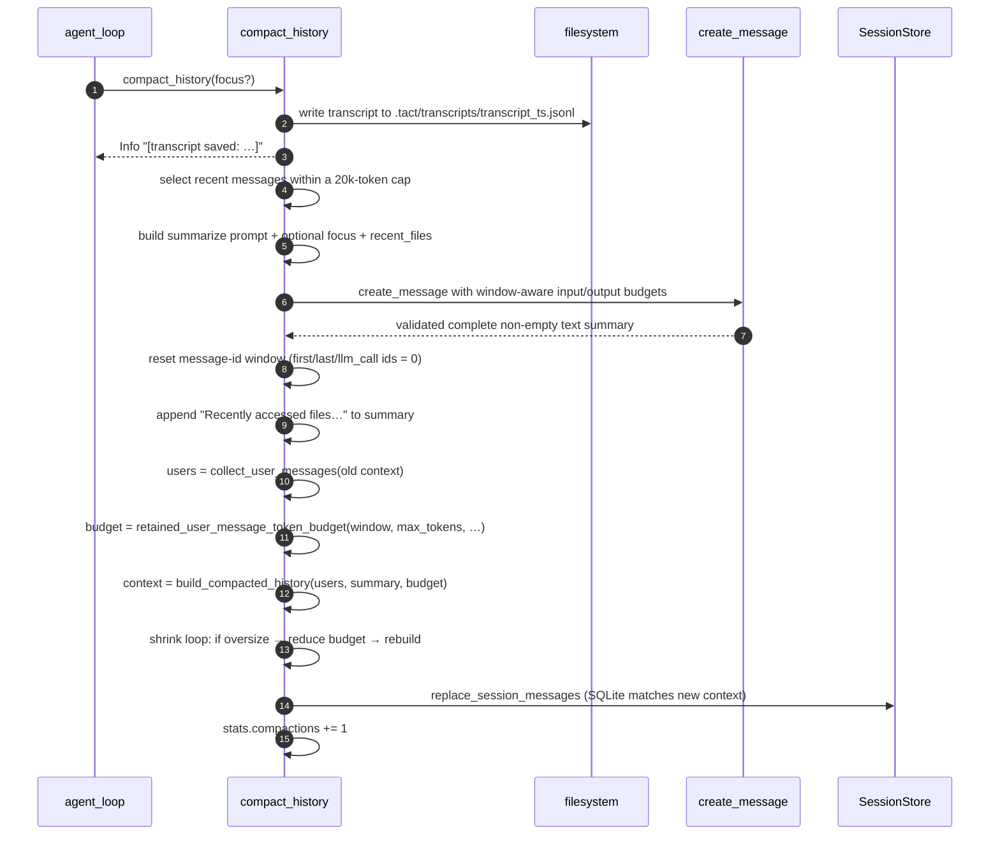

### Step details

**1. Transcript spill** — `write_transcript` atomically creates a unique `.tact/transcripts/transcript_<unix_nanos>_<collision>.jsonl`, one JSON message per line. TUI shows `[transcript saved: …]`. Full history is recoverable offline; the model is **not** automatically pointed at this path in the summary message (gap in §11).

**2. Recent-window selection** — walk `context` **from the end** within both the model-window budget and a **20,000 estimated-token cap**. An oversized message is converted to a valid text-only view; images become omission markers, so base64 is never cut. No message is forced in when it cannot fit. Earlier turns survive only via transcript + whatever the summary can infer.

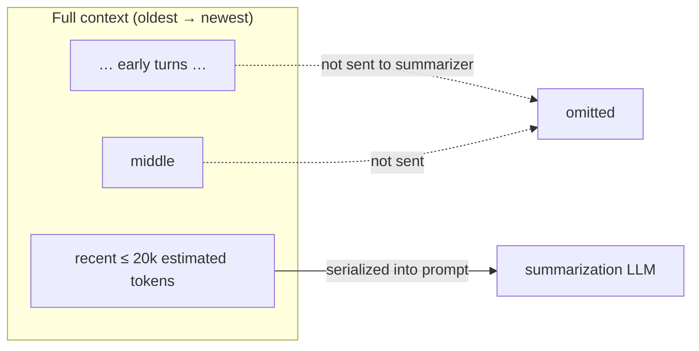

**3. Summarization call** — a fresh non-streaming `create_message` (at most 2,000 output tokens, no tools, no thinking) reserves output and 10% safety headroom before selecting input. If the fixed summary instructions alone exceed this input limit, compaction fails early because no valid summary request can be constructed, even after removing all history. Transient transport failures get up to three retries with backoff. `MaxTokens`, refusal/other abnormal stop reasons, and empty text are rejected without replacing the old context. The prompt asks the model to preserve:

1. Current goal and accomplishments  
2. Findings, decisions, architectural insights  
3. Files read/changed (types, signatures, APIs when relevant)  
4. Remaining work / next steps  
5. User constraints and preferences  
6. Errors and causes  

Optional appendages:

- `Focus to preserve next: {focus}` — from the manual `compact` tool  
- `Recent files to reopen if needed:` — from `CompactState.recent_files`

If the focus text is too large to fit in the summarizer input budget together with the fixed instructions, it is silently dropped — but a `tracing::warn!` log records the event (original length, available budget, and needed tokens) so the omission is observable in diagnostics.

When a message exceeds the summary-input budget, `summary_message_fallback` converts it to a valid text-only representation. Each block type is mapped as follows:

| Block type | Becomes |
|------------|---------|
| `Text` | Kept as-is |
| `Thinking` | Kept as-is |
| `RedactedThinking` | `[Redacted thinking omitted.]` |
| `Image` | `[Earlier image attachment omitted during compaction.]` |
| `ToolUse` | `[Tool call: {name}]` |
| `ToolResult` | `[Tool result {tool_use_id}]\n{content}` |

If even the fallback text is too large, it is tail-truncated (`take_last_tokens`) to the remaining budget. Base64 image data is **never** sliced — it is replaced wholesale by the omission marker, guaranteeing the serialized JSON is always valid.

**4. Context replacement** — Codex-style rebuild, in three stages:

**4a. Collect user messages** — `collect_user_messages(&old_context)` walks the full context, filtering with `is_real_user_message`: keeps non-summary, non-tool-result-only User messages. This is the candidate set, not yet truncated.

**4b. Rebuild from tail** — `build_compacted_history(users, summary, max_tokens)` keeps real user messages from the tail within a token budget; a summary message is appended last:

```text
[0] User  "<earlier real user text…>"
[1] User  "<more recent real user text…>"
[2] User  "This conversation was compacted so the agent can continue working.

           <summary…>

           Recently accessed files (re-read if you need their contents):
           - crates/tact/src/agent/mod.rs
           - …"
```

(`compact_history_legacy` still replaces with a **single** summary user message.)

**4c. Shrink loop (final-request guard)** — The initial budget comes from `retained_user_message_token_budget` (`model_context_window - max_tokens - estimate(system+tools+summary) - 20% headroom`, capped at 20k). But this is an estimate; the rebuilt payload may still exceed the window. So a loop runs:

1. Compute total tokens: `system + tools + estimate(rebuilt) + max_tokens + headroom`
2. If ≤ `model_context_window` → accepted.
3. If it exceeds → `retained_tokens -= overflow`, rebuild again with the smaller budget, go to step 1.
4. If `retained_tokens == 0` and still doesn't fit → `anyhow::bail!` (original context intact; even a single summary alone exceeds the window).

### Compaction failure behavior

The context is replaced only after the summary has been validated and the rebuilt request fits the model window. If summary generation fails, returns empty text, uses an invalid stop reason, or the rebuilt request cannot fit, the original in-memory context remains in place. If persisting the rebuilt context to SQLite fails, the replacement is rolled back as well. The transcript written at the start of compaction remains available for diagnosis or offline recovery. The current agent loop then propagates the error and normally ends the task; it does not blindly retry the same oversized context. Transient summary transport errors are the exception: they are retried up to three times before failing.

**5. Bookkeeping**

| Action | Why |
|--------|-----|
| `has_compacted = true`, store `last_summary` | Session knows compaction occurred |
| Reset `first_message_db_id` / `last_message_db_id` / `llm_call_last_message_id` | New message-id window after rewrite |
| `last_token_total = 0` | Summarizer usage is a large prompt, not the new context; avoids re-triggering compact every turn |
| `replace_session_messages` | Reopening the session must **not** resurrect pre-compaction SQLite rows |
| `stats.compactions += 1` | Observability |

### CompactState and recent files

```rust
pub struct CompactState {
    pub has_compacted: bool,
    pub last_summary: Option<String>,
    pub recent_files: Vec<String>,   // last 5 read_file paths, deduped, LRU
}
```

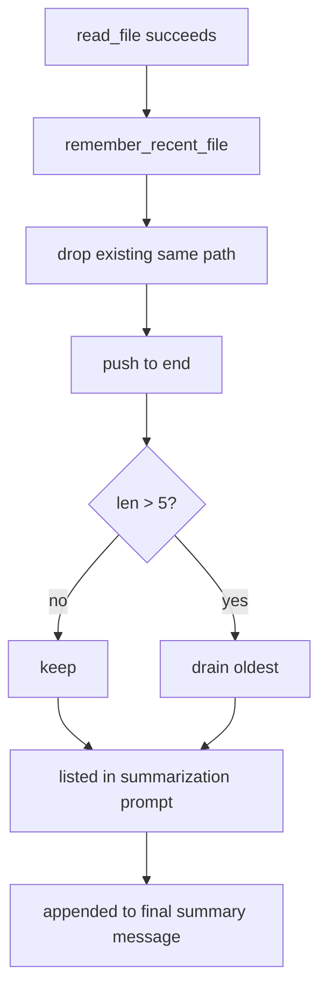

`remember_recent_file` is fed only by successful final tool results for `read_file`, `batch_read`, `write_file`, `edit_file`, and non-dry-run `apply_patch`. It keeps the last five deduplicated paths as “amnesia insurance.”

### Before / After Comparison

The most visible effect of `compact_history` is removing assistant/tool history while preserving recent real user turns and appending one handoff summary. Let’s walk through a concrete example.

#### Before: `self.runtime.context` (`Vec<Message>`)

The full conversation grows with the task — a mix of roles and content:

```text
[0] User      "Add an early 80% trigger to the compact module"
[1] Assistant  reasoning + tool_use(read_file compact/mod.rs)
[2] User       ToolResult(full compact/mod.rs, ~5k chars)
[3] Assistant  tool_use(read_file agent/mod.rs)
[4] User       ToolResult(mod.rs excerpt, ~8k chars)
[5] Assistant  tool_use(bash cargo test)
[6] User       ToolResult(test log, ~40k chars)
[7] Assistant  tool_use(edit_file compact/mod.rs)
[8] User       ToolResult("edit applied")
 …             (dozens of entries, potentially hundreds of thousands
                of chars / approaching the window)
[N] Assistant  "Threshold updated, moving on to tests"
```

Characteristics: complete `tool_use` / `ToolResult` pairs, per-step reasoning, and intermediate artifacts are all retained — which is exactly where the bulk comes from.

#### After: `self.runtime.context`

Recent real user turns remain within budget, followed by the handoff summary:

```text
[0] User  "Add an early 80% trigger to the compact module"
[1] User  "This conversation was compacted so the agent can continue working.

           <LLM summary, organized around the 6 points:>
           1. Current goal: add an early 80% trigger to the compact module
           2. Key finding: should_auto_compact uses reported and estimated tokens
           3. Files involved: crates/tact/src/compact/mod.rs (should_auto_compact),
              crates/tact/src/agent/mod.rs (compact_history)
           4. Remaining work: add unit tests, run cargo test
           5. User preference: add TODOs first, optimize later
           6. Errors: none so far

           Recently accessed files (re-read if you need their contents):
           - crates/tact/src/compact/mod.rs
           - crates/tact/src/agent/mod.rs"
```

Every `tool_use` / `ToolResult` / reasoning block from `[1]`–`[N]` is **no longer in the window** — it survives in only two places: the `transcript_<ts>.jsonl` written before compaction, and whatever the model chose to keep in this summary.

#### Item-by-Item Changes

| Dimension | Before | After |
|-----------|--------|-------|
| Message count | N messages | Recent real users + **1 summary** |
| Role structure | User / Assistant / ToolResult interleaved | **User** turns only |
| `tool_use` / `ToolResult` | Fully retained | **All dropped** (disk transcript only) |
| Reasoning / thinking | Retained | Dropped (summarizer produces no thinking) |
| Size | Up to hundreds of thousands of chars | Budgeted users + summary ≤ 2k output tokens + file list |
| Raw details | Directly readable | Recoverable via `recent_files` hints + `read_file` |
| Disk transcript | — | `.tact/transcripts/transcript_<ts>.jsonl` |

#### Runtime Fields Reset Alongside

Besides `context` itself, `compact_history` also resets the message-id window and flips the compaction state:

| Field | Before | After |
|-------|--------|-------|
| `first_message_db_id` | some value > 0 | `0` |
| `last_message_db_id` | some value > 0 | `0` |
| `llm_call_last_message_id` | some value > 0 | `0` |
| `last_token_total` | pre-compact / summarizer usage | `0` (rewritten on next main-loop call) |
| `compact_state.has_compacted` | possibly `false` | `true` |
| `compact_state.last_summary` | old value / `None` | this summary text |
| `stats.compactions` | `k` | `k + 1` |

SQLite stays in sync: `replace_persisted_context` rewrites the `messages` table with the rebuilt context, guaranteeing that **reopening the session cannot resurrect** pre-compaction rows.

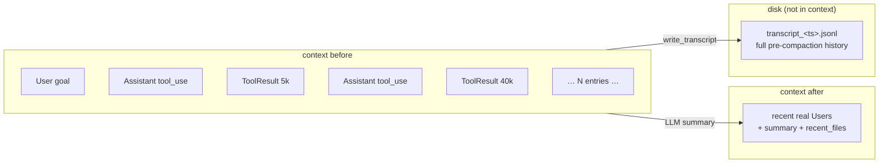

**In one sentence:** after compaction the model sees recent user intent plus a **handover memo it wrote itself** and a file list; assistant/tool detail retreats to disk.

---

## 6. Manual Compaction: the `compact` Tool

The model can request compaction via `compact` (`crates/tact/src/tool/compact.rs`).

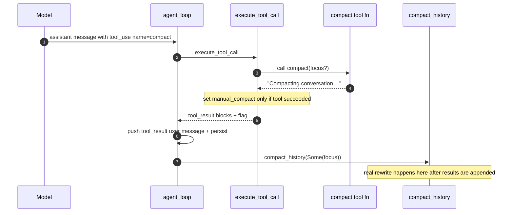

Why the tool body is nearly a no-op: rewriting `runtime.context` **inside** a tool call would leave the conversation mid-flight (assistant `tool_use` without matching results, or a half-applied summary). The dispatcher pattern keeps the wire protocol valid, then runs Level 3 afterward. Optional `focus` steers what the summarizer must keep.

The dispatcher sets `manual_compact = Some(focus)` only when the compact invocation **succeeded** — rejected calls (bad arguments, hook blocks, etc.) must not rewrite history so the model can recover next turn. A string `focus` is copied into the flag; a missing or non-string `focus` becomes `Some("")`. That empty value still means “perform manual compaction,” but it supplies no extra instruction and is ignored by `compact_history`. `None` means that this tool was not requested or failed. In the normal sequence, the tool result is first appended and persisted, then `compact_history(Some(focus))` performs the actual rewrite.

---

## 7. Large Output Spill (`persist_large_output`)

Independent of history compaction, a **single** oversized tool result must not enter the context at full size. Dispatch applies this to every successful native and MCP call:

```rust
persist_large_output(&tact_path, tool_use_id, &output)
```

| Constant | Value |
|----------|-------|
| `PERSIST_THRESHOLD` | 30,000 chars |
| `PREVIEW_CHARS` | 2,000 chars |

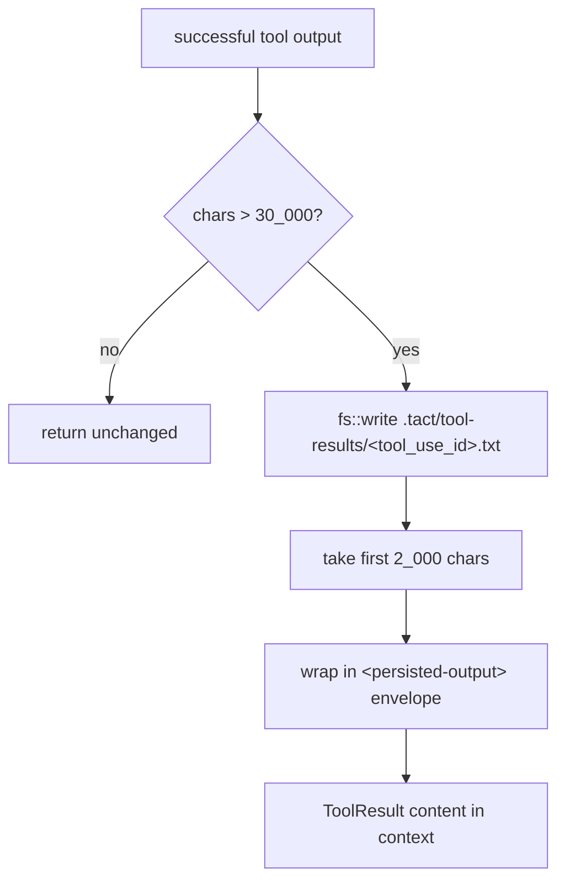

Replacement shape:

```xml
<persisted-output>
Full output saved to: .tact/tool-results/<tool_use_id>.txt
Preview:
[first 2000 characters…]
</persisted-output>
```

Persistence failure changes the tool step to failed instead of reporting a successful result whose full output was lost.

### Why `<persisted-output>` tags

The tags are **for the model, not for runtime parsing** — nothing in the codebase matches them back out. They mark the whole block as a **system-generated envelope**, so the LLM can tell:

- “Full output saved to …” / “Preview:” are framework metadata, not tool output
- this turn’s result was intentionally spilled (not silent truncation)
- full text is recoverable via `read_file` on the path

Without the wrapper, those lines blend into ordinary tool-result text. Same lightweight XML-ish convention as other prompt markers (e.g. `<skill>`).

### Stub vs envelope

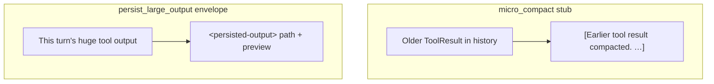

| Marker | When | Meaning |
|--------|------|---------|
| `[Earlier tool result compacted. …]` | Level 2, old history | Body gone from context; re-read / re-run |
| `<persisted-output>…</persisted-output>` | Level 1, this turn | Full body on disk; preview + path in context |

---

## 8. On-Disk Layout

Compaction spills two kinds of artifacts under the workdir (via `TactPath`):

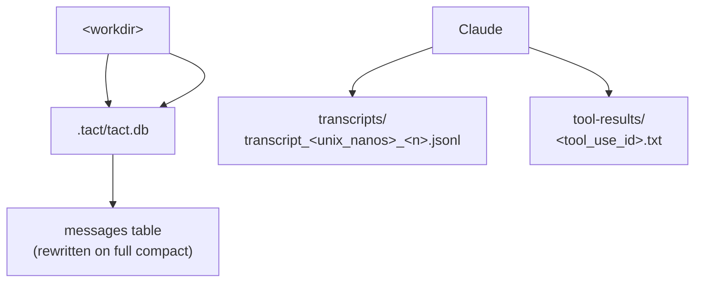

| Path | Writer | Contents |
|------|--------|----------|
| `.tact/transcripts/transcript_<ts>.jsonl` | `write_transcript` | Full pre-compact conversation |
| `.tact/tool-results/<id>.txt` | `persist_large_output` | Full oversized native/MCP output |
| `.tact/tact.db` messages | `replace_session_messages` | Post-compact retained-users + summary context |

After each write, each spill directory keeps at most the 100 newest files; older regular files are removed by modification time.

---

## 9. Configuration

| Setting | Default | Effect |
|---------|---------|--------|
| `agent.model_context_window` (`--model-context-window`) | 200,000 | Token window: auto-compact at 80% + TUI usage meter; when nonzero it must exceed `max_tokens` |
| `agent.micro_compact_enabled` (`--no-micro-compact`) | `true` | Enables the per-turn stub pass |

Resolved through layered config in `crates/tact/src/config/` (CLI > TOML > default). Compile-time constants (`KEEP_RECENT_TOOL_RESULTS`, `PERSIST_THRESHOLD`, …) are **not** configurable yet.

---

## 10. Code Map

| File | Role |
|------|------|
| `crates/tact/src/compact/mod.rs` | `micro_compact`, `should_auto_compact`, `estimate_context_tokens`, `collect_user_messages`, `build_compacted_history`, `write_transcript`, `persist_large_output`, `compacted_context`, `CompactState` |
| `crates/tact/src/agent/mod.rs` | Loop triggers; `compact_history` / `compact_history_legacy`; `remember_recent_file`; `replace_persisted_context` |
| `crates/tact/src/agent/tool_dispatch.rs` | `persist_large_output` for native/MCP results; `manual_compact` flag; recent-file tracking |
| `crates/tact/src/tool/compact.rs` | `compact` tool stub + `focus` |
| `crates/tact/src/recovery.rs` | Prompt-too-long classification → compaction |
| `crates/tact/src/consts.rs` | `transcript_dir()`, `tool_results_dir()` |
| `docs/compaction.md` | Behavior / tuning companion |

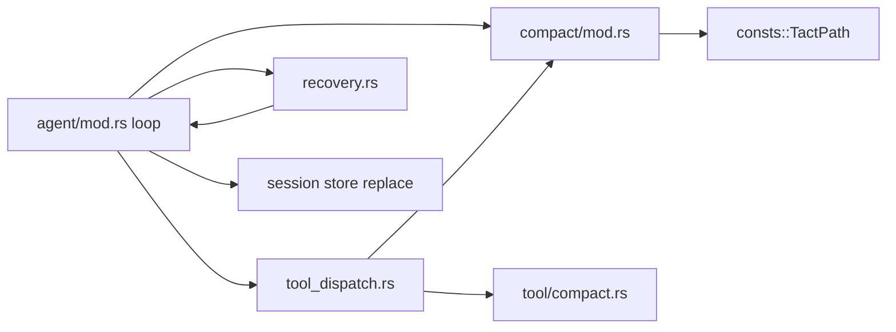

---

## 11. Current Gaps

| Gap | Detail |
|-----|--------|
| Cold-start / post-tool token estimate | ASCII uses ~4 chars/token and non-ASCII uses a conservative 1 char/token. Still OR'd with reported token total to cover growth after tool results are appended |
| Simple usage % | Meter is `used / model_context_window` (no Codex 12K baseline / effective-window math yet) |
| Only recent 20k estimated tokens summarized | Early turns live in transcript; model is not told that path in the replacement message |
| Fixed stub thresholds | 12 / 120 / 30k are compile-time constants |

---

## Related Docs

- [Error Recovery](./06_chapter_recovery.md) — compaction as the prompt-too-long strategy
- [Agent Main Loop](./18_chapter_agent_loop.md) — full loop structure around these hooks
- [System Prompt](./04_chapter_prompt.md) — rebuilt every turn; includes compacted-tool guidance
- [Store and Persistence](./01_chapter_store.md) — session message rewrite after compact
- [Tasks and Tool Scheduling](./11_chapter_task.md) — where `manual_compact` is detected in dispatch
- [docs/compaction.md](../docs/compaction.md) — tuning notes
- [ARCHITECTURE.md](../ARCHITECTURE.md) — §6 context compaction
