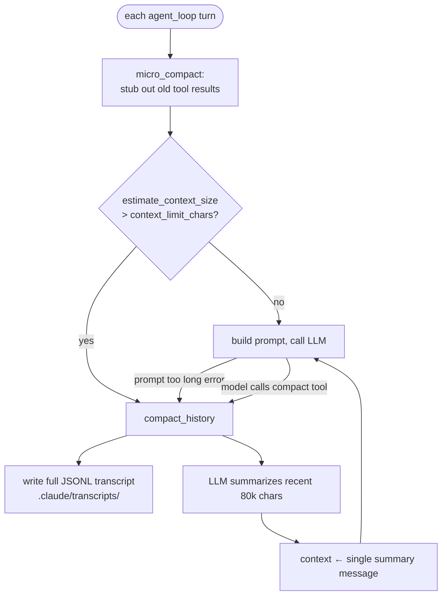

# Context Compaction

This chapter explains how Tact keeps a long-running conversation **inside the model's context window**: cheap in-place truncation every turn (`micro_compact`), full LLM-generated summarization when the limit is reached (`compact_history`), and disk spill for both transcripts and oversized tool outputs. The primitives live in `crates/tact/src/compact.rs`; the orchestration lives in `Agent::compact_history` in `crates/tact/src/agent/mod.rs`.

Compaction is also a **recovery strategy**: when the provider rejects a request as too long, the agent compacts and retries. See [Error Recovery](./12_chapter_recovery.md).

---

## 1. Three Levels of Defense

| Level | Mechanism | Cost | When |
|-------|-----------|------|------|
| 1 | `persist_large_output` | Free | Every `bash` tool result > 30,000 chars |
| 2 | `micro_compact` | Free | Start of every LLM turn |
| 3 | `compact_history` | One extra LLM call | Context estimate exceeds limit, prompt-too-long error, or manual `compact` tool |



---

## 2. Micro-Compaction

`micro_compact(messages)` runs at the top of every turn (skippable via config, see §6). It finds all `ToolResult` blocks in user messages, keeps the most recent ones intact, and stubs out older large ones:

```rust
const KEEP_RECENT_TOOL_RESULTS: usize = 12;
```

An old tool result is replaced only if it exceeds **120 characters** — short results survive because stubbing them would save nothing. The stub tells the model how to recover:

```text
[Earlier tool result compacted. If you need the full content to continue editing, re-read the relevant file.]
```

Only tool results are touched; user text, assistant text, and thinking blocks are never truncated by this pass.

---

## 3. Size Estimation and the Trigger

Context size is estimated by serializing the message list to JSON and counting **characters** (not tokens):

```rust
pub fn estimate_context_size(messages: &[Message]) -> usize
```

The threshold is `agent.context_limit_chars` (default **500,000**; Kimi K2X providers get a different default in `config/resolve.rs`). Characters are a coarse proxy for tokens — the safety margin is the point, not precision.

---

## 4. Full Compaction: compact_history

`Agent::compact_history(focus)` performs, in order:

1. **Transcript spill** — `write_transcript` serializes the entire context to `.claude/transcripts/transcript_<unix_ts>.jsonl`, one message per line. The path is announced in the TUI (`[transcript saved: …]`). Nothing is lost, just moved out of context.
2. **Recent-window selection** — messages are taken from the **end** of the context until ~80,000 serialized chars, since recent context matters most for continuing work. Earlier messages are represented only by whatever the summary can infer.
3. **Summarization call** — a fresh `create_message` request (max 2,000 tokens, no thinking) asks the model to preserve: the current goal, findings and decisions, files touched with key signatures, remaining work, user constraints, and errors encountered. An optional `focus` string (from the manual `compact` tool) is appended, as is the recent-files list.
4. **Context replacement** — the whole context becomes a single user message via `compacted_context(summary)`:

```text
This conversation was compacted so the agent can continue working.

<summary…>

Recently accessed files (re-read if you need their contents):
- crates/tact/src/agent/mod.rs
- …
```

5. **Bookkeeping** — `CompactState.has_compacted` / `last_summary` are updated, `stats.compactions` increments, and the session-store message-id window is reset (post-compaction messages start a new range in SQLite).

### CompactState and recent files

```rust
pub struct CompactState {
    pub has_compacted: bool,
    pub last_summary: Option<String>,
    pub recent_files: Vec<String>,   // last 5 read_file paths, deduped, LRU
}
```

`remember_recent_file` is fed by the tool dispatcher every time `read_file` succeeds — this is the "amnesia insurance" that lets the agent re-open what it was working on after its history vanishes.

---

## 5. Manual Compaction: the compact Tool

The model can request compaction itself via the `compact` tool (`crates/tact/src/tool/compact.rs`). The tool body is nearly a no-op — it returns `"Compacting conversation…"` — because the real work cannot happen *inside* a tool call (the context must remain API-valid until tool results are appended). Instead the dispatcher spots the tool by name:

```rust
if prep_name == "compact" {
    manual_compact = Some(input.focus.unwrap_or_default());
}
```

`execute_tool_call` returns this flag, and `agent_loop` runs `compact_history(Some(focus))` **after** persisting the tool results. The optional `focus` steers the summary ("Focus to preserve next: …").

---

## 6. Large Output Spill

Independent of history compaction, single oversized outputs never enter the context at full size. After a `bash` tool call, the dispatcher applies:

```rust
persist_large_output(&tact_path, tool_use_id, &output)
```

| Constant | Value |
|----------|-------|
| `PERSIST_THRESHOLD` | 30,000 chars |
| `PREVIEW_CHARS` | 2,000 chars |

Outputs over the threshold are written to `.claude/tool-results/<tool_use_id>.txt` and replaced with a `<persisted-output>` block containing the file path and a preview — the model can `read_file` the rest. Today this is applied **only to `bash`**; other verbose tools (e.g. `search_code`, MCP tools) return full output.

---

## 7. Configuration

| Setting | Default | Effect |
|---------|---------|--------|
| `agent.context_limit_chars` (`--context-limit-chars`) | 500,000 | Auto-compaction trigger threshold |
| `agent.micro_compact_enabled` (`--no-micro-compact` to disable) | `true` | Enables the per-turn stub pass |

Both are resolved through the layered config in `crates/tact/src/config/` (CLI flag > TOML > default).

---

## 8. Code Map

| File | Role |
|------|------|
| `crates/tact/src/compact.rs` | `micro_compact`, `estimate_context_size`, `write_transcript`, `persist_large_output`, `compacted_context`, `CompactState` |
| `crates/tact/src/agent/mod.rs` | Auto/error-triggered triggers; `compact_history` orchestration; `remember_recent_file` |
| `crates/tact/src/agent/tool_dispatch.rs` | `persist_large_output` on `bash`; `manual_compact` detection; recent-file tracking |
| `crates/tact/src/tool/compact.rs` | The `compact` tool stub |
| `crates/tact/src/recovery.rs` | Prompt-too-long classification that routes into compaction |
| `crates/tact/src/consts.rs` | `transcript_dir()`, `tool_results_dir()` |
| `docs/compaction.md` | Behavior and tuning notes |

---

## 9. Current Gaps

| Gap | Detail |
|-----|--------|
| Char-based estimation | 500k chars ≈ token budget only loosely; multibyte-heavy or code-dense contexts skew the ratio |
| Summarization is lossy and unguarded | The compaction LLM call has no retry ([Error Recovery](./12_chapter_recovery.md) does not cover it) and a poor summary silently degrades the session |
| Only the last ~80k chars are summarized | Early conversation survives only via the transcript file, which the model is not told about in the summary message |
| Spill limited to `bash` | Other tools and MCP results can still flood the context in one turn |
| Transcripts accumulate | `.claude/transcripts/` and `.claude/tool-results/` are never pruned |
| Stub threshold is fixed | 12 results / 120 chars / 30k persist threshold are compile-time constants |
| `recent_files` tracks reads only | Files created via `write_file` / `apply_patch` are not remembered for post-compaction recovery |

---

## Related Docs

- [Error Recovery](./12_chapter_recovery.md) — compaction as the prompt-too-long strategy
- [System Prompt](./02_chapter_prompt.md) — what is rebuilt (not compacted) every turn
- [Store and Persistence](./09_chapter_store.md) — session store message-id window reset
- [Tasks and Tool Scheduling](./03_chapter_task.md) — where `manual_compact` is detected in dispatch
- [docs/compaction.md](../docs/compaction.md) — tuning notes
- [ARCHITECTURE.md](../ARCHITECTURE.md) — §6 context compaction
