# Context Compaction

> Language: [English](./05_chapter_compact.md) · [中文](./05_chapter_compact_zh.md)

This chapter explains how Tact keeps a long-running conversation **inside the model's context window**: cheap in-place truncation every turn (`micro_compact`), full LLM-generated summarization when the limit is reached (`compact_history`), and disk spill for both transcripts and oversized tool outputs. The primitives live in `crates/tact/src/compact.rs`; the orchestration lives in `Agent::compact_history` in `crates/tact/src/agent/mod.rs`.

Compaction is also a **recovery strategy**: when the provider rejects a request as too long, the agent compacts and retries. See [Error Recovery](./06_chapter_recovery.md).

---

## 0. Why Compaction Exists

A coding agent accumulates messages every turn: user text, assistant reasoning, tool calls, and especially **tool results** (file contents, command logs, search hits). Context growth has three costs:

| Cost | Effect |
|------|--------|
| Hard limit | Provider returns prompt-too-long → turn fails without recovery |
| Soft cost | Longer prompts → slower TTFT, higher $ / tokens |
| Attention | Distant tool dumps dilute the signal the model needs *now* |

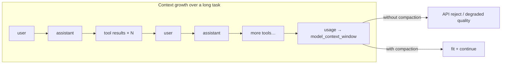

Tact’s answer is **progressive defense**: free local stubs first, then one paid summarization call only when needed, plus opportunistic spill of single huge outputs so they never enter the window at full size.

---

## 1. Three Levels of Defense

| Level | Mechanism | Cost | When | What is lost from *context* |
|-------|-----------|------|------|-----------------------------|
| 1 | `persist_large_output` | Free (disk I/O) | Every `bash` result > 30,000 chars | Full stdout (kept on disk + preview) |
| 2 | `micro_compact` | Free | Start of every LLM turn | Old tool-result bodies (stub left behind) |
| 3 | `compact_history` | One extra LLM call | Size over limit, prompt-too-long, or `compact` tool | Entire history (replaced by summary; full JSONL on disk) |

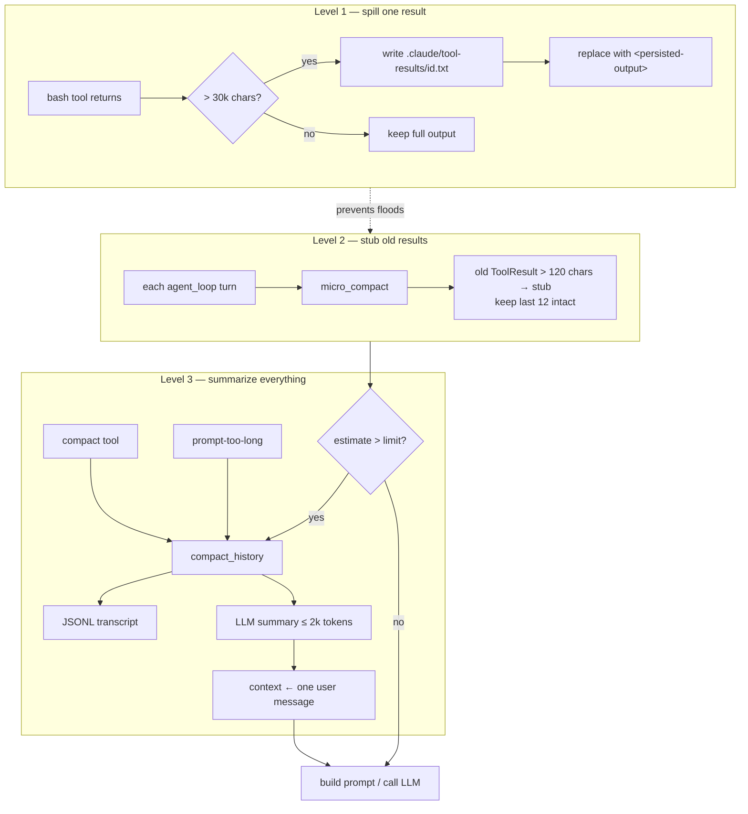

**Mental model:** Level 1 protects *this turn’s* stdout; Level 2 protects *history shape* without an LLM; Level 3 resets the conversation when even stubs are not enough.

---

## 2. Where Compaction Sits in the Agent Loop

Compaction is not a separate daemon — it is woven into `Agent::agent_loop`. Reading the loop top-to-bottom:

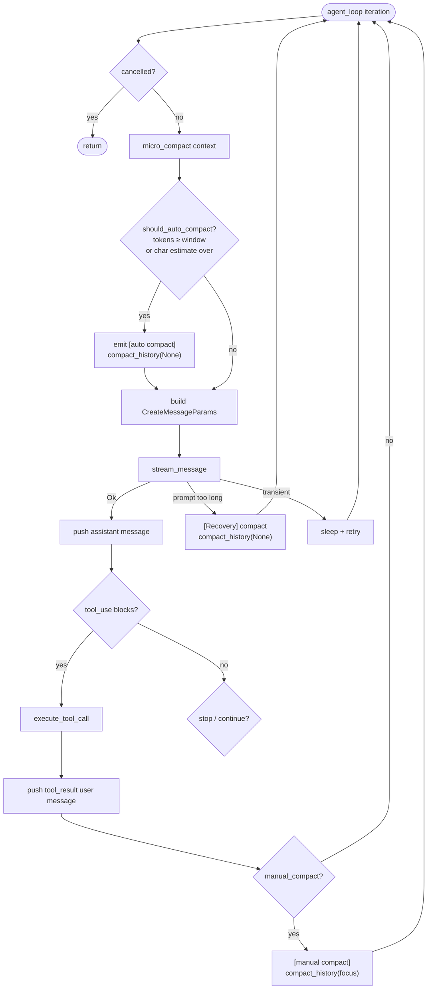

Key ordering facts:

1. **`micro_compact` always runs before the auto-compact check** — so auto-compact measures an *already-stubbed* context.
2. **Prompt-too-long recovery** runs `compact_history` then `continue`s the loop (same turn, new context). Cap: `MAX_RECOVERY_ATTEMPTS` (3). Details in [Error Recovery](./06_chapter_recovery.md).
3. **Manual `compact` tool** cannot rewrite context *inside* the tool handler (API validity). Dispatch records a flag; `compact_history` runs **after** tool results are appended.

---

## 3. Micro-Compaction

`micro_compact(messages, enabled)` runs at the top of every turn (disable via config, see §9). It only touches **user-role** messages that contain `ContentBlock::ToolResult`.

```rust
const KEEP_RECENT_TOOL_RESULTS: usize = 12;
const COMPACTED_TOOL_RESULT: &str =
    "[Earlier tool result compacted. If you need the full content to continue editing, re-read the relevant file.]";
```

### Algorithm

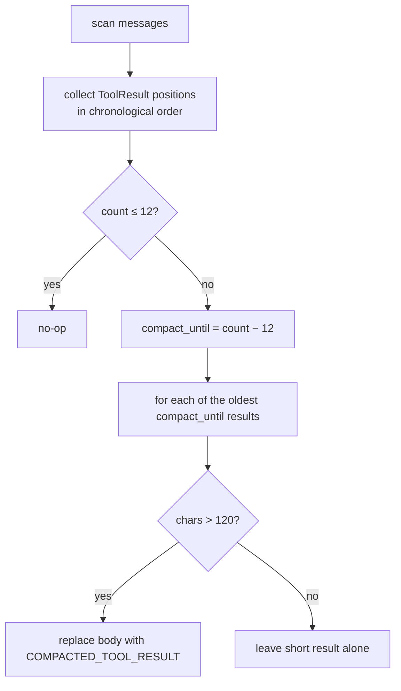

### Before / after (conceptual)

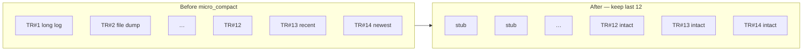

Rules of thumb encoded in the constants:

| Rule | Why |
|------|-----|
| Keep last **12** results | Current workflow usually needs recent tool I/O |
| Stub only if **> 120** chars | Short oks / errors are dense; stubbing saves nothing |
| Never touch assistant / thinking / user text | Only tool dumps are the bulk offenders |

The stub text is deliberate: it tells the model **how to recover** (`read_file` / re-run tools). The system prompt reinforces the same idea:

> If a tool result was compacted and you need the details, re-run the relevant tool (e.g., `read_file`)

---

## 4. Auto Trigger and Size Estimation

The shared threshold is **`agent.model_context_window`** — the model context window in **tokens** (default **200,000**). The same value drives auto-compaction and the TUI bottom-bar usage meter.

### Decision (OR)

`should_auto_compact` fires when **either** condition holds (optionally reserving an *incoming* user turn not yet in context):

```text
last_token_total > 0
  && last_token_total + approx_chars_as_tokens(incoming_turn_chars) >= model_context_window
  || estimated_chars + incoming_turn_chars > model_context_window
```

- **Entry (`agent_loop`)**: compact **old** history first with `incoming_turn_chars = estimate(user_turn)`, then `push` the turn verbatim.
- **Loop / recovery / manual**: turn already in context → `incoming_turn_chars = 0`.

Rebuild after summarize (Codex-style): **`[recent real User messages…] + [SUMMARY_PREFIX + handoff]`**, not a single summary-only message. Legacy single-summary path remains as `compact_history_legacy`.

```rust
pub fn estimate_context_size(messages: &[Message]) -> usize {
    serde_json::to_string(messages)
        .map(|serialized| serialized.chars().count())
        .unwrap_or_default()
}
```

```mermaid
flowchart TD
    MC[micro_compact] --> Tok{tokens (+ incoming) ≥ window?}
    Tok -->|yes| Auto[auto compact_history]
    Tok -->|no| Est["estimate + incoming chars<br/>> model_context_window?"]
    Est -->|yes| Auto
    Est -->|no| Call[LLM call]
```

| Setting | Default | Notes |
|---------|---------|-------|
| `agent.model_context_window` | **200,000** | Tokens; CLI `--model-context-window` / TOML. Breaking rename from `context_limit_chars` — **no silent alias**. |

After compaction, `last_token_total` is **reset to 0** (the summarizer call's usage reflects a large history prompt, not the replacement context size); the next main-loop LLM call writes a fresh value. See §11.

---

## 5. Full Compaction: `compact_history`

`Agent::compact_history(focus: Option<&str>)` is the expensive path. It never “deletes” work permanently: the pre-compact context is always written to a transcript first.

### End-to-end sequence

```mermaid
sequenceDiagram
    autonumber
    participant Loop as agent_loop
    participant CH as compact_history
    participant Disk as filesystem
    participant LLM as create_message
    participant Store as SessionStore

    Loop->>CH: compact_history(focus?)
    CH->>Disk: write_transcript → .claude/transcripts/transcript_&lt;ts&gt;.jsonl
    CH-->>Loop: Info "[transcript saved: …]"
    CH->>CH: take messages from end until ~80k serialized chars<br/>(keep ≥ 1 message)
    CH->>CH: build summarize prompt + optional focus + recent_files
    CH->>LLM: create_message (max_tokens=2000, no thinking)
    LLM-->>CH: text summary blocks
    CH->>CH: reset message-id window (first/last/llm_call ids = 0)
    CH->>CH: append "Recently accessed files…" to summary
    CH->>CH: context = build_compacted_history(users + summary)
    CH->>Store: replace_session_messages (SQLite matches new context)
    CH->>CH: stats.compactions += 1
```

### Step details

**1. Transcript spill** — `write_transcript` creates `.claude/transcripts/transcript_<unix_secs>.jsonl`, one JSON message per line. TUI shows `[transcript saved: …]`. Full history is recoverable offline; the model is **not** automatically pointed at this path in the summary message (gap in §11).

**2. Recent-window selection** — walk `context` **from the end**, accumulate until ~**80,000** serialized chars; always keep at least one message even if it alone exceeds the budget. Earlier turns survive only via transcript + whatever the summary can infer.

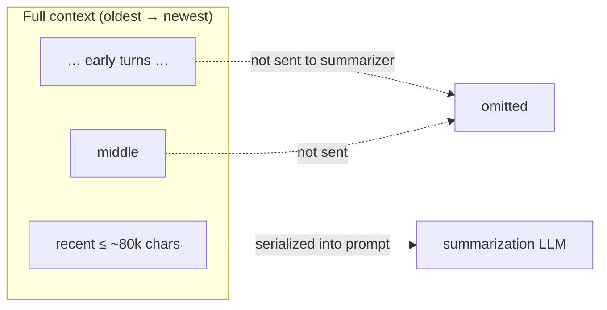

**3. Summarization call** — a fresh non-streaming `create_message` (max 2,000 tokens, no tools, no thinking) asks the model to preserve:

1. Current goal and accomplishments  
2. Findings, decisions, architectural insights  
3. Files read/changed (types, signatures, APIs when relevant)  
4. Remaining work / next steps  
5. User constraints and preferences  
6. Errors and causes  

Optional appendages:

- `Focus to preserve next: {focus}` — from the manual `compact` tool  
- `Recent files to reopen if needed:` — from `CompactState.recent_files`

**4. Context replacement** — Codex-style rebuild via `build_compacted_history`:

```text
[0] User  "<earlier real user text…>"
[1] User  "<more recent real user text…>"
[2] User  "This conversation was compacted so the agent can continue working.

           <summary…>

           Recently accessed files (re-read if you need their contents):
           - crates/tact/src/agent/mod.rs
           - …"
```

(`compact_history_legacy` still replaces with a **single** summary user message.)

**5. Bookkeeping**

| Action | Why |
|--------|-----|
| `has_compacted = true`, store `last_summary` | Session knows compaction occurred |
| Reset `first_message_db_id` / `last_message_db_id` / `llm_call_last_message_id` | New message-id window after rewrite |
| `last_token_total = 0` | Summarizer usage is a large prompt, not the new context; avoids re-triggering compact every turn |
| `replace_session_messages` | Reopening the session must **not** resurrect pre-compaction SQLite rows |
| `stats.compactions += 1` | Observability |

### CompactState and recent files

```rust
pub struct CompactState {
    pub has_compacted: bool,
    pub last_summary: Option<String>,
    pub recent_files: Vec<String>,   // last 5 read_file paths, deduped, LRU
}
```

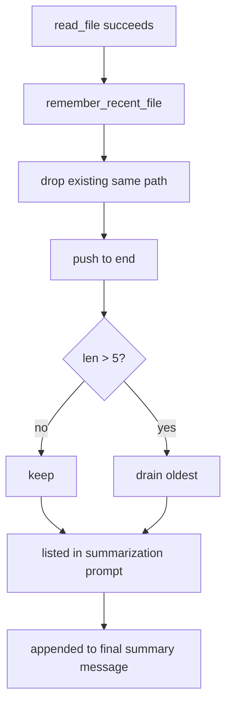

`remember_recent_file` is fed only from successful **`read_file`** in the tool dispatcher — “amnesia insurance” so the agent can re-open what it was looking at after history vanishes. Writes / patches are **not** tracked today (§11).

### Before / After Comparison

The most visible effect of `compact_history` is collapsing a **multi-role, multi-turn** message sequence into a **single user message**. Let’s walk through a concrete example.

#### Before: `self.runtime.context` (`Vec<Message>`)

The full conversation grows with the task — a mix of roles and content:

```text
[0] User      "Add an early 70% trigger to the compact module"
[1] Assistant  reasoning + tool_use(read_file compact.rs)
[2] User       ToolResult(full compact.rs, ~5k chars)
[3] Assistant  tool_use(read_file agent/mod.rs)
[4] User       ToolResult(mod.rs excerpt, ~8k chars)
[5] Assistant  tool_use(bash cargo test)
[6] User       ToolResult(test log, ~40k chars)
[7] Assistant  tool_use(edit_file compact.rs)
[8] User       ToolResult("edit applied")
 …             (dozens of entries, potentially hundreds of thousands
                of chars / approaching the window)
[N] Assistant  "Threshold updated, moving on to tests"
```

Characteristics: complete `tool_use` / `ToolResult` pairs, per-step reasoning, and intermediate artifacts are all retained — which is exactly where the bulk comes from.

#### After: `self.runtime.context`

Only **1 user message** remains (`compacted_context`, see `crates/tact/src/compact.rs`):

```text
[0] User  "This conversation was compacted so the agent can continue working.

           <LLM summary, organized around the 6 points:>
           1. Current goal: add an early 70% trigger to the compact module
           2. Key finding: should_auto_compact currently waits for tokens>=window
           3. Files involved: crates/tact/src/compact.rs (should_auto_compact),
              crates/tact/src/agent/mod.rs (compact_history)
           4. Remaining work: add unit tests, run cargo test
           5. User preference: add TODOs first, optimize later
           6. Errors: none so far

           Recently accessed files (re-read if you need their contents):
           - crates/tact/src/compact.rs
           - crates/tact/src/agent/mod.rs"
```

Every `tool_use` / `ToolResult` / reasoning block from `[1]`–`[N]` is **no longer in the window** — it survives in only two places: the `transcript_<ts>.jsonl` written before compaction, and whatever the model chose to keep in this summary.

#### Item-by-Item Changes

| Dimension | Before | After |
|-----------|--------|-------|
| Message count | N messages | **1 message** |
| Role structure | User / Assistant / ToolResult interleaved | Single **User** |
| `tool_use` / `ToolResult` | Fully retained | **All dropped** (disk transcript only) |
| Reasoning / thinking | Retained | Dropped (summarizer produces no thinking) |
| Size | Up to hundreds of thousands of chars | Summary ≤ 2k tokens + file list |
| Raw details | Directly readable | Recoverable via `recent_files` hints + `read_file` |
| Disk transcript | — | `.claude/transcripts/transcript_<ts>.jsonl` |

#### Runtime Fields Reset Alongside

Besides `context` itself, `compact_history` also resets the message-id window and flips the compaction state:

| Field | Before | After |
|-------|--------|-------|
| `first_message_db_id` | some value > 0 | `0` |
| `last_message_db_id` | some value > 0 | `0` |
| `llm_call_last_message_id` | some value > 0 | `0` |
| `last_token_total` | pre-compact / summarizer usage | `0` (rewritten on next main-loop call) |
| `compact_state.has_compacted` | possibly `false` | `true` |
| `compact_state.last_summary` | old value / `None` | this summary text |
| `stats.compactions` | `k` | `k + 1` |

SQLite stays in sync: `replace_persisted_context` rewrites the `messages` table with this single message, guaranteeing that **reopening the session cannot resurrect** pre-compaction rows.

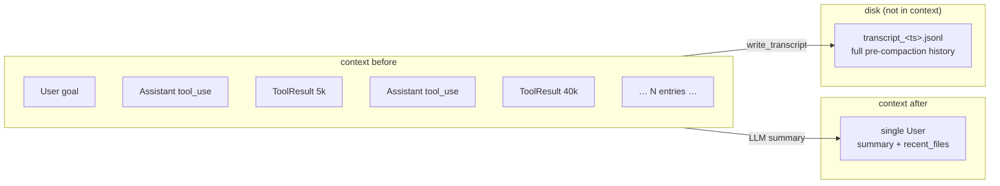

**In one sentence:** after compaction the model no longer sees a “conversation” — it sees a **handover memo it wrote itself**, plus a “re-read it yourself if you need it” file list; the full history retreats to disk.

---

## 6. Manual Compaction: the `compact` Tool

The model can request compaction via `compact` (`crates/tact/src/tool/compact.rs`).

```mermaid
sequenceDiagram
    autonumber
    participant Model
    participant Loop as agent_loop
    participant Dispatch as execute_tool_call
    participant Tool as compact tool fn
    participant CH as compact_history

    Model->>Loop: assistant message with tool_use name=compact
    Loop->>Dispatch: execute_tool_call
    Dispatch->>Tool: call compact(focus?)
    Tool-->>Dispatch: "Compacting conversation…"
    Note over Dispatch: set manual_compact = Some(focus)
    Dispatch-->>Loop: tool_result blocks + flag
    Loop->>Loop: push tool_result user message + persist
    Loop->>CH: compact_history(Some(focus))
    Note over CH: real rewrite happens here<br/>(context stays API-valid until results are appended)
```

Why the tool body is nearly a no-op: rewriting `runtime.context` **inside** a tool call would leave the conversation mid-flight (assistant `tool_use` without matching results, or a half-applied summary). The dispatcher pattern keeps the wire protocol valid, then runs Level 3 afterward. Optional `focus` steers what the summarizer must keep.

---

## 7. Large Output Spill (`persist_large_output`)

Independent of history compaction, a **single** oversized tool result must not enter the context at full size. After a native `bash` call, dispatch applies:

```rust
persist_large_output(&tact_path, tool_use_id, &output)
```

| Constant | Value |
|----------|-------|
| `PERSIST_THRESHOLD` | 30,000 chars |
| `PREVIEW_CHARS` | 2,000 chars |

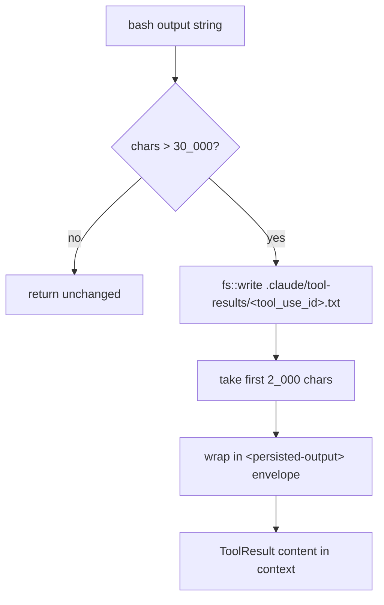

Replacement shape:

```xml
<persisted-output>
Full output saved to: .claude/tool-results/<tool_use_id>.txt
Preview:
[first 2000 characters…]
</persisted-output>
```

Today this path is applied **only to `bash`**. Other verbose tools (`search_code`, MCP, …) still return full output and can flood a turn (§11).

### Why `<persisted-output>` tags

The tags are **for the model, not for runtime parsing** — nothing in the codebase matches them back out. They mark the whole block as a **system-generated envelope**, so the LLM can tell:

- “Full output saved to …” / “Preview:” are framework metadata, not bash stdout
- this turn’s result was intentionally spilled (not silent truncation)
- full text is recoverable via `read_file` on the path

Without the wrapper, those lines blend into ordinary tool-result text. Same lightweight XML-ish convention as other prompt markers (e.g. `<skill>`).

### Stub vs envelope

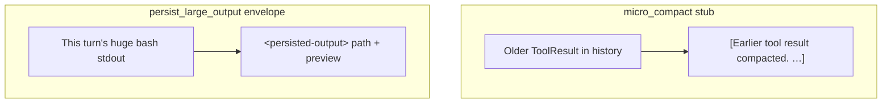

| Marker | When | Meaning |
|--------|------|---------|
| `[Earlier tool result compacted. …]` | Level 2, old history | Body gone from context; re-read / re-run |
| `<persisted-output>…</persisted-output>` | Level 1, this turn | Full body on disk; preview + path in context |

---

## 8. On-Disk Layout

Compaction spills two kinds of artifacts under the workdir (via `TactPath`):

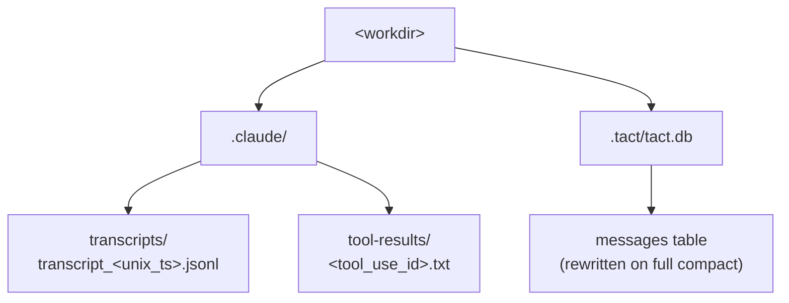

| Path | Writer | Contents |
|------|--------|----------|
| `.claude/transcripts/transcript_<ts>.jsonl` | `write_transcript` | Full pre-compact conversation |
| `.claude/tool-results/<id>.txt` | `persist_large_output` | Full oversized bash stdout |
| `.tact/tact.db` messages | `replace_session_messages` | Post-compact single-message context |

Neither spill directory is pruned automatically (§11).

---

## 9. Configuration

| Setting | Default | Effect |
|---------|---------|--------|
| `agent.model_context_window` (`--model-context-window`) | 200,000 | Token window: auto-compact trigger + TUI usage meter |
| `agent.micro_compact_enabled` (`--no-micro-compact`) | `true` | Enables the per-turn stub pass |

Resolved through layered config in `crates/tact/src/config/` (CLI > TOML > default). Compile-time constants (`KEEP_RECENT_TOOL_RESULTS`, `PERSIST_THRESHOLD`, …) are **not** configurable yet.

---

## 10. Code Map

| File | Role |
|------|------|
| `crates/tact/src/compact.rs` | `micro_compact`, `should_auto_compact`, `estimate_context_size`, `collect_user_messages`, `build_compacted_history`, `write_transcript`, `persist_large_output`, `compacted_context`, `CompactState` |
| `crates/tact/src/agent/mod.rs` | Loop triggers; `compact_history` / `compact_history_legacy`; `remember_recent_file`; `replace_persisted_context` |
| `crates/tact/src/agent/tool_dispatch.rs` | `persist_large_output` on `bash`; `manual_compact` flag; recent-file tracking |
| `crates/tact/src/tool/compact.rs` | `compact` tool stub + `focus` |
| `crates/tact/src/recovery.rs` | Prompt-too-long classification → compaction |
| `crates/tact/src/consts.rs` | `transcript_dir()`, `tool_results_dir()` |
| `docs/compaction.md` | Behavior / tuning companion |

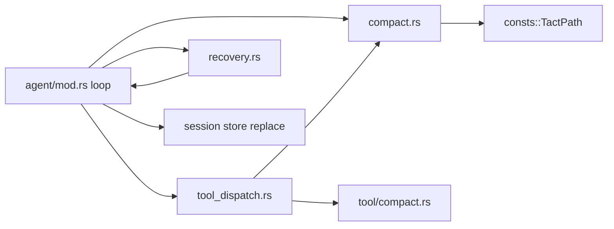

---

## 11. Current Gaps

| Gap | Detail |
|-----|--------|
| Cold-start / post-tool char estimate | Char estimate vs **token** window (coarse; TODO replace with pre-call token estimate). Still OR'd with token total when usage exists, to cover growth after tool results are appended |
| Simple usage % | Meter is `used / model_context_window` (no Codex 12K baseline / effective-window math yet) |
| Summarization unguarded | Compaction LLM call has no retry; bad summary silently degrades the session |
| Only last ~80k summarized | Early turns live in transcript; model is not told that path in the replacement message |
| Spill limited to `bash` | Other tools / MCP can still flood one turn |
| Spills accumulate | `.claude/transcripts/` and `tool-results/` never pruned |
| Fixed stub thresholds | 12 / 120 / 30k are compile-time constants |
| `recent_files` = reads only | `write_file` / `apply_patch` paths are not remembered |

---

## Related Docs

- [Error Recovery](./06_chapter_recovery.md) — compaction as the prompt-too-long strategy
- [Agent Main Loop](./18_chapter_agent_loop.md) — full loop structure around these hooks
- [System Prompt](./04_chapter_prompt.md) — rebuilt every turn; includes compacted-tool guidance
- [Store and Persistence](./01_chapter_store.md) — session message rewrite after compact
- [Tasks and Tool Scheduling](./11_chapter_task.md) — where `manual_compact` is detected in dispatch
- [docs/compaction.md](../docs/compaction.md) — tuning notes
- [ARCHITECTURE.md](../ARCHITECTURE.md) — §6 context compaction
