# 上下文压缩（Context Compaction）

> 语言：[中文](./05_chapter_compact_zh.md) · [English](./05_chapter_compact.md)

本章说明 Tact 如何把长时间对话**压进模型上下文窗口**：每轮廉价的原地截断（`micro_compact`）、触及上限时的 LLM 摘要（`compact_history`），以及 transcript / 超大工具输出的落盘溢出。原语在 `crates/tact/src/compact.rs`；编排在 `crates/tact/src/agent/mod.rs` 的 `Agent::compact_history`。

压缩也是一种**恢复策略**：当 provider 因 prompt 过长拒绝对话时，agent 会先压缩再重试。见 [错误恢复](./06_chapter_recovery.md)（英文）。

---

## 0. 为什么需要压缩

编码 agent 每一轮都会堆积消息：用户文本、助手推理、工具调用，尤其是**工具结果**（文件内容、命令日志、搜索命中）。上下文膨胀有三类代价：

| 代价 | 影响 |
|------|------|
| 硬限制 | Provider 返回 prompt-too-long → 若无恢复则本轮失败 |
| 软成本 | Prompt 更长 → TTFT 更慢、token 费用更高 |
| 注意力 | 远处的大段工具 dump 稀释模型「此刻」真正需要的信号 |

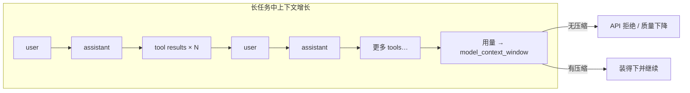

Tact 的答案是**渐进式防御**：先做免费的本地 stub，必要时再付一次摘要调用，并对单次超大输出做机会性落盘，避免其以全文进入窗口。

---

## 1. 三层防御

| 层级 | 机制 | 成本 | 时机 | 从*上下文*中失去什么 |
|------|------|------|------|----------------------|
| 1 | `persist_large_output` | 免费（磁盘 I/O） | 每次 `bash` 结果 > 30,000 字符 | 完整 stdout（磁盘保留 + 预览） |
| 2 | `micro_compact` | 免费 | 每个 LLM 回合开始 | 旧 tool-result 正文（留下 stub） |
| 3 | `compact_history` | 一次额外 LLM 调用 | 超限、prompt-too-long、或 `compact` 工具 | 整段历史（换成摘要；完整 JSONL 在磁盘） |

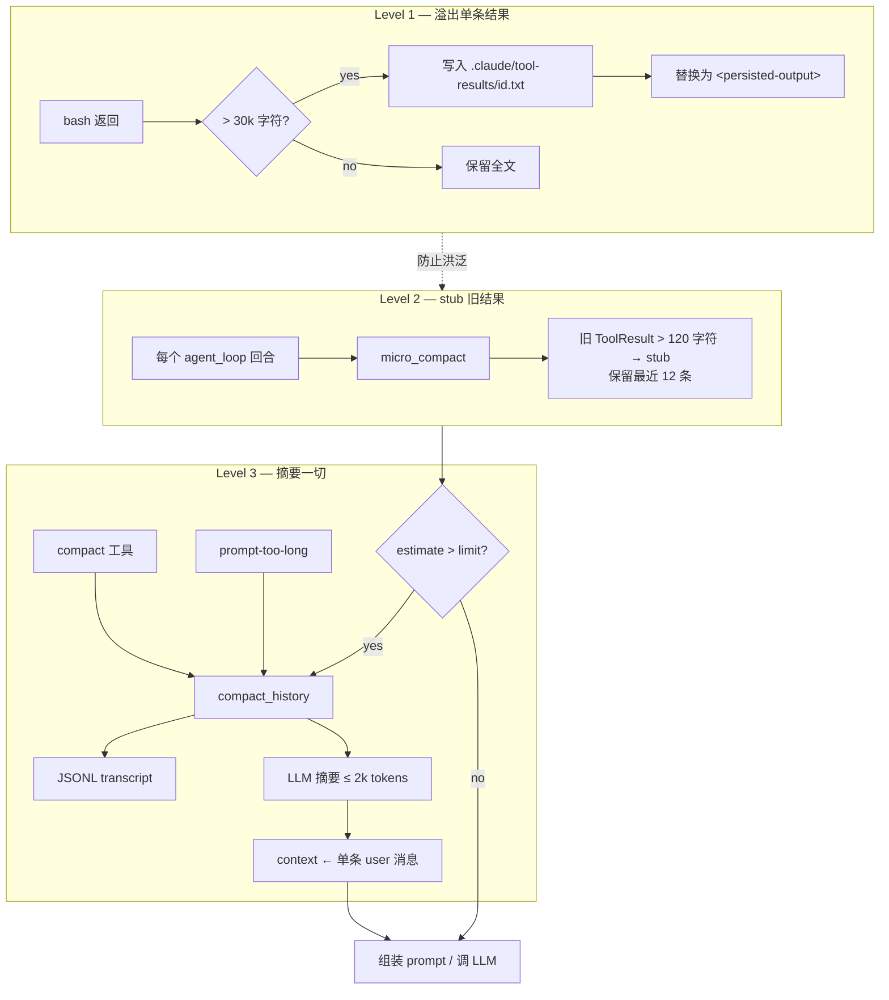

**心智模型：** Level 1 保护*本轮* stdout；Level 2 在不调 LLM 的情况下整理*历史形状*；Level 3 在 stub 仍不够时重置对话。

---

## 2. 压缩在 Agent Loop 中的位置

压缩不是独立守护进程，而是织进 `Agent::agent_loop`。自上而下阅读循环：

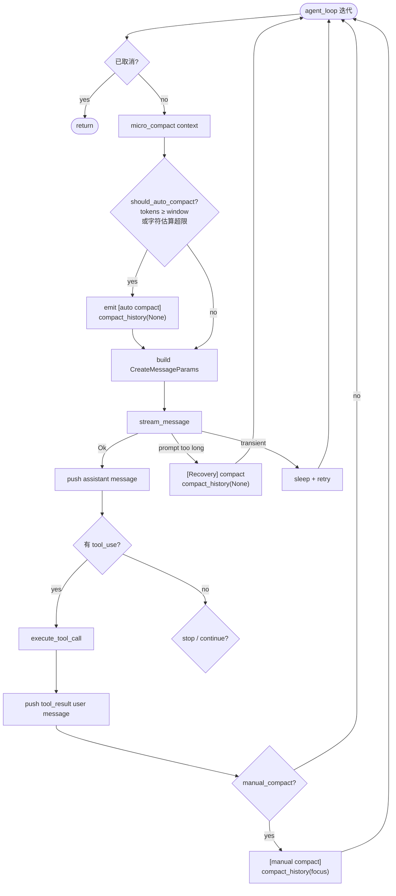

关键顺序：

1. **`micro_compact` 总是在自动压缩检查之前运行** — 因此 auto-compact 测量的是*已经 stub 过*的上下文。
2. **Prompt-too-long 恢复** 执行 `compact_history` 后 `continue` 循环（同一任务、新 context）。上限：`MAX_RECOVERY_ATTEMPTS`（3）。细节见 [错误恢复](./06_chapter_recovery.md)。
3. **手动 `compact` 工具** 不能在工具处理函数*内部*改写 context（API 有效性）。Dispatch 记录 flag；`compact_history` 在 tool results **追加之后**再跑。

---

## 3. 微压缩（Micro-Compaction）

`micro_compact(messages, enabled)` 在每轮顶部运行（可通过配置关闭，见 §9）。只触碰包含 `ContentBlock::ToolResult` 的 **user 角色**消息。

```rust
const KEEP_RECENT_TOOL_RESULTS: usize = 12;
const COMPACTED_TOOL_RESULT: &str =
    "[Earlier tool result compacted. If you need the full content to continue editing, re-read the relevant file.]";
```

### 算法

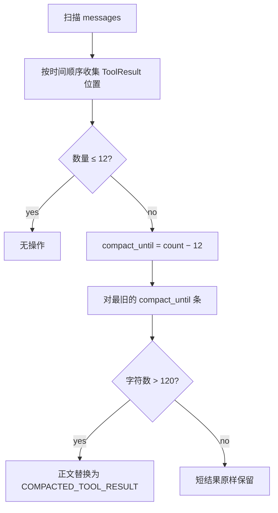

### 前后对比（示意）


常量背后的经验法则：

| 规则 | 原因 |
|------|------|
| 保留最近 **12** 条结果 | 当前工作流通常仍需要近期工具 I/O |
| 仅当 **> 120** 字符才 stub | 短 ok / 错误信息密度高，stub 省不了空间 |
| 从不碰 assistant / thinking / user 文本 | 体积杀手主要是工具 dump |

Stub 文案是刻意的：告诉模型**如何恢复**（`read_file` / 重跑工具）。系统提示里也有同样约定：

> If a tool result was compacted and you need the details, re-run the relevant tool (e.g., `read_file`)

---

## 4. 自动触发与体积估算

共享阈值是 **`agent.model_context_window`** — 模型上下文窗口，单位为 **tokens**（默认 **200,000**）。同一数值同时驱动自动压缩与 TUI 底栏用量条。

### 判定（OR）

`should_auto_compact` 在以下**任一**条件成立时触发（可预留尚未入 context 的本轮 user turn）：

```text
last_token_total > 0
  && last_token_total + approx_chars_as_tokens(incoming_turn_chars) >= model_context_window
  || estimated_chars + incoming_turn_chars > model_context_window
```

- **入口（`agent_loop`）**：先对**旧历史** compact（`incoming_turn_chars = estimate(user_turn)`），再 `push` 本轮原文。
- **循环内 / recovery / 手动**：本轮已在 context → `incoming_turn_chars = 0`。

摘要后重建（Codex 风格）：**`[近期真实 User…] + [SUMMARY_PREFIX + handoff]`**，不再是单条 summary。旧单消息路径保留为 `compact_history_legacy`。

```rust
pub fn estimate_context_size(messages: &[Message]) -> usize {
    serde_json::to_string(messages)
        .map(|serialized| serialized.chars().count())
        .unwrap_or_default()
}
```

```mermaid
flowchart TD
    MC[micro_compact] --> Tok{tokens (+ incoming) ≥ window?}
    Tok -->|yes| Auto[auto compact_history]
    Tok -->|no| Est["estimate + incoming 字符<br/>> model_context_window?"]
    Est -->|yes| Auto
    Est -->|no| Call[LLM 调用]
```

| 配置 | 默认 | 说明 |
|------|------|------|
| `agent.model_context_window` | **200,000** | Tokens；CLI `--model-context-window` / TOML。由 `context_limit_chars` **破坏性重命名** — **无静默别名**。 |

压缩完成后会把 `last_token_total` **清零**（摘要调用本身的 usage 是大 prompt，不能代表新 context 体积）；下一轮主循环 LLM 再写入新的用量。见 §11。

---

## 5. 完整压缩：`compact_history`

`Agent::compact_history(focus: Option<&str>)` 是昂贵路径。它从不永久「删除」工作：压缩前的 context 总会先写入 transcript。

### 端到端时序

```mermaid
sequenceDiagram
    autonumber
    participant Loop as agent_loop
    participant CH as compact_history
    participant Disk as filesystem
    participant LLM as create_message
    participant Store as SessionStore

    Loop->>CH: compact_history(focus?)
    CH->>Disk: write_transcript → .claude/transcripts/transcript_&lt;ts&gt;.jsonl
    CH-->>Loop: Info "[transcript saved: …]"
    CH->>CH: 从末尾取消息直到 ~80k 序列化字符<br/>（至少保留 1 条）
    CH->>CH: 组装摘要 prompt + 可选 focus + recent_files
    CH->>LLM: create_message (max_tokens=2000, 无 thinking)
    LLM-->>CH: text summary blocks
    CH->>CH: 重置 message-id 窗口 (first/last/llm_call ids = 0)
    CH->>CH: 向摘要追加 "Recently accessed files…"
    CH->>CH: context = build_compacted_history(users + summary)
    CH->>Store: replace_session_messages（SQLite 对齐新 context）
    CH->>CH: stats.compactions += 1
```

### 步骤说明

**1. Transcript 落盘** — `write_transcript` 创建 `.claude/transcripts/transcript_<unix_secs>.jsonl`，每行一条 JSON 消息。TUI 显示 `[transcript saved: …]`。完整历史可离线找回；摘要消息里**不会**自动告知模型该路径（§11 缺口）。

**2. 近期窗口选择** — 从 `context` **末尾**向前累加，直到约 **80,000** 序列化字符；即使单条就超预算也至少保留一条。更早回合只靠 transcript + 摘要能推断的内容存活。

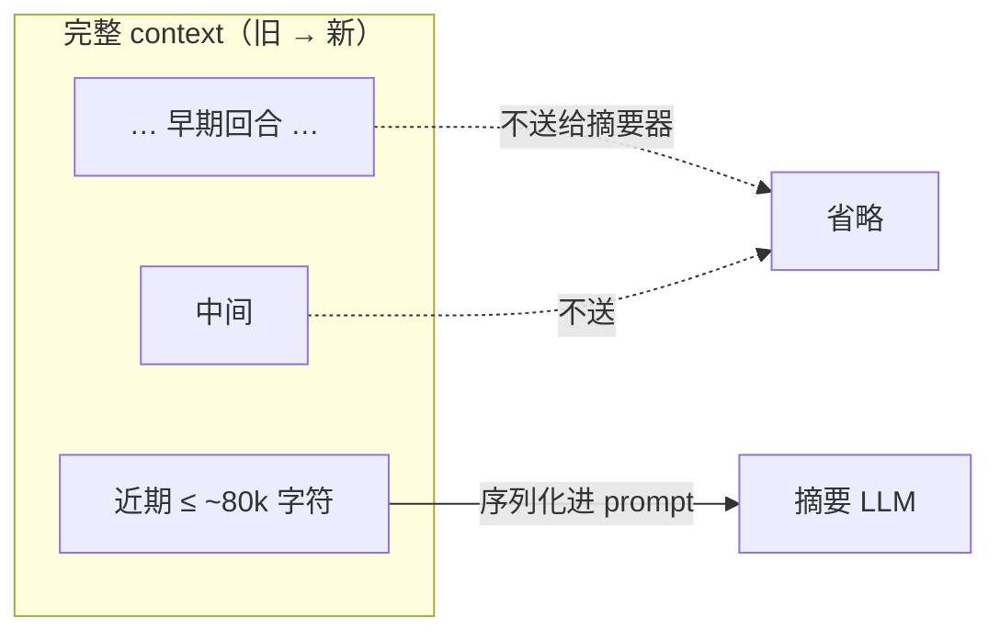

**3. 摘要调用** — 一次新的非流式 `create_message`（max 2,000 tokens，无 tools、无 thinking），要求模型保留：

1. 当前目标与已完成工作  
2. 关键发现、决策、架构洞见  
3. 读过/改过的文件（相关类型、签名、API）  
4. 剩余工作与下一步  
5. 用户约束与偏好  
6. 遇到的错误及原因  

可选附加：

- `Focus to preserve next: {focus}` — 来自手动 `compact` 工具  
- `Recent files to reopen if needed:` — 来自 `CompactState.recent_files`

**4. 替换 context** — Codex 风格，经 `build_compacted_history` 重建：

```text
[0] User  "<较早的真实 user 原文…>"
[1] User  "<较近的真实 user 原文…>"
[2] User  "This conversation was compacted so the agent can continue working.

           <summary…>

           Recently accessed files (re-read if you need their contents):
           - crates/tact/src/agent/mod.rs
           - …"
```

（`compact_history_legacy` 仍会整段换成**单条** summary user 消息。）

**5. 簿记**

| 动作 | 原因 |
|------|------|
| `has_compacted = true`，保存 `last_summary` | 会话知道已发生压缩 |
| 重置 `first_message_db_id` / `last_message_db_id` / `llm_call_last_message_id` | 重写后开启新的 message-id 窗口 |
| `last_token_total = 0` | 摘要调用的 usage 是大 prompt，不能代表新 context；避免下一轮误触发反复 compact |
| `replace_session_messages` | 重新打开会话**不得**复活压缩前的 SQLite 行 |
| `stats.compactions += 1` | 可观测性 |

### CompactState 与近期文件

```rust
pub struct CompactState {
    pub has_compacted: bool,
    pub last_summary: Option<String>,
    pub recent_files: Vec<String>,   // 最近 5 个 read_file 路径，去重，LRU
}
```

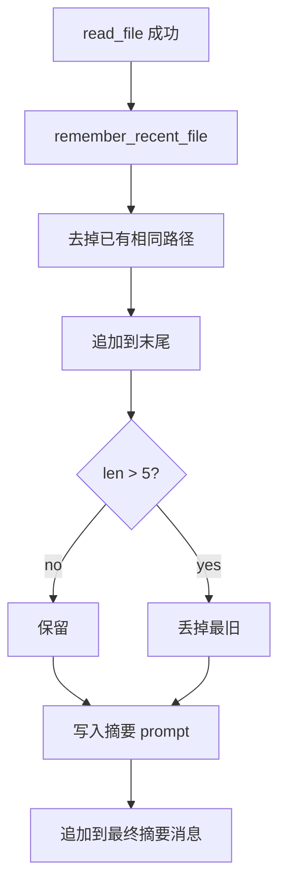

`remember_recent_file` 仅由工具调度里成功的 **`read_file`** 喂入 — 「失忆保险」，让历史消失后 agent 仍能重开刚看过的文件。写文件 / patch **目前不追踪**（§11）。

### 压缩前后对比

`compact_history` 最直观的效果，是把一条**多角色、多轮次**的消息序列，整体塌缩成**单条 user 消息**。下面用一个具体例子走一遍。

#### 压缩前：`self.runtime.context`（`Vec<Message>`）

随任务不断增长的完整对话，典型形态（角色 / 内容混合）：

```text
[0] User      "帮我给 compact 模块加个 70% 提前触发"
[1] Assistant  推理 + tool_use(read_file compact.rs)
[2] User       ToolResult(compact.rs 全文，~5k 字符)
[3] Assistant  tool_use(read_file agent/mod.rs)
[4] User       ToolResult(mod.rs 片段，~8k 字符)
[5] Assistant  tool_use(bash cargo test)
[6] User       ToolResult(测试日志，~40k 字符)
[7] Assistant  tool_use(edit_file compact.rs)
[8] User       ToolResult("edit applied")
 …             （几十条，累计可达数十万字符 / 逼近 window）
[N] Assistant  "阈值改好了，接着补测试"
```

特征：保留完整的 `tool_use` / `ToolResult` 配对、每一步的推理与中间产物；这也是体积的主要来源。

#### 压缩后：`self.runtime.context`

只剩 **1 条 user 消息**（`compacted_context`，见 `crates/tact/src/compact.rs`）：

```text
[0] User  "This conversation was compacted so the agent can continue working.

           <LLM 摘要，按 6 点组织：>
           1. 当前目标：给 compact 模块加 70% 提前触发
           2. 关键发现：should_auto_compact 现等 tokens>=window 才触发
           3. 涉及文件：crates/tact/src/compact.rs（should_auto_compact）、
              crates/tact/src/agent/mod.rs（compact_history）
           4. 剩余工作：补单元测试、跑 cargo test
           5. 用户偏好：先加 TODO，后续再优化
           6. 错误：暂无

           Recently accessed files (re-read if you need their contents):
           - crates/tact/src/compact.rs
           - crates/tact/src/agent/mod.rs"
```

原来 `[1]`–`[N]` 的所有 `tool_use` / `ToolResult` / 推理**都不在窗口里了**——它们只存在于两个地方：压缩前落盘的 `transcript_<ts>.jsonl`，以及模型自己写的这段摘要。

#### 逐项变化

| 维度 | 压缩前 | 压缩后 |
|------|--------|--------|
| 消息条数 | N 条 | **1 条** |
| 角色结构 | User / Assistant / ToolResult 交替 | 单条 **User** |
| `tool_use` / `ToolResult` | 完整保留 | **全部丢弃**（只在磁盘 transcript） |
| 推理 / thinking | 保留 | 丢弃（摘要器不产 thinking） |
| 体积 | 可达数十万字符 | 摘要 ≤ 2k tokens + 文件清单 |
| 原始细节 | 直接可读 | 靠 `recent_files` 提示重新 `read_file` 找回 |
| 落盘 transcript | — | `.claude/transcripts/transcript_<ts>.jsonl` |

#### 同时被重置的运行时字段

除了 `context` 本身，`compact_history` 还会顺带重置 message-id 窗口与置位压缩状态：

| 字段 | 压缩前 | 压缩后 |
|------|--------|--------|
| `first_message_db_id` | 某个 > 0 的值 | `0` |
| `last_message_db_id` | 某个 > 0 的值 | `0` |
| `llm_call_last_message_id` | 某个 > 0 的值 | `0` |
| `last_token_total` | 压缩前用量 / 摘要调用用量 | `0`（下一轮主循环再写入） |
| `compact_state.has_compacted` | 可能为 `false` | `true` |
| `compact_state.last_summary` | 旧值 / `None` | 本次摘要文本 |
| `stats.compactions` | `k` | `k + 1` |

SQLite 侧同步：`replace_persisted_context` 用这条单消息重写 `messages` 表，保证**重开会话不会复活**压缩前的行。

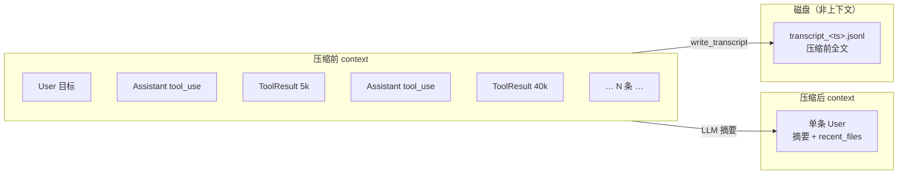

**一句话：** 压缩后模型看到的不再是「对话」，而是它自己写的一份**交接备忘录** + 一份「要用就自己重读」的文件清单；完整历史退居磁盘。

---

## 6. 手动压缩：`compact` 工具

模型可通过 `compact` 工具请求压缩（`crates/tact/src/tool/compact.rs`）。

```mermaid
sequenceDiagram
    autonumber
    participant Model
    participant Loop as agent_loop
    participant Dispatch as execute_tool_call
    participant Tool as compact tool fn
    participant CH as compact_history

    Model->>Loop: assistant message 含 tool_use name=compact
    Loop->>Dispatch: execute_tool_call
    Dispatch->>Tool: call compact(focus?)
    Tool-->>Dispatch: "Compacting conversation…"
    Note over Dispatch: set manual_compact = Some(focus)
    Dispatch-->>Loop: tool_result blocks + flag
    Loop->>Loop: push tool_result user message + persist
    Loop->>CH: compact_history(Some(focus))
    Note over CH: 真正改写发生在这里<br/>（结果追加前 context 保持 API 合法）
```

工具函数几乎是空操作的原因：在工具调用*内部*改写 `runtime.context` 会让对话卡在半空（assistant `tool_use` 没有匹配 result，或摘要只写了一半）。Dispatch 模式先保证线协议合法，再跑 Level 3。可选 `focus` 引导摘要器必须保留的内容。

---

## 7. 大输出溢出（`persist_large_output`）

与历史压缩无关：单条过大的工具结果不得以全文进入 context。原生 `bash` 调用后，dispatch 会应用：

```rust
persist_large_output(&tact_path, tool_use_id, &output)
```

| 常量 | 值 |
|------|-----|
| `PERSIST_THRESHOLD` | 30,000 字符 |
| `PREVIEW_CHARS` | 2,000 字符 |

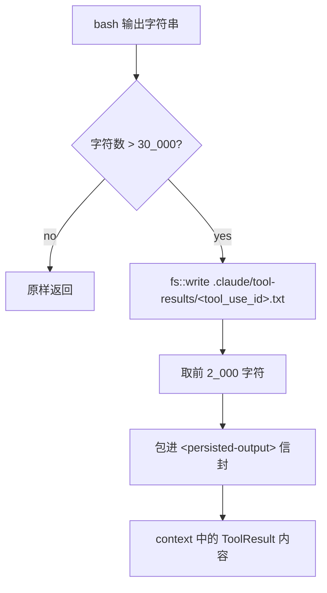

替换形态：

```xml
<persisted-output>
Full output saved to: .claude/tool-results/<tool_use_id>.txt
Preview:
[first 2000 characters…]
</persisted-output>
```

今天这条路径**只作用于 `bash`**。其它啰嗦工具（`search_code`、MCP …）仍返回全文，可能单轮洪泛（§11）。

### 为什么需要 `<persisted-output>` 标签

标签是**给模型看的，不是给运行时解析的** — 代码库里没有反向匹配它们。它们把整块标成**系统生成的信封**，让 LLM 能分辨：

- “Full output saved to …” / “Preview:” 是框架元数据，不是 bash stdout  
- 本轮结果是刻意落盘（不是静默截断垃圾）  
- 全文可通过路径上的 `read_file` 找回  

没有包裹时，这些行会混进普通 tool-result 文本。与其它 prompt 标记（如 `<skill>`）同一套轻量 XML 风格约定。

### Stub vs 信封

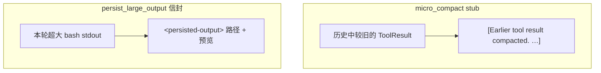

| 标记 | 时机 | 含义 |
|------|------|------|
| `[Earlier tool result compacted. …]` | Level 2，旧历史 | 正文离开 context；需重读 / 重跑 |
| `<persisted-output>…</persisted-output>` | Level 1，本轮 | 全文在磁盘；context 里是预览 + 路径 |

---

## 8. 磁盘布局

压缩通过 `TactPath` 在 workdir 下溢出两类产物：

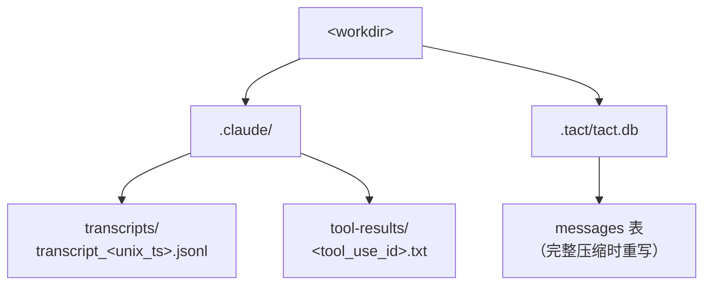

| 路径 | 写入方 | 内容 |
|------|--------|------|
| `.claude/transcripts/transcript_<ts>.jsonl` | `write_transcript` | 压缩前完整对话 |
| `.claude/tool-results/<id>.txt` | `persist_large_output` | 超大 bash stdout 全文 |
| `.tact/tact.db` messages | `replace_session_messages` | 压缩后的单消息 context |

两类溢出目录都**不会自动清理**（§11）。

---

## 9. 配置

| 设置 | 默认 | 作用 |
|------|------|------|
| `agent.model_context_window`（`--model-context-window`） | 200,000 | Token 窗口：自动压缩触发阈值 + TUI 用量条 |
| `agent.micro_compact_enabled`（`--no-micro-compact`） | `true` | 启用每轮 stub |

经 `crates/tact/src/config/` 分层解析（CLI > TOML > 默认）。编译期常量（`KEEP_RECENT_TOOL_RESULTS`、`PERSIST_THRESHOLD` …）**尚不可配置**。

---

## 10. 代码地图

| 文件 | 职责 |
|------|------|
| `crates/tact/src/compact.rs` | `micro_compact`、`should_auto_compact`、`estimate_context_size`、`collect_user_messages`、`build_compacted_history`、`write_transcript`、`persist_large_output`、`compacted_context`、`CompactState` |
| `crates/tact/src/agent/mod.rs` | 循环触发；`compact_history` / `compact_history_legacy`；`remember_recent_file`；`replace_persisted_context` |
| `crates/tact/src/agent/tool_dispatch.rs` | `bash` 上的 `persist_large_output`；`manual_compact` flag；近期文件追踪 |
| `crates/tact/src/tool/compact.rs` | `compact` 工具 stub + `focus` |
| `crates/tact/src/recovery.rs` | Prompt-too-long 分类 → 压缩 |
| `crates/tact/src/consts.rs` | `transcript_dir()`、`tool_results_dir()` |
| `docs/compaction.md` | 行为 / 调参速查 |

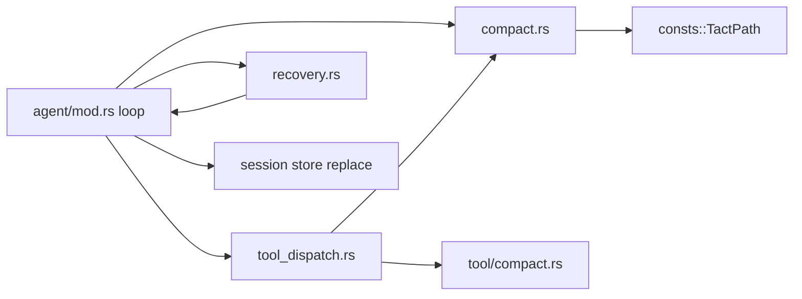

---

## 11. 当前缺口

| 缺口 | 细节 |
|------|------|
| 冷启动 / 工具后字符估算 | 字符估算对比 **token** 窗口（粗粒度；TODO 换调用前 token 估算）。有用量时仍 OR 字符估算，以覆盖 tool result 追加后的膨胀 |
| 简易用量百分比 | 用量条为 `used / model_context_window`（尚无 Codex 12K baseline / effective-window 算法） |
| 摘要无防护 | 压缩 LLM 调用无重试；烂摘要会静默拖垮会话 |
| 只摘要最近 ~80k | 早期回合在 transcript 里；替换消息未告知模型该路径 |
| 溢出仅限 `bash` | 其它工具 / MCP 仍可单轮洪泛 |
| 溢出物堆积 | `.claude/transcripts/` 与 `tool-results/` 永不清理 |
| Stub 阈值固定 | 12 / 120 / 30k 是编译期常量 |
| `recent_files` 仅读 | `write_file` / `apply_patch` 路径未被记住 |

---

## 相关文档

- [Error Recovery](./06_chapter_recovery.md) — 作为 prompt-too-long 策略的压缩  
- [Agent Main Loop](./18_chapter_agent_loop.md) — 这些挂钩周围的完整循环  
- [System Prompt](./04_chapter_prompt.md) — 每轮重建；含压缩工具指引  
- [Store and Persistence](./01_chapter_store.md) — 压缩后的会话消息重写  
- [Tasks and Tool Scheduling](./11_chapter_task.md) — dispatch 中检测 `manual_compact`  
- [docs/compaction.md](../docs/compaction.md) — 调参笔记  
- [ARCHITECTURE.md](../ARCHITECTURE.md) — §6 上下文压缩  
- [英文原文](./05_chapter_compact.md)
