# 上下文压缩（Context Compaction）

> 语言：[中文](./05_chapter_compact_zh.md) · [English](./05_chapter_compact.md)

本章说明 Tact 如何把长时间对话**压进模型上下文窗口**：每轮廉价的原地截断（`micro_compact`）、触及上限时的 LLM 摘要（`compact_history`），以及 transcript / 超大工具输出的落盘溢出。原语在 `crates/tact/src/compact/mod.rs`；编排在 `crates/tact/src/agent/mod.rs` 的 `Agent::compact_history`。

压缩也是一种**恢复策略**：当 provider 因 prompt 过长拒绝对话时，agent 会先压缩再重试。见 [错误恢复](./06_chapter_recovery.md)（英文）。

---

## 0. 为什么需要压缩

编码 agent 每一轮都会堆积消息：用户文本、助手推理、工具调用，尤其是**工具结果**（文件内容、命令日志、搜索命中）。上下文膨胀有三类代价：

| 代价 | 影响 |
|------|------|
| 硬限制 | Provider 返回 prompt-too-long → 若无恢复则本轮失败 |
| 软成本 | Prompt 更长 → TTFT 更慢、token 费用更高 |
| 注意力 | 远处的大段工具 dump 稀释模型「此刻」真正需要的信号 |

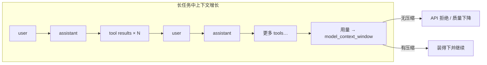

Tact 的答案是**渐进式防御**：先做免费的本地 stub，必要时再付一次摘要调用，并对单次超大输出做机会性落盘，避免其以全文进入窗口。

---

## 1. 三层防御

| 层级 | 机制 | 成本 | 时机 | 从*上下文*中失去什么 |
|------|------|------|------|----------------------|
| 1 | `persist_large_output` | 免费（磁盘 I/O） | 任意成功的原生或 MCP 结果 > 30,000 字符 | 完整输出（磁盘保留 + 预览） |
| 2 | `micro_compact` | 免费 | 每个 LLM 回合开始 | 旧 tool-result 正文（留下 stub） |
| 3 | `compact_history` | 一次额外 LLM 调用 | 80% 阈值、prompt-too-long、或 `compact` 工具 | Assistant/工具历史（保留近期真实 user + 摘要；完整 JSONL 在磁盘） |

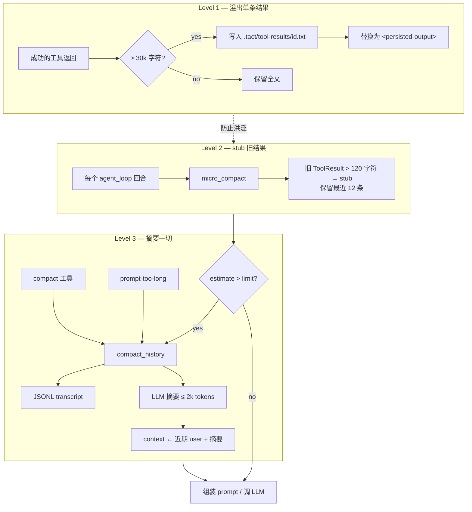

**心智模型：** Level 1 保护*本轮* stdout；Level 2 在不调 LLM 的情况下整理*历史形状*；Level 3 在 stub 仍不够时重置对话。

---

## 2. 压缩在 Agent Loop 中的位置

压缩不是独立守护进程，而是织进 `Agent::agent_loop`。自上而下阅读循环：

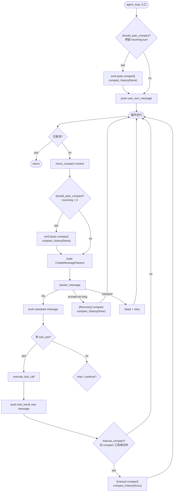

关键顺序：

1. **入口路径** — 在 push 用户 turn 之前，`should_auto_compact` 会预留 `estimate(user_turn)`，避免刚 append 就立刻撑爆窗口。
2. **每次循环迭代** — 在模型请求前（含工具后的续写 / recovery）先跑 `micro_compact`，再跑 `should_auto_compact(incoming = 0)`。
3. **工具执行之后** — 只有**成功**的 `compact` 工具才会设置 `manual_compact`；该路径调用 `compact_history(focus)` 后回到循环顶部。失败 / 被拒绝的 compact 调用不会改写历史。
4. **Prompt-too-long 恢复** 执行 `compact_history` 后 `continue` 循环（同一任务、新 context）。上限：`MAX_RECOVERY_ATTEMPTS`（3）。细节见 [错误恢复](./06_chapter_recovery.md)。
5. **手动 `compact` 工具** 不能在工具处理函数*内部*改写 context（API 有效性）。Dispatch 仅在成功时记录 flag；`compact_history` 在 tool results **追加之后**再跑。

---

## 3. 微压缩（Micro-Compaction）

`micro_compact(messages, enabled)` 在每次模型请求前运行（可通过配置关闭，见 §9）。只触碰包含 `ContentBlock::ToolResult` 的 **user 角色**消息。完整自动压缩也会在此时执行（`incoming = 0`）；入口路径会在 push 前单独预留 incoming user turn。

```rust
const KEEP_RECENT_TOOL_RESULTS: usize = 12;
const COMPACTED_TOOL_RESULT: &str =
    "[Earlier tool result compacted. If you need the full content to continue editing, re-read the relevant file.]";
```

### 算法

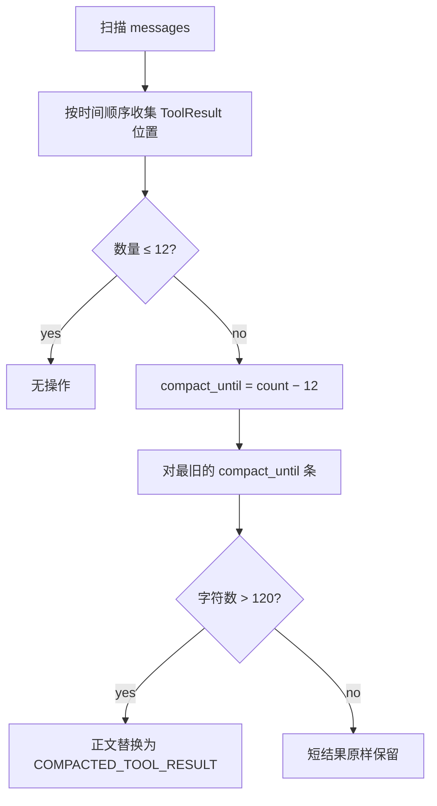

### 前后对比（示意）


常量背后的经验法则：

| 规则 | 原因 |
|------|------|
| 保留最近 **12** 条结果 | 当前工作流通常仍需要近期工具 I/O |
| 仅当 **> 120** 字符才 stub | 短 ok / 错误信息密度高，stub 省不了空间 |
| 从不碰 assistant / thinking / user 文本 | 体积杀手主要是工具 dump |

Stub 文案是刻意的：告诉模型**如何恢复**（`read_file` / 重跑工具）。系统提示里也有同样约定：

> If a tool result was compacted and you need the details, re-run the relevant tool (e.g., `read_file`)

---

## 4. 自动触发与体积估算

共享阈值是 **`agent.model_context_window`** — 模型上下文窗口，单位为 **tokens**（默认 **200,000**）。同一数值同时驱动自动压缩与 TUI 底栏用量条。

### 判定（OR）

`should_auto_compact` 在以下**任一**条件成立时触发（可预留尚未入 context 的本轮 user turn，以及下一次 `max_tokens` 输出）：

```text
last_token_total > 0
  && last_token_total + estimate_message_tokens(incoming_turn) + max_tokens >= model_context_window 的 80%
  || estimate_context_tokens(context) + estimate_message_tokens(incoming_turn) + max_tokens >= model_context_window 的 80%
```

OR 两侧都与同一 **token** 窗口比较，且两侧都预留了输出预算（`max_tokens`），确保 LLM 还有足够的空间生成回复。序列化内容中的 ASCII 按约 4 字符一个 token 估算，非 ASCII 则保守地按每字符一个 token 计算。

- **入口（`agent_loop`）**：先对**旧历史** compact（`incoming_turn_tokens = estimate(user_turn)`），再 `push` 本轮原文。
- **循环内 / recovery / 手动**：本轮已在 context → `incoming_turn_tokens = 0`。

摘要后重建（Codex 风格）：**`[近期真实 User…] + [SUMMARY_PREFIX + handoff]`**，不再是单条 summary。重建分为三步：

1. **`collect_user_messages`** — 遍历整个 context，用 `is_real_user_message` 挑出真实 user turn（排除工具结果组成的 block 消息、旧 summary 消息和非 User 角色）。
2. **`retained_user_message_token_budget`** — 预算 = `min(20k 估算 token, model_context_window - max_tokens - estimate(system + tools + summary) - 20% 余量)`。
3. **`build_compacted_history`** — 从尾部保留真实 user 消息直到预算用尽；block turn 在预算内原样保留，超大 block turn 退化为文本尾部，纯图片则变成省略占位符，绝不截断 base64。最后追加一条 summary 消息。

旧单消息路径保留为 `compact_history_legacy`。

两个不同的百分比适用于不同的阶段：

| 阶段 | 余量 | 用途 |
|------|------|------|
| 摘要器 **输入** 预算 | 窗口的 **10%** | `compact_history_with_mode` — 确保摘要指令 + 历史尾部在调用 LLM 前有足够空间 |
| 重建 **最终请求** 安全兜底 | 窗口的 **20%** | `compact_rebuild_headroom_tokens` — 确保压缩后请求（system + tools + 保留用户 + 摘要 + max_output）不会溢出 |

以 200,000 token 窗口为例，摘要器输入余量为 10% = 20,000 tokens，重建兜底为 20% = 40,000 tokens。两者都用于吸收估算误差、JSON 序列化开销，以及保守估算与 provider tokenizer 之间的差异。百分比向上取整，不会向下少留。

```rust
pub fn estimate_context_tokens(messages: &[Message]) -> usize {
    match serde_json::to_string(messages) {
        Ok(serialized) => approx_text_tokens(&serialized),
        Err(_) => usize::MAX / 2, // 宁可触发 compact，也不低估
    }
}
```

```mermaid
flowchart TD
    MC[micro_compact] --> Tok{tokens (+ incoming) ≥ window 的 80%?}
    Tok -->|yes| Auto[auto compact_history]
    Tok -->|no| Est["估算 context + incoming tokens<br/>≥ window 的 80%?"]
    Est -->|yes| Auto
    Est -->|no| Call[LLM 调用]
```

| 配置 | 默认 | 说明 |
|------|------|------|
| `agent.model_context_window` | **200,000** | Tokens；CLI `--model-context-window` / TOML。由 `context_limit_chars` **破坏性重命名** — **无静默别名**。 |

压缩完成后会把 `last_token_total` **清零**（摘要调用本身的 usage 是大 prompt，不能代表新 context 体积）；下一轮主循环 LLM 再写入新的用量。见 §11。

---

## 5. 完整压缩：`compact_history`

`Agent::compact_history(focus: Option<&str>)` 是昂贵路径。它从不永久「删除」工作：压缩前的 context 总会先写入 transcript。

### 两种重建策略

Tact 有**两种**压缩重建模式。两者共享相同的摘要流水线（transcript → 选取近期消息 → LLM 摘要），区别仅在于**摘要产出后如何替换 context**：

- **Codex 风格**（`compact_history`，生产默认）：通过 `collect_user_messages` + `build_compacted_history` 重建。压缩后 context：`[真实 User…] + [SUMMARY_PREFIX + summary]`。真实 user turn 从尾部原样保留（预算允许）。当前轮次在 loop 压缩中不会丢失——`collect_user_messages` 从完整 context 中恢复它。
- **Legacy**（`compact_history_legacy`，仅保留用于回滚）：用 `compacted_context(summary)` 替换整个 context——单条 user 消息。所有 user turn 丢失；loop 压缩中当前轮次原文被摘要吞掉。

只有 Codex 被生产调用点使用；Legacy 以 `#[allow(dead_code)]` 存在供参考。

### 端到端时序

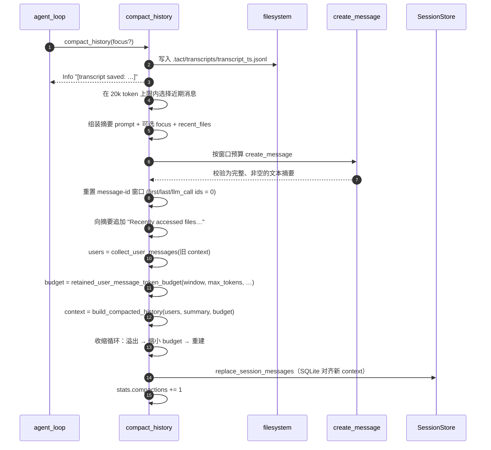

### 步骤说明

**1. Transcript 落盘** — `write_transcript` 原子创建唯一的 `.tact/transcripts/transcript_<unix_nanos>_<collision>.jsonl`，每行一条 JSON 消息。TUI 显示 `[transcript saved: …]`。完整历史可离线找回；摘要消息里**不会**自动告知模型该路径（§11 缺口）。

**2. 近期窗口选择** — 从 `context` **末尾**向前，在模型窗口预算与 **20,000 估算 token 上限**内累加。超大消息转成合法的纯文本视图，图片变成省略占位符，不会切断 base64；无法容纳时不强塞消息。更早回合只靠 transcript + 摘要能推断的内容存活。

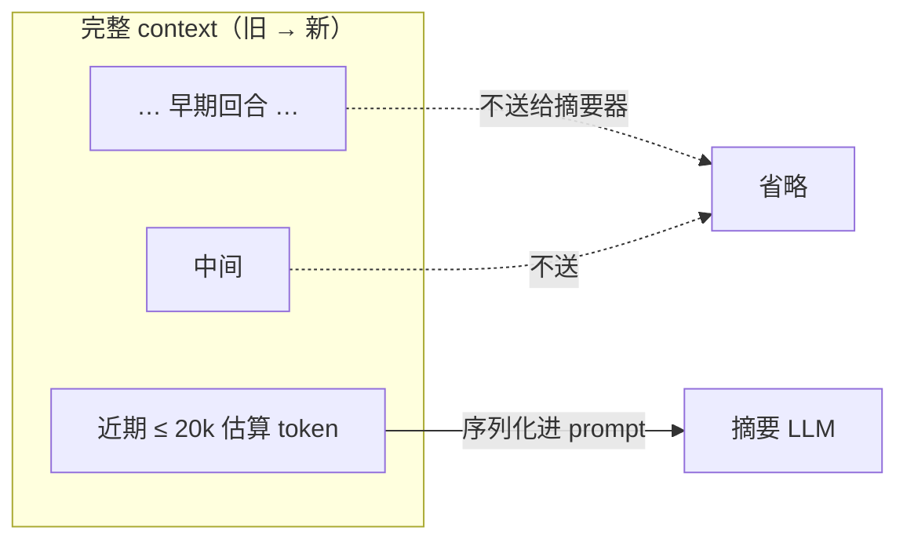

**3. 摘要调用** — 一次新的非流式 `create_message`（最多 2,000 输出 tokens、无 tools、无 thinking）；选择输入前先预留输出与 10% 安全余量。如果连固定的摘要指令本身都超过这个输入上限，压缩会提前失败，因为即使删除全部历史，也无法构造合法的摘要请求。瞬时传输错误最多退避重试三次；`MaxTokens`、拒绝/其它异常终止原因和空文本都会被拒绝，旧 context 不会被替换。摘要要求模型保留：

1. 当前目标与已完成工作  
2. 关键发现、决策、架构洞见  
3. 读过/改过的文件（相关类型、签名、API）  
4. 剩余工作与下一步  
5. 用户约束与偏好  
6. 遇到的错误及原因  

可选附加：

- `Focus to preserve next: {focus}` — 来自手动 `compact` 工具  
- `Recent files to reopen if needed:` — 来自 `CompactState.recent_files`

如果 focus 文本过长，无法与固定指令一起放入摘要输入预算，会被静默丢弃——但会通过 `tracing::warn!` 记录日志（原始长度、可用预算和所需 token 数），使该事件在诊断中可见。

当某条消息超出摘要输入预算时，`summary_message_fallback` 会将其转为合法纯文本表示。各 block 类型的映射方式如下：

| Block 类型 | 转为 |
|------------|------|
| `Text` | 保留原文 |
| `Thinking` | 保留原文 |
| `RedactedThinking` | `[Redacted thinking omitted.]` |
| `Image` | `[Earlier image attachment omitted during compaction.]` |
| `ToolUse` | `[Tool call: {name}]` |
| `ToolResult` | `[Tool result {tool_use_id}]\n{content}` |

如果降级后的文本仍然太大，会从尾部截断（`take_last_tokens`）到剩余预算。Base64 图片数据**绝不会**被截断——它们会被整体替换为省略标记，保证序列化 JSON 始终合法。

**4. 替换 context** — Codex 风格重建，分三步：

**4a. 收集用户消息** — `collect_user_messages(&old_context)` 遍历完整 context，用 `is_real_user_message` 过滤：保留非摘要、非纯工具结果的 User 角色消息。这是候选集，尚不截断。

**4b. 从尾部重建** — `build_compacted_history(users, summary, max_tokens)` 在 token 预算内从尾部保留真实 user 消息；最后追加一条 summary 消息：

```text
[0] User  "<较早的真实 user 原文…>"
[1] User  "<较近的真实 user 原文…>"
[2] User  "This conversation was compacted so the agent can continue working.

           <summary…>

           Recently accessed files (re-read if you need their contents):
           - crates/tact/src/agent/mod.rs
           - …"
```

（`compact_history_legacy` 仍会整段换成**单条** summary user 消息。）

**4c. 收缩循环（最终请求安全兜底）** — 第一步预算来自 `retained_user_message_token_budget`（`model_context_window - max_tokens - estimate(system+tools+summary) - 20%`，上限 20k）。但这是一个估算，重建后的实际体积可能超过窗口。因此进入一个循环：

1. 计算总 token：`system + tools + estimate(rebuilt) + max_tokens + headroom`
2. 若 ≤ `model_context_window` → 通过。
3. 若超出 → `retained_tokens -= 超出量`，然后以更小预算重新调 `build_compacted_history`，回到步骤 1。
4. 若 `retained_tokens == 0` 仍放不下 → `anyhow::bail!`（原 context 保持不变，单条摘要都超窗口）。

### 设计原理：摘要器输入 vs 重建 context

压缩流水线中有**两个**消息选择阶段，目标完全不同。

| 维度 | 摘要器输入（步骤 2–3） | 重建 context（步骤 4） |
|------|----------------------|----------------------|
| **目标** | 产出一份好的交接摘要 | 压缩后 agent 继续工作 |
| **谁读** | 摘要 LLM（一次性） | 主 agent（每轮直到下次压缩） |
| **角色** | User + Assistant + ToolResult | **仅 User** |
| **用户原文** | 送入摘要器，不保留原文 | ✅ 原样保留（从尾部，预算内） |
| **Assistant / ToolUse / ToolResult** | 送入摘要器（压缩后） | ❌ 丢弃（摘要已覆盖） |
| **预算** | `min(20k, summary_input_limit - 固定指令)` | `min(20k, window - output - system - tools - summary - 20%)` |

这种不对称是故意的：

- **摘要器需要看全景**才能写出一份准确的手记。没有 tool result，摘要器就不知道改了什么文件、测试是否通过。`summary_message_fallback` 压缩数据但不跳过整条消息。

- **重建 context 只保留用户意图**，因为 agent 需要原样保留任务目标原文才能继续工作。其他一切已被摘要浓缩，在有限窗口里重复保留只是浪费空间。

### 压缩失败时的行为

只有在摘要通过校验且重建后的请求符合模型窗口限制后，context 才会被替换。如果摘要生成失败、返回空文本、使用无效 stop reason，或重建后的请求仍放不进窗口，原有的内存 context 会保持不变。如果写入新的 context 到 SQLite 失败，替换也会回滚。压缩开始时写入的 transcript 仍会保留，可用于诊断或离线恢复。当前 agent loop 随后会向上返回错误，通常结束本次任务；它不会带着同一个超大 context 盲目重试。例外是摘要请求遇到瞬时传输错误：这种情况会先最多重试三次，之后才失败。

**5. 簿记**

| 动作 | 原因 |
|------|------|
| `has_compacted = true`，保存 `last_summary` | 会话知道已发生压缩 |
| 重置 `first_message_db_id` / `last_message_db_id` / `llm_call_last_message_id` | 重写后开启新的 message-id 窗口 |
| `last_token_total = 0` | 摘要调用的 usage 是大 prompt，不能代表新 context；避免下一轮误触发反复 compact |
| `replace_session_messages` | 重新打开会话**不得**复活压缩前的 SQLite 行 |
| `stats.compactions += 1` | 可观测性 |

### CompactState 与近期文件

```rust
pub struct CompactState {
    pub has_compacted: bool,
    pub last_summary: Option<String>,
    pub recent_files: Vec<String>,   // 最近 5 个 read_file 路径，去重，LRU
}
```

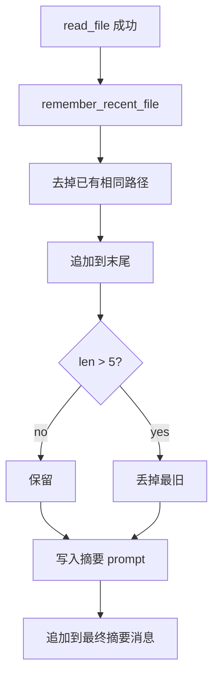

`remember_recent_file` 仅由最终状态成功的 `read_file`、`batch_read`、`write_file`、`edit_file` 与非 dry-run `apply_patch` 喂入，去重保留最近五个路径，作为「失忆保险」。

### 压缩前后对比

`compact_history` 最直观的效果，是移除 assistant / 工具历史，同时保留近期真实 user turn，并追加一条交接摘要。下面用一个具体例子走一遍。

#### 压缩前：`self.runtime.context`（`Vec<Message>`）

随任务不断增长的完整对话，典型形态（角色 / 内容混合）：

```text
[0] User      "帮我给 compact 模块加个 80% 提前触发"
[1] Assistant  推理 + tool_use(read_file compact/mod.rs)
[2] User       ToolResult(compact/mod.rs 全文，~5k 字符)
[3] Assistant  tool_use(read_file agent/mod.rs)
[4] User       ToolResult(mod.rs 片段，~8k 字符)
[5] Assistant  tool_use(bash cargo test)
[6] User       ToolResult(测试日志，~40k 字符)
[7] Assistant  tool_use(edit_file compact/mod.rs)
[8] User       ToolResult("edit applied")
 …             （几十条，累计可达数十万字符 / 逼近 window）
[N] Assistant  "阈值改好了，接着补测试"
```

特征：保留完整的 `tool_use` / `ToolResult` 配对、每一步的推理与中间产物；这也是体积的主要来源。

#### 压缩后：`self.runtime.context`

预算内的近期真实 user turn 会保留，最后追加交接摘要：

```text
[0] User  "帮我给 compact 模块加个 80% 提前触发"
[1] User  "This conversation was compacted so the agent can continue working.

           <LLM 摘要，按 6 点组织：>
           1. 当前目标：给 compact 模块加 80% 提前触发
           2. 关键发现：should_auto_compact 同时使用实际与估算 token
           3. 涉及文件：crates/tact/src/compact/mod.rs（should_auto_compact）、
              crates/tact/src/agent/mod.rs（compact_history）
           4. 剩余工作：补单元测试、跑 cargo test
           5. 用户偏好：先加 TODO，后续再优化
           6. 错误：暂无

           Recently accessed files (re-read if you need their contents):
           - crates/tact/src/compact/mod.rs
           - crates/tact/src/agent/mod.rs"
```

原来 `[1]`–`[N]` 的所有 `tool_use` / `ToolResult` / 推理**都不在窗口里了**——它们只存在于两个地方：压缩前落盘的 `transcript_<ts>.jsonl`，以及模型自己写的这段摘要。

#### 逐项变化

| 维度 | 压缩前 | 压缩后 |
|------|--------|--------|
| 消息条数 | N 条 | 近期真实 user + **1 条摘要** |
| 角色结构 | User / Assistant / ToolResult 交替 | 仅 **User** turn |
| `tool_use` / `ToolResult` | 完整保留 | **全部丢弃**（只在磁盘 transcript） |
| 推理 / thinking | 保留 | 丢弃（摘要器不产 thinking） |
| 体积 | 可达数十万字符 | 预算内 user + 摘要 ≤ 2k 输出 tokens + 文件清单 |
| 原始细节 | 直接可读 | 靠 `recent_files` 提示重新 `read_file` 找回 |
| 落盘 transcript | — | `.tact/transcripts/transcript_<ts>.jsonl` |

#### 同时被重置的运行时字段

除了 `context` 本身，`compact_history` 还会顺带重置 message-id 窗口与置位压缩状态：

| 字段 | 压缩前 | 压缩后 |
|------|--------|--------|
| `first_message_db_id` | 某个 > 0 的值 | `0` |
| `last_message_db_id` | 某个 > 0 的值 | `0` |
| `llm_call_last_message_id` | 某个 > 0 的值 | `0` |
| `last_token_total` | 压缩前用量 / 摘要调用用量 | `0`（下一轮主循环再写入） |
| `compact_state.has_compacted` | 可能为 `false` | `true` |
| `compact_state.last_summary` | 旧值 / `None` | 本次摘要文本 |
| `stats.compactions` | `k` | `k + 1` |

SQLite 侧同步：`replace_persisted_context` 用重建后的 context 重写 `messages` 表，保证**重开会话不会复活**压缩前的行。

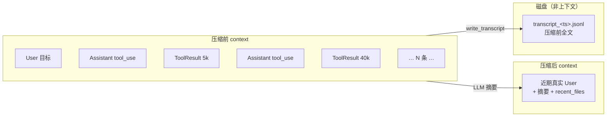

**一句话：** 压缩后模型看到近期 user 意图、它自己写的**交接备忘录**与文件清单；assistant / 工具细节退居磁盘。

---

## 6. 手动压缩：`compact` 工具

模型可通过 `compact` 工具请求压缩（`crates/tact/src/tool/compact.rs`）。

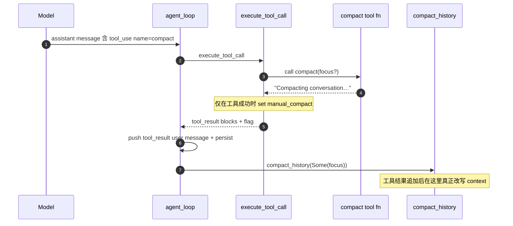

工具函数几乎是空操作的原因：在工具调用*内部*改写 `runtime.context` 会让对话卡在半空（assistant `tool_use` 没有匹配 result，或摘要只写了一半）。Dispatch 模式先保证线协议合法，再跑 Level 3。可选 `focus` 引导摘要器必须保留的内容。

Dispatch 仅在 compact 调用**成功**时才设置 `manual_compact = Some(focus)` — 被拒绝的调用（非法参数、hook 阻断等）不能改写历史，让模型在下一轮可以恢复。如果 `focus` 是字符串，就复制到标记中；如果缺少 `focus` 或它不是字符串，则设置为 `Some("")`。这个空字符串仍表示“执行手动压缩”，只是不会向 `compact_history` 提供额外重点，后者会忽略它。`None` 才表示没有请求手动压缩或调用失败。正常顺序是：先追加并持久化 tool result，再调用 `compact_history(Some(focus))` 真正改写 context。

---

## 7. 大输出溢出（`persist_large_output`）

与历史压缩无关：单条过大的工具结果不得以全文进入 context。每个成功的原生或 MCP 调用都会应用：

```rust
persist_large_output(&tact_path, tool_use_id, &output)
```

| 常量 | 值 |
|------|-----|
| `PERSIST_THRESHOLD` | 30,000 字符 |
| `PREVIEW_CHARS` | 2,000 字符 |

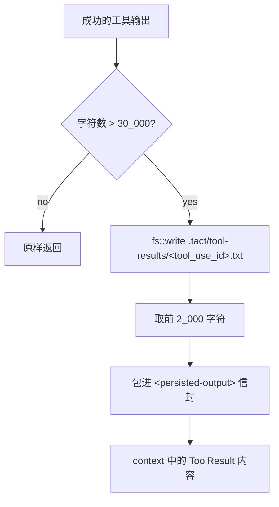

替换形态：

```xml
<persisted-output>
Full output saved to: .tact/tool-results/<tool_use_id>.txt
Preview:
[first 2000 characters…]
</persisted-output>
```

若落盘失败，该工具步骤会转为失败，而不会把已经丢失全文的结果报告为成功。

### 为什么需要 `<persisted-output>` 标签

标签是**给模型看的，不是给运行时解析的** — 代码库里没有反向匹配它们。它们把整块标成**系统生成的信封**，让 LLM 能分辨：

- “Full output saved to …” / “Preview:” 是框架元数据，不是工具输出
- 本轮结果是刻意落盘（不是静默截断垃圾）  
- 全文可通过路径上的 `read_file` 找回  

没有包裹时，这些行会混进普通 tool-result 文本。与其它 prompt 标记（如 `<skill>`）同一套轻量 XML 风格约定。

### Stub vs 信封

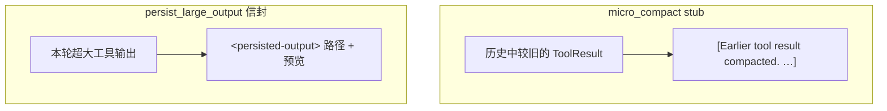

| 标记 | 时机 | 含义 |
|------|------|------|
| `[Earlier tool result compacted. …]` | Level 2，旧历史 | 正文离开 context；需重读 / 重跑 |
| `<persisted-output>…</persisted-output>` | Level 1，本轮 | 全文在磁盘；context 里是预览 + 路径 |

---

## 8. 磁盘布局

压缩通过 `TactPath` 在 workdir 下溢出两类产物：

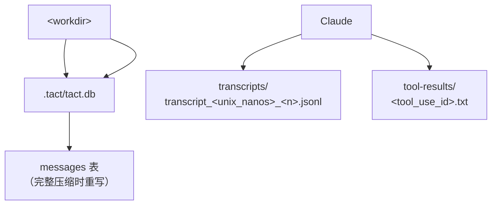

| 路径 | 写入方 | 内容 |
|------|--------|------|
| `.tact/transcripts/transcript_<ts>.jsonl` | `write_transcript` | 压缩前完整对话 |
| `.tact/tool-results/<id>.txt` | `persist_large_output` | 超大原生/MCP 输出全文 |
| `.tact/tact.db` messages | `replace_session_messages` | 压缩后的保留 user + 摘要 context |

每次写入后，每个溢出目录最多保留修改时间最新的 100 个文件；更旧的普通文件会被删除。

---

## 9. 配置

| 设置 | 默认 | 作用 |
|------|------|------|
| `agent.model_context_window`（`--model-context-window`） | 200,000 | Token 窗口：80% 时自动压缩 + TUI 用量条；非零时必须大于 `max_tokens` |
| `agent.micro_compact_enabled`（`--no-micro-compact`） | `true` | 启用每轮 stub |

经 `crates/tact/src/config/` 分层解析（CLI > TOML > 默认）。编译期常量（`KEEP_RECENT_TOOL_RESULTS`、`PERSIST_THRESHOLD` …）**尚不可配置**。

---

## 10. 代码地图

| 文件 | 职责 |
|------|------|
| `crates/tact/src/compact/mod.rs` | `micro_compact`、`should_auto_compact`、`estimate_context_tokens`、`collect_user_messages`、`build_compacted_history`、`write_transcript`、`persist_large_output`、`compacted_context`、`CompactState` |
| `crates/tact/src/agent/mod.rs` | 循环触发；`compact_history` / `compact_history_legacy`；`remember_recent_file`；`replace_persisted_context` |
| `crates/tact/src/agent/tool_dispatch.rs` | 原生/MCP 结果的 `persist_large_output`；`manual_compact` flag；近期文件追踪 |
| `crates/tact/src/tool/compact.rs` | `compact` 工具 stub + `focus` |
| `crates/tact/src/recovery.rs` | Prompt-too-long 分类 → 压缩 |
| `crates/tact/src/consts.rs` | `transcript_dir()`、`tool_results_dir()` |
| `docs/compaction.md` | 行为 / 调参速查 |

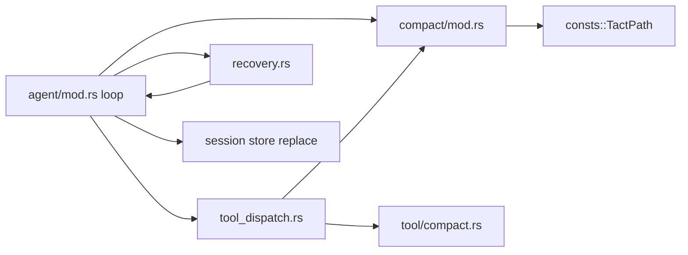

---

## 11. 当前缺口

| 缺口 | 细节 |
|------|------|
| 冷启动 / 工具后 token 估算 | ASCII 按约 4 字符/token、非 ASCII 按 1 字符/token 的保守估算；有实际用量时仍 OR 此估算，以覆盖 tool result 追加后的膨胀 |
| 简易用量百分比 | 用量条为 `used / model_context_window`（尚无 Codex 12K baseline / effective-window 算法） |
| 只摘要近期 20k 估算 token | 早期回合在 transcript 里；替换消息未告知模型该路径 |
| Stub 阈值固定 | 12 / 120 / 30k 是编译期常量 |

---

## 相关文档

- [Error Recovery](./06_chapter_recovery.md) — 作为 prompt-too-long 策略的压缩  
- [Agent Main Loop](./18_chapter_agent_loop.md) — 这些挂钩周围的完整循环  
- [System Prompt](./04_chapter_prompt.md) — 每轮重建；含压缩工具指引  
- [Store and Persistence](./01_chapter_store.md) — 压缩后的会话消息重写  
- [Tasks and Tool Scheduling](./11_chapter_task.md) — dispatch 中检测 `manual_compact`  
- [docs/compaction.md](../docs/compaction.md) — 调参笔记  
- [ARCHITECTURE.md](../ARCHITECTURE.md) — §6 上下文压缩  
- [英文原文](./05_chapter_compact.md)
