# 上下文压缩（Context Compaction）

本章说明 Tact 如何把长时间对话**压进模型上下文窗口**：每轮廉价的原地截断（`micro_compact`）、触及上限时的 LLM 摘要（`compact_history`，非 Responses provider）、OpenAI Responses 的原生 `/responses/compact`，以及 transcript / 超大工具输出的落盘溢出。原语在 `crates/tact_extensions/src/compact/mod.rs`；编排在 `crates/tact_extensions/src/agent/mod.rs` 的 `Agent::compact_history`。

压缩也是一种**恢复策略**：当 provider 因 prompt 过长拒绝对话时，agent 会先压缩再重试。见 [错误恢复](./06_chapter_recovery_zh.md)（英文）。

---

## 0. 为什么需要压缩

编码 agent 每一轮都会堆积消息：用户文本、助手推理、工具调用，尤其是**工具结果**（文件内容、命令日志、搜索命中）。上下文膨胀有三类代价：

| 代价 | 影响 |
|------|------|
| 硬限制 | Provider 返回 prompt-too-long → 若无恢复则本轮失败 |
| 软成本 | Prompt 更长 → TTFT 更慢、token 费用更高 |
| 注意力 | 远处的大段工具 dump 稀释模型「此刻」真正需要的信号 |

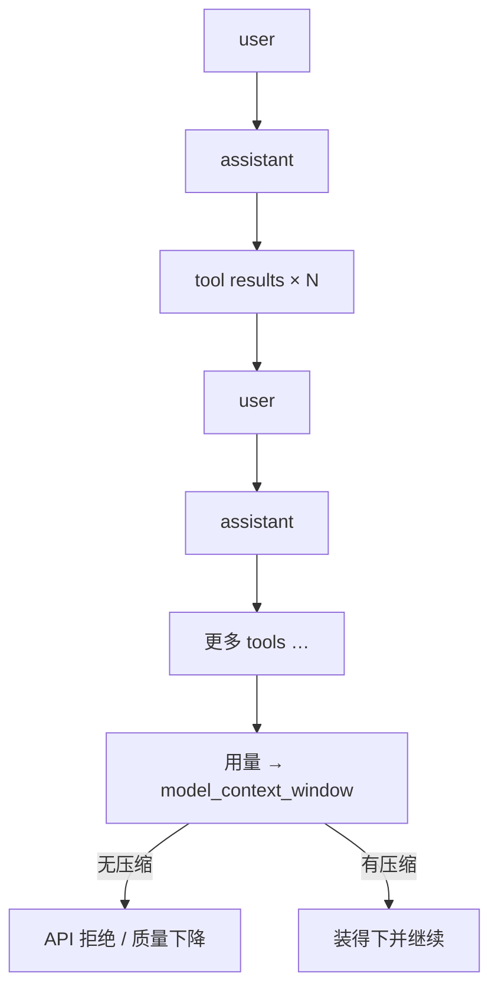
```mermaid
graph TD
    u1[user] --> a1[assistant]
    a1 --> t1[tool results × N]
    t1 --> u2[user]
    u2 --> a2[assistant]
    a2 --> t2[更多 tools …]
    t2 --> huge[用量 → model_context_window]
    huge -->|无压缩| fail[API 拒绝 / 质量下降]
    huge -->|有压缩| fit[装得下并继续]
```

Tact 的答案是**渐进式防御**：先做免费的本地 stub，必要时再付一次摘要调用，并对单次超大输出做机会性落盘，避免其以全文进入窗口。

---

## 1. 三层防御

| 层级 | 机制 | 成本 | 时机 | 从*上下文*中失去什么 |
|------|------|------|------|----------------------|
| 1 | `persist_large_output` | 免费（磁盘 I/O） | 任意成功的原生或 MCP 结果 > 30,000 字符（**`read_file` 除外**） | 完整输出（磁盘保留 + 预览） |
| 2 | `micro_compact` | 免费 | 每个 LLM 回合开始（**默认关闭**，需 `[agent].micro_compact_enabled = true`，见 §9） | 旧 tool-result 正文（留下 stub） |
| 3 | `compact_history` | 一次额外 LLM 调用（本地）/ Responses 原生 `/responses/compact` | 80% 阈值、prompt-too-long、或 `compact` 工具 | Assistant/工具历史（保留近期真实 user + 摘要；完整 JSONL 在磁盘） |

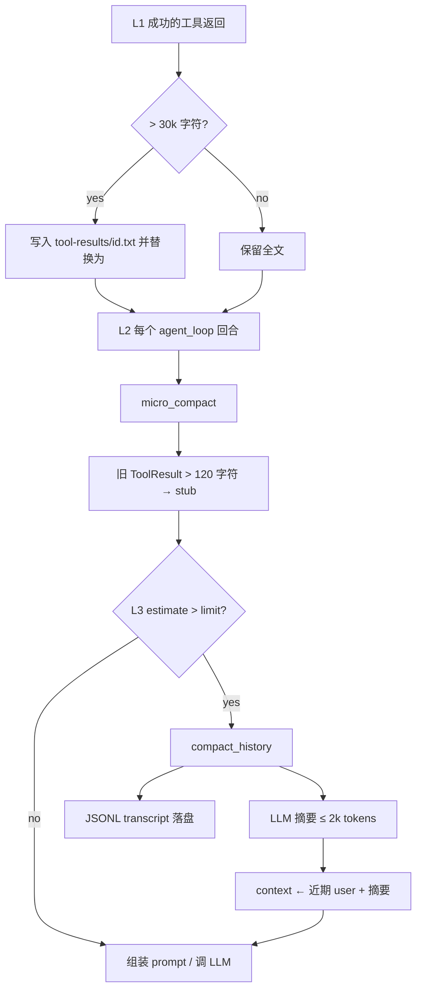
```mermaid
graph TD
    a_bash[L1 成功的工具返回] --> b_big{> 30k 字符?}
    b_big -->|yes| c_disk[写入 tool-results/id.txt 并替换为 <persisted-output>]
    b_big -->|no| d_keep[保留全文]
    c_disk --> e_turn[L2 每个 agent_loop 回合]
    d_keep --> e_turn
    e_turn --> f_mc[micro_compact]
    f_mc --> g_stub[旧 ToolResult > 120 字符 → stub]
    g_stub --> h_est{L3 estimate > limit?}
    h_est -->|yes| i_ch[compact_history]
    h_est -->|no| j_prompt[组装 prompt / 调 LLM]
    i_ch --> k_sum[LLM 摘要 ≤ 2k tokens]
    i_ch --> l_disk[JSONL transcript 落盘]
    k_sum --> m_one[context ← 近期 user + 摘要]
    m_one --> j_prompt
```

**心智模型：** Level 1 保护*本轮* stdout；Level 2 在不调 LLM 的情况下整理*历史形状*；Level 3 在 stub 仍不够时重置对话。

---

## 2. 压缩在 Agent Loop 中的位置

压缩不是独立守护进程，而是织进 `Agent::agent_loop`。对于非 Responses provider，Tact 会先压缩**旧历史**，再 push 当前 user turn，确保最新用户输入以原文保留，而不是被吞进摘要。对于 **OpenAI Responses** 一类 provider，入口路径上的同一个触发检查同样在 push turn 之前运行，但原生压缩只会收缩 wire 基线——逻辑 context 永远不会被改写，当前 turn 会作为新出现的 `/responses` input items 发送。

自上而下阅读循环：

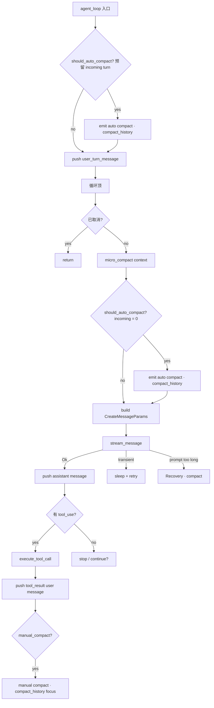
```mermaid
graph TD
    a_entry[agent_loop 入口] --> b_size{should_auto_compact? 预留 incoming turn}
    b_size -->|yes| c_auto[emit auto compact · compact_history]
    b_size -->|no| d_push[push user_turn_message]
    c_auto --> d_push
    d_push --> e_start[循环顶]
    e_start --> f_cancel{已取消?}
    f_cancel -->|yes| g_exit[return]
    f_cancel -->|no| h_mc[micro_compact context]
    h_mc --> i_size2{should_auto_compact? incoming = 0}
    i_size2 -->|yes| j_auto2[emit auto compact · compact_history]
    i_size2 -->|no| k_build[build CreateMessageParams]
    j_auto2 --> k_build
    k_build --> l_stream[stream_message]
    l_stream -->|Ok| m_assist[push assistant message]
    l_stream -->|transient| n_backoff[sleep + retry]
    l_stream -->|prompt too long| o_rec[Recovery · compact]
    m_assist --> p_tools{有 tool_use?}
    p_tools -->|yes| q_exec[execute_tool_call]
    p_tools -->|no| r_done[stop / continue?]
    q_exec --> s_persist[push tool_result user message]
    s_persist --> t_man{manual_compact?}
    t_man -->|yes| u_mc2[manual compact · compact_history focus]
```

> 上图中 `sleep + retry`、`Recovery · compact`、`manual compact` 三条分支结束后都**回到循环顶**（`循环顶` 那一步），`stop / continue?` 决定收尾还是继续——这里画成有向无环图，环回边在渲染器里会被压平，故省略。

关键顺序：

1. **入口路径** — 在 push 用户 turn 之前，`should_auto_compact` 会预留 `estimate(user_turn)`，避免刚 append 就立刻撑爆窗口。
2. **每次循环迭代** — 在模型请求前（含工具后的续写 / recovery）先跑 `micro_compact`（默认关闭时立即返回，见 §9），再跑 `should_auto_compact(incoming = 0)`。
3. **工具执行之后** — 只有**成功**的 `compact` 工具才会设置 `manual_compact`；该路径调用 `compact_history(focus)` 后回到循环顶部。失败 / 被拒绝的 compact 调用不会改写历史。
4. **Prompt-too-long 恢复** 执行 `compact_history` 后 `continue` 循环（同一任务、新 context）。上限：`MAX_COMPACT_ATTEMPTS`（3，`crates/tact_extensions/src/recovery.rs`）。细节见 [错误恢复](./06_chapter_recovery_zh.md)。
5. **手动 `compact` 工具** 不能在工具处理函数*内部*改写 context（API 有效性）。Dispatch 仅在成功时记录 flag；`compact_history` 在 tool results **追加之后**再跑。

---

## 3. 微压缩（Micro-Compaction）

`micro_compact(messages, enabled)` 在每次模型请求前运行，但 **`enabled` 默认是 `false`**：自 2026-07-24（`5cb59451`）起 micro-compact 改为**按需开启**——`[agent].micro_compact_enabled = true` 才跑（见 §9）。`--no-micro-compact` 是绝对的「强制关闭」，只能把 TOML 里显式写下的 `true` 覆盖回 `false`，无法开启——在默认配置下它是多余的。只触碰包含 `ContentBlock::ToolResult` 的 **user 角色**消息。完整自动压缩也会在此时执行（`incoming = 0`）；入口路径会在 push 前单独预留 incoming user turn。

```rust
const KEEP_RECENT_TOOL_RESULTS: usize = 12;
const COMPACTED_TOOL_RESULT: &str =
    "[Earlier tool result compacted. Re-run the tool (e.g., read_file) for full content.]";
```

### 算法

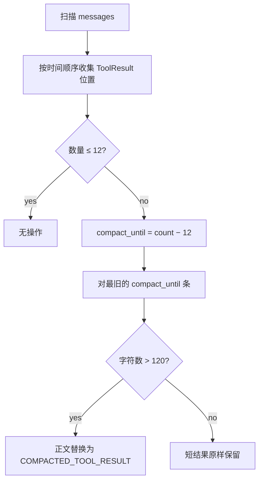
```mermaid
flowchart TD
    A[扫描 messages] --> B[按时间顺序收集 ToolResult 位置]
    B --> C{数量 ≤ 12?}
    C -->|yes| Z[无操作]
    C -->|no| D["compact_until = count − 12"]
    D --> E[对最旧的 compact_until 条]
    E --> F{字符数 > 120?}
    F -->|yes| G[正文替换为 COMPACTED_TOOL_RESULT]
    F -->|no| H[短结果原样保留]
```

### 前后对比（示意）

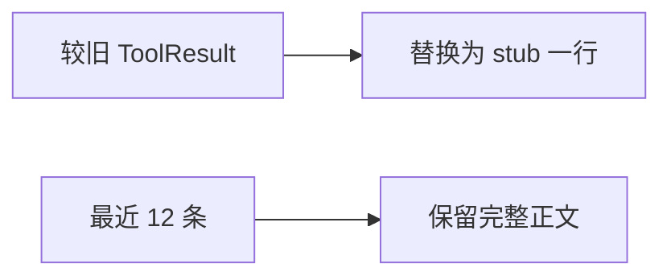
```mermaid
graph LR
    a_old[较旧 ToolResult] --> c_stub[替换为 stub 一行]
    b_recent[最近 12 条] --> d_intact[保留完整正文]
```

常量背后的经验法则：

| 规则 | 原因 |
|------|------|
| 保留最近 **12** 条结果 | 当前工作流通常仍需要近期工具 I/O |
| 仅当 **> 120** 字符才 stub | 短 ok / 错误信息密度高，stub 省不了空间 |
| 从不碰 assistant / thinking / user 文本 | 体积杀手主要是工具 dump |

Stub 文案是刻意的：告诉模型**如何恢复**（`read_file` / 重跑工具）。系统提示里也有同样约定：

> If a tool result was truncated and you need the details, re-run the relevant tool (e.g., `read_file`)

---

## 4. 自动触发与体积估算

共享阈值是 **`agent.model_context_window`** — 模型上下文窗口，单位为 **tokens**（默认 **200,000**）。同一数值同时驱动自动压缩与 TUI 底栏用量条。

### 判定（OR）

`should_auto_compact` 在以下**任一**条件成立时触发（可预留尚未入 context 的本轮 user turn，以及下一次 `max_tokens` 输出）：

```text
last_token_total > 0
  && last_token_total + estimate_message_tokens(incoming_turn) + max_tokens >= model_context_window 的 80%
  || estimate_context_tokens(context) + estimate_message_tokens(incoming_turn) + max_tokens >= model_context_window 的 80%
```

OR 两侧都与同一 **token** 窗口比较，且两侧都预留了输出预算（`max_tokens`），确保 LLM 还有足够的空间生成回复。序列化内容中的 ASCII 按约 4 字符一个 token 估算，非 ASCII 则保守地按每字符一个 token 计算。

- **入口（`agent_loop`）**：先对**旧历史** compact（`incoming_turn_tokens = estimate(user_turn)`），再 `push` 本轮原文。
- **循环内 / recovery / 手动**：本轮已在 context → `incoming_turn_tokens = 0`。

**Responses 例外**：`Agent::auto_compact_due` 对 OpenAI Responses 只认 provider 回报的 `last_token_total`，**不用**逻辑 context 的估算。原因是原生压缩只收缩 wire 基线、不缩小逻辑 context——若让估算参与触发，它会在一个已经压缩过的 context 上永远重触发。因此该路径下 `last_token_total == 0`（尚无用量）时一律不触发，也不做「`max_tokens` 单独越线」的兜底。

摘要后重建（Codex 风格）：**`[近期真实 User…] + [<context-handoff> summary cell]`**，不再是单条 summary。交接摘要是一条带 `<context-handoff>` … `</context-handoff>` 包裹、内存中标记为 `MessageKind::Summary` 的 `User` 角色消息，是**一等公民 cell**：按类型检测（reload 会话回退到 `SUMMARY_PREFIX` 字符串匹配）、永远不会被当成真实 user turn，即使 provider 合并连续 user 消息也能靠标签区分。重建分为三步：

1. **`collect_user_messages`** — 遍历整个 context，用 `is_real_user_message` 挑出真实 user turn（排除工具结果组成的 block 消息、旧 summary 消息、hook 注入的 `<hook-context>` cell 和非 User 角色）。
2. **`retained_user_message_token_budget`** — 预算 = `min(20k 估算 token, model_context_window - max_tokens - estimate(system + tools + summary) - 20% 余量)`。
3. **`build_compacted_history`** — 从尾部保留真实 user 消息直到预算用尽；block turn 在预算内原样保留，超大 block turn 退化为文本尾部，纯图片则变成省略占位符，绝不截断 base64。最后追加一条 summary 消息。

旧单消息路径保留为 `compact_history_legacy`。

两个不同的百分比适用于不同的阶段：

| 阶段 | 余量 | 用途 |
|------|------|------|
| 摘要器 **输入** 预算 | 窗口的 **10%** | `compact_history_local_with_mode` — 确保摘要指令 + 历史尾部在调用 LLM 前有足够空间 |
| 重建 **最终请求** 安全兜底 | 窗口的 **20%** | `compact_rebuild_headroom_tokens` — 确保压缩后请求（system + tools + 保留用户 + 摘要 + max_output）不会溢出 |

以 200,000 token 窗口为例，摘要器输入余量为 10% = 20,000 tokens，重建兜底为 20% = 40,000 tokens。两者都用于吸收估算误差、JSON 序列化开销，以及保守估算与 provider tokenizer 之间的差异。百分比向上取整，不会向下少留。

```rust
pub fn estimate_context_tokens(messages: &[Message]) -> usize {
    match serde_json::to_string(messages) {
        Ok(serialized) => approx_text_tokens(&serialized),
        Err(_) => usize::MAX / 2, // 宁可触发 compact，也不低估
    }
}
```

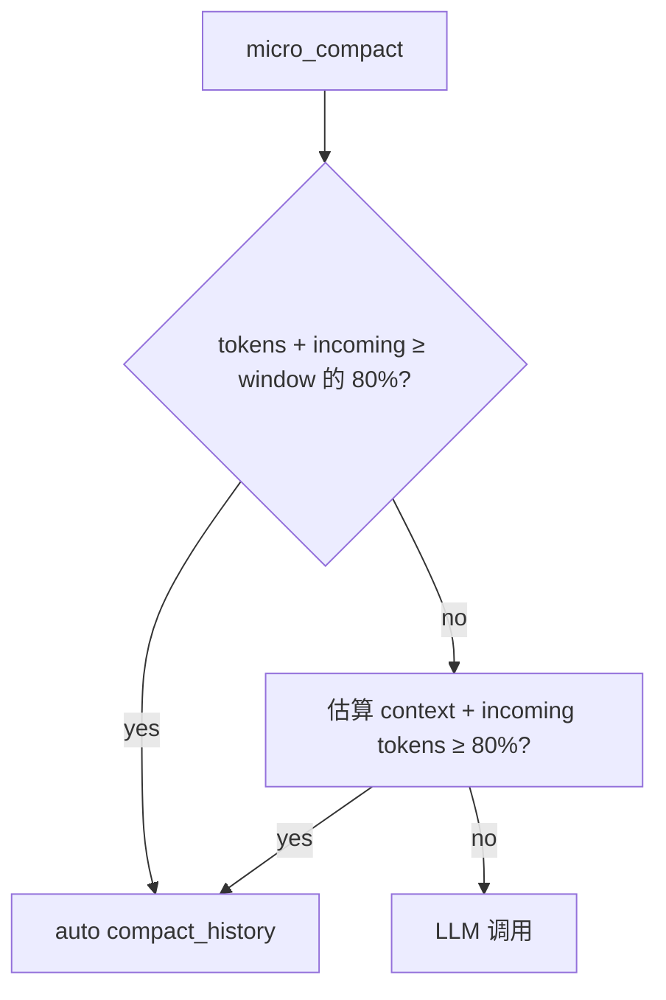
```mermaid
graph TD
    mc[micro_compact] --> tok{tokens + incoming ≥ window 的 80%?}
    tok -->|yes| auto[auto compact_history]
    tok -->|no| est[估算 context + incoming tokens ≥ 80%?]
    est -->|yes| auto
    est -->|no| call[LLM 调用]
```

| 配置 | 默认 | 说明 |
|------|------|------|
| `agent.model_context_window` | **200,000** | Tokens；CLI `--model-context-window` / TOML。由 `context_limit_chars` **破坏性重命名** — **无静默别名**。解析顺序：CLI > `[agent]` > 内置模型→窗口映射（如 `deepseek-v4-pro`、`claude-opus-4-7` → 1,000,000；`gpt-5.6-sol` → 1,050,000）> 默认 200,000。该映射是未配置模型时的回退，因此过时的手工值会低估长上下文模型。 |

压缩完成后会把 `last_token_total` **清零**（摘要调用本身的 usage 是大 prompt，不能代表新 context 体积）；下一轮主循环 LLM 再写入新的用量。见 §11。

---

## 5. 完整压缩：`compact_history`

`Agent::compact_history(focus: Option<&str>)` 是昂贵路径。它从不永久「删除」工作：压缩前的 context 总会先写入 transcript。

### 两种重建策略

Tact 有**两种**压缩重建模式。两者共享相同的摘要流水线（transcript → 选取近期消息 → LLM 摘要），区别仅在于**摘要产出后如何替换 context**：

- **Codex 风格**（`compact_history`，生产默认）：通过 `collect_user_messages` + `build_compacted_history` 重建。压缩后 context：`[真实 User…] + [<context-handoff> summary cell]`。真实 user turn 从尾部原样保留（预算允许）。当前轮次在 loop 压缩中不会丢失——`collect_user_messages` 从完整 context 中恢复它。
- **Legacy**（`compact_history_legacy`，仅保留用于回滚）：用 `compacted_context(summary)` 替换整个 context——单条 user 消息。所有 user turn 丢失；loop 压缩中当前轮次原文被摘要吞掉。

只有 Codex 被生产调用点使用；Legacy 以 `#[allow(dead_code)]` 存在供参考。

### 端到端时序

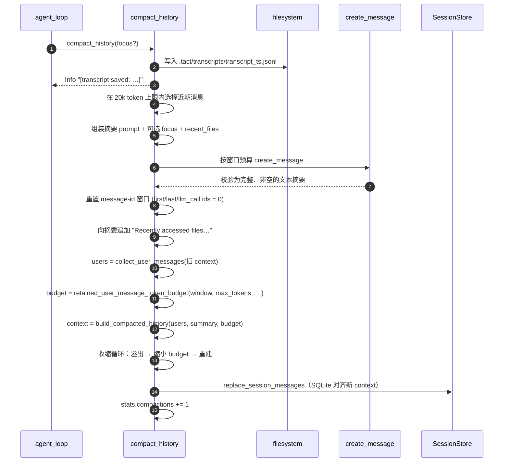
```mermaid
sequenceDiagram
    autonumber
    participant AgentLoop as agent_loop
    participant CH as compact_history
    participant Disk as filesystem
    participant LLM as create_message
    participant Store as SessionStore

    AgentLoop->>CH: compact_history(focus?)
    CH->>Disk: 写入 .tact/transcripts/transcript_ts.jsonl
    CH-->>AgentLoop: Info "[transcript saved: …]"
    CH->>CH: 在 20k token 上限内选择近期消息
    CH->>CH: 组装摘要 prompt + 可选 focus + recent_files
    CH->>LLM: 按窗口预算 create_message
    LLM-->>CH: 校验为完整、非空的文本摘要
    CH->>CH: 重置 message-id 窗口 (first/last/llm_call ids = 0)
    CH->>CH: 向摘要追加 "Recently accessed files…"
    CH->>CH: users = collect_user_messages(旧 context)
    CH->>CH: budget = retained_user_message_token_budget(window, max_tokens, …)
    CH->>CH: context = build_compacted_history(users, summary, budget)
    CH->>CH: 收缩循环：溢出 → 缩小 budget → 重建
    CH->>Store: replace_session_messages（SQLite 对齐新 context）
    CH->>CH: stats.compactions += 1
```

### 步骤说明

**1. Transcript 落盘** — `write_transcript` 原子创建唯一的 `.tact/transcripts/transcript_<unix_nanos>_<collision>.jsonl`，每行一条 JSON 消息。TUI 显示 `[transcript saved: …]`。完整历史可离线找回，且模型收到的 handoff cell 末尾就带着该路径（`Full pre-compaction transcript: … — read it selectively if you need detail this summary dropped.`），因此接续的 agent 知道早期回合是可找回的，而不会以为摘要就是全部。

**2. 近期窗口选择** — 从 `context` **末尾**向前，在模型窗口预算与 **20,000 估算 token 上限**内累加。超大消息转成合法的纯文本视图，图片变成省略占位符，不会切断 base64；无法容纳时不强塞消息。更早回合只靠 transcript + 摘要能推断的内容存活。

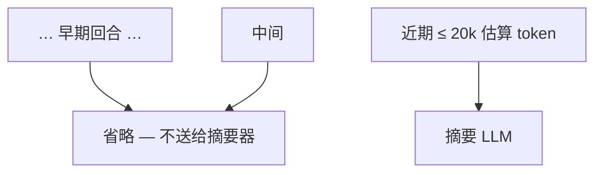
```mermaid
graph TD
    a_old[… 早期回合 …] --> d_omitted[省略 — 不送给摘要器]
    b_mid[中间] --> d_omitted
    c_new[近期 ≤ 20k 估算 token] --> e_sum[摘要 LLM]
```

**3. 摘要调用** — 一次新的非流式 `create_message`（无 tools）；选择输入前先预留输出与 10% 安全余量。摘要**文本**部分沿用经典的 `min(窗口 × 20%, 2,000)` 输出预算。摘要请求不转发 Claude 式 thinking budget（思考对手交摘要价值不大），其 reasoning 预留是该次尝试**有效 effort 对应的绝对 token 桶**——`none` 0、`minimal`/`low` 2,000、`medium` 4,000、`high` 8,000、`xhigh`/`max` 16,000——追加在文本预算**之上**（`max_tokens` = 文本 + 桶）。当这次请求可能把信封花在推理上——即任何 effort 语义 provider（OpenAI / DeepSeek / Kimi k3 / 配置了 effort 的自定义 provider，含服务端默认档）——线上的 `max_tokens` 还会再被 `[agent] max_tokens` 兜底抬高，并以「固定指令仍放得下」为上限封顶。这类 provider **没有独立的 thinking 预算**，因此小于配置输出预算的信封可能被思考整个吃掉（实测：`max_tokens = 4000` → `reasoning_tokens = 4000`、摘要正文为零，而 DeepSeek 官方思考模式默认是 64K）。budget 语义 provider（Anthropic）在这里从不接收 thinking 预算，仍保持经典文本上限。预留走一条**分档 effort 阶梯**：

- **阶段 0 — 继承。** 转发会话配置的 `reasoning_effort`；未配置时按 provider 服务端默认（DeepSeek / Kimi K3 默认 thinking 开启 + effort high，取 `high` 桶；OpenAI / Anthropic 取 0）。
- **阶段 1 — 最小化。** 在 provider 允许的范围内压低思考：DeepSeek / Kimi K3 转发 `low`（其 body hook 无法完全关闭 thinking），OpenAI 推理模型发 `none`，其余 provider 省略该字段。
- **阶段 2+ — 自适应。** 依据上一次尝试实际消耗的 `reasoning_tokens` 设定预留：`clamp(observed × 1.25, floor, cap)`，其中 `floor = max(上次预留, effort 桶, 文本/4)`、`cap = 2 × floor`。每次信封都受窗口上限约束，保证初始 prompt + `max_tokens` + headroom 仍放得下。

reasoning 与文本共用同一个 `max_tokens` 信封，没有预留时推理模型会挤占摘要文本——而且预留只是本地记账：线上只有一个信封，因此预留不足的 stage 0 等于什么都没买到。在 DeepSeek 系网关上实测（`deepseek-flash`、`reasoning_effort = low`）：stage 0 发出 `max_tokens = 4000 (text 2000 + reasoning 2000)`，回来是 `MaxTokens`、`reasoning_tokens = 4000`、摘要正文为零；下一阶段（`max_tokens = 2000`、预留 0）反而用 649 reasoning + 约 465 文本 token 产出了摘要，因为它是**续写**而不是重新推导那部分思考。如果连固定的摘要指令本身都超过输入上限，压缩会提前失败，因为即使删除全部历史也无法构造合法请求。瞬时传输错误最多退避重试五次。每次摘要尝试都会打印自己的信封——调用前 `[compact summary n/6] request … max_tokens=… (text … + reasoning …), reasoning_effort=…, input … chars`，调用后 `[compact summary n/6] response stop=…, prompt …, completion … (reasoning …), cache …/…`，一次成功（0 次续写）时同样打印——因此实际发出的 `max_tokens` 与这次调用真正的开销永远在日志里。stop reason 采用与 agent 其它消息一致的 snake_case 记法（`stop=end_turn`、`stop=max_tokens`、`stop=unknown(<raw>)`），没有 usage 时写 `no usage reported`，不再打印空的 Debug dump。`MaxTokens` 截断的摘要会**续写**（最多 `MAX_COMPACT_SUMMARY_ATTEMPTS` = 5 次，`[compact continue n/5]`）：把已产生的部分摘要作为 assistant 消息、追加一条续写提示，而该提示同时点名这次尝试花掉的**两种单位**——`summary truncated (4000 reasoning tokens, thinking block 15314 bytes), next attempt max_tokens=2000`——先写计费的 reasoning tokens，再写 thinking 块的字节重量，避免把字节数读成 token 数。阶梯用尽后，部分摘要以 `[compact fallback]` 被接受为 best-effort（Codex-style 重建反正会保留最近的真实用户消息）。拒绝/其它异常终止原因和空文本仍会被拒绝，旧 context 不会被替换。指令还说明对话以 JSON 消息数组形式附在后面（工具结果与附件可能被省略），摘要必须仅基于该内容。摘要要求模型保留：

1. 当前目标与已完成工作  
2. 关键发现、决策、架构洞见  
3. 读过/改过的文件及关键代码结构（类型、签名、API）  
4. 剩余工作与下一步  
5. 用户约束与偏好  
6. 遇到的错误及原因  

可选附加，按以下优先级顺序追加，且只在剩余输入预算允许时（每一步都重新检查；超大的 `focus` 或文件清单会被丢弃并告警，消息切片则被裁剪以适应）：

- `Focus to preserve next: {focus}` — 三个附加项里**唯一来自模型工具调用**的：模型带 `focus` 参数调用 `compact` 工具（仅在非 Responses provider 上暴露），随后 `[manual compact]` 路径调用 `compact_history_with_trigger(Manual, Some(focus))`。自动压缩不传，Responses 原生压缩忽略。  
- `Recent files to reopen if needed:` — 自动：只要 `CompactState.recent_files` 非空（由成功的 `read_file` 累积，LRU 有界）  
- 序列化成 JSON 的近期消息切片 — 自动：只要历史非空且预算 > 0（`recent_messages_for_summary`）

### OpenAI Responses：原生压缩（不回落本地摘要）

当配置 `protocol = "responses"` 时，压缩是**原生**的：Tact 通过 Responses API
管理协议基线（baseline），而不是运行本地摘要器。上文步骤 1–4（
`compact_history_local`）的本地流水线仍然是**非 Responses** provider
（Anthropic、DeepSeek、Kimi、Chat Completions）的路径；它**永远不会**作为
OpenAI Responses 的回退方案。DeepSeek 与 Kimi 的 Responses 配置目前会在配置解析阶段拒绝，
直到对应端点通过同样的原生压缩与状态续传验证。

原生路径有七个性质：

1. **普通请求 + `context_management`** — `create_response` 构建的每个
   `/responses` 请求在解析出阈值后都会携带
   `context_management: [{ "type": "compaction", "compact_threshold": N }]`。
   因此端点可以在对话中途**不额外发起 HTTP 调用**地自动压缩基线；此时终端
   response 的 `output` 中会出现 `compaction` item，它被作为不透明协议状态
   保留（**不会**映射成 `ContentBlock`）。
2. **Tact 阈值 + `/responses/compact`** — 阈值来自配置项
   `responses_compact_threshold`，或由 `agent.model_context_window` /
   `max_tokens` 加 10% 余量推导；subagent 的推导阈值使用 **subagent 自己的
   `max_tokens`** 预算，而不是主 agent 的。当 Tact 决定压缩（自动触发、恢复或
   `/compact`）时，它会发送真正的 `POST /responses/compact` 请求，携带当前
   协议基线（`input` items）加上尚未被基线覆盖的逻辑消息，并用返回的 compact
   resource 替换基线。
3. **用户 `/compact` 不需要模型侧 compact 工具** — Responses 对模型暴露的
   tool specs 会排除本地 `compact` 工具；`/compact` 命令改走原生
   `/responses/compact` 端点。
4. **不透明 provider 状态** — 基线存放在 `ResponsesConversationState` 中，
   是不透明 JSON（`input_items`，含 compaction item 的
   `encrypted_content`），外加 `compaction_id` 与 `logical_context_hash`。
   Tact 从不解读加密载荷：它被原样回放给端点，且绝不渲染、绝不写日志。
   compaction 的 `encrypted_content` **仅为 provider 状态**；reasoning 加密
   数据**只允许**存在于内部、不可渲染的 `Thinking.signature` envelope 中
   （绝不进入可渲染的 `ContentBlock`）。
5. **消息与状态原子持久化** — assistant 消息与 provider 状态基线在**同一
   事务**中提交；原生压缩以原子方式替换已持久化的 context 与基线，然后更新
   运行时字段。失败时旧提交状态保持完整。
6. **不回退** — 不支持原生压缩的 Responses 端点是硬性协议错误，绝不静默走
   本地摘要。原生压缩后 Tact 会把 `last_token_total` 重置为 0，因为下一次
   请求的输入是压缩后的基线，而不是压缩前的大 prompt。
7. **原始 item 保留** — adapter 会先解析 response envelope，再进行 typed
   normalization。已知 item 用于构造 Tact 内容和状态；未知 input/output item
   以 raw JSON 保留在协议基线中，并在下一次请求中回放。无害的未知流事件会被
   忽略，但未完成的协议状态 item 仍会使响应失败。

**Provider 可用性说明** — 底层测试仍可以构造通用 adapter 做端点实验，但正常配置会在能力验证完成前保持 DeepSeek 与 Kimi Responses 禁用。

**协议契约与验证状态** — 自动压缩的替换基线（单个 `compaction` item 置前，
后跟本次 response 的非 compaction 输出 items）来源于设计阶段从目标端点捕获
的脱敏 fixture
（`crates/tact_llm/src/openai/responses/fixtures/automatic_compact.json`），
**尚未**经过真实端点验证。硬性校验仍然生效：零个或多个 `compaction` item、
空的 `encrypted_content` 都是协议错误；格式错误的已知输出 item 会被 typed
normalizer 拒绝，真正未知的输出 item 会由 raw wire 边界保留并在下一轮请求中回放（见
[Ch 22 §6.2.2](./22_chapter_llm_zh.md#the-compaction-item-round-trip)）。
与 fixture 契约不同的端点会以协议错误的方式响亮失败，而不会被掩盖。

**流式中未完成的压缩** — 在流中被宣布但从未完成的 `compaction` item — 同样是
硬性错误：流 adapter 拒绝回退到可见文本恢复，因为那会静默丢弃 compaction
边界，丢失下一轮所需的压缩后基线。显式 `/responses/compact` 的 usage 行持久化
同样**不是**尽力而为：`responses_compact` 行写入失败时，压缩会在新消息 /
provider 状态提交之前以错误失败，旧提交状态完全保持原样。成功诊断只显示
**有界的 compaction-id 前缀**（`[responses compacted: items=N, id=…]`）；完整
id 仅存于 provider 状态与 SQLite 元数据中。

简化后的原生时序：

```text
旧基线（input_items）+ 逻辑 context
→ 自动触发 / 恢复 / 用户 /compact → "[native compact]"
→ POST /responses/compact（基线 + 未覆盖消息）
→ compact resource → 新基线（items + compaction id）
→ 原子替换已持久化 context + 状态（同一事务）
→ 下一次 POST /responses（context_management + 压缩后基线）
```

本地 `compact` 工具的 `focus` 文本对原生端点没有意义，会被忽略。

### 设计原理：摘要器输入 vs 重建 context

压缩流水线中有**两个**消息选择阶段，目标完全不同。

| 维度 | 摘要器输入（步骤 2–3） | 重建 context（步骤 4） |
|------|----------------------|----------------------|
| **目标** | 产出一份好的交接摘要 | 压缩后 agent 继续工作 |
| **谁读** | 摘要 LLM（一次性） | 主 agent（每轮直到下次压缩） |
| **角色** | User + Assistant + ToolResult | **仅 User** |
| **消息类型** | 全部，经 `summary_message_fallback` 压缩 | 仅「真实 user」（跳过纯工具结果 block、旧 summary、hook 注入的 `<hook-context>`、非 User 角色） |
| **用户原文** | 送入摘要器，不保留原文 | ✅ 原样保留（从尾部，预算内） |
| **Assistant / ToolUse / ToolResult** | 送入摘要器（压缩后） | ❌ 丢弃（摘要已覆盖） |
| **预算** | `min(20k, summary_input_limit - 固定指令)` | `min(20k, window - output - system - tools - summary - 20%)` |

这种不对称是故意的：

- **摘要器需要看全景**才能写出一份准确的手记。没有 tool result，摘要器就不知道改了什么文件、测试是否通过。`summary_message_fallback` 压缩数据但不跳过整条消息。

- **重建 context 只保留用户意图**，因为 agent 需要原样保留任务目标原文才能继续工作。其他一切已被摘要浓缩，在有限窗口里重复保留只是浪费空间。

### 压缩失败时的行为

只有在摘要通过校验且重建后的请求符合模型窗口限制后，context 才会被替换。如果摘要生成失败、返回空文本、使用无效 stop reason（`MaxTokens` 截断会先续写，只有不可续写的失败才算）、或重建后的请求仍放不进窗口，原有的内存 context 会保持不变。如果写入新的 context 到 SQLite 失败，替换也会回滚。压缩开始时写入的 transcript 仍会保留，可用于诊断或离线恢复。当前 agent loop 随后会向上返回错误，通常结束本次任务；它不会带着同一个超大 context 盲目重试。例外是摘要请求遇到瞬时传输错误：这种情况会先最多重试五次，之后才失败。

**5. 簿记**

| 动作 | 原因 |
|------|------|
| `has_compacted = true`，保存 `last_summary` | 会话知道已发生压缩 |
| 重置 `first_message_db_id` / `last_message_db_id` / `llm_call_last_message_id` | 重写后开启新的 message-id 窗口 |
| `last_token_total = 0` | 摘要调用的 usage 是大 prompt，不能代表新 context；避免下一轮误触发反复 compact |
| `replace_session_messages` | 重新打开会话**不得**复活压缩前的 SQLite 行 |
| `stats.compactions += 1` | 可观测性 |

### CompactState 与近期文件

```rust
pub struct CompactState {
    pub has_compacted: bool,
    pub last_summary: Option<String>,
    pub recent_files: Vec<String>,   // 最近 5 个 read_file 路径，去重，LRU
}
```

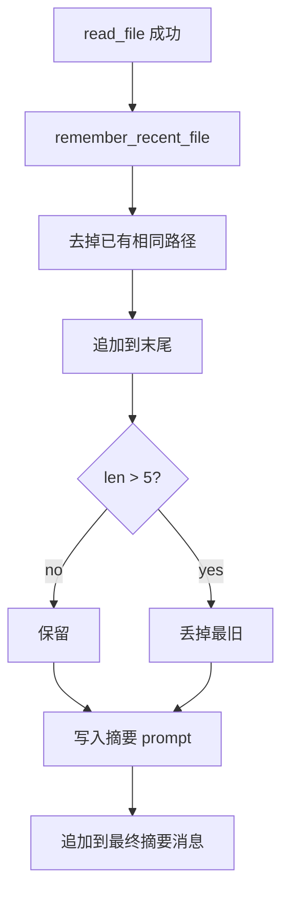
```mermaid
flowchart TD
    RF[read_file 成功] --> Remember[remember_recent_file]
    Remember --> Dedup[去掉已有相同路径]
    Dedup --> Push[追加到末尾]
    Push --> Cap{len > 5?}
    Cap -->|yes| Drain[丢掉最旧]
    Cap -->|no| Ok[保留]
    Ok --> Use1[写入摘要 prompt]
    Drain --> Use1
    Use1 --> Use2[追加到最终摘要消息]
```

`remember_recent_file` 仅由最终状态成功的 `read_file`、`write_file`、`edit_file` 与非 dry-run `apply_patch` 喂入，去重保留最近五个路径，作为「失忆保险」。

### 压缩前后对比

`compact_history` 最直观的效果，是移除 assistant / 工具历史，同时保留近期真实 user turn，并追加一条交接摘要。下面用一个具体例子走一遍。

#### 压缩前：`self.runtime.context`（`Vec<Message>`）

随任务不断增长的完整对话，典型形态（角色 / 内容混合）：

```text
[0] User      "帮我给 compact 模块加个 80% 提前触发"
[1] Assistant  推理 + tool_use(read_file compact/mod.rs)
[2] User       ToolResult(compact/mod.rs 全文，~5k 字符)
[3] Assistant  tool_use(read_file agent/mod.rs)
[4] User       ToolResult(mod.rs 片段，~8k 字符)
[5] Assistant  tool_use(bash cargo test)
[6] User       ToolResult(测试日志，~40k 字符)
[7] Assistant  tool_use(edit_file compact/mod.rs)
[8] User       ToolResult("edit applied")
 …             （几十条，累计可达数十万字符 / 逼近 window）
[N] Assistant  "阈值改好了，接着补测试"
```

特征：保留完整的 `tool_use` / `ToolResult` 配对、每一步的推理与中间产物；这也是体积的主要来源。

#### 压缩后：`self.runtime.context`

预算内的近期真实 user turn 会保留，最后追加交接摘要：

```text
[0] User  "帮我给 compact 模块加个 80% 提前触发"
[1] User  "<context-handoff>
           This conversation was compacted so the agent can continue working.

           <LLM 摘要，按 6 点组织：>
           1. 当前目标：给 compact 模块加 80% 提前触发
           2. 关键发现：should_auto_compact 同时使用实际与估算 token
           3. 涉及文件：crates/tact_extensions/src/compact/mod.rs（should_auto_compact）、
              crates/tact_extensions/src/agent/mod.rs（compact_history）
           4. 剩余工作：补单元测试、跑 cargo test
           5. 用户偏好：先加 TODO，后续再优化
           6. 错误：暂无

           Recently accessed files (re-read if you need their contents):
           - crates/tact_extensions/src/compact/mod.rs
           - crates/tact_extensions/src/agent/mod.rs
           </context-handoff>"
```

原来 `[1]`–`[N]` 的所有 `tool_use` / `ToolResult` / 推理**都不在窗口里了**——它们只存在于两个地方：压缩前落盘的 `transcript_<ts>.jsonl`，以及模型自己写的这段摘要。

#### 逐项变化

| 维度 | 压缩前 | 压缩后 |
|------|--------|--------|
| 消息条数 | N 条 | 近期真实 user + **1 条摘要** |
| 角色结构 | User / Assistant / ToolResult 交替 | 仅 **User** turn |
| `tool_use` / `ToolResult` | 完整保留 | **全部丢弃**（只在磁盘 transcript） |
| 推理 / thinking | 保留 | 丢弃（摘要器不产 thinking） |
| 体积 | 可达数十万字符 | 预算内 user + 摘要 ≤ 2k 输出 tokens + 文件清单 |
| 原始细节 | 直接可读 | 靠 `recent_files` 提示重新 `read_file` 找回 |
| 落盘 transcript | — | `.tact/transcripts/transcript_<ts>.jsonl` |

#### 同时被重置的运行时字段

除了 `context` 本身，`compact_history` 还会顺带重置 message-id 窗口与置位压缩状态：

| 字段 | 压缩前 | 压缩后 |
|------|--------|--------|
| `first_message_db_id` | 某个 > 0 的值 | `0` |
| `last_message_db_id` | 某个 > 0 的值 | `0` |
| `llm_call_last_message_id` | 某个 > 0 的值 | `0` |
| `last_token_total` | 压缩前用量 / 摘要调用用量 | `0`（下一轮主循环再写入） |
| `compact_state.has_compacted` | 可能为 `false` | `true` |
| `compact_state.last_summary` | 旧值 / `None` | 本次摘要文本 |
| `stats.compactions` | `k` | `k + 1` |

SQLite 侧同步：`replace_persisted_context` 用重建后的 context 重写 `messages` 表，保证**重开会话不会复活**压缩前的行。

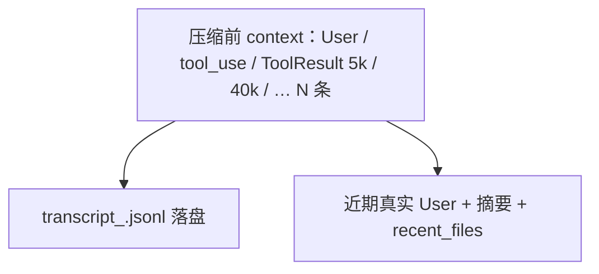
```mermaid
graph TD
    a_before[压缩前 context：User / tool_use / ToolResult 5k / 40k / … N 条] --> b_d0[transcript_<ts>.jsonl 落盘]
    a_before --> c_after[近期真实 User + 摘要 + recent_files]
```

**一句话：** 压缩后模型看到近期 user 意图、它自己写的**交接备忘录**与文件清单；assistant / 工具细节退居磁盘。

---

## 6. 手动压缩：`compact` 工具

模型可通过 `compact` 工具请求压缩（`crates/tact_extensions/src/tool/compact.rs`）。

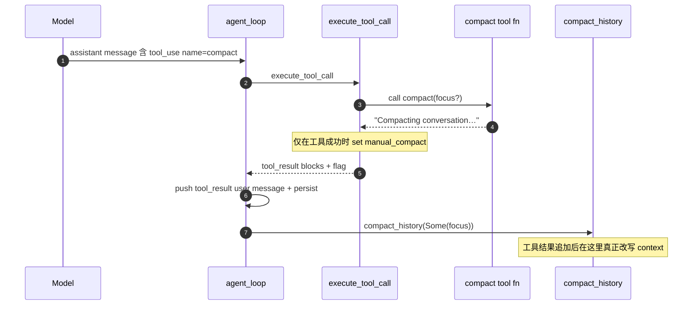
```mermaid
sequenceDiagram
    autonumber
    participant Model
    participant AgentLoop as agent_loop
    participant Dispatch as execute_tool_call
    participant Tool as compact tool fn
    participant CH as compact_history

    Model->>AgentLoop: assistant message 含 tool_use name=compact
    AgentLoop->>Dispatch: execute_tool_call
    Dispatch->>Tool: call compact(focus?)
    Tool-->>Dispatch: "Compacting conversation…"
    Note over Dispatch: 仅在工具成功时 set manual_compact
    Dispatch-->>AgentLoop: tool_result blocks + flag
    AgentLoop->>AgentLoop: push tool_result user message + persist
    AgentLoop->>CH: compact_history(Some(focus))
    Note over CH: 工具结果追加后在这里真正改写 context
```

工具函数几乎是空操作的原因：在工具调用*内部*改写 `runtime.context` 会让对话卡在半空（assistant `tool_use` 没有匹配 result，或摘要只写了一半）。Dispatch 模式先保证线协议合法，再跑 Level 3。可选 `focus` 引导摘要器必须保留的内容。

Dispatch 仅在 compact 调用**成功**时才设置 `manual_compact = Some(focus)` — 被拒绝的调用（非法参数、hook 阻断等）不能改写历史，让模型在下一轮可以恢复。如果 `focus` 是字符串，就复制到标记中；如果缺少 `focus` 或它不是字符串，则设置为 `Some("")`。这个空字符串仍表示“执行手动压缩”，只是不会向 `compact_history` 提供额外重点，后者会忽略它。`None` 才表示没有请求手动压缩或调用失败。正常顺序是：先追加并持久化 tool result，再调用 `compact_history(Some(focus))` 真正改写 context。

---

## 7. 大输出溢出（`persist_large_output`）

与历史压缩无关：单条过大的工具结果不得以全文进入 context。每个成功的原生或 MCP 调用都会应用——**`read_file` 除外**（它已返回有界 PARTIAL 页）：

```rust
if name != "read_file" {
    persist_large_output(&tact_path, tool_use_id, &output)
}
```

| 常量 | 值 |
|------|-----|
| `PERSIST_THRESHOLD` | 30,000 字符 |
| `PREVIEW_CHARS` | 2,000 字符 |

有一个调用方会覆盖该阈值：MCP 条目的 `tools.<name>.output_token_limit` 会按自己的 token 预算通过 `persist_large_output_over_tokens` 落盘那一个工具的结果，信封完全相同。上面这条字符规则仍适用于没有声明该字段的所有工具。条目字段见[第 8 章](./08_chapter_mcp_zh.md)。

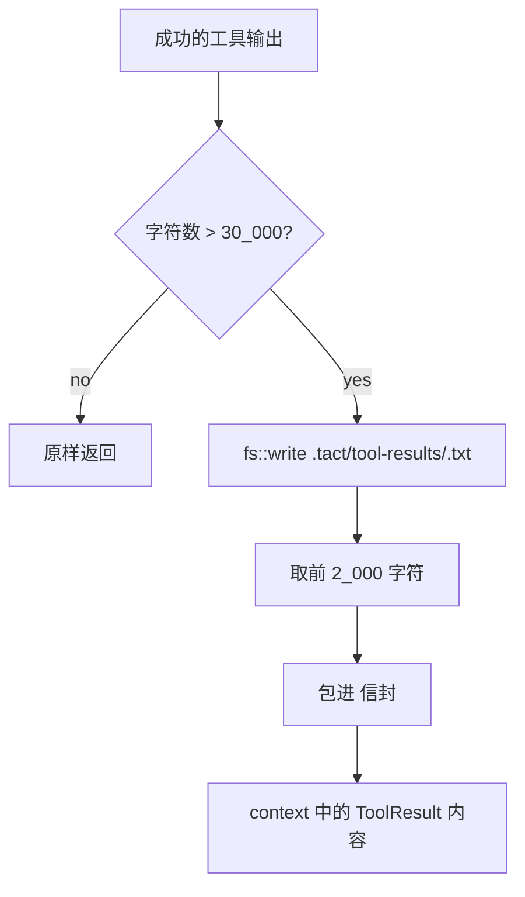
```mermaid
graph TD
    out[成功的工具输出] --> th{字符数 > 30_000?}
    th -->|no| full[原样返回]
    th -->|yes| write[fs::write .tact/tool-results/<tool_use_id>.txt]
    write --> prev[取前 2_000 字符]
    prev --> wrap[包进 <persisted-output> 信封]
    wrap --> tr[context 中的 ToolResult 内容]
```

替换形态：

```xml
<persisted-output>
Full output saved to: .tact/tool-results/<tool_use_id>.txt
Preview:
[first 2000 characters…]
</persisted-output>
```

若落盘失败，该工具步骤会转为失败，而不会把已经丢失全文的结果报告为成功。

### 为什么需要 `<persisted-output>` 标签

标签是**给模型看的，不是给运行时解析的** — 代码库里没有反向匹配它们。它们把整块标成**系统生成的信封**，让 LLM 能分辨：

- “Full output saved to …” / “Preview:” 是框架元数据，不是工具输出
- 本轮结果是刻意落盘（不是静默截断垃圾）  
- 全文可通过路径上的 `read_file` 找回  

没有包裹时，这些行会混进普通 tool-result 文本。与其它 prompt 标记（如 `<skill>`）同一套轻量 XML 风格约定。

### Stub vs 信封

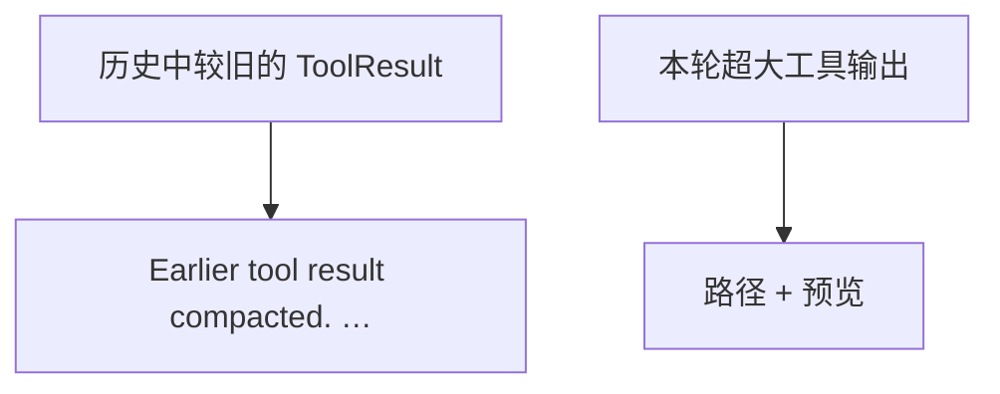
```mermaid
graph TB
    a_m1[历史中较旧的 ToolResult] --> b_m2[Earlier tool result compacted. …]
    c_s1[本轮超大工具输出] --> d_s2[<persisted-output> 路径 + 预览]
```

| 标记 | 时机 | 含义 |
|------|------|------|
| `[Earlier tool result compacted. …]` | Level 2，旧历史 | 正文离开 context；需重读 / 重跑 |
| `<persisted-output>…</persisted-output>` | Level 1，本轮 | 全文在磁盘；context 里是预览 + 路径 |

---

## 8. 磁盘布局

压缩通过 `TactPath` 在 workdir 下溢出两类产物：

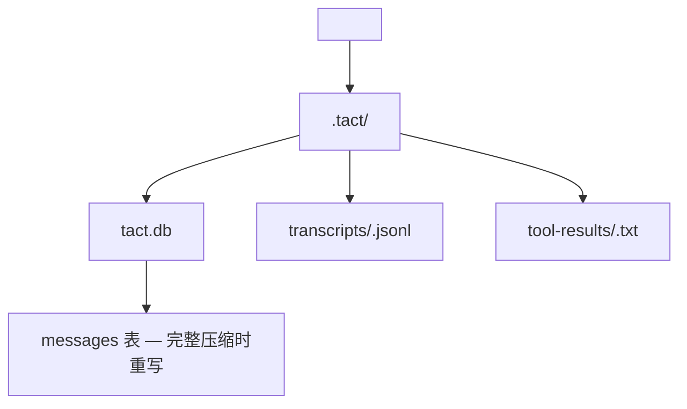
```mermaid
graph TD
    a_wd[<workdir>] --> b_tact[.tact/]
    b_tact --> c_db[tact.db]
    c_db --> d_msg[messages 表 — 完整压缩时重写]
    b_tact --> e_tr[transcripts/<ts>.jsonl]
    b_tact --> f_or[tool-results/<id>.txt]
```

| 路径 | 写入方 | 内容 |
|------|--------|------|
| `.tact/transcripts/transcript_<ts>.jsonl` | `write_transcript` | 压缩前完整对话 |
| `.tact/tool-results/<id>.txt` | `persist_large_output` | 超大原生/MCP 输出全文 |
| `.tact/tact.db` messages | `replace_session_messages` | 本地压缩后的保留 user + 摘要 context |
| `.tact/tact.db` messages + `responses_states` | `replace_session_messages_and_provider_state` | Responses 原生压缩：逻辑 context 与协议基线在**同一事务**里替换，避免磁盘上分叉 |

每次写入后，每个溢出目录最多保留修改时间最新的 100 个文件；更旧的普通文件会被删除。

---

## 9. 配置

| 设置 | 默认 | 作用 |
|------|------|------|
| `agent.model_context_window`（`--model-context-window`） | 200,000 | Token 窗口：80% 时自动压缩 + TUI 用量条；非零时必须大于 `max_tokens`。解析顺序：CLI > `[agent]` > 模型→窗口映射（如 `deepseek-v4-pro` → 1M）> 默认值 |
| `agent.max_tokens` | 8,000（Kimi K2.x 32,000） | 回复预算、压缩重建时的预留、自动触发的预留——以及 effort 语义 provider 上摘要信封的**下限**（以「指令仍放得下」封顶）；budget 语义 provider 仍保持经典 `min(窗口 × 20%, 2,000)` 文本上限 |
| `agent.micro_compact_enabled`（`--no-micro-compact`） | **`false`** | 每轮 stub 的开关。默认关闭（opt-in）：TOML 里写 `true` 才启用；`--no-micro-compact` 只能强制关闭，无法开启 |

经 `crates/tact_extensions/src/config/` 分层解析（CLI > TOML > 默认）。编译期常量（`KEEP_RECENT_TOOL_RESULTS`、`PERSIST_THRESHOLD` …）**尚不可配置**。

---

## 10. 代码地图

| 文件 | 职责 |
|------|------|
| `crates/tact_extensions/src/compact/mod.rs` | `micro_compact`、`should_auto_compact`、`estimate_context_tokens`、`collect_user_messages`、`build_compacted_history`、`write_transcript`、`persist_large_output`、`compacted_context`、`CompactState` |
| `crates/tact_extensions/src/agent/mod.rs` | 循环触发；`compact_history` / `compact_history_legacy`；`remember_recent_file`；`replace_persisted_context` |
| `crates/tact_extensions/src/agent/tool_dispatch.rs` | 原生/MCP 结果的 `persist_large_output`；`manual_compact` flag；近期文件追踪 |
| `crates/tact_extensions/src/tool/compact.rs` | `compact` 工具 stub + `focus` |
| `crates/tact_extensions/src/recovery.rs` | Prompt-too-long 分类 → 压缩 |
| `crates/tact_extensions/src/consts.rs` | `transcript_dir()`、`tool_results_dir()` |
| `docs/compaction.md` | 行为 / 调参速查 |

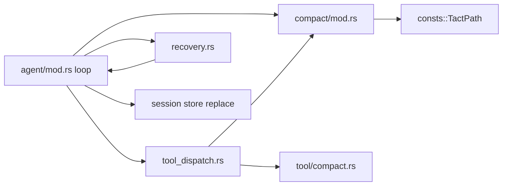
```mermaid
flowchart LR
    Loop[agent/mod.rs loop] --> Compact[compact/mod.rs]
    Loop --> Dispatch[tool_dispatch.rs]
    Dispatch --> Compact
    Dispatch --> CompactTool[tool/compact.rs]
    Loop --> Recovery[recovery.rs]
    Recovery --> Loop
    Compact --> Paths[consts::TactPath]
    Loop --> Store[session store replace]
```

---

## 11. 当前缺口

| 缺口 | 细节 |
|------|------|
| 冷启动 / 工具后 token 估算 | ASCII 按约 4 字符/token、非 ASCII 按 1 字符/token 的保守估算；有实际用量时仍 OR 此估算，以覆盖 tool result 追加后的膨胀 |
| 简易用量百分比 | 用量条为 `used / model_context_window`（尚无 Codex 12K baseline / effective-window 算法） |
| 只摘要近期 20k 估算 token | 早期回合只留在 transcript 里；handoff cell 会点明该文件（但「哪些回合被摘要掉」仍由尾部截断决定，而不是按重要性挑选） |
| Stub 阈值固定 | 12 / 120 / 30k 是编译期常量 |

### 11.1 Micro Compact 已知问题

微截断（Tier 2）以节省上下文为代价换取可用性。它自 2026-07-24 起**默认关闭**（见 §9），下面这些副作用正是保持 opt-in 的原因；开启后逐一适用：

| 问题 | 描述 |
|------|------|
| **模型失忆** | 之前读取过、后续还会引用的工具结果从上下文中消失，被替换为 stub。如果模型没注意到 stub，可能凭记忆编造内容 |
| **虚假的上下文不匹配** | Diff/patch 操作会失败，因为模型缺少真实文件内容却以为知道——stub 说"请重跑工具"，但 patch 逻辑不一定会触发重读 |
| **额外的不必要重读** | 模型必须 `read_file` 重新读取已截断的内容，浪费了本应节省的 token |
| **悄无声息的正确性风险** | 最危险的情况：模型没意识到信息丢了，继续自信推理，得出错误结论 |
| **粗略的选择策略** | 截断策略纯按新旧 + 长度（保留最近 12 条，更早的 > 120 字符截断）。第 13 条的关键配置文件被截掉，而 12 条无意义的 `ls` 输出反而保留 |
| **前缀缓存污染** | 在支持自动前缀缓存的模型上（OpenAI、DeepSeek），stub 替换会改变某个位置的内容，导致缓存前缀断裂。第一条被截断的工具结果之后的所有前缀都会被失效，下一次请求必然 cache miss——截断"省下"的 token 远小于重建缓存的成本。参考：[OpenAI Prompt Caching](https://platform.openai.com/docs/guides/prompt-caching)、[DeepSeek KV Cache](https://api-docs.deepseek.com/guides/kv_cache)。Claude 受影响较小，因为它使用显式的 `cache_control` 断点（[Prompt Caching](https://docs.anthropic.com/en/docs/build-with-claude/prompt-caching)），且通常标记在 tool results 之前的位置 |

### 11.2 规划中的优化

| 想法 | 描述 | 优先级 |
|------|------|--------|
| **上下文窗口阈值触发** | 仅在上下文使用量超过阈值（如 `model_context_window` 的 50%）时才运行 micro_compact，而非每轮都跑。这样在大部分会话中保持前缀缓存完整，只在真正有内存压力时才截断——也是让 micro-compact 能安全恢复默认开启的前提 | 高 |
| **选择性工具截断** | 排除已自带边界的工具免于截断（如 `read_file` 分页结果），因它们的输出很可能被再次引用。仅截断 `ls`、`echo`、`bash` 等瞬态输出。同时保护前缀缓存不被频繁失效 | 高 |
| **语义重要性评分** | 对工具结果按重要性打分（如后续是否有引用它的轮次），即使旧的也保留重要的 | 中 |
| **可配置阈值** | 将 `KEEP_RECENT_TOOL_RESULTS` 和 120 字符 stub 阈值改为运行时可配置，而非编译期常量 | 低 |
| **Stub 感知的提示** | 改进系统提示，让模型在面对截断内容时一致地重读而非猜测 | 中 |

---

## 相关文档

- [Error Recovery](./06_chapter_recovery_zh.md) — 作为 prompt-too-long 策略的压缩  
- [Agent Main Loop](./18_chapter_agent_loop_zh.md) — 这些挂钩周围的完整循环  
- [System Prompt](./04_chapter_prompt_zh.md) — 每轮重建；含压缩工具指引  
- [Store and Persistence](./01_chapter_store_zh.md) — 压缩后的会话消息重写  
- [Tasks and Tool Scheduling](./11_chapter_task_zh.md) — dispatch 中检测 `manual_compact`  
- [docs/compaction.md](../docs/compaction.md) — 调参笔记  
- [ARCHITECTURE.md](../ARCHITECTURE.md) — §6 上下文压缩  
- [英文原文](./05_chapter_compact_zh.md)
