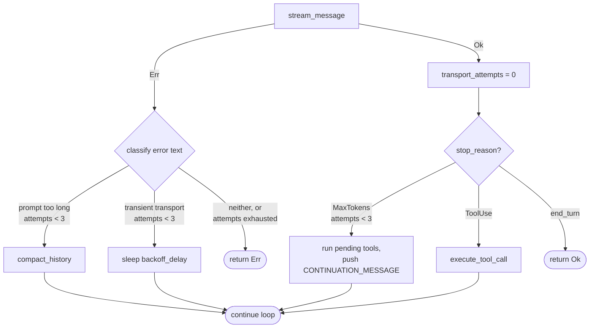

# Error Recovery

This chapter explains how Tact's agent loop **survives failures without losing the session**: transient transport errors are retried with exponential back-off, oversized prompts trigger context compaction, and truncated model output is continued mid-sentence. The classification logic lives in `crates/tact/src/recovery.rs`; the decisions are wired into `agent_loop` in `crates/tact/src/agent/mod.rs`.

For the full loop structure see [Agent Main Loop](./18_chapter_agent_loop.md).

Recovery works hand-in-hand with [Context Compaction](./05_chapter_compact.md) — one of the three strategies *is* compaction.

---

## 1. Three Recovery Strategies

Every failure the loop can recover from falls into one of three categories, each with its own attempt counter in `RecoveryState`:

| Strategy | Trigger | Action | Counter |
|----------|---------|--------|---------|
| **Compact** | LLM error matching `is_prompt_too_long_error` | `compact_history()` then retry the turn | `compact_attempts` |
| **Backoff** | LLM error matching `is_transient_transport_error` | Sleep `backoff_delay(attempt)` then retry | `transport_attempts` |
| **Continue** | Stream succeeded but `stop_reason = MaxTokens` | Append `CONTINUATION_MESSAGE` as a user turn | `continuation_attempts` |

All three share the same cap:

```rust
pub const MAX_RECOVERY_ATTEMPTS: u32 = 3;
```

When a counter exceeds the cap (or the error matches no category), `agent_loop` returns the error and the turn fails for real.

---

## 2. Data Model

```rust
#[derive(Debug, Default)]
pub struct RecoveryState {
    pub continuation_attempts: u32,
    pub compact_attempts: u32,
    pub transport_attempts: u32,
}
```

`RecoveryState` lives on `AgentRuntime` next to `CompactState` and is **reset to default at the start of every `agent_loop` call** — counters do not carry over between user tasks.

Counter reset rules *within* a loop:

| Counter | Reset when |
|---------|------------|
| `transport_attempts` | Any successful `stream_message` call |
| `continuation_attempts` | Any response that did **not** stop on `MaxTokens` |
| `compact_attempts` | Never reset mid-loop (only on next `agent_loop`) |

---

## 3. Error Classification

Both classifiers work on the **lowercased error string** (`error.to_string().to_lowercase()`), not on typed errors — the LLM layer surfaces provider failures as text.

### Prompt too long

```rust
pub fn is_prompt_too_long_error(error_text: &str) -> bool {
    (error_text.contains("prompt") && error_text.contains("long"))
        || error_text.contains("overlong_prompt")
        || error_text.contains("too many tokens")
        || error_text.contains("context length")
}
```

### Transient transport

Matches any of these substrings: `timeout`, `timed out`, `rate limit`, `too many requests`, `unavailable`, `connection`, `overloaded`, `temporarily`, `econnreset`, `broken pipe`.

Classification order matters: prompt-too-long is checked **first**, so an error that mentions both context length and a connection issue compacts rather than retries.

---

## 4. Backoff Delay

```rust
pub fn backoff_delay(attempt: u32) -> Duration {
    // min(1s × 2^attempt, 30s) + random(0..1s)
}
```

| Attempt | Base delay |
|---------|-----------|
| 0 | 1s |
| 1 | 2s |
| 2 | 4s |
| … | capped at 30s |

The jitter component is derived from the system clock's sub-second milliseconds — cheap, no RNG dependency, but not cryptographically random (it doesn't need to be).

---

## 5. Recovery Flow in agent_loop



Each recovery emits an `AgentUpdate::Info` line visible in the TUI, e.g.:

```text
[Recovery] compact (1/3): context too large
[Recovery] backoff (2/3): retrying in 4.3s
[Recovery] continue (1/3): output truncated
```

---

## 6. Output-Limit Continuation

When the model stops on `MaxTokens`, the response is truncated but already pushed into context. Before continuing, the loop handles a subtle correctness issue: **pending tool calls**. OpenAI-style APIs require every assistant `tool_calls` message to be immediately followed by tool results, so any tool-use blocks that arrived before the cutoff are executed and their results appended *first*. Only then does the loop push:

```rust
pub const CONTINUATION_MESSAGE: &str =
    "Output limit hit. Continue directly from where you stopped. \
No recap, no repetition. Pick up mid-sentence if needed.";
```

The continuation message is persisted to the session store like any user message, so restored sessions replay correctly.

### A subtle 400 risk: empty assistant messages

Truncation is not the only way continuation can fail. The internal context stores Anthropic-shaped messages; when they are converted to OpenAI format in `crates/tact_llm/src/convert.rs`, **thinking blocks are dropped for non-Kimi providers**. If the truncated turn (or even a normal turn) contained only a thinking block and no text or tool calls, the resulting assistant message becomes:

```json
{ "role": "assistant", "content": null, "tool_calls": null }
```

OpenAI-compatible APIs reject this. The same invalid shape appears when a truncated turn includes orphaned `tool_calls` that are not followed by matching tool-result messages.

The current workaround is `sanitize_assistant_messages` in `convert.rs`:

```rust
// Ensure the assistant message is not empty. This can happen when the
// only content was a thinking block that gets dropped for non-Kimi
// providers, or when the response was truncated before emitting text.
if !has_tool_calls_now && assistant.content.as_deref().unwrap_or("").is_empty() {
    assistant.content =
        Some("[Assistant response was empty or truncated. Continuing...]".to_string());
}
```

It stubs empty assistant messages and strips orphaned tool calls on **every** outgoing request, not only during recovery. A cleaner long-term fix would be to avoid adding empty assistant turns to `context` in `agent_loop` rather than patching them at request time. See the `REVIEW` comments in `crates/tact/src/agent/mod.rs` and `crates/tact_llm/src/convert.rs`.

---

## 7. Code Map

| File | Role |
|------|------|
| `crates/tact/src/recovery.rs` | `RecoveryState`, classifiers, `backoff_delay`, `CONTINUATION_MESSAGE`, `MAX_RECOVERY_ATTEMPTS` |
| `crates/tact/src/agent/mod.rs` | Recovery branches in `agent_loop`; counter resets; `compact_history` invocation |
| `crates/tact/src/compact.rs` | Compaction primitives used by the compact strategy |
| `docs/state_machines.md` | State-machine diagrams including recovery transitions |

---

## 8. Current Gaps

| Gap | Detail |
|-----|--------|
| String-based classification | Matching on lowercased error text is fragile; a provider rewording breaks detection |
| Broad transport patterns | `"connection"` matches many unrelated errors (e.g. a tool error echoed into an LLM failure) |
| `compact_attempts` never resets mid-loop | Three prompt-too-long errors anywhere in a long session exhaust the budget permanently for that loop |
| Empty assistant workaround is post-hoc | `sanitize_assistant_messages` patches empty assistant messages after they are already in context; the real fix is to avoid persisting them in `agent_loop` |
| No retry for `create_message` | `compact_history`'s own summarization call has no recovery — a transient failure there aborts the loop |
| Clock-based jitter | Sub-second timestamp is deterministic under some schedulers; simultaneous retries may collide |
| No user-configurable cap | `MAX_RECOVERY_ATTEMPTS` and delays are compile-time constants |

---

## Related Docs

- [Context Compaction](./05_chapter_compact.md) — what `compact_history` actually does
- [Store and Persistence](./01_chapter_store.md) — how continuation messages are persisted
- [ARCHITECTURE.md](../ARCHITECTURE.md) — §6 recovery mechanisms table
- [docs/state_machines.md](../docs/state_machines.md) — recovery state diagrams
