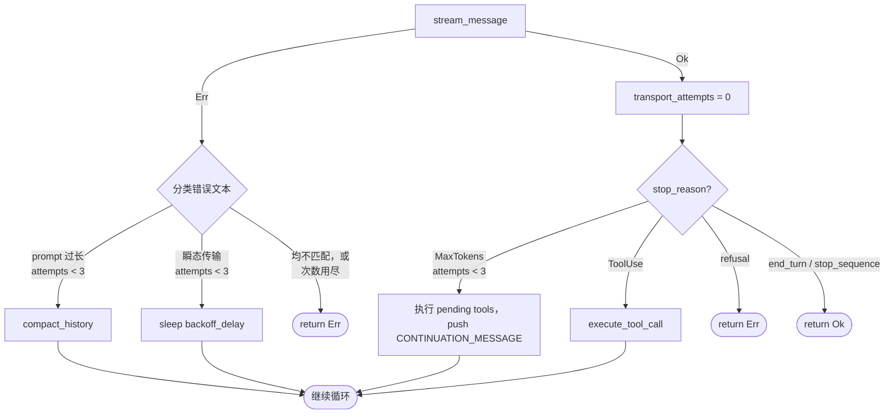

# 错误恢复（Error Recovery）

> 语言：[中文](./06_chapter_recovery_zh.md) · [English](./06_chapter_recovery.md)

本章说明 Tact 的 agent 循环如何在**不丢失会话**的前提下扛过失败：瞬态传输错误用指数退避重试，过大的 prompt 触发上下文压缩，被截断的模型输出则在句中续写。分类逻辑在 `crates/tact/src/recovery.rs`；决策接入 `crates/tact/src/agent/mod.rs` 中的 `agent_loop`。

完整循环结构见 [Agent 主循环](./18_chapter_agent_loop.md)（英文）。

恢复与 [上下文压缩](./05_chapter_compact_zh.md) 协同工作——三种策略之一**就是**压缩。

---

## 1. 三种恢复策略

循环能恢复的每一种失败都归入三类之一，各自在 `RecoveryState` 中有独立计数器：

| 策略 | 触发条件 | 动作 | 计数器 |
|------|----------|------|--------|
| **Compact** | LLM 错误匹配 `is_prompt_too_long_error` | `compact_history()` 后重试本轮 | `compact_attempts` |
| **Backoff** | LLM 错误匹配 `is_transient_transport_error` | 睡眠 `backoff_delay(attempt)` 后重试 | `transport_attempts` |
| **Continue** | 流式成功但 `stop_reason = MaxTokens` | 追加 `CONTINUATION_MESSAGE` 作为用户轮次 | `continuation_attempts` |

三者共用同一上限：

```rust
pub const MAX_RECOVERY_ATTEMPTS: u32 = 3;
```

当某计数器超过上限（或错误不匹配任何类别）时，`agent_loop` 返回错误，本轮真正失败。

---

## 2. 数据模型

```rust
#[derive(Debug, Default)]
pub struct RecoveryState {
    pub continuation_attempts: u32,
    pub compact_attempts: u32,
    pub transport_attempts: u32,
}
```

`RecoveryState` 位于 `AgentRuntime` 上，与 `CompactState` 相邻，**在每次 `agent_loop` 调用开始时重置为默认值**——计数器不会在用户任务之间延续。

循环*内部*的计数器重置规则：

| 计数器 | 重置时机 |
|--------|----------|
| `transport_attempts` | 任意一次成功的 `stream_message` 调用 |
| `continuation_attempts` | 任意一次**未**因 `MaxTokens` 停止的响应 |
| `compact_attempts` | 循环中途从不重置（仅在下次 `agent_loop` 时重置） |

---

## 3. 错误分类

两个分类器都作用于**小写化的错误字符串**（`error.to_string().to_lowercase()`），而非类型化错误——LLM 层把 provider 失败以文本形式抛出。

### Prompt 过长

```rust
pub fn is_prompt_too_long_error(error_text: &str) -> bool {
    (error_text.contains("prompt") && error_text.contains("long"))
        || error_text.contains("overlong_prompt")
        || error_text.contains("too many tokens")
        || error_text.contains("context length")
}
```

### 瞬态传输

匹配以下任一子串：`timeout`、`timed out`、`rate limit`、`too many requests`、`unavailable`、`connection`、`overloaded`、`temporarily`、`econnreset`、`broken pipe`。

分类顺序很重要：prompt-too-long **优先**检查，因此同时提到上下文长度与连接问题的错误会走压缩而非重试。

---

## 4. 退避延迟

```rust
pub fn backoff_delay(attempt: u32) -> Duration {
    // min(1s × 2^attempt, 30s) + random(0..1s)
}
```

| 尝试次数 | 基础延迟 |
|----------|----------|
| 0 | 1s |
| 1 | 2s |
| 2 | 4s |
| … | 上限 30s |

抖动分量来自系统时钟的亚秒毫秒——廉价、无 RNG 依赖，但并非密码学随机（也不需要是）。

---

## 5. agent_loop 中的恢复流程



每次恢复都会在 TUI 中发出一行 `AgentUpdate::Info`，例如：

```text
[Recovery] compact (1/3): context too large
[Recovery] backoff (2/3): retrying in 4.3s
[Recovery] continue (1/3): output truncated
```

---

## 6. 输出上限续写

当模型因 `MaxTokens` 停止时，响应已被截断但已写入上下文。续写前，循环要处理一个微妙的正确性问题：**pending 的工具调用**。OpenAI 风格 API 要求每条 assistant `tool_calls` 消息必须紧接工具结果，因此在 cutoff 之前到达的 tool-use 块会先被执行，结果追加*在前*。然后循环才 push：

```rust
pub const CONTINUATION_MESSAGE: &str =
    "Output limit hit. Continue directly from where you stopped. \
No recap, no repetition. Pick up mid-sentence if needed.";
```

续写消息会像普通用户消息一样持久化到 session store，恢复会话时可正确回放。

### 微妙的 400 风险：空 assistant 消息

截断并非续写失败的唯一原因。内部 context 存 Anthropic 形态消息；在 `crates/tact_llm/src/convert.rs` 转为 OpenAI 格式时，**非 Kimi provider 会丢弃 thinking 块**。若被截断轮次（或甚至普通轮次）只有 thinking 块、没有文本或 tool call，得到的 assistant 消息会变成：

```json
{ "role": "assistant", "content": null, "tool_calls": null }
```

OpenAI 兼容 API 会拒绝此形态。当截断轮次包含 orphaned `tool_calls` 且后面没有匹配的 tool-result 消息时，同样会出现非法形态。

当前变通在 `convert.rs` 的 `sanitize_assistant_messages`：

```rust
// Ensure the assistant message is not empty. This can happen when the
// only content was a thinking block that gets dropped for non-Kimi
// providers, or when the response was truncated before emitting text.
if !has_tool_calls_now && assistant.content.as_deref().unwrap_or("").is_empty() {
    assistant.content =
        Some("[Assistant response was empty or truncated. Continuing...]".to_string());
}
```

它在**每次**外发请求时 stub 空 assistant 消息并剥离 orphaned tool call，不仅限于恢复路径。更干净的长远修复是在 `agent_loop` 里避免把空 assistant 轮次加入 `context`，而不是在请求时打补丁。见 `crates/tact/src/agent/mod.rs` 与 `crates/tact_llm/src/convert.rs` 中的 `REVIEW` 注释。

---

## 7. 代码地图

| 文件 | 职责 |
|------|------|
| `crates/tact/src/recovery.rs` | `RecoveryState`、分类器、`backoff_delay`、`CONTINUATION_MESSAGE`、`MAX_RECOVERY_ATTEMPTS` |
| `crates/tact/src/agent/mod.rs` | `agent_loop` 中的恢复分支；计数器重置；`compact_history` 调用 |
| `crates/tact/src/compact.rs` | compact 策略使用的压缩原语 |
| `docs/state_machines.md` | 含恢复转移的状态机图 |

---

## 8. 当前缺口

| 缺口 | 说明 |
|------|------|
| 基于字符串的分类 | 对小写错误文本做匹配很脆弱；provider 改措辞就会漏检 |
| 过宽的传输模式 | `"connection"` 会匹配许多无关错误（例如 echo 进 LLM 失败的 tool 错误） |
| `compact_attempts` 循环内从不重置 | 长会话中任意三次 prompt-too-long 就会耗尽该 loop 的预算 |
| 空 assistant 变通是事后补丁 | `sanitize_assistant_messages` 在消息已在 context 里之后才修补；真正修复应是在 `agent_loop` 避免持久化 |
| `create_message` 无重试 | `compact_history` 自身的摘要调用没有恢复——瞬态失败会直接中止循环 |
| 基于时钟的抖动 | 亚秒时间戳在某些调度器下可预测；同时重试可能碰撞 |
| 无用户可配置上限 | `MAX_RECOVERY_ATTEMPTS` 与延迟是编译期常量 |

---

## Related Docs

- [上下文压缩](./05_chapter_compact_zh.md) — `compact_history` 实际做了什么
- [Store 与持久化](./01_chapter_store_zh.md) — 续写消息如何持久化
- [ARCHITECTURE.md](../ARCHITECTURE.md) — §6 恢复机制表
- [docs/state_machines.md](../docs/state_machines.md) — 恢复状态图
