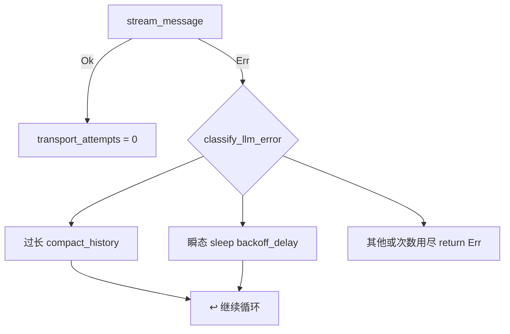
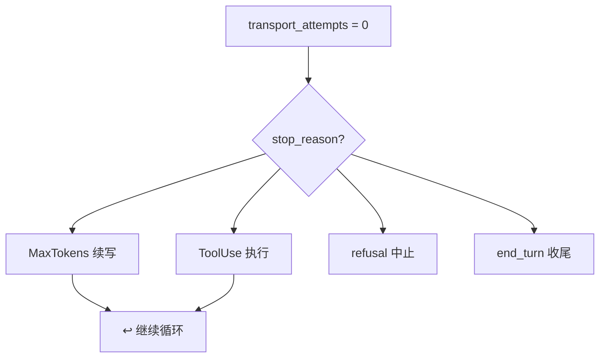

# 错误恢复（Error Recovery）

本章说明 Tact 的 agent 循环如何在**不丢失会话**的前提下扛过失败：瞬态传输错误用指数退避重试，过大的 prompt 触发上下文压缩，被截断的模型输出则在句中续写。分类逻辑在 `crates/tact_extensions/src/recovery.rs`；决策接入 `crates/tact_extensions/src/agent/mod.rs` 中的 `agent_loop`。

完整循环结构见 [Agent 主循环](./18_chapter_agent_loop_zh.md)（英文）。

恢复与 [上下文压缩](./05_chapter_compact_zh.md) 协同工作——三种策略之一**就是**压缩。

---

## 1. 三种恢复策略

循环能恢复的每一种失败都归入三类之一，各自在 `RecoveryState` 中有独立计数器：

| 策略 | 触发条件 | 动作 | 计数器 |
|------|----------|------|--------|
| **Compact** | 错误分类为 `PromptTooLong`（见 §3） | `compact_history()` 后重试本轮 | `compact_attempts` |
| **Backoff** | 错误分类为 `Transient`（见 §3） | 睡眠 `backoff_delay(attempt)` 后重试 | `transport_attempts` |
| **Continue** | 流式成功但 `stop_reason = MaxTokens` | 追加 `CONTINUATION_MESSAGE` 作为用户轮次 | `continuation_attempts` |

三者**各有自己的上限**，不共用一个数（`crates/tact_extensions/src/recovery.rs`）：

```rust
pub const MAX_COMPACT_ATTEMPTS: u32 = 3;       // prompt-too-long 压缩重试
pub const MAX_TRANSPORT_ATTEMPTS: u32 = 10;    // 瞬态网络重试
pub const MAX_CONTINUATION_ATTEMPTS: u32 = 3;  // MaxTokens 续写
```

传输错误更宽容（长任务可能连续遇到多次间歇失败），压缩与续写各 3 次。另有两个只属于**摘要调用内部**的预算，不是循环级计数器：`MAX_COMPACT_SUMMARY_RETRY_ATTEMPTS`（5，摘要调用的瞬态重试）与 `MAX_COMPACT_SUMMARY_ATTEMPTS`（5，截断续写，见 [上下文压缩](./05_chapter_compact_zh.md) §5）。

当某计数器超过上限（或错误不匹配任何类别）时，`agent_loop` 返回错误，本轮真正失败。

---

## 2. 数据模型

```rust
#[derive(Debug, Default)]
pub struct RecoveryState {
    pub continuation_attempts: u32,
    pub compact_attempts: u32,
    pub transport_attempts: u32,
}
```

`RecoveryState` 位于 `AgentRuntime` 上，与 `CompactState` 相邻，**在每次 `agent_loop` 调用开始时重置为默认值**——计数器不会在用户任务之间延续。

循环*内部*的计数器重置规则：

| 计数器 | 重置时机 |
|--------|----------|
| `transport_attempts` | 任意一次成功的 `stream_message` 调用 |
| `continuation_attempts` | 任意一次**未**因 `MaxTokens` 停止的响应 |
| `compact_attempts` | 循环中途从不重置（仅在下次 `agent_loop` 时重置） |

---

## 3. 错误分类

入口是 `classify_llm_error` / `classify_error`，**先看类型，再退回文本**：

1. **类型优先。** `LlmError::HttpError { status, .. }` 直接按状态码判定：`429` / `408` 与所有 `5xx` 是 `Transient`（`is_transient_http_status`），其余 `4xx` 先不急着判死——过长的 prompt 通常也报 400，所以非瞬态状态码还会再做一次文本判定，能识别成 `PromptTooLong` 就仍可恢复。
2. **文本兜底。** 没有状态码的错误（`Request` / `Auth` 等，以及传输层以 reqwest 散文形式到达的失败）走 `classify_text`：小写化后匹配下面的子串。
3. `classify_error` 在 `anyhow::Error` 上先 `downcast_ref::<LlmError>()`——`Agent::stream_message` 保留了类型化 cause，因此循环实际走的是类型路径；downcast 失败才退化为纯文本。

文本兜底之所以仍存在：没有类型就没有办法把一个 429 和一句读起来像 429 的散文区分开（测试 `boxed_errors_are_classified_through_the_typed_cause` 钉住这一点）。

### Prompt 过长

```rust
pub fn is_prompt_too_long_error(error_text: &str) -> bool {
    (error_text.contains("prompt") && error_text.contains("long"))
        || error_text.contains("overlong_prompt")
        || error_text.contains("too many tokens")
        || error_text.contains("context length")
}
```

### 瞬态传输

匹配以下任一子串：`timeout`、`timed out`、`rate limit`、`too many requests`、`unavailable`、`connection`、`overloaded`、`temporarily`、`econnreset`、`broken pipe`、`http request failed`、`error sending request`。

分类顺序很重要：prompt-too-long **优先**检查，因此同时提到上下文长度与连接问题的错误会走压缩而非重试。

---

## 4. 退避延迟

```rust
pub fn backoff_delay(attempt: u32) -> Duration {
    // min(1s × 2^attempt, 30s) + random(0..1s)
}
```

| 尝试次数 | 基础延迟 |
|----------|----------|
| 0 | 1s |
| 1 | 2s |
| 2 | 4s |
| … | 上限 30s |

抖动分量来自系统时钟的亚秒毫秒——廉价、无 RNG 依赖，但并非密码学随机（也不需要是）。

---

## 5. agent_loop 中的恢复流程

**发送失败时分类错误（类型优先，文本兜底）：**


```mermaid
graph TD
    a_send[stream_message] -->|Ok| b_reset[transport_attempts = 0]
    a_send -->|Err| c_classify{classify_llm_error}
    c_classify --> d_compact[过长 compact_history]
    c_classify --> e_sleep[瞬态 sleep backoff_delay]
    c_classify --> f_fail[其他或次数用尽 return Err]
    d_compact --> z_retry[↩ 继续循环]
    e_sleep --> z_retry
```

**正常返回后按 `stop_reason` 收尾：**


```mermaid
graph TD
    a_reset[transport_attempts = 0] --> b_stop{stop_reason?}
    b_stop --> c_cont[MaxTokens 续写]
    b_stop --> d_tools[ToolUse 执行]
    b_stop --> e_refuse[refusal 中止]
    b_stop --> f_done[end_turn 收尾]
    c_cont --> z_retry[↩ 继续循环]
    d_tools --> z_retry
```

（两张图各自成环回到循环顶；渲染器不支持环，故用 `↩ 继续循环` 表示。）

每次恢复都会在 TUI 中发出一行 `AgentUpdate::Info`，例如：

```text
[Recovery] compact (1/3): context too large
[Recovery] backoff (2/10): retrying in 4.3s — http request failed: error sending request for url
[Recovery] continue (1/3): output truncated
```

`backoff` 与 `compact retry` 行会追加底层错误（通过 `error_summary` 折叠为单行、超过 200 字符截断），因此重试不仅说明何时，还会说明*为什么*重试。

对于输出上限恢复，第 1 次续写使用直接接续提示。如果模型再次被截断，第 2、3 次续写切换到收敛提示：停止扩展分析，不再重复场景，只返回包含结论、已确认问题和最小修复建议的简洁结构化结果。尝试计数和最多 3 次的上限保持不变。

---

## 6. 输出上限续写

当模型因 `MaxTokens` 停止时，响应已被截断但已写入上下文。续写前，循环要处理一个微妙的正确性问题：**pending 的工具调用**。OpenAI 风格 API 要求每条 assistant `tool_calls` 消息必须紧接工具结果，因此在 cutoff 之前到达的 tool-use 块会先被执行，结果追加*在前*。然后循环才 push：

```rust
pub const CONTINUATION_MESSAGE: &str =
    "Output limit hit. Continue directly from where you stopped. \
No recap, no repetition. Pick up mid-sentence if needed.";

pub const CONVERGENCE_CONTINUATION_MESSAGE: &str =
    "Your response has been truncated repeatedly. Stop expanding the analysis and \
do not revisit the same scenarios. Return only the final actionable result in a \
concise structured format: conclusion, verified issues, and minimal fixes. \
Do not recap, repeat, or speculate.";

pub fn continuation_message(attempt: u32) -> &'static str {
    if attempt <= 1 {
        CONTINUATION_MESSAGE
    } else {
        CONVERGENCE_CONTINUATION_MESSAGE
    }
}
```

续写消息会像普通用户消息一样持久化到 session store，恢复会话时可正确回放，包括阶段切换。

### 微妙的 400 风险：空 assistant 消息

截断并非续写失败的唯一原因。内部 context 存 Anthropic 形态消息；在 `crates/tact_llm/src/convert.rs` 转为 OpenAI 格式时，**非 Kimi provider 会丢弃 thinking 块**。若被截断轮次（或甚至普通轮次）只有 thinking 块、没有文本或 tool call，得到的 assistant 消息会变成：

```json
{ "role": "assistant", "content": null, "tool_calls": null }
```

OpenAI 兼容 API 会拒绝此形态。当截断轮次包含 orphaned `tool_calls` 且后面没有匹配的 tool-result 消息时，同样会出现非法形态。

当前变通在 `convert.rs` 的 `sanitize_assistant_messages`：

```rust
// Ensure the assistant message is not empty. This can happen when the
// only content was a thinking block that gets dropped for non-Kimi
// providers, or when the response was truncated before emitting text.
if !has_tool_calls_now && assistant.content.as_deref().unwrap_or("").is_empty() {
    assistant.content =
        Some("[Assistant response was empty or truncated. Continuing...]".to_string());
}
```

它在**每次**外发请求时 stub 空 assistant 消息并剥离 orphaned tool call，不仅限于恢复路径。更干净的长远修复是在 `agent_loop` 里避免把空 assistant 轮次加入 `context`，而不是在请求时打补丁。见 `crates/tact_extensions/src/agent/mod.rs` 与 `crates/tact_llm/src/convert.rs` 中的 `REVIEW` 注释。

---

## 7. 代码地图

| 文件 | 职责 |
|------|------|
| `crates/tact_extensions/src/recovery.rs` | `RecoveryState`、分类器（`classify_llm_error` / `classify_error` / `classify_text`）、`is_transient_http_status`、`backoff_delay`、`CONTINUATION_MESSAGE`、`MAX_COMPACT_ATTEMPTS` / `MAX_TRANSPORT_ATTEMPTS` / `MAX_CONTINUATION_ATTEMPTS` |
| `crates/tact_extensions/src/agent/mod.rs` | `agent_loop` 中的恢复分支；计数器重置；`compact_history` 调用 |
| `crates/tact_extensions/src/compact/mod.rs` | compact 策略使用的压缩原语 |
| `docs/state_machines.md` | 含恢复转移的状态机图 |

---

## 8. 当前缺口

| 缺口 | 说明 |
|------|------|
| 文本兜底仍脆弱 | 有类型时按状态码判定；但 `Request` / `Auth` 一类无状态码的失败仍靠小写子串匹配，provider 改措辞就会漏检 |
| 过宽的传输模式 | `"connection"` 会匹配许多无关错误（例如 echo 进 LLM 失败的 tool 错误） |
| `compact_attempts` 循环内从不重置 | 长会话中任意三次 prompt-too-long 就会耗尽该 loop 的预算 |
| 空 assistant 变通是事后补丁 | `sanitize_assistant_messages` 在消息已在 context 里之后才修补；真正修复应是在 `agent_loop` 避免持久化 |
| 基于时钟的抖动 | 亚秒时间戳在某些调度器下可预测；同时重试可能碰撞 |
| 无用户可配置上限 | `MAX_COMPACT_ATTEMPTS` / `MAX_TRANSPORT_ATTEMPTS` / `MAX_CONTINUATION_ATTEMPTS` 与延迟都是编译期常量 |

---

## Related Docs

- [上下文压缩](./05_chapter_compact_zh.md) — `compact_history` 实际做了什么
- [Store 与持久化](./01_chapter_store_zh.md) — 续写消息如何持久化
- [ARCHITECTURE.md](../ARCHITECTURE.md) — §6 恢复机制表
- [docs/state_machines.md](../docs/state_machines.md) — 恢复状态图
