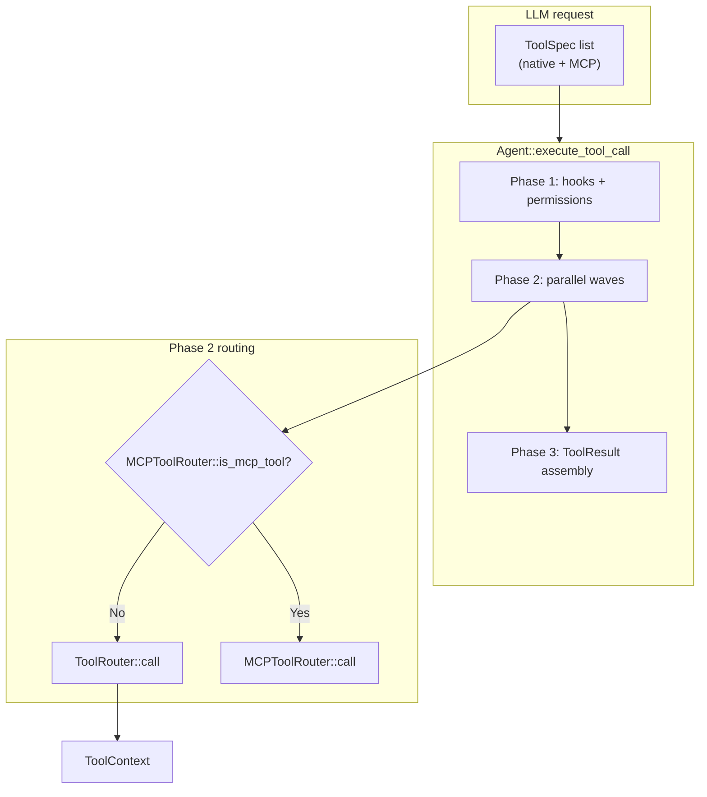

# Tool System

This chapter explains how Tact defines, registers, and executes **native tools**: the `Tool` trait, shared `ToolContext`, `ToolRouter` dispatch, the main vs sub-agent tool sets, workspace path safety, and the `#[tool]` proc macro.

MCP tools follow a parallel path through `MCPToolRouter` — see [MCP Protocol and Agent Integration](./01_chapter_mcp.md). The three-phase execution pipeline (pre-flight, parallel waves, results) is covered in [Tasks and Tool Scheduling](./03_chapter_task.md).

---

## 1. What the Tool System Does

Every capability the LLM can invoke natively implements `Tool`:

```rust
#[async_trait]
pub trait Tool: Send + Sync {
    fn name(&self) -> &'static str;
    fn description(&self) -> &'static str;
    fn input_schema(&self) -> Value;
    async fn call(&self, context: ToolContext, input: Value) -> Result<String>;
}
```

| Component | Responsibility |
|-----------|------------------|
| `Tool` | Name, JSON schema, async handler |
| `ToolContext` | Shared session state passed to every call |
| `ToolRouter` | Name → handler map; `call()` dispatch |
| `toolset()` | Full native tool list for the main agent |
| `subagent_toolset()` | Restricted list for `task` sub-agents |
| `tool_dispatch.rs` | Agent-side routing: native vs MCP, hooks, permissions |

At agent construction, native specs are merged with MCP specs:

```rust
cached_tool_specs = tools.tool_specs().into_iter()
    .chain(mcp_router.all_tools())
    .collect();
```

---

## 2. Architecture Overview



---

## 3. ToolContext

Shared state for all native tool handlers (`crates/tact/src/tool/mod.rs`):

```rust
pub struct ToolContext {
    pub skill_registry: Arc<SkillRegistry>,
    pub memory_manager: Arc<Mutex<MemoryManager>>,
    pub work_dir: PathBuf,
    pub task_manager: SharedTaskManager,
    pub background_manager: SharedBackgroundManager,
    pub cron_scheduler: SharedCronScheduler,
    pub teammate_manager: SharedTeammateManager,
    pub worktree_manager: SharedWorktreeManager,
    pub ui_tx: Option<UnboundedSender<AgentUpdate>>,
}
```

Built once in `tui.rs` and cloned per tool call. File tools resolve paths relative to `work_dir`. Optional `ui_tx` enables progress updates (e.g. large `write_file`).

---

## 4. ToolRouter

```rust
pub struct ToolRouter {
    tools: HashMap<String, Box<dyn Tool>>,
    cached_specs: OnceLock<Vec<ToolSpec>>,
}
```

| Method | Behavior |
|--------|----------|
| `new()` | Empty router |
| `route(tool)` | Builder-pattern registration; key = `tool.name()` |
| `tool_specs()` | Cached `Vec<ToolSpec>` for the LLM API |
| `call(ctx, name, input)` | Lookup and invoke; `unknown tool: {name}` on miss |

Specs are computed once via `OnceLock` — registering tools after first `tool_specs()` call is not supported in normal usage.

---

## 5. toolset vs subagent_toolset

### Main agent (`toolset()`)

Registers 40+ tools including filesystem, shell, web, tasks, cron, team, worktrees, memory, skills, compaction, and sub-agent spawn. Full list in `crates/tact/src/tool/mod.rs` lines 116–157.

### Sub-agent (`subagent_toolset()`)

Restricted set for isolated workers spawned by the `task` tool:

| Tool | Purpose |
|------|---------|
| `bash` | Shell commands |
| `read_file` | Read workspace files |
| `write_file` | Create/overwrite files |
| `edit_file` | Single replacement edits |
| `search_code` | Ripgrep search |
| `sleep` | Timing / polling |

Sub-agents do **not** get cron, team, task management, MCP-only names, or other privileged tools. The module comment mentions four tools but the implementation includes six — trust the `route()` list above. Full spawn lifecycle: [Subagents](./17_chapter_subagent.md).

---

## 6. The #[tool] Proc Macro

Most built-in tools use `tool_refactor_macros::tool`:

```rust
#[tool(name = "save_memory", description = "Save a persistent memory…")]
pub async fn save_memory(ctx: ToolContext, input: SaveMemoryInput) -> Result<String> {
    // …
}
```

The macro generates:

- A `{FnName}Tool` wrapper struct implementing `Tool`
- JSON Schema from a `JsonSchema` input struct (`input_schema::<T>()`)
- Deserialization of `input` JSON into the typed struct

Two handler shapes are supported:

| Shape | Signature |
|-------|-----------|
| Stateful | `(ToolContext, InputStruct)` — access session services |
| Pure | `(InputStruct)` only — no context |

Manual `impl Tool` (e.g. in tests) remains valid for custom tools.

---

## 7. Workspace Path Safety

File tools use `resolve_safe_path` via `crates/tact/src/tool/path.rs`:

```rust
pub(crate) fn safe_path(work_dir: &Path, path: &str) -> Result<PathBuf>;
pub(crate) fn safe_path_allow_missing(work_dir: &Path, path: &str) -> Result<PathBuf>;
```

| Check | Result |
|-------|--------|
| Canonicalize `work_dir` | Base for containment |
| Join relative path | Reject `..` escape after canonicalize |
| Missing file (allow_missing) | Parent must still be inside workspace |

Failure message: `"Path escapes workspace"`.

This is separate from `StoreRoot` path rules ([Store and Persistence](./09_chapter_store.md)) which guard `.claude/` JSON files.

---

## 8. Dispatch from the Agent

Phase 2 in `tool_dispatch.rs`:

```rust
let exec = if is_mcp {
    run_mcp_tool(mcp, &prep.name, &prep.input).await
} else {
    run_native_tool(tools, ctx, &prep.id, &prep.name, &prep.input).await
};
```

`run_native_tool` calls `tools.call(ctx, name, input)`. Special case: `bash` output may be spilled to `.claude/tool-results/{tool_use_id}.txt` via `persist_large_output` when output exceeds context limits.

Permissions and hooks run in Phase 1 **before** `ToolRouter::call` — see [Permission Model](./06_chapter_permission.md) and [Agent Lifecycle Hooks](./04_chapter_hook.md).

---

## 9. Native Tool Modules (selected)

| Module | Tool name(s) | Notes |
|--------|--------------|-------|
| `read_file.rs`, `write_file.rs`, `edit_file.rs` | file I/O | Path-safe |
| `batch_read.rs`, `batch_edit.rs` | batch ops | Atomic batch edit |
| `bash.rs` | `bash` | Shell + `validate_shell_command` |
| `search_code.rs` | `search_code` | Ripgrep wrapper |
| `memory.rs` | `save_memory` | See [Persistent Memory](./07_chapter_memory.md) |
| `load_skill.rs` | `load_skill` | See [Skill Registry](./11_chapter_skill.md) |
| `task.rs`, `subagent.rs` | `task` | Spawns sub-agent with `subagent_toolset()` |
| `cron.rs` | `cron_*` | See [Cron Scheduling](./05_chapter_cron.md) |
| `compact.rs` | `compact` | Context compaction trigger |
| `web/` | `web_fetch`, `web_search` | HTTP tools |

---

## 10. Code Map

| File | Role |
|------|------|
| `crates/tact/src/tool/mod.rs` | `Tool`, `ToolContext`, `ToolRouter`, `toolset`, `subagent_toolset`, `input_schema` |
| `crates/tact/src/tool/path.rs` | Workspace path validation |
| `crates/tact/src/tool/*.rs` | Individual tool implementations |
| `crates/tact/src/agent/tool_dispatch.rs` | `run_native_tool`, three-phase pipeline |
| `crates/tact/src/agent/mod.rs` | `all_tool_specs`, agent construction |
| `crates/tool_refactor_macros/` | `#[tool]` proc macro |
| `crates/tact/src/bin/tui.rs` | Builds `ToolContext`, passes `toolset()` to `Agent::new` |

---

## 11. Current Gaps

| Gap | Detail |
|-----|--------|
| Static tool registration | No runtime plugin API for native tools beyond MCP |
| Router comment drift | `subagent_toolset` doc comment lists 4 tools; code registers 6 |
| No tool versioning | Renaming a tool breaks saved allowlists and prompts |
| MCP vs native name collision | Unchecked at registration — last writer wins in spec list |
| `ToolRouter` not dynamic | Cannot add/remove tools mid-session |
| Test coverage varies | Core router tested; not every tool module has integration tests |

---

## Related Docs

- [Tasks and Tool Scheduling](./03_chapter_task.md) — parallel execution and scheduling
- [Permission Model](./06_chapter_permission.md) — pre-flight gate before `call`
- [Agent Lifecycle Hooks](./04_chapter_hook.md) — PreToolUse / PostToolUse
- [MCP Protocol and Agent Integration](./01_chapter_mcp.md) — external tools
- [Team Coordination](./13_chapter_team.md), [Worktree Lanes](./14_chapter_worktree.md), [Background Tasks](./16_chapter_background.md) — manager-backed tool families on `ToolContext`
- [docs/tool_rendering.md](../docs/tool_rendering.md) — TUI tool blocks
- [docs/batch_tools_flow.md](../docs/batch_tools_flow.md) — batch_read / batch_edit flow
- [ARCHITECTURE.md](../ARCHITECTURE.md#13-tool-proc-macro) — macro overview
