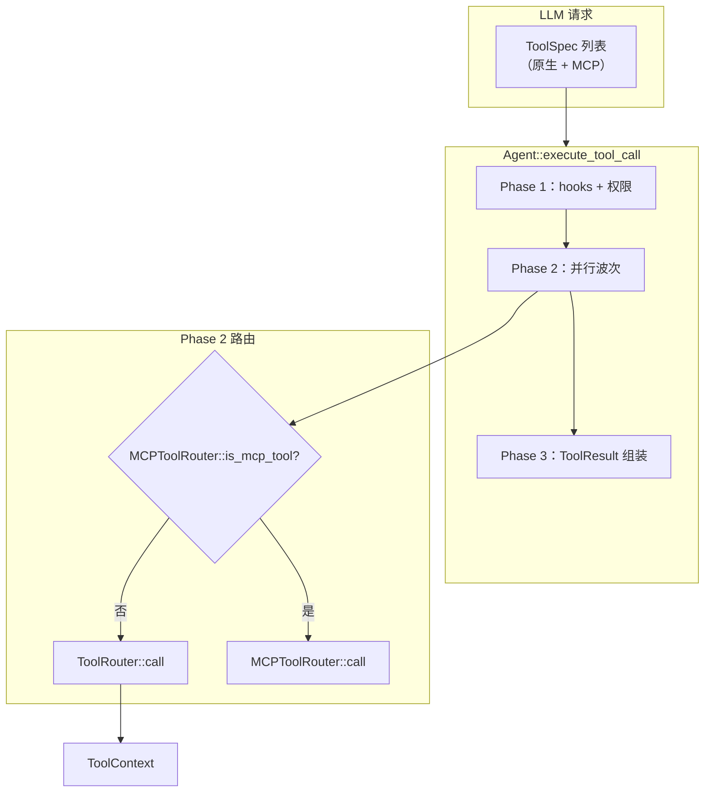

# 工具系统（Tool System）

> 语言：[中文](./07_chapter_tool_zh.md) · [English](./07_chapter_tool.md)

本章说明 Tact 如何定义、注册并执行**原生工具**：`Tool` trait、共享 `ToolContext`、`ToolRouter` 分发、主 agent 与子 agent 工具集、工作区路径安全，以及 `#[tool]` 过程宏。

MCP 工具走 `MCPToolRouter` 的并行路径——见 [MCP 协议与 Agent 集成](./08_chapter_mcp_zh.md)。三阶段执行流水线（预检、并行波次、结果组装）见 [任务与工具调度](./11_chapter_task.md)（英文）。

---

## 1. 工具系统在做什么

LLM 能原生调用的每一项能力都实现 `Tool`：

```rust
#[async_trait]
pub trait Tool: Send + Sync {
    fn name(&self) -> &'static str;
    fn description(&self) -> &'static str;
    fn input_schema(&self) -> Value;
    async fn call(&self, context: ToolContext, input: Value) -> Result<String>;
}
```

| 组件 | 职责 |
|------|------|
| `Tool` | 名称、JSON schema、异步 handler |
| `ToolContext` | 传给每次调用的共享会话状态 |
| `ToolRouter` | 名称 → handler 映射；`call()` 分发 |
| `toolset()` | 主 agent 的完整原生工具列表 |
| `subagent_toolset()` | `task` 子 agent 的受限列表 |
| `tool_dispatch.rs` | Agent 侧路由：原生 vs MCP、hooks、权限 |

Agent 构造时，原生 spec 与 MCP spec 合并：

```rust
cached_tool_specs = tools.tool_specs().into_iter()
    .chain(mcp_router.all_tools())
    .collect();
```

---

## 2. 架构概览



---

## 3. ToolContext

所有原生 tool handler 的共享状态（`crates/tact/src/tool/mod.rs`）：

```rust
pub struct ToolContext {
    pub skill_registry: Arc<Mutex<SkillRegistry>>, // SharedSkillRegistry
    pub memory_manager: Arc<Mutex<MemoryManager>>,
    pub work_dir: PathBuf,
    pub task_manager: SharedTaskManager,
    pub background_manager: SharedBackgroundManager,
    pub cron_scheduler: SharedCronScheduler,
    pub teammate_manager: SharedTeammateManager,
    pub worktree_manager: SharedWorktreeManager,
    pub ui_tx: Option<UnboundedSender<AgentUpdate>>,
    pub progress_reporter: ToolProgressReporter,
    pub cancel_flag: Arc<AtomicBool>,
    pub bash_timeout_secs: u64,
}
```

由 UI 入口构建一次，每次 tool call 克隆。文件工具相对 `work_dir` 解析路径。
`for_invocation(tool_id)` 为本次调用绑定新的 `ToolProgressReporter`；
`cancel_flag` 与 agent runtime 共享，`bash_timeout_secs` 携带 resolved 墙钟时限。
当 `ui_tx` 缺失或已关闭时，reporter 为 no-op。

---

## 4. ToolRouter

```rust
pub struct ToolRouter {
    tools: HashMap<String, Box<dyn Tool>>,
    cached_specs: OnceLock<Vec<ToolSpec>>,
}
```

| 方法 | 行为 |
|------|------|
| `new()` | 空 router |
| `route(tool)` | Builder 式注册；key = `tool.name()` |
| `tool_specs()` | 缓存的 `Vec<ToolSpec>` 供 LLM API |
| `call(ctx, name, input)` | 查找并调用；未命中则 `unknown tool: {name}` |

Spec 通过 `OnceLock` 只算一次——正常用法下首次 `tool_specs()` 之后不支持再注册工具。

---

## 5. toolset 与 subagent_toolset

### 主 agent（`toolset()`）

注册 40+ 工具，含文件系统、shell、web、任务、cron、团队、worktree、memory、skills、压缩与子 agent  spawn。完整列表见 `crates/tact/src/tool/mod.rs` 第 116–157 行。

### 子 agent（`subagent_toolset()`）

`task` 工具 spawn 的隔离 worker 使用受限集合：

| 工具 | 用途 |
|------|------|
| `bash` | Shell 命令 |
| `read_file` | 读工作区文件 |
| `write_file` | 创建/覆盖文件 |
| `edit_file` | 精确字符串替换（首次或全部） |
| `sleep` | 定时 / 轮询 |

子 agent **不**获得 cron、团队、任务管理、仅 MCP 名称或其他特权工具。模块注释写四个工具，实现里是五个——以上方 `route()` 列表为准。完整 spawn 生命周期：[Subagents](./12_chapter_subagent.md)（英文）。

---

## 6. `#[tool]` 过程宏

多数内置工具使用 `tool_refactor_macros::tool`：

```rust
#[tool(name = "save_memory", description = "Save a persistent memory…")]
pub async fn save_memory(ctx: ToolContext, input: SaveMemoryInput) -> Result<String> {
    // …
}
```

宏生成：

- 实现 `Tool` 的 `{FnName}Tool` 包装结构体
- 从 `JsonSchema` 输入结构体生成 JSON Schema（`input_schema::<T>()`）
- 将 `input` JSON 反序列化为 typed struct

支持两种 handler 形态：

| 形态 | 签名 |
|------|------|
| Stateful | `(ToolContext, InputStruct)` — 访问会话服务 |
| Pure | 仅 `(InputStruct)` — 无 context |

手动 `impl Tool`（例如测试里）仍可用于自定义工具。

---

## 7. 工作区路径安全

文件工具通过 `crates/tact/src/tool/path.rs` 的 `resolve_safe_path`：

```rust
pub(crate) fn safe_path(work_dir: &Path, path: &str) -> Result<PathBuf>;
pub(crate) fn safe_path_allow_missing(work_dir: &Path, path: &str) -> Result<PathBuf>;
```

| 检查 | 结果 |
|------|------|
| 规范化 `work_dir` | 作为 containment 基准 |
| 拼接相对路径 | canonicalize 后拒绝 `..` 逃逸 |
| 文件缺失（allow_missing） | 父目录仍须在工作区内 |

失败消息：`"Path escapes workspace"`。

这与 `StoreRoot` 路径规则（[Store 与持久化](./01_chapter_store_zh.md)，守护 `.tact/` JSON 文件）是分开的。

---

## 8. 从 Agent 分发

`tool_dispatch.rs` 的 Phase 2：

```rust
let exec = if is_mcp {
    run_mcp_tool(mcp, &prep.name, &prep.input).await
} else {
    run_native_tool(tools, ctx, &prep.id, &prep.name, &prep.input).await
};
```

`run_native_tool` 先调用 `ctx.for_invocation(tool_use_id)`，再调用
`tools.call(ctx, name, input)`。特例：超过 30,000 字符的原生/MCP 输出可能经
`persist_large_output` 溢出到 `.tact/tool-results/{tool_use_id}.txt`——**`read_file` 除外**。
`read_file` 以流式分页返回有界内容（默认 2,000 行 / `READ_FILE_MAX_OUTPUT_TOKENS` ≈ 25k 近似 token），
更多内容时以 `[PARTIAL view — lines …; continue with offset=…]` 标记续读；显式范围仍超预算则报错而非静默截断。

`bash` 用两个并发 Tokio reader 读取 pipe stdout/stderr。Aggregator 按观察到的
到达顺序合并 chunk、增量解码 UTF-8，并发送有界进度批次（首批立即发送，随后
至少间隔 50 ms，每批最多 4 KiB）。最终规范化 capture 独立限制为 50,000 字符。
Tact 只能显示命令实际写入 pipe 的字节；不会添加 PTY、注入 `stdbuf` 或改写
pipeline 来绕过应用缓冲。

墙钟超时默认 1,800 秒；`[tools].bash_timeout_secs = 0` 禁用超时。超时或取消
在 Unix 终止 shell process group；在非 Unix 终止 child 并 abort 本地 pipe reader，
避免继承的 handle 让调用一直等待。两条路径都会排空已入队输出，并在返回前 flush 进度。

权限与 hooks 在 Phase 1 运行，**早于** `ToolRouter::call`——见 [权限模型](./10_chapter_permission.md)（英文）与 [Agent 生命周期钩子](./09_chapter_hook_zh.md)。

---

## 9. 原生工具模块（节选）

| 模块 | 工具名 | 备注 |
|------|--------|------|
| `read_file.rs`, `write_file.rs`, `edit_file.rs` | 文件 I/O | 路径安全；`read_file` 流式 PARTIAL 分页 |
| `bash.rs` | `bash` | 校验 shell；流式 pipe、超时、process-group 取消 |
| `memory.rs` | `save_memory` | 见 [持久化 Memory](./03_chapter_memory.md)（英文） |
| `load_skill.rs` | `load_skill` | 见 [Skill Registry](./02_chapter_skill.md)（英文） |
| `task.rs`, `subagent.rs` | `task` | 用 `subagent_toolset()` spawn 子 agent |
| `cron.rs` | `cron_*` | 见 [Cron 调度](./16_chapter_cron.md)（英文） |
| `compact/mod.rs` | `compact` | 上下文压缩触发 |

---

## 10. 代码地图

| 文件 | 职责 |
|------|------|
| `crates/tact/src/tool/mod.rs` | `Tool`、`ToolContext`、`ToolRouter`、`input_schema` |
| `crates/tact/src/tool/registry.rs` | `toolset()`、`subagent_toolset()` |
| `crates/tact/src/tool/path.rs` | 工作区路径校验 |
| `crates/tact/src/tool/*.rs` | 各工具实现 |
| `crates/tact/src/agent/tool_dispatch.rs` | `run_native_tool`、三阶段流水线 |
| `crates/tact/src/agent/mod.rs` | `all_tool_specs`、agent 构造 |
| `crates/tool_refactor_macros/` | `#[tool]` 过程宏 |
| `crates/tact-ui/src/headless.rs`, `interactive.rs` | 构建 `ToolContext`，向 `Agent::new` 传入 `toolset()` |

---

## 11. 当前缺口

| 缺口 | 说明 |
|------|------|
| 静态工具注册 | 除 MCP 外无运行时原生工具插件 API |
| Router 注释漂移 | `subagent_toolset` 文档写 4 个工具；代码注册 5 个 |
| 无工具版本 | 重命名工具会破坏已保存 allowlist 与 prompt |
| MCP 与原生名冲突 | 注册时未检查——spec 列表里后写者胜出 |
| `ToolRouter` 非动态 | 会话中途不能增删工具 |
| 测试覆盖不均 | 核心 router 有测；并非每个工具模块都有集成测试 |

---

## Related Docs

- [任务与工具调度](./11_chapter_task.md) — 并行执行与调度（英文）
- [权限模型](./10_chapter_permission.md) — `call` 之前的预检门（英文）
- [Agent 生命周期钩子](./09_chapter_hook_zh.md) — PreToolUse / PostToolUse
- [MCP 协议与 Agent 集成](./08_chapter_mcp_zh.md) — 外部工具
- [团队协调](./14_chapter_team.md)、[Worktree 泳道](./15_chapter_worktree.md)、[后台任务](./13_chapter_background.md) — `ToolContext` 上由 manager 支撑的工具族（英文）
- [docs/tool_rendering.md](../docs/tool_rendering.md) — TUI 工具块
- [ARCHITECTURE.md](../ARCHITECTURE.md#13-tool-proc-macro) — 宏概览
