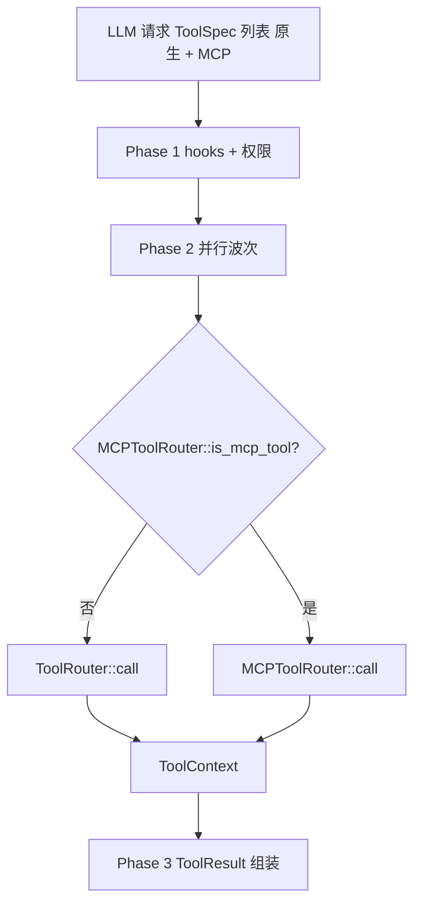
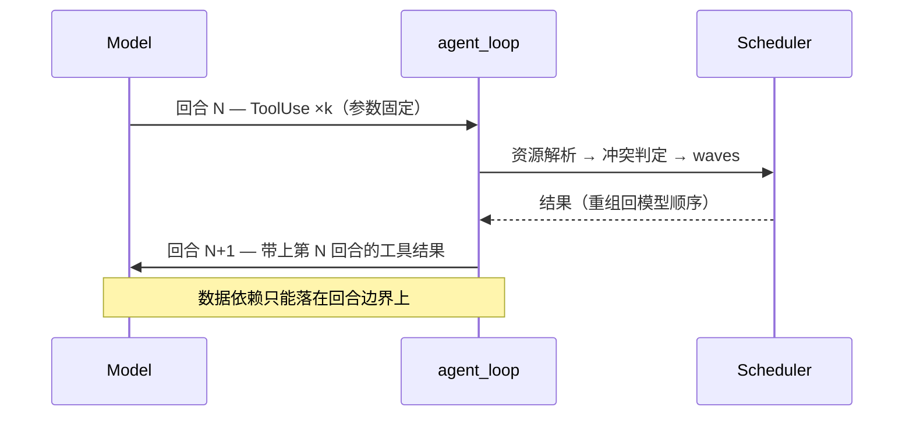
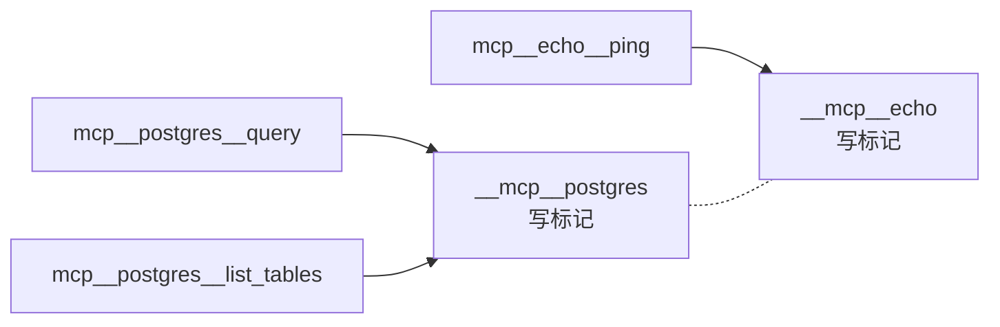

# 工具系统（Tool System）

本章说明 Tact 如何定义、注册并执行**原生工具**：`Tool` trait、共享 `ToolContext`、`ToolRouter` 分发、主 agent 与子 agent 工具集、工作区路径安全，以及 `#[tool]` 过程宏。

MCP 工具走 `MCPToolRouter` 的并行路径——见 [MCP 协议与 Agent 集成](./08_chapter_mcp_zh.md)。**一回合内的工具并行调度**（资源声明、冲突判定、wave 划分、barrier 语义）见 §9；三阶段执行流水线与持久化的整体叙述见 [任务与工具调度](./11_chapter_task_zh.md)。

---

## 1. 工具系统在做什么

LLM 能原生调用的每一项能力都实现 `Tool`：

```rust
#[async_trait]
pub trait Tool: Send + Sync {
    fn name(&self) -> &'static str;
    fn description(&self) -> &'static str;
    fn input_schema(&self) -> Value;
    async fn call(&self, context: ToolContext, input: Value) -> Result<String>;
}
```

| 组件 | 职责 |
|------|------|
| `Tool` | 名称、JSON schema、异步 handler |
| `ToolContext` | 传给每次调用的共享会话状态 |
| `ToolRouter` | 名称 → handler 映射；`call()` 分发 |
| `toolset()` | 主 agent 的完整原生工具列表 |
| `subagent_toolset()` | `spawn_subagent` 子 agent 的受限列表 |
| `tool_dispatch.rs` | Agent 侧路由：原生 vs MCP、hooks、权限 |

Agent 构造时，原生 spec 与 MCP spec 合并：

```rust
cached_tool_specs = tools.tool_specs().into_iter()
    .chain(mcp_router.all_tools())
    .collect();
```

---

## 2. 架构概览


```mermaid
graph TD
    a_specs[LLM 请求 ToolSpec 列表 原生 + MCP] --> b_p1[Phase 1 hooks + 权限]
    b_p1 --> c_p2[Phase 2 并行波次]
    c_p2 --> d_check{MCPToolRouter::is_mcp_tool?}
    d_check -->|否| e_tr[ToolRouter::call]
    d_check -->|是| f_mcp[MCPToolRouter::call]
    e_tr --> g_ctx[ToolContext]
    f_mcp --> g_ctx
    g_ctx --> h_p3[Phase 3 ToolResult 组装]
```

Phase 2 内部的波次划分、冲突判定与 barrier 语义是 §9 的主题；本图只标出它在管线中的位置。

---

## 3. ToolContext

所有原生 tool handler 的共享状态（`crates/tact/src/tool/mod.rs`）：

```rust
pub struct ToolContext {
    pub skill_registry: SharedSkillRegistry,
    pub subagent_start_hooks: Vec<Arc<dyn SubagentStartFn>>,   // dispatch 时打戳
    pub subagent_stop_hooks: Vec<Arc<dyn SubagentStopFn>>,
    pub memory_manager: Arc<Mutex<MemoryManager>>,
    pub work_dir: PathBuf,
    pub task_manager: SharedTaskManager,
    pub background_manager: SharedBackgroundManager,
    pub teammate_manager: SharedTeammateManager,
    pub worktree_manager: SharedWorktreeManager,
    pub subagent_manager: SharedSubagentManager,
    pub ui_tx: Option<UnboundedSender<AgentUpdate>>,
    pub ui_responder: UiResponder,               // ask_user / 权限选择 的请求-应答注册表
    pub progress_reporter: ToolProgressReporter,
    pub cancel_flag: Arc<AtomicBool>,
    pub bash_timeout_secs: u64,
    pub bash_nice: i32,                          // 默认 10；0 关闭
    pub sandbox: Option<Arc<dyn Sandbox>>,       // 启动时解析一次
    pub sandbox_degraded: Option<Arc<SandboxDegradation>>,
    pub session_id: Option<String>,              // with_session 时有值
    pub session_store: Option<DynSessionStore>,
    pub permission_snapshot: Option<PermissionSnapshot>,   // spawn_subagent 继承父级权限
    pub subagent_results: Option<Arc<Mutex<VecDeque<SubagentResult>>>>,
}
```

在 `session_bootstrap::bootstrap_session` 里构建一次（两个前端共用），每次 tool call 克隆。文件工具相对 `work_dir` 解析路径。
`for_invocation(tool_id)` 为本次调用绑定新的 `ToolProgressReporter`；`for_invocation_with_redaction` 额外设置实时输出脱敏级别（流式与最终结果分开处理）。
`cancel_flag` 与 agent runtime 共享，`bash_timeout_secs` 携带 resolved 墙钟时限。
当 `ui_tx` 缺失或已关闭时，reporter 为 no-op；`ui_responder` 为空时 `ask_user` 干净失败而不是挂在一个没人应答的提示上。

---

## 4. ToolRouter

```rust
pub struct ToolRouter {
    tools: HashMap<String, Box<dyn Tool>>,
    cached_specs: OnceLock<Vec<ToolSpec>>,
}
```

| 方法 | 行为 |
|------|------|
| `new()` | 空 router |
| `route(tool)` | Builder 式注册；key = `tool.name()` |
| `tool_specs()` | 缓存的 `Vec<ToolSpec>` 供 LLM API |
| `call(ctx, name, input)` | 查找并调用；未命中则 `unknown tool: {name}` |

Spec 通过 `OnceLock` 只算一次——正常用法下首次 `tool_specs()` 之后不支持再注册工具。

---

## 5. toolset 与 subagent_toolset

### 主 agent（`toolset()`）

`try_toolset()`（`crates/tact/src/tool/registry.rs` 第 33–75 行）注册 **35 个**工具：文件系统、shell、后台任务、任务、团队、worktree、memory、skills、压缩与子 agent spawn。`save_memory` 随 `[agent].memory_enabled` 增删，因此关闭 memory 时是 34 个。

**注意 `apply_patch` 不在其中。** 它的模块（`tool/apply_patch.rs`）与 `APPLY_PATCH_METADATA` 都还在，但 `454367d6` 把它从 registry 的 import 中删掉后再没有任何 toolset 注册它——模型无法调用。`edit_file` 恢复之后它就退出了工具面，残留的元数据是孤儿（见 [任务与工具调度](./11_chapter_task_zh.md) §3）。

### 子 agent（`subagent_toolset()`）

`spawn_subagent` 工具 spawn 的隔离 worker 使用受限集合：

| 工具 | 用途 |
|------|------|
| `bash` | Shell 命令 |
| `read_file` | 读工作区文件 |
| `write_file` | 创建/覆盖文件 |
| `edit_file` | 精确字符串替换（首次或全部） |
| `sleep` | 定时 / 轮询 |

子 agent **不**获得团队、任务管理、仅 MCP 名称、worktree 工具或其他特权工具——包括 `spawn_subagent` 本身（无嵌套子 agent）。默认五件套由 `subagent_toolset_has_five_tools` 强制。完整 spawn 生命周期：[Subagents](./12_chapter_subagent_zh.md)。

---

## 6. `#[tool]` 过程宏

多数内置工具使用 `tool_refactor_macros::tool`：

```rust
#[tool(name = "save_memory", description = "Save a persistent memory…")]
pub async fn save_memory(ctx: ToolContext, input: SaveMemoryInput) -> Result<String> {
    // …
}
```

宏生成：

- 实现 `Tool` 的 `{FnName}Tool` 包装结构体
- 从 `JsonSchema` 输入结构体生成 JSON Schema（`input_schema::<T>()`）
- 将 `input` JSON 反序列化为 typed struct

支持两种 handler 形态：

| 形态 | 签名 |
|------|------|
| Stateful | `(ToolContext, InputStruct)` — 访问会话服务 |
| Pure | 仅 `(InputStruct)` — 无 context |

手动 `impl Tool`（例如测试里）仍可用于自定义工具。

### 元数据常量

工具的身份、权限声明与呈现策略声明为 `*_METADATA` 常量（`ToolMetadata`，定义在 `crates/tact/src/tool/metadata.rs`）。37 个常量里 23 个由 `metadata.rs` 的 const 构造器生成，分两层：

**预设：整份形状完全一致**（成员之间没有任何字段不同）：

| 构造器 | 形状 | 使用者 |
|--------|------|--------|
| `read_json(name, desc, display)` | `Read` + `Independent`，输入按 JSON 摘要 | 八个只读列举类工具（`load_skill`、`check_subagent`、`worktree_list` …） |
| `team_write(…)` | `Write` + `SharedState { scope: "team" }` | 队友/消息族六个（`spawn_teammate`、`send_message` …） |
| `barrier_write(…)` | `Write` + `Barrier` | `worktree_create`、`worktree_remove` |

**家族：只在「作用于什么」上不同**（第四个参数就是那唯一变化的东西，且它是数据——哪个 task 操作、哪个输入字段）：

| 构造器 | 变化的那一项 | 使用者 |
|--------|--------------|--------|
| `path_read(name, desc, display, path_field)` | 承载路径的字段名 | `read_file`（`"path"`）、`read_image`（`"file_path"`） |
| `task_read(name, desc, display, op)` | `TaskOperation` | `task_get`、`task_list` |
| `task_write(…)` | `TaskOperation` | `task_create`、`task_update` |

`path_read` 的参数在等价的字面量里出现**四次**——风险判定、提示键、「始终允许」规则、卡片标题——四者必须同名；参数化让它们成为同一个值。

**其余 14 个保留字面量。** 判据不是「差几个字段」而是差的**是不是数据**：一个工具*做什么*（`output` 策略、`live_output`、`permission`、`visual_kind`、`argument_summary`）是它自己的声明，藏进构造器等于把答案藏起来。所以 `bash` / `background_run` / `worktree_run`（差 `output` / `live_output`）、`check_background` / `wait_background`（差 `visual_kind`）、`write_file` / `edit_file`（差 `visual_kind` + `detail`）、`sleep`、`compact`、`save_memory`、`cancel_subagent`、`apply_patch`、`ask_user`、`spawn_subagent` 各写自己的字面量。`metadata.rs` 的测试把每一层钉住：预设「共享的那一半」逐字段、三个预设之间只差「权限 + 资源声明」、三个家族之间只差被参数化的那一项。

**字段名必须三处一致。** 一份元数据最多会把同一个输入字段名写三遍：决定风险的 `permission`、决定「始终允许」规则键的 `permission_prompt`、以及变成卡片标题的 `argument_summary`（`"command"` / `"path"` / `"patch"`）。它们是三个独立字面量，且**没有任何下游会互相比较**——各自只读自己那一份。写错一处不是外观问题：提示会问一个路径而调度器保留另一个，或者「始终允许」规则会挂在风险判定从未用过的字段上。`crates/tact/src/tool/registry.rs` 的 `every_tool_names_one_input_field_across_its_policies` 在**组装后的 toolset** 上逐工具断言这三者一致（新增工具若不一致，即使每个策略单独看都合法也会失败）。构造器只是把这个不变式写得更难违反，它不能替代这条测试。

---

## 7. 工作区路径安全

文件工具通过 `crates/tact/src/tool/path.rs` 的 `resolve_safe_path`：

```rust
pub(crate) fn safe_path(work_dir: &Path, path: &str) -> Result<PathBuf>;
pub(crate) fn safe_path_allow_missing(work_dir: &Path, path: &str) -> Result<PathBuf>;
```

| 检查 | 结果 |
|------|------|
| 规范化 `work_dir` | 作为 containment 基准 |
| 拼接相对路径 | canonicalize 后拒绝 `..` 逃逸 |
| 文件缺失（allow_missing） | 父目录仍须在工作区内 |

失败消息：`"Path escapes workspace"`。

这与 `StoreRoot` 路径规则（[Store 与持久化](./01_chapter_store_zh.md)，守护 `.tact/` JSON 文件）是分开的。

### 7.1 Shell 执行沙箱（可选开启）

上面的检查约束的是 `read_file` / `edit_file` / `grep`，并不约束 `bash`：命令一旦被
批准就以普通宿主进程运行。可选的 OS 级沙箱在不改动权限模型的前提下收窄这一缺口：

```text
Hook → Permission → bash 工具 → Sandbox（可选）→ bwrap → sh -c → command
```

由 `[tools] sandbox = true` 开启（默认 `false`，见[配置](./21_chapter_config_zh.md)），
在**启动时解析一次**（`crates/tact/src/sandbox/`），并挂在 `ToolContext` 上
（`sandbox`、`sandbox_degraded`）。开关特意做成布尔值：用什么机制实现是平台决策
（Linux 用 bubblewrap；其他平台尚无实现，开关在那里是空操作）。任何导致沙箱无法
启动的情况都降级为不沙箱并告警，而不是让工具失败。

启用时：工作区以读写方式挂载到 `/workspace`（**不**暴露宿主路径），`/usr`、
`/bin`、`/lib`、`/lib64`、`/etc` 与固定的工具链白名单（`~/.rustup`、
`~/.cargo`、`~/.config/git`、`~/.npm`）以只读挂载，命令拥有独立的 pid namespace
与 procfs。网络命名空间与宿主**共享**（宿主 loopback 上的代理也可达）：沙箱约束的是
文件系统，不是连通性。这造成路径空间分裂：shell 命令看到 `/workspace/...`，
而所有进程内工具仍报告宿主绝对路径；因此 `bash` 的工具描述会在启动时按**实际生效**
的语义重写。

范围：沙箱约束的是**被批准的命令所引入的第三方代码**——构建脚本、`postinstall`
钩子、测试二进制。它不是对 agent 的边界：`background_run` 与 `worktree_run`
仍会启动未沙箱的 shell（[后台任务](./13_chapter_background_zh.md)、
[Worktree](./15_chapter_worktree_zh.md)）。

开关、按平台解析、完整 flag 列表、降级与现存缺口见 [Bash 沙箱](./27_chapter_sandbox_zh.md)。

---

## 8. 从 Agent 分发

`tool_dispatch.rs` 的 Phase 2：

```rust
let exec = if is_mcp {
    run_mcp_tool(mcp, &prep.name, &prep.input).await
} else {
    run_native_tool(tools, ctx, &prep.id, &prep.name, &prep.input).await
};
```

`run_native_tool` 先调用 `ctx.for_invocation(tool_use_id)`，再调用
`tools.call(ctx, name, input)`。特例：超过 30,000 字符的原生/MCP 输出可能经
`persist_large_output` 溢出到 `.tact/tool-results/{tool_use_id}.txt`——**`read_file` 除外**。
`read_file` 以流式分页返回有界内容（默认 2,000 行 / `READ_FILE_MAX_OUTPUT_TOKENS` ≈ 25k 近似 token），
更多内容时以 `[PARTIAL view — lines …; continue with offset=…]` 标记续读；显式范围仍超预算则报错而非静默截断。

`bash` 用两个并发 Tokio reader 读取 pipe stdout/stderr。Aggregator 按观察到的
到达顺序合并 chunk、增量解码 UTF-8，并发送有界进度批次（首批立即发送，随后
至少间隔 50 ms，每批最多 4 KiB）。最终规范化 capture 独立限制为 50,000 字符。
Tact 只能显示命令实际写入 pipe 的字节；不会添加 PTY、注入 `stdbuf` 或改写
pipeline 来绕过应用缓冲。

墙钟超时默认 1,800 秒；`[tools].bash_timeout_secs = 0` 禁用超时。每次调用的
`timeout` 参数（秒）可覆盖该次调用的配置值，`timeout = 0` 表示本次调用禁用超时。
超时或取消在 Unix 终止 shell process group；在非 Unix 终止 child 并 abort 本地 pipe reader，
避免继承的 handle 让调用一直等待。两条路径都会排空已入队输出，并在返回前 flush 进度。
进程非 0 退出也会使工具失败（`StepStatus::Failed`），并附带已捕获的 stdout/stderr
作为 partial output，供模型继续阅读命令输出。

权限与 hooks 在 Phase 1 运行，**早于** `ToolRouter::call`——见 [权限模型](./10_chapter_permission_zh.md) 与 [Agent 生命周期钩子](./09_chapter_hook_zh.md)。

---

## 9. 工具并行调度（Parallel Tool Scheduling）

本节讲**工具侧**的并行契约：一个工具如何声明自己碰什么（`ResourcePolicy`），调度器如何据此把一回合的工具切成 wave，以及哪些调用被排除在并行之外。回合编排的整体叙述（三阶段、UI 事件、持久化）在 [任务与工具调度](./11_chapter_task_zh.md)；这里聚焦算法与数据。

代码落在 `crates/tact/src/agent/tool_schedule.rs`（380 行，含 19 个单测）与 `tool_dispatch.rs` 的 `run_tool_waves`。

---

### 9.1 为什么同一回合内可以并行

LLM 一次响应里发出的所有 `ToolUse` 块**参数已经固定**——没有任何一个能等另一个的输出再决定自己的入参。真正的数据依赖只能**跨回合**出现：`agent_loop` 把第 N 回合的工具结果写回 context，模型在第 N+1 回合才可能用到它；而回合本身是串行的，依赖因此"免费"保序。

所以回合内唯一必须保序的关系是**资源冲突**：同一工作区路径上的 read/write 或 write/write。其余一切都可以重叠。


```mermaid
sequenceDiagram
    participant M as Model
    participant L as agent_loop
    participant S as Scheduler
    M->>L: 回合 N — ToolUse ×k（参数固定）
    L->>S: 资源解析 → 冲突判定 → waves
    S-->>L: 结果（重组回模型顺序）
    L->>M: 回合 N+1 — 带上第 N 回合的工具结果
    Note over M,L: 数据依赖只能落在回合边界上
```

---

### 9.2 只有执行阶段是并行的

`Agent::execute_tool_call`（`tool_dispatch.rs`）是三个调用：


```mermaid
graph LR
    a["preflight_tool_calls<br/>串行 · &amp;mut self"] --> b["run_tool_waves<br/>按 wave 并行 · 共享借用"]
    b --> c["build_tool_results<br/>串行 · 模型顺序重组"]
```

| 阶段 | 做什么 | 为什么不能并行 |
|------|--------|----------------|
| `preflight_tool_calls` | 解析 native/MCP、`PreToolUse` hook、权限判定；被拒者就地写占位结果 | 权限提示是交互式的，hook 需要 `&mut self` |
| `run_tool_waves` | 调度 + 并发执行 + `PostToolUse` hook + `StepFinished` + stats | **这里才是并行的那一段** |
| `build_tool_results` | 按模型顺序把输出拼回 `ToolResult` 块 | 顺序本身就是契约——provider 校验 `tool_use` / `tool_result` 的配对与次序 |

慢的部分（真实 I/O）全在中间一段，所以并行收益正好落在该落的地方。中间段只持**共享借用**（`&self.tools`、`&self.mcp_router`、`&self.tool_context`），`emit_update` 与 stats 走 `&self` / 内部可变性，因此并发 future 与事件发射可以共存。

---

### 9.3 资源声明：每个工具自己说碰什么

调度器**没有工具名表**。资源来自工具自己的元数据 `ToolMetadata.resources`（`ResourcePolicy`，`crates/tact/src/tool/metadata.rs`）。`tool_resources_for` 调 `ResourcePolicy::resolve(input, work_dir)`，把「策略 + 本次输入」解析成具体的 `ToolResources`：

```rust
pub struct ToolResources {
    pub reads:  Vec<PathBuf>,
    pub writes: Vec<PathBuf>,
    pub barrier: bool,   // 效果无法界定 → 与一切冲突
}
```

| `ResourcePolicy` | 解析结果 | 使用者 |
|------------------|----------|--------|
| `ReadPath { field }` | `reads = [work_dir/input[field]]` | `read_file`（`path`）、`read_image`（`file_path`） |
| `WritePath { field }` | `writes = [work_dir/input[field]]` | `write_file`、`edit_file`（`path`） |
| `SharedState { scope }` | `writes = ["__tact_<scope>__"]`（**合成标记**，不指向真实文件） | `task_create` / `task_update`（`task`）；`spawn_teammate` / `send_message` / `broadcast` / `plan_approval` / `shutdown_request` / `shutdown_response`（`team`） |
| `Independent` | 空集——永不冲突 | `sleep`、`save_memory`、`check_background`、`wait_background`、`check_subagent`、`wait_subagent`、`cancel_subagent`、`load_skill`、`task_get`、`task_list`、`list_teammates`、`read_inbox`、`worktree_list`、`worktree_status`、`worktree_events` |
| `Barrier` | `barrier = true` | `bash`、`ask_user`、`compact`、`background_run`、`worktree_run`、`worktree_create`、`worktree_remove`、`spawn_subagent`（不带 `worktree`） |
| `PatchFiles { … }` | 从 patch 头解析目标路径 | `apply_patch`（**当前无 toolset 注册**，见 §5） |

路径按 `work_dir.join(field)` 归一：相对路径落到工作区，绝对路径原样保留。刻意**不做 `canonicalize`**——目标可能还不存在，且要一个不碰文件系统的纯函数；词法比较足够支撑下面的 equal / ancestor 判定。

几个不显眼但故意的声明：

- `save_memory` 是 `Independent`——它写的是工作区**之外**的 `~/.tact/memory/`，不在冲突模型内；并发调用由 `ToolContext.memory_manager` 的 `Arc<Mutex<_>>` 串起来。
- `cancel_subagent` 是 `Independent`（权限却是 `High`）——它只翻子会话的 `AtomicBool` 取消标志，没有需要保序的工作区效果。
- `task_get` / `task_list` 是 `Independent`，只有 `task_create` / `task_update` 走 `SharedState`——读任务表不改变状态。

---

### 9.4 冲突判定

```rust
fn overlap(a: &Path, b: &Path) -> bool {
    a == b || a.starts_with(b) || b.starts_with(a)
}

fn conflicts(a: &ToolResources, b: &ToolResources) -> bool {
    if a.barrier || b.barrier { return true; }
    let writes_hit = |writes: &[PathBuf], other: &ToolResources| {
        writes.iter().any(|w| other.reads.iter()
            .chain(other.writes.iter())
            .any(|p| overlap(w, p)))
    };
    writes_hit(&a.writes, b) || writes_hit(&b.writes, a)
}
```

- `Path::starts_with` 按**路径分量**比较，不是字符串前缀：`src/foo` 与 `src/foobar` **不**重叠，而 `src/` 与 `src/foo.rs` 重叠——所以对 `src/foo.rs` 的写与作用域为 `src/` 的目录读冲突。
- 纯读之间永不冲突：没有任何 write 去命中对方。
- 冲突判定是对称的，且**只看路径集合**，不看工具名、不看权限、不看风险。

| 本工具 \ 对方 | 读同一路径 | 写同一路径 | 路径无重叠 | 对方是 barrier |
|---------------|-----------|-----------|-----------|---------------|
| **读** | ✅ 并行 | ❌ 串行 | ✅ 并行 | ❌ 串行 |
| **写** | ❌ 串行 | ❌ 串行 | ✅ 并行 | ❌ 串行 |
| **barrier** | ❌ 串行 | ❌ 串行 | ❌ 串行 | ❌ 串行 |

---

### 9.5 wave 划分

`schedule_waves` 是 O(n²) 的贪心（n = 一回合的工具数，个位到几十）：

```text
wave[i] = max( wave[j] + 1  for every j < i that conflicts with i ),  else 0
```

`waves_grouped` 再把编号折成 `Vec<Vec<usize>>`，每波内部保持索引升序。三条保证：

1. **保序**——任何冲突对 `i < j` 必有 `wave[i] < wave[j]`，即模型给出的相对顺序对冲突对严格保留。
2. **最大重叠**——不冲突的调用留在同一波（贪心取最小可行 wave）。
3. **barrier 独占一波**——barrier 与所有 `j < i` 冲突 ⇒ `wave[i] > max(waves[0..i])`；又与所有 `j > i` 冲突 ⇒ 它之后每个都 `≥ wave[i] + 1`。于是它把前后都隔开，独自占一波。

**默认是 barrier**：`ResolvedTool::Unknown` 与任何未声明资源的工具都落进 `ToolResources::barrier()`。新增工具不会意外并行；要并行必须在它的元数据里显式声明。

---

### 9.6 示例

**例 1：文件读写交错。** 模型按序返回 6 个调用（工作区 `/w`）：

| # | 调用 | 解析出的资源 |
|---|------|--------------|
| 0 | `read_file src/a.rs` | reads `/w/src/a.rs` |
| 1 | `read_file src/b.rs` | reads `/w/src/b.rs` |
| 2 | `edit_file src/a.rs` | writes `/w/src/a.rs` |
| 3 | `read_file src/c.rs` | reads `/w/src/c.rs` |
| 4 | `read_file src/a.rs` | reads `/w/src/a.rs` |
| 5 | `bash "cargo test"` | barrier |

逐项算出 `wave = [0, 0, 1, 0, 2, 3]`：

```text
wave 0  ├─ read a ─┤ ├─ read b ─┤ ├─ read c ─┤
wave 1              ├─ edit a ─┤
wave 2                          ├─ read a ─┤
wave 3                                      ├─ bash ─┤
        ─────────────────────────────────────────────────► 时间
```

| Wave | 工具 | 说明 |
|------|------|------|
| 0 | #0 read a、#1 read b、#3 read c | 三个不相干的读，一起跑 |
| 1 | #2 edit a | 等 #0 读完 a |
| 2 | #4 read a | 等 #2 写完 a |
| 3 | #5 bash | barrier，独占 |

关键点：#1 / #3 不受 a 的写影响，**留在 wave 0**——它们不必陪 #2 一起等。

**例 2：合成标记让同族工具互斥，但仍与文件读并行。**

| # | 调用 | wave | 说明 |
|---|------|------|------|
| 0 | `task_create` | 0 | writes `__tact_task__` |
| 1 | `read_file src/x.rs` | 0 | 与 `__tact_task__` 无重叠 |
| 2 | `task_update` | 1 | 与 #0 写-写冲突 |

**例 3：MCP 按 server 分片。**

| # | 调用 | 资源 | wave |
|---|------|------|------|
| 0 | `mcp__postgres__query` | writes `__mcp__postgres` | 0 |
| 1 | `mcp__echo__ping` | writes `__mcp__echo` | 0 |
| 2 | `mcp__postgres__list_tables` | writes `__mcp__postgres` | 1 |

---

### 9.7 barrier 与 MCP 的粒度

**barrier 的语义是"效果无法界定"，不是"危险"。** `bash` 可能是 `cargo test` 也可能是 `rm -rf`；`spawn_subagent` 里的子 agent 会任意读写工作区；`worktree_run` 起的是宿主 shell。调度器给不出路径集，只能让它独占。

**MCP 工具不走元数据。** `mcp_server_resources(server)` 在调度时按 server 名合成写标记 `__mcp__<server>`：


```mermaid
graph LR
    p1["mcp__postgres__query"] --> pg["__mcp__postgres<br/>写标记"]
    p2["mcp__postgres__list_tables"] --> pg
    e1["mcp__echo__ping"] --> ec["__mcp__echo<br/>写标记"]
    pg -.- ec
```

同一写标记 = 写-写冲突 → **串行**；标记不同 = 无重叠 → **并行**；`server` 名为空 → barrier。这样 MCP router 那份状态只需要按 server 串起来，不必让整台 MCP 变成全局串行点。

**MCP resource / prompt 看是否点了名**：`read_mcp_resource` 与 `get_mcp_prompt` 给了 `server` 时只锁那一个 server；`list_mcp_resources` / `list_mcp_prompts` / templates 是**列表**，可能触及每台 server，所以是 barrier。

**唯一"看输入"的资源判定**在 `tool_resources_for`：`spawn_subagent` 带 `worktree: true` → `Independent`（子 agent 有自己的 worktree 泳道，文件影响被限定在泳道内，可以同波扇出），否则 `Barrier`。这是 2026-08-26 异步子 agent 设计里点名的 "worktree follow-up"。

---

### 9.8 取消与顺序

- **取消只在 wave 边界生效**——`run_tool_waves` 每波开头查 `cancel_requested()`。在飞的工具跑完：中断一个已开始的写比多等几百毫秒更糟。剩余未执行的调用在 `build_tool_results` 里落成 `TOOL_CANCELLED_MSG` 占位结果。
- **波内完成顺序 = `FuturesUnordered` 的 yield 顺序**，不是模型顺序。每完成一个就立刻跑 `PostToolUse` / `PostToolUseFailure`、发 `StepFinished`（带 `step_idx`，UI 靠它归位）、记 stats 与 recent files。
- **发给模型的顺序永远是模型顺序**：`build_tool_results` 走 `prepared` 数组，与并行无关。
- Phase 1 被拒 / 未识别的调用根本不进调度——它们已有 `PreparedState::Resolved` 占位结果，`run_indices` 只收 `PreparedState::Run`。

---

### 9.9 可观测性

`run_tool_waves` 在**执行之前**就把 `ToolScheduleSummary` 写进该次 LLM 调用那一行 `token_usages`（`persist_tool_schedule` → `record_tool_schedule`，按 `last_message_id` 定位那次调用）。以上面例 1 为例：

```json
{
  "total_tools": 6,
  "wave_count": 4,
  "max_parallelism": 3,
  "waves": [
    { "tools": ["read_file", "read_file", "read_file"], "barrier": false },
    { "tools": ["edit_file"],                           "barrier": false },
    { "tools": ["read_file"],                           "barrier": false },
    { "tools": ["bash"],                                "barrier": true  }
  ]
}
```

- `total_tools` 只数**放行执行**的工具（`PreparedState::Run`），被拒 / 阻塞的不算。
- `max_parallelism` = 最大一波的大小；`1` 意味着整回合串行。
- 与 token 成本落在同一行 → 调度策略可以和成本关联分析。列定义见 [token_usage_schema.md](../docs/token_usage_schema.md#tool_schedule-column)。

---

### 9.10 让新工具安全并行

1. 在工具**自己的** `ToolMetadata.resources` 里声明 `ReadPath` / `WritePath` / `SharedState { scope }` / `Independent`——声明在工具侧，不在调度器里。
2. 怎么选：
   - 读工作区文件 → `ReadPath`；
   - 写工作区文件 → `WritePath`；
   - 改的是**某个共享状态**而不是工作区路径 → `SharedState`，scope 名要唯一且只给同族用；
   - 纯粹不碰任何共享物（定时、轮询标志、工作区外的存储）→ `Independent`。
3. **别顺手写 `Barrier`**：它是"我界定不了"的兜底，不是默认值。只有在有全局副作用时才保持 barrier——起 shell（`bash`、`background_run`、`worktree_run`）、spawn 子 agent（不带 `worktree`）、`ask_user` / `compact` 这类会改变会话本身的调用。（MCP 工具不走元数据，另有 server 级合成标记，见 §9.7。）
4. 声明之外不要有副作用。字段名与 `permission` / `permission_prompt` / `argument_summary` 的一致性见 §6。

---

### 9.11 与 codex-cli 的对比

| | codex-cli | tact |
|---|-----------|------|
| 触发 | 模型用 `multi_tool_use.parallel` 批量；请求带 `parallel_tool_calls: true` | 运行时调度一回合的 `ToolUse` 块，模型无需配合 |
| 资格 | 每个工具 / 每台 MCP server 的 `supports_parallel_tool_calls` 开关，默认串行 | barrier-by-default + 工具自己声明资源 |
| 冲突检测 | **没有**——信任模型不把有依赖的调用批量 | 路径冲突图 + wave 调度 |
| `bash` / shell | 标为可并行 | **barrier**（独占一波） |

codex 侧没有时序意识是已知问题（`git add` 与 `git commit` 被并行发出而竞态）。在 tact 里两者都是 `bash` → 各自独占一波，竞态不可能发生；代价是 `bash` / 子 agent 目前不参与并行。

---

### 9.12 现状缺口

| 缺口 | 说明 |
|------|------|
| 输入畸形会退化成"不冲突" | `ReadPath` / `WritePath` 的字段缺失或非字符串时解析出空集，等于 `Independent`。该调用随后会在路径校验处失败，但**会先并发跑起来** |
| 无并发上限 | 同一 wave 的 N 个工具全部同时起，没有全局或按类型的并发闸门 |
| `bash` / 子 agent 不并行 | 只有 `spawn_subagent { worktree: true }` 是例外；`background_run` / `worktree_run` 仍是 barrier |
| 无拓扑重排 | wave 编号只保序、不重排：`read A, bash, read A` 得到 3 波，即使 `bash` 与两次 `read A` 之间没有路径关系 |
| 无 UI 呈现 | 日志不显示 wave 分组，并行只体现在 `StepFinished` 的到达时序与 DB 里的 summary |
| `normalize()` 是死代码 | `tool_schedule.rs` 里的 `normalize` 带 `#[allow(dead_code)]`；实际解析走 `ResourcePolicy::resolve` 的 `work_dir.join()` |

---

## 10. 原生工具模块（节选）

| 模块 | 工具名 | 备注 |
|------|--------|------|
| `read_file.rs` / `write_file.rs` / `edit_file.rs` | `read_file`、`write_file`、`edit_file` | 路径安全；`read_file` 流式 PARTIAL 分页 |
| `read_image.rs` | `read_image` | 图像输入（视觉模型） |
| `bash.rs` | `bash` | 校验 shell；流式 pipe、超时、process-group 取消 |
| `background_run.rs` | `background_run`、`check_background`、`wait_background` | 见 [后台任务](./13_chapter_background_zh.md) |
| `memory.rs` | `save_memory` | 见 [持久化 Memory](./03_chapter_memory_zh.md) |
| `load_skill.rs` | `load_skill` | 见 [Skill Registry](./02_chapter_skill_zh.md) |
| `task.rs` | `task_create` / `task_get` / `task_list` / `task_update` | 见 [持久任务](./19_chapter_persistent_tasks_zh.md) |
| `subagent.rs` | `spawn_subagent` / `check_subagent` / `wait_subagent` / `cancel_subagent` | 用 `subagent_toolset()` spawn 子 agent |
| `compact.rs` | `compact` | 上下文压缩触发（Responses 下不注册） |
| `apply_patch.rs` | —（未注册） | 模块与元数据保留，但没有任何 toolset 注册它 |

---

## 11. 代码地图

| 文件 | 职责 |
|------|------|
| `crates/tact/src/tool/mod.rs` | `Tool`、`ToolContext`、`ToolRouter`、`input_schema` |
| `crates/tact/src/tool/metadata.rs` | `ToolMetadata` 与各策略类型（含 `ResourcePolicy` 及其 `resolve`）；三个共享形状的 const 构造器 `read_json` / `team_write` / `barrier_write` |
| `crates/tact/src/tool/registry.rs` | `toolset()`、`subagent_toolset()` |
| `crates/tact/src/tool/path.rs` | 工作区路径校验 |
| `crates/tact/src/tool/*.rs` | 各工具实现 |
| `crates/tact/src/agent/tool_schedule.rs` | `ToolResources`、`conflicts` / `overlap`、`schedule_waves` / `waves_grouped`、`mcp_server_resources`、`ToolScheduleSummary` |
| `crates/tact/src/agent/tool_dispatch.rs` | `preflight_tool_calls` / `run_tool_waves` / `build_tool_results`、`tool_resources_for`、native/MCP 分发 |
| `crates/tact/src/agent/mod.rs` | `all_tool_specs`、agent 构造、`persist_tool_schedule` |
| `crates/tool_refactor_macros/` | `#[tool]` 过程宏 |
| `crates/tact-ui/src/session_bootstrap.rs` | 构建 `ToolContext` 与 agent（两个前端共用） |

---

## 12. 当前缺口

| 缺口 | 说明 |
|------|------|
| 静态工具注册 | 除 MCP 外无运行时原生工具插件 API |
| 子代理工具集固定 | `subagent_toolset()` 注册 5 个工具；声明式 `tools:` 只能收窄，不能加宽 |
| 无工具版本 | 重命名工具会破坏已保存 allowlist 与 prompt |
| MCP 与原生名冲突 | 注册时未检查——spec 列表里后写者胜出 |
| `ToolRouter` 非动态 | 会话中途不能增删工具 |
| 沙箱只覆盖 `bash` | `background_run` / `worktree_run` 仍启动未沙箱的宿主 shell，进程内文件工具也保留完整宿主访问（§7.1） |
| 测试覆盖不均 | 核心 router 有测；并非每个工具模块都有集成测试 |

工具并行调度自身的缺口（输入畸形退化、无并发上限、`bash` 不并行、无拓扑重排、无 UI 呈现）见 §9.12。

---

## Related Docs

- [任务与工具调度](./11_chapter_task_zh.md) — 三阶段流水线、权限 / hook 位置、`ToolScheduleSummary` 落库
- [权限模型](./10_chapter_permission_zh.md) — `call` 之前的预检门
- [Agent 生命周期钩子](./09_chapter_hook_zh.md) — PreToolUse / PostToolUse
- [MCP 协议与 Agent 集成](./08_chapter_mcp_zh.md) — 外部工具
- [团队协调](./14_chapter_team_zh.md)、[Worktree 泳道](./15_chapter_worktree_zh.md)、[后台任务](./13_chapter_background_zh.md) — `ToolContext` 上由 manager 支撑的工具族
- [docs/parallel_tool_execution.md](../docs/parallel_tool_execution.md) — 并行执行的英文设计文档
- [docs/tool_rendering.md](../docs/tool_rendering.md) — TUI 工具块
- [ARCHITECTURE.md](../ARCHITECTURE.md#13-tool-proc-macro) — 宏概览
