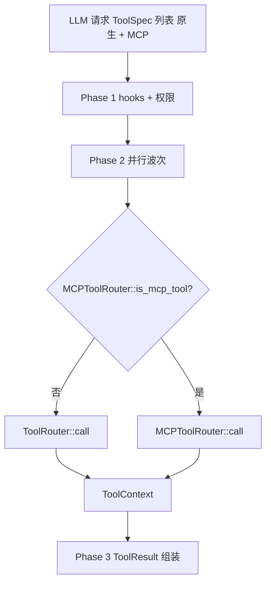

# 工具系统（Tool System）

本章说明 Tact 如何定义、注册并执行**原生工具**：`Tool` trait、共享 `ToolContext`、`ToolRouter` 分发、主 agent 与子 agent 工具集、工作区路径安全，以及 `#[tool]` 过程宏。

MCP 工具走 `MCPToolRouter` 的并行路径——见 [MCP 协议与 Agent 集成](./08_chapter_mcp_zh.md)。三阶段执行流水线（预检、并行波次、结果组装）见 [任务与工具调度](./11_chapter_task_zh.md)（英文）。

---

## 1. 工具系统在做什么

LLM 能原生调用的每一项能力都实现 `Tool`：

```rust
#[async_trait]
pub trait Tool: Send + Sync {
    fn name(&self) -> &'static str;
    fn description(&self) -> &'static str;
    fn input_schema(&self) -> Value;
    async fn call(&self, context: ToolContext, input: Value) -> Result<String>;
}
```

| 组件 | 职责 |
|------|------|
| `Tool` | 名称、JSON schema、异步 handler |
| `ToolContext` | 传给每次调用的共享会话状态 |
| `ToolRouter` | 名称 → handler 映射；`call()` 分发 |
| `toolset()` | 主 agent 的完整原生工具列表 |
| `subagent_toolset()` | `spawn_subagent` 子 agent 的受限列表 |
| `tool_dispatch.rs` | Agent 侧路由：原生 vs MCP、hooks、权限 |

Agent 构造时，原生 spec 与 MCP spec 合并：

```rust
cached_tool_specs = tools.tool_specs().into_iter()
    .chain(mcp_router.all_tools())
    .collect();
```

---

## 2. 架构概览


```mermaid
graph TD
    a_specs[LLM 请求 ToolSpec 列表 原生 + MCP] --> b_p1[Phase 1 hooks + 权限]
    b_p1 --> c_p2[Phase 2 并行波次]
    c_p2 --> d_check{MCPToolRouter::is_mcp_tool?}
    d_check -->|否| e_tr[ToolRouter::call]
    d_check -->|是| f_mcp[MCPToolRouter::call]
    e_tr --> g_ctx[ToolContext]
    f_mcp --> g_ctx
    g_ctx --> h_p3[Phase 3 ToolResult 组装]
```

---

## 3. ToolContext

所有原生 tool handler 的共享状态（`crates/tact/src/tool/mod.rs`）：

```rust
pub struct ToolContext {
    pub skill_registry: SharedSkillRegistry,
    pub subagent_start_hooks: Vec<Arc<dyn SubagentStartFn>>,   // dispatch 时打戳
    pub subagent_stop_hooks: Vec<Arc<dyn SubagentStopFn>>,
    pub memory_manager: Arc<Mutex<MemoryManager>>,
    pub work_dir: PathBuf,
    pub task_manager: SharedTaskManager,
    pub background_manager: SharedBackgroundManager,
    pub teammate_manager: SharedTeammateManager,
    pub worktree_manager: SharedWorktreeManager,
    pub subagent_manager: SharedSubagentManager,
    pub ui_tx: Option<UnboundedSender<AgentUpdate>>,
    pub ui_responder: UiResponder,               // ask_user / 权限选择 的请求-应答注册表
    pub progress_reporter: ToolProgressReporter,
    pub cancel_flag: Arc<AtomicBool>,
    pub bash_timeout_secs: u64,
    pub bash_nice: i32,                          // 默认 10；0 关闭
    pub sandbox: Option<Arc<dyn Sandbox>>,       // 启动时解析一次
    pub sandbox_degraded: Option<Arc<SandboxDegradation>>,
    pub session_id: Option<String>,              // with_session 时有值
    pub session_store: Option<DynSessionStore>,
    pub permission_snapshot: Option<PermissionSnapshot>,   // spawn_subagent 继承父级权限
    pub subagent_results: Option<Arc<Mutex<VecDeque<SubagentResult>>>>,
}
```

在 `session_bootstrap::bootstrap_session` 里构建一次（两个前端共用），每次 tool call 克隆。文件工具相对 `work_dir` 解析路径。
`for_invocation(tool_id)` 为本次调用绑定新的 `ToolProgressReporter`；`for_invocation_with_redaction` 额外设置实时输出脱敏级别（流式与最终结果分开处理）。
`cancel_flag` 与 agent runtime 共享，`bash_timeout_secs` 携带 resolved 墙钟时限。
当 `ui_tx` 缺失或已关闭时，reporter 为 no-op；`ui_responder` 为空时 `ask_user` 干净失败而不是挂在一个没人应答的提示上。

---

## 4. ToolRouter

```rust
pub struct ToolRouter {
    tools: HashMap<String, Box<dyn Tool>>,
    cached_specs: OnceLock<Vec<ToolSpec>>,
}
```

| 方法 | 行为 |
|------|------|
| `new()` | 空 router |
| `route(tool)` | Builder 式注册；key = `tool.name()` |
| `tool_specs()` | 缓存的 `Vec<ToolSpec>` 供 LLM API |
| `call(ctx, name, input)` | 查找并调用；未命中则 `unknown tool: {name}` |

Spec 通过 `OnceLock` 只算一次——正常用法下首次 `tool_specs()` 之后不支持再注册工具。

---

## 5. toolset 与 subagent_toolset

### 主 agent（`toolset()`）

`try_toolset()`（`crates/tact/src/tool/registry.rs` 第 33–75 行）注册 **35 个**工具：文件系统、shell、后台任务、任务、团队、worktree、memory、skills、压缩与子 agent spawn。`save_memory` 随 `[agent].memory_enabled` 增删，因此关闭 memory 时是 34 个。

**注意 `apply_patch` 不在其中。** 它的模块（`tool/apply_patch.rs`）与 `APPLY_PATCH_METADATA` 都还在，但 `454367d6` 把它从 registry 的 import 中删掉后再没有任何 toolset 注册它——模型无法调用。`edit_file` 恢复之后它就退出了工具面，残留的元数据是孤儿（见 [任务与工具调度](./11_chapter_task_zh.md) §3）。

### 子 agent（`subagent_toolset()`）

`spawn_subagent` 工具 spawn 的隔离 worker 使用受限集合：

| 工具 | 用途 |
|------|------|
| `bash` | Shell 命令 |
| `read_file` | 读工作区文件 |
| `write_file` | 创建/覆盖文件 |
| `edit_file` | 精确字符串替换（首次或全部） |
| `sleep` | 定时 / 轮询 |

子 agent **不**获得团队、任务管理、仅 MCP 名称、worktree 工具或其他特权工具——包括 `spawn_subagent` 本身（无嵌套子 agent）。默认五件套由 `subagent_toolset_has_five_tools` 强制。完整 spawn 生命周期：[Subagents](./12_chapter_subagent_zh.md)（英文）。

---

## 6. `#[tool]` 过程宏

多数内置工具使用 `tool_refactor_macros::tool`：

```rust
#[tool(name = "save_memory", description = "Save a persistent memory…")]
pub async fn save_memory(ctx: ToolContext, input: SaveMemoryInput) -> Result<String> {
    // …
}
```

宏生成：

- 实现 `Tool` 的 `{FnName}Tool` 包装结构体
- 从 `JsonSchema` 输入结构体生成 JSON Schema（`input_schema::<T>()`）
- 将 `input` JSON 反序列化为 typed struct

支持两种 handler 形态：

| 形态 | 签名 |
|------|------|
| Stateful | `(ToolContext, InputStruct)` — 访问会话服务 |
| Pure | 仅 `(InputStruct)` — 无 context |

手动 `impl Tool`（例如测试里）仍可用于自定义工具。

### 元数据常量

工具的身份、权限声明与呈现策略声明为 `*_METADATA` 常量（`ToolMetadata`，定义在 `crates/tact/src/tool/metadata.rs`）。37 个常量里 23 个由 `metadata.rs` 的 const 构造器生成，分两层：

**预设：整份形状完全一致**（成员之间没有任何字段不同）：

| 构造器 | 形状 | 使用者 |
|--------|------|--------|
| `read_json(name, desc, display)` | `Read` + `Independent`，输入按 JSON 摘要 | 八个只读列举类工具（`load_skill`、`check_subagent`、`worktree_list` …） |
| `team_write(…)` | `Write` + `SharedState { scope: "team" }` | 队友/消息族六个（`spawn_teammate`、`send_message` …） |
| `barrier_write(…)` | `Write` + `Barrier` | `worktree_create`、`worktree_remove` |

**家族：只在「作用于什么」上不同**（第四个参数就是那唯一变化的东西，且它是数据——哪个 task 操作、哪个输入字段）：

| 构造器 | 变化的那一项 | 使用者 |
|--------|--------------|--------|
| `path_read(name, desc, display, path_field)` | 承载路径的字段名 | `read_file`（`"path"`）、`read_image`（`"file_path"`） |
| `task_read(name, desc, display, op)` | `TaskOperation` | `task_get`、`task_list` |
| `task_write(…)` | `TaskOperation` | `task_create`、`task_update` |

`path_read` 的参数在等价的字面量里出现**四次**——风险判定、提示键、「始终允许」规则、卡片标题——四者必须同名；参数化让它们成为同一个值。

**其余 14 个保留字面量。** 判据不是「差几个字段」而是差的**是不是数据**：一个工具*做什么*（`output` 策略、`live_output`、`permission`、`visual_kind`、`argument_summary`）是它自己的声明，藏进构造器等于把答案藏起来。所以 `bash` / `background_run` / `worktree_run`（差 `output` / `live_output`）、`check_background` / `wait_background`（差 `visual_kind`）、`write_file` / `edit_file`（差 `visual_kind` + `detail`）、`sleep`、`compact`、`save_memory`、`cancel_subagent`、`apply_patch`、`ask_user`、`spawn_subagent` 各写自己的字面量。`metadata.rs` 的测试把每一层钉住：预设「共享的那一半」逐字段、三个预设之间只差「权限 + 资源声明」、三个家族之间只差被参数化的那一项。

**字段名必须三处一致。** 一份元数据最多会把同一个输入字段名写三遍：决定风险的 `permission`、决定「始终允许」规则键的 `permission_prompt`、以及变成卡片标题的 `argument_summary`（`"command"` / `"path"` / `"patch"`）。它们是三个独立字面量，且**没有任何下游会互相比较**——各自只读自己那一份。写错一处不是外观问题：提示会问一个路径而调度器保留另一个，或者「始终允许」规则会挂在风险判定从未用过的字段上。`crates/tact/src/tool/registry.rs` 的 `every_tool_names_one_input_field_across_its_policies` 在**组装后的 toolset** 上逐工具断言这三者一致（新增工具若不一致，即使每个策略单独看都合法也会失败）。构造器只是把这个不变式写得更难违反，它不能替代这条测试。

---

## 7. 工作区路径安全

文件工具通过 `crates/tact/src/tool/path.rs` 的 `resolve_safe_path`：

```rust
pub(crate) fn safe_path(work_dir: &Path, path: &str) -> Result<PathBuf>;
pub(crate) fn safe_path_allow_missing(work_dir: &Path, path: &str) -> Result<PathBuf>;
```

| 检查 | 结果 |
|------|------|
| 规范化 `work_dir` | 作为 containment 基准 |
| 拼接相对路径 | canonicalize 后拒绝 `..` 逃逸 |
| 文件缺失（allow_missing） | 父目录仍须在工作区内 |

失败消息：`"Path escapes workspace"`。

这与 `StoreRoot` 路径规则（[Store 与持久化](./01_chapter_store_zh.md)，守护 `.tact/` JSON 文件）是分开的。

### 7.1 Shell 执行沙箱（可选开启）

上面的检查约束的是 `read_file` / `edit_file` / `grep`，并不约束 `bash`：命令一旦被
批准就以普通宿主进程运行。可选的 OS 级沙箱在不改动权限模型的前提下收窄这一缺口：

```text
Hook → Permission → bash 工具 → Sandbox（可选）→ bwrap → sh -c → command
```

由 `[tools] sandbox = true` 开启（默认 `false`，见[配置](./21_chapter_config_zh.md)），
在**启动时解析一次**（`crates/tact/src/sandbox/`），并挂在 `ToolContext` 上
（`sandbox`、`sandbox_degraded`）。开关特意做成布尔值：用什么机制实现是平台决策
（Linux 用 bubblewrap；其他平台尚无实现，开关在那里是空操作）。任何导致沙箱无法
启动的情况都降级为不沙箱并告警，而不是让工具失败。

启用时：工作区以读写方式挂载到 `/workspace`（**不**暴露宿主路径），`/usr`、
`/bin`、`/lib`、`/lib64`、`/etc` 与固定的工具链白名单（`~/.rustup`、
`~/.cargo`、`~/.config/git`、`~/.npm`）以只读挂载，命令拥有独立的 pid namespace
与 procfs。网络命名空间与宿主**共享**（宿主 loopback 上的代理也可达）：沙箱约束的是
文件系统，不是连通性。这造成路径空间分裂：shell 命令看到 `/workspace/...`，
而所有进程内工具仍报告宿主绝对路径；因此 `bash` 的工具描述会在启动时按**实际生效**
的语义重写。

范围：沙箱约束的是**被批准的命令所引入的第三方代码**——构建脚本、`postinstall`
钩子、测试二进制。它不是对 agent 的边界：`background_run` 与 `worktree_run`
仍会启动未沙箱的 shell（[后台任务](./13_chapter_background_zh.md)、
[Worktree](./15_chapter_worktree_zh.md)）。

开关、按平台解析、完整 flag 列表、降级与现存缺口见 [Bash 沙箱](./27_chapter_sandbox_zh.md)。

---

## 8. 从 Agent 分发

`tool_dispatch.rs` 的 Phase 2：

```rust
let exec = if is_mcp {
    run_mcp_tool(mcp, &prep.name, &prep.input).await
} else {
    run_native_tool(tools, ctx, &prep.id, &prep.name, &prep.input).await
};
```

`run_native_tool` 先调用 `ctx.for_invocation(tool_use_id)`，再调用
`tools.call(ctx, name, input)`。特例：超过 30,000 字符的原生/MCP 输出可能经
`persist_large_output` 溢出到 `.tact/tool-results/{tool_use_id}.txt`——**`read_file` 除外**。
`read_file` 以流式分页返回有界内容（默认 2,000 行 / `READ_FILE_MAX_OUTPUT_TOKENS` ≈ 25k 近似 token），
更多内容时以 `[PARTIAL view — lines …; continue with offset=…]` 标记续读；显式范围仍超预算则报错而非静默截断。

`bash` 用两个并发 Tokio reader 读取 pipe stdout/stderr。Aggregator 按观察到的
到达顺序合并 chunk、增量解码 UTF-8，并发送有界进度批次（首批立即发送，随后
至少间隔 50 ms，每批最多 4 KiB）。最终规范化 capture 独立限制为 50,000 字符。
Tact 只能显示命令实际写入 pipe 的字节；不会添加 PTY、注入 `stdbuf` 或改写
pipeline 来绕过应用缓冲。

墙钟超时默认 1,800 秒；`[tools].bash_timeout_secs = 0` 禁用超时。每次调用的
`timeout` 参数（秒）可覆盖该次调用的配置值，`timeout = 0` 表示本次调用禁用超时。
超时或取消在 Unix 终止 shell process group；在非 Unix 终止 child 并 abort 本地 pipe reader，
避免继承的 handle 让调用一直等待。两条路径都会排空已入队输出，并在返回前 flush 进度。
进程非 0 退出也会使工具失败（`StepStatus::Failed`），并附带已捕获的 stdout/stderr
作为 partial output，供模型继续阅读命令输出。

权限与 hooks 在 Phase 1 运行，**早于** `ToolRouter::call`——见 [权限模型](./10_chapter_permission_zh.md)（英文）与 [Agent 生命周期钩子](./09_chapter_hook_zh.md)。

---

## 9. 原生工具模块（节选）

| 模块 | 工具名 | 备注 |
|------|--------|------|
| `read_file.rs` / `write_file.rs` / `edit_file.rs` | `read_file`、`write_file`、`edit_file` | 路径安全；`read_file` 流式 PARTIAL 分页 |
| `read_image.rs` | `read_image` | 图像输入（视觉模型） |
| `bash.rs` | `bash` | 校验 shell；流式 pipe、超时、process-group 取消 |
| `background_run.rs` | `background_run`、`check_background`、`wait_background` | 见 [后台任务](./13_chapter_background_zh.md) |
| `memory.rs` | `save_memory` | 见 [持久化 Memory](./03_chapter_memory_zh.md) |
| `load_skill.rs` | `load_skill` | 见 [Skill Registry](./02_chapter_skill_zh.md) |
| `task.rs` | `task_create` / `task_get` / `task_list` / `task_update` | 见 [持久任务](./19_chapter_persistent_tasks_zh.md) |
| `subagent.rs` | `spawn_subagent` / `check_subagent` / `wait_subagent` / `cancel_subagent` | 用 `subagent_toolset()` spawn 子 agent |
| `compact.rs` | `compact` | 上下文压缩触发（Responses 下不注册） |
| `apply_patch.rs` | —（未注册） | 模块与元数据保留，但没有任何 toolset 注册它 |

---

## 10. 代码地图

| 文件 | 职责 |
|------|------|
| `crates/tact/src/tool/mod.rs` | `Tool`、`ToolContext`、`ToolRouter`、`input_schema` |
| `crates/tact/src/tool/metadata.rs` | `ToolMetadata` 与各策略类型；三个共享形状的 const 构造器 `read_json` / `team_write` / `barrier_write` |
| `crates/tact/src/tool/registry.rs` | `toolset()`、`subagent_toolset()` |
| `crates/tact/src/tool/path.rs` | 工作区路径校验 |
| `crates/tact/src/tool/*.rs` | 各工具实现 |
| `crates/tact/src/agent/tool_dispatch.rs` | `run_native_tool`、三阶段流水线 |
| `crates/tact/src/agent/mod.rs` | `all_tool_specs`、agent 构造 |
| `crates/tool_refactor_macros/` | `#[tool]` 过程宏 |
| `crates/tact-ui/src/session_bootstrap.rs` | 构建 `ToolContext` 与 agent（两个前端共用） |

---

## 11. 当前缺口

| 缺口 | 说明 |
|------|------|
| 静态工具注册 | 除 MCP 外无运行时原生工具插件 API |
| 子代理工具集固定 | `subagent_toolset()` 注册 5 个工具；声明式 `tools:` 只能收窄，不能加宽 |
| 无工具版本 | 重命名工具会破坏已保存 allowlist 与 prompt |
| MCP 与原生名冲突 | 注册时未检查——spec 列表里后写者胜出 |
| `ToolRouter` 非动态 | 会话中途不能增删工具 |
| 沙箱只覆盖 `bash` | `background_run` / `worktree_run` 仍启动未沙箱的宿主 shell，进程内文件工具也保留完整宿主访问（§7.1） |
| 测试覆盖不均 | 核心 router 有测；并非每个工具模块都有集成测试 |

---

## Related Docs

- [任务与工具调度](./11_chapter_task_zh.md) — 并行执行与调度（英文）
- [权限模型](./10_chapter_permission_zh.md) — `call` 之前的预检门（英文）
- [Agent 生命周期钩子](./09_chapter_hook_zh.md) — PreToolUse / PostToolUse
- [MCP 协议与 Agent 集成](./08_chapter_mcp_zh.md) — 外部工具
- [团队协调](./14_chapter_team_zh.md)、[Worktree 泳道](./15_chapter_worktree_zh.md)、[后台任务](./13_chapter_background_zh.md) — `ToolContext` 上由 manager 支撑的工具族（英文）
- [docs/tool_rendering.md](../docs/tool_rendering.md) — TUI 工具块
- [ARCHITECTURE.md](../ARCHITECTURE.md#13-tool-proc-macro) — 宏概览
