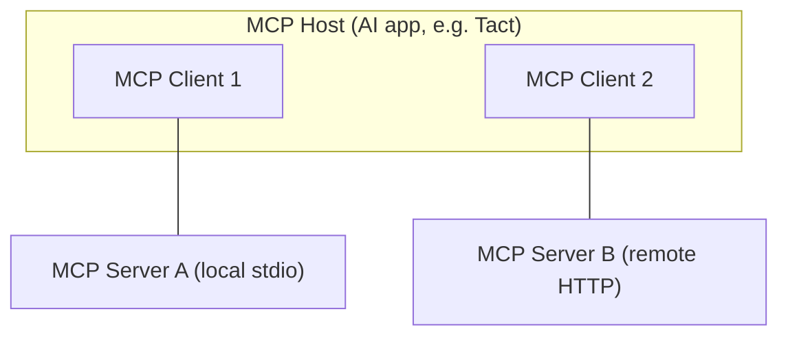
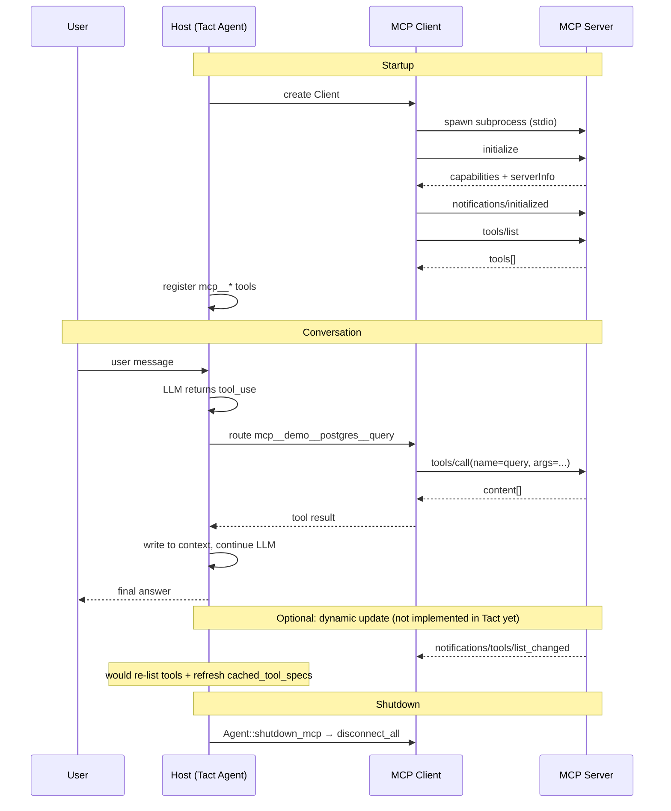

# MCP Protocol and Agent Integration

This tutorial walks through [Model Context Protocol (MCP)](https://modelcontextprotocol.io/) from first principles to the concrete implementation in Tact—how an agent connects to external tools end to end.

---

## 1. What Problem Does MCP Solve?

Before MCP, every AI application (Claude Desktop, Cursor, custom agents, …) had to write bespoke glue for every external capability (databases, GitHub, filesystems, …). That is the classic **M×N integration problem**:

- M AI applications
- N external tools / data sources
- M×N pieces of adapter code

MCP turns this into **M + N** with a **single protocol**:

- Each external capability implements an **MCP Server**
- Each AI application implements an **MCP Client**
- Both sides speak the same JSON-RPC session rules

---

## 2. Three Roles



| Role | What it is | What it does |
|------|------------|--------------|
| **Host** | The AI application itself | Manages the LLM, permissions, user interaction, and aggregates all external capabilities |
| **Client** | One connection object inside the Host | **One Client per Server**—handshake, requests, responses |
| **Server** | A standalone process or service | Exposes tools / resources / prompts |

Relationship: **1 Host → N Clients → N Servers**.

In Tact, the Host is `Agent` + `tact-ui`; each `McpClient` maps to one Client instance in the rmcp library.

---

## 3. Two Layers

### 3.1 Data Layer

Built on **JSON-RPC 2.0**, defining message format and semantics:

| Message type | Has `id`? | Expects reply? | Purpose |
|--------------|-----------|----------------|---------|
| **Request** | Yes | Yes | Initiate an operation |
| **Response** | Yes (matches Request) | — | Returns `result` or `error` |
| **Notification** | No | No | One-way push, e.g. tool list changes |

### 3.2 Transport Layer

The same JSON-RPC messages travel over different physical channels:

| Transport | Use case | Notes |
|-----------|----------|-------|
| **stdio** | Local subprocess | Client spawns Server; JSON lines on `stdin`/`stdout`; no network overhead |
| **Streamable HTTP** | Remote services | HTTP POST + optional SSE; OAuth and other auth |

Tact currently uses **stdio** only (see `McpClient::connect`).

---

## 4. Protocol Flow: Step by Step

The following follows **chronological order**, from “not connected yet” to “the LLM actually invokes a tool”.

### Step 0: Know the division of labor

Before connecting, remember: **Host owns the big picture, Client owns one connection, Server owns exposed capabilities**.

### Step 1: Configuration — tell the Host which Servers to connect

Before startup, the Host must know how to launch each Server. Tact reads `.claude-plugin/plugin.json`:

```json
{
  "name": "demo",
  "mcpServers": {
    "postgres": {
      "command": "node",
      "args": ["server.js"],
      "env": { "DATABASE_URL": "..." }
    }
  }
}
```

Meaning: run `command` as a subprocess—that process is the MCP Server.

Code: `PluginLoader::scan` scans directories, parses the manifest, and builds server names like `{plugin}__{server}` (e.g. `demo__postgres`).

### Step 2: Transport — start the Server process

```
Client (Tact)                    Server (node server.js)
    │                                    │
    │  spawn subprocess                   │
    │ ─────────────────────────────────► │
    │  Client writes JSON → Server stdin │
    │  Server writes JSON → Client stdout│
    │ ◄───────────────────────────────── │
```

Code: `McpClient::connect` spawns via `TokioChildProcess`, then `handler.serve(transport)` establishes the rmcp session.

At this point the process is running, but the **protocol session is not ready yet**.

### Step 3: Handshake — `initialize` and capability negotiation

After the transport is up, the **Client must send `initialize` first**. You cannot call tools immediately.

**Client → Server:**

```json
{
  "jsonrpc": "2.0",
  "id": 1,
  "method": "initialize",
  "params": {
    "protocolVersion": "2025-06-18",
    "capabilities": { "elicitation": {} },
    "clientInfo": { "name": "tact", "version": "0.19.0" }
  }
}
```

**Server → Client:**

```json
{
  "jsonrpc": "2.0",
  "id": 1,
  "result": {
    "protocolVersion": "2025-06-18",
    "capabilities": {
      "tools": { "listChanged": true },
      "resources": {}
    },
    "serverInfo": { "name": "postgres-server", "version": "1.0.0" }
  }
}
```

**Client → Server (Notification, no `id`):**

```json
{
  "jsonrpc": "2.0",
  "method": "notifications/initialized"
}
```

The handshake accomplishes three things:

1. **protocolVersion** — both sides must be compatible
2. **capabilities** — declare supported features (tools, resources, whether `list_changed` notifications are supported, …)
3. **clientInfo / serverInfo** — identity for debugging

In Tact this happens inside rmcp’s `serve()`; application code does not write the JSON directly.

### Step 4: Tool discovery — `tools/list`

Once the handshake completes, the Client asks the Server: **what tools do you expose?**

**Request:**

```json
{
  "jsonrpc": "2.0",
  "id": 2,
  "method": "tools/list"
}
```

**Response (excerpt):**

```json
{
  "jsonrpc": "2.0",
  "id": 2,
  "result": {
    "tools": [
      {
        "name": "query",
        "description": "Run a SQL query",
        "inputSchema": {
          "type": "object",
          "properties": { "sql": { "type": "string" } },
          "required": ["sql"]
        }
      }
    ]
  }
}
```

Each tool includes:

- **name** — unique within the Server
- **description** — shown to the LLM
- **inputSchema** — JSON Schema for arguments

Code: `McpClient::fetch_tools` → `service.peer().list_all_tools()`.

### Step 5: Register with the Agent — the LLM-facing tool list

After listing tools, the Host **merges them into the Agent’s tool table**. Tact prefixes names to avoid collisions across Servers:

```
mcp__<plugin>__<server>__<tool>
```

Example: `mcp__demo__postgres__query`

```rust
// build_tool_specs
name: format!("mcp__{server_name}__{}", tool.name),
```

On startup the Agent merges native tools + MCP tools:

```rust
cached_tool_specs = native_tools + mcp_router.all_tools()
```

The LLM now “knows” these tools exist, but has not called any yet.

### Step 6: The LLM decides to call — the Agent loop takes over

After the user sends a message, the Agent enters its main loop:

```
User message
  → send to LLM (with all tool specs)
  → LLM returns tool_use blocks (name + arguments)
  → Agent executes tools
  → write results back into the conversation
  → send to LLM again (until no more tool calls)
```

The LLM might return:

```json
{
  "name": "mcp__demo__postgres__query",
  "input": { "sql": "SELECT 1" }
}
```

If the name starts with `mcp__`, the Agent routes through MCP instead of native tools.

### Step 7: Execute — `tools/call`

The Agent parses the tool name, finds the right Client, and sends JSON-RPC.

**Client → Server:**

```json
{
  "jsonrpc": "2.0",
  "id": 3,
  "method": "tools/call",
  "params": {
    "name": "query",
    "arguments": { "sql": "SELECT 1" }
  }
}
```

Note: `params.name` is the **Server-internal name** (`query`), not the Agent-side `mcp__demo__postgres__query`.

Name parsing (`rsplit_once("__")` splits from the right):

```
mcp__demo__postgres__query
       └─ server ─┘  └ tool ┘
```

**Server → Client:**

```json
{
  "jsonrpc": "2.0",
  "id": 3,
  "result": {
    "content": [
      { "type": "text", "text": "[{\"?column?\": 1}]" }
    ]
  }
}
```

`content` is an array that can mix text, image, resource, and other types. Tact joins it with `join_mcp_content` and writes the string back as the tool result.

### Step 8: Feed results back to the LLM

The Agent appends the tool result to message history and calls the LLM again. Full path:

```
User: "Query the database"
  ↓
LLM: call mcp__demo__postgres__query
  ↓
Agent → MCP Client → Server (tools/call)
  ↓
Server runs SQL, returns result
  ↓
Agent writes to context → LLM produces final answer
```

Each LLM request includes the latest tool list (`with_tools(self.all_tool_specs())`), so updates take effect on the next turn.

### Step 9 (optional): Resources and Prompts

Besides Tools, MCP defines two more primitives:

| Primitive | Purpose | Typical methods |
|-----------|---------|-----------------|
| **Resources** | Read-only context (files, schemas, API data) | `resources/list`, `resources/read` |
| **Prompts** | Reusable prompt templates | `prompts/list`, `prompts/get` |

Tact primarily uses the **Tools** path today. Resources and Prompts exist in the protocol; whether a Host exposes them to the LLM depends on the implementation.

### Step 10: Notifications — Server pushes updates

When a Server’s tool list changes, it can push without waiting for the Client to ask:

```json
{
  "jsonrpc": "2.0",
  "method": "notifications/tools/list_changed"
}
```

The Client should re-run `tools/list` and refresh the Agent’s tool table.

**Tact implementation (startup only today):**

1. At connect time, `McpClient::fetch_tools` calls `list_all_tools()` once and builds `tool_specs` (`mcp/mod.rs`)
2. `Agent::new` merges native + MCP specs into `cached_tool_specs` — **fixed for the session**
3. **Not implemented yet:** `notifications/tools/list_changed` handler, `TactMcpClientHandler`, or `refresh_mcp_tools_if_changed()` in `agent_loop`. Dynamic server-side tool changes after connect are not picked up until restart.

```rust
// crates/tact/src/mcp/mod.rs — connect uses rmcp with () handler (no ClientHandler)
().serve(transport).await?;
// tools fetched once:
service.peer().list_all_tools().await?;
```

```rust
// crates/tact/src/agent/mod.rs — tool list is cached at Agent construction
let cached_tool_specs = tools.native_specs()
    .chain(mcp_router.all_tools())
    .collect();
```

### Step 11: Close the connection

When the session ends, disconnect gracefully instead of letting the parent exit and the OS kill child processes.

**Tact implementation:**

- `McpClient::shutdown` — `service.cancel().await`
- `MCPToolRouter::disconnect_all` — drain all clients and shut down each one
- `Agent::shutdown_mcp` — called from `tact-ui` on exit (`run_headless` / `run_interactive`) to invoke `disconnect_all`

---

## 5. End-to-End Sequence Diagram



---

## 6. Tact Code Map

| Module | File | Responsibility |
|--------|------|----------------|
| Config scan | `crates/tact/src/mcp/mod.rs` — `PluginLoader` | Read `.claude-plugin/plugin.json` |
| Connect & handshake | `McpClient::connect` | stdio spawn + rmcp `serve()` |
| Tool discovery | `McpClient::fetch_tools` | `tools/list` |
| Tool execution | `McpClient::call_tool` | `tools/call` |
| Dynamic updates | *(not implemented)* | `tools/list_changed` notification + cache refresh |
| Routing | `MCPToolRouter` | Route by `mcp__*` name to the right Server |
| Agent integration | `crates/tact/src/agent/mod.rs` | Merge tool specs at `Agent::new`; `all_tool_specs()` per LLM turn |
| Parallel scheduling | `crates/tact/src/agent/tool_schedule.rs` | Same Server serial; different Servers parallel |
| Entry point | `crates/tact-ui/src/main.rs` | `load_mcp_router()` at startup |

### 6.1 Tool naming and routing

```
mcp__demo__postgres__query
  │      │        │      └── tool (Server-internal name)
  │      │        └── server (key in manifest mcpServers)
  │      └── plugin (manifest name)
  └── fixed prefix marking an MCP tool
```

`MCPToolRouter::call` parses the name → finds the client → sends `tools/call` with the Server-internal tool name.

### 6.2 Parallel vs serial

MCP tools on the same Server share one stdio connection, so:

- Multiple tools on the **same Server**: **serial** (avoid connection races)
- Tools on **different Servers**: **may run in parallel**

See `mcp_tool_resources` and related tests in `tool_schedule.rs`.

---

## 7. Minimal MCP Server Sketch

Any language works as long as it speaks JSON-RPC over stdio. Pseudocode:

```
1. Read JSON lines from stdin
2. On initialize → reply with capabilities (include tools.listChanged: true)
3. On notifications/initialized → ignore (Notifications have no response)
4. On tools/list → reply with tools array
5. On tools/call → run logic, reply with content
6. (Optional) On tool change → write notifications/tools/list_changed to stdout
```

On the Tact side, declare `command` / `args` / `env` in `plugin.json` to plug it in.

---

## 8. FAQ

### Q: Why can’t I find `initialize` in Tact source?

The handshake lives inside the **rmcp** SDK’s `serve()`. Application code only spawns the process and calls `handler.serve(transport).await`.

### Q: When does the tool list change?

- **Static** tools at Server startup → fetch once at Step 4 (current Tact behavior)
- **Dynamic** tools at runtime → Step 10 Notification + refresh (**not implemented** — restart required)

### Q: How do MCP tools differ from native tools?

To the LLM, they are the same—both are function-calling tools. The Agent uses the `mcp__` prefix to choose `MCPToolRouter` vs `ToolRouter`.

### Q: Why not HTTP transport?

stdio fits local plugins: zero config, low latency. Remote MCP services can use Streamable HTTP; Tact does not implement that path yet, but rmcp can be extended.

---

## 9. Quick Reference (11 Steps)

| Step | Action | JSON-RPC method |
|------|--------|-----------------|
| 1 | Read config | (Host-local) |
| 2 | Start Server process | (stdio transport) |
| 3 | Handshake | `initialize` + `notifications/initialized` |
| 4 | Discover tools | `tools/list` |
| 5 | Register for LLM | (Host-local) |
| 6 | LLM chooses a tool | (LLM returns tool_use) |
| 7 | Execute | `tools/call` |
| 8 | Feed back results | (Host writes to context) |
| 9 | Optional: resources / prompts | `resources/*`, `prompts/*` |
| 10 | Optional: live updates | Notification |
| 11 | Shutdown | `close` / disconnect |

**In one line:** MCP = stateful JSON-RPC session + capability negotiation + three primitives (tools / resources / prompts), over stdio or HTTP, letting a Host plug in external Servers written in any language.

---

## 10. Current Gaps

| Gap | Detail |
|-----|--------|
| **No `tools/list_changed` handling** | Tool list fixed at connect; no `ClientHandler` or loop refresh |
| **Resources / prompts** | Protocol primitives exist; Tact only wires Tools today |
| **HTTP transport** | stdio only via `TokioChildProcess` |

---

## 11. Further Reading

- [MCP architecture overview](https://modelcontextprotocol.io/docs/learn/architecture)
- [MCP specification — Lifecycle](https://modelcontextprotocol.io/specification/2025-06-18/basic/lifecycle)
- Tact source: `crates/tact/src/mcp/mod.rs`
- rmcp (Rust SDK): `rmcp = "0.17"` in the project `Cargo.toml`
