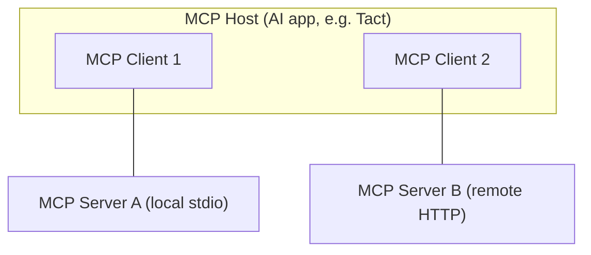
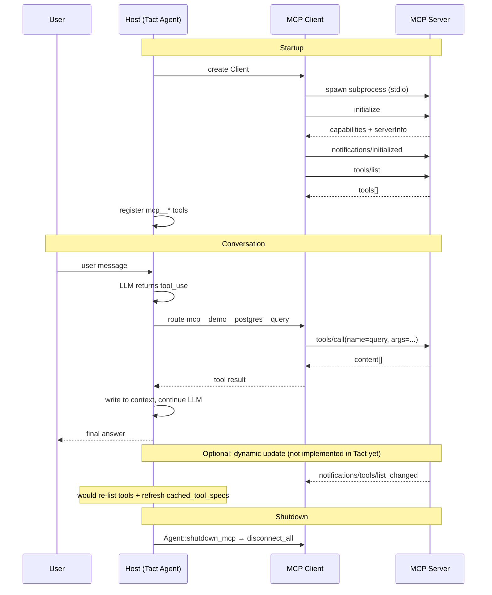

# MCP Protocol and Agent Integration
> Language: [English](./08_chapter_mcp.md) · [中文](./08_chapter_mcp_zh.md)

This tutorial walks through [Model Context Protocol (MCP)](https://modelcontextprotocol.io/) from first principles to the concrete implementation in Tact—how an agent connects to external tools end to end.

---

## 1. What Problem Does MCP Solve?

Before MCP, every AI application (Claude Desktop, Cursor, custom agents, …) had to write bespoke glue for every external capability (databases, GitHub, filesystems, …). That is the classic **M×N integration problem**:

- M AI applications
- N external tools / data sources
- M×N pieces of adapter code

MCP turns this into **M + N** with a **single protocol**:

- Each external capability implements an **MCP Server**
- Each AI application implements an **MCP Client**
- Both sides speak the same JSON-RPC session rules

---

## 2. Three Roles


```mermaid
graph TB
    subgraph Host["MCP Host (AI app, e.g. Tact)"]
        C1["MCP Client 1"]
        C2["MCP Client 2"]
    end
    S1["MCP Server A (local stdio)"]
    S2["MCP Server B (remote HTTP)"]

    C1 --- S1
    C2 --- S2
```

| Role | What it is | What it does |
|------|------------|--------------|
| **Host** | The AI application itself | Manages the LLM, permissions, user interaction, and aggregates all external capabilities |
| **Client** | One connection object inside the Host | **One Client per Server**—handshake, requests, responses |
| **Server** | A standalone process or service | Exposes tools / resources / prompts |

Relationship: **1 Host → N Clients → N Servers**.

In Tact, the Host is `Agent` + `tact-ui`; each `McpClient` maps to one Client instance in the rmcp library.

---

## 3. Two Layers

### 3.1 Data Layer

Built on **JSON-RPC 2.0**, defining message format and semantics:

| Message type | Has `id`? | Expects reply? | Purpose |
|--------------|-----------|----------------|---------|
| **Request** | Yes | Yes | Initiate an operation |
| **Response** | Yes (matches Request) | — | Returns `result` or `error` |
| **Notification** | No | No | One-way push, e.g. tool list changes |

### 3.2 Transport Layer

The same JSON-RPC messages travel over different physical channels:

| Transport | Use case | Notes |
|-----------|----------|-------|
| **stdio** | Local subprocess | Client spawns Server; JSON lines on `stdin`/`stdout`; no network overhead |
| **Streamable HTTP** | Remote services | HTTP POST + optional SSE; static headers and OAuth 2.0 |

Tact uses **both**: an entry with `command` is spawned over stdio, an entry with `url` is a remote Streamable HTTP server (see `McpClient::connect` and `remote::serve_remote`).

---

## 4. Protocol Flow: Step by Step

The following follows **chronological order**, from “not connected yet” to “the LLM actually invokes a tool”.

### Step 0: Know the division of labor

Before connecting, remember: **Host owns the big picture, Client owns one connection, Server owns exposed capabilities**.

### Step 1: Configuration — tell the Host which Servers to connect

Before startup, the Host must know how to launch each Server.

**Preferred: Tact's native `mcp.json`.** Two locations, both optional — `~/.tact/mcp.json` (user) and `<workdir>/.tact/mcp.json` (project). The shape is the same Claude-compatible one every MCP client accepts:

```json
{
  "mcpServers": {
    "postgres": {
      "command": "node",
      "args": ["server.js"],
      "env": { "DATABASE_URL": "..." }
    }
  }
}
```

Meaning: run `command` as a subprocess—that process is the MCP Server. A server declared here is named by its map key **verbatim**, so its agent-side tool names are exactly `mcp__postgres__<tool>` with no manifest prefix — the most predictable naming available, and the reason to prefer this file.

A project entry overrides a user entry **by server name**; non-colliding entries from both are merged. A malformed `mcp.json` is a hard error naming the path (a user-authored config that cannot be parsed must not be ignored silently), unlike a broken server, which is only reported.

**All sources**, lowest precedence first. Entry 3 is an installed marketplace plugin — a distributable *bundle*, read-only, keeping its own manifest-prefixed naming and never how a user is told to configure MCP:

| # | Source | Server name |
|---|--------|-------------|
| 1 | `~/.tact/mcp.json` | map key |
| 2 | `<workdir>/.tact/mcp.json` | map key |
| 3 | installed plugins | `plugin__<plugin>__<server>` |

Two files, one rule: **user scope is `~/.tact/mcp.json`, project scope is `<workdir>/.tact/mcp.json`.** Tact reads no cwd-level Codex manifest and no cwd `.mcp.json`, so "where does this project declare its servers?" has exactly one answer.

**Installed marketplace plugins** are scanned at startup by `installed_plugin_mcp_servers`, which reads both `.codex-plugin/plugin.json` `mcpServers` and a `.mcp.json` at the plugin root. Those belong to the plugin *bundle* format — the same filenames are deliberately **not** read at the working directory.

Each entry declares exactly one transport: `command` (local stdio) or `url` (remote Streamable HTTP, optionally with `headers` and `auth`). `command` wins if both are present. An entry with neither is reported as **skipped**, never treated as a hard error.

**Managing servers from the CLI.** Six subcommands, split by what they are allowed to touch — `list`/`get` connect, `add`/`remove` write `mcp.json`, `login`/`logout` own the stored credentials:

| Command | Connects? | Writes config? | Credentials? |
|---------|-----------|----------------|--------------|
| `mcp list` | all servers | no | no |
| `mcp get <name>` | that server only | no | no |
| `mcp add <name> …` | no | yes | no |
| `mcp remove <name>` | no | yes | no (kept) |
| `mcp login <name>` | yes (OAuth flow) | no | writes |
| `mcp logout <name>` | no | no | deletes |

```sh
tact-ui mcp list                              # every server + status
tact-ui mcp get deepwiki                      # transport, source, status, tools
tact-ui mcp add deepwiki --url https://mcp.deepwiki.com/mcp      # remote (no auth)
tact-ui mcp add linear --url https://mcp.linear.app/mcp --oauth   # remote + OAuth
tact-ui mcp add local  --command npx --arg -y --arg some-mcp-server
tact-ui mcp remove local                      # declaration only
tact-ui mcp login linear                      # browser flow, token stored
tact-ui mcp logout linear                     # token deleted
```

`add`/`remove` target the project file (`.tact/mcp.json`) unless `--user` is given. `add --force` replaces an existing declaration of the same name; without it a name clash is an error rather than a silent overwrite, and `remove` of an unknown name is an error rather than a no-op — it tells you which file the server *is* declared in (`retry with --user`) or that a plugin contributes it. When the scope you edited is not the one that wins, `add` says so and names the winning file, because a higher-precedence declaration would otherwise make the command a silent no-op. Writes are atomic (a uniquely named temp file + rename, preserving the original file's permissions) and edit the **raw JSON document**, so keys Tact does not model — including keys on unrelated servers — survive; removing the last server leaves an empty `mcpServers` object, which reads back as "no servers". `remove` keeps stored credentials (a re-added server should keep working); `logout` is what deletes them, and it needs no configured server, so credentials can be cleaned up after a declaration is gone.

Names, URLs, header names and header values are validated up front. Server names are additionally refused if they contain whitespace, control characters or a path separator: a name is also the `<server>` segment of `mcp__<server>__<tool>` and the file name of the OAuth credential (`~/.tact/mcp/oauth/<server>.json`), so `mcp logout <name>` must never be pointable at an arbitrary file. Header/env *values* are never echoed or logged (they commonly carry secrets), and `add` never connects. A repeated `--header`/`--env` name is an error rather than a silent last-one-wins.

`mcp list` also prints an **Overridden declarations** section naming the losing and winning files whenever a name is declared more than once — overrides decide what `remove` changing behavior even means, so they must not be silent.

`mcp get` is the focused counterpart to `mcp list`: it connects to **one** server, so inspecting a single entry never spawns or dials the rest of the configuration, and it prints the tool names as the agent must call them (`mcp__<server>__<tool>`). Both views share one status vocabulary (`connected (N tools)` / `needs authorization` / `failed`) so they cannot drift.

Code: `McpConfigFile::read` (`mcp.json`), `installed_plugin_mcp_servers` (plugins), `collect_sourced_servers` and `resolve_servers` (precedence), `validate_server_name`, `resolved_server_for`, `inspect_server`, `connect_server`, all in `crates/tact/src/mcp/mod.rs`; the write side (`McpServerDraft`, `McpConfigScope`, `add_mcp_server`, `remove_mcp_server`) in `crates/tact/src/mcp/edit.rs`; credential deletion (`forget_credentials`) in `crates/tact/src/mcp/remote.rs`; the CLI handlers in `crates/tact-ui/src/mcp_cli.rs`.

### Step 1b: What happens when a Server is misconfigured

Resolution produces an `McpLoadReport` instead of discarding failures:

| Field | Meaning |
|-------|---------|
| `connected` | server name + tool count for each success |
| `failures` | server name + error for each failed connection |
| `shadowed` | server name + the lower-precedence source it displaced |
| `skipped_remote` | servers dropped for an unsupported/incomplete transport |
| `pending_auth` | remote OAuth servers with no usable credential yet (declared `auth`, an expired non-refreshable token, or a server that answered 401) |

A **connection failure is never fatal** — one broken server must not stop the agent from starting. But it is no longer silent either: `notice_lines()` renders one line per fact, delivered as `AgentUpdate::Info` in the TUI and to stderr in headless mode. A clean load produces no output at all, so the notice only appears when there is something to act on.

**Pending authorization never blocks startup.** A remote server that needs OAuth is listed as `pending_auth` and skipped, whether it declared `auth` or was discovered to need it by answering 401; run `/mcp auth <server>` to complete the browser flow, after which the MCP router is reloaded in place.

### Step 1c: Remote servers and OAuth

A remote entry looks like this:

```json
{
  "mcpServers": {
    "remote": {
      "url": "https://mcp.example.com/mcp",
      "headers": { "X-Api-Key": "..." },
      "auth": { "type": "oauth", "scopes": ["tools.read"] }
    }
  }
}
```

- Transport is the MCP **Streamable HTTP** client (`rmcp`), so session management and SSE reconnection are handled by the SDK. `type: "http" | "sse"` is advisory; Tact does not speak the legacy 2024-11-05 HTTP+SSE endpoint.
- `headers` is static auth for simple deployments. Header values are never logged; invalid header names/values are dropped with a warning.
- `auth.type = "oauth"` runs the MCP-standard OAuth 2.0 authorization-code + PKCE flow (SEP-985): protected-resource/RFC 8414 metadata discovery, dynamic client registration, a loopback redirect (`127.0.0.1`, ephemeral port unless `callbackPort` is set), then automatic token refresh. `clientId` skips dynamic registration for a pre-registered client.
- `auth` is **optional even for a server that requires OAuth**: a server that answers 401 is detected (rmcp's "Auth required") and upgraded to *pending authorization*, and `/mcp auth <server>` will run the flow anyway. Declaring `auth` simply pre-answers the question, and lets startup predict pending status without a network call.
- Tokens are persisted per server at `~/.tact/mcp/oauth/<server>.json` (`0600` on Unix). If refresh is impossible the server returns to `pending_auth`. A stored token is honoured whether or not `auth` was declared, so authorizing a server once keeps working.
- **Registration is gated on the client *name*, and the name is configurable.** DCR (RFC 7591) is how a generic MCP client registers itself, and a provider may answer the registration endpoint with `403` for names it does not recognise. Figma is a measured example — the same registration body returns `200` for `client_name: "Codex"` and `403` for `"Tact"` (exact table in the FAQ). Tact therefore registers as `mcp.oauth_client_name`, default **`"Codex"`**, with a per-server `auth.clientName` override; the name actually sent is logged at `info` and named in any failure, because the provider and the consent screen see it. Set `oauth_client_name = "Tact"` to identify honestly and accept that allowlisting providers refuse. Discovery otherwise succeeds — the authorization server for Figma is `https://api.figma.com` — so a refusal lands on the last step and looks transient. Beyond the name, the error names three routes: a client you registered yourself via `auth.clientId` (+ `callbackPort`, so the redirect URI stays stable), a provider-issued static token in `headers`, or the provider's local server (Figma ships one at `http://127.0.0.1:3845/mcp`, needing no OAuth). A confidential client's *secret* cannot be supplied yet — rmcp's stored credentials carry only the `client_id`.
- **Loopback endpoints bypass the environment proxy.** With `http_proxy`/`all_proxy` exported, reqwest would send `http://127.0.0.1:…` to the proxy too, so a local server never saw the request and the failure read as `Unexpected content type: None`. `127.0.0.0/8`, `localhost` and `::1` now get a proxy-free HTTP client; every other host keeps the environment proxy, since that is what makes a remote server reachable in a restricted network. (The OAuth manager still builds its own client, so discovery for a *loopback* server would use the proxy — irrelevant for the Figma desktop server, which needs no OAuth.)
- Startup performs no interactive work: with no credential the server is reported as pending, so the agent never waits on a browser. `/mcp auth <server>` (`/mcp login <server>` also works) runs the flow, prints the authorization URL, and hot-reloads the MCP router on success. Headless users have the same capabilities as CLI subcommands — `tact-ui mcp list` connects and reports, `tact-ui mcp get <name>` inspects one server, `tact-ui mcp add`/`remove` edit `mcp.json`, and `tact-ui mcp login`/`logout` manage stored credentials; see Step 1.

### Step 2: Transport — start the Server process

```
Client (Tact)                    Server (node server.js)
    │                                    │
    │  spawn subprocess                   │
    │ ─────────────────────────────────► │
    │  Client writes JSON → Server stdin │
    │  Server writes JSON → Client stdout│
    │ ◄───────────────────────────────── │
```

Code: `McpClient::connect` spawns via `TokioChildProcess`, then `handler.serve(transport)` establishes the rmcp session. (This step is stdio-specific; a `url` entry instead builds a Streamable HTTP transport in `remote::serve_remote` — see Step 1c.)

At this point the process is running, but the **protocol session is not ready yet**.

### Step 3: Handshake — `initialize` and capability negotiation

After the transport is up, the **Client must send `initialize` first**. You cannot call tools immediately.

**Client → Server:**

```json
{
  "jsonrpc": "2.0",
  "id": 1,
  "method": "initialize",
  "params": {
    "protocolVersion": "2025-06-18",
    "capabilities": { "elicitation": {} },
    "clientInfo": { "name": "tact", "version": "0.19.0" }
  }
}
```

**Server → Client:**

```json
{
  "jsonrpc": "2.0",
  "id": 1,
  "result": {
    "protocolVersion": "2025-06-18",
    "capabilities": {
      "tools": { "listChanged": true },
      "resources": {}
    },
    "serverInfo": { "name": "postgres-server", "version": "1.0.0" }
  }
}
```

**Client → Server (Notification, no `id`):**

```json
{
  "jsonrpc": "2.0",
  "method": "notifications/initialized"
}
```

The handshake accomplishes three things:

1. **protocolVersion** — both sides must be compatible
2. **capabilities** — declare supported features (tools, resources, whether `list_changed` notifications are supported, …)
3. **clientInfo / serverInfo** — identity for debugging

In Tact this happens inside rmcp’s `serve()`; application code does not write the JSON directly.

### Step 4: Tool discovery — `tools/list`

Once the handshake completes, the Client asks the Server: **what tools do you expose?**

**Request:**

```json
{
  "jsonrpc": "2.0",
  "id": 2,
  "method": "tools/list"
}
```

**Response (excerpt):**

```json
{
  "jsonrpc": "2.0",
  "id": 2,
  "result": {
    "tools": [
      {
        "name": "query",
        "description": "Run a SQL query",
        "inputSchema": {
          "type": "object",
          "properties": { "sql": { "type": "string" } },
          "required": ["sql"]
        }
      }
    ]
  }
}
```

Each tool includes:

- **name** — unique within the Server
- **description** — shown to the LLM
- **inputSchema** — JSON Schema for arguments

Code: `McpClient::fetch_tools` → `service.peer().list_all_tools()`.

### Step 5: Register with the Agent — the LLM-facing tool list

After listing tools, the Host **merges them into the Agent’s tool table**. Tact prefixes names to avoid collisions across Servers:

```
mcp__<server>__<tool>
```

The `<server>` part depends on where the server was declared. A server from native `mcp.json` uses its map key verbatim:

Example (native `mcp.json`, key `postgres`): `mcp__postgres__query`

An installed plugin keeps its manifest prefix, so its names are longer:

Example (plugin `demo`, server `postgres`): `mcp__demo__postgres__query`

```rust
// build_tool_specs
name: format!("mcp__{server_name}__{}", tool.name),
```

On startup the Agent merges native tools + MCP tools:

```rust
cached_tool_specs = native_tools + mcp_router.all_tools()
```

The LLM now “knows” these tools exist, but has not called any yet.

### Step 6: The LLM decides to call — the Agent loop takes over

After the user sends a message, the Agent enters its main loop:

```
User message
  → send to LLM (with all tool specs)
  → LLM returns tool_use blocks (name + arguments)
  → Agent executes tools
  → write results back into the conversation
  → send to LLM again (until no more tool calls)
```

The LLM might return:

```json
{
  "name": "mcp__demo__postgres__query",
  "input": { "sql": "SELECT 1" }
}
```

If the name starts with `mcp__`, the Agent routes through MCP instead of native tools.

### Step 7: Execute — `tools/call`

The Agent parses the tool name, finds the right Client, and sends JSON-RPC.

**Client → Server:**

```json
{
  "jsonrpc": "2.0",
  "id": 3,
  "method": "tools/call",
  "params": {
    "name": "query",
    "arguments": { "sql": "SELECT 1" }
  }
}
```

Note: `params.name` is the **Server-internal name** (`query`), not the Agent-side `mcp__demo__postgres__query`.

Name parsing (`rsplit_once("__")` splits from the right):

```
mcp__demo__postgres__query
       └─ server ─┘  └ tool ┘
```

**Server → Client:**

```json
{
  "jsonrpc": "2.0",
  "id": 3,
  "result": {
    "content": [
      { "type": "text", "text": "[{\"?column?\": 1}]" }
    ]
  }
}
```

`content` is an array that can mix text, image, resource, and other types. Tact joins it with `join_mcp_content` and writes the string back as the tool result.

### Step 8: Feed results back to the LLM

The Agent appends the tool result to message history and calls the LLM again. Full path:

```
User: "Query the database"
  ↓
LLM: call mcp__demo__postgres__query
  ↓
Agent → MCP Client → Server (tools/call)
  ↓
Server runs SQL, returns result
  ↓
Agent writes to context → LLM produces final answer
```

Each LLM request includes the latest tool list (`with_tools(self.all_tool_specs())`), so updates take effect on the next turn.

### Step 9 (optional): Resources and Prompts

Besides Tools, MCP defines two more primitives:

| Primitive | Purpose | Typical methods |
|-----------|---------|-----------------|
| **Resources** | Read-only context (files, schemas, API data) | `resources/list`, `resources/read` |
| **Prompts** | Reusable prompt templates | `prompts/list`, `prompts/get` |

Tact primarily uses the **Tools** path today. Resources and Prompts exist in the protocol; whether a Host exposes them to the LLM depends on the implementation.

### Step 10: Notifications — Server pushes updates

When a Server’s tool list changes, it can push without waiting for the Client to ask:

```json
{
  "jsonrpc": "2.0",
  "method": "notifications/tools/list_changed"
}
```

The Client should re-run `tools/list` and refresh the Agent’s tool table.

**Tact implementation (startup only today):**

1. At connect time, `McpClient::fetch_tools` calls `list_all_tools()` once and builds `tool_specs` (`mcp/mod.rs`)
2. `Agent::new` merges native + MCP specs into `cached_tool_specs` — **fixed for the session**
3. **Not implemented yet:** `notifications/tools/list_changed` handler, `TactMcpClientHandler`, or `refresh_mcp_tools_if_changed()` in `agent_loop`. Dynamic server-side tool changes after connect are not picked up until restart.

```rust
// crates/tact/src/mcp/mod.rs — connect uses rmcp with () handler (no ClientHandler)
().serve(transport).await?;
// tools fetched once:
service.peer().list_all_tools().await?;
```

```rust
// crates/tact/src/agent/mod.rs — tool list is cached at Agent construction
let cached_tool_specs = tools.native_specs()
    .chain(mcp_router.all_tools())
    .collect();
```

### Step 11: Close the connection

When the session ends, disconnect gracefully instead of letting the parent exit and the OS kill child processes.

**Tact implementation:**

- `McpClient::shutdown` — `service.cancel().await`
- `MCPToolRouter::disconnect_all` — drain all clients and shut down each one
- `Agent::shutdown_mcp` — called from `tact-ui` on exit (`run_headless` / `run_interactive`) to invoke `disconnect_all`

---

## 5. End-to-End Sequence Diagram


```mermaid
sequenceDiagram
    participant User as User
    participant Host as Host (Tact Agent)
    participant Client as MCP Client
    participant Server as MCP Server

    Note over Host,Server: Startup
    Host->>Client: create Client
    Client->>Server: spawn subprocess (stdio)
    Client->>Server: initialize
    Server-->>Client: capabilities + serverInfo
    Client->>Server: notifications/initialized
    Client->>Server: tools/list
    Server-->>Client: tools[]
    Host->>Host: register mcp__* tools

    Note over User,Server: Conversation
    User->>Host: user message
    Host->>Host: LLM returns tool_use
    Host->>Client: route mcp__demo__postgres__query
    Client->>Server: tools/call(name=query, args=...)
    Server-->>Client: content[]
    Client-->>Host: tool result
    Host->>Host: write to context, continue LLM
    Host-->>User: final answer

    Note over Host,Server: Optional: dynamic update (not implemented in Tact yet)
    Server-->>Client: notifications/tools/list_changed
    Note over Host: would re-list tools + refresh cached_tool_specs
    Note over Host,Server: Shutdown
    Host->>Client: Agent::shutdown_mcp → disconnect_all
```

---

## 6. Tact Code Map

| Module | File | Responsibility |
|--------|------|----------------|
| Config scan | `crates/tact/src/mcp/mod.rs` — `McpConfigFile` | Read `~/.tact/mcp.json` and `<workdir>/.tact/mcp.json` |
| Plugin servers | `installed_plugin_mcp_servers` | Read installed plugin bundles |
| Source precedence | `collect_sourced_servers`, `resolve_servers` | Layer all sources, report overrides |
| Load report | `McpLoadReport` | Surface failures / overrides / skipped instead of `debug!` |
| Connect & handshake | `McpClient::connect` | stdio spawn + rmcp `serve()` |
| Tool discovery | `McpClient::fetch_tools` | `tools/list` |
| Tool execution | `McpClient::call_tool` | `tools/call` |
| Dynamic updates | *(not implemented)* | `tools/list_changed` notification + cache refresh |
| Routing | `MCPToolRouter` | Route by `mcp__*` name to the right Server |
| Agent integration | `crates/tact/src/agent/mod.rs` | Merge tool specs at `Agent::new`; `all_tool_specs()` per LLM turn |
| Parallel scheduling | `crates/tact/src/agent/tool_schedule.rs` | Same Server serial; different Servers parallel |
| Entry point | `crates/tact-ui/src/headless.rs`, `interactive.rs` | `load_mcp_router()` at startup |

### 6.1 Tool naming and routing

A server from native `mcp.json`:

```
mcp__postgres__query
  │     │         └── tool (Server-internal name)
  │     └── server (key in mcp.json)
  └── fixed prefix marking an MCP tool
```

A server contributed by an installed plugin keeps its manifest layer:

```
mcp__demo__postgres__query
  │      │        │      └── tool (Server-internal name)
  │      │        └── server (key in plugin manifest mcpServers)
  │      └── plugin (manifest name)
  └── fixed prefix marking an MCP tool
```

`MCPToolRouter::call` parses the name → finds the client → sends `tools/call` with the Server-internal tool name. The parse splits on the **last** `__`, so a server name may itself contain `__` (as plugin-prefixed names do).

### 6.2 Parallel vs serial

MCP tools on the same Server share one stdio connection, so:

- Multiple tools on the **same Server**: **serial** (avoid connection races)
- Tools on **different Servers**: **may run in parallel**

See `mcp_tool_resources` and related tests in `crates/tact/src/agent/tool_schedule.rs`.

---

## 7. Minimal MCP Server Sketch

Any language works as long as it speaks JSON-RPC over stdio. Pseudocode:

```
1. Read JSON lines from stdin
2. On initialize → reply with capabilities (include tools.listChanged: true)
3. On notifications/initialized → ignore (Notifications have no response)
4. On tools/list → reply with tools array
5. On tools/call → run logic, reply with content
6. (Optional) On tool change → write notifications/tools/list_changed to stdout
```

On the Tact side, declare `command` / `args` / `env` in `plugin.json` to plug it in.

---

## 8. FAQ

### Q: Why can’t I find `initialize` in Tact source?

The handshake lives inside the **rmcp** SDK’s `serve()`. Application code only spawns the process and calls `handler.serve(transport).await`.

### Q: When does the tool list change?

- **Static** tools at Server startup → fetch once at Step 4 (current Tact behavior)
- **Dynamic** tools at runtime → Step 10 Notification + refresh (**not implemented** — restart required)

### Q: How do MCP tools differ from native tools?

To the LLM, they are the same—both are function-calling tools. The Agent uses the `mcp__` prefix to choose `MCPToolRouter` vs `ToolRouter`.

### Q: Why not HTTP transport?

stdio fits local plugins: zero config, low latency. Remote MCP services use **Streamable HTTP**, which Tact supports with static headers or OAuth 2.0 (`url` entries in `mcp.json`).

### Q: Why did `mcp login` fail with `HTTP 403 Forbidden` on Figma before, and what changed?

Registration is gated on the **client name**, so Tact now registers as `"Codex"` by default (`mcp.oauth_client_name`). Measured against the live endpoint with an otherwise byte-identical registration body:

| `client_name` sent | registration result |
|---|---|
| `Codex` | `200` (+ fresh `client_id`/`client_secret` each run) |
| `Claude Code` | `200` |
| `Tact` | `403 Forbidden` |
| `Cursor` | `403 Forbidden` |
| `Visual Studio Code` | `403 Forbidden` |
| `codex` (lowercase) | `403 Forbidden` |

Codex itself registers dynamically like Tact does — its plugin's `.mcp.json` declares no `client_id`, and each run gets a different one — so the name is the only difference. Because the default is now `"Codex"`, `tact-ui mcp login figma` reaches the authorization URL.

```toml
[mcp]
oauth_client_name = "Codex"   # default; set "Tact" to identify honestly
```

Per-server override, when only one provider needs a different answer:

```json
{ "mcpServers": { "figma": { "url": "https://mcp.figma.com/mcp",
                             "auth": { "type": "oauth", "clientName": "Codex" } } } }
```

Be aware of the trade-off: the provider, and the consent screen shown to you, sees `"Codex"` rather than `"Tact"`. Tact does not hide this — the name actually used is logged at `info` (`client_name=…`) and named in any registration failure. Setting `oauth_client_name = "Tact"` identifies honestly, and allowlisting providers then refuse registration with an explanation plus alternatives.

### Q: A provider still refuses registration — what then?

The measurement above is specific to the names Figma admits. Another provider may gate on different values, or refuse registration outright (some do not advertise a registration endpoint at all). The failure message names the name Tact sent and both override points, and the remaining options are: register a client with the provider yourself and set `auth.clientId` (plus a pinned `callbackPort`), supply a provider-issued static token in `headers`, or run the provider's local server if it ships one (`tact-ui mcp add figma-desktop --url http://127.0.0.1:3845/mcp` — no OAuth needed). Each failure is logged with the server name, provider URL, the client name sent, and whether a registration endpoint was advertised, so `RUST_LOG=tact=debug` shows the full trail. Accepted registrations show what is being granted: a `client_id` + `client_secret` with `token_endpoint_auth_method: "none"`.

---

## 9. Quick Reference (11 Steps)

| Step | Action | JSON-RPC method |
|------|--------|-----------------|
| 1 | Read config (`mcp.json`, then installed plugins) | (Host-local) |
| 2 | Start Server process | (stdio transport) |
| 3 | Handshake | `initialize` + `notifications/initialized` |
| 4 | Discover tools | `tools/list` |
| 5 | Register for LLM | (Host-local) |
| 6 | LLM chooses a tool | (LLM returns tool_use) |
| 7 | Execute | `tools/call` |
| 8 | Feed back results | (Host writes to context) |
| 9 | Optional: resources / prompts | `resources/*`, `prompts/*` |
| 10 | Optional: live updates | Notification |
| 11 | Shutdown | `close` / disconnect |

**In one line:** MCP = stateful JSON-RPC session + capability negotiation + three primitives (tools / resources / prompts), over stdio or HTTP, letting a Host plug in external Servers written in any language.

---

## 10. Current Gaps

| Gap | Detail |
|-----|--------|
| **No `tools/list_changed` handling** | Tool list fixed at connect; no `ClientHandler` or loop refresh |
| **Resources / prompts** | Protocol primitives exist; Tact only wires Tools today |
| **Legacy HTTP+SSE** | `type: "sse"` maps to Streamable HTTP; the deprecated 2024-11-05 HTTP+SSE endpoint is not implemented |
| **OAuth device flow / mTLS** | Only the authorization-code + PKCE flow is implemented; no device code, client certificates, or enterprise SSO |
| **Client secrets / allowlisted providers** | Only self-registration (DCR) and public-client `clientId` are supported; a provider that refuses DCR *and* needs a client secret (Figma's remote server) cannot be authorized from Tact — the error names the alternatives |
| **Per-tool permission granularity** | Every MCP tool resolves to `CapabilityRisk::High`; `normalize_mcp_capability` ignores both server and tool |
| **No typed env interpolation** | `mcp.json` `env` values are literal; no `${VAR}` expansion |

---

## 11. Further Reading

- [MCP architecture overview](https://modelcontextprotocol.io/docs/learn/architecture)
- [MCP specification — Lifecycle](https://modelcontextprotocol.io/specification/2025-06-18/basic/lifecycle)
- Tact source: `crates/tact/src/mcp/mod.rs`
- rmcp (Rust SDK): `rmcp = "0.17"` in the project `Cargo.toml`
