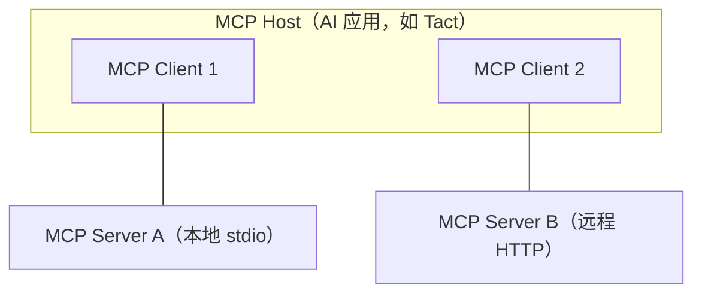
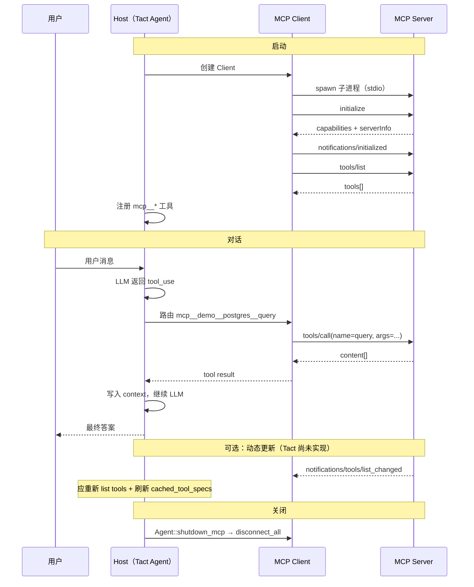

# MCP 协议与 Agent 集成

> 语言：[中文](./08_chapter_mcp_zh.md) · [English](./08_chapter_mcp.md)

本教程从 [Model Context Protocol (MCP)](https://modelcontextprotocol.io/) 的第一性原理讲到 Tact 中的具体实现——agent 如何端到端连接外部工具。

---

## 1. MCP 解决什么问题？

在 MCP 之前，每个 AI 应用（Claude Desktop、Cursor、自研 agent……）都要为每种外部能力（数据库、GitHub、文件系统……）写定制胶水。这是经典的 **M×N 集成问题**：

- M 个 AI 应用
- N 个外部工具 / 数据源
- M×N 份适配代码

MCP 用**单一协议**把它变成 **M + N**：

- 每个外部能力实现一个 **MCP Server**
- 每个 AI 应用实现一个 **MCP Client**
- 双方遵循同一套 JSON-RPC 会话规则

---

## 2. 三种角色



| 角色 | 是什么 | 做什么 |
|------|--------|--------|
| **Host** | AI 应用本身 | 管理 LLM、权限、用户交互，聚合所有外部能力 |
| **Client** | Host 内的一个连接对象 | **每个 Server 一个 Client**——握手、请求、响应 |
| **Server** | 独立进程或服务 | 暴露 tools / resources / prompts |

关系：**1 Host → N Clients → N Servers**。

在 Tact 中，Host 是 `Agent` + `tact-ui`；每个 `McpClient` 对应 rmcp 库中的一个 Client 实例。

---

## 3. 两层结构

### 3.1 数据层

基于 **JSON-RPC 2.0**，定义消息格式与语义：

| 消息类型 | 有 `id`？ | 期望回复？ | 用途 |
|----------|-----------|------------|------|
| **Request** | 是 | 是 | 发起操作 |
| **Response** | 是（匹配 Request） | — | 返回 `result` 或 `error` |
| **Notification** | 否 | 否 | 单向推送，例如工具列表变更 |

### 3.2 传输层

同一 JSON-RPC 消息可走不同物理通道：

| 传输 | 用例 | 说明 |
|------|------|------|
| **stdio** | 本地子进程 | Client spawn Server；`stdin`/`stdout` 上 JSON 行；无网络开销 |
| **Streamable HTTP** | 远程服务 | HTTP POST + 可选 SSE；OAuth 等认证 |

Tact 目前**仅**使用 stdio（见 `McpClient::connect`）。

---

## 4. 协议流程：逐步说明

以下按**时间顺序**，从「尚未连接」到「LLM 真正调用工具」。

### Step 0：明确分工

连接前记住：**Host 管大局，Client 管一条连接，Server 管暴露的能力**。

### Step 1：配置——告诉 Host 要连哪些 Server

启动前，Host 必须知道如何拉起每个 Server。Tact 读取 `.claude-plugin/plugin.json`：

```json
{
  "name": "demo",
  "mcpServers": {
    "postgres": {
      "command": "node",
      "args": ["server.js"],
      "env": { "DATABASE_URL": "..." }
    }
  }
}
```

含义：以子进程运行 `command`——该进程就是 MCP Server。

代码：`PluginLoader::scan` 扫描目录、解析 manifest，构建形如 `{plugin}__{server}` 的服务器名（例如 `demo__postgres`）。

### Step 2：传输——启动 Server 进程

```
Client (Tact)                    Server (node server.js)
    │                                    │
    │  spawn 子进程                       │
    │ ─────────────────────────────────► │
    │  Client 写 JSON → Server stdin     │
    │  Server 写 JSON → Client stdout    │
    │ ◄───────────────────────────────── │
```

代码：`McpClient::connect` 经 `TokioChildProcess` spawn，然后 `handler.serve(transport)` 建立 rmcp 会话。

此时进程已在跑，但**协议会话尚未就绪**。

### Step 3：握手——`initialize` 与能力协商

传输就绪后，**Client 必须先发 `initialize`**。不能立刻调工具。

**Client → Server：**

```json
{
  "jsonrpc": "2.0",
  "id": 1,
  "method": "initialize",
  "params": {
    "protocolVersion": "2025-06-18",
    "capabilities": { "elicitation": {} },
    "clientInfo": { "name": "tact", "version": "0.19.0" }
  }
}
```

**Server → Client：**

```json
{
  "jsonrpc": "2.0",
  "id": 1,
  "result": {
    "protocolVersion": "2025-06-18",
    "capabilities": {
      "tools": { "listChanged": true },
      "resources": {}
    },
    "serverInfo": { "name": "postgres-server", "version": "1.0.0" }
  }
}
```

**Client → Server（Notification，无 `id`）：**

```json
{
  "jsonrpc": "2.0",
  "method": "notifications/initialized"
}
```

握手完成三件事：

1. **protocolVersion** — 双方须兼容
2. **capabilities** — 声明支持特性（tools、resources、是否支持 `list_changed` 通知……）
3. **clientInfo / serverInfo** — 身份，便于调试

在 Tact 中这发生在 rmcp 的 `serve()` 内部；应用代码不直接写 JSON。

### Step 4：工具发现——`tools/list`

握手完成后，Client 问 Server：**你暴露哪些工具？**

**Request：**

```json
{
  "jsonrpc": "2.0",
  "id": 2,
  "method": "tools/list"
}
```

**Response（节选）：**

```json
{
  "jsonrpc": "2.0",
  "id": 2,
  "result": {
    "tools": [
      {
        "name": "query",
        "description": "Run a SQL query",
        "inputSchema": {
          "type": "object",
          "properties": { "sql": { "type": "string" } },
          "required": ["sql"]
        }
      }
    ]
  }
}
```

每个工具包含：

- **name** — Server 内唯一
- **description** — 展示给 LLM
- **inputSchema** — 参数的 JSON Schema

代码：`McpClient::fetch_tools` → `service.peer().list_all_tools()`。

### Step 5：注册到 Agent——面向 LLM 的工具列表

列出工具后，Host **合并进 Agent 的工具表**。Tact 给名称加前缀以避免跨 Server 冲突：

```
mcp__<plugin>__<server>__<tool>
```

示例：`mcp__demo__postgres__query`

```rust
// build_tool_specs
name: format!("mcp__{server_name}__{}", tool.name),
```

启动时 Agent 合并原生 + MCP 工具：

```rust
cached_tool_specs = native_tools + mcp_router.all_tools()
```

LLM 此时「知道」这些工具存在，但尚未调用。

### Step 6：LLM 决定调用——Agent 循环接手

用户发消息后，Agent 进入主循环：

```
User message
  → 发给 LLM（带全部 tool specs）
  → LLM 返回 tool_use 块（name + arguments）
  → Agent 执行工具
  → 把结果写回对话
  → 再发给 LLM（直到无更多 tool call）
```

LLM 可能返回：

```json
{
  "name": "mcp__demo__postgres__query",
  "input": { "sql": "SELECT 1" }
}
```

若名称以 `mcp__` 开头，Agent 走 MCP 而非原生工具。

### Step 7：执行——`tools/call`

Agent 解析工具名，找到对应 Client，发送 JSON-RPC。

**Client → Server：**

```json
{
  "jsonrpc": "2.0",
  "id": 3,
  "method": "tools/call",
  "params": {
    "name": "query",
    "arguments": { "sql": "SELECT 1" }
  }
}
```

注意：`params.name` 是 **Server 内部名**（`query`），不是 Agent 侧的 `mcp__demo__postgres__query`。

名称解析（`rsplit_once("__")` 从右切）：

```
mcp__demo__postgres__query
       └─ server ─┘  └ tool ┘
```

**Server → Client：**

```json
{
  "jsonrpc": "2.0",
  "id": 3,
  "result": {
    "content": [
      { "type": "text", "text": "[{\"?column?\": 1}]" }
    ]
  }
}
```

`content` 是数组，可混合 text、image、resource 等类型。Tact 用 `join_mcp_content` 拼接后作为 tool result 字符串写回。

### Step 8：把结果喂回 LLM

Agent 把 tool result 追加到消息历史并再次调用 LLM。完整路径：

```
User: "Query the database"
  ↓
LLM: call mcp__demo__postgres__query
  ↓
Agent → MCP Client → Server (tools/call)
  ↓
Server 执行 SQL，返回结果
  ↓
Agent 写入 context → LLM 产出最终答案
```

每次 LLM 请求都带最新工具列表（`with_tools(self.all_tool_specs())`），更新在下一轮生效。

### Step 9（可选）：Resources 与 Prompts

除 Tools 外，MCP 还定义两种原语：

| 原语 | 用途 | 典型方法 |
|------|------|----------|
| **Resources** | 只读上下文（文件、schema、API 数据） | `resources/list`, `resources/read` |
| **Prompts** | 可复用 prompt 模板 | `prompts/list`, `prompts/get` |

Tact 今天主要走 **Tools** 路径。Resources 与 Prompts 在协议中存在；Host 是否暴露给 LLM 取决于实现。

### Step 10：Notifications——Server 推送更新

Server 工具列表变化时，可不等待 Client 询问就推送：

```json
{
  "jsonrpc": "2.0",
  "method": "notifications/tools/list_changed"
}
```

Client 应重新 `tools/list` 并刷新 Agent 工具表。

**Tact 实现（目前仅启动时）：**

1. 连接时 `McpClient::fetch_tools` 调用一次 `list_all_tools()` 并构建 `tool_specs`（`mcp/mod.rs`）
2. `Agent::new` 把原生 + MCP spec 合并进 `cached_tool_specs` — **会话内固定**
3. **尚未实现：** `notifications/tools/list_changed` handler、`TactMcpClientHandler`，或 `agent_loop` 中的 `refresh_mcp_tools_if_changed()`。连接后 Server 侧动态工具变更需重启才会生效。

```rust
// crates/tact/src/mcp/mod.rs — connect 用 rmcp 与 () handler（无 ClientHandler）
().serve(transport).await?;
// 工具只拉一次：
service.peer().list_all_tools().await?;
```

```rust
// crates/tact/src/agent/mod.rs — 工具列表在 Agent 构造时缓存
let cached_tool_specs = tools.native_specs()
    .chain(mcp_router.all_tools())
    .collect();
```

### Step 11：关闭连接

会话结束时优雅断开，而不是让父进程退出、由 OS 杀子进程。

**Tact 实现：**

- `McpClient::shutdown` — `service.cancel().await`
- `MCPToolRouter::disconnect_all` — 排空所有 client 并逐个 shutdown
- `Agent::shutdown_mcp` — 退出时由 `tact-ui` 调用（`run_headless` / `run_interactive`），执行 `disconnect_all`

---

## 5. 端到端时序图



---

## 6. Tact 代码地图

| 模块 | 文件 | 职责 |
|------|------|------|
| 配置扫描 | `crates/tact/src/mcp/mod.rs` — `PluginLoader` | 读 `.claude-plugin/plugin.json` |
| 连接与握手 | `McpClient::connect` | stdio spawn + rmcp `serve()` |
| 工具发现 | `McpClient::fetch_tools` | `tools/list` |
| 工具执行 | `McpClient::call_tool` | `tools/call` |
| 动态更新 | *（未实现）* | `tools/list_changed` 通知 + 缓存刷新 |
| 路由 | `MCPToolRouter` | 按 `mcp__*` 名路由到正确 Server |
| Agent 集成 | `crates/tact/src/agent/mod.rs` | `Agent::new` 合并 tool spec；每轮 LLM 用 `all_tool_specs()` |
| 并行调度 | `crates/tact/src/agent/tool_schedule.rs` | 同 Server 串行；不同 Server 可并行 |
| 入口 | `crates/tact-ui/src/headless.rs`, `interactive.rs` | 启动时 `load_mcp_router()` |

### 6.1 工具命名与路由

```
mcp__demo__postgres__query
  │      │        │      └── tool（Server 内部名）
  │      │        └── server（manifest mcpServers 的 key）
  │      └── plugin（manifest name）
  └── 固定前缀，标记 MCP 工具
```

`MCPToolRouter::call` 解析名称 → 找 client → 用 Server 内部工具名发 `tools/call`。

### 6.2 并行 vs 串行

同一 Server 上的 MCP 工具共享一条 stdio 连接，因此：

- **同一 Server** 上多个工具：**串行**（避免连接竞态）
- **不同 Server** 上的工具：**可并行**

见 `crates/tact/src/agent/tool_schedule.rs` 中的 `mcp_tool_resources` 及相关测试。

---

## 7. 最小 MCP Server 草图

只要能在 stdio 上说 JSON-RPC，任何语言都可以。伪代码：

```
1. 从 stdin 读 JSON 行
2. 收到 initialize → 回复 capabilities（含 tools.listChanged: true）
3. 收到 notifications/initialized → 忽略（Notification 无响应）
4. 收到 tools/list → 回复 tools 数组
5. 收到 tools/call → 执行业务，回复 content
6. （可选）工具变更 → 向 stdout 写 notifications/tools/list_changed
```

Tact 侧在 `plugin.json` 声明 `command` / `args` / `env` 即可接入。

---

## 8. FAQ

### Q：为什么在 Tact 源码里找不到 `initialize`？

握手在 **rmcp** SDK 的 `serve()` 内部。应用代码只 spawn 进程并调用 `handler.serve(transport).await`。

### Q：工具列表何时变化？

- **静态**工具在 Server 启动时确定 → Step 4 拉一次（当前 Tact 行为）
- **动态**工具在运行时变化 → Step 10 Notification + 刷新（**未实现** — 需重启）

### Q：MCP 工具与原生工具有何不同？

对 LLM 而言相同——都是 function-calling 工具。Agent 用 `mcp__` 前缀选择 `MCPToolRouter` 还是 `ToolRouter`。

### Q：为什么不用 HTTP 传输？

stdio 适合本地插件：零配置、低延迟。远程 MCP 可用 Streamable HTTP；Tact 尚未实现该路径，但可扩展 rmcp。

---

## 9. 速查（11 步）

| 步骤 | 动作 | JSON-RPC 方法 |
|------|------|----------------|
| 1 | 读配置 | （Host 本地） |
| 2 | 启动 Server 进程 | （stdio 传输） |
| 3 | 握手 | `initialize` + `notifications/initialized` |
| 4 | 发现工具 | `tools/list` |
| 5 | 注册给 LLM | （Host 本地） |
| 6 | LLM 选工具 | （LLM 返回 tool_use） |
| 7 | 执行 | `tools/call` |
| 8 | 回写结果 | （Host 写入 context） |
| 9 | 可选：resources / prompts | `resources/*`, `prompts/*` |
| 10 | 可选： live 更新 | Notification |
| 11 | 关闭 | `close` / disconnect |

**一句话：** MCP = 有状态 JSON-RPC 会话 + 能力协商 + 三种原语（tools / resources / prompts），经 stdio 或 HTTP，让 Host 用任意语言编写的 Server 即插即用。

---

## 10. 当前缺口

| 缺口 | 说明 |
|------|------|
| **无 `tools/list_changed` 处理** | 工具列表在连接时固定；无 `ClientHandler` 或循环内刷新 |
| **Resources / prompts** | 协议原语存在；Tact 今天只接 Tools |
| **HTTP 传输** | 仅通过 `TokioChildProcess` 的 stdio |

---

## 11. 延伸阅读

- [MCP architecture overview](https://modelcontextprotocol.io/docs/learn/architecture)
- [MCP specification — Lifecycle](https://modelcontextprotocol.io/specification/2025-06-18/basic/lifecycle)
- Tact 源码：`crates/tact/src/mcp/mod.rs`
- rmcp（Rust SDK）：项目 `Cargo.toml` 中 `rmcp = "0.17"`
