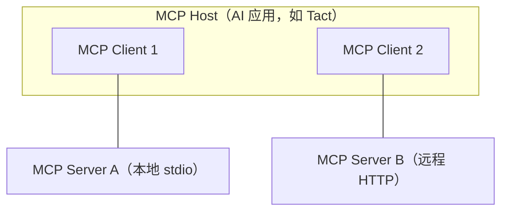
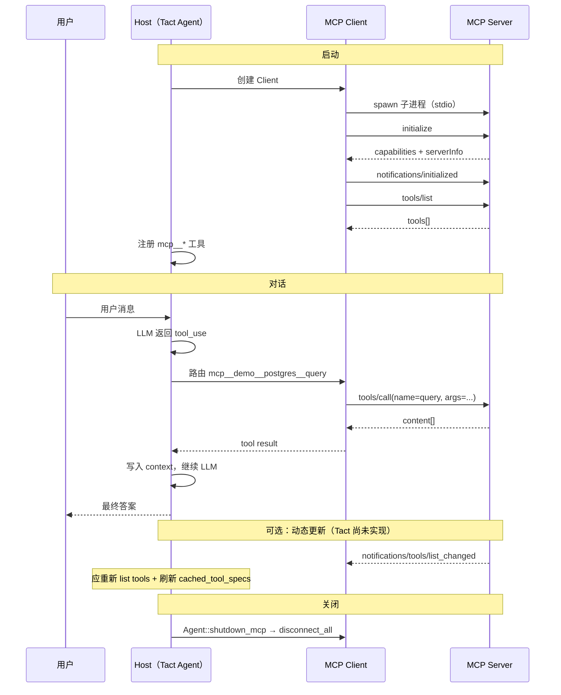

# MCP 协议与 Agent 集成

> 语言：[中文](./08_chapter_mcp_zh.md) · [English](./08_chapter_mcp.md)

本教程从 [Model Context Protocol (MCP)](https://modelcontextprotocol.io/) 的第一性原理讲到 Tact 中的具体实现——agent 如何端到端连接外部工具。

---

## 1. MCP 解决什么问题？

在 MCP 之前，每个 AI 应用（Claude Desktop、Cursor、自研 agent……）都要为每种外部能力（数据库、GitHub、文件系统……）写定制胶水。这是经典的 **M×N 集成问题**：

- M 个 AI 应用
- N 个外部工具 / 数据源
- M×N 份适配代码

MCP 用**单一协议**把它变成 **M + N**：

- 每个外部能力实现一个 **MCP Server**
- 每个 AI 应用实现一个 **MCP Client**
- 双方遵循同一套 JSON-RPC 会话规则

---

## 2. 三种角色


```mermaid
graph TB
    subgraph Host["MCP Host（AI 应用，如 Tact）"]
        C1["MCP Client 1"]
        C2["MCP Client 2"]
    end
    S1["MCP Server A（本地 stdio）"]
    S2["MCP Server B（远程 HTTP）"]

    C1 --- S1
    C2 --- S2
```

| 角色 | 是什么 | 做什么 |
|------|--------|--------|
| **Host** | AI 应用本身 | 管理 LLM、权限、用户交互，聚合所有外部能力 |
| **Client** | Host 内的一个连接对象 | **每个 Server 一个 Client**——握手、请求、响应 |
| **Server** | 独立进程或服务 | 暴露 tools / resources / prompts |

关系：**1 Host → N Clients → N Servers**。

在 Tact 中，Host 是 `Agent` + `tact-ui`；每个 `McpClient` 对应 rmcp 库中的一个 Client 实例。

---

## 3. 两层结构

### 3.1 数据层

基于 **JSON-RPC 2.0**，定义消息格式与语义：

| 消息类型 | 有 `id`？ | 期望回复？ | 用途 |
|----------|-----------|------------|------|
| **Request** | 是 | 是 | 发起操作 |
| **Response** | 是（匹配 Request） | — | 返回 `result` 或 `error` |
| **Notification** | 否 | 否 | 单向推送，例如工具列表变更 |

### 3.2 传输层

同一 JSON-RPC 消息可走不同物理通道：

| 传输 | 用例 | 说明 |
|------|------|------|
| **stdio** | 本地子进程 | Client spawn Server；`stdin`/`stdout` 上 JSON 行；无网络开销 |
| **Streamable HTTP** | 远程服务 | HTTP POST + 可选 SSE；静态 header 与 OAuth 2.0 |

Tact **两者都支持**：带 `command` 的条目录用 stdio 启动，带 `url` 的条目是远程 Streamable HTTP server（见 `McpClient::connect` 与 `remote::serve_remote`）。

---

## 4. 协议流程：逐步说明

以下按**时间顺序**，从「尚未连接」到「LLM 真正调用工具」。

### Step 0：明确分工

连接前记住：**Host 管大局，Client 管一条连接，Server 管暴露的能力**。

### Step 1：配置——告诉 Host 要连哪些 Server

启动前，Host 必须知道如何拉起每个 Server。

**首选：Tact 原生的 `mcp.json`。** 两个位置，都可选——`~/.tact/mcp.json`（用户级）与 `<workdir>/.tact/mcp.json`（项目级）。结构与所有 MCP 客户端通用的 Claude 格式一致：

```json
{
  "mcpServers": {
    "postgres": {
      "command": "node",
      "args": ["server.js"],
      "env": { "DATABASE_URL": "..." }
    }
  }
}
```

含义：以子进程运行 `command`——该进程就是 MCP Server。在这里声明的 server 直接以 map key **原样命名**，因此 agent 侧工具名恰为 `mcp__postgres__<tool>`，不带 manifest 前缀——这是可预测性最好的命名方式，也是优先使用该文件的原因。

项目级条目按 **server 名**覆盖用户级条目；两者不冲突的条目会合并。`mcp.json` 解析失败是硬错误并会指明路径（用户手写的配置无法解析时不能被静默忽略）；这与"server 连不上"不同，后者只上报。

**全部来源**，优先级自低到高。第 3 项是已安装的 marketplace 插件——可分发的**包**，只读，保留各自带 manifest 前缀的命名，永远不是引导用户配置 MCP 的方式：

| # | 来源 | 服务器名 |
|---|------|----------|
| 1 | `~/.tact/mcp.json` | map key |
| 2 | `<workdir>/.tact/mcp.json` | map key |
| 3 | 已安装插件 | `plugin__<plugin>__<server>` |

两个文件，一条规则：**用户级是 `~/.tact/mcp.json`，项目级是 `<workdir>/.tact/mcp.json`。** Tact 不读取 cwd 级 Codex manifest，也不读取 cwd 的 `.mcp.json`，"这个项目的 server 声明在哪"因此只有一个答案。

**已安装的 marketplace 插件**在启动时由 `installed_plugin_mcp_servers` 扫描：它读取 `.codex-plugin/plugin.json` 的 `mcpServers` 与插件根下的 `.mcp.json`。这些属于插件**包**格式——同样的文件名在工作目录下刻意**不**读取。

每个条目只声明一种传输：`command`（本地 stdio）或 `url`（远程 Streamable HTTP，可选 `headers` 与 `auth`）。两者同时存在时 `command` 优先。两者都没有的条目按**已跳过**上报，绝不当作硬错误。

**从命令行管理 server。** 六个子命令按「允许触碰什么」划分——`list`/`get` 负责连接，`add`/`remove` 负责写 `mcp.json`，`login`/`logout` 负责已存凭据：

| 命令 | 是否连接 | 是否写配置 | 是否动凭据 |
|------|----------|------------|------------|
| `mcp list` | 全部 server | 否 | 否 |
| `mcp get <name>` | 仅该 server | 否 | 否 |
| `mcp add <name> …` | 否 | 是 | 否 |
| `mcp remove <name>` | 否 | 是 | 否（保留） |
| `mcp login <name>` | 是（OAuth 流程） | 否 | 写入 |
| `mcp logout <name>` | 否 | 否 | 删除 |

```sh
tact-ui mcp list                              # 每个 server 及其状态
tact-ui mcp get deepwiki                      # 传输方式、来源、状态、工具
tact-ui mcp add deepwiki --url https://mcp.deepwiki.com/mcp      # 远程（无需认证）
tact-ui mcp add linear --url https://mcp.linear.app/mcp --oauth   # 远程 + OAuth
tact-ui mcp add local  --command npx --arg -y --arg some-mcp-server
tact-ui mcp remove local                      # 只删声明
tact-ui mcp login linear                      # 浏览器流程，token 落盘
tact-ui mcp logout linear                     # 删除 token
```

`add`/`remove` 默认作用于项目文件（`.tact/mcp.json`），加 `--user` 则作用于用户文件。`add --force` 覆盖同名声明；不加时同名是报错而非静默覆盖。`remove` 一个不存在的名字也是报错而非无声成功——它会告知该 server **究竟**声明在哪个文件（`retry with --user`），或说明它由插件提供。当所编辑的作用域并非最终生效的那个时，`add` 会明确提示并指名胜出的文件，否则更高优先级的声明会让这条命令变成静默的空操作。写入是原子的（唯一命名的临时文件 + rename，并保留原文件权限），并且直接编辑**原始 JSON 文档**，因此 Tact 未建模的键——包括其他 server 上的键——都会保留；删除最后一个 server 会留下空的 `mcpServers` 对象，读回来即「无 server」。`remove` 保留已存凭据（重新添加的 server 应当继续可用），删除凭据由 `logout` 负责，且它不要求 server 仍被声明，因此声明删掉后仍可清理凭据。

名称、URL、header 名与 header 值都会预先校验。server 名还会额外拒绝空白、控制字符与路径分隔符：名称同时是 `mcp__<server>__<tool>` 的 `<server>` 段与 OAuth 凭据文件名（`~/.tact/mcp/oauth/<server>.json`），因此 `mcp logout <name>` 绝不能被指向任意文件。header/env 的**值**绝不回显或记录日志（它们常含密钥），且 `add` 绝不发起连接。重复的 `--header`/`--env` 名会报错，而不是静默地后者覆盖前者。

当一个名字被多处声明时，`mcp list` 还会打印 **Overridden declarations** 段，指明被覆盖与最终生效的文件——覆盖关系决定了 `remove` 究竟改变了什么行为，因此不能是静默的。

`mcp get` 是 `mcp list` 的聚焦版本：它只连接**一个** server，因此查看单个条目不会启动或拨号其余配置，并打印 agent 实际必须调用的工具名（`mcp__<server>__<tool>`）。两个视图共用同一套状态措辞（`connected (N tools)` / `needs authorization` / `failed`），因此不会出现说法漂移。

代码：`McpConfigFile::read`（`mcp.json`）、`installed_plugin_mcp_servers`（插件）、`collect_sourced_servers` 与 `resolve_servers`（优先级）、`validate_server_name`、`resolved_server_for`、`inspect_server`、`connect_server`，均在 `crates/tact/src/mcp/mod.rs`；写入侧（`McpServerDraft`、`McpConfigScope`、`add_mcp_server`、`remove_mcp_server`）在 `crates/tact/src/mcp/edit.rs`；凭据删除（`forget_credentials`）在 `crates/tact/src/mcp/remote.rs`；CLI 处理逻辑在 `crates/tact-ui/src/mcp_cli.rs`。

### Step 1b：Server 配置错误时会发生什么

解析过程返回 `McpLoadReport`，而不是丢弃失败：

| 字段 | 含义 |
|------|------|
| `connected` | 每个成功连接的 server 名与工具数 |
| `failures` | 每个连接失败的 server 名与错误 |
| `shadowed` | server 名，以及被它顶掉的那个更低优先级来源 |
| `skipped_remote` | 因传输方式不支持/不完整而被丢弃的 server |
| `pending_auth` | 尚无可用凭据的远程 OAuth server（声明了 `auth`、token 过期且不可刷新，或服务器返回 401） |

**连接失败绝不致命**——单个坏 server 不应阻止 agent 启动。但它也不再静默：`notice_lines()` 为每条事实渲染一行，在 TUI 中以 `AgentUpdate::Info` 交付，headless 模式写入 stderr。一切正常时不产生任何输出，因此提示只在确有需要处理的事情时出现。

**待授权不会阻塞启动。** 需要 OAuth 的远程 server 会被列为 `pending_auth` 并跳过——无论它是声明了 `auth`，还是因返回 401 而被识别；运行 `/mcp auth <server>` 完成浏览器流程，成功后 MCP router 会原地热重载。

### Step 1c：远程 Server 与 OAuth

远程条目的形态：

```json
{
  "mcpServers": {
    "remote": {
      "url": "https://mcp.example.com/mcp",
      "headers": { "X-Api-Key": "..." },
      "auth": { "type": "oauth", "scopes": ["tools.read"] }
    }
  }
}
```

- 传输使用 MCP **Streamable HTTP** 客户端（`rmcp`），会话管理与 SSE 重连由 SDK 处理。`type: "http" | "sse"` 仅为提示；Tact 不支持 2024-11-05 的旧版 HTTP+SSE 端点。
- `headers` 用于简单部署的静态认证。header 值从不写日志；非法 header 名/值会带警告丢弃。
- `auth.type = "oauth"` 走 MCP 标准的 OAuth 2.0 授权码 + PKCE 流程（SEP-985）：受保护资源/RFC 8414 元数据发现、动态客户端注册、本地回环重定向（`127.0.0.1`，除非设置 `callbackPort` 否则用临时端口），并自动刷新 token。`clientId` 用于预注册客户端、跳过动态注册。
- 即使服务器需要 OAuth，`auth` 也是**可选的**：返回 401 的服务器会被识别（rmcp 的 "Auth required"）并升级为**待授权**，`/mcp auth <server>` 依然能跑完整流程。声明 `auth` 只是预先回答这个问题，并让启动阶段无需网络就能预判待授权状态。
- token 按 server 持久化在 `~/.tact/mcp/oauth/<server>.json`（Unix 下 `0600`）。若无法刷新，该 server 回到 `pending_auth`。无论是否声明过 `auth`，已存 token 都会被采用，因此授权一次后持续有效。
- **注册按客户端*名称*放行，而该名称可配置。** DCR（RFC 7591）是通用 MCP 客户端自我注册的方式，而 provider 可能对不认识的名字让注册端点返回 `403`。Figma 是可复现实例——完全相同的注册请求体，`client_name: "Codex"` 返回 `200`，`"Tact"` 返回 `403`（精确对照表见 FAQ）。因此 Tact 以 `mcp.oauth_client_name` 注册，默认 **`"Codex"`**，并支持 per-server 的 `auth.clientName` 覆盖；实际发送的名称会以 `info` 级别记入日志，也会出现在任何失败提示中，因为 provider 与授权同意页看到的就是它。设为 `oauth_client_name = "Tact"` 则如实标识，并接受白名单类 provider 拒绝注册。除此以外发现阶段是成功的——Figma 的授权服务器为 `https://api.figma.com`——所以被拒会落在最后一步，看起来像临时故障。除名称之外，报错还给出三条路线：自行注册客户端并用 `auth.clientId`（同时固定 `callbackPort` 以保持 redirect URI 稳定）、使用 provider 签发的静态 token 放在 `headers`，或运行 provider 的本地 server（Figma 提供 `http://127.0.0.1:3845/mcp`，无需 OAuth）。目前仍无法提供机密客户端的 **client secret**——rmcp 存储的凭据只有 `client_id`。
- **回环端点绕过环境代理。** 导出 `http_proxy`/`all_proxy` 时，reqwest 会把 `http://127.0.0.1:…` 也发给代理，于是本地 server 根本收不到请求，失败还表现为 `Unexpected content type: None`。现在 `127.0.0.0/8`、`localhost` 与 `::1` 使用无代理的 HTTP 客户端；其他 host 仍保留环境代理，因为在受限网络中正是代理让远程 server 可达。（OAuth 管理器仍自建客户端，因此针对**回环** server 的发现阶段会走代理——对无需 OAuth 的 Figma 桌面 server 无影响。）
- 启动阶段不做任何交互：没有凭据时只报告 pending，agent 绝不等待浏览器。`/mcp auth <server>`（`/mcp login <server>` 亦可）执行流程、打印授权 URL，成功后热重载 MCP router。headless 用户拥有同一组能力的 CLI 子命令——`tact-ui mcp list` 连接并报告，`tact-ui mcp get <name>` 查看单个 server，`tact-ui mcp add`/`remove` 编辑 `mcp.json`，`tact-ui mcp login`/`logout` 管理已存凭据；见 Step 1。

### Step 2：传输——启动 Server 进程

```
Client (Tact)                    Server (node server.js)
    │                                    │
    │  spawn 子进程                       │
    │ ─────────────────────────────────► │
    │  Client 写 JSON → Server stdin     │
    │  Server 写 JSON → Client stdout    │
    │ ◄───────────────────────────────── │
```

代码：`McpClient::connect` 经 `TokioChildProcess` spawn，然后 `handler.serve(transport)` 建立 rmcp 会话。（本步专指 stdio；`url` 条目改由 `remote::serve_remote` 构建 Streamable HTTP 传输——见 Step 1c。）

此时进程已在跑，但**协议会话尚未就绪**。

### Step 3：握手——`initialize` 与能力协商

传输就绪后，**Client 必须先发 `initialize`**。不能立刻调工具。

**Client → Server：**

```json
{
  "jsonrpc": "2.0",
  "id": 1,
  "method": "initialize",
  "params": {
    "protocolVersion": "2025-06-18",
    "capabilities": { "elicitation": {} },
    "clientInfo": { "name": "tact", "version": "0.19.0" }
  }
}
```

**Server → Client：**

```json
{
  "jsonrpc": "2.0",
  "id": 1,
  "result": {
    "protocolVersion": "2025-06-18",
    "capabilities": {
      "tools": { "listChanged": true },
      "resources": {}
    },
    "serverInfo": { "name": "postgres-server", "version": "1.0.0" }
  }
}
```

**Client → Server（Notification，无 `id`）：**

```json
{
  "jsonrpc": "2.0",
  "method": "notifications/initialized"
}
```

握手完成三件事：

1. **protocolVersion** — 双方须兼容
2. **capabilities** — 声明支持特性（tools、resources、是否支持 `list_changed` 通知……）
3. **clientInfo / serverInfo** — 身份，便于调试

在 Tact 中这发生在 rmcp 的 `serve()` 内部；应用代码不直接写 JSON。

### Step 4：工具发现——`tools/list`

握手完成后，Client 问 Server：**你暴露哪些工具？**

**Request：**

```json
{
  "jsonrpc": "2.0",
  "id": 2,
  "method": "tools/list"
}
```

**Response（节选）：**

```json
{
  "jsonrpc": "2.0",
  "id": 2,
  "result": {
    "tools": [
      {
        "name": "query",
        "description": "Run a SQL query",
        "inputSchema": {
          "type": "object",
          "properties": { "sql": { "type": "string" } },
          "required": ["sql"]
        }
      }
    ]
  }
}
```

每个工具包含：

- **name** — Server 内唯一
- **description** — 展示给 LLM
- **inputSchema** — 参数的 JSON Schema

代码：`McpClient::fetch_tools` → `service.peer().list_all_tools()`。

### Step 5：注册到 Agent——面向 LLM 的工具列表

列出工具后，Host **合并进 Agent 的工具表**。Tact 给名称加前缀以避免跨 Server 冲突：

```
mcp__<server>__<tool>
```

其中 `<server>` 取决于声明位置。来自原生 `mcp.json` 的 server 直接使用其 map key：

示例（原生 `mcp.json`，key 为 `postgres`）：`mcp__postgres__query`

已安装插件的 server 保留 manifest 前缀，名字因此更长：

示例（插件 `demo`，server `postgres`）：`mcp__demo__postgres__query`

```rust
// build_tool_specs
name: format!("mcp__{server_name}__{}", tool.name),
```

启动时 Agent 合并原生 + MCP 工具：

```rust
cached_tool_specs = native_tools + mcp_router.all_tools()
```

LLM 此时「知道」这些工具存在，但尚未调用。

### Step 6：LLM 决定调用——Agent 循环接手

用户发消息后，Agent 进入主循环：

```
User message
  → 发给 LLM（带全部 tool specs）
  → LLM 返回 tool_use 块（name + arguments）
  → Agent 执行工具
  → 把结果写回对话
  → 再发给 LLM（直到无更多 tool call）
```

LLM 可能返回：

```json
{
  "name": "mcp__demo__postgres__query",
  "input": { "sql": "SELECT 1" }
}
```

若名称以 `mcp__` 开头，Agent 走 MCP 而非原生工具。

### Step 7：执行——`tools/call`

Agent 解析工具名，找到对应 Client，发送 JSON-RPC。

**Client → Server：**

```json
{
  "jsonrpc": "2.0",
  "id": 3,
  "method": "tools/call",
  "params": {
    "name": "query",
    "arguments": { "sql": "SELECT 1" }
  }
}
```

注意：`params.name` 是 **Server 内部名**（`query`），不是 Agent 侧的 `mcp__demo__postgres__query`。

名称解析（`rsplit_once("__")` 从右切）：

```
mcp__demo__postgres__query
       └─ server ─┘  └ tool ┘
```

**Server → Client：**

```json
{
  "jsonrpc": "2.0",
  "id": 3,
  "result": {
    "content": [
      { "type": "text", "text": "[{\"?column?\": 1}]" }
    ]
  }
}
```

`content` 是数组，可混合 text、image、resource 等类型。Tact 用 `join_mcp_content` 拼接后作为 tool result 字符串写回。

### Step 8：把结果喂回 LLM

Agent 把 tool result 追加到消息历史并再次调用 LLM。完整路径：

```
User: "Query the database"
  ↓
LLM: call mcp__demo__postgres__query
  ↓
Agent → MCP Client → Server (tools/call)
  ↓
Server 执行 SQL，返回结果
  ↓
Agent 写入 context → LLM 产出最终答案
```

每次 LLM 请求都带最新工具列表（`with_tools(self.all_tool_specs())`），更新在下一轮生效。

### Step 9（可选）：Resources 与 Prompts

除 Tools 外，MCP 还定义两种原语：

| 原语 | 用途 | 典型方法 |
|------|------|----------|
| **Resources** | 只读上下文（文件、schema、API 数据） | `resources/list`, `resources/read` |
| **Prompts** | 可复用 prompt 模板 | `prompts/list`, `prompts/get` |

Tact 今天主要走 **Tools** 路径。Resources 与 Prompts 在协议中存在；Host 是否暴露给 LLM 取决于实现。

### Step 10：Notifications——Server 推送更新

Server 工具列表变化时，可不等待 Client 询问就推送：

```json
{
  "jsonrpc": "2.0",
  "method": "notifications/tools/list_changed"
}
```

Client 应重新 `tools/list` 并刷新 Agent 工具表。

**Tact 实现（目前仅启动时）：**

1. 连接时 `McpClient::fetch_tools` 调用一次 `list_all_tools()` 并构建 `tool_specs`（`mcp/mod.rs`）
2. `Agent::new` 把原生 + MCP spec 合并进 `cached_tool_specs` — **会话内固定**
3. **尚未实现：** `notifications/tools/list_changed` handler、`TactMcpClientHandler`，或 `agent_loop` 中的 `refresh_mcp_tools_if_changed()`。连接后 Server 侧动态工具变更需重启才会生效。

```rust
// crates/tact/src/mcp/mod.rs — connect 用 rmcp 与 () handler（无 ClientHandler）
().serve(transport).await?;
// 工具只拉一次：
service.peer().list_all_tools().await?;
```

```rust
// crates/tact/src/agent/mod.rs — 工具列表在 Agent 构造时缓存
let cached_tool_specs = tools.native_specs()
    .chain(mcp_router.all_tools())
    .collect();
```

### Step 11：关闭连接

会话结束时优雅断开，而不是让父进程退出、由 OS 杀子进程。

**Tact 实现：**

- `McpClient::shutdown` — `service.cancel().await`
- `MCPToolRouter::disconnect_all` — 排空所有 client 并逐个 shutdown
- `Agent::shutdown_mcp` — 退出时由 `tact-ui` 调用（`run_headless` / `run_interactive`），执行 `disconnect_all`

---

## 5. 端到端时序图


```mermaid
sequenceDiagram
    participant User as 用户
    participant Host as Host（Tact Agent）
    participant Client as MCP Client
    participant Server as MCP Server

    Note over Host,Server: 启动
    Host->>Client: 创建 Client
    Client->>Server: spawn 子进程（stdio）
    Client->>Server: initialize
    Server-->>Client: capabilities + serverInfo
    Client->>Server: notifications/initialized
    Client->>Server: tools/list
    Server-->>Client: tools[]
    Host->>Host: 注册 mcp__* 工具

    Note over User,Server: 对话
    User->>Host: 用户消息
    Host->>Host: LLM 返回 tool_use
    Host->>Client: 路由 mcp__demo__postgres__query
    Client->>Server: tools/call(name=query, args=...)
    Server-->>Client: content[]
    Client-->>Host: tool result
    Host->>Host: 写入 context，继续 LLM
    Host-->>User: 最终答案

    Note over Host,Server: 可选：动态更新（Tact 尚未实现）
    Server-->>Client: notifications/tools/list_changed
    Note over Host: 应重新 list tools + 刷新 cached_tool_specs
    Note over Host,Server: 关闭
    Host->>Client: Agent::shutdown_mcp → disconnect_all
```

---

## 6. Tact 代码地图

| 模块 | 文件 | 职责 |
|------|------|------|
| 配置扫描 | `crates/tact/src/mcp/mod.rs` — `McpConfigFile` | 读 `~/.tact/mcp.json` 与 `<workdir>/.tact/mcp.json` |
| 插件服务器 | `installed_plugin_mcp_servers` | 读取已安装插件包 |
| 来源优先级 | `collect_sourced_servers`、`resolve_servers` | 分层合并所有来源并上报覆盖 |
| 加载报告 | `McpLoadReport` | 把失败 / 覆盖 / 跳过暴露出来，而非 `debug!` |
| 连接与握手 | `McpClient::connect` | stdio spawn + rmcp `serve()` |
| 工具发现 | `McpClient::fetch_tools` | `tools/list` |
| 工具执行 | `McpClient::call_tool` | `tools/call` |
| 动态更新 | *（未实现）* | `tools/list_changed` 通知 + 缓存刷新 |
| 路由 | `MCPToolRouter` | 按 `mcp__*` 名路由到正确 Server |
| Agent 集成 | `crates/tact/src/agent/mod.rs` | `Agent::new` 合并 tool spec；每轮 LLM 用 `all_tool_specs()` |
| 并行调度 | `crates/tact/src/agent/tool_schedule.rs` | 同 Server 串行；不同 Server 可并行 |
| 入口 | `crates/tact-ui/src/headless.rs`, `interactive.rs` | 启动时 `load_mcp_router()` |

### 6.1 工具命名与路由

来自原生 `mcp.json` 的 server：

```
mcp__postgres__query
  │     │         └── tool（Server 内部名）
  │     └── server（mcp.json 的 key）
  └── 固定前缀，标记 MCP 工具
```

由已安装插件提供的 server 会保留 manifest 那一层：

```
mcp__demo__postgres__query
  │      │        │      └── tool（Server 内部名）
  │      │        └── server（插件 manifest mcpServers 的 key）
  │      └── plugin（manifest name）
  └── 固定前缀，标记 MCP 工具
```

`MCPToolRouter::call` 解析名称 → 找 client → 用 Server 内部工具名发 `tools/call`。解析按**最后一个** `__` 切分，因此 server 名本身可以包含 `__`（带插件前缀的名字正是如此）。

### 6.2 并行 vs 串行

同一 Server 上的 MCP 工具共享一条 stdio 连接，因此：

- **同一 Server** 上多个工具：**串行**（避免连接竞态）
- **不同 Server** 上的工具：**可并行**

见 `crates/tact/src/agent/tool_schedule.rs` 中的 `mcp_tool_resources` 及相关测试。

---

## 7. 最小 MCP Server 草图

只要能在 stdio 上说 JSON-RPC，任何语言都可以。伪代码：

```
1. 从 stdin 读 JSON 行
2. 收到 initialize → 回复 capabilities（含 tools.listChanged: true）
3. 收到 notifications/initialized → 忽略（Notification 无响应）
4. 收到 tools/list → 回复 tools 数组
5. 收到 tools/call → 执行业务，回复 content
6. （可选）工具变更 → 向 stdout 写 notifications/tools/list_changed
```

Tact 侧在 `plugin.json` 声明 `command` / `args` / `env` 即可接入。

---

## 8. FAQ

### Q：为什么在 Tact 源码里找不到 `initialize`？

握手在 **rmcp** SDK 的 `serve()` 内部。应用代码只 spawn 进程并调用 `handler.serve(transport).await`。

### Q：工具列表何时变化？

- **静态**工具在 Server 启动时确定 → Step 4 拉一次（当前 Tact 行为）
- **动态**工具在运行时变化 → Step 10 Notification + 刷新（**未实现** — 需重启）

### Q：MCP 工具与原生工具有何不同？

对 LLM 而言相同——都是 function-calling 工具。Agent 用 `mcp__` 前缀选择 `MCPToolRouter` 还是 `ToolRouter`。

### Q：为什么不用 HTTP 传输？

stdio 适合本地插件：零配置、低延迟。远程 MCP 服务使用 **Streamable HTTP**，Tact 已支持，可用静态 header 或 OAuth 2.0（`mcp.json` 的 `url` 条目）。

### Q：以前 `mcp login` 对 Figma 报 `HTTP 403 Forbidden`，现在为什么可以了？

因为注册按**客户端名称**放行，所以 Tact 现在默认以 `"Codex"` 注册（`mcp.oauth_client_name`）。对线上端点实测（其余请求体完全一致）：

| 发送的 `client_name` | 注册结果 |
|---|---|
| `Codex` | `200`（每次运行都得到新的 `client_id`/`client_secret`） |
| `Claude Code` | `200` |
| `Tact` | `403 Forbidden` |
| `Cursor` | `403 Forbidden` |
| `Visual Studio Code` | `403 Forbidden` |
| `codex`（小写） | `403 Forbidden` |

Codex 本身也像 Tact 一样做动态注册——其插件的 `.mcp.json` 没有 `client_id`，且每次运行得到的都不同——所以名称是唯一差别。由于默认值现为 `"Codex"`，`tact-ui mcp login figma` 能够走到授权 URL。

```toml
[mcp]
oauth_client_name = "Codex"   # 默认；设为 "Tact" 可如实标识
```

仅当某个 provider 需要不同答案时，用 per-server 覆盖：

```json
{ "mcpServers": { "figma": { "url": "https://mcp.figma.com/mcp",
                             "auth": { "type": "oauth", "clientName": "Codex" } } } }
```

请注意其代价：provider 以及展示给你的授权同意页看到的是 `"Codex"` 而非 `"Tact"`。Tact 不隐藏这一点——实际使用的名称会以 `info` 级别写入日志（`client_name=…`），并出现在任何注册失败的提示中。设为 `oauth_client_name = "Tact"` 则如实标识，此时白名单类 provider 会拒绝注册并给出说明与替代方案。

### Q：某个 provider 依然拒绝注册，怎么办？

上面的实测只针对 Figma 认可的名称。别的 provider 可能按不同取值放行，或者干脆拒绝注册（有些根本不声明注册端点）。失败提示会写明 Tact 发送的名称以及两个覆盖点；其余可选方案是：自行在 provider 处注册客户端并设置 `auth.clientId`（同时固定 `callbackPort`）、使用 provider 签发的静态 token 放在 `headers`，或在 provider 自带本地 server 时改用它（`tact-ui mcp add figma-desktop --url http://127.0.0.1:3845/mcp`，无需 OAuth）。每次失败都会记录 server 名、provider URL、发送的客户端名称以及是否声明了注册端点，`RUST_LOG=tact=debug` 可看到完整轨迹。注册成功则说明获得了什么：`client_id` + `client_secret` 以及 `token_endpoint_auth_method: "none"`。

---

## 9. 速查（11 步）

| 步骤 | 动作 | JSON-RPC 方法 |
|------|------|----------------|
| 1 | 读配置（`mcp.json`，再读已安装插件） | （Host 本地） |
| 2 | 启动 Server 进程 | （stdio 传输） |
| 3 | 握手 | `initialize` + `notifications/initialized` |
| 4 | 发现工具 | `tools/list` |
| 5 | 注册给 LLM | （Host 本地） |
| 6 | LLM 选工具 | （LLM 返回 tool_use） |
| 7 | 执行 | `tools/call` |
| 8 | 回写结果 | （Host 写入 context） |
| 9 | 可选：resources / prompts | `resources/*`, `prompts/*` |
| 10 | 可选： live 更新 | Notification |
| 11 | 关闭 | `close` / disconnect |

**一句话：** MCP = 有状态 JSON-RPC 会话 + 能力协商 + 三种原语（tools / resources / prompts），经 stdio 或 HTTP，让 Host 用任意语言编写的 Server 即插即用。

---

## 10. 当前缺口

| 缺口 | 说明 |
|------|------|
| **无 `tools/list_changed` 处理** | 工具列表在连接时固定；无 `ClientHandler` 或循环内刷新 |
| **Resources / prompts** | 协议原语存在；Tact 今天只接 Tools |
| **旧版 HTTP+SSE** | `type: "sse"` 映射到 Streamable HTTP；已废弃的 2024-11-05 HTTP+SSE 端点未实现 |
| **OAuth 设备码 / mTLS** | 只实现授权码 + PKCE 流程；无设备码、客户端证书或企业 SSO |
| **客户端密钥 / 白名单 provider** | 只支持自我注册（DCR）与公共客户端的 `clientId`；若 provider 既拒绝 DCR 又要求 client secret（Figma 远程 server），则无法在 Tact 内完成授权——报错会指明替代方案 |
| **按工具的权限粒度** | 所有 MCP 工具都解析为 `CapabilityRisk::High`；`normalize_mcp_capability` 忽略 server 与 tool 两者 |
| **无类型化环境变量插值** | `mcp.json` 的 `env` 值是字面量；不支持 `${VAR}` 展开 |

---

## 11. 延伸阅读

- [MCP architecture overview](https://modelcontextprotocol.io/docs/learn/architecture)
- [MCP specification — Lifecycle](https://modelcontextprotocol.io/specification/2025-06-18/basic/lifecycle)
- Tact 源码：`crates/tact/src/mcp/mod.rs`
- rmcp（Rust SDK）：项目 `Cargo.toml` 中 `rmcp = "0.17"`
