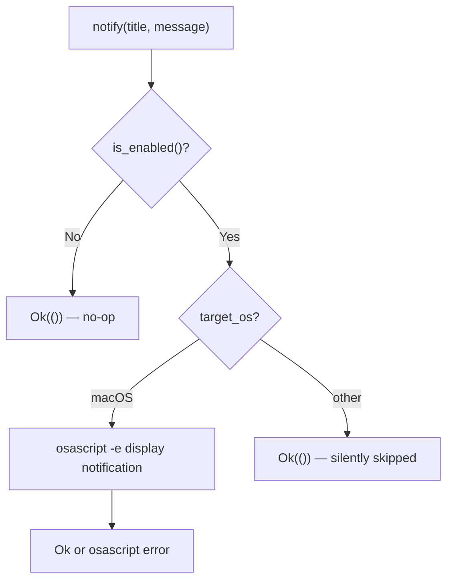

# Desktop Notifications

This chapter explains how Tact sends **native desktop notifications** when key agent lifecycle events occur — primarily task completion and tool-step failures. The module is small and platform-specific: it is fully implemented on macOS and is a no-op elsewhere.

Notifications are orthogonal to the TUI log panel. They fire even when the terminal is not focused, so long-running headless or background sessions can alert the user on macOS.

---

## 1. What Notifications Do

`crates/tact/src/notifications/mod.rs` wraps a single primitive:

```rust
pub fn notify(title: &str, message: &str) -> Result<()>;
```

Higher-level helpers format common events:

| Function | Title | When used |
|----------|-------|-----------|
| `notify_task_complete(summary)` | `Tact — Task Complete` | Agent finishes successfully |
| `notify_step_failed(step_idx, error)` | `Tact — Step Failed` | A tool step fails |
| `notify_info(summary)` | `Tact — Info` | **Defined but not called anywhere today** |

All paths respect the global enable flag before doing any work.

---

## 2. Platform Behavior



### macOS

Uses AppleScript via `osascript`:

```applescript
display notification "{message}" with title "{title}"
```

Double quotes in title and message are escaped. Failure to spawn `osascript` returns `Err`.

### Non-macOS

The function returns `Ok(())` immediately. No fallback (no `notify-send`, no Windows toast API).

---

## 3. Configuration

Notifications are **enabled by default**.

| Source | Setting |
|--------|---------|
| TOML | `[agent] notifications_enabled = false` |
| CLI | `--no-notifications` |

Resolved in `config/resolve.rs` and read at runtime via:

```rust
pub fn is_enabled() -> bool {
    crate::config::settings().agent.notifications_enabled
}
```

When disabled, every public function returns `Ok(())` without spawning subprocesses.

---

## 4. Integration in the Agent

Notifications are triggered from `Agent::emit_update` (`crates/tact/src/agent/mod.rs`), **before** the update is forwarded to the TUI channel:

```rust
match &update {
    AgentUpdate::TaskComplete(text) => {
        let summary = text.chars().take(200).collect::<String>();
        let _ = crate::notifications::notify_task_complete(&summary);
    }
    AgentUpdate::StepFailed(idx, _, msg) => {
        let _ = crate::notifications::notify_step_failed(*idx, msg);
    }
    _ => {}
}
```

```mermaid
sequenceDiagram
    participant Agent
    participant Notify as notifications::
    participant TUI

    Agent->>Agent: emit_update(TaskComplete)
    Agent->>Notify: notify_task_complete (≤200 chars)
    Note over Notify: macOS only; errors ignored
    Agent->>TUI: ui_tx.send(update)

    Agent->>Agent: emit_update(StepFailed)
    Agent->>Notify: notify_step_failed (error ≤120 chars)
    Agent->>TUI: ui_tx.send(update)
```

### Headless duplicate

`run_headless` in `crates/tact/src/bin/tui.rs` also calls `notify_task_complete` after printing final text — in addition to any notification already sent via `emit_update` during `agent_loop`. Headless runs may therefore show **two** completion notifications on macOS.

Errors from notification calls are discarded (`let _ = …`) everywhere — a failed `osascript` does not fail the agent.

---

## 5. What Does *Not* Trigger Notifications

These `AgentUpdate` variants do **not** notify:

- `StepStarted`, `StepFinished`, `StepAdded`
- `Info`, `ModelInfo`, streaming tokens
- Permission prompts (`RequestSelect`)
- Thinking blocks

There is no notification for session start, compaction, or MCP connection events.

---

## 6. Code Map

| File | Role |
|------|------|
| `crates/tact/src/notifications/mod.rs` | `notify`, helpers, `is_enabled`, platform cfg |
| `crates/tact/src/agent/mod.rs` | `emit_update` — TaskComplete and StepFailed hooks |
| `crates/tact/src/bin/tui.rs` | Headless completion notification after stdout |
| `crates/tact/src/config/types.rs` | `AgentTomlConfig.notifications_enabled` |
| `crates/tact/src/config/resolve.rs` | CLI `--no-notifications` override |

---

## 7. Current Gaps

| Gap | Detail |
|-----|--------|
| macOS only | Linux and Windows users get no desktop alerts |
| `notify_info` unused | No call sites in the codebase |
| Errors swallowed | `osascript` failures are ignored; no TUI fallback message |
| Duplicate TaskComplete (headless) | Both `emit_update` and `run_headless` may notify on success |
| No rate limiting | Rapid step failures could spam notifications |
| No custom titles per session | All notifications use fixed "Tact — …" prefixes |

---

## Related Docs

- [Tasks and Tool Scheduling](./03_chapter_task.md) — when `StepFailed` is emitted
- [ARCHITECTURE.md](../ARCHITECTURE.md) — agent update flow overview
