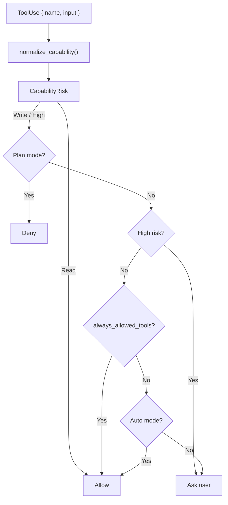
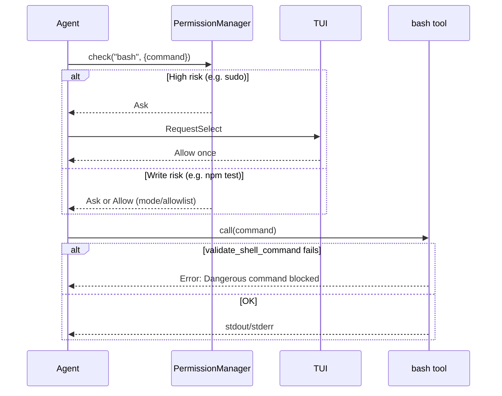
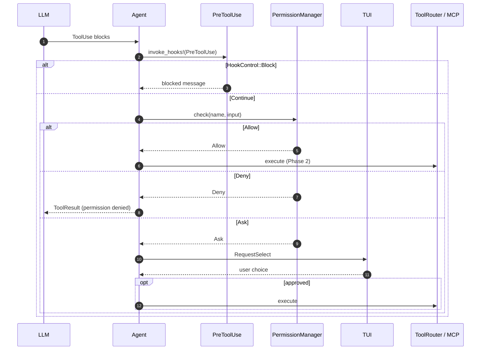

# Permission Model

This chapter explains how Tact decides whether each tool call may run: intent classification by risk, three permission modes, an in-session allowlist, and interactive approval through the TUI.

Every native and MCP tool passes through the same gate in Phase 1 of `Agent::execute_tool_call` — after `PreToolUse` hooks and before parallel execution. See [Agent Lifecycle Hooks](./09_chapter_hook.md) for hook ordering.

---

## 1. What the Permission Model Does

`PermissionManager` (`crates/tact/src/permission/mod.rs`) answers one question per tool call:

> Given this tool name and input, should we **allow**, **deny**, or **ask the user**?

It does **not** execute tools. It classifies intent, applies the active mode and allowlist, and returns a `PermissionDecision`. The agent in `crates/tact/src/agent/tool_dispatch.rs` turns that into either scheduling the tool or synthesizing a blocked `ToolResult`.

| Layer | Responsibility |
|-------|------------------|
| `normalize_capability()` | Parse native vs MCP tool names; compute `CapabilityRisk` |
| `PermissionManager::check()` | Map risk + mode + allowlist → `PermissionBehavior` |
| `tool_dispatch.rs` | Handle `Ask` via TUI `RequestSelect` or headless deny |
| `bash` tool + `shell.rs` | Hard-block a subset of dangerous shell commands at execution time |

Shell commands get **two** defenses: high-risk patterns trigger permission prompts; a smaller set is rejected outright inside the `bash` tool even after approval.

---

## 2. Intent Classification

### Core types

```rust
pub enum CapabilitySource { Native, Mcp }

pub enum CapabilityRisk { Read, Write, High }

pub struct CapabilityIntent {
    pub source: CapabilitySource,
    pub server: Option<String>,  // MCP server segment, if any
    pub tool: String,              // short tool name after parsing
    pub risk: CapabilityRisk,
}
```

`normalize_capability(tool_name, tool_input)` is the single entry point. It parses the tool name, then calls `classify_risk()`.

### Native vs MCP tool names

| Pattern | Example | Parsed result |
|---------|---------|---------------|
| Native | `read_file` | `source = Native`, `tool = "read_file"` |
| MCP | `mcp__demo__db__query` | `source = Mcp`, `server = Some("demo__db")`, `tool = "query"` |

MCP names use the prefix `mcp__`, then `server__tool` with the **rightmost** `__` split (so server IDs may contain underscores).

### Risk rules

Classification is heuristic — based on tool name prefixes and, for `bash`, the command string:

| Risk | Rule |
|------|------|
| **Read** | `read_file`; names starting with `read`, `list`, `get`, `show`, `search`, `query`, `inspect`, `find` |
| **Read** (bash) | Simple read-only commands: `ls`, `pwd`, `cat`, `head`, `tail`, `wc`, `rg`, `grep`; or `git status` / `diff` / `log` / `show` / `branch` — only when the command has no shell metacharacters (`;`, `&`, `\|`, `` ` ``, `$`, `>`, `<`) |
| **High** | `task` (spawns a sub-agent with full filesystem and shell access); names starting with `delete`, `remove`, `drop`, `shutdown`; bash commands matching high-risk patterns (see [§7 Shell high-risk detection](#7-shell-high-risk-detection)) |
| **Write** | Everything else (default for unknown native tools and non-read bash) |

MCP tools follow the same prefix rules on the **short** tool name after parsing. A tool like `mcp__demo__db__query` is classified as **Read** because `query` matches a read prefix.

---

## 3. PermissionBehavior: Allow, Deny, Ask

```rust
pub enum PermissionBehavior {
    Allow,
    Deny,
    Ask,
}

pub struct PermissionDecision {
    pub behavior: PermissionBehavior,
    pub reason: String,
}
```

| Behavior | Meaning in `tool_dispatch.rs` |
|----------|-------------------------------|
| **Allow** | Tool enters Phase 2 (parallel execution) |
| **Deny** | `PreparedState::Resolved` with `"Permission denied: …"`; model receives a failed tool result |
| **Ask** | Interactive prompt (TUI) or automatic deny (headless); see [§6 TUI RequestSelect flow](#6-tui-requestselect-flow) |

---

## 4. Permission Modes

```rust
pub enum PermissionMode {
    Default,
    Plan,
    Auto,
}
```

Display labels (from `PermissionMode`'s `Display` impl):

| Mode | Label | Behavior |
|------|-------|----------|
| `Default` | `default - ask for writes` | Read tools allowed; Write tools ask (unless allowlisted); High always asks |
| `Plan` | `plan - read only` | Read allowed; Write and High **denied** without prompting |
| `Auto` | `auto - allow non-high operations` | Read and Write auto-approved; High still asks |

### Decision order in `PermissionManager::check()`

The checks run in this fixed order:

```text
1. Read risk?                    → Allow (all modes; resets consecutive_denials)
2. Plan mode + non-Read?         → Deny
3. High risk?                    → Ask (even if tool is on allowlist)
4. Tool in always_allowed_tools? → Allow
5. Auto mode?                    → Allow (non-high writes)
6. Default (or unreachable Plan) → Ask
```



**High-risk override:** if the user chooses "Always allow this tool" for `bash`, subsequent high-risk bash commands (e.g. `sudo ls`) still return `Ask`. The allowlist only bypasses the Default-mode write prompt, not High-risk classification.

---

## 5. Allowlist and Consecutive Denials

### In-session allowlist

`PermissionManager` holds `always_allowed_tools: Vec<String>`. On construction (`try_new`), it is seeded with `"read_file"`.

When the user picks **"Always allow this tool"** in the TUI, `allow_tool(tool_name)` appends the exact tool name (e.g. `edit_file`, `bash`). Future **Write**-risk calls to that name skip the Default-mode prompt.

The allowlist is **in-memory only** — it is not persisted to SQLite or TOML between sessions.

### Consecutive denials

Each user **Deny** increments `consecutive_denials`. Allow-once and always-allow reset it to zero.

After `max_consecutive_denials` (default **3**) denials, `should_suggest_plan_mode()` returns true. In non-interactive mode, `ask_user()` prints a hint to stderr:

```text
[3 consecutive denials -- consider switching to plan mode]
```

There is no automatic mode switch today — the message is advisory only.

---

## 6. TUI RequestSelect Flow

When `check()` returns `Ask` and the agent has a UI channel (`runtime.ui_tx`), `tool_dispatch.rs` sends:

```rust
AgentUpdate::RequestSelect {
    prompt,      // e.g. "Allow bash: {\"command\":\"npm test\"}"
    options,     // ["Allow once", "Deny", "Always allow this tool"]
    respond,     // oneshot channel back to the agent
}
```

The TUI (`crates/tui/src/widgets/state/app/agent.rs`) switches to `InputMode::Select` and renders the select popup (`log_confirm = false` so the choice does not clutter the log).

| User choice | Index | Agent action |
|-------------|-------|--------------|
| Allow once | 0 | Run tool; set `permission_label = "Allow once"` on `StepFinished` |
| Deny | 1 (default) | `PreparedState::Resolved`; `StepFailed` with deny message |
| Always allow this tool | 2 | `allow_tool(name)`; run tool; `permission_label = "Always allow this tool"` |

The `permission_label` is attached to `StepResult` and shown on the tool meta row in the TUI. See [Tool Rendering](../docs/tool_rendering.md).

### Headless / no UI channel

If `ui_tx` is absent, the agent calls `permission_manager.ask_user()`, which **always denies** and logs to stderr:

```text
[permission] non-interactive: denying <tool> (<input preview>)
```

Headless runs therefore behave like persistent deny unless the decision was already `Allow` or `Deny` without prompting.

---

## 7. Shell High-Risk Detection

Shared logic lives in `crates/tact/src/shell.rs`:

```rust
pub fn is_high_risk_shell_command(command: &str) -> bool;
pub fn validate_shell_command(command: &str) -> Result<()>;
```

`is_high_risk_shell_command` lowercases the command and checks for blocked substrings:

| Pattern | Effect |
|---------|--------|
| `sudo`, `shutdown`, `reboot` | High risk |
| `> /dev/`, `>> /dev/` | High risk |
| `rm -rf /`, `rm -fr /`, `rm -rf /*`, … | High risk |
| `rm -rf ~`, `rm -fr $home`, … | High risk |

### Two layers



1. **Permission layer** — `classify_risk` uses `is_high_risk_shell_command` to mark High risk → always `Ask` (except Read-only bash).
2. **Execution layer** — `bash` and `background_run` call `validate_shell_command` before spawning. A blocked command fails even if the user approved it.

Benign destructive paths are allowed at execution but may still prompt: e.g. `rm -rf ./build` passes `validate_shell_command` but is classified as **Write**, so Default mode asks first.

Read-only bash detection rejects commands with shell metacharacters — `ls; rm -rf /` is **Write**, not Read.

---

## 8. Integration in the Tool Pipeline

Permissions run in **Phase 1** of `execute_tool_call` (`crates/tact/src/agent/tool_dispatch.rs`), strictly after hooks:

```text
For each ToolUse (sequential):
  stats · cancel check
  StepAdded / StepStarted
  PreToolUse hooks          ← can mutate input or Block
  PermissionManager::check  ← this chapter
  Ask → RequestSelect (if needed)
  PreparedState::Run | Resolved

Phase 2: parallel waves (no permission re-check)
Phase 3: build ToolResult blocks in model order
```



`PermissionManager` lives on `AgentRuntime` (`crates/tact/src/agent/mod.rs`), not on `ToolContext`. Sub-agents created by the `task` tool get their own manager (always `PermissionMode::Default`) but inherit the main agent's `ui_tx` so permission popups still work.

---

## 9. Configuration

### TOML

```toml
[permission]
mode = "default"   # "default" | "plan" | "auto"
```

Defined in `PermissionTomlConfig` (`crates/tact/src/config/types.rs`). Default when omitted: `"default"`.

### CLI

`--permission-mode` / `-m` overrides TOML via `config/resolve.rs` → `ResolvedConfig.permission_mode`.

### Startup behavior today

| Entry point | Mode used |
|-------------|-----------|
| `tact-ui headless` | `permission_mode_from_config()` — reads TOML / CLI; unknown values fall through to **Auto** |
| `tact-ui` (interactive TUI) | Same as headless — `permission_mode_from_config()` |

---

## 10. Code Map

| File | Role |
|------|------|
| `crates/tact/src/permission/mod.rs` | `CapabilityRisk`, `PermissionManager`, `normalize_capability`, classification heuristics |
| `crates/tact/src/shell.rs` | Shared high-risk shell patterns; `validate_shell_command` for execution-time block |
| `crates/tact/src/agent/tool_dispatch.rs` | Pre-flight permission check; `RequestSelect` handling; `permission_label` on `StepFinished` |
| `crates/tact/src/agent/mod.rs` | `AgentRuntime.permission_manager` |
| `crates/tact/src/tool/bash.rs` | Calls `validate_shell_command` before spawning shell |
| `crates/tact/src/background.rs` | Same validation for background shell commands |
| `crates/tact/src/tool/subagent.rs` | Sub-agent uses `Default` mode; inherits `ui_tx` |
| `crates/tact-ui/src/main.rs` | Constructs `PermissionManager` at session start |
| `crates/tact/src/config/types.rs` | `[permission] mode` TOML schema |
| `crates/tui/src/widgets/state/app/agent.rs` | Handles `AgentUpdate::RequestSelect` |
| `crates/protocol/src/lib.rs` | `AgentUpdate::RequestSelect`, `StepResult.permission_label` |

---

## 11. Current Gaps

| Gap | Detail |
|-----|--------|
| Allowlist not persisted | "Always allow this tool" lasts only for the current process |
| No runtime mode switch API | User must restart with a different mode; stderr only suggests Plan after repeated denials |
| Headless auto-denies all Ask | No non-interactive approval path except Auto/Plan/Default logic that avoids Ask |
| `PlanStep.need_approval` unused | Permission flow does not set this flag; approval is driven entirely by `PermissionManager` |
| Permission vs hook overlap | Both can block tools; hooks run first and skip permission on `Block` |

---

## Related Docs

- [Tasks and Tool Scheduling](./11_chapter_task.md) — three-phase pipeline permissions sit inside
- [Subagents](./12_chapter_subagent.md) — `task` High risk, separate `PermissionManager`, inherited `ui_tx`
- [Agent Lifecycle Hooks](./09_chapter_hook.md) — PreToolUse runs immediately before permission check
- [ARCHITECTURE.md](../ARCHITECTURE.md#3-permission-system) — architecture diagram and mode table
- [docs/state_machines.md](../docs/state_machines.md) — permission decision state machine
- [docs/tool_rendering.md](../docs/tool_rendering.md) — how `permission_label` appears in the TUI
- [docs/parallel_tool_execution.md](../docs/parallel_tool_execution.md) — why pre-flight stays sequential
