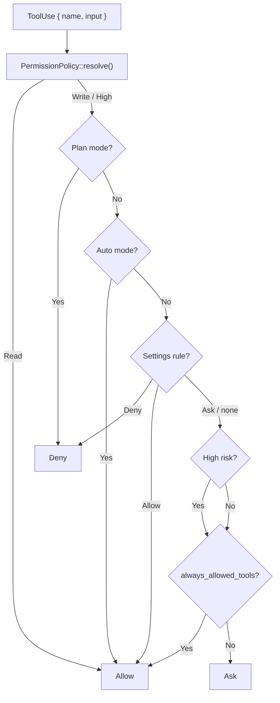
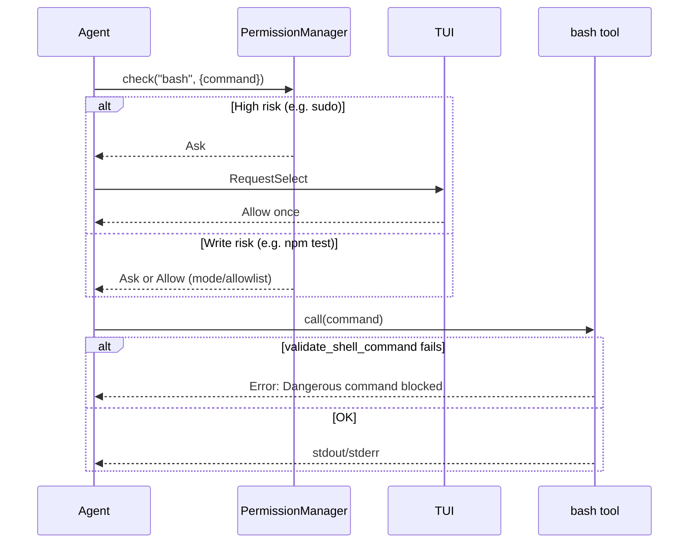
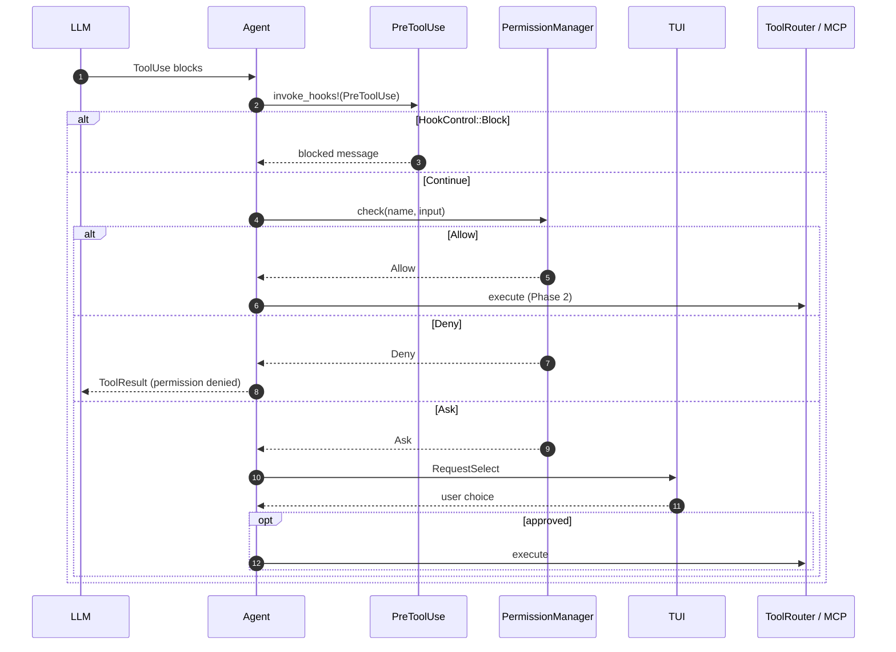
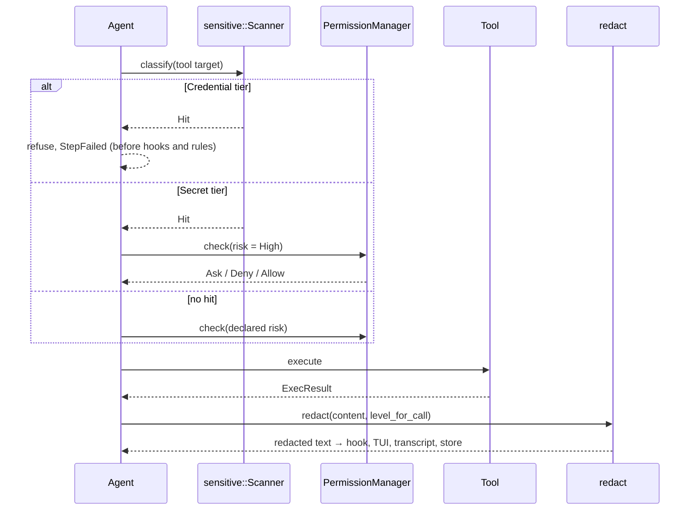

# Permission Model
> Language: [English](./10_chapter_permission.md) · [中文](./10_chapter_permission_zh.md)

This chapter explains how Tact decides whether each tool call may run: intent classification by risk, three permission modes, an in-session allowlist, and interactive approval through the TUI.

Every native and MCP tool passes through the same gate in Phase 1 of `Agent::execute_tool_call` — after `PreToolUse` hooks and before parallel execution. See [Agent Lifecycle Hooks](./09_chapter_hook.md) for hook ordering.

---

## 1. What the Permission Model Does

`PermissionManager` (`crates/tact/src/permission/mod.rs`) answers one question per tool call:

> Given this tool name and input, should we **allow**, **deny**, or **ask the user**?

It does **not** execute tools. It classifies intent, applies the active mode and allowlist, and returns a `PermissionDecision`. The agent in `crates/tact/src/agent/tool_dispatch.rs` turns that into either scheduling the tool or synthesizing a blocked `ToolResult`.

| Layer | Responsibility |
|-------|------------------|
| `PermissionPolicy::resolve()` | Classify native tool input → `CapabilityRisk` |
| `PermissionManager::check()` | Map risk + mode + settings + allowlist → `PermissionBehavior` |
| `tool_dispatch.rs` | Handle `Ask` via TUI `RequestSelect` or headless `ask_user(risk)` |
| `bash` tool + `shell.rs` | Hard-block a subset of dangerous shell commands at execution time |

Shell commands get **two** defenses: high-risk patterns trigger permission prompts; a smaller set is rejected outright inside the `bash` tool even after approval.

### Permission vs sandbox

Permission answers *may this command run*. It says nothing about what the command
can reach once it does. Those are deliberately separate layers:

```text
Permission  = authorization    (may the agent run this?)
Sandbox     = execution boundary (what can the running command access?)
```

The optional `bash` sandbox ([Tool System §7.1](./07_chapter_tool.md), full chapter: [Bash Sandbox](./27_chapter_sandbox.md)) sits in
the second layer and changes nothing in this chapter: enabling
`[tools] sandbox = true` adds no prompt and removes no check. A command can be
`Permission = allow` and still be unable to read the host home — the sandbox
bounds the filesystem, not the network (it shares the host's).

---

## 2. Intent Classification

### Core types

```rust
pub enum CapabilitySource { Native, Mcp }

pub enum CapabilityRisk { Read, Write, High }

pub struct CapabilityIntent {
    pub source: CapabilitySource,
    pub server: Option<String>,  // MCP server segment, if any
    pub tool: String,              // short tool name after parsing
    pub risk: CapabilityRisk,
}
```

`normalize_capability(tool_name, tool_input)` is the single entry point. It parses the tool name, then calls `classify_risk()`.

### Native vs MCP tool names

| Pattern | Example | Parsed result |
|---------|---------|---------------|
| Native | `read_file` | `source = Native`, `tool = "read_file"` |
| MCP | `mcp__demo__db__query` | `source = Mcp`, `server = Some("demo__db")`, `tool = "query"` |

MCP names use the prefix `mcp__`, then `server__tool` with the **rightmost** `__` split (so server IDs may contain underscores).

### Risk rules

Classification is heuristic — based on tool name prefixes and, for `bash`, the command string:

| Risk | Rule |
|------|------|
| **Read** | Tools with `PermissionPolicy::Read` (e.g. `read_file`); shell commands that are provably read-only (see [§7](#7-shell-high-risk-detection)) |
| **Write** | Tools with `PermissionPolicy::Write`; shell tools (`bash` / `background_run` / `worktree_run`) for commands that cannot be proven read-only |
| **High** | Tools with `PermissionPolicy::High` (e.g. `spawn_subagent`); shell commands starting with `sudo ` or `su ` |

A separate hard-block list in `shell.rs` still rejects a subset of dangerous commands at execution time (see [§7](#7-shell-high-risk-detection)), even after permission approval.

MCP tools use their own metadata / defaults; unknown tools are treated as **High** at the dispatch gate.

---

## 3. PermissionBehavior: Allow, Deny, Ask

```rust
pub enum PermissionBehavior {
    Allow,
    Deny,
    Ask,
}

pub struct PermissionDecision {
    pub behavior: PermissionBehavior,
    pub reason: String,
}
```

| Behavior | Meaning in `tool_dispatch.rs` |
|----------|-------------------------------|
| **Allow** | Tool enters Phase 2 (parallel execution) |
| **Deny** | `PreparedState::Resolved` with `"Permission denied: …"`; model receives a failed tool result |
| **Ask** | Interactive prompt (TUI), or headless `ask_user` defaults (allow Write/Read, deny High); see [§6 TUI RequestSelect flow](#6-tui-requestselect-flow) |

---

## 4. Permission Modes

```rust
pub enum PermissionMode {
    Default,
    Plan,
    Auto,
}
```

Display labels (from `PermissionMode`'s `Display` impl):

| Mode | Label | Behavior |
|------|-------|----------|
| `Default` | `default - ask for writes` | Read allowed; Write asks unless settings/allowlist match; High asks unless a settings **allow** rule matches **or the in-session allowlist already covers that exact tool and input** |
| `Plan` | `plan - read only` | Read allowed (including provably read-only shell commands — `ls`, `grep`, `git status`, …); Write and High **denied** without prompting |
| `Auto` | `auto - allow non-high operations` | All risks auto-approved (including High) |

### Decision order in `PermissionManager::check()`

Before any of it, `tool_dispatch` runs the **sensitive-target guard** (§12). A
`Credential`-tier hit is refused there and never reaches this ladder; a `Secret`
tier becomes `High` and enters it at step 2.

The checks run in this fixed order:

```text
1. Read risk?                              → Allow (all modes)
2. Plan mode + non-Read?                   → Deny
3. Auto mode?                              → Allow (all risks)
4. Settings deny rule?                     → Deny
5. Settings allow rule?                    → Allow (including High)
6. Settings ask rule (non-High)?           → Ask
7. Server-policy auto-approve?             → Allow
8. High risk + in-session always_allowed?  → Allow
9. High risk (nothing allowed it)?         → Ask
10. In-session always_allowed match?       → Allow
11. Default                                → Ask
```


```mermaid
flowchart TD
    TC["ToolUse { name, input }"] --> Risk["PermissionPolicy::resolve()"]
    Risk -- Read --> Allow["Allow"]
    Risk -- Write / High --> Plan{"Plan mode?"}

    Plan -- Yes --> Deny["Deny"]
    Plan -- No --> Auto{"Auto mode?"}

    Auto -- Yes --> Allow
    Auto -- No --> Settings{"Settings rule?"}

    Settings -- Deny --> Deny
    Settings -- Allow --> Allow
    Settings -- Ask / none --> High{"High risk?"}

    High -- Yes --> AllowList{"always_allowed_tools?"}
    High -- No --> AllowList

    AllowList -- Yes --> Allow
    AllowList -- No --> Ask
```

**High-risk vs allowlists:** High is asked for the first time, whatever the allowlist says. Once an allow covers **that exact tool and input** — a bare `allow_tool` name, or the input-aware rule "Always allow this tool" writes — High is allowed like any other risk. Plan mode and an explicit `deny`/`ask` rule are still evaluated first, so a grant relaxes the prompt and never the mode or the rules. A matching project settings **allow** rule reaches High through step 5, before the allowlist is even consulted.

A fresh non-interactive session still denies High: `always_allowed_tools` is seeded with `read_file` only and is never filled from settings, so the list is what the user granted at a prompt, and there is no prompt.

---

## 5. Allowlist and Consecutive Denials

### In-session allowlist

`PermissionManager` holds `always_allowed_tools: Vec<String>`. It is **empty** on construction.

It used to be seeded with `"read_file"`. That entry did nothing while `read_file`
was always classified `Read` — and everything once a sensitive target could
escalate it to `High`, because a bare name in the list grants every input, `.env`
included. An allow-list entry nobody granted must not be able to outrank the
guard, so the seed is gone.

When the user picks **"Always allow this tool"** in the TUI, `tool_dispatch` calls `allow_tool_with_input(name, policy, input)` — an **input-aware** rule for that exact call, not a bare tool name. With a settings store present it is persisted to the project's `.tact/settings.json`; without one it lands in the in-memory list. Either way, future calls matching that tool **and** input skip the prompt, at **every** risk including **High**.

(`allow_tool(name)` — the bare-name form — still exists and still grants every input, and it too now covers High. A fresh session's list is empty, so nothing is granted without a real click.)

**"Always allow" can decline to remember.** `PermissionRule::generate` returns
`None` when no rule narrower than the whole tool can be expressed: the field is
absent, is not a string, or the value contains a rule-grammar delimiter (`(`,
`)`, `:` — the pattern is embedded in `tool(field:pattern)`). The old behaviour
was to fall back to a *bare* rule, and because `bash` on any command containing
a colon (`git commit -m "fix: thing"`) hit that path, one click permitted every
future shell command, in every session. The click is now approved once and
`AllowOutcome::NotNarrowable` makes `tool_dispatch` say so out loud — a gesture
that silently does nothing is indistinguishable from a bug.

The allowlist is **in-memory only** — it is not persisted to SQLite or TOML between sessions. Only the settings-rule form survives a restart.

### Consecutive denials

Each user **Deny** increments `consecutive_denials`. Allow-once and always-allow reset it to zero.

After `max_consecutive_denials` (default **3**) denials, `should_suggest_plan_mode()` returns true. In non-interactive mode, `ask_user()` prints a hint to stderr:

```text
[3 consecutive denials -- consider switching to plan mode]
```

There is no automatic mode switch today — the message is advisory only.

---

## 6. TUI RequestSelect Flow

When `check()` returns `Ask` and the agent has a UI channel (`runtime.ui_tx`), `tool_dispatch.rs` sends:

```rust
AgentUpdate::RequestSelect {
    prompt,      // e.g. "Allow bash: {\"command\":\"npm test\"}"
    options,     // ["Allow once", "Deny", "Always allow this tool"]
    respond,     // oneshot channel back to the agent
}
```

The TUI (`crates/tui/src/widgets/state/app/agent.rs`) switches to `InputMode::Select` and renders the select popup (`log_confirm = false` so the choice does not clutter the log).

| User choice | Index | Agent action |
|-------------|-------|--------------|
| Allow once | 0 | Run tool; set `permission_label = "Allow once"` on `StepFinished` |
| Deny | 1 (default) | `PreparedState::Resolved`; `StepFailed` with deny message |
| Always allow this tool | 2 | `allow_tool_with_input(name, policy, input)`; run tool; `permission_label = "Always allow this tool"` |

The `permission_label` is attached to `StepResult` and shown on the tool meta row in the TUI. See [Tool Rendering](../docs/tool_rendering.md).

### Headless / no UI channel

If `ui_tx` is absent, the agent calls `permission_manager.ask_user(tool, risk)`:

| Risk | Non-interactive default | stderr |
|------|-------------------------|--------|
| **High** | Deny | `[permission] non-interactive: denying high-risk <tool>` |
| **Write** / **Read** | Allow once | `[permission] non-interactive: allowing <tool>` |

Use `--auto` (Auto mode) when unattended runs must also approve High-risk tools without a TUI. Settings allow/deny rules still apply before `ask_user` is reached.

---

## 7. Shell High-Risk Detection

Shared logic lives in `crates/tact/src/shell.rs`:

```rust
pub fn is_high_risk_shell_command(command: &str) -> bool;
pub fn validate_shell_command(command: &str) -> Result<()>;
```

`is_high_risk_shell_command` lowercases the command and checks for blocked substrings:

| Pattern | Effect |
|---------|--------|
| `sudo`, `shutdown`, `reboot` | High risk |
| `> /dev/`, `>> /dev/` | High risk |
| `rm -rf /`, `rm -fr /`, `rm -rf /*`, … | High risk |
| `rm -rf ~`, `rm -fr $home`, … | High risk |

### Read-only shell command classification

Since 2026-08-13, `PermissionPolicy::ShellCommand` classifies a shell command string as **Read** when — and only when — it is provably read-only. The logic lives in `crates/tact/src/tool/readonly_shell.rs` and runs in two stages:

1. **Plain-command split** — the string must be whitespace-separated words (bare words or single/double-quoted segments) with no shell metacharacters: `; & | > < $ backtick \`, globs, braces, parentheses, `!`. Redirections, pipes, command substitution and escapes are rejected outright, so the classification cannot disagree with what `sh -c` actually runs. Bare `\n` / `\r` are **command separators** to `sh -c`, not whitespace — a newline-separated multi-command string (e.g. `ls\nrm file`, CRLF included) is rejected as a whole; a literal newline inside quotes is a word character and stays accepted. A leading `~` and embedded single-quoted segments are accepted (both are literal).
2. **Safelist match** — the first word must be a program whose options alone cannot write:
   - Always safe: `cat cd cut echo expr false grep head id ls nl paste pwd rev seq stat tail tr true uname uniq wc which whoami`
   - `base64` — except `-o` / `--output`; `find` — except `-exec -execdir -ok -okdir -delete -fls -fprint -fprint0 -fprintf`; `rg` — except `--pre --hostname-bin --search-zip -z`
   - `git` — only `status / log / diff / show / branch`, with unsafe global options (`-C -c --git-dir --paginate` and friends) and output/exec options (`--output --ext-diff --textconv --exec`) rejected; `git branch` additionally rejects any argument that could create, rename, or delete a branch
   - `sed` — only `sed -n {N|M,N}p` print-line-range forms

The safelist and option rules mirror OpenAI Codex's `is_known_safe_command` (`codex-rs/shell-command/src/command_safety/is_safe_command.rs`). The classifier is deliberately conservative: a false negative only costs an approval prompt, while a false positive would run a mutation silently under plan mode — so anything ambiguous stays **Write**. Net effect: in plan mode `ls`, `grep -rn x .`, `git status` run without prompting; `cargo test`, pipes, redirections, and unknown programs are still denied.

**The safelist proves the program cannot write, not that its output is safe to
publish.** A leading `~` used to be accepted on the reasoning that "tilde
expansion only substitutes the home directory, and every safelisted program
stays read-only on the expanded result" — true, and beside the point: `cat` is
read-only, and `cat ~/.ssh/id_ed25519` prints a private key. That path was
classified **Read**, and `check_with_auto` returns `Allow` for `Read` before
plan mode and before every settings rule, so it ran silently in every mode,
headless included. §12 closes it: the sensitive scan runs **before**
`is_read_only_shell_command`, so a command naming a credential path is `High`
(or refused) no matter how provably read-only the program is.

### Two layers


```mermaid
sequenceDiagram
    participant Agent
    participant Perm as PermissionManager
    participant TUI
    participant Bash as bash tool

    Agent->>Perm: check("bash", {command})
    alt High risk (e.g. sudo)
        Perm-->>Agent: Ask
        Agent->>TUI: RequestSelect
        TUI-->>Agent: Allow once
    else Write risk (e.g. npm test)
        Perm-->>Agent: Ask or Allow (mode/allowlist)
    end

    Agent->>Bash: call(command)
    alt validate_shell_command fails
        Bash-->>Agent: Error: Dangerous command blocked
    else OK
        Bash-->>Agent: stdout/stderr
    end
```

1. **Permission layer** — `classify_risk` uses `is_high_risk_shell_command` to mark High risk → always `Ask` (except Read-only bash).
2. **Execution layer** — `bash` and `background_run` call `validate_shell_command` before spawning. A blocked command fails even if the user approved it.

Benign destructive paths are allowed at execution but may still prompt: e.g. `rm -rf ./build` passes `validate_shell_command` but is classified as **Write**, so Default mode asks first.

Read-only bash detection rejects commands with shell metacharacters — `ls; rm -rf /` is **Write**, not Read. A bare newline is likewise a command separator, so `ls\nrm file` is **Write**, not Read.

---

## 8. Integration in the Tool Pipeline

Permissions run in **Phase 1** of `execute_tool_call` (`crates/tact/src/agent/tool_dispatch.rs`), strictly after hooks:

```text
For each ToolUse (sequential):
  stats · cancel check
  StepAdded / StepStarted
  PreToolUse hooks          ← can mutate input or Block
  PermissionManager::check  ← this chapter
  Ask → RequestSelect (if needed)
  PreparedState::Run | Resolved

Phase 2: parallel waves (no permission re-check)
Phase 3: build ToolResult blocks in model order
```


```mermaid
sequenceDiagram
    autonumber
    participant LLM
    participant Agent
    participant Hook as PreToolUse
    participant Perm as PermissionManager
    participant TUI
    participant Tool as ToolRouter / MCP

    LLM->>Agent: ToolUse blocks
    Agent->>Hook: invoke_hooks!(PreToolUse)
    alt HookControl::Block
        Hook-->>Agent: blocked message
    else Continue
        Agent->>Perm: check(name, input)
        alt Allow
            Perm-->>Agent: Allow
            Agent->>Tool: execute (Phase 2)
        else Deny
            Perm-->>Agent: Deny
            Agent-->>LLM: ToolResult (permission denied)
        else Ask
            Perm-->>Agent: Ask
            Agent->>TUI: RequestSelect
            TUI-->>Agent: user choice
            opt approved
                Agent->>Tool: execute
            end
        end
    end
```

`PermissionManager` lives on `AgentRuntime` (`crates/tact/src/agent/mod.rs`), not on `ToolContext`. Sub-agents created by the `spawn_subagent` tool get their own manager (always `PermissionMode::Default`) but inherit the main agent's `ui_tx` so permission popups still work.

---

## 9. Configuration

### TOML

```toml
[permission]
mode = "default"   # "default" | "plan" | "auto"
```

Defined in `PermissionTomlConfig` (`crates/tact/src/config/types.rs`). Default when omitted: `"default"`.

### JSON (`permissions` in `.tact/settings.json`)

Rules and the two security sections live in the same tolerant document, so
security configuration has one home rather than two:

```jsonc
{
  "permissions": {
    "allow": ["bash(command:cargo test *)"],
    "ask":   ["web_fetch"],
    "deny":  ["read_file(path:~/.ssh/**)"],
    "sensitive_paths": {
      "enabled": true,               // default true; enforced even with no settings file
      "extra":  ["*.vault"],         // added to the registry, always Secret tier
      "allow":  ["~/.ssh/config"]    // exempt from the guard entirely
    },
    "redaction": {
      "enabled": true,               // false is the documented escape hatch
      "level": "basic",              // "off" | "basic" | "credential"
      "extra_patterns": ["MYCO-[0-9a-f]{32}"],
      "basic_only_paths": ["**/fixtures/**"]
    }
  }
}
```

Every field is optional and every malformed value degrades to its default. An
unset **or misspelled** `level` resolves to `basic`, never `off`: a typo must not
silently disable redaction. A pattern containing `/` is a path glob
(`**/fixtures/**`), one starting with `~/` is home-relative, and anything else
matches the final path component.

### CLI

`--permission-mode` / `-m` overrides TOML via `config/resolve.rs` → `ResolvedConfig.permission_mode`.

### Startup behavior today

| Entry point | Mode used |
|-------------|-----------|
| `tact-ui headless` | `permission_mode_from_config()` — reads TOML / CLI; unknown values fall through to **Auto** |
| `tact-ui` (interactive TUI) | Same as headless — `permission_mode_from_config()` |

---

## 10. Code Map

| File | Role |
|------|------|
| `crates/tact/src/permission/mod.rs` | `CapabilityRisk`, `PermissionManager`, `normalize_capability`, classification heuristics, `AllowOutcome` |
| `crates/tact/src/security/sensitive.rs` | The sensitive-path registry, its two tiers, `Scanner`, `classify_command`, `refusal_text` |
| `crates/tact/src/security/redact.rs` | `redact`, `level_for_call`, `StreamRedactor` |
| `crates/tact/src/security/mod.rs` | `SecurityConfig` parsing and global+project merge |
| `crates/tact/src/shell.rs` | Shared high-risk shell patterns; `validate_shell_command` for execution-time block |
| `crates/tact/src/agent/tool_dispatch.rs` | Pre-flight permission check; `RequestSelect` handling; `permission_label` on `StepFinished` |
| `crates/tact/src/agent/mod.rs` | `AgentRuntime.permission_manager` |
| `crates/tact/src/tool/metadata.rs` | `PermissionPolicy` (incl. `ReadPath` / `WritePath` / `PatchPaths`), `PermissionPromptPolicy::PatchTarget` |
| `crates/tact/src/tool/progress.rs` | `ToolProgressReporter` — live-output redaction and its flush |
| `crates/tact/src/tool/bash.rs` | Calls `validate_shell_command` before spawning shell; flushes the redactor |
| `crates/tact/src/background.rs` | Same validation for background shell commands |
| `crates/tact/src/tool/subagent.rs` | Sub-agent uses `Default` mode; inherits `ui_tx` |
| `crates/tact-ui/src/permission.rs` | `permission_mode_from_config()` |
| `crates/tact-ui/src/headless.rs`, `interactive.rs` | Construct `PermissionManager` at session start |
| `crates/tact/src/config/types.rs` | `[permission] mode` TOML schema |
| `crates/tui/src/widgets/state/app/agent.rs` | Handles `AgentUpdate::RequestSelect` |
| `crates/protocol/src/lib.rs` | `AgentUpdate::RequestSelect`, `StepResult.permission_label` |

---

## 11. Current Gaps

| Gap | Detail |
|-----|--------|
| Allowlist not persisted | "Always allow this tool" lasts only for the current process |
| No runtime mode switch API | User must restart with a different mode; stderr only suggests Plan after repeated denials |
| Headless High still needs Auto or settings allow | Non-interactive `ask_user` allows Write/Read Ask, but denies High unless a settings allow rule already returned Allow |
| `PlanStep.need_approval` deprecated | Field marked `#[deprecated(since = "0.19.0")]`; use `PlanStep::new()` — permission is driven by `PermissionManager` |
| Permission vs hook overlap | Both can block tools; hooks run first and skip permission on `Block` |
| The guard is a name-based heuristic | §12 matches paths and command tokens; `python -c "print(open(...).read())"` names nothing it can see. Redaction is the backstop, and the real boundary is `crates/tact/src/sandbox/` — **Linux-only and opt-in today** (`SandboxDegradation` on macOS, `[tools] sandbox = false` by default) |
| MCP inputs are not guard-scanned | A third-party tool's path argument is not classified (its *results* are still redacted at the `Basic` level). MCP tools are `High` by default and their risk is declarable per tool |
| Redaction is pattern matching | It can be turned off (`redaction.enabled = false`), and a fake key in a test fixture is redacted like a real one |

---

## 12. Sensitive Paths and Secret Redaction

The permission ladder answers "may the agent do this". It has nothing to say
about *what a permitted read returns*, and that gap is where a private key walked
out: `cat ~/.ssh/id_ed25519` is a provably read-only command, so it was `Read`,
so it was allowed before plan mode was even consulted. Two mechanisms close it,
in `crates/tact/src/security/`.

### 12.1 The guard: two tiers, two outcomes

`sensitive::RULES` is an ordered registry of paths that are secret by their
nature. **First match wins**, so a narrow exception precedes the directory glob
it carves out of (`~/.ssh/config` is listed above `~/.ssh/**`). Names matching
`EXEMPT_NAMES` (`*.pub`, `*.crt`, `*.cer`, `*.der`, and the `*.example` /
`*.sample` / `*.template` / `*.dist` placeholders) are checked first.

| Tier | Meaning | Decision | Escape hatch |
|------|---------|----------|--------------|
| `Credential` | The file **is** the secret: private keys, token stores, `~/.netrc`, `~/.ssh/**`, `~/.aws/**`, `~/.kube/**`, `~/.gnupg/**`, `~/.config/{gh,gcloud,heroku,op}/**`, `*.pem` / `*.key` / `*.p12` / `*.keystore` / `*.kdbx`, `id_*`, `*_rsa`, `*.tfstate`, `credentials.json`, `secrets.{json,yml,toml}`, in-repo `.npmrc` / `.pypirc` / `.pgpass` / `.netrc`, and the agent-host configs that carry `env` tokens (`~/.claude/settings.json`, `~/.codex/auth.json`, `~/.tact/settings.json`) | **Deny** — refused in preflight, no prompt | `permissions.sensitive_paths.allow`, which takes a file edit |
| `Secret` | Reading it *may* expose a secret, and the user may well want it: `.env` / `.env.*` / `*.env` / `.envrc`, `~/.ssh/{config,known_hosts}`, `~/.bash_history` & friends | **Ask** — escalates to `High` and follows the ordinary ladder | the ordinary rules and "always allow" |

`Credential` is deliberately **not** reachable by the TUI's "Always allow"
button: a refusal whose escape is one click away is not a refusal. It is
reachable by editing `.tact/settings.json`.

Placement is the whole point. The guard runs in `preflight_tool_calls`
**before** `PreToolUse` and before `PermissionManager::check`, so `Auto` mode, a
persisted `allow` rule, an in-session always-allow and a `PermissionRequest` hook
can none of them reach a credential file. The `Secret` tier has no special case
at all — it becomes `High`, so plan mode denies it, Default asks, headless
denies, and user rules compose normally.

| Tool | Policy | What is scanned |
|------|--------|-----------------|
| `read_file`, `read_image` | `ReadPath { path_field }` | the path (skipped when absolute or `~`-rooted — `safe_path` refuses those anyway, so a prompt before an inevitable error is noise) |
| `edit_file`, `write_file` | `WritePath { path_field }` | the path |
| `apply_patch` | `PatchPaths` | every `+++ b/<path>` / `+++ <path>` header, via the same extraction the scheduler uses |
| `bash`, `background_run`, `worktree_run` | `ShellCommand { command_field }` | tokens of the command string, **before** the read-only classifier |

`classify_command` removes quotes before splitting (so `~/.ss"h"/id_rsa`
reconstructs into the token a shell would pass) and splits on shell
metacharacters, which is what picks up redirection targets (`> .env`). Bare words
without a `.` or `/` are matched only against `BARE_SECRET_NAMES` — otherwise a
grep pattern like `"foo_rsa"` would cost a refusal. It does **not** resolve
command substitution, variables, or `python -c`.

The refusal names the path, the kind, and the escape hatch, because it is read by
both the model and the human:

```text
Refused: ~/.ssh/id_ed25519 is credential material (private-key). Reading it is
not something this agent does. If the user asked for this, they can permit the
path in .tact/settings.json under permissions.sensitive_paths.allow.
```

### 12.2 Redaction: the backstop

The guard is name-based and says so. Redaction is what still holds when it is
walked past — `python -c "print(open('/home/me/.ssh/id_ed25519').read())"` names
no path the tokenizer can see.

| Level | Applies to | Rules |
|-------|-----------|-------|
| `Basic` | **every** tool result | High-confidence, low-false-positive shapes: private-key blocks, `sk-…` / `sk-ant-…`, `AKIA` / `ASIA`, `ghp_…` / `github_pat_…`, `xox[baprs]-…`, `glpat-…`, `AIza…`, JWTs, `Bearer …`, `https://user:pass@` |
| `Credential` | results of a call the guard classified sensitive | `Basic` plus structure-aware rules: `.netrc` `password …`, dotenv/INI/TOML `API_KEY=…`, JSON `"token": "…"`, npmrc `_authToken=`, `authorized_keys` |

The split exists because blanket key/value rules would rewrite the user's own
source code and test fixtures, and the model would then be reasoning about
`[redacted:value]` where the file says `token = "abc"`. Markers carry the
category and never a prefix of the value; the key name survives so the shape
stays readable (`API_KEY=[redacted:value]`).

| Redacted | Not redacted | Why |
|----------|--------------|-----|
| Tool **results** (native and MCP) — at one choke point in `run_tool_waves`, before the `PostToolUse` hook reads them, so the hook, the TUI step detail, the transcript and the session store all see the same string | Tool **use** inputs / `arg_full` | The model's own `tool_use` block must round-trip byte-identical or the next request is malformed. If the model emitted a secret it already had it |
| Live `bash` / `background_run` output, as it streams | Hook stdout | Hooks are user-authored |

Live output is a separate pass because the two leaks happen at different times:
the live view is what a user watches while a command still runs.
`StreamRedactor` emits only **complete lines**, so a pattern anchored within a
line always sees all of its input, and suppresses a private-key block entirely
once `-----BEGIN … PRIVATE KEY` is seen — that one is multi-line and cannot be
held line-by-line. A secret split across two chunks is never shown whole. The
state lives in `ToolProgressReporter` behind the mutex `report(&self)` requires,
and `flush()` releases the tail on every exit path.


```mermaid
sequenceDiagram
    participant A as Agent
    participant G as sensitive::Scanner
    participant P as PermissionManager
    participant T as Tool
    participant R as redact

    A->>G: classify(tool target)
    alt Credential tier
        G-->>A: Hit
        A-->>A: refuse, StepFailed (before hooks and rules)
    else Secret tier
        G-->>A: Hit
        A->>P: check(risk = High)
        P-->>A: Ask / Deny / Allow
    else no hit
        A->>P: check(declared risk)
    end
    A->>T: execute
    T-->>A: ExecResult
    A->>R: redact(content, level_for_call)
    R-->>A: redacted text → hook, TUI, transcript, store
```

### 12.3 What this is not

Neither mechanism is a sandbox. Both are same-process, name- and
pattern-based, and a determined path defeats them. The real execution boundary is
`crates/tact/src/sandbox/` (bwrap), which today is **Linux-only** — on macOS
`SandboxDegradation::new("no sandbox implementation for this platform yet")` —
and **opt-in** (`[tools] sandbox = false` by default). This design narrows the
exposure; it does not bound it.

---

## Related Docs

- [Tasks and Tool Scheduling](./11_chapter_task.md) — three-phase pipeline permissions sit inside
- [Subagents](./12_chapter_subagent.md) — `spawn_subagent` High risk, separate `PermissionManager`, inherited `ui_tx`
- [Agent Lifecycle Hooks](./09_chapter_hook.md) — PreToolUse runs immediately before permission check
- [ARCHITECTURE.md](../ARCHITECTURE.md#3-permission-system) — architecture diagram and mode table
- [docs/state_machines.md](../docs/state_machines.md) — permission decision state machine
- [docs/tool_rendering.md](../docs/tool_rendering.md) — how `permission_label` appears in the TUI
- [docs/parallel_tool_execution.md](../docs/parallel_tool_execution.md) — why pre-flight stays sequential
