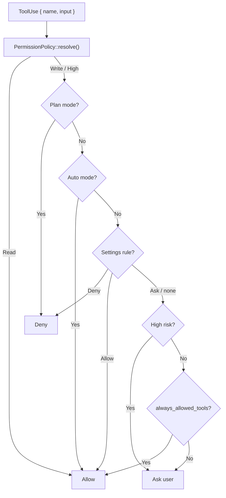
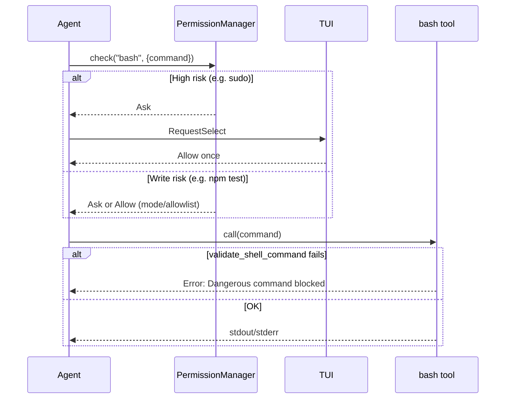
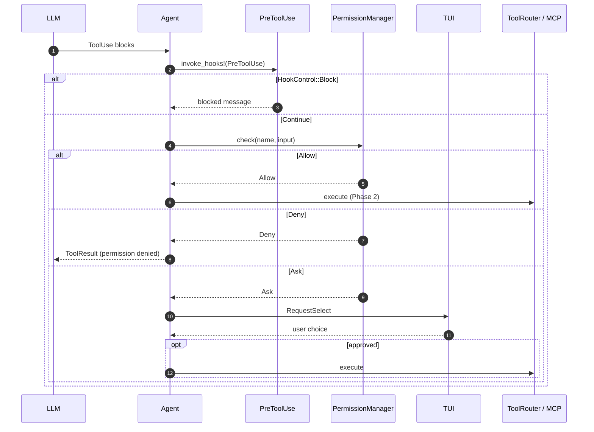

# 权限模型（Permission Model）

> 语言：[中文](./10_chapter_permission_zh.md) · [English](./10_chapter_permission.md)

本章说明 Tact 如何决定每个工具调用是否可执行：按风险做意图分类、三种权限模式、会话内 allowlist，以及通过 TUI 的交互式审批。每个 native 与 MCP 工具都会在 `Agent::execute_tool_call` 的 Phase 1 经过同一道关卡——在 `PreToolUse` hook 之后、并行执行之前。Hook 顺序见 [Agent 生命周期 Hook](./09_chapter_hook_zh.md)。

---

## 1. 权限模型做什么

`PermissionManager`（`crates/tact/src/permission/mod.rs`）对每个工具调用回答一个问题：

> 给定此工具名与输入，我们应 **允许**、**拒绝**，还是 **询问用户**？

它 **不** 执行工具。它分类意图、应用当前模式与 allowlist，并返回 `PermissionDecision`。`crates/tact/src/agent/tool_dispatch.rs` 中的 agent 将其转为调度工具，或合成一条被拦截的 `ToolResult`。

| 层级 | 职责 |
|------|------|
| `PermissionPolicy::resolve()` | 将 native 工具输入分类为 `CapabilityRisk` |
| `PermissionManager::check()` | 将 risk + mode + settings + allowlist 映射为 `PermissionBehavior` |
| `tool_dispatch.rs` | 通过 TUI `RequestSelect` 或 headless `ask_user(risk)` 处理 `Ask` |
| `bash` 工具 + `shell.rs` | 在执行时硬拦截一部分危险 shell 命令 |

Shell 命令有 **两层** 防护：高风险模式触发权限提示；更小的一组在 `bash` 工具内即被拒绝，即使用户已批准。

---

## 2. 意图分类

### 核心类型

```rust
pub enum CapabilitySource { Native, Mcp }

pub enum CapabilityRisk { Read, Write, High }

pub struct CapabilityIntent {
    pub source: CapabilitySource,
    pub server: Option<String>,  // MCP server 段（若有）
    pub tool: String,              // 解析后的短工具名
    pub risk: CapabilityRisk,
}
```

`normalize_capability(tool_name, tool_input)` 是唯一入口。它解析工具名，再调用 `classify_risk()`。

### Native 与 MCP 工具名

| 模式 | 示例 | 解析结果 |
|------|------|----------|
| Native | `read_file` | `source = Native`，`tool = "read_file"` |
| MCP | `mcp__demo__db__query` | `source = Mcp`，`server = Some("demo__db")`，`tool = "query"` |

MCP 名使用前缀 `mcp__`，随后 `server__tool`，以 **最右侧** 的 `__` 分割（因此 server ID 可含下划线）。

### 风险规则

分类是启发式的——基于工具名前缀，对 `bash` 则基于命令字符串：

| 风险 | 规则 |
|------|------|
| **Read** | 使用 `PermissionPolicy::Read` 的工具（如 `read_file`）；可证明只读的 shell 命令（见 [§7](#7-shell-高风险检测)） |
| **Write** | 使用 `PermissionPolicy::Write` 的工具；无法证明只读的 shell 工具命令（`bash` / `background_run` / `worktree_run`） |
| **High** | 使用 `PermissionPolicy::High` 的工具（如 `spawn_subagent`）；以 `sudo ` 或 `su ` 开头的 shell 命令 |

`shell.rs` 另有执行期硬拦截列表，即使权限已批准也会拒绝部分危险命令（见 [§7](#7-shell-高风险检测)）。

MCP 工具使用各自的 metadata / 默认值；dispatch 关卡将未知工具视为 **High**。

---

## 3. PermissionBehavior：Allow、Deny、Ask

```rust
pub enum PermissionBehavior {
    Allow,
    Deny,
    Ask,
}

pub struct PermissionDecision {
    pub behavior: PermissionBehavior,
    pub reason: String,
}
```

| Behavior | 在 `tool_dispatch.rs` 中的含义 |
|----------|----------------------------------|
| **Allow** | 工具进入 Phase 2（并行执行） |
| **Deny** | `PreparedState::Resolved`，附带 `"Permission denied: …"`；模型收到失败的 tool result |
| **Ask** | 交互式提示（TUI），或 headless `ask_user` 默认（允许 Write/Read，拒绝 High）；见 [§6 TUI RequestSelect 流程](#6-tui-requestselect-流程) |

---

## 4. 权限模式

```rust
pub enum PermissionMode {
    Default,
    Plan,
    Auto,
}
```

显示标签（来自 `PermissionMode` 的 `Display` 实现）：

| 模式 | 标签 | 行为 |
|------|------|------|
| `Default` | `default - ask for writes` | Read 允许；Write 询问（除非 settings/allowlist 命中）；High 询问，除非命中 settings **allow** 规则 |
| `Plan` | `plan - read only` | Read 允许（含可证明只读的 shell 命令——`ls`、`grep`、`git status` 等）；Write 与 High **拒绝**且不提示 |
| `Auto` | `auto - allow non-high operations` | 所有风险自动批准（含 High） |

### `PermissionManager::check()` 中的决策顺序

检查按此固定顺序执行：

```text
1. Read risk?                         → Allow（所有模式）
2. Plan mode + non-Read?              → Deny
3. Auto mode?                         → Allow（所有风险）
4. Settings deny rule?                → Deny
5. Settings allow rule?               → Allow（含 High）
6. Settings ask rule（非 High）?      → Ask
7. High risk（无 Deny/Allow 规则）?   → Ask（跳过会话内 allowlist）
8. 会话内 always_allowed 命中?        → Allow
9. Default                            → Ask
```


```mermaid
flowchart TD
    TC["ToolUse { name, input }"] --> Risk["PermissionPolicy::resolve()"]
    Risk -- Read --> Allow["Allow"]
    Risk -- Write / High --> Plan{"Plan mode?"}

    Plan -- Yes --> Deny["Deny"]
    Plan -- No --> Auto{"Auto mode?"}

    Auto -- Yes --> Allow
    Auto -- No --> Settings{"Settings rule?"}

    Settings -- Deny --> Deny
    Settings -- Allow --> Allow
    Settings -- Ask / none --> High{"High risk?"}

    High -- Yes --> Ask["Ask user"]
    High -- No --> AllowList{"always_allowed_tools?"}

    AllowList -- Yes --> Allow
    AllowList -- No --> Ask
```

**High 与 allowlist：** 会话内裸名 allowlist（`allow_tool`）**不能**绕过 High——仍会 `Ask`。匹配的项目 settings **allow** 规则（含「Always allow this tool」经 `allow_tool_with_input` 持久化的规则）**可以**按输入模式放行 High。

---

## 5. Allowlist 与连续拒绝

### 会话内 allowlist

`PermissionManager` 持有 `always_allowed_tools: Vec<String>`。构造时（`try_new`）预置 `"read_file"`。

用户在 TUI 选择 **「Always allow this tool」** 时，`allow_tool(tool_name)` 追加精确工具名（如 `edit_file`、`bash`）。此后对该名的 **Write** 风险调用会跳过 Default 模式提示。

allowlist **仅内存**——不会持久化到 SQLite 或 TOML 跨会话。

### 连续拒绝

每次用户 **Deny** 使 `consecutive_denials` 加一。Allow once 与 always-allow 将其重置为零。

达到 `max_consecutive_denials`（默认 **3**）次拒绝后，`should_suggest_plan_mode()` 返回 true。非交互模式下 `ask_user()` 向 stderr 打印提示：

```text
[3 consecutive denials -- consider switching to plan mode]
```

目前没有自动切换模式——该消息仅为建议。

---

## 6. TUI RequestSelect 流程

当 `check()` 返回 `Ask` 且 agent 有 UI 通道（`runtime.ui_tx`）时，`tool_dispatch.rs` 发送：

```rust
AgentUpdate::RequestSelect {
    prompt,      // 例如 "Allow bash: {\"command\":\"npm test\"}"
    options,     // ["Allow once", "Deny", "Always allow this tool"]
    respond,     // 回 agent 的 oneshot channel
}
```

TUI（`crates/tui/src/widgets/state/app/agent.rs`）切换到 `InputMode::Select` 并渲染选择弹窗（`log_confirm = false`，避免选择项污染日志）。

| 用户选择 | 索引 | Agent 动作 |
|----------|------|------------|
| Allow once | 0 | 运行工具；在 `StepFinished` 上设置 `permission_label = "Allow once"` |
| Deny | 1（默认） | `PreparedState::Resolved`；`StepFailed` 附带 deny 消息 |
| Always allow this tool | 2 | `allow_tool(name)`；运行工具；`permission_label = "Always allow this tool"` |

`permission_label` 附加到 `StepResult`，并在 TUI 工具 meta 行显示。见 [Tool Rendering](../docs/tool_rendering.md)。

### Headless / 无 UI 通道

若缺少 `ui_tx`，agent 调用 `permission_manager.ask_user(tool, risk)`：

| 风险 | 非交互默认 | stderr |
|------|------------|--------|
| **High** | Deny | `[permission] non-interactive: denying high-risk <tool>` |
| **Write** / **Read** | Allow once | `[permission] non-interactive: allowing <tool>` |

无人值守且需批准 High 时使用 `--auto`（Auto 模式）。settings 的 allow/deny 规则在到达 `ask_user` 之前仍会生效。

---

## 7. Shell 高风险检测

共享逻辑在 `crates/tact/src/shell.rs`：

```rust
pub fn is_high_risk_shell_command(command: &str) -> bool;
pub fn validate_shell_command(command: &str) -> Result<()>;
```

`is_high_risk_shell_command` 将命令小写并检查被拦截子串：

| 模式 | 效果 |
|------|------|
| `sudo`、`shutdown`、`reboot` | High risk |
| `> /dev/`、`>> /dev/` | High risk |
| `rm -rf /`、`rm -fr /`、`rm -rf /*`、… | High risk |
| `rm -rf ~`、`rm -fr $home`、… | High risk |

### 只读 shell 命令分类

自 2026-08-13 起，`PermissionPolicy::ShellCommand` 仅在命令**可证明只读**时将其归为 **Read**。逻辑位于 `crates/tact/src/tool/readonly_shell.rs`，分两阶段：

1. **纯命令切分** — 命令字符串必须是由空白分隔的词（裸词或单/双引号段）组成，且不含任何 shell 元字符：`; & | > < $ backtick \`、glob、花括号、圆括号、`!`。重定向、管道、命令替换与转义一律拒绝，因此分类结果不会与 `sh -c` 实际执行的内容产生分歧。裸 `\n` / `\r` 对 `sh -c` 是**命令分隔符**而非空白——含换行的多命令字符串（如 `ls\nrm file`，含 CRLF）整体拒绝；引号内的字面换行是词字符，继续放行。允许词首 `~` 与词内单引号段（两者都是字面量）。
2. **白名单匹配** — 首词必须是"仅凭选项无法写入"的程序：
   - 始终安全：`cat cd cut echo expr false grep head id ls nl paste pwd rev seq stat tail tr true uname uniq wc which whoami`
   - `base64` — 排除 `-o` / `--output`；`find` — 排除 `-exec -execdir -ok -okdir -delete -fls -fprint -fprint0 -fprintf`；`rg` — 排除 `--pre --hostname-bin --search-zip -z`
   - `git` — 仅 `status / log / diff / show / branch`，拒绝不安全全局选项（`-C -c --git-dir --paginate` 等）与输出/执行选项（`--output --ext-diff --textconv --exec`）；`git branch` 另拒绝一切可能创建、重命名或删除分支的参数
   - `sed` — 仅 `sed -n {N|M,N}p` 打印行区间形式

白名单与选项规则镜像 OpenAI Codex 的 `is_known_safe_command`（`codex-rs/shell-command/src/command_safety/is_safe_command.rs`）。分类器刻意保守：漏判只多一次审批提示，误判则会在 plan mode 下静默执行变更——因此任何含糊输入一律归为 **Write**。最终效果：plan mode 下 `ls`、`grep -rn x .`、`git status` 无需提示即可运行；`cargo test`、管道、重定向与未知程序仍被拒绝。

### 两层


```mermaid
sequenceDiagram
    participant Agent
    participant Perm as PermissionManager
    participant TUI
    participant Bash as bash tool

    Agent->>Perm: check("bash", {command})
    alt High risk (e.g. sudo)
        Perm-->>Agent: Ask
        Agent->>TUI: RequestSelect
        TUI-->>Agent: Allow once
    else Write risk (e.g. npm test)
        Perm-->>Agent: Ask or Allow (mode/allowlist)
    end

    Agent->>Bash: call(command)
    alt validate_shell_command fails
        Bash-->>Agent: Error: Dangerous command blocked
    else OK
        Bash-->>Agent: stdout/stderr
    end
```

1. **权限层** — `classify_risk` 用 `is_high_risk_shell_command` 标记 High risk → 始终 `Ask`（只读 bash 除外）。
2. **执行层** — `bash` 与 `background_run` 在 spawn 前调用 `validate_shell_command`。被拦截的命令即使用户已批准也会失败。

无害的破坏性路径可在执行层通过但仍可能提示：例如 `rm -rf ./build` 通过 `validate_shell_command` 但分类为 **Write**，Default 模式会先询问。

只读 bash 检测拒绝含 shell 元字符的命令——`ls; rm -rf /` 是 **Write**，不是 Read。裸换行同样是命令分隔符，因此 `ls\nrm file` 也是 **Write**，不是 Read。

---

## 8. 工具流水线中的集成

权限在 `execute_tool_call`（`crates/tact/src/agent/tool_dispatch.rs`）的 **Phase 1** 运行，严格在 hook 之后：

```text
For each ToolUse (sequential):
  stats · cancel check
  StepAdded / StepStarted
  PreToolUse hooks          ← 可变更 input 或 Block
  PermissionManager::check  ← 本章
  Ask → RequestSelect (if needed)
  PreparedState::Run | Resolved

Phase 2: parallel waves (no permission re-check)
Phase 3: build ToolResult blocks in model order
```


```mermaid
sequenceDiagram
    autonumber
    participant LLM
    participant Agent
    participant Hook as PreToolUse
    participant Perm as PermissionManager
    participant TUI
    participant Tool as ToolRouter / MCP

    LLM->>Agent: ToolUse blocks
    Agent->>Hook: invoke_hooks!(PreToolUse)
    alt HookControl::Block
        Hook-->>Agent: blocked message
    else Continue
        Agent->>Perm: check(name, input)
        alt Allow
            Perm-->>Agent: Allow
            Agent->>Tool: execute (Phase 2)
        else Deny
            Perm-->>Agent: Deny
            Agent-->>LLM: ToolResult (permission denied)
        else Ask
            Perm-->>Agent: Ask
            Agent->>TUI: RequestSelect
            TUI-->>Agent: user choice
            opt approved
                Agent->>Tool: execute
            end
        end
    end
```

`PermissionManager` 在 `AgentRuntime`（`crates/tact/src/agent/mod.rs`）上，不在 `ToolContext`。`spawn_subagent` 工具创建的子 agent 有独立 manager（始终 `PermissionMode::Default`），但继承主 agent 的 `ui_tx`，权限弹窗仍可用。

---

## 9. 配置

### TOML

```toml
[permission]
mode = "default"   # "default" | "plan" | "auto"
```

定义于 `PermissionTomlConfig`（`crates/tact/src/config/types.rs`）。省略时默认 `"default"`。

### CLI

`--permission-mode` / `-m` 通过 `config/resolve.rs` → `ResolvedConfig.permission_mode` 覆盖 TOML。

### 当前启动行为

| 入口 | 使用的模式 |
|------|------------|
| `tact-ui headless` | `permission_mode_from_config()` — 读 TOML / CLI；未知值回退 **Auto** |
| `tact-ui`（交互 TUI） | 与 headless 相同 — `permission_mode_from_config()` |

---

## 10. 代码地图

| 文件 | 角色 |
|------|------|
| `crates/tact/src/permission/mod.rs` | `CapabilityRisk`、`PermissionManager`、`normalize_capability`、分类启发式 |
| `crates/tact/src/shell.rs` | 共享高风险 shell 模式；执行时 `validate_shell_command` 拦截 |
| `crates/tact/src/agent/tool_dispatch.rs` | 预检权限；`RequestSelect` 处理；`StepFinished` 上的 `permission_label` |
| `crates/tact/src/agent/mod.rs` | `AgentRuntime.permission_manager` |
| `crates/tact/src/tool/bash.rs` | spawn shell 前调用 `validate_shell_command` |
| `crates/tact/src/background.rs` | 后台 shell 命令同样校验 |
| `crates/tact/src/tool/subagent.rs` | 子 agent 用 `Default` 模式；继承 `ui_tx` |
| `crates/tact-ui/src/permission.rs` | `permission_mode_from_config()` |
| `crates/tact-ui/src/headless.rs`、`interactive.rs` | 会话启动时构造 `PermissionManager` |
| `crates/tact/src/config/types.rs` | `[permission] mode` TOML schema |
| `crates/tui/src/widgets/state/app/agent.rs` | 处理 `AgentUpdate::RequestSelect` |
| `crates/protocol/src/lib.rs` | `AgentUpdate::RequestSelect`、`StepResult.permission_label` |

---

## 11. 当前缺口

| 缺口 | 详情 |
|------|------|
| Allowlist 未持久化 | 「Always allow this tool」仅当前进程有效 |
| 无运行时模式切换 API | 用户须以不同模式重启；连续拒绝后 stderr 仅建议 Plan |
| Headless 下 High 仍需 Auto 或 settings allow | 非交互 `ask_user` 会放行 Write/Read 的 Ask，但对 High 仍 deny，除非 settings allow 已先返回 Allow |
| `PlanStep.need_approval` 已弃用 | 字段标记 `#[deprecated(since = "0.19.0")]`；用 `PlanStep::new()` — 权限由 `PermissionManager` 驱动 |
| 权限与 hook 重叠 | 两者均可拦截工具；hook 先运行，`Block` 时跳过权限 |

---

## Related Docs

- [任务与工具调度](./11_chapter_task_zh.md) — 权限所在的三阶段流水线
- [子 Agent](./12_chapter_subagent_zh.md) — `spawn_subagent` 为 High 风险、独立 `PermissionManager`、继承 `ui_tx`
- [Agent 生命周期 Hook](./09_chapter_hook_zh.md) — PreToolUse 紧接在权限检查之前
- [ARCHITECTURE.md](../ARCHITECTURE.md#3-permission-system) — 架构图与模式表
- [docs/state_machines.md](../docs/state_machines.md) — 权限决策状态机
- [docs/tool_rendering.md](../docs/tool_rendering.md) — `permission_label` 在 TUI 中的展示
- [docs/parallel_tool_execution.md](../docs/parallel_tool_execution.md) — 预检为何保持串行
