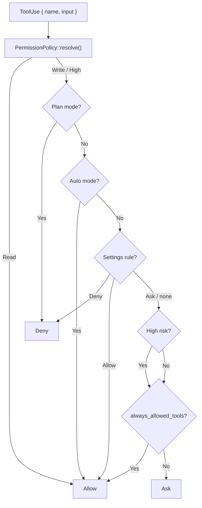
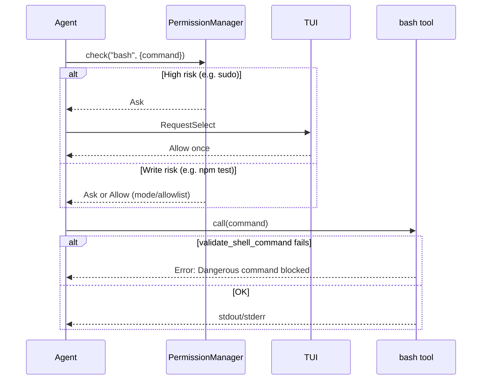
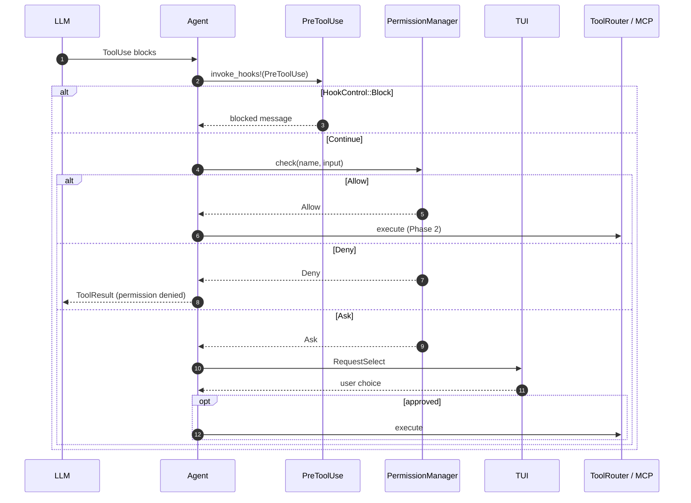
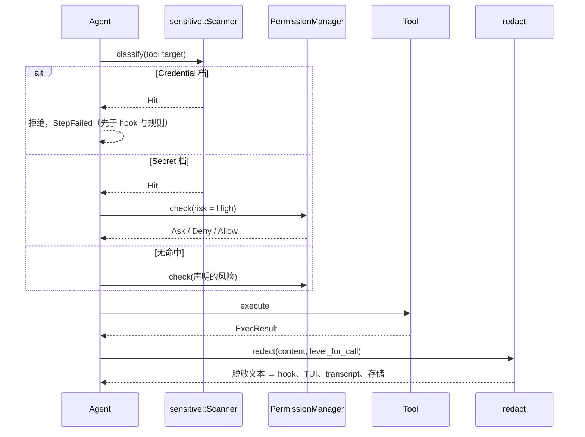

# 权限模型（Permission Model）

本章说明 Tact 如何决定每个工具调用是否可执行：按风险做意图分类、三种权限模式、会话内 allowlist，以及通过 TUI 的交互式审批。每个 native 与 MCP 工具都会在 `Agent::execute_tool_call` 的 Phase 1 经过同一道关卡——在 `PreToolUse` hook 之后、并行执行之前。Hook 顺序见 [Agent 生命周期 Hook](./09_chapter_hook_zh.md)。

---

## 1. 权限模型做什么

`PermissionManager`（`crates/tact/src/permission/mod.rs`）对每个工具调用回答一个问题：

> 给定此工具名与输入，我们应 **允许**、**拒绝**，还是 **询问用户**？

它 **不** 执行工具。它分类意图、应用当前模式与 allowlist，并返回 `PermissionDecision`。`crates/tact/src/agent/tool_dispatch.rs` 中的 agent 将其转为调度工具，或合成一条被拦截的 `ToolResult`。

| 层级 | 职责 |
|------|------|
| `PermissionPolicy::resolve()` | 将 native 工具输入分类为 `CapabilityRisk` |
| `PermissionManager::check()` | 将 risk + mode + settings + allowlist 映射为 `PermissionBehavior` |
| `tool_dispatch.rs` | 通过 TUI `RequestSelect` 或 headless `ask_user(risk)` 处理 `Ask` |
| `bash` 工具 + `shell.rs` | 在执行时硬拦截一部分危险 shell 命令 |

Shell 命令有 **两层** 防护：高风险模式触发权限提示；更小的一组在 `bash` 工具内即被拒绝，即使用户已批准。

### 权限与沙箱

权限回答的是 *这条命令能不能运行*，它不说明命令运行后能触达什么。两者是有意分开的两层：

```text
Permission = 授权       （agent 可以运行它吗？）
Sandbox    = 执行边界   （运行中的命令能访问什么？）
```

可选的 `bash` 沙箱（[工具系统 §7.1](./07_chapter_tool_zh.md)，完整章节见 [Bash 沙箱](./27_chapter_sandbox_zh.md)）属于第二层，本章内容
不因此改变：开启 `[tools] sandbox = true` 不会新增任何提示，也不会去掉任何检查。
一条命令可以 `Permission = allow`，同时读不到宿主 home——沙箱约束的是文件系统，
不是网络（网络与宿主共享）。

---

## 2. 意图分类

### 核心类型

```rust
pub enum CapabilitySource { Native, Mcp }

pub enum CapabilityRisk { Read, Write, High }

pub struct CapabilityIntent {
    pub source: CapabilitySource,
    pub server: Option<String>,  // MCP server 段（若有）
    pub tool: String,              // 解析后的短工具名
    pub risk: CapabilityRisk,
}
```

`normalize_capability(tool_name, tool_input)` 是唯一入口。它解析工具名，再调用 `classify_risk()`。

### Native 与 MCP 工具名

| 模式 | 示例 | 解析结果 |
|------|------|----------|
| Native | `read_file` | `source = Native`，`tool = "read_file"` |
| MCP | `mcp__demo__db__query` | `source = Mcp`，`server = Some("demo__db")`，`tool = "query"` |

MCP 名使用前缀 `mcp__`，随后 `server__tool`，以 **最右侧** 的 `__` 分割（因此 server ID 可含下划线）。

### 风险规则

分类是启发式的——基于工具名前缀，对 `bash` 则基于命令字符串：

| 风险 | 规则 |
|------|------|
| **Read** | 使用 `PermissionPolicy::Read` 的工具（如 `read_file`）；可证明只读的 shell 命令（见 [§7](#7-shell-高风险检测)） |
| **Write** | 使用 `PermissionPolicy::Write` 的工具；无法证明只读的 shell 工具命令（`bash` / `background_run` / `worktree_run`） |
| **High** | 使用 `PermissionPolicy::High` 的工具（如 `spawn_subagent`）；以 `sudo ` 或 `su ` 开头的 shell 命令 |

`shell.rs` 另有执行期硬拦截列表，即使权限已批准也会拒绝部分危险命令（见 [§7](#7-shell-高风险检测)）。

MCP 工具使用各自的 metadata / 默认值；dispatch 关卡将未知工具视为 **High**。

---

## 3. PermissionBehavior：Allow、Deny、Ask

```rust
pub enum PermissionBehavior {
    Allow,
    Deny,
    Ask,
}

pub struct PermissionDecision {
    pub behavior: PermissionBehavior,
    pub reason: String,
}
```

| Behavior | 在 `tool_dispatch.rs` 中的含义 |
|----------|----------------------------------|
| **Allow** | 工具进入 Phase 2（并行执行） |
| **Deny** | `PreparedState::Resolved`，附带 `"Permission denied: …"`；模型收到失败的 tool result |
| **Ask** | 交互式提示（TUI），或 headless `ask_user` 默认（允许 Write/Read，拒绝 High）；见 [§6 TUI RequestSelect 流程](#6-tui-requestselect-流程) |

---

## 4. 权限模式

```rust
pub enum PermissionMode {
    Default,
    Plan,
    Auto,
}
```

显示标签（来自 `PermissionMode` 的 `Display` 实现）：

| 模式 | 标签 | 行为 |
|------|------|------|
| `Default` | `default - ask for writes` | Read 允许；Write 询问（除非 settings/allowlist 命中）；High 询问，除非命中 settings **allow** 规则**或会话内 allowlist 已覆盖该确切工具与输入** |
| `Plan` | `plan - read only` | Read 允许（含可证明只读的 shell 命令——`ls`、`grep`、`git status` 等）；Write 与 High **拒绝**且不提示 |
| `Auto` | `auto - allow non-high operations` | 所有风险自动批准（含 High） |

### `PermissionManager::check()` 中的决策顺序

在这之前，`tool_dispatch` 会先跑**敏感目标守卫**（§12）。`Credential` 档命中会在那里被直接拒绝，永远走不到这个阶梯；`Secret` 档会升级为 `High`，从第 2 步进入。

检查按此固定顺序执行：

```text
1. Read risk?                         → Allow（所有模式）
2. Plan mode + non-Read?              → Deny
3. Auto mode?                         → Allow（所有风险）
4. Settings deny rule?                     → Deny
5. Settings allow rule?                    → Allow（含 High）
6. Settings ask rule（非 High）?           → Ask
7. Server-policy auto-approve?             → Allow
8. High risk + 会话内 always_allowed 命中? → Allow
9. High risk（没有任何允许）?              → Ask
10. 会话内 always_allowed 命中?            → Allow
11. Default                                → Ask
```


```mermaid
flowchart TD
    TC["ToolUse { name, input }"] --> Risk["PermissionPolicy::resolve()"]
    Risk -- Read --> Allow["Allow"]
    Risk -- Write / High --> Plan{"Plan mode?"}

    Plan -- Yes --> Deny["Deny"]
    Plan -- No --> Auto{"Auto mode?"}

    Auto -- Yes --> Allow
    Auto -- No --> Settings{"Settings rule?"}

    Settings -- Deny --> Deny
    Settings -- Allow --> Allow
    Settings -- Ask / none --> High{"High risk?"}

    High -- Yes --> AllowList{"always_allowed_tools?"}
    High -- No --> AllowList

    AllowList -- Yes --> Allow
    AllowList -- No --> Ask
```

**High 与 allowlist：** High 首次无论如何都会询问。一旦有允许覆盖**该确切工具与输入**——裸名 `allow_tool`，或「Always allow this tool」写入的输入感知规则——High 就与其他风险一样被放行。计划模式与显式 `deny`/`ask` 规则仍然先判定，所以授权放宽的是询问，绝不是模式或规则。匹配的项目 settings **allow** 规则在第 5 步就能到达 High，甚至早于查询 allowlist。

全新的非交互会话仍然拒绝 High：`always_allowed_tools` 从不预置、也从不从 settings 填充，所以列表里只有用户在提示上授予过的内容，而非交互下没有提示。

---

## 5. Allowlist 与连续拒绝

### 会话内 allowlist

`PermissionManager` 持有 `always_allowed_tools: Vec<String>`。构造时是**空的**。

它以前预置 `"read_file"`。在 `read_file` 始终被判为 `Read` 时这条没有作用；但一旦敏感目标能把它升级为 `High`，它就等于放行 `read_file` 的**任意**输入，`.env` 也不例外——因为列表里的裸名匹配所有输入。没有任何人授予过的 allowlist 条目不该压过守卫，所以预置已删除。

用户在 TUI 选择 **「Always allow this tool」** 时，`tool_dispatch` 调用的是 `allow_tool_with_input(name, policy, input)`——针对那次确切调用的**输入感知**规则，而不是裸工具名。有 settings 存储时它被持久化进项目的 `.tact/settings.json`；没有则落进内存列表。两种情况都会让此后匹配该工具**且**输入的调用跳过询问，且**任何**风险都适用，包括 **High**。

（裸名形式 `allow_tool(name)` 仍然存在，仍然授权任意输入，现在它也覆盖 High。全新会话的列表是空的，所以没有真实点击就不会有任何授权。）

**「Always allow」可以拒绝记住。** 当无法表达比整工具更窄的规则时——字段缺失、不是字符串、或值里含规则文法定界符（`(`、`)`、`:`，模式被嵌在 `tool(field:pattern)` 里）——`PermissionRule::generate` 返回 `None`。旧行为是退回**裸规则**，而任何含冒号的 `bash` 命令（`git commit -m "fix: thing"`）都会走到那条路，于是点一次就授权了此后所有 shell 命令、且跨会话。现在这次点击只批准当前调用，并由 `AllowOutcome::NotNarrowable` 让 `tool_dispatch` 明说——静默无效的按钮和 bug 无法区分。

allowlist **仅内存**——不会持久化到 SQLite 或 TOML 跨会话。只有 settings 规则那种形式能跨重启存活。

### 连续拒绝

每次用户 **Deny** 使 `consecutive_denials` 加一。Allow once 与 always-allow 将其重置为零。

达到 `max_consecutive_denials`（默认 **3**）次拒绝后，`should_suggest_plan_mode()` 返回 true。非交互模式下 `ask_user()` 向 stderr 打印提示：

```text
[3 consecutive denials -- consider switching to plan mode]
```

目前没有自动切换模式——该消息仅为建议。

---

## 6. TUI RequestSelect 流程

当 `check()` 返回 `Ask` 且 agent 有 UI 通道（`runtime.ui_tx`）时，`tool_dispatch.rs` 发送：

```rust
AgentUpdate::RequestSelect {
    prompt,      // 例如 "Allow bash: {\"command\":\"npm test\"}"
    options,     // ["Allow once", "Deny", "Always allow this tool"]
    respond,     // 回 agent 的 oneshot channel
}
```

TUI（`crates/tui/src/widgets/state/app/agent.rs`）切换到 `InputMode::Select` 并渲染选择弹窗（`log_confirm = false`，避免选择项污染日志）。

| 用户选择 | 索引 | Agent 动作 |
|----------|------|------------|
| Allow once | 0 | 运行工具；在 `StepFinished` 上设置 `permission_label = "Allow once"` |
| Deny | 1（默认） | `PreparedState::Resolved`；`StepFailed` 附带 deny 消息 |
| Always allow this tool | 2 | `allow_tool_with_input(name, policy, input)`；运行工具；`permission_label = "Always allow this tool"` |

`permission_label` 附加到 `StepResult`，并在 TUI 工具 meta 行显示。见 [Tool Rendering](../docs/tool_rendering.md)。

### Headless / 无 UI 通道

若缺少 `ui_tx`，agent 调用 `permission_manager.ask_user(tool, risk)`：

| 风险 | 非交互默认 | stderr |
|------|------------|--------|
| **High** | Deny | `[permission] non-interactive: denying high-risk <tool>` |
| **Write** / **Read** | Allow once | `[permission] non-interactive: allowing <tool>` |

无人值守且需批准 High 时使用 `--auto`（Auto 模式）。settings 的 allow/deny 规则在到达 `ask_user` 之前仍会生效。

---

## 7. Shell 高风险检测

共享逻辑在 `crates/tact/src/shell.rs`：

```rust
pub fn is_high_risk_shell_command(command: &str) -> bool;
pub fn validate_shell_command(command: &str) -> Result<()>;
```

`is_high_risk_shell_command` 将命令小写并检查被拦截子串：

| 模式 | 效果 |
|------|------|
| `sudo`、`shutdown`、`reboot` | High risk |
| `> /dev/`、`>> /dev/` | High risk |
| `rm -rf /`、`rm -fr /`、`rm -rf /*`、… | High risk |
| `rm -rf ~`、`rm -fr $home`、… | High risk |

### 只读 shell 命令分类

自 2026-08-13 起，`PermissionPolicy::ShellCommand` 仅在命令**可证明只读**时将其归为 **Read**。逻辑位于 `crates/tact/src/tool/readonly_shell.rs`，分两阶段：

1. **纯命令切分** — 命令字符串必须是由空白分隔的词（裸词或单/双引号段）组成，且不含任何 shell 元字符：`; & | > < $ backtick \`、glob、花括号、圆括号、`!`。重定向、管道、命令替换与转义一律拒绝，因此分类结果不会与 `sh -c` 实际执行的内容产生分歧。裸 `\n` / `\r` 对 `sh -c` 是**命令分隔符**而非空白——含换行的多命令字符串（如 `ls\nrm file`，含 CRLF）整体拒绝；引号内的字面换行是词字符，继续放行。允许词首 `~` 与词内单引号段（两者都是字面量）。
2. **白名单匹配** — 首词必须是"仅凭选项无法写入"的程序：
   - 始终安全：`cat cd cut echo expr false grep head id ls nl paste pwd rev seq stat tail tr true uname uniq wc which whoami`
   - `base64` — 排除 `-o` / `--output`；`find` — 排除 `-exec -execdir -ok -okdir -delete -fls -fprint -fprint0 -fprintf`；`rg` — 排除 `--pre --hostname-bin --search-zip -z`
   - `git` — 仅 `status / log / diff / show / branch`，拒绝不安全全局选项（`-C -c --git-dir --paginate` 等）与输出/执行选项（`--output --ext-diff --textconv --exec`）；`git branch` 另拒绝一切可能创建、重命名或删除分支的参数
   - `sed` — 仅 `sed -n {N|M,N}p` 打印行区间形式

白名单与选项规则镜像 OpenAI Codex 的 `is_known_safe_command`（`codex-rs/shell-command/src/command_safety/is_safe_command.rs`）。分类器刻意保守：漏判只多一次审批提示，误判则会在 plan mode 下静默执行变更——因此任何含糊输入一律归为 **Write**。最终效果：plan mode 下 `ls`、`grep -rn x .`、`git status` 无需提示即可运行；`cargo test`、管道、重定向与未知程序仍被拒绝。

**白名单证明的是程序不能写入，不是它的输出可以公开。** 以前允许词首 `~`，理由是「波浪号展开只是替换家目录，而白名单里的程序对展开结果依然只读」——这话没错，但答非所问：`cat` 确实只读，而 `cat ~/.ssh/id_ed25519` 打印的是私钥。该命令被归为 **Read**，而 `check_with_auto` 对 `Read` 的放行发生在 plan mode 与一切 settings 规则之前，于是在所有模式下静默执行，headless 也一样。§12 堵住它：敏感扫描在 `is_read_only_shell_command` **之前**运行，因此任何提到凭据路径的命令都是 `High`（或被拒绝），无论其程序多么可证明只读。

### 两层


```mermaid
sequenceDiagram
    participant Agent
    participant Perm as PermissionManager
    participant TUI
    participant Bash as bash tool

    Agent->>Perm: check("bash", {command})
    alt High risk (e.g. sudo)
        Perm-->>Agent: Ask
        Agent->>TUI: RequestSelect
        TUI-->>Agent: Allow once
    else Write risk (e.g. npm test)
        Perm-->>Agent: Ask or Allow (mode/allowlist)
    end

    Agent->>Bash: call(command)
    alt validate_shell_command fails
        Bash-->>Agent: Error: Dangerous command blocked
    else OK
        Bash-->>Agent: stdout/stderr
    end
```

1. **权限层** — `classify_risk` 用 `is_high_risk_shell_command` 标记 High risk → 始终 `Ask`（只读 bash 除外）。
2. **执行层** — `bash` 与 `background_run` 在 spawn 前调用 `validate_shell_command`。被拦截的命令即使用户已批准也会失败。

无害的破坏性路径可在执行层通过但仍可能提示：例如 `rm -rf ./build` 通过 `validate_shell_command` 但分类为 **Write**，Default 模式会先询问。

只读 bash 检测拒绝含 shell 元字符的命令——`ls; rm -rf /` 是 **Write**，不是 Read。裸换行同样是命令分隔符，因此 `ls\nrm file` 也是 **Write**，不是 Read。

---

## 8. 工具流水线中的集成

权限在 `execute_tool_call`（`crates/tact/src/agent/tool_dispatch.rs`）的 **Phase 1** 运行，严格在 hook 之后：

```text
For each ToolUse (sequential):
  stats · cancel check
  StepAdded / StepStarted
  PreToolUse hooks          ← 可变更 input 或 Block
  PermissionManager::check  ← 本章
  Ask → RequestSelect (if needed)
  PreparedState::Run | Resolved

Phase 2: parallel waves (no permission re-check)
Phase 3: build ToolResult blocks in model order
```


```mermaid
sequenceDiagram
    autonumber
    participant LLM
    participant Agent
    participant Hook as PreToolUse
    participant Perm as PermissionManager
    participant TUI
    participant Tool as ToolRouter / MCP

    LLM->>Agent: ToolUse blocks
    Agent->>Hook: invoke_hooks!(PreToolUse)
    alt HookControl::Block
        Hook-->>Agent: blocked message
    else Continue
        Agent->>Perm: check(name, input)
        alt Allow
            Perm-->>Agent: Allow
            Agent->>Tool: execute (Phase 2)
        else Deny
            Perm-->>Agent: Deny
            Agent-->>LLM: ToolResult (permission denied)
        else Ask
            Perm-->>Agent: Ask
            Agent->>TUI: RequestSelect
            TUI-->>Agent: user choice
            opt approved
                Agent->>Tool: execute
            end
        end
    end
```

`PermissionManager` 在 `AgentRuntime`（`crates/tact/src/agent/mod.rs`）上，不在 `ToolContext`。`spawn_subagent` 工具创建的子 agent 有独立 manager（始终 `PermissionMode::Default`），但继承主 agent 的 `ui_tx`，权限弹窗仍可用。

---

## 9. 配置

### TOML

```toml
[permission]
mode = "default"   # "default" | "plan" | "auto"
```

定义于 `PermissionTomlConfig`（`crates/tact/src/config/types.rs`）。省略时默认 `"default"`。

### JSON（`.tact/settings.json` 里的 `permissions`）

规则与两个安全小节共用同一份宽容文档，安全配置因此只有一个归宿：

```jsonc
{
  "permissions": {
    "allow": ["bash(command:cargo test *)"],
    "ask":   ["web_fetch"],
    "deny":  ["read_file(path:~/.ssh/**)"],
    "sensitive_paths": {
      "enabled": true,               // 默认 true；即使没有 settings 文件也生效
      "extra":  ["*.vault"],         // 追加进注册表，恒为 Secret 档
      "allow":  ["~/.ssh/config"]    // 完全豁免守卫
    },
    "redaction": {
      "enabled": true,               // false 是文档化的逃生口
      "level": "basic",              // "off" | "basic" | "credential"
      "extra_patterns": ["MYCO-[0-9a-f]{32}"],
      "basic_only_paths": ["**/fixtures/**"]
    }
  }
}
```

每个字段都可选，每个畸形值都退化为默认值。`level` 未设置**或拼错**时解析为 `basic`，绝不是 `off`：拼错不该静默关掉脱敏。含 `/` 的模式是路径 glob（`**/fixtures/**`），以 `~/` 开头的是家目录相对，其余匹配最后一段路径名。

### CLI

`--permission-mode` / `-m` 通过 `config/resolve.rs` → `ResolvedConfig.permission_mode` 覆盖 TOML。

### 当前启动行为

| 入口 | 使用的模式 |
|------|------------|
| `tact-ui headless` | `permission_mode_from_config()` — 读 TOML / CLI；未知值回退 **Auto** |
| `tact-ui`（交互 TUI） | 与 headless 相同 — `permission_mode_from_config()` |

---

## 10. 代码地图

| 文件 | 角色 |
|------|------|
| `crates/tact/src/permission/mod.rs` | `CapabilityRisk`、`PermissionManager`、`normalize_capability`、分类启发式、`AllowOutcome` |
| `crates/tact/src/security/sensitive.rs` | 敏感路径注册表、两个档位、`Scanner`、`classify_command`、`refusal_text` |
| `crates/tact/src/security/redact.rs` | `redact`、`level_for_call`、`StreamRedactor` |
| `crates/tact/src/security/mod.rs` | `SecurityConfig` 解析与 global+project 合并 |
| `crates/tact/src/shell.rs` | 共享高风险 shell 模式；执行时 `validate_shell_command` 拦截 |
| `crates/tact/src/agent/tool_dispatch.rs` | 预检权限；`RequestSelect` 处理；`StepFinished` 上的 `permission_label` |
| `crates/tact/src/agent/mod.rs` | `AgentRuntime.permission_manager` |
| `crates/tact/src/tool/metadata.rs` | `PermissionPolicy`（含 `ReadPath` / `WritePath` / `PatchPaths`）、`PermissionPromptPolicy::PatchTarget` |
| `crates/tact/src/tool/progress.rs` | `ToolProgressReporter`——实时输出脱敏及其 flush |
| `crates/tact/src/tool/bash.rs` | spawn shell 前调用 `validate_shell_command`；并 flush 脱敏器 |
| `crates/tact/src/background.rs` | 后台 shell 命令同样校验 |
| `crates/tact/src/tool/subagent.rs` | 子 agent 用 `Default` 模式；继承 `ui_tx` |
| `crates/tact-ui/src/permission.rs` | `permission_mode_from_config()` |
| `crates/tact-ui/src/headless.rs`、`interactive.rs` | 会话启动时构造 `PermissionManager` |
| `crates/tact/src/config/types.rs` | `[permission] mode` TOML schema |
| `crates/tui/src/widgets/state/app/agent.rs` | 处理 `AgentUpdate::RequestSelect` |
| `crates/protocol/src/lib.rs` | `AgentUpdate::RequestSelect`、`StepResult.permission_label` |

---

## 11. 当前缺口

| 缺口 | 详情 |
|------|------|
| Allowlist 未持久化 | 「Always allow this tool」仅当前进程有效 |
| 无运行时模式切换 API | 用户须以不同模式重启；连续拒绝后 stderr 仅建议 Plan |
| Headless 下 High 仍需 Auto 或 settings allow | 非交互 `ask_user` 会放行 Write/Read 的 Ask，但对 High 仍 deny，除非 settings allow 已先返回 Allow |
| `PlanStep.need_approval` 已弃用 | 字段标记 `#[deprecated(since = "0.19.0")]`；用 `PlanStep::new()` — 权限由 `PermissionManager` 驱动 |
| 权限与 hook 重叠 | 两者均可拦截工具；hook 先运行，`Block` 时跳过权限 |
| 守卫是基于名字的启发式 | §12 匹配路径与命令词元；`python -c "print(open(...).read())"` 不提及任何它看得见的东西。脱敏是兜底，真正的边界是 `crates/tact/src/sandbox/`——**仅 Linux 且默认关闭**（macOS 上返回 `SandboxDegradation`，`[tools] sandbox = false`） |
| MCP 的输入不被守卫扫描 | 第三方工具的路径参数不做分类（其**结果**仍按 `Basic` 脱敏）。MCP 工具默认 `High`，风险可按工具声明 |
| 脱敏是模式匹配 | 可以被关掉（`redaction.enabled = false`），且测试 fixture 里的假密钥会和真密钥一样被脱敏 |

---

## 12. 敏感路径与密钥脱敏

权限阶梯回答的是「agent 可不可以做这件事」。它对*一次已获准的读取会返回什么*无话可说，而私钥正是从这个缺口走漏的：`cat ~/.ssh/id_ed25519` 是可证明只读的命令，于是被判 `Read`，于是在 plan mode 被考虑之前就已放行。`crates/tact/src/security/` 里的两套机制堵住它。

### 12.1 守卫：两个档位，两种结果

`sensitive::RULES` 是一张有序的注册表，列出「本性即秘密」的路径。**先匹配者胜**，所以窄例外必须排在被它挖出洞的目录 glob 之前（`~/.ssh/config` 排在 `~/.ssh/**` 之上）。命中 `EXEMPT_NAMES` 的文件名（`*.pub`、`*.crt`、`*.cer`、`*.der`，以及 `*.example` / `*.sample` / `*.template` / `*.dist` 占位文件）最先排除。

| 档位 | 含义 | 决策 | 逃生口 |
|------|------|------|--------|
| `Credential` | 文件**本身就是**秘密：私钥、token 存储、`~/.netrc`、`~/.ssh/**`、`~/.aws/**`、`~/.kube/**`、`~/.gnupg/**`、`~/.config/{gh,gcloud,heroku,op}/**`、`*.pem` / `*.key` / `*.p12` / `*.keystore` / `*.kdbx`、`id_*`、`*_rsa`、`*.tfstate`、`credentials.json`、`secrets.{json,yml,toml}`、仓库内的 `.npmrc` / `.pypirc` / `.pgpass` / `.netrc`，以及携带 `env` token 的 agent 宿主配置（`~/.claude/settings.json`、`~/.codex/auth.json`、`~/.tact/settings.json`） | **拒绝**——在预检直接拒，不弹窗 | `permissions.sensitive_paths.allow`，需要改文件 |
| `Secret` | 读取**可能**泄露，但用户往往确实需要：`.env` / `.env.*` / `*.env` / `.envrc`、`~/.ssh/{config,known_hosts}`、`~/.bash_history` 等 | **询问**——升级为 `High`，走普通阶梯 | 普通规则与「always allow」 |

`Credential` 刻意**不能**用 TUI 的「Always allow」按钮绕过：一键即可解除的拒绝不算拒绝。它只能通过编辑 `.tact/settings.json` 解除。

关键在于位置。守卫在 `preflight_tool_calls` 中于 `PreToolUse` **之前**、`PermissionManager::check` 之前运行，因此 `Auto` 模式、已持久化的 `allow` 规则、会话内 always-allow、`PermissionRequest` hook 都碰不到凭据文件。`Secret` 档完全不需要特例——它变成 `High`，于是 plan mode 拒绝、Default 询问、headless 拒绝，用户规则照常组合。

| 工具 | 策略 | 扫描什么 |
|------|------|----------|
| `read_file`、`read_image` | `ReadPath { path_field }` | 路径（绝对路径或以 `~` 开头时跳过——`safe_path` 本来就会拒绝，在必然报错前弹窗只是噪音） |
| `edit_file`、`write_file` | `WritePath { path_field }` | 路径 |
| `apply_patch` | `PatchPaths` | 每个 `+++ b/<path>` / `+++ <path>` 头，复用调度器同一套提取 |
| `bash`、`background_run`、`worktree_run` | `ShellCommand { command_field }` | 命令字符串的词元，且**先于**只读分类器 |

`classify_command` 先去掉引号再切分（因此 `~/.ss"h"/id_rsa` 会还原成 shell 实际传入的词元），并按 shell 元字符切分，这也是重定向目标（`> .env`）能被抓到的原因。不含 `.` 与 `/` 的裸词只与 `BARE_SECRET_NAMES` 比对——否则像 `"foo_rsa"` 这样的 grep 模式会换来一次拒绝。它**不**解析命令替换、变量，或 `python -c`。

拒绝文案会点明路径、类别与逃生口，因为它同时被人和模型读到：

```text
Refused: ~/.ssh/id_ed25519 is credential material (private-key). Reading it is
not something this agent does. If the user asked for this, they can permit the
path in .tact/settings.json under permissions.sensitive_paths.allow.
```

### 12.2 脱敏：兜底

守卫基于名字，它自己也这么说。脱敏是在守卫被绕过时仍然成立的那部分——`python -c "print(open('/home/me/.ssh/id_ed25519').read())"` 不提及任何切词器看得见的路径。

| 级别 | 作用于 | 规则 |
|------|--------|------|
| `Basic` | **所有**工具结果 | 高置信度、低误报的形状：私钥块、`sk-…` / `sk-ant-…`、`AKIA` / `ASIA`、`ghp_…` / `github_pat_…`、`xox[baprs]-…`、`glpat-…`、`AIza…`、JWT、`Bearer …`、`https://user:pass@` |
| `Credential` | 被守卫判为敏感的那次调用的结果 | `Basic` 之外追加结构感知规则：`.netrc` 的 `password …`、dotenv/INI/TOML 的 `API_KEY=…`、JSON 的 `"token": "…"`、npmrc 的 `_authToken=`、`authorized_keys` |

之所以分级：无差别的键值规则会改写用户自己的源码与测试 fixture，模型就会对着 `[redacted:value]` 分析本应写着 `token = "abc"` 的代码。标记只带类别、绝不含值的前缀；键名保留，形状仍可读（`API_KEY=[redacted:value]`）。

| 脱敏 | 不脱敏 | 原因 |
|------|--------|------|
| 工具**结果**（原生与 MCP）——在 `run_tool_waves` 的单一收口处，于 `PostToolUse` hook 读取之前，因此 hook、TUI 步骤详情、transcript 与会话存储看到的是同一个字符串 | 工具**调用**输入 / `arg_full` | 模型自己发出的 `tool_use` 块必须逐字节原样回传，否则下一次请求就是非法请求。若模型已经输出过秘密，抹掉回声也补不回来 |
| `bash` / `background_run` 的实时输出 | hook 的 stdout | hook 是用户自己写的 |

实时输出单独一遍处理，因为两次泄露发生在不同时刻：实时视图是命令还在跑时用户正在看的东西。`StreamRedactor` 只输出**完整行**，因此行内锚定的模式总能看全自己的输入；而私钥块一旦出现 `-----BEGIN … PRIVATE KEY` 就整体压制——它是多行的，无法按行扣留。跨两个 chunk 的秘密永远不会被完整显示。状态放在 `ToolProgressReporter` 里，位于 `report(&self)` 所需的互斥锁之后，`flush()` 在每条退出路径上释放尾部。


```mermaid
sequenceDiagram
    participant A as Agent
    participant G as sensitive::Scanner
    participant P as PermissionManager
    participant T as Tool
    participant R as redact

    A->>G: classify(tool target)
    alt Credential 档
        G-->>A: Hit
        A-->>A: 拒绝，StepFailed（先于 hook 与规则）
    else Secret 档
        G-->>A: Hit
        A->>P: check(risk = High)
        P-->>A: Ask / Deny / Allow
    else 无命中
        A->>P: check(声明的风险)
    end
    A->>T: execute
    T-->>A: ExecResult
    A->>R: redact(content, level_for_call)
    R-->>A: 脱敏文本 → hook、TUI、transcript、存储
```

### 12.3 这不是什么

两者都不是沙箱。都是同进程内基于名字与模式的判断，一条刻意绕行的路径即可击穿。真正的执行边界是 `crates/tact/src/sandbox/`（bwrap），而它今天**仅支持 Linux**——macOS 上返回 `SandboxDegradation::new("no sandbox implementation for this platform yet")`——且**默认关闭**（`[tools] sandbox = false`）。本次设计缩小暴露面，但不划定边界。

---

## Related Docs

- [任务与工具调度](./11_chapter_task_zh.md) — 权限所在的三阶段流水线
- [子 Agent](./12_chapter_subagent_zh.md) — `spawn_subagent` 为 High 风险、独立 `PermissionManager`、继承 `ui_tx`
- [Agent 生命周期 Hook](./09_chapter_hook_zh.md) — PreToolUse 紧接在权限检查之前
- [ARCHITECTURE.md](../ARCHITECTURE.md#3-permission-system) — 架构图与模式表
- [docs/state_machines.md](../docs/state_machines.md) — 权限决策状态机
- [docs/tool_rendering.md](../docs/tool_rendering.md) — `permission_label` 在 TUI 中的展示
- [docs/parallel_tool_execution.md](../docs/parallel_tool_execution.md) — 预检为何保持串行
