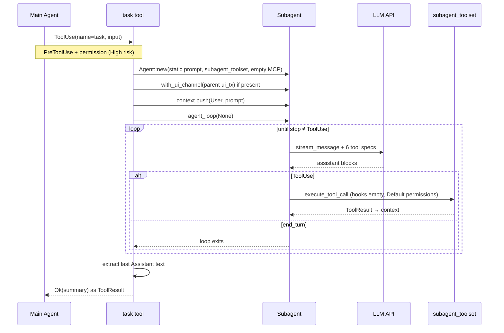

# Subagents

This chapter explains how Tact spawns **isolated worker agents** through the `task` tool: a fresh conversation loop with a restricted tool set, shared filesystem and `ToolContext` services, but no parent history, hooks, MCP tools, or SQLite session persistence.

Implementation: `crates/tact/src/tool/subagent.rs`. Tool-set wiring: `subagent_toolset()` in `crates/tact/src/tool/mod.rs`.

Do not confuse this with [Team Coordination](./13_chapter_team.md) — `spawn_teammate` only writes roster/inbox records; `task` actually runs a nested `Agent::agent_loop`.

---

## 1. What a Subagent Is

| Property | Main agent | Subagent (`task` tool) |
|----------|------------|------------------------|
| Entry | TUI / headless `agent_loop` | Parent calls `task` during tool execution |
| Conversation history | Full session context | Single user prompt only (no parent messages) |
| System prompt | Dynamic Tera template (skills, memory, CLAUDE.md) | Fixed static string |
| Native tools | `toolset()` (~40 tools) | `subagent_toolset()` (6 tools) |
| MCP tools | Loaded from config | **None** (`MCPToolRouter::new()`) |
| Hooks | Parent's registered hooks | Empty hook list |
| Session SQLite | Yes (when wired in `tui.rs`) | **No** — `session_store` stays `None` |
| Permission manager | Parent's mode | New manager, always `PermissionMode::Default` |
| TUI channel | Parent's `ui_tx` | **Inherited** — approval popups still work |
| Cancel flag | Shared on main runtime | **Separate** — user Cancel on parent does not stop an in-flight subagent |
| Return to parent | N/A | Last assistant text block as tool result string |

The subagent shares `ToolContext` (cloned): same `work_dir`, managers for background/cron/team/worktree/memory/skills, etc. Those services exist in memory, but most are unreachable because the tools that expose them are not registered on the subagent router.

---

## 2. The `task` Tool

```rust
#[derive(Debug, Deserialize, JsonSchema)]
pub struct SubagentInput {
    pub prompt: String,
    pub description: Option<String>,
}

#[tool(
    name = "task",
    description = "Spawn a subagent with fresh context. It shares the filesystem but not conversation history."
)]
pub async fn task(ctx: ToolContext, input: SubagentInput) -> Result<String>
```

| Field | Role |
|-------|------|
| `prompt` | Becomes the subagent's sole user message |
| `description` | Schema-only hint for the model; **not read by the handler** |

Only the main agent's `toolset()` registers `TaskTool`. Subagents cannot spawn nested subagents — `task` is absent from `subagent_toolset()`.

---

## 3. Spawn Lifecycle



**Blocking semantics:** `task` is `async` and awaits the full subagent loop. From the parent's perspective it is one tool call that may run many LLM turns internally. The parent's `agent_loop` is paused until the summary string returns.

**Message seeding:** the handler pushes the user message directly onto `runtime.context` (not via `push_message`), then calls `agent_loop(None)`. Because context is already non-empty, the loop does not inject a second copy. With no `session_store`, nothing is written to SQLite.

---

## 4. Restricted Tool Set

`subagent_toolset()` registers exactly six tools:

| Tool | Purpose |
|------|---------|
| `bash` | Shell commands (subject to `validate_shell_command`) |
| `read_file` | Read workspace files |
| `write_file` | Create or overwrite files |
| `edit_file` | Single replacement edits |
| `search_code` | Ripgrep search |
| `sleep` | Timing / polling |

Notable **omissions** compared to the main agent:

- No `task`, `load_skill`, `save_memory`, `compact`, web tools, LSP, apply_patch, batch tools
- No cron, team, worktree, or persistent-task management tools
- No MCP-prefixed tools

The module comment above `subagent_toolset()` still says "four tools" — the `route()` list above is authoritative (also enforced by unit test `subagent_toolset_includes_core_file_tools`).

---

## 5. System Prompt and Context

Subagents use `AgentSystemPrompt::Static`:

```rust
let system_prompt = format!(
    "You are a coding subagent at {}. Complete the given task, then summarize your findings.",
    ctx.work_dir.display()
);
```

`build_system_prompt()` returns this string verbatim every turn — no skill summaries, memory injection, CLAUDE.md, or directory snapshot. See [System Prompt](./02_chapter_prompt.md) for how the main agent differs.

Compaction and recovery **do** still run inside the subagent loop ([Context Compaction](./15_chapter_compact.md), [Error Recovery](./12_chapter_recovery.md)): `micro_compact`, `compact_history`, transport retries, and continuation messages apply to the subagent's private `runtime.context`.

---

## 6. Permissions and UI

`task` is classified as **High** risk in `PermissionManager::classify_risk` — it always triggers Ask in Default mode, even if allowlisted, because it delegates full shell and filesystem access to a nested agent.

The subagent constructs its **own** `PermissionManager::try_new(PermissionMode::Default)?`. It does not inherit the parent's Plan/Auto mode or allowlist.

If the parent has a TUI channel, the subagent reuses it:

```rust
if let Some(tx) = ctx.ui_tx {
    subagent = subagent.with_ui_channel(tx);
}
```

Permission prompts and stream updates from the subagent therefore appear in the same terminal session. See [Permission Model](./06_chapter_permission.md).

---

## 7. Scheduling Interaction

In `tool_schedule.rs`, `task` falls through to the default `_ => ToolResources::barrier()` branch. A `task` call never runs in parallel with any other tool in the same wave — see [Tasks and Tool Scheduling](./03_chapter_task.md).

---

## 8. Return Value

After `agent_loop` completes, the handler scans `runtime.context` in reverse for the last `Role::Assistant` message and extracts plain text via `extract_text`:

```rust
let summary = subagent
    .runtime
    .context
    .iter()
    .rev()
    .find(|message| matches!(message.role, Role::Assistant))
    .map(|message| extract_text(&message.content))
    .filter(|text| !text.is_empty())
    .unwrap_or_else(|| "(no summary)".to_string());
```

Implications:

- Thinking blocks and tool-use metadata are stripped; only text blocks count.
- If the model ends on a tool-use turn without a final text reply, the parent may receive `(no summary)`.
- Intermediate assistant reasoning is not returned — only the last assistant text snapshot.

That string becomes the `task` tool's JSON/text result and is appended to the **parent** context as a normal `ToolResult`.

---

## 9. Subagent vs Teammate

| | `task` (subagent) | `spawn_teammate` (team) |
|--|-------------------|-------------------------|
| Runs LLM loop | Yes, nested `agent_loop` | No — roster entry only |
| Isolation | Fresh context, 6 tools | N/A |
| Persistence | In-memory only | `.claude/team/` JSON |
| Use case | Delegate focused coding work | Multi-agent coordination protocol |

See [Team Coordination](./13_chapter_team.md).

---

## 10. Code Map

| File | Role |
|------|------|
| `crates/tact/src/tool/subagent.rs` | `task` tool handler — spawn, loop, summary extraction |
| `crates/tact/src/tool/mod.rs` | `TaskTool` registration in `toolset()`; `subagent_toolset()` |
| `crates/tact/src/agent/mod.rs` | `Agent::new`, `agent_loop`, `build_system_prompt`, `ensure_session` |
| `crates/tact/src/permission/mod.rs` | `task` → `CapabilityRisk::High` |
| `crates/tact/src/tool_schedule.rs` | `task` as scheduling barrier |
| `ARCHITECTURE.md` | One-line summary in tools table |

---

## 11. Current Gaps

| Gap | Detail |
|-----|--------|
| No nested `task` | By design in toolset, but limits decomposition depth |
| No MCP on subagents | External tools unavailable inside workers |
| No parent hooks | PreToolUse / PostToolUse policies do not wrap subagent tools |
| Static prompt only | No skills/memory/CLAUDE.md unless the parent copies them into `prompt` |
| `description` ignored | JSON field has no runtime effect |
| Separate cancel flag | Parent Cancel may not abort a long-running subagent |
| No session persistence | Subagent turns are lost if the process crashes mid-`task` |
| Summary heuristic | Last assistant text only; tool-only endings return `(no summary)` |
| Stale module comment | `subagent_toolset` doc says four tools; six are registered |
| Same LLM client | `get_llm_client()` — no model override for workers |

---

## Related Docs

- [Tool System](./10_chapter_tool.md) — `toolset` vs `subagent_toolset`, `ToolContext`
- [Tasks and Tool Scheduling](./03_chapter_task.md) — barrier semantics
- [Permission Model](./06_chapter_permission.md) — High-risk `task`, inherited `ui_tx`
- [System Prompt](./02_chapter_prompt.md) — dynamic main-agent prompt
- [Skill Registry](./11_chapter_skill.md) — `load_skill` unavailable to subagents
- [Team Coordination](./13_chapter_team.md) — roster-only teammates
- [ARCHITECTURE.md](../ARCHITECTURE.md) — workspace tool table
