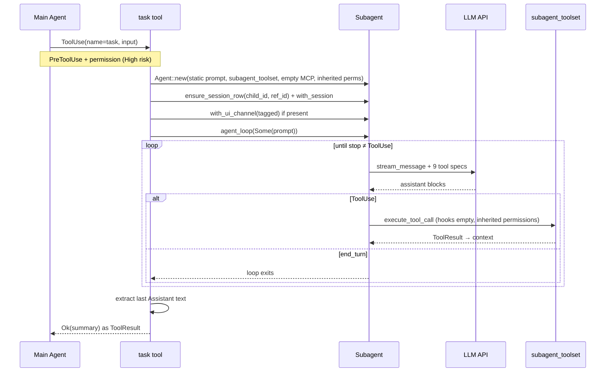
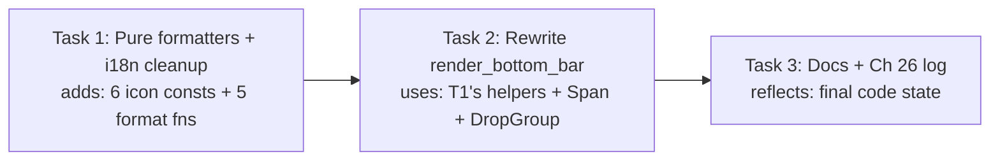
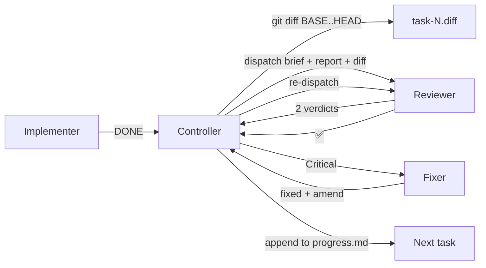
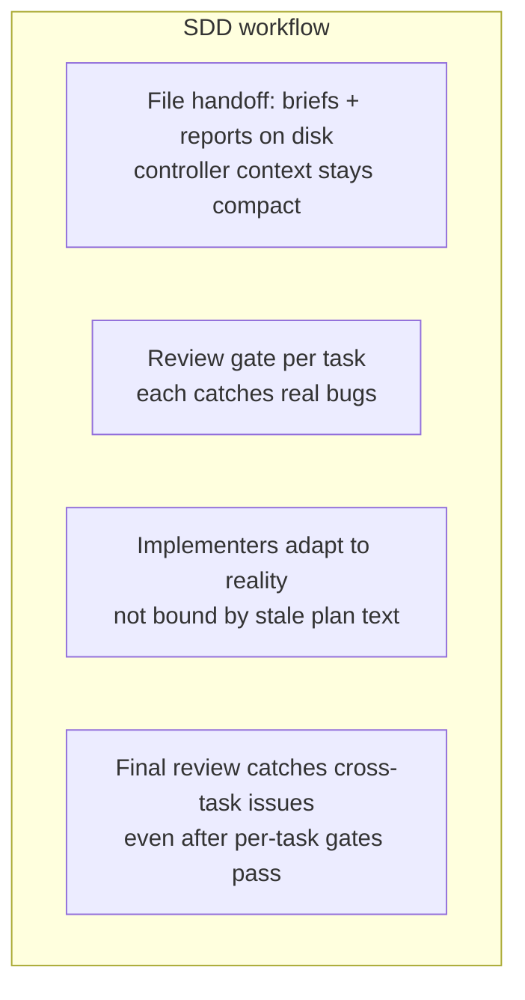

# Subagents
> Language: [English](./12_chapter_subagent.md) · [中文](./12_chapter_subagent_zh.md)

This chapter explains how Tact spawns **isolated worker agents** through the `spawn_subagent` tool: a fresh conversation loop with a restricted tool set, `ToolContext` services, and — unless `worktree: true` requests an isolated git lane — the shared filesystem, but no parent history, hooks, or MCP tools. Each subagent gets its own SQLite session row linked via `sessions.ref_id`.

Implementation: `crates/tact/src/tool/subagent.rs`. Tool-set wiring: `subagent_toolset()` in `crates/tact/src/tool/registry.rs`.

Do not confuse this with [Team Coordination](./14_chapter_team.md) — `spawn_teammate` only writes roster/inbox records; `spawn_subagent` actually runs a nested `Agent::agent_loop`.

---

## 1. What a Subagent Is

| Property | Main agent | Subagent (`spawn_subagent` tool) |
|----------|------------|------------------------|
| Entry | TUI / headless `agent_loop` | Parent calls `spawn_subagent` during tool execution |
| Conversation history | Full session context | Single user prompt only (no parent messages) |
| System prompt | Dynamic Tera template (skills, memory, CLAUDE.md) | Fixed static string |
| Native tools | `toolset()` (~40 tools) | `subagent_toolset()` (9 tools) |
| MCP tools | Loaded from config | **None** (`MCPToolRouter::new()`) |
| Hooks | Parent's registered hooks | Empty hook list |
| Session SQLite | Yes (when wired in `tui.rs`) | **Yes** — new child session; `sessions.ref_id` = parent id (or `''` if parent has none) |
| Permission manager | Parent's mode | **Inherited** — cloned from the parent's live snapshot (mode + always-allowed list + settings) via `PermissionManager::from_snapshot` |
| TUI channel | Parent's `ui_tx` | **Tagged** — stream/steps forwarded as `ToolProgress` (and `ToolMeta`) into the parent tool card; `RequestSelect*` passthrough (prefixed `[Subagent]`) |
| Cancel flag | Shared on main runtime | **Separate** — user Cancel on parent does not stop an in-flight subagent |
| Return to parent | N/A | Sync: last assistant text; async (`run_in_background`): `async_launched { id }` + re-injected `<subagent-finished>` |

The subagent shares `ToolContext` (cloned): same `work_dir`, managers for background/team/worktree/memory/skills, etc. Those services exist in memory, but most are unreachable because the tools that expose them are not registered on the subagent router.

---

## 2. The `spawn_subagent` Tool

```rust
#[derive(Debug, Deserialize, JsonSchema)]
pub struct SubagentInput {
    pub prompt: String,
    pub description: Option<String>,
    pub run_in_background: Option<bool>,
    pub max_turns: Option<u32>,
    pub resume: Option<String>,
    pub worktree: Option<bool>,
    pub agent: Option<String>,
}
```

| Field | Role |
|-------|------|
| `prompt` | Becomes the subagent's sole user message (the task) |
| `description` | Schema-only hint for the model; **not read by the handler** |
| `run_in_background` | `true` returns `async_launched { id }` immediately; the child runs detached and re-injects its summary later. Requires an interactive UI channel — in headless mode (no driver to submit a wake-up turn) it degrades to synchronous and returns the summary directly. |
| `max_turns` | Caps the nested `agent_loop` turn count (runaway guard) |
| `resume` | Reuses an existing child session id (from a prior `async_launched`) for a follow-up turn. The handler validates the target: it must have a prior `subagent_runs` record in a terminal state — resuming an unknown id, a still-`Running` child, or a session that finished more than 24h ago is rejected. |
| `worktree` | `true` runs the child inside an isolated git worktree lane (`subagent-<child_id>`, branch `wt/subagent-<child_id>`); requires a git repo at `work_dir`. On `resume` the existing lane is reused. The lane is created synchronously (failures surface immediately) and kept after completion for inspection via `worktree_status` / `worktree_run`; clean up with `worktree_remove { name }` (refuses a running subagent's lane and a dirty tree). |
| `agent` | Runs a **declarative agent definition** by name — `plugin:<name>` for installed plugin `agents/*.md`, or a unique local name from `.tact/agents/*.md`. The definition body becomes the system prompt; its `tools` / `model` / `permissionMode` frontmatter apply (see §2.1). |

Only the main agent's `toolset()` registers the worktree/team/task/skill/memory/MCP/plugin tools. The subagent toolset does register the subagent tools themselves, so **subagents can spawn nested subagents** — depth-limited to `MAX_SUBAGENT_DEPTH = 3` (main agent = depth 0; a subagent spawned by a subagent beyond the cap is refused) so a child cannot recursively fan out without bound.

---

## 2.1 Declarative agent definitions

Tact loads reusable subagent definitions from two roots (later wins on name clash):

- `<workdir>/.tact/agents/*.md` — project-local, plain names (`architect`);
- installed plugins `<cache>/agents/*.md` — namespaced `plugin:<name>` (e.g. `claude-security:code-reviewer`).

Frontmatter (Claude Code compatible):

```markdown
---
name: reviewer
description: Reviews code with an adversarial lens
tools: Read, Glob, Grep, Bash
model: sonnet
permissionMode: plan
---

You are a principal reviewer. …
```

- `tools` restricts the subagent toolset (Claude names map to Tact tools: Read/Glob/Grep → `read_file`, Bash → `bash`, Edit → `edit_file`, Write → `write_file`, Sleep → `sleep`, Task → `spawn_subagent`, Check/Wait/Cancel → `check_subagent`/`wait_subagent`/`cancel_subagent`; unknown names are ignored; an empty set keeps the default nine tools).
- `model` overrides the child model (layered on top of the `[agent.subagent]` config).
- `permissionMode` overrides the inherited permission mode unless the parent is in `Auto` (Auto stays sticky).

Registry: `crates/tact/src/agent_def.rs` (`AgentDefinitionRegistry`, shared on `ToolContext.agent_registry`). `spawn_subagent` with an unknown `agent` name fails with the list of available definitions.

---

## 3. Spawn Lifecycle


```mermaid
sequenceDiagram
    participant Parent as Main Agent
    participant Task as task tool
    participant Sub as Subagent
    participant LLM as LLM API
    participant Tools as subagent_toolset

    Parent->>Task: ToolUse(name=task, input)
    Note over Parent,Task: PreToolUse + permission (High risk)
    Task->>Sub: Agent::new(static prompt, subagent_toolset, empty MCP, inherited perms)
    Task->>Sub: ensure_session_row(child_id, ref_id) + with_session
    Task->>Sub: with_ui_channel(tagged) if present
    Task->>Sub: agent_loop(Some(prompt))

    loop until stop ≠ ToolUse
        Sub->>LLM: stream_message + 9 tool specs
        LLM-->>Sub: assistant blocks
        alt ToolUse
            Sub->>Tools: execute_tool_call (hooks empty, inherited permissions)
            Tools-->>Sub: ToolResult → context
        else end_turn
            Sub-->>Task: loop exits
        end
    end

    Task->>Task: extract last Assistant text
    Task-->>Parent: Ok(summary) as ToolResult
```

**Blocking semantics (sync):** `spawn_subagent` is `async` and awaits the full subagent loop. From the parent's perspective it is one tool call that may run many LLM turns internally. The parent's `agent_loop` is paused until the summary string returns.

**Async semantics (`run_in_background: true`):** the handler returns `async_launched { id }` immediately; the nested loop runs in a detached `tokio::spawn` task. On completion the task (a) transitions the `subagent_runs` row to `Completed`/`Failed`/`Cancelled`, (b) enqueues a `SubagentResult` into the parent's `pending_subagent_results`, and (c) emits `AgentUpdate::SubagentFinished` on the **parent** `ui_tx`. The parent's next `agent_loop` iteration drains the queue and injects a synthetic `<subagent-finished id=…>` user message via `push_message` (persisted). If the parent is idle, the TUI relays a `UserCommand::SubagentFinishedNotification` to the driver, which submits a lightweight wake-up turn; if a turn is still in flight, the driver **retains** the wake-up and submits it as soon as that turn's `JoinHandle` completes, so a notification landing in the gap between the final queue drain and turn exit is not lost. A cancelled child is reported with `success = false` even when its loop exited cleanly after the flag was set.

**Message seeding:** the handler calls `agent_loop(Some(user_prompt))` so the seed user turn is appended via `push_message` and persisted under the child session. Before the loop, `spawn_subagent` allocates a child session id (or reuses `resume`), sets `ref_id` to the parent session id (or `''`), and calls `with_session`. UI traffic uses a tagged `ui_tx` (`with_ui_channel` also syncs `tool_context.ui_tx` so `ToolProgress` is tagged).

---

## 4. Restricted Tool Set

`subagent_toolset()` registers nine tools:

| Tool | Purpose |
|------|---------|
| `bash` | Shell commands (subject to `validate_shell_command`) |
| `read_file` | Read workspace files |
| `write_file` | Create or overwrite files |
| `edit_file` | Exact string replace (first or all) |
| `sleep` | Timing / polling |
| `spawn_subagent` | **Nested** spawn (depth-limited to `MAX_SUBAGENT_DEPTH = 3`) |
| `check_subagent` | Query a nested child's run status |
| `wait_subagent` | Block until a nested child finishes / times out |
| `cancel_subagent` | Cancel a running nested child |

Notable **omissions** compared to the main agent:

- No `load_skill`, `save_memory`, `compact`, web tools, LSP, apply_patch, batch tools
- No team, worktree, or persistent-task management tools
- No MCP-prefixed tools

The default nine-tool set is enforced by unit test `subagent_toolset_has_nine_tools`; a declarative `tools:` list can narrow it (unknown names ignored, empty list keeps the default set).

---

## 5. System Prompt and Context

Subagents use `AgentSystemPrompt::Static`:

```rust
let system_prompt = format!(
    "You are a coding subagent at {}. Complete the given task, then summarize your findings.",
    ctx.work_dir.display()
);
```

`build_system_prompt()` returns this string verbatim every turn — no skill summaries, memory injection, CLAUDE.md, or directory snapshot. See [System Prompt](./04_chapter_prompt.md) for how the main agent differs.

Compaction and recovery **do** still run inside the subagent loop ([Context Compaction](./05_chapter_compact.md), [Error Recovery](./06_chapter_recovery.md)): `micro_compact`, `compact_history`, transport retries, and continuation messages apply to the subagent's private `runtime.context`.

---

## 6. Permissions and UI

`spawn_subagent` is classified as **High** risk in `PermissionManager::classify_risk` — it always triggers Ask in Default mode, even if allowlisted, because it delegates full shell and filesystem access to a nested agent.

**Permission inheritance (Claude-style):** `execute_tool_call` stamps a `PermissionSnapshot` (mode + in-session always-allowed list + loaded settings) onto `ToolContext` just before the wave runs, and `spawn_subagent` builds the child's `PermissionManager::from_snapshot(...)` from it. Parent `Default` → child `Default`, `Plan` → child `Plan` (read-only), `Auto` → child `Auto` (sticky). The child's `consecutive_denials` counter resets. Orphan/test contexts without a parent agent fall back to the pre-inheritance `PermissionMode::Default` + settings loaded from disk. This also fixes the read-only-escape: a `Plan` parent can no longer spawn a `Default` child that writes.

If the parent has a TUI channel, the subagent gets a **tagged** channel (`tagged_ui_channel_with_progress`): stream, steps, thinking, and tool results become `AgentUpdate::ToolProgress` (and `ToolMeta` for the card header) in the parent tool card, which renders as a `ToolVisualKind::Subagent` card in the Log history. Clicking that card opens a `SubagentPopup` (`ToolPopupKind::SubagentTranscript`). `RequestSelect` / `RequestMultiSelect` still pass through (prefixed `[Subagent]`) so permission popups work on the main TUI; concurrent subagent permission prompts are queued and served one at a time. See [Permission Model](./10_chapter_permission.md) and [TUI](./23_chapter_tui.md).

---

## 7. Scheduling Interaction

In `crates/tact/src/agent/tool_schedule.rs`, `spawn_subagent` declares `ResourcePolicy::Barrier`. A plain (shared-filesystem) `spawn_subagent` call never runs in parallel with any other tool in the same wave — see [Tasks and Tool Scheduling](./11_chapter_task.md). Background parallelism for that case comes from `tokio::spawn` (`run_in_background`), not from wave scheduling.

**Worktree-isolated spawns are the exception.** `execute_tool_call` resolves resources **per invocation** (`tool_resources_for` in `crates/tact/src/agent/tool_dispatch.rs`): a `spawn_subagent` call with `worktree: true` maps to `ToolResources::independent()` — its file effects are scoped to the lane, so it may fan out in the same wave as other tools (including other isolated subagents) without racing the main tree. This is the "worktree follow-up" from the 2026-08-26 async-subagent design review, which noted that same-wave fan-out of blocking subagents becomes safe once each subagent has a scoped filesystem. Note: a worktree is an organizational boundary, **not** an OS sandbox — a subagent's `bash` can still reach outside the lane; the isolation prevents *ordinary* path-conflicting edits from colliding.

Worktree lane creation runs synchronously inside the handler (before the sync loop, or before `async_launched { id }` returns), so a non-git `work_dir` fails the spawn with a clear error rather than silently sharing the filesystem. The lane is based on the repo-root `HEAD` and persists after the child finishes; remove it manually with `git worktree remove <path>` (no tool surface yet).

## 8. Persistence and Lifecycle

Both sync and async subagents persist their run in the `subagent_runs` table (`child_id`, `status`, `summary`, `started_at`, `finished_at`), keyed by child session id — the subagent analog of `background_tasks`. `spawn_subagent` records `Running` on entry and `Completed`/`Failed`/`Cancelled` on exit for **both** paths, so `check_subagent` / `cancel_subagent` / `wait_subagent` see every child uniformly (a sync child is also cancellable via `/subagent_cancel` or parent exit, and a sync failure no longer leaves a stale `Running` row). `SubagentManager::new` repairs orphans on startup (any `running` row → `failed` with `"Process interrupted (agent restarted)"`). The `check_subagent` tool reads this state, and `wait_subagent { child_id, timeout_ms? }` blocks (polling `subagent_runs`) until the child reaches a terminal status or times out — the Codex `wait_agent` analog that lets the parent spawn N subagents then wait on each instead of burning turns polling `check_subagent`. The in-memory `pending_subagent_results` queue is the live fast path; the persisted row is the crash-recovery source of truth. Finished results are **not** re-delivered automatically after a restart — the injected `<subagent-finished>` message is already in the transcript, and the model decides to `resume` or re-spawn.

---

## 9. Return Value

After `agent_loop` completes, the handler scans `runtime.context` in reverse for the last `Role::Assistant` message and extracts plain text via `extract_text`:

```rust
let summary = subagent
    .runtime
    .context
    .iter()
    .rev()
    .find(|message| matches!(message.role, Role::Assistant))
    .map(|message| extract_text(&message.content))
    .filter(|text| !text.is_empty())
    .unwrap_or_else(|| "(no summary)".to_string());
```

Implications:

- Thinking blocks and tool-use metadata are stripped; only text blocks count.
- If the model ends on a tool-use turn without a final text reply, the parent may receive `(no summary)`.
- Intermediate assistant reasoning is not returned — only the last assistant text snapshot.

That string becomes the `spawn_subagent` tool's JSON/text result and is appended to the **parent** context as a normal `ToolResult`.

---

## 10. Subagent vs Teammate

| | `spawn_subagent` (subagent) | `spawn_teammate` (team) |
|--|-------------------|-------------------------|
| Runs LLM loop | Yes, nested `agent_loop` | No — roster entry only |
| Isolation | Fresh context, 9 tools | N/A |
| Persistence | Own SQLite session (`ref_id` → parent) | `.tact/team/` JSON |
| Use case | Delegate focused coding work | Multi-agent coordination protocol |

See [Team Coordination](./14_chapter_team.md).

---

## 11. Code Map

| File | Role |
|------|------|
| `crates/tact/src/tool/subagent.rs` | `spawn_subagent` + `check_subagent` + `wait_subagent` + `cancel_subagent` handlers — spawn, sync/async loop, summary extraction, resume, max_turns |
| `crates/tact/src/tool/mod.rs` | `SpawnSubagentTool` / `CheckSubagentTool` implementations; `permission_snapshot` + `subagent_results` + `subagent_manager` on `ToolContext` |
| `crates/tact/src/tool/registry.rs` | `SpawnSubagentTool` + `CheckSubagentTool` in `toolset()`; `subagent_toolset()` |
| `crates/tact/src/agent/mod.rs` | `Agent::new`, `agent_loop` (drain + max_turns), `ensure_session`, `pending_subagent_results` |
| `crates/tact/src/agent/tool_dispatch.rs` | stamps `permission_snapshot` + `subagent_results`; input-aware `keep_live` |
| `crates/tact/src/permission/mod.rs` | `PermissionSnapshot`, `snapshot()`/`from_snapshot()` |
| `crates/tact/src/subagent.rs` | `SubagentManager` / `SubagentRun` / `SubagentStatus` (orphan repair) |
| `crates/tact/src/store/subagent_store/` | `subagent_runs` SQLite table + trait |
| `crates/protocol/src/agent.rs` | `AgentUpdate::SubagentFinished`, `UserCommand::SubagentFinishedNotification` |
| `crates/tact-ui/src/driver.rs` | wake-up turn on `SubagentFinishedNotification` (retained while a turn is in flight) |
| `crates/tact/src/agent/tool_schedule.rs` | `spawn_subagent` as scheduling barrier |
| `ARCHITECTURE.md` | One-line summary in tools table |

---

## 12. Current Gaps

| Gap | Detail |
|-----|--------|
| No nested `spawn_subagent` | By design in toolset, but limits decomposition depth |
| No MCP on subagents | External tools unavailable inside workers |
| No parent hooks | PreToolUse / PostToolUse policies do not wrap subagent tools |
| Static prompt only | No skills/memory/CLAUDE.md unless the parent copies them into `prompt` |
| `description` ignored | JSON field has no runtime effect |
| Separate cancel flag | Parent `/cancel` aborts the main task only. A **running background subagent** is cancelled via `cancel_subagent` (tool), `/subagent_cancel <child-id>` (slash), or the `[Cancel]` button on the live subagent tool card — all flip the child's cooperative flag via the shared `SubagentManager` cancel handles. When the parent exits (TUI quit / driver loop end), `cancel_all()` flips every live handle so background subagents stop instead of becoming orphans. (Headless never has live background children at exit: `run_in_background` degrades to synchronous there.) |
| No worktree removal | Isolated lanes can now be cleaned up with `worktree_remove { name }` (runs `git worktree remove`, deletes the tracking record, refuses a running subagent's lane and a dirty tree). The backing branch `wt/<name>` is left in place so unmerged commits stay recoverable |
| Worktree base = repo HEAD | A subagent spawned *from* another worktree still branches from the main repo HEAD, not the parent lane |
| Child sessions hidden from list | `--list-sessions` / resume only show `ref_id = ''`; delete parent cascades children |
| Summary heuristic | Last assistant text only; tool-only endings return `(no summary)` |
| Same LLM client | `get_llm_client()` — no model override for workers (except the `subagent` config block and declarative `model` frontmatter) |

---

## 13. Real-World Case Study: Bottom Bar Visual Polish

A 3-task SDD session on `feat/web`. Plan: `docs/superpowers/plans/2026-07-24-bottom-bar-polish.md`.
Stats: 6 subagents (3 implementers + 2 reviewers + 1 fixer), 400 tests, 5 commits pushed.

### 13.1 Task Dependency — Why Serial


```mermaid
flowchart LR
    T1["Task 1: Pure formatters + i18n cleanup<br/>adds: 6 icon consts + 5 format fns"] --> T2
    T2["Task 2: Rewrite render_bottom_bar<br/>uses: T1's helpers + Span + DropGroup"] --> T3
    T3["Task 3: Docs + Ch 26 log<br/>reflects: final code state"]
```

All three tasks modify `crates/tui/src/render/bar.rs`. SDD prohibits parallel dispatch on shared files — enforced at the controller level.

### 13.2 File-Based Handoff (not conversation history)

```
.superworks/sdd/
├── progress.md                          # Recovery anchor (survives compaction)
├── task-1-brief.md                      # Requirements extracted from plan
├── task-1-report.md                     # Implementer's output
├── review-task-1.diff                   # git diff for reviewer
├── review-task-1-v2.diff                # Re-review after fix
├── task-2-brief.md / task-2-report.md   # Same pattern
├── ...
└── final-review.diff                    # Whole-branch diff for final review
```

Each dispatch prompt is a 5-line template — the brief file is the **single source of requirements**:

```
┌── dispatch ───────────────────────────────────────────────────────┐
│ You are implementing Task 1.                                      │
│ Read this file: .superworks/sdd/task-1-brief.md                  │
│ Work in: /Users/rg/Projects/tact, branch feat/web                │
│ Verify: cargo check -p tact-tui; then cargo test -p tact-ui      │
│ Report to: .superworks/sdd/task-1-report.md                      │
└──────────────────────────────────────────────────────────────────┘
```

**A brief file contains exact code to write** — not prose instructions. The implementer copies verbatim, writes tests, commits. No context to inherit, no history to pollute:

```
.superworks/sdd/task-1-brief.md  (abbreviated)
├── Part A: i18n.rs — delete 7 fields from struct + both locales
├── Part B: bar.rs — add 6 icon constants
├── Part C: bar.rs — add 5 pure helpers (code block provided)
├── Part D: bar.rs — add 10 unit tests (code block provided)
└── Commit: "feat(tui): add bottom-bar pure formatters ..."
```

**A report file captures what happened** — the controller reads this after the subagent exits:

```
.superworks/sdd/task-1-report.md  (abbreviated)
├── Status: DONE
├── Commits: 3a8a186
├── Test results: cargo check fails (expected — T2 fixes bar.rs)
├── Changes: Part A done, Part B done, Part C done, Part D done
└── Concerns: WindowEntry doesn't exist → used UsageQuotaWindow
```

Without file handoff, every subagent's code and report would inflate the controller's context permanently. With it, the controller reads only the SHA and status line — the rest lives on disk.

### 13.3 Review Loop — Gate Per Task


```mermaid
flowchart LR
    I["Implementer"] -->|DONE| C["Controller"]
    C -->|"git diff BASE..HEAD"| D["task-N.diff"]
    C -->|"dispatch brief + report + diff"| R["Reviewer"]
    R -->|"2 verdicts"| C
    C -->|"Critical"| F["Fixer"]
    F -->|"fixed + amend"| C
    C -->|"re-dispatch"| R
    R -->|"✅"| C
    C -->|"append to progress.md"| N["Next task"]
```

Two verdicts, each binary:

| Verdict | Pass if | Fail → |
|---------|---------|--------|
| **Spec compliance** | Every brief requirement present. No extras (YAGNI). | Fixer dispatched |
| **Task quality** | Tests cover edge cases. No unwrap in non-test. No dead imports. | Fixer dispatched |

**Severity determines response:**

| Severity | Meaning | Action |
|----------|---------|--------|
| Critical | Blocks correctness, bug in logic | Must fix, must re-review |
| Important | Maintainability risk, test gap | Recommend fix |
| Minor | Style, naming | Record in ledger, triage at final review |

### 13.4 What Task 1's Review Caught (Critical)

```
format_quota_window_with_pct  expects "75%"
                              actual   "25%"
usage_pct() = (limit - remaining) / limit * 100
            = (200 - 150) / 200 * 100
            = 25    ← not 75
```

The brief specified `WindowEntry` (doesn't exist). Implementer correctly adapted to `UsageQuotaWindow` but copied the brief's wrong expected value. Fix: 1-line test change, `git commit --amend`, re-review passes.

Without this gate: test fails on first CI run → developer marks flaky → never caught.

### 13.5 Plan-Reality Adaptation

Plan referenced `FocusedPanel::Plan` and `focus_plan` / `bottom_focus_log_plan` i18n fields. Actual code has no `Plan` variant — deleted in a previous refactor.

```mermaid
flowchart LR
    P["Plan doc: FocusedPanel::Plan exists"] -->|stale| A
    C["Repo: only FocusedPanel::Log, plan.rs deleted"] -->|reality| A
    A["Implementer adapts: FocusedPanel::Log => \"[Log]\""]
    A --> R["Reviewer: ✅ adaptation correct"]
```

Implementers are not mechanical code generators — they read the real codebase, detect drift, and adapt. The controller adjudicates whether the adaptation is acceptable.

### 13.6 Final Review — Branch-Level Gate

Whole-branch diff (`git merge-base main HEAD`..`HEAD`): **5455 lines, 37 files**.

| Finding | Severity | Action |
|---------|----------|--------|
| `expect()` on mutex — will panic if poisoned | Important | Deferred |
| `display_width()` uses `chars().count()` not Unicode width | Important | Deferred |
| Row 1 drop-order is path→uptime, spec says uptime→path | Important | **Fixed immediately** |

Verdict: **Ready to merge**. The fixed drop-order was the most actionable; the other two are lower risk.

### 13.7 Key Takeaways


```mermaid
flowchart TD
    subgraph "SDD workflow"
        F1["File handoff: briefs + reports on disk<br/>controller context stays compact"]
        F2["Review gate per task<br/>each catches real bugs"]
        F3["Implementers adapt to reality<br/>not bound by stale plan text"]
        F4["Final review catches cross-task issues<br/>even after per-task gates pass"]
    end
```

| # | Lesson | Evidence |
|---|--------|----------|
| 1 | Serial is required — same-crate deps prevent parallel | All 3 tasks touch `bar.rs` |
| 2 | Brief file is the single source — not prompt text | Dispatch is 5 lines; brief has 200 lines of code |
| 3 | Review gate catches Critical bugs that CI wouldn't | 75%→25% test would have shipped |
| 4 | BASE commit must be pre-task SHA, not `HEAD~1` | Multi-commit tasks would be truncated |
| 5 | `.superworks/sdd/progress.md` survives compaction | After compaction: `cat progress.md` + `git log` → resume |

---

## Related Docs

- [Tool System](./07_chapter_tool.md) — `toolset` vs `subagent_toolset`, `ToolContext`
- [Tasks and Tool Scheduling](./11_chapter_task.md) — barrier semantics
- [Permission Model](./10_chapter_permission.md) — High-risk `spawn_subagent`, inherited `ui_tx`
- [System Prompt](./04_chapter_prompt.md) — dynamic main-agent prompt
- [Skill Registry](./02_chapter_skill.md) — `load_skill` unavailable to subagents
- [Team Coordination](./14_chapter_team.md) — roster-only teammates
- [ARCHITECTURE.md](../ARCHITECTURE.md) — workspace tool table
