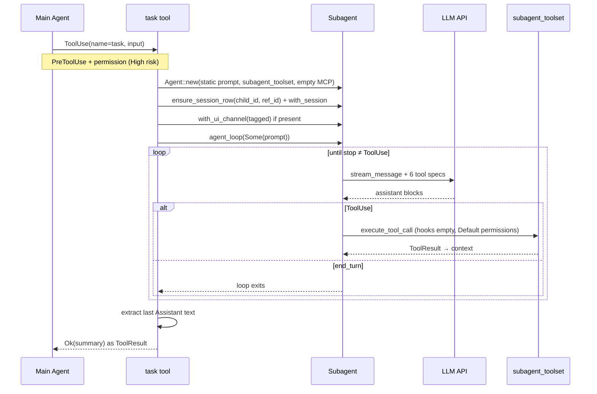
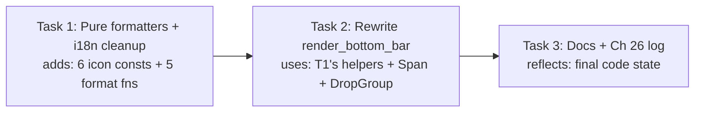
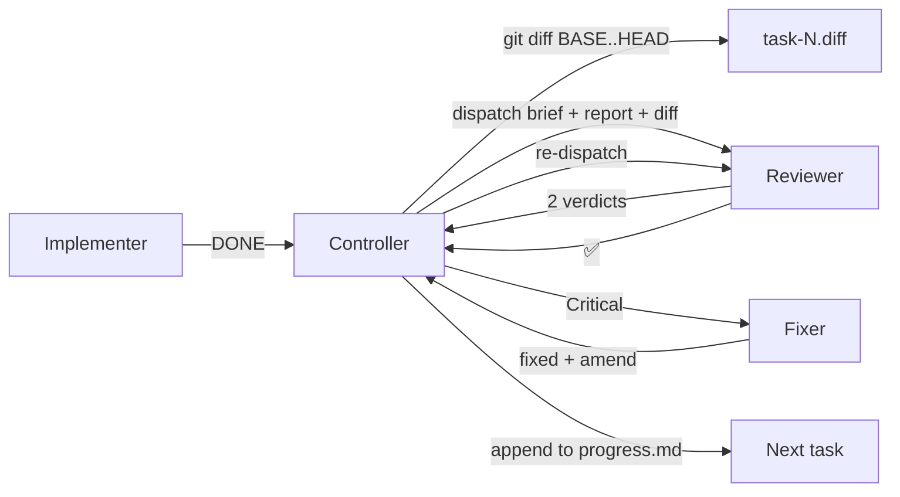
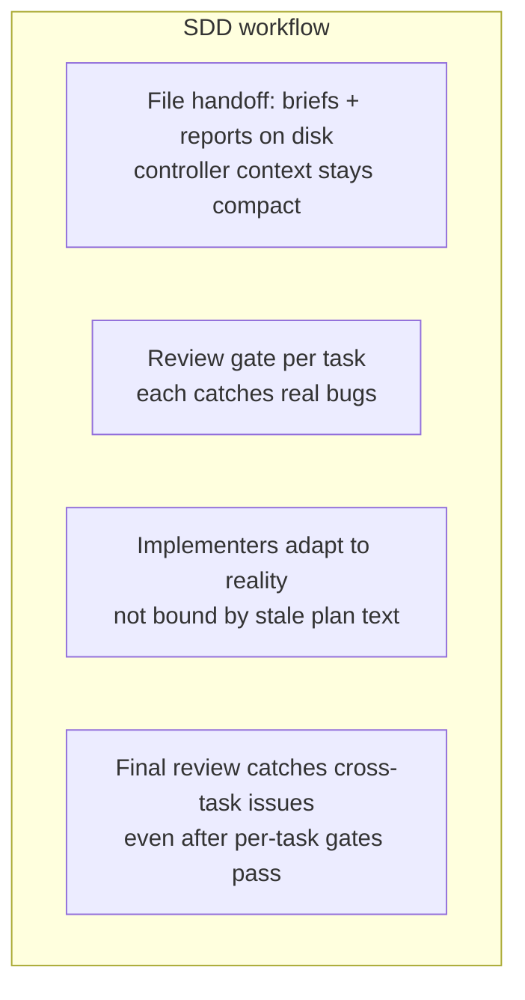

# Subagents
> Language: [English](./12_chapter_subagent.md) · [中文](./12_chapter_subagent_zh.md)

This chapter explains how Tact spawns **isolated worker agents** through the `task` tool: a fresh conversation loop with a restricted tool set, shared filesystem and `ToolContext` services, but no parent history, hooks, or MCP tools. Each subagent gets its own SQLite session row linked via `sessions.ref_id`.

Implementation: `crates/tact/src/tool/subagent.rs`. Tool-set wiring: `subagent_toolset()` in `crates/tact/src/tool/registry.rs`.

Do not confuse this with [Team Coordination](./14_chapter_team.md) — `spawn_teammate` only writes roster/inbox records; `task` actually runs a nested `Agent::agent_loop`.

---

## 1. What a Subagent Is

| Property | Main agent | Subagent (`task` tool) |
|----------|------------|------------------------|
| Entry | TUI / headless `agent_loop` | Parent calls `task` during tool execution |
| Conversation history | Full session context | Single user prompt only (no parent messages) |
| System prompt | Dynamic Tera template (skills, memory, CLAUDE.md) | Fixed static string |
| Native tools | `toolset()` (~40 tools) | `subagent_toolset()` (6 tools) |
| MCP tools | Loaded from config | **None** (`MCPToolRouter::new()`) |
| Hooks | Parent's registered hooks | Empty hook list |
| Session SQLite | Yes (when wired in `tui.rs`) | **Yes** — new child session; `sessions.ref_id` = parent id (or `''` if parent has none) |
| Permission manager | Parent's mode | New manager, always `PermissionMode::Default` |
| TUI channel | Parent's `ui_tx` | **Tagged** — stream/steps go to Subagent sticky; `RequestSelect*` passthrough |
| Cancel flag | Shared on main runtime | **Separate** — user Cancel on parent does not stop an in-flight subagent |
| Return to parent | N/A | Last assistant text block as tool result string |

The subagent shares `ToolContext` (cloned): same `work_dir`, managers for background/cron/team/worktree/memory/skills, etc. Those services exist in memory, but most are unreachable because the tools that expose them are not registered on the subagent router.

---

## 2. The `task` Tool

```rust
#[derive(Debug, Deserialize, JsonSchema)]
pub struct SubagentInput {
    pub prompt: String,
    pub description: Option<String>,
}

#[tool(
    name = "task",
    description = "Spawn a subagent with fresh context. It shares the filesystem but not conversation history."
)]
pub async fn task(ctx: ToolContext, input: SubagentInput) -> Result<String>
```

| Field | Role |
|-------|------|
| `prompt` | Becomes the subagent's sole user message |
| `description` | Schema-only hint for the model; **not read by the handler** |

Only the main agent's `toolset()` registers `TaskTool`. Subagents cannot spawn nested subagents — `task` is absent from `subagent_toolset()`.

---

## 3. Spawn Lifecycle


```mermaid
sequenceDiagram
    participant Parent as Main Agent
    participant Task as task tool
    participant Sub as Subagent
    participant LLM as LLM API
    participant Tools as subagent_toolset

    Parent->>Task: ToolUse(name=task, input)
    Note over Parent,Task: PreToolUse + permission (High risk)
    Task->>Sub: Agent::new(static prompt, subagent_toolset, empty MCP)
    Task->>Sub: ensure_session_row(child_id, ref_id) + with_session
    Task->>Sub: with_ui_channel(tagged) if present
    Task->>Sub: agent_loop(Some(prompt))

    loop until stop ≠ ToolUse
        Sub->>LLM: stream_message + 6 tool specs
        LLM-->>Sub: assistant blocks
        alt ToolUse
            Sub->>Tools: execute_tool_call (hooks empty, Default permissions)
            Tools-->>Sub: ToolResult → context
        else end_turn
            Sub-->>Task: loop exits
        end
    end

    Task->>Task: extract last Assistant text
    Task-->>Parent: Ok(summary) as ToolResult
```

**Blocking semantics:** `task` is `async` and awaits the full subagent loop. From the parent's perspective it is one tool call that may run many LLM turns internally. The parent's `agent_loop` is paused until the summary string returns.

**Message seeding:** the handler calls `agent_loop(Some(user_prompt))` so the seed user turn is appended via `push_message` and persisted under the child session. Before the loop, `task` allocates a child session id, sets `ref_id` to the parent session id (or `''`), and calls `with_session`. UI traffic uses a tagged `ui_tx` (`with_ui_channel` also syncs `tool_context.ui_tx` so `ToolProgress` is tagged).

---

## 4. Restricted Tool Set

`subagent_toolset()` registers exactly five tools:

| Tool | Purpose |
|------|---------|
| `bash` | Shell commands (subject to `validate_shell_command`) |
| `read_file` | Read workspace files |
| `write_file` | Create or overwrite files |
| `edit_file` | Exact string replace (first or all) |
| `sleep` | Timing / polling |

Notable **omissions** compared to the main agent:

- No `task`, `load_skill`, `save_memory`, `compact`, web tools, LSP, apply_patch, batch tools
- No cron, team, worktree, or persistent-task management tools
- No MCP-prefixed tools

The module comment above `subagent_toolset()` still says "four tools" — the `route()` list above is authoritative (also enforced by unit test `subagent_toolset_includes_core_file_tools`).

---

## 5. System Prompt and Context

Subagents use `AgentSystemPrompt::Static`:

```rust
let system_prompt = format!(
    "You are a coding subagent at {}. Complete the given task, then summarize your findings.",
    ctx.work_dir.display()
);
```

`build_system_prompt()` returns this string verbatim every turn — no skill summaries, memory injection, CLAUDE.md, or directory snapshot. See [System Prompt](./04_chapter_prompt.md) for how the main agent differs.

Compaction and recovery **do** still run inside the subagent loop ([Context Compaction](./05_chapter_compact.md), [Error Recovery](./06_chapter_recovery.md)): `micro_compact`, `compact_history`, transport retries, and continuation messages apply to the subagent's private `runtime.context`.

---

## 6. Permissions and UI

`task` is classified as **High** risk in `PermissionManager::classify_risk` — it always triggers Ask in Default mode, even if allowlisted, because it delegates full shell and filesystem access to a nested agent.

The subagent constructs its **own** `PermissionManager::try_new(PermissionMode::Default)?`. It does not inherit the parent's Plan/Auto mode or allowlist.

If the parent has a TUI channel, the subagent gets a **tagged** channel (`tagged_ui_channel`): stream, steps, thinking, and token usage become `AgentUpdate::Subagent` and render in the sticky **Subagent** tab. `RequestSelect` / `RequestMultiSelect` still pass through so permission popups work on the main TUI. See [Permission Model](./10_chapter_permission.md) and [TUI](./23_chapter_tui.md).

---

## 7. Scheduling Interaction

In `crates/tact/src/agent/tool_schedule.rs`, `task` falls through to the default `_ => ToolResources::barrier()` branch. A `task` call never runs in parallel with any other tool in the same wave — see [Tasks and Tool Scheduling](./11_chapter_task.md).

---

## 8. Return Value

After `agent_loop` completes, the handler scans `runtime.context` in reverse for the last `Role::Assistant` message and extracts plain text via `extract_text`:

```rust
let summary = subagent
    .runtime
    .context
    .iter()
    .rev()
    .find(|message| matches!(message.role, Role::Assistant))
    .map(|message| extract_text(&message.content))
    .filter(|text| !text.is_empty())
    .unwrap_or_else(|| "(no summary)".to_string());
```

Implications:

- Thinking blocks and tool-use metadata are stripped; only text blocks count.
- If the model ends on a tool-use turn without a final text reply, the parent may receive `(no summary)`.
- Intermediate assistant reasoning is not returned — only the last assistant text snapshot.

That string becomes the `task` tool's JSON/text result and is appended to the **parent** context as a normal `ToolResult`.

---

## 9. Subagent vs Teammate

| | `task` (subagent) | `spawn_teammate` (team) |
|--|-------------------|-------------------------|
| Runs LLM loop | Yes, nested `agent_loop` | No — roster entry only |
| Isolation | Fresh context, 6 tools | N/A |
| Persistence | Own SQLite session (`ref_id` → parent) | `.tact/team/` JSON |
| Use case | Delegate focused coding work | Multi-agent coordination protocol |

See [Team Coordination](./14_chapter_team.md).

---

## 10. Code Map

| File | Role |
|------|------|
| `crates/tact/src/tool/subagent.rs` | `task` tool handler — spawn, loop, summary extraction |
| `crates/tact/src/tool/mod.rs` | `TaskTool` implementation |
| `crates/tact/src/tool/registry.rs` | `TaskTool` in `toolset()`; `subagent_toolset()` |
| `crates/tact/src/agent/mod.rs` | `Agent::new`, `agent_loop`, `build_system_prompt`, `ensure_session` |
| `crates/tact/src/permission/mod.rs` | `task` → `CapabilityRisk::High` |
| `crates/tact/src/agent/tool_schedule.rs` | `task` as scheduling barrier |
| `ARCHITECTURE.md` | One-line summary in tools table |

---

## 11. Current Gaps

| Gap | Detail |
|-----|--------|
| No nested `task` | By design in toolset, but limits decomposition depth |
| No MCP on subagents | External tools unavailable inside workers |
| No parent hooks | PreToolUse / PostToolUse policies do not wrap subagent tools |
| Static prompt only | No skills/memory/CLAUDE.md unless the parent copies them into `prompt` |
| `description` ignored | JSON field has no runtime effect |
| Separate cancel flag | Parent Cancel may not abort a long-running subagent |
| Child sessions hidden from list | `--list-sessions` / resume only show `ref_id = ''`; delete parent cascades children |
| Summary heuristic | Last assistant text only; tool-only endings return `(no summary)` |
| Stale module comment | `subagent_toolset` doc says four tools; five are registered |
| Same LLM client | `get_llm_client()` — no model override for workers |

---

## 12. Real-World Case Study: Bottom Bar Visual Polish

A 3-task SDD session on `feat/web`. Plan: `docs/superpowers/plans/2026-07-24-bottom-bar-polish.md`.
Stats: 6 subagents (3 implementers + 2 reviewers + 1 fixer), 400 tests, 5 commits pushed.

### 12.1 Task Dependency — Why Serial


```mermaid
flowchart LR
    T1["Task 1: Pure formatters + i18n cleanup<br/>adds: 6 icon consts + 5 format fns"] --> T2
    T2["Task 2: Rewrite render_bottom_bar<br/>uses: T1's helpers + Span + DropGroup"] --> T3
    T3["Task 3: Docs + Ch 26 log<br/>reflects: final code state"]
```

All three tasks modify `crates/tui/src/render/bar.rs`. SDD prohibits parallel dispatch on shared files — enforced at the controller level.

### 12.2 File-Based Handoff (not conversation history)

```
.superworks/sdd/
├── progress.md                          # Recovery anchor (survives compaction)
├── task-1-brief.md                      # Requirements extracted from plan
├── task-1-report.md                     # Implementer's output
├── review-task-1.diff                   # git diff for reviewer
├── review-task-1-v2.diff                # Re-review after fix
├── task-2-brief.md / task-2-report.md   # Same pattern
├── ...
└── final-review.diff                    # Whole-branch diff for final review
```

Each dispatch prompt is a 5-line template — the brief file is the **single source of requirements**:

```
┌── dispatch ───────────────────────────────────────────────────────┐
│ You are implementing Task 1.                                      │
│ Read this file: .superworks/sdd/task-1-brief.md                  │
│ Work in: /Users/rg/Projects/tact, branch feat/web                │
│ Verify: cargo check -p tact-tui; then cargo test -p tact-ui      │
│ Report to: .superworks/sdd/task-1-report.md                      │
└──────────────────────────────────────────────────────────────────┘
```

**A brief file contains exact code to write** — not prose instructions. The implementer copies verbatim, writes tests, commits. No context to inherit, no history to pollute:

```
.superworks/sdd/task-1-brief.md  (abbreviated)
├── Part A: i18n.rs — delete 7 fields from struct + both locales
├── Part B: bar.rs — add 6 icon constants
├── Part C: bar.rs — add 5 pure helpers (code block provided)
├── Part D: bar.rs — add 10 unit tests (code block provided)
└── Commit: "feat(tui): add bottom-bar pure formatters ..."
```

**A report file captures what happened** — the controller reads this after the subagent exits:

```
.superworks/sdd/task-1-report.md  (abbreviated)
├── Status: DONE
├── Commits: 3a8a186
├── Test results: cargo check fails (expected — T2 fixes bar.rs)
├── Changes: Part A done, Part B done, Part C done, Part D done
└── Concerns: WindowEntry doesn't exist → used UsageQuotaWindow
```

Without file handoff, every subagent's code and report would inflate the controller's context permanently. With it, the controller reads only the SHA and status line — the rest lives on disk.

### 12.3 Review Loop — Gate Per Task


```mermaid
flowchart LR
    I["Implementer"] -->|DONE| C["Controller"]
    C -->|"git diff BASE..HEAD"| D["task-N.diff"]
    C -->|"dispatch brief + report + diff"| R["Reviewer"]
    R -->|"2 verdicts"| C
    C -->|"Critical"| F["Fixer"]
    F -->|"fixed + amend"| C
    C -->|"re-dispatch"| R
    R -->|"✅"| C
    C -->|"append to progress.md"| N["Next task"]
```

Two verdicts, each binary:

| Verdict | Pass if | Fail → |
|---------|---------|--------|
| **Spec compliance** | Every brief requirement present. No extras (YAGNI). | Fixer dispatched |
| **Task quality** | Tests cover edge cases. No unwrap in non-test. No dead imports. | Fixer dispatched |

**Severity determines response:**

| Severity | Meaning | Action |
|----------|---------|--------|
| Critical | Blocks correctness, bug in logic | Must fix, must re-review |
| Important | Maintainability risk, test gap | Recommend fix |
| Minor | Style, naming | Record in ledger, triage at final review |

### 12.4 What Task 1's Review Caught (Critical)

```
format_quota_window_with_pct  expects "75%"
                              actual   "25%"
usage_pct() = (limit - remaining) / limit * 100
            = (200 - 150) / 200 * 100
            = 25    ← not 75
```

The brief specified `WindowEntry` (doesn't exist). Implementer correctly adapted to `UsageQuotaWindow` but copied the brief's wrong expected value. Fix: 1-line test change, `git commit --amend`, re-review passes.

Without this gate: test fails on first CI run → developer marks flaky → never caught.

### 12.5 Plan-Reality Adaptation

Plan referenced `FocusedPanel::Plan` and `focus_plan` / `bottom_focus_log_plan` i18n fields. Actual code has no `Plan` variant — deleted in a previous refactor.

```mermaid
flowchart LR
    P["Plan doc: FocusedPanel::Plan exists"] -->|stale| A
    C["Repo: only FocusedPanel::Log, plan.rs deleted"] -->|reality| A
    A["Implementer adapts: FocusedPanel::Log => \"[Log]\""]
    A --> R["Reviewer: ✅ adaptation correct"]
```

Implementers are not mechanical code generators — they read the real codebase, detect drift, and adapt. The controller adjudicates whether the adaptation is acceptable.

### 12.6 Final Review — Branch-Level Gate

Whole-branch diff (`git merge-base main HEAD`..`HEAD`): **5455 lines, 37 files**.

| Finding | Severity | Action |
|---------|----------|--------|
| `expect()` on mutex — will panic if poisoned | Important | Deferred |
| `display_width()` uses `chars().count()` not Unicode width | Important | Deferred |
| Row 1 drop-order is path→uptime, spec says uptime→path | Important | **Fixed immediately** |

Verdict: **Ready to merge**. The fixed drop-order was the most actionable; the other two are lower risk.

### 12.7 Key Takeaways


```mermaid
flowchart TD
    subgraph "SDD workflow"
        F1["File handoff: briefs + reports on disk<br/>controller context stays compact"]
        F2["Review gate per task<br/>each catches real bugs"]
        F3["Implementers adapt to reality<br/>not bound by stale plan text"]
        F4["Final review catches cross-task issues<br/>even after per-task gates pass"]
    end
```

| # | Lesson | Evidence |
|---|--------|----------|
| 1 | Serial is required — same-crate deps prevent parallel | All 3 tasks touch `bar.rs` |
| 2 | Brief file is the single source — not prompt text | Dispatch is 5 lines; brief has 200 lines of code |
| 3 | Review gate catches Critical bugs that CI wouldn't | 75%→25% test would have shipped |
| 4 | BASE commit must be pre-task SHA, not `HEAD~1` | Multi-commit tasks would be truncated |
| 5 | `.superworks/sdd/progress.md` survives compaction | After compaction: `cat progress.md` + `git log` → resume |

---

## Related Docs

- [Tool System](./07_chapter_tool.md) — `toolset` vs `subagent_toolset`, `ToolContext`
- [Tasks and Tool Scheduling](./11_chapter_task.md) — barrier semantics
- [Permission Model](./10_chapter_permission.md) — High-risk `task`, inherited `ui_tx`
- [System Prompt](./04_chapter_prompt.md) — dynamic main-agent prompt
- [Skill Registry](./02_chapter_skill.md) — `load_skill` unavailable to subagents
- [Team Coordination](./14_chapter_team.md) — roster-only teammates
- [ARCHITECTURE.md](../ARCHITECTURE.md) — workspace tool table
