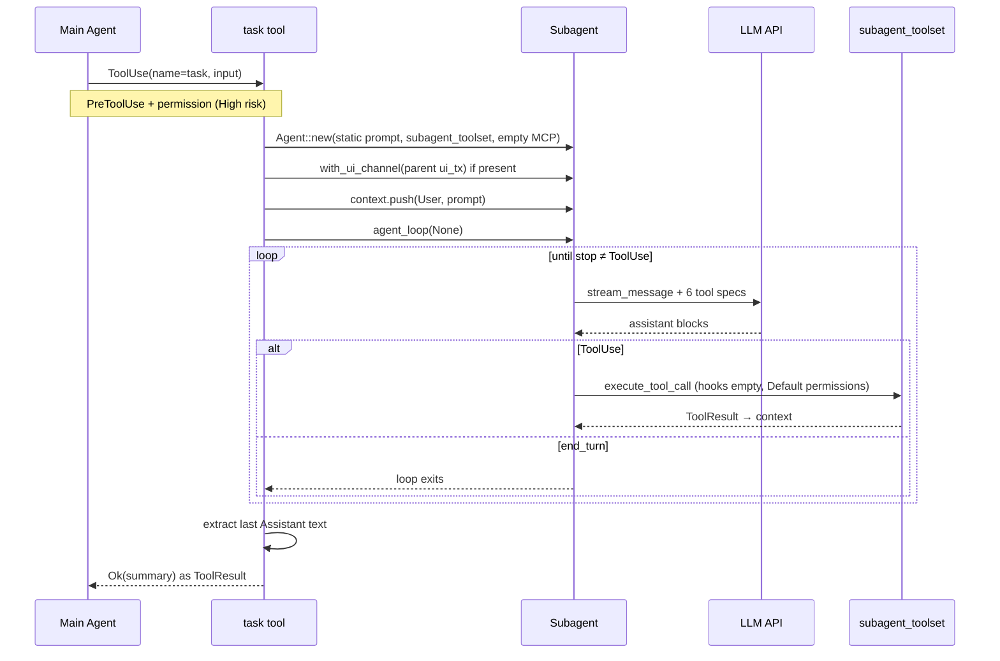

# 子 Agent（Subagents）

> 语言：[中文](./12_chapter_subagent_zh.md) · [English](./12_chapter_subagent.md)

本章说明 Tact 如何通过 `task` 工具 spawn **隔离的工作 agent**：全新对话循环、受限工具集、共享文件系统与 `ToolContext` 服务，但无父级历史、hook、MCP 工具或 SQLite 会话持久化。

实现：`crates/tact/src/tool/subagent.rs`。工具集装配：`subagent_toolset()` 在 `crates/tact/src/tool/registry.rs`。

勿与 [团队协调](./14_chapter_team_zh.md) 混淆 —— `spawn_teammate` 仅写入 roster/inbox 记录；`task` 实际运行嵌套的 `Agent::agent_loop`。

---

## 1. 子 Agent 是什么

| 属性 | 主 Agent | 子 Agent（`task` 工具） |
|------|----------|-------------------------|
| 入口 | TUI / headless `agent_loop` | 父级在工具执行期间调用 `task` |
| 对话历史 | 完整会话 context | 仅单条 user prompt（无父级消息） |
| System prompt | 动态 Tera 模板（skills、memory、CLAUDE.md） | 固定静态字符串 |
| Native 工具 | `toolset()`（约 40 个） | `subagent_toolset()`（6 个） |
| MCP 工具 | 自 config 加载 | **无**（`MCPToolRouter::new()`） |
| Hook | 父级已注册 hook | 空 hook 列表 |
| Session SQLite | 有（在 `tui.rs` 接线时） | **无** — `session_store` 保持 `None` |
| Permission manager | 父级模式 | 新 manager，始终 `PermissionMode::Default` |
| TUI 通道 | 父级 `ui_tx` | **继承** — 审批弹窗仍可用 |
| Cancel 标志 | 主 runtime 共享 | **独立** — 用户对父级 Cancel 不会停止进行中的子 agent |
| 返回父级 | N/A | 最后一条 assistant 文本块作为 tool result 字符串 |

子 agent 共享 `ToolContext`（克隆）：相同 `work_dir`，以及 background/cron/team/worktree/memory/skills 等 manager。这些服务在内存中存在，但多数不可达，因为暴露它们的工具未在子 agent router 上注册。

---

## 2. `task` 工具

```rust
#[derive(Debug, Deserialize, JsonSchema)]
pub struct SubagentInput {
    pub prompt: String,
    pub description: Option<String>,
}

#[tool(
    name = "task",
    description = "Spawn a subagent with fresh context. It shares the filesystem but not conversation history."
)]
pub async fn task(ctx: ToolContext, input: SubagentInput) -> Result<String>
```

| 字段 | 角色 |
|------|------|
| `prompt` | 成为子 agent 的唯一 user 消息 |
| `description` | 仅 schema 提示给模型；**handler 不读取** |

仅主 agent 的 `toolset()` 注册 `TaskTool`。子 agent 不能 spawn 嵌套子 agent —— `subagent_toolset()` 中无 `task`。

---

## 3. Spawn 生命周期



**阻塞语义：** `task` 为 `async` 并 await 完整子 agent 循环。从父级视角它是一个 tool call，内部可能运行多轮 LLM。父级 `agent_loop` 在 summary 字符串返回前暂停。

**消息播种：** handler 直接将 user 消息 push 到 `runtime.context`（非经 `push_message`），再调用 `agent_loop(None)`。因 context 已非空，循环不会注入第二份。无 `session_store` 时 nothing 写入 SQLite。

---

## 4. 受限工具集

`subagent_toolset()` 恰好注册六个工具：

| Tool | 用途 |
|------|------|
| `bash` | Shell 命令（受 `validate_shell_command` 约束） |
| `read_file` | 读工作区文件 |
| `write_file` | 创建或覆盖文件 |
| `edit_file` | 精确字符串替换（first 或 all） |
| `search_code` | Ripgrep 搜索 |
| `sleep` | 计时 / 轮询 |

与主 agent 相比 notable **省略**：

- 无 `task`、`load_skill`、`save_memory`、`compact`、web 工具、LSP、`apply_patch`、batch 工具
- 无 cron、team、worktree 或持久任务管理工具
- 无 MCP 前缀工具

`subagent_toolset()` 上方模块注释仍写「四个工具」——上文 `route()` 列表为准（单元测试 `subagent_toolset_includes_core_file_tools` 亦强制）。

---

## 5. System Prompt 与 Context

子 agent 使用 `AgentSystemPrompt::Static`：

```rust
let system_prompt = format!(
    "You are a coding subagent at {}. Complete the given task, then summarize your findings.",
    ctx.work_dir.display()
);
```

`build_system_prompt()` 每轮 verbatim 返回该字符串 —— 无 skill 摘要、memory 注入、CLAUDE.md 或目录快照。主 agent 差异见 [System Prompt](./04_chapter_prompt_zh.md)。

压缩与恢复 **仍** 在子 agent 循环内运行（[上下文压缩](./05_chapter_compact_zh.md)、[错误恢复](./06_chapter_recovery_zh.md)）：`micro_compact`、`compact_history`、transport 重试与 continuation 消息适用于子 agent 私有 `runtime.context`。

---

## 6. 权限与 UI

`task` 在 `PermissionManager::classify_risk` 中分类为 **High** 风险 —— Default 模式始终触发 Ask，即使 allowlist，因其将完整 shell 与文件系统访问委托给嵌套 agent。

子 agent 构造 **自己的** `PermissionManager::try_new(PermissionMode::Default)?`。不继承父级 Plan/Auto 模式或 allowlist。

若父级有 TUI 通道，子 agent 复用之：

```rust
if let Some(tx) = ctx.ui_tx {
    subagent = subagent.with_ui_channel(tx);
}
```

因此子 agent 的权限提示与流更新出现在同一终端会话。见 [权限模型](./10_chapter_permission_zh.md)。

---

## 7. 调度交互

在 `crates/tact/src/agent/tool_schedule.rs` 中，`task` 落入默认 `_ => ToolResources::barrier()` 分支。`task` 调用 never 与同一 wave 中任何其他工具并行 —— 见 [任务与工具调度](./11_chapter_task_zh.md)。

---

## 8. 返回值

`agent_loop` 完成后，handler 反向扫描 `runtime.context` 找最后一条 `Role::Assistant` 消息，经 `extract_text` 提取纯文本：

```rust
let summary = subagent
    .runtime
    .context
    .iter()
    .rev()
    .find(|message| matches!(message.role, Role::Assistant))
    .map(|message| extract_text(&message.content))
    .filter(|text| !text.is_empty())
    .unwrap_or_else(|| "(no summary)".to_string());
```

含义：

- Thinking 块与 tool-use 元数据被剥离；仅 text 块计数。
- 若模型在 tool-use 轮结束而无最终文本回复，父级可能收到 `(no summary)`。
- 中间 assistant 推理不返回 —— 仅最后 assistant 文本快照。

该字符串成为 `task` 工具的 JSON/text 结果，作为普通 `ToolResult` 追加到 **父级** context。

---

## 9. 子 Agent vs Teammate

| | `task`（子 agent） | `spawn_teammate`（team） |
|--|-------------------|-------------------------|
| 运行 LLM 循环 | 是，嵌套 `agent_loop` | 否 — 仅 roster 条目 |
| 隔离 | 全新 context，6 个工具 | N/A |
| 持久化 | 仅内存 | `.claude/team/` JSON |
| 用例 | 委托聚焦的编码工作 | 多 agent 协调协议 |

见 [团队协调](./14_chapter_team_zh.md)。

---

## 10. 代码地图

| 文件 | 角色 |
|------|------|
| `crates/tact/src/tool/subagent.rs` | `task` 工具 handler — spawn、循环、summary 提取 |
| `crates/tact/src/tool/mod.rs` | `TaskTool` 实现 |
| `crates/tact/src/tool/registry.rs` | `toolset()` 中的 `TaskTool`；`subagent_toolset()` |
| `crates/tact/src/agent/mod.rs` | `Agent::new`、`agent_loop`、`build_system_prompt`、`ensure_session` |
| `crates/tact/src/permission/mod.rs` | `task` → `CapabilityRisk::High` |
| `crates/tact/src/agent/tool_schedule.rs` | `task` 作为调度 barrier |
| `ARCHITECTURE.md` | 工具表中的一行摘要 |

---

## 11. 当前缺口

| 缺口 | 详情 |
|------|------|
| 无嵌套 `task` | 工具集设计如此，限制分解深度 |
| 子 agent 无 MCP | worker 内不可用外部工具 |
| 无父级 hook | PreToolUse / PostToolUse 策略不包裹子 agent 工具 |
| 仅静态 prompt | 无 skills/memory/CLAUDE.md，除非父级复制进 `prompt` |
| `description` 被忽略 | JSON 字段无运行时效果 |
| 独立 cancel 标志 | 父级 Cancel 可能无法中止长时间运行的子 agent |
| 无会话持久化 | 进程在 `task` 中途崩溃则子 agent 轮次丢失 |
| Summary 启发式 | 仅最后 assistant 文本；纯 tool 结尾返回 `(no summary)` |
| 模块注释过时 | `subagent_toolset` 文档写四个工具；实际注册六个 |
| 相同 LLM client | `get_llm_client()` — worker 无 model 覆盖 |

---

## Related Docs

- [工具系统](./07_chapter_tool_zh.md) — `toolset` vs `subagent_toolset`、`ToolContext`
- [任务与工具调度](./11_chapter_task_zh.md) — barrier 语义
- [权限模型](./10_chapter_permission_zh.md) — 高风险 `task`、继承 `ui_tx`
- [System Prompt](./04_chapter_prompt_zh.md) — 主 agent 动态 prompt
- [Skill Registry](./02_chapter_skill_zh.md) — 子 agent 不可用 `load_skill`
- [团队协调](./14_chapter_team_zh.md) — 仅 roster 的 teammate
- [ARCHITECTURE.md](../ARCHITECTURE.md) — 工作区工具表
