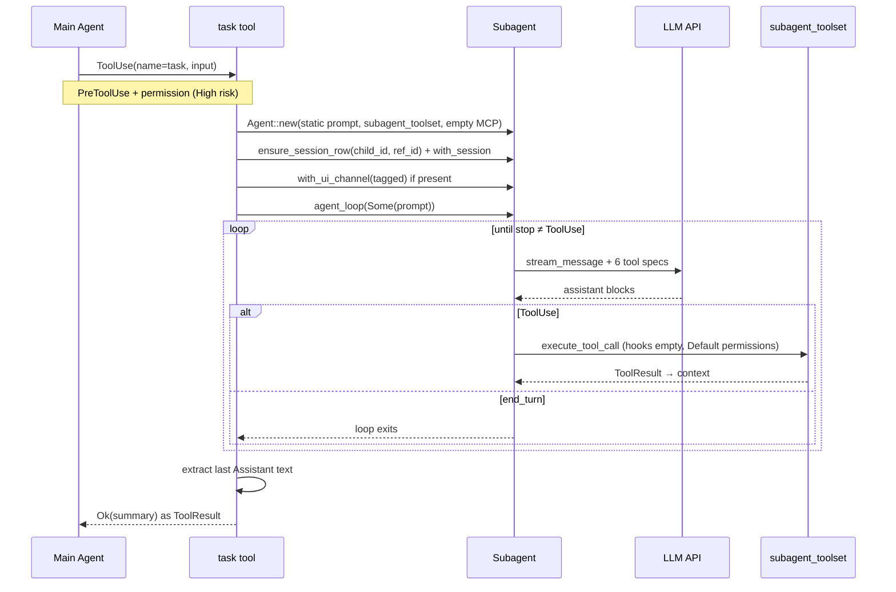
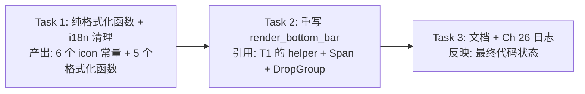
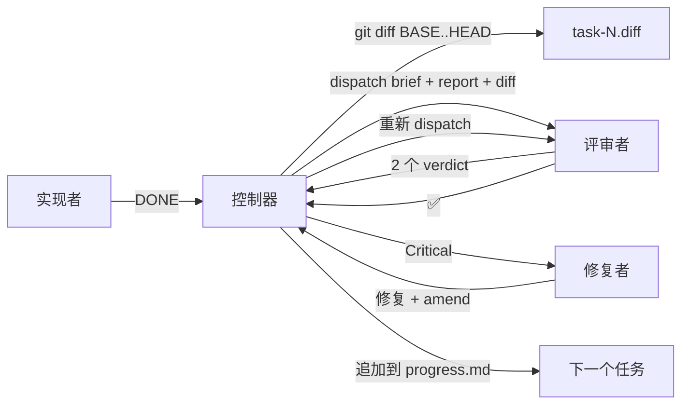

# 子 Agent（Subagents）

> 语言：[中文](./12_chapter_subagent_zh.md) · [English](./12_chapter_subagent.md)

本章说明 Tact 如何通过 `task` 工具 spawn **隔离的工作 agent**：全新对话循环、受限工具集、共享文件系统与 `ToolContext` 服务，但无父级历史、hook 或 MCP 工具。每个子 agent 有自己的 SQLite session 行，经 `sessions.ref_id` 挂到父会话。

实现：`crates/tact/src/tool/subagent.rs`。工具集装配：`subagent_toolset()` 在 `crates/tact/src/tool/registry.rs`。

勿与 [团队协调](./14_chapter_team_zh.md) 混淆 —— `spawn_teammate` 仅写入 roster/inbox 记录；`task` 实际运行嵌套的 `Agent::agent_loop`。

---

## 1. 子 Agent 是什么

| 属性 | 主 Agent | 子 Agent（`task` 工具） |
|------|----------|-------------------------|
| 入口 | TUI / headless `agent_loop` | 父级在工具执行期间调用 `task` |
| 对话历史 | 完整会话 context | 仅单条 user prompt（无父级消息） |
| System prompt | 动态 Tera 模板（skills、memory、CLAUDE.md） | 固定静态字符串 |
| Native 工具 | `toolset()`（约 40 个） | `subagent_toolset()`（6 个） |
| MCP 工具 | 自 config 加载 | **无**（`MCPToolRouter::new()`） |
| Hook | 父级已注册 hook | 空 hook 列表 |
| Session SQLite | 有（在 `tui.rs` 接线时） | **有** — 新建子 session；`sessions.ref_id` = 父 id（父无 session 时为 `''`） |
| Permission manager | 父级模式 | 新 manager，始终 `PermissionMode::Default` |
| TUI 通道 | 父级 `ui_tx` | **打标** — 流式/步骤进 Subagent sticky；`RequestSelect*` 透传 |
| Cancel 标志 | 主 runtime 共享 | **独立** — 用户对父级 Cancel 不会停止进行中的子 agent |
| 返回父级 | N/A | 最后一条 assistant 文本块作为 tool result 字符串 |

子 agent 共享 `ToolContext`（克隆）：相同 `work_dir`，以及 background/cron/team/worktree/memory/skills 等 manager。这些服务在内存中存在，但多数不可达，因为暴露它们的工具未在子 agent router 上注册。

---

## 2. `task` 工具

```rust
#[derive(Debug, Deserialize, JsonSchema)]
pub struct SubagentInput {
    pub prompt: String,
    pub description: Option<String>,
}

#[tool(
    name = "task",
    description = "Spawn a subagent with fresh context. It shares the filesystem but not conversation history."
)]
pub async fn task(ctx: ToolContext, input: SubagentInput) -> Result<String>
```

| 字段 | 角色 |
|------|------|
| `prompt` | 成为子 agent 的唯一 user 消息 |
| `description` | 仅 schema 提示给模型；**handler 不读取** |

仅主 agent 的 `toolset()` 注册 `TaskTool`。子 agent 不能 spawn 嵌套子 agent —— `subagent_toolset()` 中无 `task`。

---

## 3. Spawn 生命周期


```mermaid
sequenceDiagram
    participant Parent as Main Agent
    participant Task as task tool
    participant Sub as Subagent
    participant LLM as LLM API
    participant Tools as subagent_toolset

    Parent->>Task: ToolUse(name=task, input)
    Note over Parent,Task: PreToolUse + permission (High risk)
    Task->>Sub: Agent::new(static prompt, subagent_toolset, empty MCP)
    Task->>Sub: ensure_session_row(child_id, ref_id) + with_session
    Task->>Sub: with_ui_channel(tagged) if present
    Task->>Sub: agent_loop(Some(prompt))

    loop until stop ≠ ToolUse
        Sub->>LLM: stream_message + 6 tool specs
        LLM-->>Sub: assistant blocks
        alt ToolUse
            Sub->>Tools: execute_tool_call (hooks empty, Default permissions)
            Tools-->>Sub: ToolResult → context
        else end_turn
            Sub-->>Task: loop exits
        end
    end

    Task->>Task: extract last Assistant text
    Task-->>Parent: Ok(summary) as ToolResult
```

**阻塞语义：** `task` 为 `async` 并 await 完整子 agent 循环。从父级视角它是一个 tool call，内部可能运行多轮 LLM。父级 `agent_loop` 在 summary 字符串返回前暂停。

**消息播种：** handler 调用 `agent_loop(Some(user_prompt))`，经 `push_message` 写入并持久化到子 session。循环前 `task` 分配子 session id，将 `ref_id` 设为父 session id（或 `''`），并调用 `with_session`。UI 使用打标 `ui_tx`（`with_ui_channel` 同步 `tool_context.ui_tx`，使 `ToolProgress` 也被打标）。

---

## 4. 受限工具集

`subagent_toolset()` 恰好注册五个工具：

| Tool | 用途 |
|------|------|
| `bash` | Shell 命令（受 `validate_shell_command` 约束） |
| `read_file` | 读工作区文件 |
| `write_file` | 创建或覆盖文件 |
| `edit_file` | 精确字符串替换（first 或 all） |
| `sleep` | 计时 / 轮询 |

与主 agent 相比 notable **省略**：

- 无 `task`、`load_skill`、`save_memory`、`compact`、web 工具、LSP、`apply_patch`、batch 工具
- 无 cron、team、worktree 或持久任务管理工具
- 无 MCP 前缀工具

`subagent_toolset()` 上方模块注释仍写「四个工具」——上文 `route()` 列表为准（单元测试 `subagent_toolset_includes_core_file_tools` 亦强制）。

---

## 5. System Prompt 与 Context

子 agent 使用 `AgentSystemPrompt::Static`：

```rust
let system_prompt = format!(
    "You are a coding subagent at {}. Complete the given task, then summarize your findings.",
    ctx.work_dir.display()
);
```

`build_system_prompt()` 每轮 verbatim 返回该字符串 —— 无 skill 摘要、memory 注入、CLAUDE.md 或目录快照。主 agent 差异见 [System Prompt](./04_chapter_prompt_zh.md)。

压缩与恢复 **仍** 在子 agent 循环内运行（[上下文压缩](./05_chapter_compact_zh.md)、[错误恢复](./06_chapter_recovery_zh.md)）：`micro_compact`、`compact_history`、transport 重试与 continuation 消息适用于子 agent 私有 `runtime.context`。

---

## 6. 权限与 UI

`task` 在 `PermissionManager::classify_risk` 中分类为 **High** 风险 —— Default 模式始终触发 Ask，即使 allowlist，因其将完整 shell 与文件系统访问委托给嵌套 agent。

子 agent 构造 **自己的** `PermissionManager::try_new(PermissionMode::Default)?`。不继承父级 Plan/Auto 模式或 allowlist。

若父级有 TUI 通道，子 agent 使用**打标**通道（`tagged_ui_channel`）：流式、步骤、思考与 token 用量变为 `AgentUpdate::Subagent`，渲染在 sticky 的 **Subagent** tab。`RequestSelect` / `RequestMultiSelect` 仍透传，权限弹窗走主 TUI。见 [权限模型](./10_chapter_permission_zh.md) 与 [TUI](./23_chapter_tui_zh.md)。

---

## 7. 调度交互

在 `crates/tact/src/agent/tool_schedule.rs` 中，`task` 落入默认 `_ => ToolResources::barrier()` 分支。`task` 调用 never 与同一 wave 中任何其他工具并行 —— 见 [任务与工具调度](./11_chapter_task_zh.md)。

---

## 8. 返回值

`agent_loop` 完成后，handler 反向扫描 `runtime.context` 找最后一条 `Role::Assistant` 消息，经 `extract_text` 提取纯文本：

```rust
let summary = subagent
    .runtime
    .context
    .iter()
    .rev()
    .find(|message| matches!(message.role, Role::Assistant))
    .map(|message| extract_text(&message.content))
    .filter(|text| !text.is_empty())
    .unwrap_or_else(|| "(no summary)".to_string());
```

含义：

- Thinking 块与 tool-use 元数据被剥离；仅 text 块计数。
- 若模型在 tool-use 轮结束而无最终文本回复，父级可能收到 `(no summary)`。
- 中间 assistant 推理不返回 —— 仅最后 assistant 文本快照。

该字符串成为 `task` 工具的 JSON/text 结果，作为普通 `ToolResult` 追加到 **父级** context。

---

## 9. 子 Agent vs Teammate

| | `task`（子 agent） | `spawn_teammate`（team） |
|--|-------------------|-------------------------|
| 运行 LLM 循环 | 是，嵌套 `agent_loop` | 否 — 仅 roster 条目 |
| 隔离 | 全新 context，6 个工具 | N/A |
| 持久化 | 独立 SQLite session（`ref_id`→父） | `.tact/team/` JSON |
| 用例 | 委托聚焦的编码工作 | 多 agent 协调协议 |

见 [团队协调](./14_chapter_team_zh.md)。

---

## 10. 代码地图

| 文件 | 角色 |
|------|------|
| `crates/tact/src/tool/subagent.rs` | `task` 工具 handler — spawn、循环、summary 提取 |
| `crates/tact/src/tool/mod.rs` | `TaskTool` 实现 |
| `crates/tact/src/tool/registry.rs` | `toolset()` 中的 `TaskTool`；`subagent_toolset()` |
| `crates/tact/src/agent/mod.rs` | `Agent::new`、`agent_loop`、`build_system_prompt`、`ensure_session` |
| `crates/tact/src/permission/mod.rs` | `task` → `CapabilityRisk::High` |
| `crates/tact/src/agent/tool_schedule.rs` | `task` 作为调度 barrier |
| `ARCHITECTURE.md` | 工具表中的一行摘要 |

---

## 11. 当前缺口

| 缺口 | 详情 |
|------|------|
| 无嵌套 `task` | 工具集设计如此，限制分解深度 |
| 子 agent 无 MCP | worker 内不可用外部工具 |
| 无父级 hook | PreToolUse / PostToolUse 策略不包裹子 agent 工具 |
| 仅静态 prompt | 无 skills/memory/CLAUDE.md，除非父级复制进 `prompt` |
| `description` 被忽略 | JSON 字段无运行时效果 |
| 独立 cancel 标志 | 父级 Cancel 可能无法中止长时间运行的子 agent |
| 列表隐藏子会话 | `--list-sessions` / resume 只显示 `ref_id = ''`；删父会级联删子 |
| Summary 启发式 | 仅最后 assistant 文本；纯 tool 结尾返回 `(no summary)` |
| 模块注释过时 | `subagent_toolset` 文档写四个工具；实际注册五个 |
| 相同 LLM client | `get_llm_client()` — worker 无 model 覆盖 |

---

## 12. 实战案例：底部栏视觉优化

`feat/web` 分支上的 3 任务 SDD 会话。计划：`docs/superpowers/plans/2026-07-24-bottom-bar-polish.md`。
数据：6 个子代理（3 实现 + 2 评审 + 1 修复），400 测试，5 个 commit 推送。

### 12.1 任务依赖——为什么串行


```mermaid
flowchart LR
    T1["Task 1: 纯格式化函数 + i18n 清理<br/>产出: 6 个 icon 常量 + 5 个格式化函数"] --> T2
    T2["Task 2: 重写 render_bottom_bar<br/>引用: T1 的 helper + Span + DropGroup"] --> T3
    T3["Task 3: 文档 + Ch 26 日志<br/>反映: 最终代码状态"]
```

三个任务都改 `crates/tui/src/render/bar.rs`。SDD 禁止对共享文件并行 dispatch——控制器层面强制。

### 12.2 文件传递（不走会话历史）

```
.superworks/sdd/
├── progress.md                          # 进度锚点（compaction 后存活）
├── task-1-brief.md                      # 从计划提取的需求
├── task-1-report.md                     # 实现者产出
├── review-task-1.diff                   # 评审用 git diff
├── review-task-1-v2.diff                # 修复后重新评审
├── task-2-brief.md / task-2-report.md   # 同样模式
├── ...
└── final-review.diff                    # 全局评审用完整分支 diff
```

每个 dispatch prompt 只有 5 行——brief 文件是**唯一的需求来源**：

```
┌── dispatch ─────────────────────────────────────────────────┐
│ 实现 Task 1。                                               │
│ 先读这个文件: .superworks/sdd/task-1-brief.md               │
│ 工作目录: /Users/rg/Projects/tact, 分支 feat/web            │
│ 验证: cargo check -p tact-tui; 然后 cargo test -p tact-ui   │
│ 报告写入: .superworks/sdd/task-1-report.md                  │
└─────────────────────────────────────────────────────────────┘
```

**brief 文件里直接包含要写的代码**——不是文字描述。实现者照抄、写测试、commit。没有上下文继承，没有历史污染：

```
.superworks/sdd/task-1-brief.md（缩略）
├── Part A: i18n.rs — 从 struct + 中英文构造器删除 7 个字段
├── Part B: bar.rs — 添加 6 个 icon 常量
├── Part C: bar.rs — 添加 5 个纯格式化函数（代码块已提供）
├── Part D: bar.rs — 添加 10 个单元测试（代码块已提供）
└── Commit: "feat(tui): add bottom-bar pure formatters ..."
```

**report 文件记录实际发生了什么**——子代理退出后控制器读取：

```
.superworks/sdd/task-1-report.md（缩略）
├── Status: DONE
├── Commits: 3a8a186
├── 测试结果: cargo check 失败（预期——T2 会修复 bar.rs）
├── 变更: Part A 完成, Part B 完成, Part C 完成, Part D 完成
└── 注意事项: WindowEntry 不存在 → 改用 UsageQuotaWindow
```

如果不走文件传递，每个子代理的代码和报告都会永久膨胀控制器的上下文。用文件传递，控制器只读 SHA 和状态行——其余的都存在磁盘上。

### 12.3 评审循环——每任务一个门禁


```mermaid
flowchart LR
    I["实现者"] -->|DONE| C["控制器"]
    C -->|"git diff BASE..HEAD"| D["task-N.diff"]
    C -->|"dispatch brief + report + diff"| R["评审者"]
    R -->|"2 个 verdict"| C
    C -->|"Critical"| F["修复者"]
    F -->|"修复 + amend"| C
    C -->|"重新 dispatch"| R
    R -->|"✅"| C
    C -->|"追加到 progress.md"| N["下一个任务"]
```

每个评审者产出两个 verdict，每个二值：

| Verdict | 通过条件 | 不通过 → |
|---------|---------|----------|
| **Spec compliance** | brief 所有要求满足。无多余功能 (YAGNI)。 | 修复者 dispatch |
| **Task quality** | 测试覆盖边界。非测试代码无 unwrap。无死 import。 | 修复者 dispatch |

**Severity 决定处理方式：**

| 等级 | 含义 | 行动 |
|------|------|------|
| Critical | 阻止正确性，逻辑 bug | 必须修复，必须重新评审 |
| Important | 可维护性风险，测试缺口 | 建议修复 |
| Minor | 风格、命名 | 记录在 ledger，终审时处理 |

### 12.4 Task 1 评审发现（Critical）

```
format_quota_window_with_pct  期望值 "75%"
                              实际值   "25%"
usage_pct() = (limit - remaining) / limit * 100
            = (200 - 150) / 200 * 100
            = 25    ← 不是 75
```

Brief 指定了不存在的 `WindowEntry`。实现者正确适配到 `UsageQuotaWindow`，但复制了 brief 里错误的期望值。修复：1 行测试改动，`git commit --amend`，重新评审通过。

如果没有这个门禁：测试在第一次 CI 运行失败 → 开发者标注 flaky → 永远不被发现。

### 12.5 计划-现实适配

Plan 引用了 `FocusedPanel::Plan` 和 `focus_plan` / `bottom_focus_log_plan` 等 i18n 字段。实际代码没有 `Plan` 变体——之前的重构已删除。

```mermaid
flowchart LR
    P["Plan 文档: FocusedPanel::Plan 存在"] -->|过时| A
    C["仓库: 只有 FocusedPanel::Log, plan.rs 已删除"] -->|现实| A
    A["实现者适配: FocusedPanel::Log => \"[Log]\""]
    A --> R["评审者: ✅ 适配正确"]
```

实现者不是机械代码生成器——他们阅读真实代码库，检测偏差，适配。控制器判断适配是否可接受。

### 12.6 全局评审——分支级门禁

全分支 diff（`git merge-base main HEAD`..`HEAD`）：**5455 行，37 个文件**。

| 发现 | 等级 | 行动 |
|------|------|------|
| `expect()` 锁——poison 时会 panic | Important | 暂缓 |
| `display_width()` 用 `chars().count()` 不是 Unicode 宽度 | Important | 暂缓 |
| Row 1 丢弃顺序是 path→uptime，规格要求 uptime→path | Important | **立即修复** |

结论：**Ready to merge**。drop-order 修复最可行；其余两个风险较低。

### 12.7 关键经验

| # | 经验 | 证据 |
|---|------|------|
| 1 | 串行是必须的——同 crate 依赖阻止并行 | 3 个任务都改 `bar.rs` |
| 2 | Brief 文件是唯一来源——不是 prompt 文本 | Dispatch 5 行；brief 200 行代码 |
| 3 | 评审门禁抓到 CI 抓不到的 Critical bug | 75%→25% 测试会到达生产环境 |
| 4 | BASE commit 必须是任务前的 SHA，不是 `HEAD~1` | 多 commit 任务会被截断 |
| 5 | `.superworks/sdd/progress.md` 在 compaction 后存活 | compaction 后: `cat progress.md` + `git log` → 继续 |

---

## Related Docs

- [工具系统](./07_chapter_tool_zh.md) — `toolset` vs `subagent_toolset`、`ToolContext`
- [任务与工具调度](./11_chapter_task_zh.md) — barrier 语义
- [权限模型](./10_chapter_permission_zh.md) — 高风险 `task`、继承 `ui_tx`
- [System Prompt](./04_chapter_prompt_zh.md) — 主 agent 动态 prompt
- [Skill Registry](./02_chapter_skill_zh.md) — 子 agent 不可用 `load_skill`
- [团队协调](./14_chapter_team_zh.md) — 仅 roster 的 teammate
- [ARCHITECTURE.md](../ARCHITECTURE.md) — 工作区工具表
