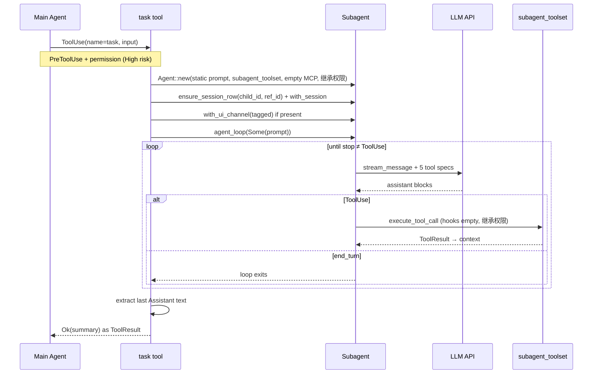
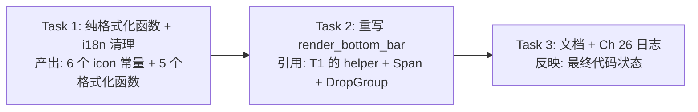
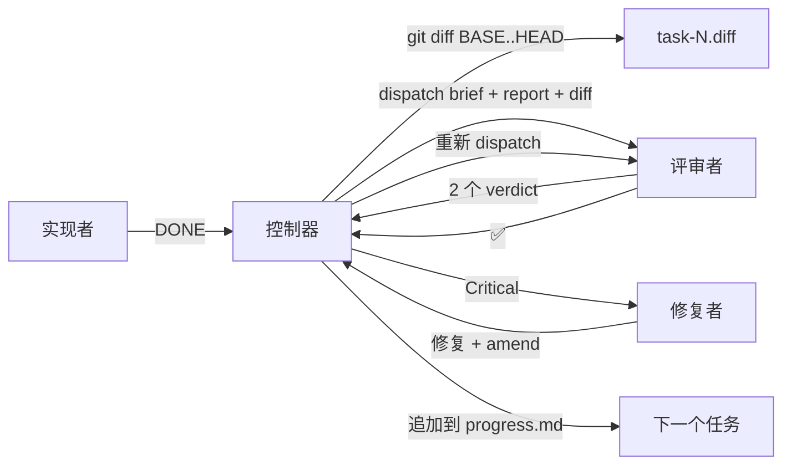

# 子 Agent（Subagents）

> 语言：[中文](./12_chapter_subagent_zh.md) · [English](./12_chapter_subagent.md)

本章说明 Tact 如何通过 `spawn_subagent` 工具 spawn **隔离的工作 agent**：全新对话循环、受限工具集、`ToolContext` 服务，以及——除非 `worktree: true` 请求隔离的 git 泳道——共享文件系统，但无父级历史、hook 或 MCP 工具。每个子 agent 有自己的 SQLite session 行，经 `sessions.ref_id` 挂到父会话。

实现：`crates/tact/src/tool/subagent.rs`。工具集装配：`subagent_toolset()` 在 `crates/tact/src/tool/registry.rs`。

勿与 [团队协调](./14_chapter_team_zh.md) 混淆 —— `spawn_teammate` 仅写入 roster/inbox 记录；`spawn_subagent` 实际运行嵌套的 `Agent::agent_loop`。

---

## 1. 子 Agent 是什么

| 属性 | 主 Agent | 子 Agent（`spawn_subagent` 工具） |
|------|----------|-------------------------|
| 入口 | TUI / headless `agent_loop` | 父级在工具执行期间调用 `spawn_subagent` |
| 对话历史 | 完整会话 context | 仅单条 user prompt（无父级消息） |
| System prompt | 动态 Tera 模板（skills、memory、CLAUDE.md） | 固定静态字符串 |
| Native 工具 | `toolset()`（约 40 个） | `subagent_toolset()`（5 个） |
| MCP 工具 | 自 config 加载 | **无**（`MCPToolRouter::new()`） |
| Hook | 父级已注册 hook | 空 hook 列表 |
| Session SQLite | 有（在 `tui.rs` 接线时） | **有** — 新建子 session；`sessions.ref_id` = 父 id（父无 session 时为 `''`） |
| Permission manager | 父级模式 | **继承** — 从父级实时快照克隆（mode + always-allowed 列表 + settings），经 `PermissionManager::from_snapshot` |
| TUI 通道 | 父级 `ui_tx` | **打标** — 流式/步骤以 `ToolProgress`（卡头为 `ToolMeta`）转发进父工具卡；`RequestSelect*` 透传（加 `[Subagent]` 前缀） |
| Cancel 标志 | 主 runtime 共享 | **独立** — 用户对父级 Cancel 不会停止进行中的子 agent |
| 返回父级 | N/A | 同步：最后一条 assistant 文本；异步（`run_in_background`）：`async_launched { id }` + 回注的 `<subagent-finished>` |

子 agent 共享 `ToolContext`（克隆）：相同 `work_dir`，以及 background/team/worktree/memory/skills 等 manager。这些服务在内存中存在，但多数不可达，因为暴露它们的工具未在子 agent router 上注册。

---

## 2. `spawn_subagent` 工具

```rust
#[derive(Debug, Deserialize, JsonSchema)]
pub struct SubagentInput {
    pub prompt: String,
    pub description: Option<String>,
    pub run_in_background: Option<bool>,
    pub max_turns: Option<u32>,
    pub resume: Option<String>,
    pub worktree: Option<bool>,
    pub agent: Option<String>,
}
```

| 字段 | 角色 |
|------|------|
| `prompt` | 成为子 agent 的唯一 user 消息（任务） |
| `description` | 仅 schema 提示给模型；**handler 不读取** |
| `run_in_background` | `true` 立即返回 `async_launched { id }`；子 agent 脱钩运行，稍后回注 summary。需要交互式 UI 通道 —— 在 headless 模式（没有 driver 提交唤醒轮）下退化为同步并直接返回 summary。 |
| `max_turns` | 上限嵌套 `agent_loop` 轮数（防止失控） |
| `resume` | 复用已有子 session id（来自先前 `async_launched`）追加一轮。handler 校验目标：必须已有一条处于终态的 `subagent_runs` 记录 —— 复用未知 id 或仍 `Running` 的子 agent 会被拒绝。 |
| `worktree` | `true` 让子 agent 运行在隔离的 git worktree 泳道（`subagent-<child_id>`，分支 `wt/subagent-<child_id>`）；要求 `work_dir` 是 git 仓库。`resume` 时复用已有泳道。泳道在 handler 内同步创建（失败立即暴露），完成后保留供 `worktree_status` / `worktree_run` 检查；用 `worktree_remove { name }` 清理（拒绝运行中子 agent 的泳道与脏工作树）。 |
| `agent` | 按名运行**声明式 agent 定义**——已安装插件 `agents/*.md` 用 `plugin:<name>`，`.tact/agents/*.md` 本地定义可用唯一原名。定义正文成为 system prompt；其 `tools` / `model` / `permissionMode` frontmatter 生效（见 §2.1）。 |

仅主 agent 的 `toolset()` 注册子 agent 工具（`SpawnSubagentTool`、`CheckSubagentTool`、`WaitSubagentTool`、`CancelSubagentTool`）。子 agent 不能 spawn 嵌套子 agent —— `subagent_toolset()` 中无 `spawn_subagent`。

---

## 2.1 声明式 agent 定义

Tact 从两个根加载可复用子代理定义（同名后者覆盖）：

- `<workdir>/.tact/agents/*.md` —— 项目本地，原名（`architect`）；
- 已安装插件 `<cache>/agents/*.md` —— 命名空间 `plugin:<name>`（例如 `claude-security:code-reviewer`）。

Frontmatter（Claude Code 兼容）：

```markdown
---
name: reviewer
description: Reviews code with an adversarial lens
tools: Read, Glob, Grep, Bash
model: sonnet
permissionMode: plan
---

You are a principal reviewer. …
```

- `tools` 限制子代理工具集（Claude 名映射到 Tact 工具：Read/Glob/Grep → `read_file`、Bash → `bash`、Edit → `edit_file`、Write → `write_file`、Sleep → `sleep`；未知名忽略；空集保持默认五件套）。
- `model` 覆盖子代理模型（叠加在 `[agent.subagent]` 配置之上）。
- `permissionMode` 覆盖继承的权限模式，除非父级为 `Auto`（Auto 保持粘性）。

注册表：`crates/tact/src/agent_def.rs`（`AgentDefinitionRegistry`，共享于 `ToolContext.agent_registry`）。`spawn_subagent` 引用未知 `agent` 名时报错并列出可用定义。

---

## 3. Spawn 生命周期


```mermaid
sequenceDiagram
    participant Parent as Main Agent
    participant Task as task tool
    participant Sub as Subagent
    participant LLM as LLM API
    participant Tools as subagent_toolset

    Parent->>Task: ToolUse(name=task, input)
    Note over Parent,Task: PreToolUse + permission (High risk)
    Task->>Sub: Agent::new(static prompt, subagent_toolset, empty MCP, 继承权限)
    Task->>Sub: ensure_session_row(child_id, ref_id) + with_session
    Task->>Sub: with_ui_channel(tagged) if present
    Task->>Sub: agent_loop(Some(prompt))

    loop until stop ≠ ToolUse
        Sub->>LLM: stream_message + 5 tool specs
        LLM-->>Sub: assistant blocks
        alt ToolUse
            Sub->>Tools: execute_tool_call (hooks empty, 继承权限)
            Tools-->>Sub: ToolResult → context
        else end_turn
            Sub-->>Task: loop exits
        end
    end

    Task->>Task: extract last Assistant text
    Task-->>Parent: Ok(summary) as ToolResult
```

**阻塞语义（同步）：** `spawn_subagent` 为 `async` 并 await 完整子 agent 循环。从父级视角它是一个 tool call，内部可能运行多轮 LLM。父级 `agent_loop` 在 summary 字符串返回前暂停。

**异步语义（`run_in_background: true`）：** handler 立即返回 `async_launched { id }`；嵌套循环运行在脱钩的 `tokio::spawn` 任务中。完成后该任务 (a) 将 `subagent_runs` 行转为 `Completed`/`Failed`/`Cancelled`，(b) 将 `SubagentResult` 入队父级 `pending_subagent_results`，(c) 在**父级** `ui_tx` 上发 `AgentUpdate::SubagentFinished`。父级下一轮 `agent_loop` drain 队列，经 `push_message`（持久化）注入合成 `<subagent-finished id=…>` user 消息。若父级空闲，TUI 将 `UserCommand::SubagentFinishedNotification` 转发给 driver，driver 提交一个轻量唤醒轮；若一轮仍在进行，driver 会**保留**该唤醒，并在那一轮的 `JoinHandle` 完成后立即提交，从而避免通知落在「最后一次队列 drain 与轮次退出之间」而被丢弃。被取消的子代理即便在标志置位后干净退出，也按 `success = false` 上报。

**消息播种：** handler 调用 `agent_loop(Some(user_prompt))`，经 `push_message` 写入并持久化到子 session。循环前 `spawn_subagent` 分配子 session id（或复用 `resume`），将 `ref_id` 设为父 session id（或 `''`），并调用 `with_session`。UI 使用打标 `ui_tx`（`with_ui_channel` 同步 `tool_context.ui_tx`，使 `ToolProgress` 也被打标）。

---

## 4. 受限工具集

`subagent_toolset()` 恰好注册五个工具：

| Tool | 用途 |
|------|------|
| `bash` | Shell 命令（受 `validate_shell_command` 约束） |
| `read_file` | 读工作区文件 |
| `write_file` | 创建或覆盖文件 |
| `edit_file` | 精确字符串替换（first 或 all） |
| `sleep` | 计时 / 轮询 |

与主 agent 相比 notable **省略**：

- 无 `spawn_subagent`、`load_skill`、`save_memory`、`compact`、web 工具、LSP、`apply_patch`、batch 工具
- 无 team、worktree 或持久任务管理工具
- 无 MCP 前缀工具

`subagent_toolset()` 上方模块注释仍写「四个工具」——上文 `route()` 列表为准（单元测试 `subagent_toolset_has_five_tools` 亦强制）。

---

## 5. System Prompt 与 Context

子 agent 使用 `AgentSystemPrompt::Static`：

```rust
let system_prompt = format!(
    "You are a coding subagent at {}. Complete the given task, then summarize your findings.",
    ctx.work_dir.display()
);
```

`build_system_prompt()` 每轮 verbatim 返回该字符串 —— 无 skill 摘要、memory 注入、CLAUDE.md 或目录快照。主 agent 差异见 [System Prompt](./04_chapter_prompt_zh.md)。

压缩与恢复 **仍** 在子 agent 循环内运行（[上下文压缩](./05_chapter_compact_zh.md)、[错误恢复](./06_chapter_recovery_zh.md)）：`micro_compact`、`compact_history`、transport 重试与 continuation 消息适用于子 agent 私有 `runtime.context`。

---

## 6. 权限与 UI

`spawn_subagent` 在 `PermissionManager::classify_risk` 中分类为 **High** 风险 —— Default 模式始终触发 Ask，即使 allowlist，因其将完整 shell 与文件系统访问委托给嵌套 agent。

**权限继承（Claude 风格）：** `execute_tool_call` 在 wave 运行前将 `PermissionSnapshot`（mode + 会话内 always-allowed 列表 + 已加载 settings）stamp 到 `ToolContext` 上，`spawn_subagent` 用 `PermissionManager::from_snapshot(...)` 构建子级 manager。父级 `Default` → 子 `Default`，`Plan` → 子 `Plan`（只读），`Auto` → 子 `Auto`（sticky）。子级 `consecutive_denials` 计数归零。无父 agent 的 orphan/test context 回退到旧行为：`PermissionMode::Default` + 从磁盘加载 settings。这也修复了只读逃逸：`Plan` 父级不再能 spawn 一个可写文件的 `Default` 子级。

若父级有 TUI 通道，子 agent 使用**打标**通道（`tagged_ui_channel_with_progress`）：流式、步骤、思考与工具结果以 `AgentUpdate::ToolProgress`（卡头为 `ToolMeta`）转发进父工具卡，该卡在 Log 历史中渲染为 `ToolVisualKind::Subagent`。点击该卡打开 `SubagentPopup`（`ToolPopupKind::SubagentTranscript`）。`RequestSelect` / `RequestMultiSelect` 仍透传（加 `[Subagent]` 前缀），权限弹窗走主 TUI；并发子 agent 权限请求排队，逐个处理。见 [权限模型](./10_chapter_permission_zh.md) 与 [TUI](./23_chapter_tui_zh.md)。

---

## 7. 调度交互

在 `crates/tact/src/agent/tool_schedule.rs` 中，`spawn_subagent` 声明 `ResourcePolicy::Barrier`。普通的（共享文件系统）`spawn_subagent` 调用绝不与同一 wave 中任何其他工具并行 —— 见 [任务与工具调度](./11_chapter_task_zh.md)。该场景的后台并行来自 `tokio::spawn`（`run_in_background`），而非放宽 wave 调度。

**worktree 隔离的 spawn 是例外。** `execute_tool_call` 按调用解析资源（`crates/tact/src/agent/tool_dispatch.rs` 的 `tool_resources_for`）：`worktree: true` 的 `spawn_subagent` 映射为 `ToolResources::independent()` —— 其文件影响被限定在泳道内，因此可与同一 wave 中其他工具（包括其他隔离子 agent）并行 fan-out，而不会与主树竞争。这正是 2026-08-26 异步子 agent 设计评审中的 "worktree follow-up"：一旦每个子 agent 拥有作用域化文件系统，阻塞型子 agent 的同一 wave fan-out 就安全了。注意：worktree 是**组织边界**，**不是** OS 沙箱 —— 子 agent 的 `bash` 仍可访问泳道之外；隔离只是防止*常规*路径冲突编辑互相碰撞。

泳道创建在 handler 内同步执行（在同步循环前，或在返回 `async_launched { id }` 前），因此非 git 的 `work_dir` 会让 spawn 明确报错，而不是静默共享文件系统。泳道基于仓库根 `HEAD`，子 agent 完成后保留；可用 `git worktree remove <path>` 手动删除（尚无工具入口）。

## 8. 持久化与生命周期

同步与异步子 agent 均将其运行持久化到 `subagent_runs` 表（`child_id`、`status`、`summary`、`started_at`、`finished_at`），以子 session id 为主键 —— 是 `background_tasks` 的子 agent 对应物。`spawn_subagent` 在入口记录 `Running`，并在**两条路径**（同步/异步）退出时记录 `Completed`/`Failed`/`Cancelled`，因此 `check_subagent` / `cancel_subagent` / `wait_subagent` 能统一看到每个子 agent（同步子 agent 也可通过 `/subagent_cancel` 或父级退出来取消，且同步失败不再遗留陈旧的 `Running` 行）。`SubagentManager::new` 在启动时修复 orphan（任何 `running` 行 → `failed`，带 `"Process interrupted (agent restarted)"`）。`check_subagent` 工具读取此状态，`wait_subagent { child_id, timeout_ms? }` 则阻塞（轮询 `subagent_runs`）直到子 agent 到达终态或超时 —— 即 Codex `wait_agent` 的对应物，让父级可先 spawn N 个子 agent 再逐个 wait，而不必跨多轮轮询 `check_subagent`。内存 `pending_subagent_results` 队列是实时快路径；持久化行是崩溃恢复的 source of truth。重启后 finished 结果**不会**自动重投 —— 注入的 `<subagent-finished>` 消息已在 transcript 中，模型自行决定 `resume` 或重新 spawn。

---

## 9. 返回值

`agent_loop` 完成后，handler 反向扫描 `runtime.context` 找最后一条 `Role::Assistant` 消息，经 `extract_text` 提取纯文本：

```rust
let summary = subagent
    .runtime
    .context
    .iter()
    .rev()
    .find(|message| matches!(message.role, Role::Assistant))
    .map(|message| extract_text(&message.content))
    .filter(|text| !text.is_empty())
    .unwrap_or_else(|| "(no summary)".to_string());
```

含义：

- Thinking 块与 tool-use 元数据被剥离；仅 text 块计数。
- 若模型在 tool-use 轮结束而无最终文本回复，父级可能收到 `(no summary)`。
- 中间 assistant 推理不返回 —— 仅最后 assistant 文本快照。

该字符串成为 `spawn_subagent` 工具的 JSON/text 结果，作为普通 `ToolResult` 追加到 **父级** context。

---

## 10. 子 Agent vs Teammate

| | `spawn_subagent`（子 agent） | `spawn_teammate`（team） |
|--|-------------------|-------------------------|
| 运行 LLM 循环 | 是，嵌套 `agent_loop` | 否 — 仅 roster 条目 |
| 隔离 | 全新 context，5 个工具 | N/A |
| 持久化 | 独立 SQLite session（`ref_id`→父） | `.tact/team/` JSON |
| 用例 | 委托聚焦的编码工作 | 多 agent 协调协议 |

见 [团队协调](./14_chapter_team_zh.md)。

---

## 11. 代码地图

| 文件 | 角色 |
|------|------|
| `crates/tact/src/tool/subagent.rs` | `spawn_subagent` + `check_subagent` + `wait_subagent` + `cancel_subagent` handler — spawn、同步/异步循环、summary 提取、resume、max_turns |
| `crates/tact/src/tool/mod.rs` | `SpawnSubagentTool` / `CheckSubagentTool` 实现；`ToolContext` 上的 `permission_snapshot` + `subagent_results` + `subagent_manager` |
| `crates/tact/src/tool/registry.rs` | `toolset()` 中的 `SpawnSubagentTool` + `CheckSubagentTool`；`subagent_toolset()` |
| `crates/tact/src/agent/mod.rs` | `Agent::new`、`agent_loop`（drain + max_turns）、`ensure_session`、`pending_subagent_results` |
| `crates/tact/src/agent/tool_dispatch.rs` | stamp `permission_snapshot` + `subagent_results`；输入感知 `keep_live` |
| `crates/tact/src/permission/mod.rs` | `PermissionSnapshot`、`snapshot()`/`from_snapshot()` |
| `crates/tact/src/subagent.rs` | `SubagentManager` / `SubagentRun` / `SubagentStatus`（orphan repair） |
| `crates/tact/src/store/subagent_store/` | `subagent_runs` SQLite 表 + trait |
| `crates/protocol/src/agent.rs` | `AgentUpdate::SubagentFinished`、`UserCommand::SubagentFinishedNotification` |
| `crates/tact-ui/src/driver.rs` | `SubagentFinishedNotification` 的唤醒轮（一轮进行中时保留） |
| `crates/tact/src/agent/tool_schedule.rs` | `spawn_subagent` 作为调度 barrier |
| `ARCHITECTURE.md` | 工具表中的一行摘要 |

---

## 12. 当前缺口

| 缺口 | 详情 |
|------|------|
| 无嵌套 `spawn_subagent` | 工具集设计如此，限制分解深度 |
| 子 agent 无 MCP | worker 内不可用外部工具 |
| 无父级 hook | PreToolUse / PostToolUse 策略不包裹子 agent 工具 |
| 仅静态 prompt | 无 skills/memory/CLAUDE.md，除非父级复制进 `prompt` |
| `description` 被忽略 | JSON 字段无运行时效果 |
| 独立 cancel 标志 | 父级 `/cancel` 只中止主任务。**运行中的后台子代理**通过 `cancel_subagent`（工具）、`/subagent_cancel <child-id>`（slash 命令）或运行中子代理工具卡片上的 `[Cancel]` 按钮取消——三者都经由共享 `SubagentManager` 的 cancel handles 翻转子代理的协作取消标志。当父级退出（TUI 退出 / driver 循环结束）时，`cancel_all()` 翻转所有存活 handle，后台子代理一起停止而非成为孤儿。（headless 在退出时永远没有存活的后台子代理：那里 `run_in_background` 已退化为同步。） |
| 无 worktree 删除 | 隔离泳道现在可通过 `worktree_remove { name }` 清理（执行 `git worktree remove`、删除跟踪记录、拒绝运行中子 agent 的泳道与脏工作树）。保留 backing 分支 `wt/<name>` 以便未合并提交可恢复 |
| worktree 基准为仓库 HEAD | 从另一 worktree 内 spawn 的子 agent 仍基于主仓库 HEAD 分支，而非父泳道 |
| 列表隐藏子会话 | `--list-sessions` / resume 只显示 `ref_id = ''`；删父会级联删子 |
| Summary 启发式 | 仅最后 assistant 文本；纯 tool 结尾返回 `(no summary)` |
| 相同 LLM client | `get_llm_client()` — worker 无 model 覆盖（`subagent` 配置块与声明式 `model` frontmatter 除外） |

---

## 13. 实战案例：底部栏视觉优化

`feat/web` 分支上的 3 任务 SDD 会话。计划：`docs/superpowers/plans/2026-07-24-bottom-bar-polish.md`。
数据：6 个子代理（3 实现 + 2 评审 + 1 修复），400 测试，5 个 commit 推送。

### 13.1 任务依赖——为什么串行


```mermaid
flowchart LR
    T1["Task 1: 纯格式化函数 + i18n 清理<br/>产出: 6 个 icon 常量 + 5 个格式化函数"] --> T2
    T2["Task 2: 重写 render_bottom_bar<br/>引用: T1 的 helper + Span + DropGroup"] --> T3
    T3["Task 3: 文档 + Ch 26 日志<br/>反映: 最终代码状态"]
```

三个任务都改 `crates/tui/src/render/bar.rs`。SDD 禁止对共享文件并行 dispatch——控制器层面强制。

### 13.2 文件传递（不走会话历史）

```
.superworks/sdd/
├── progress.md                          # 进度锚点（compaction 后存活）
├── task-1-brief.md                      # 从计划提取的需求
├── task-1-report.md                     # 实现者产出
├── review-task-1.diff                   # 评审用 git diff
├── review-task-1-v2.diff                # 修复后重新评审
├── task-2-brief.md / task-2-report.md   # 同样模式
├── ...
└── final-review.diff                    # 全局评审用完整分支 diff
```

每个 dispatch prompt 只有 5 行——brief 文件是**唯一的需求来源**：

```
┌── dispatch ─────────────────────────────────────────────────┐
│ 实现 Task 1。                                               │
│ 先读这个文件: .superworks/sdd/task-1-brief.md               │
│ 工作目录: /Users/rg/Projects/tact, 分支 feat/web            │
│ 验证: cargo check -p tact-tui; 然后 cargo test -p tact-ui   │
│ 报告写入: .superworks/sdd/task-1-report.md                  │
└─────────────────────────────────────────────────────────────┘
```

**brief 文件里直接包含要写的代码**——不是文字描述。实现者照抄、写测试、commit。没有上下文继承，没有历史污染：

```
.superworks/sdd/task-1-brief.md（缩略）
├── Part A: i18n.rs — 从 struct + 中英文构造器删除 7 个字段
├── Part B: bar.rs — 添加 6 个 icon 常量
├── Part C: bar.rs — 添加 5 个纯格式化函数（代码块已提供）
├── Part D: bar.rs — 添加 10 个单元测试（代码块已提供）
└── Commit: "feat(tui): add bottom-bar pure formatters ..."
```

**report 文件记录实际发生了什么**——子代理退出后控制器读取：

```
.superworks/sdd/task-1-report.md（缩略）
├── Status: DONE
├── Commits: 3a8a186
├── 测试结果: cargo check 失败（预期——T2 会修复 bar.rs）
├── 变更: Part A 完成, Part B 完成, Part C 完成, Part D 完成
└── 注意事项: WindowEntry 不存在 → 改用 UsageQuotaWindow
```

如果不走文件传递，每个子代理的代码和报告都会永久膨胀控制器的上下文。用文件传递，控制器只读 SHA 和状态行——其余的都存在磁盘上。

### 13.3 评审循环——每任务一个门禁


```mermaid
flowchart LR
    I["实现者"] -->|DONE| C["控制器"]
    C -->|"git diff BASE..HEAD"| D["task-N.diff"]
    C -->|"dispatch brief + report + diff"| R["评审者"]
    R -->|"2 个 verdict"| C
    C -->|"Critical"| F["修复者"]
    F -->|"修复 + amend"| C
    C -->|"重新 dispatch"| R
    R -->|"✅"| C
    C -->|"追加到 progress.md"| N["下一个任务"]
```

每个评审者产出两个 verdict，每个二值：

| Verdict | 通过条件 | 不通过 → |
|---------|---------|----------|
| **Spec compliance** | brief 所有要求满足。无多余功能 (YAGNI)。 | 修复者 dispatch |
| **Task quality** | 测试覆盖边界。非测试代码无 unwrap。无死 import。 | 修复者 dispatch |

**Severity 决定处理方式：**

| 等级 | 含义 | 行动 |
|------|------|------|
| Critical | 阻止正确性，逻辑 bug | 必须修复，必须重新评审 |
| Important | 可维护性风险，测试缺口 | 建议修复 |
| Minor | 风格、命名 | 记录在 ledger，终审时处理 |

### 13.4 Task 1 评审发现（Critical）

```
format_quota_window_with_pct  期望值 "75%"
                              实际值   "25%"
usage_pct() = (limit - remaining) / limit * 100
            = (200 - 150) / 200 * 100
            = 25    ← 不是 75
```

Brief 指定了不存在的 `WindowEntry`。实现者正确适配到 `UsageQuotaWindow`，但复制了 brief 里错误的期望值。修复：1 行测试改动，`git commit --amend`，重新评审通过。

如果没有这个门禁：测试在第一次 CI 运行失败 → 开发者标注 flaky → 永远不被发现。

### 13.5 计划-现实适配

Plan 引用了 `FocusedPanel::Plan` 和 `focus_plan` / `bottom_focus_log_plan` 等 i18n 字段。实际代码没有 `Plan` 变体——之前的重构已删除。

```mermaid
flowchart LR
    P["Plan 文档: FocusedPanel::Plan 存在"] -->|过时| A
    C["仓库: 只有 FocusedPanel::Log, plan.rs 已删除"] -->|现实| A
    A["实现者适配: FocusedPanel::Log => \"[Log]\""]
    A --> R["评审者: ✅ 适配正确"]
```

实现者不是机械代码生成器——他们阅读真实代码库，检测偏差，适配。控制器判断适配是否可接受。

### 13.6 全局评审——分支级门禁

全分支 diff（`git merge-base main HEAD`..`HEAD`）：**5455 行，37 个文件**。

| 发现 | 等级 | 行动 |
|------|------|------|
| `expect()` 锁——poison 时会 panic | Important | 暂缓 |
| `display_width()` 用 `chars().count()` 不是 Unicode 宽度 | Important | 暂缓 |
| Row 1 丢弃顺序是 path→uptime，规格要求 uptime→path | Important | **立即修复** |

结论：**Ready to merge**。drop-order 修复最可行；其余两个风险较低。

### 13.7 关键经验

| # | 经验 | 证据 |
|---|------|------|
| 1 | 串行是必须的——同 crate 依赖阻止并行 | 3 个任务都改 `bar.rs` |
| 2 | Brief 文件是唯一来源——不是 prompt 文本 | Dispatch 5 行；brief 200 行代码 |
| 3 | 评审门禁抓到 CI 抓不到的 Critical bug | 75%→25% 测试会到达生产环境 |
| 4 | BASE commit 必须是任务前的 SHA，不是 `HEAD~1` | 多 commit 任务会被截断 |
| 5 | `.superworks/sdd/progress.md` 在 compaction 后存活 | compaction 后: `cat progress.md` + `git log` → 继续 |

---

## Related Docs

- [工具系统](./07_chapter_tool_zh.md) — `toolset` vs `subagent_toolset`、`ToolContext`
- [任务与工具调度](./11_chapter_task_zh.md) — barrier 语义
- [权限模型](./10_chapter_permission_zh.md) — 高风险 `spawn_subagent`、权限继承（Claude 风格）
- [System Prompt](./04_chapter_prompt_zh.md) — 主 agent 动态 prompt
- [Skill Registry](./02_chapter_skill_zh.md) — 子 agent 不可用 `load_skill`
- [团队协调](./14_chapter_team_zh.md) — 仅 roster 的 teammate
- [ARCHITECTURE.md](../ARCHITECTURE.md) — 工作区工具表
