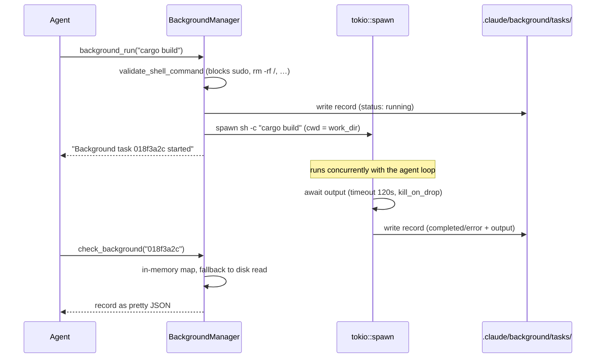

# Background Tasks

This chapter explains Tact's **asynchronous shell execution**: the `background_run` tool starts a command on a `tokio::spawn` task and returns immediately; `check_background` polls status later. Every task is persisted to disk, so results survive polling order — but not process restarts (see §5). The implementation lives in `crates/tact/src/background.rs` with tool wrappers in `crates/tact/src/tool/background_run.rs`.

Background tasks are the "fire-and-forget" counterpart to the synchronous `bash` tool: same shell, same validation, but the agent's turn does not block on completion.

---

## 1. Tool Surface

| Tool | Input | Output |
|------|-------|--------|
| `background_run` | `command: String` | `"Background task <id> started: <command>"` |
| `check_background` | `task_id: Option<String>` | One task as pretty JSON, or a one-line-per-task listing |

Both tools are in the main `toolset()` only. `check_background` with no `task_id` lists all known tasks sorted by start time; with an unknown id it returns an error (`Unknown background task <id>`).

---

## 2. Data Model

```rust
pub enum BackgroundTaskStatus { Running, Completed, Error }   // snake_case in JSON

pub struct BackgroundTaskRecord {
    pub id: String,                        // 8-hex-digit counter, seeded from epoch millis
    pub status: BackgroundTaskStatus,
    pub command: String,
    pub started_at: DateTime<Utc>,
    pub finished_at: Option<DateTime<Utc>>,
    pub output: String,                    // combined stdout + stderr, capped
}
```

`BackgroundManager` holds the records twice:

```rust
records: CollectionStore<BackgroundTaskRecord>,   // .claude/background/tasks/{id}.json
tasks:   Mutex<HashMap<String, BackgroundTaskRecord>>,  // in-memory mirror
next_id: AtomicU64,                                // monotonically increasing id source
```

Unlike the team/worktree managers, `SharedBackgroundManager` wraps `Arc<BackgroundManager>` with an **interior** mutex around just the map — the spawned tokio task needs to write results back without holding a whole-manager lock.

---

## 3. Execution Lifecycle



Details worth knowing:

| Aspect | Behavior |
|--------|----------|
| Shell | `sh -c <command>`, cwd = `ToolContext.work_dir` |
| Validation | `crate::shell::validate_shell_command` — same hard blocklist as `bash` (`sudo`, `rm -rf /`, …) |
| Timeout | Fixed 120 seconds; on expiry status becomes `Error` with `"Error: Timeout (120s)"` |
| Output cap | First 50,000 chars of stdout+stderr; the rest is dropped |
| Exit code | Non-zero exit → `Error`; the code itself is not recorded |
| Process cleanup | `kill_on_drop(true)` — the child is killed if the future is dropped |

The spawned task's final `save_record` result is discarded (`let _ =`); a disk failure at that point loses the outcome silently.

---

## 4. ID Generation

```rust
next_id: AtomicU64::new(Utc::now().timestamp_millis() as u64)
```

IDs are the lower 32 bits of an atomic counter formatted as 8 hex digits (`{:08x}`), seeded from the current epoch milliseconds at manager construction. Sequential within a process, unique enough across restarts in practice — but not guaranteed collision-free if two managers start within the same millisecond or the counter wraps.

---

## 5. Crash Recovery on Startup

`SharedBackgroundManager::new` (called at session startup in `tui.rs`) scans the collection store and repairs orphans: any record still marked `running` belongs to a process that no longer exists, so it is rewritten as:

```text
status: error
output: "Process interrupted (agent restarted)"
```

This is covered by the `marks_stale_running_tasks_on_startup` unit test. The consequence: background tasks **do not survive restarts** — the manager assumes a fresh process means all previous children are dead (true, since they were spawned in-process with `kill_on_drop`).

---

## 6. Interaction with the Agent Loop

`background_run` returns immediately, so from the scheduler's perspective ([Tasks and Tool Scheduling](./11_chapter_task.md)) it is a cheap call — but note that as a shell-adjacent tool it takes its permission classification from the [Permission Model](./10_chapter_permission.md) under the name `background_run`, not `bash`.

There is **no completion notification**: the agent (or the model driving it) must poll `check_background`. A typical pattern the model discovers on its own is `background_run` → continue other work → `check_background` before finishing the turn. The [sleep tool](./07_chapter_tool.md) exists partly to make that polling loop possible.

Unlike synchronous `bash` output, background output is **not** routed through `persist_large_output` ([Context Compaction](./05_chapter_compact.md)) — instead it is hard-capped at 50k chars in the record itself, and the full JSON (including output) lands in context when polled.

---

## 7. Code Map

| File | Role |
|------|------|
| `crates/tact/src/background.rs` | `BackgroundManager`, `SharedBackgroundManager`, record types, spawn logic, startup repair |
| `crates/tact/src/tool/background_run.rs` | `background_run` / `check_background` tools |
| `crates/tact/src/shell.rs` | `validate_shell_command` blocklist shared with `bash` |
| `crates/tact/src/tool/mod.rs` | `ToolContext.background_manager`; registration in `toolset()` |
| `crates/tact/src/bin/tui.rs` | Manager constructed from `StoreRoot` at startup |
| `docs/state_machines.md` | Background job state diagram |

---

## 8. Current Gaps

| Gap | Detail |
|-----|--------|
| Fixed 120s timeout | Not configurable; long builds or test suites always die as `Error: Timeout` |
| No completion push | Agent must poll; there is no `AgentUpdate` or notification when a task finishes |
| No cancellation tool | A running task cannot be killed by the model; only timeout or process exit ends it |
| Output interleaving lost | stdout and stderr are concatenated after completion, not merged by time |
| Exit code discarded | Failure reason beyond the combined output text is unavailable |
| Records accumulate | `.claude/background/tasks/` is never pruned |
| 50k output cap silently truncates | No `<persisted-output>` spill like synchronous `bash` gets |
| ID collisions possible | 32-bit hex counter seeded by wall clock; no uniqueness check against disk |

---

## Related Docs

- [Tool System](./07_chapter_tool.md) — `ToolContext`, `toolset()`, and the synchronous `bash` counterpart
- [Permission Model](./10_chapter_permission.md) — how `background_run` is gated
- [Context Compaction](./05_chapter_compact.md) — the output-spill mechanism background tasks bypass
- [Store and Persistence](./01_chapter_store.md) — the `background/` collection store
- [docs/state_machines.md](../docs/state_machines.md) — background job states
- [ARCHITECTURE.md](../ARCHITECTURE.md) — §7 background tasks row
