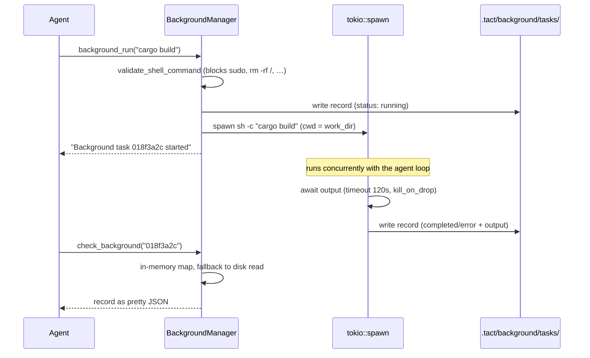

# 后台任务（Background Tasks）

> 语言：[中文](./13_chapter_background_zh.md) · [English](./13_chapter_background.md)

本章说明 Tact 的 **异步 shell 执行**：`background_run` 工具在 `tokio::spawn` 任务上启动命令并立即返回；`check_background` 稍后轮询状态。每个任务持久化到磁盘，结果不受轮询顺序影响 —— 但进程重启后不保留（见 §5）。实现位于 `crates/tact/src/background.rs`，工具包装在 `crates/tact/src/tool/background_run.rs`。

后台任务是同步 `bash` 工具的「即发即忘」对应物：相同 shell、相同校验，但 agent 的一轮不会因完成而阻塞。

---

## 1. 工具表面

| Tool | Input | Output |
|------|-------|--------|
| `background_run` | `command: String` | `"Background task <id> started: <command>"` |
| `check_background` | `task_id: Option<String>` | 单任务 pretty JSON，或每行一个任务的列表 |

两工具仅在主 `toolset()` 中。`check_background` 无 `task_id` 时列出所有已知任务（按开始时间排序）；未知 id 返回错误（`Unknown background task <id>`）。

---

## 2. 数据模型

```rust
pub enum BackgroundTaskStatus { Running, Completed, Error }   // snake_case in JSON

pub struct BackgroundTaskRecord {
    pub id: String,                        // 8 位十六进制计数器，由 epoch millis 播种
    pub status: BackgroundTaskStatus,
    pub command: String,
    pub started_at: DateTime<Utc>,
    pub finished_at: Option<DateTime<Utc>>,
    pub output: String,                    // stdout + stderr 合并，有上限
}
```

`BackgroundManager` 双重持有记录：

```rust
records: CollectionStore<BackgroundTaskRecord>,   // .tact/background/tasks/{id}.json
tasks:   Mutex<HashMap<String, BackgroundTaskRecord>>,  // 内存镜像
next_id: AtomicU64,                                // 单调递增 id 源
```

与 team/worktree manager 不同，`SharedBackgroundManager` 用 `Arc<BackgroundManager>` 包装，**内部** mutex 仅围绕 map —— spawn 的 tokio 任务需写回结果而无需持有整个 manager 锁。

---

## 3. 执行生命周期



值得了解的细节：

| 方面 | 行为 |
|------|------|
| Shell | `sh -c <command>`，cwd = `ToolContext.work_dir` |
| 校验 | `crate::shell::validate_shell_command` — 与 `bash` 相同硬 blocklist（`sudo`、`rm -rf /`、…） |
| 超时 | 固定 120 秒；到期 status 变为 `Error`，附带 `"Error: Timeout (120s)"` |
| 输出上限 | stdout+stderr 前 50,000 字符；其余丢弃 |
| 退出码 | 非零退出 → `Error`；退出码本身不记录 |
| 进程清理 | `kill_on_drop(true)` — future 被 drop 时子进程被 kill |

spawn 任务最终 `save_record` 结果被丢弃（`let _ =`）；该时点磁盘失败会静默丢失结果。

---

## 4. ID 生成

```rust
next_id: AtomicU64::new(Utc::now().timestamp_millis() as u64)
```

ID 为原子计数器低 32 位，格式化为 8 位十六进制（`{:08x}`），在 manager 构造时以当前 epoch 毫秒播种。进程内顺序递增，实践中跨重启足够唯一 —— 但若两 manager 在同一毫秒内启动或计数器回绕，不保证无碰撞。

---

## 5. 启动时崩溃恢复

`SharedBackgroundManager::new`（在 `tui.rs` 会话启动时调用）扫描 collection store 并修复孤儿：仍标记 `running` 的记录属于已不存在的进程，重写为：

```text
status: error
output: "Process interrupted (agent restarted)"
```

单元测试 `marks_stale_running_tasks_on_startup` 覆盖此行为。后果：后台任务 **不跨重启存活** —— manager 假定新进程意味着所有先前子进程已死（成立，因其在进程内 spawn 且 `kill_on_drop`）。

---

## 6. 与 Agent Loop 的交互

`background_run` 立即返回，因此对调度器（[任务与工具调度](./11_chapter_task_zh.md)）是廉价调用 —— 但作为 shell 邻近工具，其权限分类来自 [权限模型](./10_chapter_permission_zh.md)，工具名为 `background_run` 而非 `bash`。

**无完成通知**：agent（或驱动它的模型）必须轮询 `check_background`。模型常自行发现 `background_run` → 继续其他工作 → 结束前 `check_background` 的模式。[sleep 工具](./07_chapter_tool_zh.md) 部分存在是为使该轮询循环可行。

与同步 `bash` 输出不同，后台输出 **不** 经 `persist_large_output`（[上下文压缩](./05_chapter_compact_zh.md)）—— 而是在记录本身硬 cap 50k 字符，轮询时完整 JSON（含 output）进入 context。

---

## 7. 代码地图

| 文件 | 角色 |
|------|------|
| `crates/tact/src/background.rs` | `BackgroundManager`、`SharedBackgroundManager`、记录类型、spawn 逻辑、启动修复 |
| `crates/tact/src/tool/background_run.rs` | `background_run` / `check_background` 工具 |
| `crates/tact/src/shell.rs` | 与 `bash` 共享的 `validate_shell_command` blocklist |
| `crates/tact/src/tool/mod.rs` | `ToolContext.background_manager` |
| `crates/tact/src/tool/registry.rs` | `toolset()` 中的后台工具 |
| `crates/tact-ui/src/headless.rs`、`interactive.rs` | 启动时从 `StoreRoot` 构造 manager |
| `docs/state_machines.md` | 后台 job 状态图 |

---

## 8. 当前缺口

| 缺口 | 详情 |
|------|------|
| 固定 120s 超时 | 不可配置；长构建或测试套件恒为 `Error: Timeout` |
| 无完成 push | Agent 须轮询；任务完成时无 `AgentUpdate` 或通知 |
| 无取消工具 | 运行中任务无法被模型 kill；仅超时或进程退出结束 |
| 输出交错丢失 | stdout 与 stderr 完成后拼接，非按时间合并 |
| 退出码丢弃 | 合并输出文本之外的失败原因不可用 |
| 记录累积 | `.tact/background/tasks/` 从不修剪 |
| 50k 输出 cap 静默截断 | 无同步 `bash` 的 `<persisted-output>` 溢出 |
| ID 可能碰撞 | 32 位 hex 计数器由 wall clock 播种；无对磁盘的唯一性检查 |

---

## Related Docs

- [工具系统](./07_chapter_tool_zh.md) — `ToolContext`、`toolset()` 与同步 `bash` 对应物
- [权限模型](./10_chapter_permission_zh.md) — `background_run` 如何被 gate
- [上下文压缩](./05_chapter_compact_zh.md) — 后台任务绕过的输出溢出机制
- [Store 与持久化](./01_chapter_store_zh.md) — `background/` collection store
- [docs/state_machines.md](../docs/state_machines.md) — 后台 job 状态
- [ARCHITECTURE.md](../ARCHITECTURE.md) — §7 后台任务行
