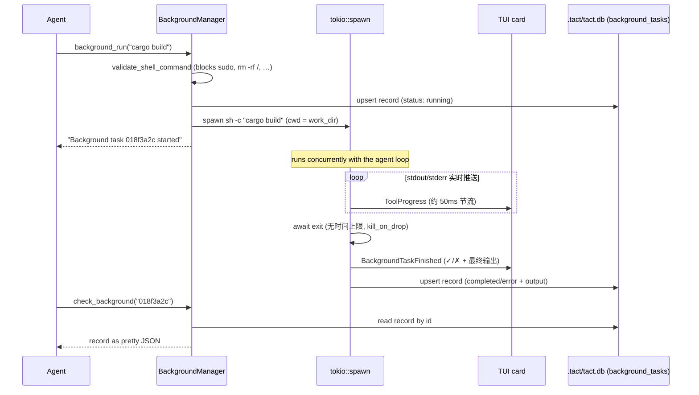

# 后台任务（Background Tasks）

> 语言：[中文](./13_chapter_background_zh.md) · [English](./13_chapter_background.md)

本章说明 Tact 的 **异步 shell 执行**：`background_run` 工具在 `tokio::spawn` 任务上启动命令并立即返回；`wait_background` 阻塞到它结束，`check_background` 则不等待、只查状态。每个任务持久化到磁盘，结果不受轮询顺序影响 —— 但进程重启后不保留（见 §5）。实现位于 `crates/tact/src/background.rs`，工具包装在 `crates/tact/src/tool/background_run.rs`。

后台任务是同步 `bash` 工具的「即发即忘」对应物：相同 shell、相同校验，但 agent 的一轮不会因完成而阻塞。

---

## 1. 工具表面

| Tool | Input | Output |
|------|-------|--------|
| `background_run` | `command: String`、`wait_ms: Option<u64>`（上限 10000） | 立即返回 `"Background task <id> started: <command>"`；设了 `wait_ms` 且命令在窗口内结束时，直接返回任务结果与输出尾部 |
| `check_background` | `task_id: Option<String>` | 单任务 pretty JSON（其 `output` 与等待路径一样只保留尾部），或每行一个任务的列表 |
| `wait_background` | `task_id: Option<String>`、`timeout_ms: Option<u64>` | 已完成任务（状态、耗时、输出尾部、日志路径），或"仍在运行"的原因 |

三个工具仅在主 `toolset()` 中（子 agent 的 shell 工作是同步 `bash`）。`check_background` 无 `task_id` 时列出**本会话**的任务（按开始时间排序）——即便同一项目下所有会话共用同一个 store，一个会话也不会报告另一个会话的活；未知 id 返回错误（`Unknown background task <id>`）。显式给出 `task_id` 时不限会话：那是调用方点名要的。

会话作用域同样适用于 TUI 的 `/background` 列表，也是 `wait_background` / `wait` 在不给 id 时使用的范围。子 agent 根本无法启动后台任务（受限 toolset 里没有 `background_run`）；若将来有了，记录会挂在**子**会话 id 下，父会话的列表不会显示它——届时把范围扩展到子会话即可。

`background_run` 是**启动**原语：它立刻返回 id，任务在后台继续，且**没有时间上限**——任务要么自己跑完，要么因用户取消而结束。它的 `wait_ms` 只是短任务捷径（上限 10 秒），所以慢命令永远不会占住一个回合；等待到期时只回报“仍在运行”，不动任务本身。

`wait_background` 是**等待**原语：任务一到终态就返回，模型不必再猜时长。不给 `task_id` 时等待本会话的所有任务；`timeout_ms` 默认 5 分钟（与 `sleep` 同一上限）。与 `sleep`（future 完全不看取消标志）不同，等待会在下一次轮询（≤ 150 ms）观察到取消，因此在途等待是可打断的。

TUI 用户无需让模型调用工具即可查看后台任务：**`/background`** slash 命令列出所有任务，**`/background <id>`** 显示单个任务（pretty JSON）。该命令向命令 driver 发送 `UserCommand::QueryBackground(Option<String>)`，driver 调用同一个 `SharedBackgroundManager::check`（与工具一样按会话收窄），并把结果以 Markdown（`AgentUpdate::MdInfo`）渲染到日志（[Ch 23](./23_chapter_tui_zh.md) §3）。

**实时输出（类 bash）。** 任务运行期间，其 stdout/stderr 会实时流入 `background_run` 工具卡片（约 50ms 一批节流，实时预览保留最近 ~4 KB），与同步 `bash` 卡片完全一致。即使调用已返回，卡片仍保持运行态，进程退出时以 ✓/✗、耗时与最终输出收尾（见 §3 与 §6）。收尾后与其它已完成的命令一样折叠：只剩 title + meta 两行，输出移到双击弹窗里（见 [Ch 23](./23_chapter_tui_zh.md) §6.16）。

---

## 2. 数据模型

```rust
pub enum BackgroundTaskStatus { Running, Completed, Error }   // snake_case in JSON

pub struct BackgroundTaskRecord {
    pub id: String,                        // 8 位十六进制计数器，由 epoch millis 播种
    pub status: BackgroundTaskStatus,
    pub command: String,
    pub session_id: String,                // 所属 agent 会话；会话外为 ""
    pub started_at: DateTime<Utc>,
    pub finished_at: Option<DateTime<Utc>>,
    pub output: String,                    // stdout + stderr 合并，有上限
    pub output_path: Option<String>,       // <workdir>/.tact/background/<id>.log，全量输出
}
```

**混合存储（hybrid）。** DB 记录保留元数据与输出前 50,000 字符（有界、轮询便宜），而 **完整** stdout+stderr 流随到达即追加写入 `<workdir>/.tact/background/<id>.log`。`output_path` 字段指向该文件，agent（或人）可用 `bash` 工具 `tail` / `grep` 全量日志，而无需把 50k JSON 塞进 context。文件创建是 best-effort：失败时任务照常运行，DB 记录仍持有截断输出。

`BackgroundManager` 持有 store 与 id 源：

```rust
records: Arc<dyn BackgroundStore>,   // .tact/tact.db → background_tasks 表
next_id: AtomicU64,                  // 单调递增 id 源
```

**没有内存镜像**：SQLite 连接池串行化写入，数据库是唯一数据源，因此 `SharedBackgroundManager` 用 `Arc<BackgroundManager>` 包装且无内部 mutex —— spawn 的 tokio 任务通过克隆的 store 句柄写回结果。

---

## 3. 执行生命周期


```mermaid
sequenceDiagram
    participant Agent
    participant BM as BackgroundManager
    participant Task as tokio::spawn
    participant TUI as TUI card
    participant DB as .tact/tact.db (background_tasks)

    Agent->>BM: background_run("cargo build")
    BM->>BM: validate_shell_command (blocks sudo, rm -rf /, …)
    BM->>DB: upsert record (status: running)
    BM->>Task: spawn sh -c "cargo build" (cwd = work_dir)
    BM-->>Agent: "Background task 018f3a2c started"

    Note over Task: runs concurrently with the agent loop

    loop stdout/stderr 实时推送
        Task->>TUI: ToolProgress (约 50ms 节流)
    end
    Task->>Task: await exit (无时间上限, kill_on_drop)
    Task->>TUI: BackgroundTaskFinished (✓/✗ + 最终输出)
    Task->>DB: upsert record (completed/error + output)

    Agent->>BM: check_background("018f3a2c")
    BM->>DB: read record by id
    BM-->>Agent: record as pretty JSON
```

值得了解的细节：

| 方面 | 行为 |
|------|------|
| Shell | `sh -c <command>`，cwd = `ToolContext.work_dir` |
| 校验 | `crate::shell::validate_shell_command` — 与 `bash` 相同硬 blocklist（`sudo`、`rm -rf /`、…） |
| 超时 | **没有。** 任务一直运行到命令退出或会话被取消——构建与测试套件可以跑任意久 |
| 取消 | 会话的取消标志（Esc / 取消）会终止该会话所有运行中的任务：标志在进度 tick（约 50 ms）上被检查，`SIGKILL` 发给任务的**进程组**，因此 `cargo`/`npm` 等孙进程随 shell 一起死，而不是变成孤儿继续跑。status 变为 `Error`，内容为 `Cancelled by the user` |
| 实时推送 | stdout/stderr 增量读取并以 `AgentUpdate::ToolProgress` 推送（约 50ms 一批，实时预览保留最近 ~4 KB）；不再等完成后一次性缓冲 |
| 输出上限 | stdout+stderr 前 50,000 字符持久化到记录；**全量**输出追加到 `<workdir>/.tact/background/<id>.log`（见 `output_path`） |
| 退出码 | 非零退出 → `Error`；退出码本身不记录 |
| 进程清理 | `kill_on_drop(true)` — future 被 drop 时子进程被 kill |

spawn 任务最终 `save_record` 结果被丢弃（`let _ =`）；该时点磁盘失败会静默丢失结果。

---

## 4. ID 生成

```rust
next_id: AtomicU64::new(Utc::now().timestamp_millis() as u64)
```

ID 为原子计数器低 32 位，格式化为 8 位十六进制（`{:08x}`），在 manager 构造时以当前 epoch 毫秒播种。进程内顺序递增，实践中跨重启足够唯一 —— 但若两 manager 在同一毫秒内启动或计数器回绕，不保证无碰撞。

---

## 5. 启动时崩溃恢复

`BackgroundManager::new`（在 `headless.rs` / `interactive.rs` 会话启动时调用）扫描 `background_tasks` 表并修复孤儿：仍标记 `running` 的记录属于已不存在的进程，重写为：

```text
status: error
output: "Process interrupted (agent restarted)"
```

单元测试 `marks_stale_running_tasks_on_startup` 覆盖此行为。后果：后台任务 **不跨重启存活** —— manager 假定新进程意味着所有先前子进程已死（成立，因其在进程内 spawn 且 `kill_on_drop`）。

---

## 6. 与 Agent Loop 的交互

`background_run` 立即返回，因此对调度器（[任务与工具调度](./11_chapter_task_zh.md)）是廉价调用 —— 但作为 shell 邻近工具，其权限分类来自 [权限模型](./10_chapter_permission_zh.md)，工具名为 `background_run` 而非 `bash`。

**TUI 获得实时进度 + 完成事件。** spawn 的任务在运行期间向该调用的工具卡片推送 `AgentUpdate::ToolProgress`，退出时再推送 `AgentUpdate::BackgroundTaskFinished`（keep-live 卡片契约见 [Ch 25](./25_chapter_protocol_zh.md)）。但 **模型/agent 仍无完成 push**，所以要主动问：`wait_background` 会阻塞到任务结束，并在同一次调用里返回结果；`background_run(wait_ms:)` 对刚启动的命令做同样的事。只有当这一回合确实还有别的活要干时，才该退回轮询 `check_background`（或用 `sleep` 烧时间）。

与同步 `bash` 输出不同，后台输出 **不** 经 `persist_large_output`（[上下文压缩](./05_chapter_compact_zh.md)）—— 记录硬 cap 50k 字符，而这仍远超应当进入 context 的体量。因此所有面向模型的读法都只报告**有界尾部**：`wait_background`、`background_run(wait_ms:)` 与 `check_background <id>` 共用同一份 `background::output_tail`，把 `output` 截到最后 4,000 字符并附上日志路径。**全量**流在磁盘上：记录带 `output_path`，agent 可用 `bash tail <path>` / `grep error <path>` 深挖。`check_background` 的列表形式（无 `task_id`）每行追加 `(log: <path>)`，无需逐个调用即可发现路径。

---

## 7. 代码地图

| 文件 | 角色 |
|------|------|
| `crates/tact/src/store/background_store/mod.rs` | `BackgroundStore` trait（async：upsert/get/list） |
| `crates/tact/src/store/background_store/sqlite.rs` | `SqliteBackgroundStore` — `background_tasks` 表 |
| `crates/tact/src/background.rs` | `BackgroundManager`、`SharedBackgroundManager`、记录类型、spawn 逻辑、启动修复 |
| `crates/tact/src/tool/background_run.rs` | `background_run` / `check_background` 工具 |
| `crates/tact/src/shell.rs` | 与 `bash` 共享的 `validate_shell_command` blocklist |
| `crates/tact/src/tool/mod.rs` | `ToolContext.background_manager` |
| `crates/tact/src/tool/registry.rs` | `toolset()` 中的后台工具 |
| `crates/tact-ui/src/headless.rs`、`interactive.rs` | 启动时从 `tact.db` 构造 manager |
| `docs/state_machines.md` | 后台 job 状态图 |

---

## 8. 当前缺口

| 缺口 | 详情 |
|------|------|
| 只能靠取消提前结束 | 没有按任务 kill 的工具：要结束运行中的任务就得取消回合（会停掉该会话**所有**任务）。模型可用的 `kill_background` 是后续可做的 |
| 模型无完成 push | TUI 卡片会收到 `BackgroundTaskFinished`，但 **模型** 不会被动收到任何东西：它必须主动问（`wait_background`、`background_run(wait_ms:)`）或轮询 `check_background` |
| 输出交错丢失 | stdout 与 stderr 完成后拼接，非按时间合并 |
| 退出码丢弃 | 合并输出文本之外的失败原因不可用 |
| 日志文件 best-effort | `<workdir>/.tact/background/<id>.log` 创建失败时，仅剩 DB 截断记录 |
| 日志文件累积 | `.tact/background/*.log` 从不清理（生命周期与 `background_tasks` 表一致） |
| 记录累积 | `background_tasks` 表从不修剪 |
| DB 记录仍 cap 50k | 轮询 JSON 的 `output` 是截断的；完整文本只在日志文件中 |
| ID 可能碰撞 | 32 位 hex 计数器由 wall clock 播种；无对磁盘的唯一性检查 |
| 不受沙箱约束 | `background_run` 自己在宿主上起 `sh -c`；可选的 `bash` 沙箱（[Ch 7](./07_chapter_tool_zh.md) §7.1、[Ch 27](./27_chapter_sandbox_zh.md)）不覆盖它 |

---

## Related Docs

- [工具系统](./07_chapter_tool_zh.md) — `ToolContext`、`toolset()` 与同步 `bash` 对应物
- [权限模型](./10_chapter_permission_zh.md) — `background_run` 如何被 gate
- [上下文压缩](./05_chapter_compact_zh.md) — 后台任务绕过的输出溢出机制
- [Store 与持久化](./01_chapter_store_zh.md) — `background_tasks` SQLite 表
- [docs/state_machines.md](../docs/state_machines.md) — 后台 job 状态
- [ARCHITECTURE.md](../ARCHITECTURE.md) — §7 后台任务行
