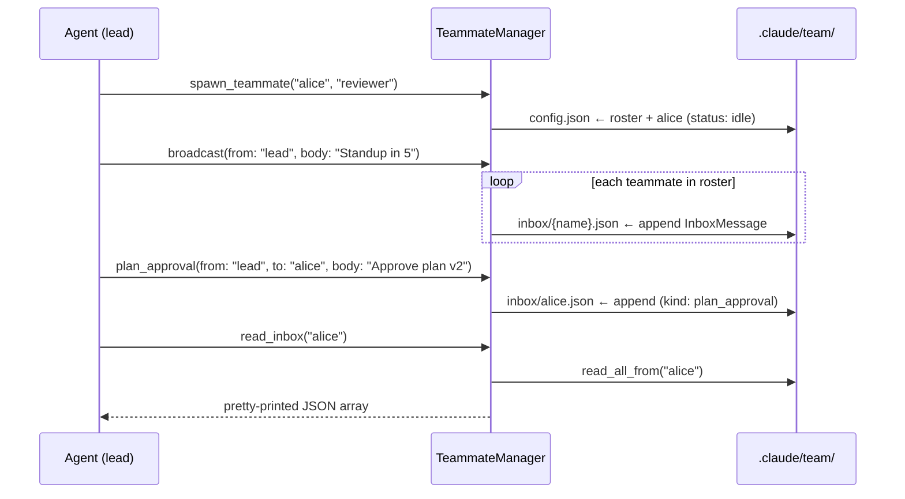

# Team Coordination

This chapter explains Tact's **multi-agent team primitives**: a persistent roster of named teammates and a file-backed inbox system supporting point-to-point messages, broadcasts, and structured protocol requests (plan approval, shutdown). The implementation lives in `crates/tact/src/team.rs` with tool wrappers in `crates/tact/src/tool/team.rs`.

Important framing up front: today this is a **coordination data layer**, not an orchestration engine. "Spawning" a teammate creates a roster record — it does not start a second agent process. See [Current Gaps](#8-current-gaps).

---

## 1. What the Team Layer Provides

| Capability | Tool | Backing call |
|------------|------|--------------|
| Register a teammate | `spawn_teammate` | `TeammateManager::spawn_teammate` |
| List the roster | `list_teammates` | `list_teammates` |
| Point-to-point message | `send_message` | `send_message` |
| Message everyone | `broadcast` | `broadcast` |
| Read an inbox | `read_inbox` | `read_inbox` |
| Plan approval request | `plan_approval` | `protocol_request(kind = "plan_approval")` |
| Shutdown handshake | `shutdown_request` / `shutdown_response` | `protocol_request(kind = "shutdown_request" / "shutdown_response")` |

All eight tools are registered in the main agent's `toolset()`; none are in `subagent_toolset()`.

---

## 2. Data Model

### Roster

```rust
pub struct TeammateRecord {
    pub name: String,
    pub role: String,
    pub status: String,   // always "idle" today
}

pub struct TeamConfig {
    pub teammates: Vec<TeammateRecord>,
}
```

### Inbox messages

```rust
pub struct InboxMessage {
    pub from: String,
    pub to: String,
    pub body: String,
    pub kind: String,     // "message" | "plan_approval" | "shutdown_request" | "shutdown_response"
    pub created_at: DateTime<Utc>,
}
```

`kind` distinguishes plain chat from protocol traffic; the storage path is identical for both.

---

## 3. Storage Layout

`TeammateManager` combines the two JSON store primitives from [Store and Persistence](./01_chapter_store.md):

```rust
config:  root.file("team/config.json")?,     // Store<TeamConfig> — the roster
inboxes: root.collection("team/inbox")?,     // CollectionStore<InboxMessage> — one JSONL file per owner
```

On disk:

```text
.claude/
└── team/
    ├── config.json          # roster: [{name, role, status}, …]
    └── inbox/
        ├── alice.json       # one InboxMessage JSON line per delivery
        └── bob.json
```

Messages are **appended** (JSONL) — inboxes only grow; there is no read-cursor, ack, or delete.

---

## 4. Message Flow



Notes on the semantics:

- `spawn_teammate` rejects duplicate names (`teammate {name} already exists`).
- `broadcast` iterates the roster and calls `send_message` per teammate — a sender who is also on the roster receives their own broadcast.
- `read_inbox` returns the **entire** inbox as pretty-printed JSON, or `"Inbox is empty."`.
- `protocol_request` is `send_message` with a caller-chosen `kind` — no state machine validates that a `shutdown_response` follows a `shutdown_request`.

---

## 5. Concurrency Wrapper

`SharedTeammateManager` follows the same pattern as the task, worktree, and background managers:

```rust
pub struct SharedTeammateManager {
    inner: Arc<Mutex<TeammateManager>>,
}
```

Every public method delegates through `with_manager`, which locks the mutex and surfaces poisoning as an error. The shared handle sits on `ToolContext.teammate_manager` and is constructed once at startup in `tui.rs`:

```rust
let teammate_manager = SharedTeammateManager::new(TeammateManager::new(&store_root)?);
```

Since all tools in one process share the same manager, in-process access is serialized; cross-process access is not (the JSON store has no file locking).

---

## 6. Who Is a "Teammate", Really?

The model is free-form by design: `from` and `to` are plain strings supplied by the LLM. Nothing verifies that:

- the sender exists on the roster,
- the recipient exists (sending to an unknown name silently creates `inbox/{name}.json`),
- a teammate ever reads its inbox.

The intended pattern is that a coordinating agent uses the roster as shared state and inboxes as durable mailboxes for whatever worker abstraction eventually consumes them ([sub-agents](./07_chapter_tool.md) run via the `task` tool are the closest existing analogue, but they are not wired to inboxes today).

---

## 7. Code Map

| File | Role |
|------|------|
| `crates/tact/src/team.rs` | `TeammateManager`, `SharedTeammateManager`, `TeamConfig`, `InboxMessage` |
| `crates/tact/src/tool/team.rs` | The eight `#[tool]` wrappers |
| `crates/tact/src/tool/mod.rs` | `ToolContext.teammate_manager`; tools registered in `toolset()` |
| `crates/tact/src/bin/tui.rs` | Manager constructed from `StoreRoot` at startup |
| `crates/tact/src/store/mod.rs` | `Store` / `CollectionStore` primitives used underneath |

---

## 8. Current Gaps

| Gap | Detail |
|-----|--------|
| No actual agent processes | `spawn_teammate` records a name; no runtime, LLM loop, or inbox polling is started |
| Status never changes | Every teammate is `"idle"` forever; no API mutates `status` |
| No sender/recipient validation | Messages to unknown names create orphan inbox files silently |
| Inboxes grow unboundedly | Append-only JSONL with no read-cursor, ack, or pruning |
| Protocol kinds are convention only | `plan_approval` / `shutdown_*` have no enforced request-response pairing |
| No teammate removal | There is no `remove_teammate`; the roster can only grow |
| No cross-process locking | Concurrent tact processes can interleave roster read-modify-write |

---

## Related Docs

- [Store and Persistence](./01_chapter_store.md) — `Store` / `CollectionStore` primitives and `team/` paths
- [Tool System](./07_chapter_tool.md) — `ToolContext` plumbing and sub-agent toolsets
- [Subagents](./12_chapter_subagent.md) — `task` runs a real nested agent; teammates do not
- [Worktree Lanes](./15_chapter_worktree.md) — the isolation primitive a real multi-agent team would pair with
- [ARCHITECTURE.md](../ARCHITECTURE.md) — §7 sub-agents, team, tasks, worktrees
