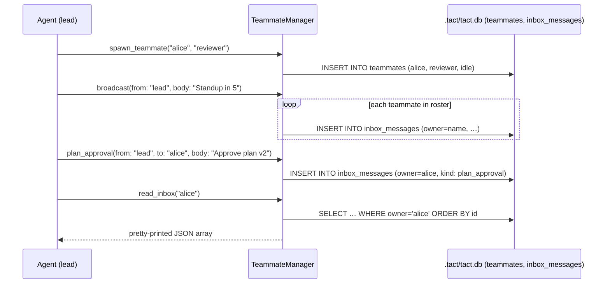

# Team Coordination
> Language: [English](./14_chapter_team.md) · [中文](./14_chapter_team_zh.md)

This chapter explains Tact's **multi-agent team primitives**: a persistent roster of named teammates and a SQLite-backed inbox system supporting point-to-point messages, broadcasts, and structured protocol requests (plan approval, shutdown). The implementation lives in `crates/tact/src/team.rs` with tool wrappers in `crates/tact/src/tool/team.rs`.

Important framing up front: today this is a **coordination data layer**, not an orchestration engine. "Spawning" a teammate creates a roster record — it does not start a second agent process. See [Current Gaps](#8-current-gaps).

---

## 1. What the Team Layer Provides

| Capability | Tool | Backing call |
|------------|------|--------------|
| Register a teammate | `spawn_teammate` | `TeammateManager::spawn_teammate` |
| List the roster | `list_teammates` | `list_teammates` |
| Point-to-point message | `send_message` | `send_message` |
| Message everyone | `broadcast` | `broadcast` |
| Read an inbox | `read_inbox` | `read_inbox` |
| Plan approval request | `plan_approval` | `protocol_request(kind = "plan_approval")` |
| Shutdown handshake | `shutdown_request` / `shutdown_response` | `protocol_request(kind = "shutdown_request" / "shutdown_response")` |

All eight tools are registered in the main agent's `toolset()`; none are in `subagent_toolset()`.

---

## 2. Data Model

### Roster

```rust
pub struct TeammateRecord {
    pub name: String,
    pub role: String,
    pub status: String,   // always "idle" today
}
```

### Inbox messages

```rust
pub struct InboxMessage {
    pub from: String,
    pub to: String,
    pub body: String,
    pub kind: String,     // "message" | "plan_approval" | "shutdown_request" | "shutdown_response"
    pub created_at: DateTime<Utc>,
}
```

`kind` distinguishes plain chat from protocol traffic; the storage path is identical for both.

---

## 3. Storage Layout

`TeammateManager` is backed by the SQLite `TeamStore` from [Store and Persistence](./01_chapter_store.md):

```rust
store: Box<dyn TeamStore>,   // tact.db → teammates + inbox_messages tables
```

Schema (`crates/tact/src/store/team_store/sqlite.rs`):

```text
teammates(name TEXT PRIMARY KEY, role TEXT NOT NULL, status TEXT NOT NULL DEFAULT 'idle')
inbox_messages(id INTEGER PRIMARY KEY AUTOINCREMENT,
               owner TEXT NOT NULL, from_name TEXT NOT NULL, to_name TEXT NOT NULL,
               body TEXT NOT NULL, kind TEXT NOT NULL, created_at INTEGER NOT NULL)
-- index: idx_inbox_messages_owner ON inbox_messages(owner)
```

Messages are **appended** (insertion order preserved by the autoincrement `id`) — inboxes only grow; there is no read-cursor, ack, or delete. The legacy `team/config.json` + `team/inbox/*.json` files are no longer read and are left on disk.

---

## 4. Message Flow


```mermaid
sequenceDiagram
    participant Lead as Agent (lead)
    participant TM as TeammateManager
    participant DB as .tact/tact.db (teammates, inbox_messages)

    Lead->>TM: spawn_teammate("alice", "reviewer")
    TM->>DB: INSERT INTO teammates (alice, reviewer, idle)

    Lead->>TM: broadcast(from: "lead", body: "Standup in 5")
    loop each teammate in roster
        TM->>DB: INSERT INTO inbox_messages (owner=name, …)
    end

    Lead->>TM: plan_approval(from: "lead", to: "alice", body: "Approve plan v2")
    TM->>DB: INSERT INTO inbox_messages (owner=alice, kind: plan_approval)

    Lead->>TM: read_inbox("alice")
    TM->>DB: SELECT … WHERE owner='alice' ORDER BY id
    TM-->>Lead: pretty-printed JSON array
```

Notes on the semantics:

- `spawn_teammate` rejects duplicate names (`teammate {name} already exists`; the UNIQUE `name` key is the backstop).
- `broadcast` iterates the roster and calls `send_message` per teammate — a sender who is also on the roster receives their own broadcast.
- `read_inbox` returns the **entire** inbox as pretty-printed JSON, or `"Inbox is empty."`.
- `protocol_request` is `send_message` with a caller-chosen `kind` — no state machine validates that a `shutdown_response` follows a `shutdown_request`.

---

## 5. Concurrency Wrapper

`SharedTeammateManager` follows the same pattern as the task, cron, and background managers:

```rust
pub struct SharedTeammateManager {
    inner: Arc<TeammateManager>,
}
```

Every public method delegates to the async facade. The shared handle sits on `ToolContext.teammate_manager` and is constructed once at startup in `tui.rs`:

```rust
let teammate_manager = SharedTeammateManager::new(TeammateManager::new(&tact_path.session_db_path()).await?);
```

No mutex is needed: the SQLite pool serializes writes, and the connection pool (with `busy_timeout`) also serializes cross-process access to the same workdir.

---

## 6. Who Is a "Teammate", Really?

The model is free-form by design: `from` and `to` are plain strings supplied by the LLM. Nothing verifies that:

- the sender exists on the roster,
- the recipient exists (sending to an unknown name silently creates `inbox/{name}.json`),
- a teammate ever reads its inbox.

The intended pattern is that a coordinating agent uses the roster as shared state and inboxes as durable mailboxes for whatever worker abstraction eventually consumes them ([sub-agents](./07_chapter_tool.md) run via the `spawn_subagent` tool are the closest existing analogue, but they are not wired to inboxes today).

---

## 7. Code Map

| File | Role |
|------|------|
| `crates/tact/src/team.rs` | `TeammateManager`, `SharedTeammateManager`, `InboxMessage` |
| `crates/tact/src/store/team_store/mod.rs` | `TeamStore` trait (async: create_teammate/list_teammates/append_message/read_inbox) |
| `crates/tact/src/store/team_store/sqlite.rs` | `SqliteTeamStore` — `teammates` + `inbox_messages` tables |
| `crates/tact/src/tool/team.rs` | The eight `#[tool]` wrappers |
| `crates/tact/src/tool/mod.rs` | `ToolContext.teammate_manager` |
| `crates/tact/src/tool/registry.rs` | Team tools in `toolset()` |
| `crates/tact-ui/src/headless.rs`, `interactive.rs` | Manager constructed from `tact.db` at startup |

---

## 8. Current Gaps

| Gap | Detail |
|-----|--------|
| No actual agent processes | `spawn_teammate` records a name; no runtime, LLM loop, or inbox polling is started |
| Status never changes | Every teammate is `"idle"` forever; no API mutates `status` |
| No sender/recipient validation | Messages to unknown names create orphan inbox rows silently |
| Inboxes grow unboundedly | Append-only rows with no read-cursor, ack, or pruning |
| Protocol kinds are convention only | `plan_approval` / `shutdown_*` have no enforced request-response pairing |
| No teammate removal | There is no `remove_teammate`; the roster can only grow |
| No cross-process locking | Concurrent tact processes can interleave roster writes |

---

## Related Docs

- [Store and Persistence](./01_chapter_store.md) — the `teammates` / `inbox_messages` SQLite tables
- [Tool System](./07_chapter_tool.md) — `ToolContext` plumbing and sub-agent toolsets
- [Subagents](./12_chapter_subagent.md) — `spawn_subagent` runs a real nested agent; teammates do not
- [Worktree Lanes](./15_chapter_worktree.md) — the isolation primitive a real multi-agent team would pair with
- [ARCHITECTURE.md](../ARCHITECTURE.md) — §7 sub-agents, team, tasks, worktrees
